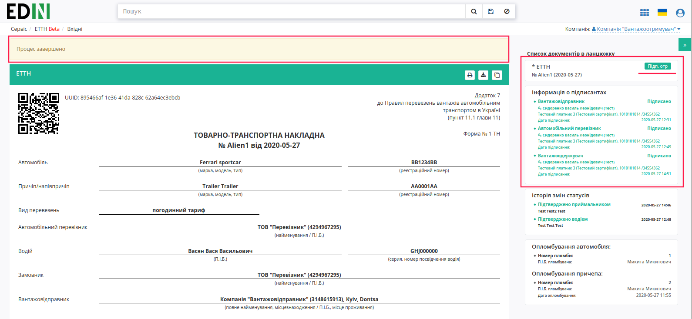
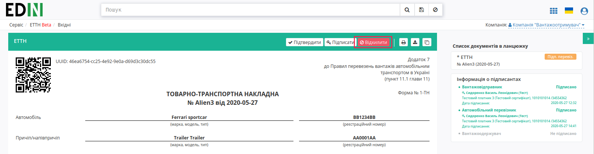
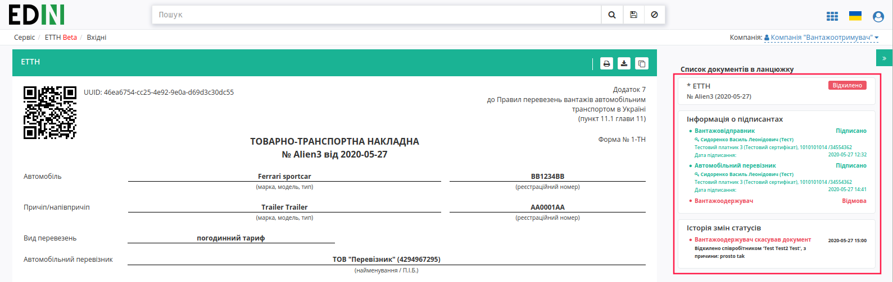
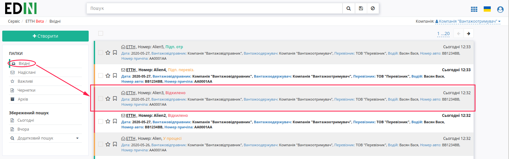

Підписання або відхилення е-ТТН вантажоодержувачем
###################################################################################################

.. сюда закину немного картинок для текста

.. |drop_pass| image:: signing/drop_pass.png

.. |del_key| image:: signing/del_key.png

.. role:: red

.. role:: underline

Підписана з боку перевізника е-ТТН відображається в папці "Вхідні".

.. image:: pics_Signing_rejection_ETTN_consignee/Signing_rejection_ETTN_consignee_01.png
   :align: center

.. important:: Підписання е-ТТН вантажоодержувачем можливе тільки після підписання перевізником (статус документу – "Підтверджено Перевізником").

.. important::
    В залежності від внутрішньої схеми **"Вантажоодержувача"** документ перед "Підписанням" (2) може бути "Підтверджений" (1) приймальником. Також у **"Вантажоодержувача"** є можливість "Відхилити" (3) документ. 

.. image:: pics_Signing_rejection_ETTN_consignee/Signing_rejection_ETTN_consignee_02.png
   :align: center

Після підтвердження (кнопка **"Підтвердити"**) документ у вхідних змінює свій статус на "Підтверджено приймальником", а також в **"Історії змін статусів"** додається інформація про співробітника, що здійснив "підтвердження":

.. image:: pics_Signing_rejection_ETTN_consignee/Signing_rejection_ETTN_consignee_03.png
   :align: center

**Підписання документа**
==============================================================

Для підписання е-ТТН **"Вантажоодержувачу"** потрібно відкрити документ та натиснути на кнопку **"Підписати"**.

.. image:: pics_Signing_rejection_ETTN_consignee/Signing_rejection_ETTN_consignee_05.png
   :align: center

Після ініціалізації бібліотеки підписання, система надасть можливість додати ключ для підписання. При :underline:`першому` підписанні у модальному вікні потрібно обрати файл чи токен (1), ввести пароль (2) та натиснути **"Считати"** (3) ключ для підписання:

.. image:: signing/file1.png
   :align: center

.. image:: signing/file2.png
   :align: center

При успішному додаванні ключа автоматично відобразиться особа, від імені якої буде здійснено підписання. У користувача може бути додано кілька ключів - для вибору потрібного для здійснення операції підписання потрібно проставити відмітку (4) лівою кнопкою миші і натиснути "Підписати" (5):

.. image:: signing/file3.png
   :align: center

.. important::
   Якщо підписання цим ключем вже було здійснено або знайдена невідповідність даних ЄДРПОУ/ІПН (перевірка), то підписання блокується, а користувачу виводиться відповідне повідомлення:

.. image:: signing/wrong_key.png
   :align: center

Додатково в вікні підписання можливо натиснути **"Детальніше"** для того, щоб переглянути інформацію про підписанта, обрати за необхідності посаду, скинути пароль активного ключа (|drop_pass|) чи видалити помилкові (|del_key|).

При подальшій роботі з раніше доданим ключем/-ами потрібно вводити лише пароль для обраного ключа:

.. image:: signing/file4.png
   :align: center

Після підписання е-ТТН інформація щодо підписантів відображається в документі ТТН у списку документів у ланцюжку, документ змінює статус на "Підписано вантажоодержувачем".

Після підписання документ з оновленим статусом відображається в журналі вхідних документів:

.. image:: pics_Signing_rejection_ETTN_consignee/Signing_rejection_ETTN_consignee_11.png
   :align: center

**Відхилення документа**
==============================================================

У **"Вантажоодержувача"** є можливість відхилити е-ТТН **до підписання**. Для цього потрібно натиснути на кнопку **"Відхилити"**:

Після чого в модульному вікні обов'язково потрібно заповнити причину відміни документа:

.. image:: pics_Signing_rejection_ETTN_consignee/Signing_rejection_ETTN_consignee_13.png
   :align: center

Для відхиленної **"Вантажоодержувачем"** е-ТТН присвоюється статус "Відхилено", робляться відповідні помітки червоним кольором:

Документ з цим статусом відображається у "Вхідних" **"Вантажоодержувача"**.

.. include:: kontakti.rst

