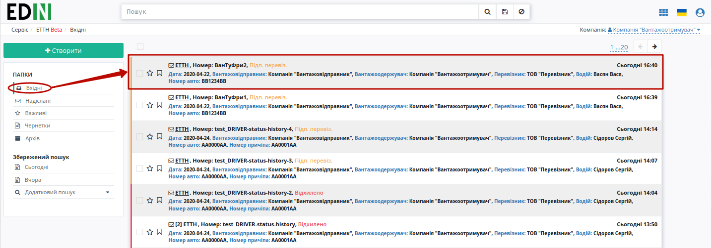
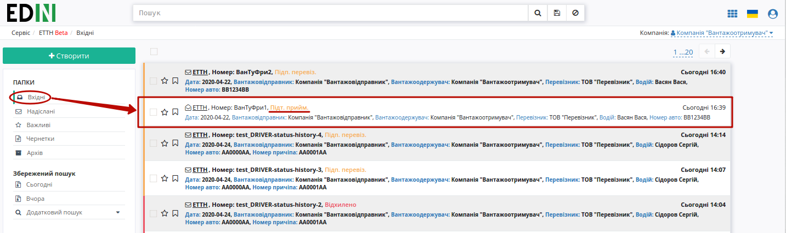
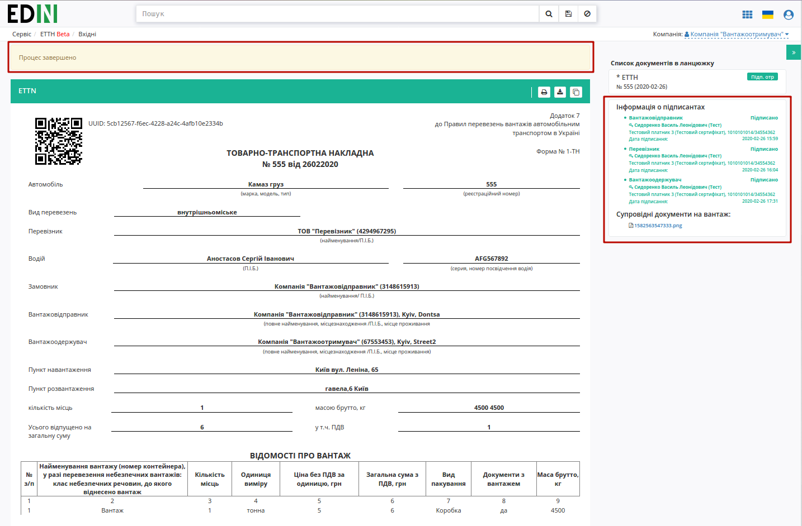
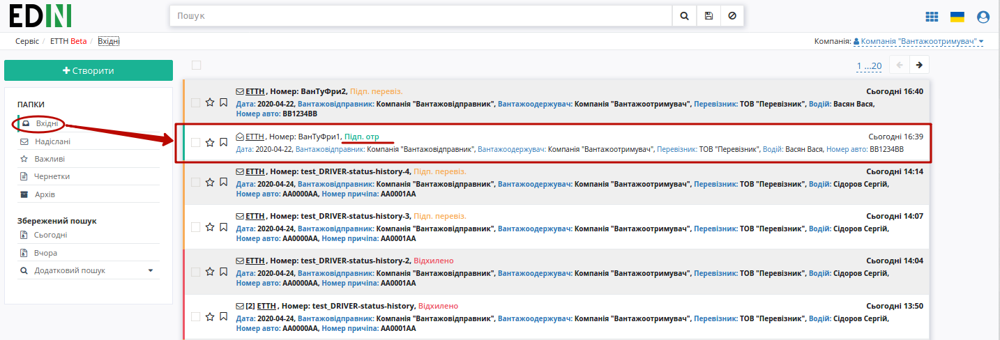
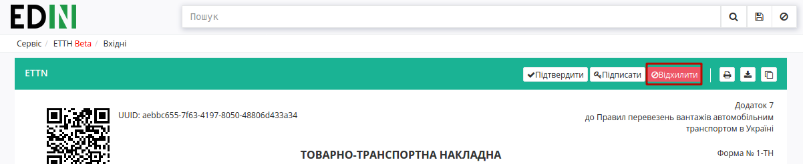
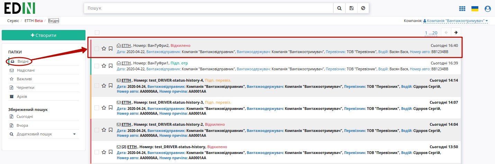

Підписання або відхилення е-ТТН вантажоодержувачем
###################################################################################################

.. role:: red

.. role:: underline

Підписана з боку перевізника е-ТТН відображається в папці "Вхідні".

.. important:: Підписання е-ТТН вантажоодержувачем можливе тільки після підписання перевізником (статус документу – "Підтверджено Перевізником").

.. important::
    В залежності від внутрішньої схеми **"Вантажоодержувача"** документ перед "Підписанням" (2) може бути "Підтверджений" (1) приймальником. Також у **"Вантажоодержувача"** є можливість "Відхилити" (3) документ. 

.. image:: pics_Signing_rejection_ETTN_consignee/Signing_rejection_ETTN_consignee_02a.png
   :align: center

Після підтвердження (кнопка **"Підтвердити"**) документ у вхідних змінює свій статус на "Підтверджено приймальником":

.. image:: pics_Signing_rejection_ETTN_consignee/Signing_rejection_ETTN_consignee_03a.png
   :align: center

**Підписання документа**
==============================================================

Для підписання е-ТТН **"Вантажоодержувачу"** потрібно відкрити документ та натиснути на кнопку **"Підписати"**.

.. image:: pics_Signing_rejection_ETTN_consignee/Signing_rejection_ETTN_consignee_05a.png
   :align: center

Після ініціалізації бібліотеки підписання, система надасть можливість додати ключ для підписання. При :underline:`першому` підписанні необхідно додати файловий ключ. Для цього у модальному вікні потрібно обрати файл (2) і ввести пароль (1):

.. image:: pics_Signing_rejection_ETTN_consignee/Signing_rejection_ETTN_consignee_06a.png
   :align: center

Після чого натиснути кнопку **"Додати"**:

.. image:: pics_Signing_rejection_ETTN_consignee/Signing_rejection_ETTN_consignee_07a.png
   :align: center

При успішному додаванні ключа автоматично відобразиться вибрана особа, від імені якої буде здійснено підписання (кнопка **"Підписати"**):

.. image:: pics_Signing_rejection_ETTN_consignee/Signing_rejection_ETTN_consignee_08a.png
   :align: center

При подальшій роботі з раніше доданим ключем/-ами потрібно вводити лише пароль для обраного ключа:

.. image:: pics_Signing_rejection_ETTN_consignee/Signing_rejection_ETTN_consignee_09a.png
   :align: center

Після підписання е-ТТН інформація щодо підписантів відображається в документі ТТН у списку документів у ланцюжку.

Після підписання перевізником е-ТТН присвоєно статус "Підписано".

**Відхилення документа**
==============================================================

У **"Вантажоодержувача"** є можливість відхилити е-ТТН **до підписання**. Для цього потрібно натиснути на кнопку **"Відхилити"**:

 Після чого в модульному вікні обов'язково потрібно заповнити причину відміни документа:

.. image:: pics_Signing_rejection_ETTN_consignee/Signing_rejection_ETTN_consignee_13a.png
   :align: center

.. image:: pics_Signing_rejection_ETTN_consignee/Signing_rejection_ETTN_consignee_14a.png
   :align: center

Для відхиленної **"Вантажоодержувачем"** е-ТТН присвоєно статус "Відхилено". Документ з цим статусом відображається у "Вхідних" **"Вантажоодержувача"**.

.. include:: kontakti.rst

