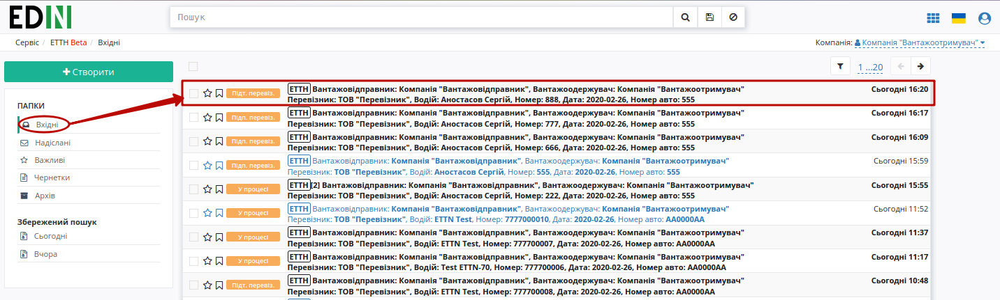
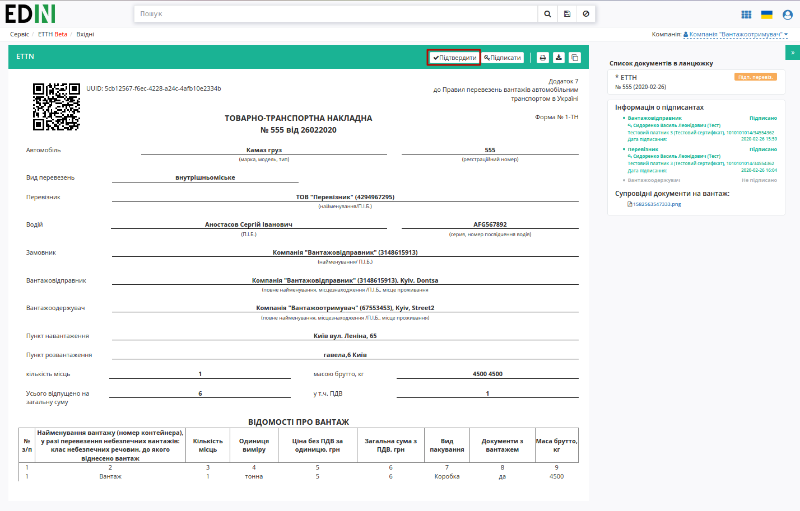
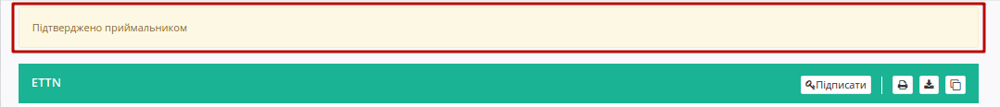
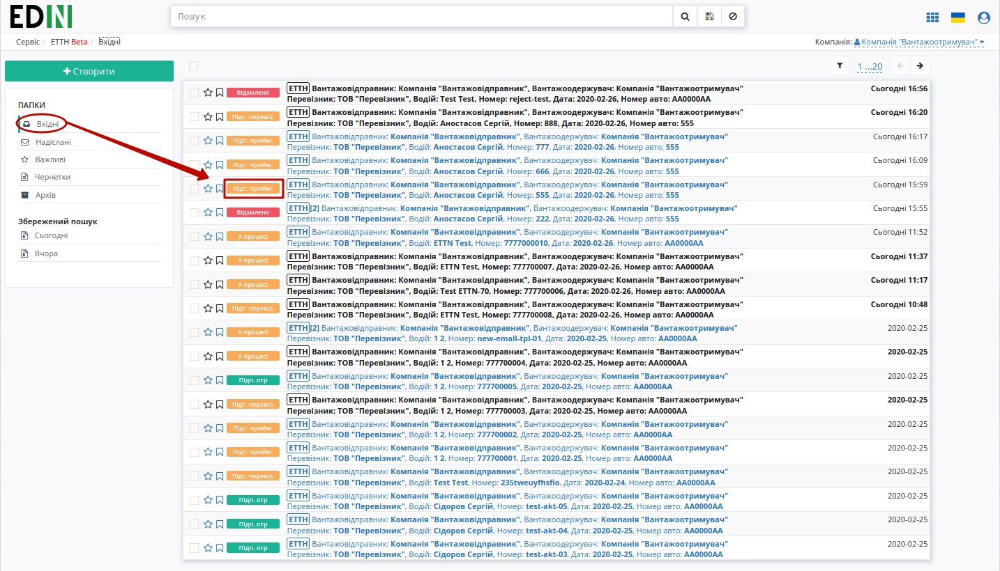
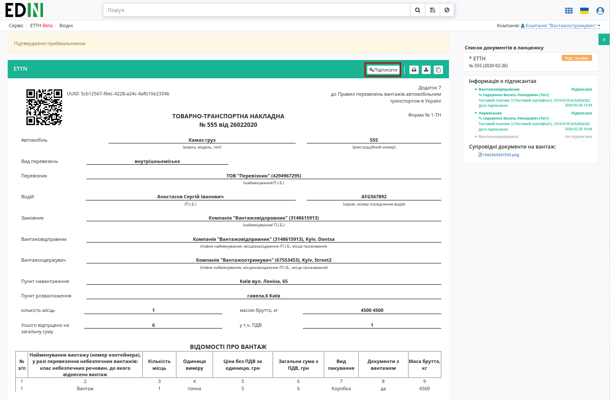
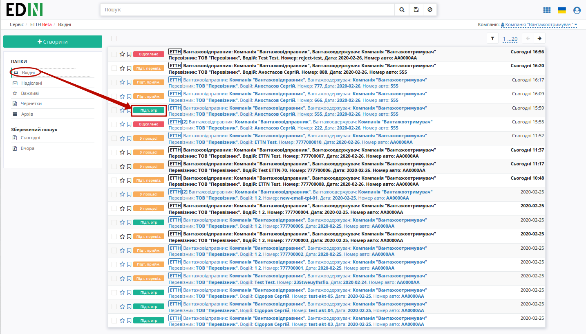

Підписання е-ТТН вантажоодержувачем
###################################################################################################

.. role:: red

.. role:: underline

Підписана з боку перевізника е-ТТН відображається в папці "Вхідні".

.. important:: Підписання е-ТТН вантажоодержувачем можливе тільки після підписання перевізником (статус документу – "Підтверджено Перевізником").

.. important::
    В залежності від внутрішньої схеми **"Вантажоодержувача"** документ перед "Підписанням" може бути "Підтверджений" приймальником, (кнопка **"Підтвердити"**) і відповідно цей документ у вхідних змінить свій статус на "Підтверджено приймальником":

Для підписання е-ТТН **"Вантажоодержувачу"** потрібно відкрити документ та натиснути на кнопку **"Підписати"**.

Після ініціалізації бібліотеки підписання, система надасть можливість додати ключ для підписання. При :underline:`першому` підписанні необхідно додати файловий ключ. Для цього у модальному вікні потрібно обрати файл (2) і ввести пароль (1):

.. image:: pics_Signing_rejection_ETTN_consignee/Signing_rejection_ETTN_consignee_06n.png
   :align: center

Після чого натиснути кнопку **"Додати"**:

.. image:: pics_Signing_rejection_ETTN_consignee/Signing_rejection_ETTN_consignee_07n.png
   :align: center

При успішному додаванні ключа автоматично відобразиться вибрана особа, від імені якої буде здійснено підписання (кнопка **"Підписати"**):

.. image:: pics_Signing_rejection_ETTN_consignee/Signing_rejection_ETTN_consignee_08n.png
   :align: center

При подальшій роботі з раніше доданим ключем/-ами потрібно вводити лише пароль для обраного ключа:

.. image:: pics_Signing_rejection_ETTN_consignee/Signing_rejection_ETTN_consignee_09n.png
   :align: center

Після підписання е-ТТН інформація щодо підписантів відображається в документі ТТН у списку документів у ланцюжку.

.. image:: pics_Signing_rejection_ETTN_consignee/Signing_rejection_ETTN_consignee_10n.png
   :align: center

Після підписання перевізником е-ТТН присвоєно статус "Підписано".

.. include:: kontakti.rst

