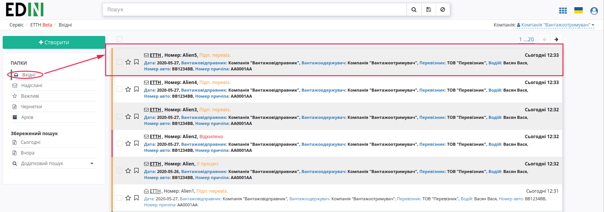
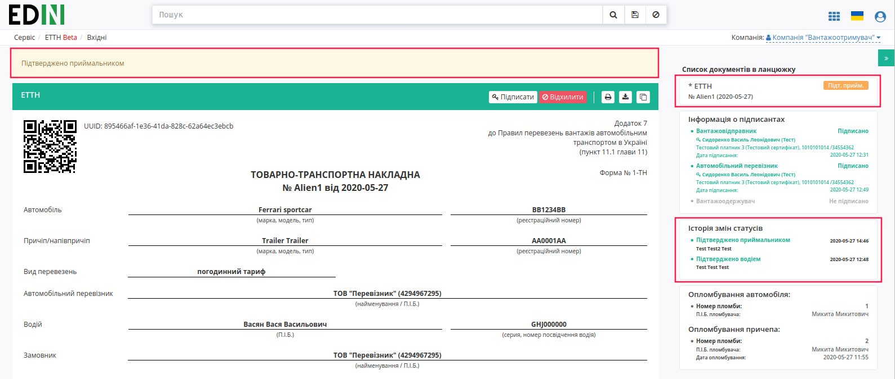
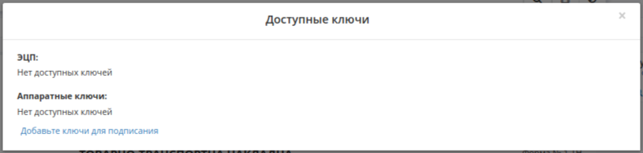
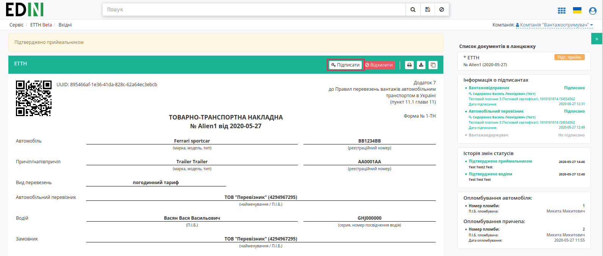
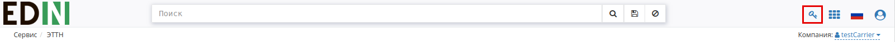
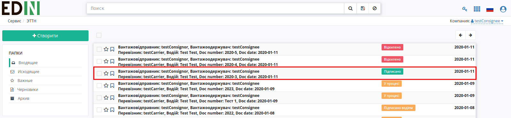

Підписання е-ТТН вантажоодержувачем
###################################################################################################

.. role:: red

.. role:: underline

Після відкриття е-ТТН у статусі "У процесі" вантажоодержувачу відображається повідомлення-підказка "Очікуйте підпиcання перевізником".

Підписана з боку перевізника е-ТТН відображається в папці "Вхідні".

.. image:: pics_Signing_rejection_ETTN_consignee/Signing_rejection_ETTN_consignee_02.png
   :align: center

.. important:: Підписання е-ТТН вантажоодержувачем можливе тільки після підписання перевізником (статус документу – "Підписано водієм").

Для підписання е-ТТН вантажоодержувачем необхідно її відкрити та натиснути на кнопку "Підписати".

.. hint:: Після ініціалізації бібліотеки підписання, система надасть можливість додати ключ для підписання.

Далі у модальному вікні необхідно додати ключ для підписання, натиснувши на кнопку "Додайте ключі для підписання", ввести пароль та натиснути – "Встановити ключ".

Ключ успішно додано:

Далі необхідно закрити модальне вікно та ще раз натиснути на кнопку "Підписати". У модальному вікні обрати ключ та натиснути – "Підписати".

.. image:: pics_Signing_rejection_ETTN_consignee/Signing_rejection_ETTN_consignee_06.png
   :align: center

Також додати ключи для підписання можна натиснувши на іконку ключа в правій верхній частині сторінки. Після чого повторити алгоритм додавання ключа в модальному вікні.

Після підписання е-ТТН інформація щодо підписантів відображається в документі ТТН у списку документів у ланцюжку.

.. image:: pics_Signing_rejection_ETTN_consignee/Signing_rejection_ETTN_consignee_08.png
   :align: center

Після підписання перевізником е-ТТН присвоєно статус "Підписано".

.. include:: kontakti.rst

