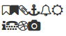
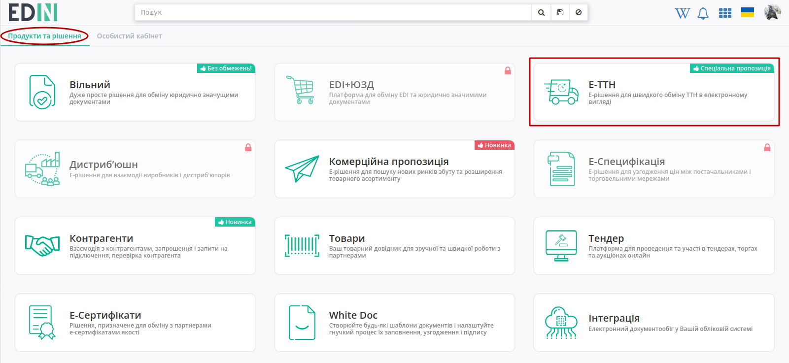
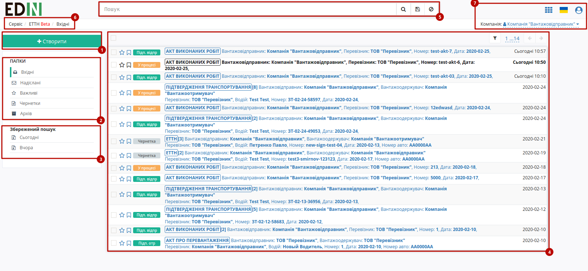
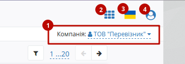
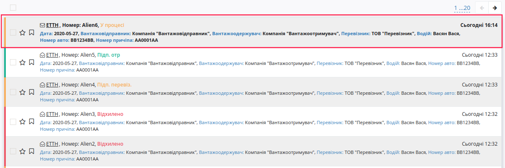
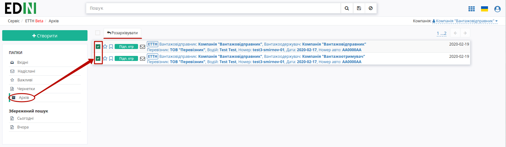
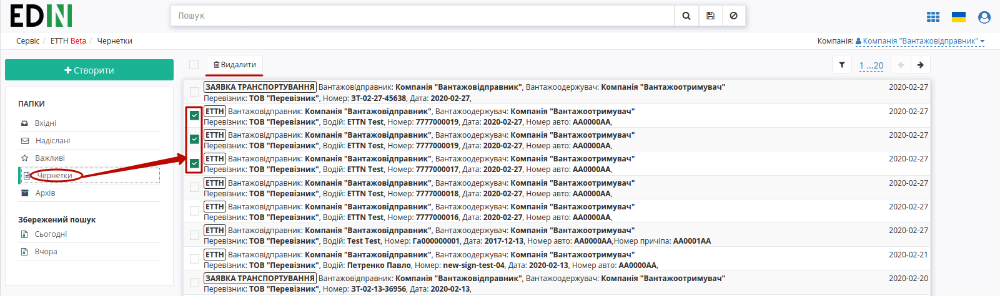

Робота з сервісом EDIN-ETTN
#############################################################

.. role:: red

.. role:: green

.. role:: underline

.. сюда закину немного картинок для текста

.. |фільтр| image:: pics_Work_with_ETTN/Work_with_ETTN_04.png

.. |звезда2| image:: pics_Work_with_ETTN/Work_with_ETTN_08.png

.. |Друк| image:: pics_Work_with_ETTN/Work_with_ETTN_18.png

.. |Завантажити| image:: pics_Work_with_ETTN/Work_with_ETTN_19.png

.. |Клонувати| image:: pics_Work_with_ETTN/Work_with_ETTN_20.png

.. |Дискета| image:: pics_Work_with_ETTN/Work_with_ETTN_24.png

.. |Бінокль| image:: pics_Work_with_ETTN/Work_with_ETTN_28.png

.. :underline:`"Чернетки" для ролі "Організатор"`

.. contents:: Зміст:
   :depth: 6

---------

**1 Вхід**
================================================

Для роботи з WEB сервісом Ви можете використовувати будь-який браузер (рекомендованим є **Google Chrome** останньої версії). Для входу до сервісу платформи необхідно перейти за посиланням https://ettn-demo.edin.ua/ .

При переході за вказаним посиланням відкриється вікно авторизації. Необхідно ввести Ваш логін і пароль користувача і натиснути «**Вхід**», як це зазначено на зображенні нижче:

.. image:: pics_Work_with_ETTN/Work_with_ETTN_39.png
   :align: center

**2 Загальний вигляд сервісу ETTN**
================================================

Після успішної авторизації відкриється основне меню для вибору сервісу платформи EDIN: **"EDI", "ETTN", "АТС", "Виробник", "Дистриб'ютор", "Сертифікати", "Е-Специфікація", "Товари", "DOCflow", "Tender", "Wiki"**. 

Для переходу до сервісу **EDIN ETTN** Вам потрібно натиснути **Відкрити** під іконкою **ETTN**. 

Відкриється основне вікно сервісу **EDIN ETTN**. При первинному вході на платформу буде виконаний вхід в каталог документів - **«Вхідні»**. 

Основне вікно сервісу **EDIN ETTN** складається з:

#. Кнопка "Створити" - відкриває вікно для вибору та створення нового документа;
#. Меню папок - дозволяє вибрати каталог з відповідними документами, що будуть відображатись в журналі документів; 
    * "Вхідні" - всі вхідні документи для організації від контрагентів;
    * "Надіслані" - всі відправлені документи для організації до контрагентів;
    * "Важливі" - всі зазначені документи як важливі;
    * "Чернетки" - всі документи які були створені, але не відправлені;
    * "Архів" - всі оброблені і архівні документи (перенесені в архів);
#. Збережений пошук - дозволяє задати та зберегти критерії пошуку документів (детальніше в `розділі Пошук <https://wiki.edin.ua/uk/latest/ETTN_2_0/Work_with_ETTN.html#search>`__ );
#. Журнал документів (детальніше описаний в `розділі "Журнал документів" <https://wiki.edin.ua/uk/latest/ETTN_2_0/Work_with_ETTN.html#doc-journal>`__ );
#. Рядок пошуку документів за різними критеріями (детальніше в `розділі "Пошук" <https://wiki.edin.ua/uk/latest/ETTN_2_0/Work_with_ETTN.html#search>`__ );
#. Навігація на платформі;
#. Функціонал з керування: дані про компанію (вибір GLN організації)(1), кнопки переходу в меню сервісів (2), вибору мови (3), `налаштувань користувача <https://wiki.edin.ua/uk/latest/general_2_0/rabota_s_platformoj_EDIN_2.0.html#pers-settings>`__ та виходу з платформи (4):

.. _doc-journal:

**2.1 Журнал документів**
----------------------------------

В журналі відображаються документи, що потрапили до вибраного каталогу. Вхідні "непрочитані" документи відображаються жирним чорним текстом:

Користувач може зі списку сам обрати кількість документів, що буде відображатись на одній сторінці:

.. image:: pics_Work_with_ETTN/Work_with_ETTN_33.png
   :align: center

В лівій частині по кожному документу відображаються символи:

* |звезда| / |звезда2| - регульована відмітка користувача, "важливий"/"звичайний" документ. Відмічені документи відображаються в каталозі "Важливі".
* |прапорець| - дозволяє відмітити документ одним із символів |набор|

**2.1.1 Архівування документів, видалення чернеток**
~~~~~~~~~~~~~~~~~~~~~~~~~~~~~~~~~~~~~~~~~~~~~~~~~~~~~~

Будь-який ланцюжок документів з папок **"Вхідні" / "Надіслані" / "Важливі"** можливо вибірково чи масово (чекер в верхній частині журналу) відправити до архіву (кнопка **"Архівувати"**):

.. image:: pics_Work_with_ETTN/Work_with_ETTN_25.png
   :align: center

Цей процес зворотній: ланцюжки, що потрапили до архіву можливо розархівувати в такий же спосіб через кнопку **"Розархівувати"**:

Документи з **"Чернеток"** не були відправлені іншим контрагентам; ці документи можливо вибірково чи масово (чекер в верхній частині журналу) **"Видалити"**: 

.. _search:

**2.2 Пошук**
----------------------------------

Для пошуку передбачені стандартні "ключі запиту", переглянути які можливо, натиснувши на рядок Пошуку і в списку вибрати "Доступні для пошуку ключі":

.. image:: pics_Work_with_ETTN/Work_with_ETTN_12.png
   :align: center

Після чого відобразиться спливаюче вікно з можливостями пошуку:

.. image:: pics_Work_with_ETTN/Work_with_ETTN_40.png
   :align: center

Для зручності можливо зберегти Ваш запит для пошуку - для цього потрібно виконати пошук, натиснути на іконку |Дискета| "зберегти" в рядку Пошуку:

.. image:: pics_Work_with_ETTN/Work_with_ETTN_14.png
   :align: center

Ввести назву, натиснути "Так". Збережений результат пошуку буде відображатися в "Історії пошуку".

.. image:: pics_Work_with_ETTN/Work_with_ETTN_15.png
   :align: center

.. _scenario:

**3 Сценарії взаємодії з контрагентами (обмін е-ТТН)**
=============================================================

В сервісі ETTN передбачені 3 основні ролі учасників документообігу: **"Вантажовідправник"**, **"Перевізник"**, **"Вантажоотримувач"**, а також реалізовано кілька можливих сценаріїв взаємодії учасників документообігу ЕТТН.

.. hint::
   При роботі в рамках однієї компанії (**"Вантажовідправник"** та **"Вантажоотримувач"** - одна компанія) документи позначаються відміткою "Внутрішні перевезення":

.. image:: pics_Work_with_ETTN/Work_with_ETTN_29.png
   :align: center

**3.1 Пряма схема документообігу ЕТТН**
------------------------------------------

:green:`"Вантажовідправник" -> "Перевізник" -> "Вантажоотримувач" -> "Перевізник" (опціонально)`

Ініціатором документообігу виступає **"Вантажовідправник"** - створює, підписує, відправляє ЕТТН (детально в `інструкції для вантажовідправника <https://wiki.edin.ua/uk/latest/ETTN_2_0/Creation_signing_ending_rejection_ETTN_shipper.html>`__ ). Далі **"Перевізник"** приймає вхідний документ, підписує та відправляє (детально в `інструкції для перевізника <https://wiki.edin.ua/uk/latest/ETTN_2_0/Signing_rejection_ETTN_carrier.html>`__ ). Завершальним підписантом в цій схемі є компанія-**"Вантажоотримувач"** (детально в `інструкції для вантажоодержувача <https://wiki.edin.ua/uk/latest/ETTN_2_0/Signing_rejection_ETTN_consignee.html>`__ )

**3.2 Документообіг ЕТТН між розподільчими центрами (всередині однієї компанії)**
-------------------------------------------------------------------------------------------

:green:`РЦ-"Вантажовідправник" -> "Перевізник" -> РЦ-"Вантажоотримувач" -> "Перевізник" (опціонально)`

Алгоритм взаємодії ідентичний до прямої схеми за виключенням того, що в якості **"Вантажовідправника"** та **"Вантажоотримувача"** виступає одна компанія. 

.. _reverse-schema:

**3.3 Обернена схема документообігу ЕТТН**
-------------------------------------------------------------------------------------

1. :red:`"Вантажоотримувач"` -> :green:`"Вантажовідправник" -> "Перевізник" -> "Вантажоотримувач" -> "Перевізник" (опціонально)`
2. :red:`"Перевізник"` -> :green:`"Вантажовідправник" -> "Перевізник" -> "Вантажоотримувач" -> "Перевізник" (опціонально)`

Обидва варіанти оберненої схеми документообігу ЕТТН відрізняються від "прямої" схеми тим, що ініціатором документообігу виступає **"Вантажоотримувач"** (1) або **"Перевізник"** (2). Алгоритм детально описаний в `інструкції створення документів перевізником/вантажоодержувачем <https://wiki.edin.ua/uk/latest/ETTN_2_0/Creation_sending_ETTN_carrier_consignee.html>`__ )

.. _responsible-schema:

**3.4 Створення ЕТТН на основі "Акта приймання-передавання" (БП "Відповідальне зберігання")**
--------------------------------------------------------------------------------------------------

ЕТТН також можливо створити на підставі підписаного з обох сторін "Акта приймання-передавання" ( `детальніше про Акт <https://wiki.edin.ua/uk/latest/ETTN_2_0/Work_with_acceptance_certificate.html>`__ )

В цьому випадку сама схема документообігу залишається "класичною" (ініціатором виступає **"Вантажовідправник"**):

:green:`"Вантажовідправник" -> "Перевізник" -> "Вантажоотримувач" -> "Перевізник" (опціонально)`

.. important::
    Особливістю такого документообігу є створення практично повністю заповненого документу ЕТТН (дані контрагентів, адрес, вантажу підтягуються з попередніх документів, на основі яких створюється ця ЕТТН) - залишається лише внести ціну вантажу в табличну частину (кнопка "Додати").

**4 Повідомлення контрагентів, водіїв**
================================================

На кожному єтапі в вище зазначених схемах (новий документ чи зміна статусу) контрагенти отримують повідомлення на e-mail про документ, до якого вони причасні в форматі:

.. image:: pics_Work_with_ETTN/Work_with_ETTN_23.png
   :align: center

#. **Статус документу**: "У процесі" / "Підписано Вантажовідправником" / "Підтверджено водієм" / "Відхилено Вантажовідправником" / "Підписано Перевізником" / "Відхилено Перевізником" / "Підписано Вантажоотримувачем" / "Підтверджено Приймальником"
#. **Тип документа**: "ЕТТН" / "Заявка на трпнспортування" / "Акт перевантаження" / "Акт виконаних робіт"
#. **Блок даних контрагентів**
#. **Посилання на документ**

.. _doc-form:

**5 Загальний вигляд форми документа**
================================================

Функціонал форми документа дещо відрізняється в залежності від ролі користувача та етапу/статусу документообігу (детальніше у інструкціях, присвяченим цим ролям).

.. image:: pics_Work_with_ETTN/Work_with_ETTN_16.png
   :align: center

Розглянемо основні елементи форми:

#. Кнопки **"Підтвердити" / "Підписати" / "Відхилити" / "Змінити" / "Зберегти" / "Створити" / "Відправити"** відображаються лише там, де цей функціонал є логічним (згідно `сценаріїв взаємодії з контагентами <https://wiki.edin.ua/uk/latest/ETTN_2_0/Work_with_ETTN.html#scenario>`__ ). Кнопки **"Друк", "Завантажити", "Клонувати"** - є загальним функціоналом для всіх ролей та документів:
    * |Друк| - **"Друк"** - відкриває друковану форму документа, яку можливо зберегти в *.pdf форматі;
    * |Завантажити| - **"Завантажити"** - дозволяє завантажити архів формату ettn_DocUuid.zip, що містить json, xml документа, а також p7s, якщо документ вже підписаний.
    * |Клонувати| - **"Клонувати"** - функціонал, що дозволяє клонувати заповнений документ і всі його вкладення для подальшого редагування/підписання/відправки контрагентам (детальніше в `Клонування документа <https://wiki.edin.ua/uk/latest/ETTN_2_0/Work_with_ETTN.html#scenario>`__ ).
#. Сам документ разом з табличною частиною ("Відомості про вантаж").
#. Список документів у ланцюжку, в якому також відображається їх статус. Якщо під час перевезення вантажу (на етапі "Підтверджено водієм" / "Підписано перевізником") була здійснена перевірка інспектором - документ позначається відміткою |Бінокль| "Проінспектовано" (окремий фільтр пошуку). 
#. Кнопка, що згортає додаткову інформацію про ланцюжок документів, підписантів та супровідні документи (вкладення). 
#. Інформація про підписантів зі статусами про підписання.
#. Супровідні документи про вантаж, що додав користувач при створенні документа (вкладення).
#. Функціонал, що дозволяє долучити до документа додаткові коментарі (відображаються лише для користувача, що їх залишив).  

.. _doc-clone:

**6 Клонування документа**
================================================

Функціонал, що дозволяє копіювати заповнений документ і всі його вкладення для подальшого редагування/підписання/відправки контрагентам.

.. note::
    Клонувати можливо лише такі типи документів, які доступні для створення для даної ролі користувача (**"Вантажовідправник"**, **"Перевізник"**, **"Вантажоотримувач"**).

Для створення копії потрібно натиснути на кнопку |Клонувати| "Клонувати":

.. image:: pics_Work_with_ETTN/Work_with_ETTN_17.png
   :align: center

В клонованому документі можливо внести правки, після яких перед **"Підписанням"** обов'язково потрібно **"Зберегти"** документ:

.. image:: pics_Work_with_ETTN/Work_with_ETTN_21.png
   :align: center

Підписаний документ можливо відправити контрагенту:

.. image:: pics_Work_with_ETTN/Work_with_ETTN_22.png
   :align: center

**7 Фільтрація документів для співробітників компанії**
==================================================================

В сервісі **EDIN ETTN** передбачені налаштування (на стороні адміністраторів платформи) фільтрації документів для вказаних співробітників компанії за кодом КОАТУУ (по регіонах). Мається на увазі, що в рамках однієї компанії можливо налаштувати її співробітників (користувачів сервісу) таким чином, що вони будуть мати можливість переглядати і працювати лише з документами, що були відправлені "до" чи "від" їх регіону (за кодом КОАТУУ).

.. note::
    Співробітники (користувачі сервісу) без додаткових налаштувань можуть працювати з усіма документами в рамках компанії.

Розглянемо для прикладу компанію з 3 співробітниками:

- **Співробітник1** (м.Київ)
- **Співробітник2** (м.Харків), для якого зроблені налаштування фільтрації по КОАТУУ
- **Співробітник3** (м.Львів), для якого зроблені налаштування фільтрації по КОАТУУ 

Після того, як ці співробіники здійснили документообіг **Співробітник2** та **Співробітник3** можуть бачити і відповідно працювати лише з документами, в яких вказано КОАТУУ їх регіону (Харківського та Львівського відповідно), а **Співробітник1** може переглядати всі документи (усіх користувачів) на рівні компанії.  

**8 Коментарі до документів**
==================================================================

В сервісі **EDIN ETTN** реалізована можливість відправки коментаря до документів сервісу. Коментар може бути доступний до перегляду усім участникам документообігу або може бути "приватним" (доступним до перегляду лише співробітникам компанії, від імені якої був здійснений коментар). Для того аби коментар був приватним потрібно поставити відповідну відмітку:

.. image:: pics_Work_with_ETTN/Work_with_ETTN_30.png
   :align: center

Таким чином на стороні компанії, що додає коментарі вони можуть виглядати:

.. image:: pics_Work_with_ETTN/Work_with_ETTN_31.png
   :align: center

А для контрагентів доступні лише:

.. image:: pics_Work_with_ETTN/Work_with_ETTN_32.png
   :align: center

.. **9 Налаштування**
   ==================================================================

   Для переходу в налаштування користувача платформи потрібно натиснути на піктограму користувача та обрати "Налаштування":

   .. image:: pics_Work_with_ETTN/Work_with_ETTN_34.png
      :align: center

   .. image:: pics_Work_with_ETTN/Work_with_ETTN_35.png
      :align: center

   Окрім загальних користувацьких налаштувань блок для ETTN складається з персональних налаштувань співробітника ("Мої налаштування") та налаштувань компанії ("Компанії"):

   .. image:: pics_Work_with_ETTN/Work_with_ETTN_36.png
      :align: center

   .. image:: pics_Work_with_ETTN/Work_with_ETTN_37.png
      :align: center

   Для редагування налаштувань Компанії потрібно обрати її зі списку, натиснувши лівою кнопкою миші:

   .. image:: pics_Work_with_ETTN/Work_with_ETTN_38.png
      :align: center

   В налаштуваннях компанії відображається її UUID і основна інформація про компанію (Назва, ЕДРПОУ, ІПН, Місто, Адреса) (1), а також розділ містить 3 вкладки:

   * Адреси (2) - адреси організації, які потім можливо обрати при формуванні документів (Назва, Місто, Вулиця КОАТУУ) 
   * Співробітники (3) - всі співробітники організації (Прізвище, Ім'я, По батькові, ІПН, Серія, № посвідчення водія, Email, Телефон, Реєстрація)
   * Тарифи (4) - налаштування автоматичного підрахування цін за послугу «Перевізника» (`детальніше <https://wiki.edin.ua/uk/latest/ETTN_2_0/Create_act_at_accepted_work.html#additional-functionality>`__ )

------------

.. include:: kontakti.rst
