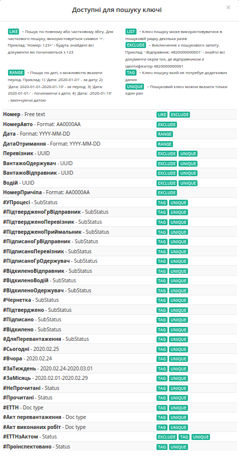

Робота з сервісом EDIN-ETTN
#############################################################

.. role:: red

.. role:: green

.. role:: underline

.. сюда закину немного картинок для текста

.. |фільтр| image:: pics_Work_with_ETTN/Work_with_ETTN_04.png

.. |звезда| image:: pics_Work_with_ETTN/Work_with_ETTN_07.png

.. |звезда2| image:: pics_Work_with_ETTN/Work_with_ETTN_08.png

.. |прапорець| image:: pics_Work_with_ETTN/Work_with_ETTN_09.png

.. |набор| image:: pics_Work_with_ETTN/Work_with_ETTN_10.png

.. |Друк| image:: pics_Work_with_ETTN/Work_with_ETTN_18.png

.. |Завантажити| image:: pics_Work_with_ETTN/Work_with_ETTN_19.png

.. |Клонувати| image:: pics_Work_with_ETTN/Work_with_ETTN_20.png

.. |Дискета| image:: pics_Work_with_ETTN/Work_with_ETTN_24.png

.. |Бінокль| image:: pics_Work_with_ETTN/Work_with_ETTN_28.png

.. :underline:`"Чернетки" для ролі "Організатор"`

.. contents:: Зміст:
   :depth: 6

---------

**Вхід**
================================================

Для роботи з WEB сервісом Ви можете використовувати будь-який браузер (рекомендованим є **Google Chrome** останньої версії). Для входу до сервісу платформи необхідно перейти за посиланням https://ettn-demo.edi-n.com/ .

При переході за вказаним посиланням відкриється вікно авторизації. Необхідно ввести Ваш логін і пароль користувача і натиснути «**Вхід**», як це зазначено на зображенні нижче:

.. image:: pics_Work_with_ETTN/Work_with_ETTN_01.png
   :align: center

**Загальний вигляд сервісу ETTN**
================================================

Після успішної авторизації відкриється основне меню для вибору сервісу платформи EDIN: **"EDI", "ETTN", "АТС", "Виробник", "Дистриб'ютор", "Сертифікати", "Е-Специфікація", "Товари", "DOCflow", "Tender", "Wiki"**. 

.. image:: pics_Work_with_ETTN/Work_with_ETTN_02n.png
   :align: center

Для переходу до сервісу **EDIN ETTN** Вам потрібно натиснути **Відкрити** під іконкою **ETTN**. 

Відкриється основне вікно сервісу **EDIN ETTN**. При первинному вході на платформу буде виконаний вхід в каталог документів - **«Вхідні»**. 

.. image:: pics_Work_with_ETTN/Work_with_ETTN_03.png
   :align: center

Основне вікно сервісу **EDIN ETTN** складається з:

#. Кнопка "Створити" - відкриває вікно для вибору та створення нового документа;
#. Меню папок - дозволяє вибрати каталог з відповідними документами, що будуть відображатись в журналі документів; 
    * "Вхідні" - всі вхідні документи для організації від контрагентів;
    * "Вихідні" - всі відправлені документи для організації до контрагентів;
    * "Важливі" - всі зазначені документи як важливі;
    * "Чернетки" - всі документи які були створені, але не відправлені;
    * "Архів" - всі оброблені і архівні документи (перенесені в архів);
#. Збережений пошук - дозволяє задати та зберегти критерії пошуку документів (детальніше в `розділі Пошук <https://wiki.edi-n.com/uk/latest/ETTN_2_0/Work_with_ETTN.html#search>`__ );
#. Журнал документів (детальніше описаний в `розділі "Журнал документів" <https://wiki.edi-n.com/uk/latest/ETTN_2_0/Work_with_ETTN.html#doc-journal>`__ );
#. Рядок пошуку документів за різними критеріями (детальніше в `розділі "Пошук" <https://wiki.edi-n.com/uk/latest/ETTN_2_0/Work_with_ETTN.html#search>`__ );
#. Навігація на платформі;
#. Функціонал з керування: дані про компанію (вибір GLN організації)(1), кнопки переходу в меню сервісів (2), вибору мови (3), виходу з платформи (4)

.. image:: pics_Work_with_ETTN/Work_with_ETTN_06.png
   :align: center

.. _doc-journal:

**Журнал документів**
----------------------------------

В журналі відображаються документи, що потрапили до вибраного каталогу. Вхідні "непрочитані" документи відображаються товстим чорним текстом (прочитані блакитним):

.. image:: pics_Work_with_ETTN/Work_with_ETTN_05.png
   :align: center

|фільтр| - фільтр, що дозволяє відсортувати ЕТТН документи, що потребують підтвердження для логічного завершення документообігу.

.. note::
    Для каталогу "Вхідні" для **"Перевізника"** доступна кнопка |фільтр| - фільтр, що дозволяє відсортувати ЕТТН документи, що потребують підтвердження по яким можливо створити "Акт перевантаження" / "Акт виконаних робіт" ( `детальніше <https://wiki.edi-n.com/uk/latest/ETTN_2_0/Work_with_ETTN.html#act-creation>`__ ) 

В лівій частині по кожному документу відображаються символи:

* |звезда| / |звезда2| - регульована відмітка користувача, "важливий"/"звичайний" документ. Відмічені документи відображаються в каталозі "Важливі".
* |прапорець| - дозволяє відмітити документ одним із символів |набор|

**Архівування документів, видалення чернеток**
~~~~~~~~~~~~~~~~~~~~~~~~~~~~~~~~~~~~~~~~~~~~~~~~~~~~~~

Будь-який ланцюжок документів з папок **"Вхідні" / "Надіслані" / "Важливі"** можливо вибірково чи масово (чекер в верхній частині журналу) відправити до архіву (кнопка **"Архівувати"**):

.. image:: pics_Work_with_ETTN/Work_with_ETTN_25.png
   :align: center

Цей процес зворотній: ланцюжки, що потрапили до архіву можливо розархівувати в такий же спосіб через кнопку **"Розархівувати"**:

.. image:: pics_Work_with_ETTN/Work_with_ETTN_26.png
   :align: center

Документи з **"Чернеток"** не були відправлені іншим контрагентам; ці документи можливо вибірково чи масово (чекер в верхній частині журналу) **"Видалити"**: 

.. image:: pics_Work_with_ETTN/Work_with_ETTN_27.png
   :align: center

.. _search:

**Пошук**
----------------------------------

Для пошуку передбачені стандартні "ключі запиту", переглянути які можливо, натиснувши на рядок Пошуку і в списку вибрати "Доступні для пошуку ключі":

.. image:: pics_Work_with_ETTN/Work_with_ETTN_12.png
   :align: center

Після чого відобразиться спливаюче вікно з можливостями пошуку:

Для зручності можливо зберегти Ваш запит для пошуку - для цього потрібно виконати пошук, натиснути на іконку |Дискета| "зберегти" в рядку Пошуку:

.. image:: pics_Work_with_ETTN/Work_with_ETTN_14.png
   :align: center

Ввести назву, натиснути "Так". Збережений результат пошуку буде відображатися в "Історії пошуку".

.. image:: pics_Work_with_ETTN/Work_with_ETTN_15.png
   :align: center

.. _scenario:

**Сценарії взаємодії з контрагентами**
================================================

В сервісі ETTN передбачені 3 основні ролі учасників документообігу: **"Вантажовідправник"**, **"Перевізник"**, **"Вантажоотримувач"**, а також реалізовано кілька можливих сценаріїв взаємодії учасників документообігу ЕТТН.

**1 Пряма схема документообігу ЕТТН**
------------------------------------------

:green:`"Вантажовідправник" -> "Перевізник" -> "Вантажоотримувач"`

Ініціатором документообігу виступає **"Вантажовідправник"** - створює, підписує, відправляє ЕТТН (детально в `інструкції для вантажовідправника <https://wiki.edi-n.com/uk/latest/ETTN_2_0/Creation_signing_ending_rejection_ETTN_shipper.html>`__ ). Далі **"Перевізник"** приймає вхідний документ, підписує та відправляє (детально в `інструкції для перевізника <https://wiki.edi-n.com/uk/latest/ETTN_2_0/Signing_rejection_ETTN_carrier.html>`__ ). Завершальним підписантом в цій схемі є компанія-**"Вантажоотримувач"** (детально в `інструкції для вантажоодержувача <https://wiki.edi-n.com/uk/latest/ETTN_2_0/Signing_rejection_ETTN_consignee.html>`__ )

**2 Документообіг ЕТТН між розподільчими центрами (всередині однієї компанії)**
-------------------------------------------------------------------------------------------

:green:`РЦ-"Вантажовідправник" -> "Перевізник" -> РЦ-"Вантажоотримувач"`

Алгоритм взаємодії ідентичний до прямої схеми за виключенням того, що в якості **"Вантажовідправника"** та **"Вантажоотримувача"** виступає одна компанія. 

.. _reverse-schema:

**3 Обернена схема документообігу ЕТТН**
-------------------------------------------------------------------------------------

1. :red:`"Вантажоотримувач"` -> :green:`"Вантажовідправник" -> "Перевізник" -> "Вантажоотримувач"`
2. :red:`"Перевізник"` -> :green:`"Вантажовідправник" -> "Перевізник" -> "Вантажоотримувач"`

Обидва варіанти оберненої схеми документообігу ЕТТН відрізняються від "прямої" схеми тим, що ініціатором документообігу виступає **"Вантажоотримувач"** (1) або **"Перевізник"** (2). Алгоритм детально описаний в `інструкції створення документів перевізником/вантажоодержувачем <https://wiki.edi-n.com/uk/latest/ETTN_2_0/Creation_sending_ETTN_carrier_consignee.html>`__ )

**Повідомлення контрагентів, водіїв**
================================================

На кожному єтапі в вище зазначених схемах (новий документ чи зміна статусу) контрагенти отримують повідомлення на e-mail про документ, до якого вони причасні в форматі:

.. image:: pics_Work_with_ETTN/Work_with_ETTN_23.png
   :align: center

#. **Статус документу**: "У процесі" / "Підписано Вантажовідправником" / "Підтверджено водієм" / "Відхилено Вантажовідправником" / "Підписано Перевізником" / "Відхилено Перевізником" / "Підписано Вантажоотримувачем" / "Підтверджено Приймальником"
#. **Тип документа**: "ЕТТН" / "Заявка на трпнспортування" / "Акт перевантаження" / "Акт виконаних робіт"
#. **Блок даних контрагентів**
#. **Посилання на документ**

.. _doc-form:

**Загальний вигляд форми документа**
================================================

Функціонал форми документа дещо відрізняється в залежності від ролі користувача та етапу/статусу документообігу (детальніше у інструкціях, присвяченим цим ролям).

.. image:: pics_Work_with_ETTN/Work_with_ETTN_16.png
   :align: center

Розглянемо основні елементи форми:

#. Кнопки **"Підтвердити" / "Підписати" / "Відхилити" / "Змінити" / "Зберегти" / "Створити" / "Відправити"** відображаються лише там, де цей функціонал є логічним (згідно `сценаріїв взаємодії з контагентами <https://wiki.edi-n.com/uk/latest/ETTN_2_0/Work_with_ETTN.html#scenario>`__ ). Кнопки **"Друк", "Завантажити", "Клонувати"** - є загальним функціоналом для всіх ролей та документів:
    * |Друк| - **"Друк"** - відкриває друковану форму документа, яку можливо зберегти в *.pdf форматі;
    * |Завантажити| - **"Завантажити"** - дозволяє завантажити архів формату ettn_DocUuid.zip, що містить json, xml документа, а також p7s, якщо документ вже підписаний.
    * |Клонувати| - **"Клонувати"** - функціонал, що дозволяє клонувати заповнений документ і всі його вкладення для подальшого редагування/підписання/відправки контрагентам (детальніше в `Клонування документа <https://wiki.edi-n.com/uk/latest/ETTN_2_0/Work_with_ETTN.html#scenario>`__ ).
#. Сам документ разом з табличною частиною ("Відомості про вантаж").
#. Список документів у ланцюжку, в якому також відображається їх статус. Якщо під час перевезення вантажу (на етапі "Підтверджено водієм" / "Підписано перевізником") була здійснена перевірка інспектором - документ позначається відміткою |Бінокль| "Проінспектовано" (окремий фільтр пошуку). 
#. Кнопка, що згортає додаткову інформацію про ланцюжок документів, підписантів та супровідні документи (вкладення). 
#. Інформація про підписантів зі статусами про підписання.
#. Супровідні документи про вантаж, що додав користувач при створенні документа (вкладення).
#. Функціонал, що дозволяє долучити до документа додаткові коментарі (відображаються лише для користувача, що їх залишив).  

.. _doc-clone:

**Клонування документа**
================================================

Функціонал, що дозволяє копіювати заповнений документ і всі його вкладення для подальшого редагування/підписання/відправки контрагентам.

.. note::
    Клонувати можливо лише такі типи документів, які доступні для створення для даної ролі користувача (**"Вантажовідправник"**, **"Перевізник"**, **"Вантажоотримувач"**).

Для створення копії потрібно натиснути на кнопку |Клонувати| "Клонувати":

.. image:: pics_Work_with_ETTN/Work_with_ETTN_17.png
   :align: center

В клонованому документі можливо внести правки, після яких перед **"Підписанням"** обов'язково потрібно **"Зберегти"** документ:

.. image:: pics_Work_with_ETTN/Work_with_ETTN_21.png
   :align: center

Підписаний документ можливо відправити контрагенту:

.. image:: pics_Work_with_ETTN/Work_with_ETTN_22.png
   :align: center

.. поки не готово _act-creation: **Створення актів на підставі ЕТТН** ---------------------------------------- можливо є ризон зробити окрему статтю-сторінку

.. include:: kontakti.rst
