"Акт приймання-передавання" на підставі "Підтвердження транспортування" (створення, підписання, відправлення та відхилення) 
#################################################################################################################################

.. role:: red

.. role:: green

.. role:: underline

.. сюда закину немного картинок для текста

.. |фільтр| image:: pics_Work_with_acceptance_certificate/Work_with_acceptance_certificate_01.png

.. :underline:`"Чернетки" для ролі "Організатор"`

.. contents:: Зміст:
   :depth: 6

---------

При формуванні "Акта приймання-передавання" ініціатором документа виступає **"Вантажовідправник"** (в сервісі ETTN передбачені 3 основні ролі учасників документообігу: **"Вантажовідправник"**, **"Перевізник"**, **"Вантажоотримувач"**). Обмін документом здійснюється між **"Вантажовідправником"** та **"Вантажоотримувачем"**

:green:`"Вантажовідправник" -> "Вантажоотримувач"`

.. important::
    Функціонал створення актів доступний для компанії з роллю **"Вантажовідправника"**

**1 Створення "Акта приймання-передавання" "Вантажовідправником"**
==============================================================================

.. important::
    Створити "Акта приймання-передавання" можливо лише на підставі підписаного з обох сторін "Підтвердження транспортування" (детальніше про `"Підтвердження транспортування" <https://wiki.edi-n.com/uk/latest/ETTN_2_0/Creation_signing_ending_rejection_Proposal.html#confirmation>`__ )) 

Для того аби створити "Акт приймання-передавання" потрібно перейти до каталогу **"Вхідні"** та скористатись кнопкою |фільтр| фільтром, що дозволяє відсортувати всі "Підтвердження транспортування", на підставі яких може бути створений відповідний акт.

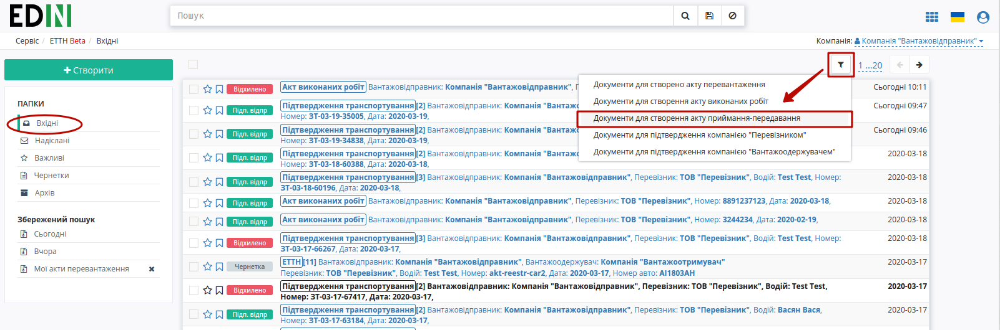

В журналі з відібраними документами потрібно вибрати один зі списку та відкрити його:

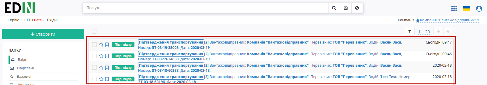

У відкритому документі натиснути кнопку "Створити Акт":

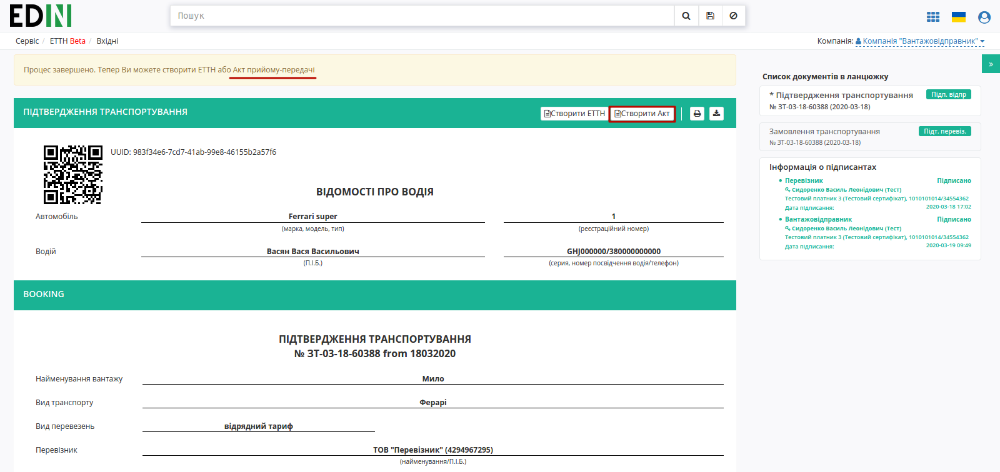

Якщо в "Підтвердженні транспортування" в табличній частині було вказано кілька **"Вантажоотримувачів"**, то при створенні "Акта приймання-передавання" платформа запитає для якого вантажоотримувача потрібно створювати документ:

.. image:: pics_Work_with_acceptance_certificate/Work_with_acceptance_certificate_05.png
   :align: center

Далі відкриється форма "Акта приймання-предавання" з уже заповненим номером, датою документа, Замовником та Виконавцем (дані контрагентів підтягуються з "Підтвердження транспортування"): 

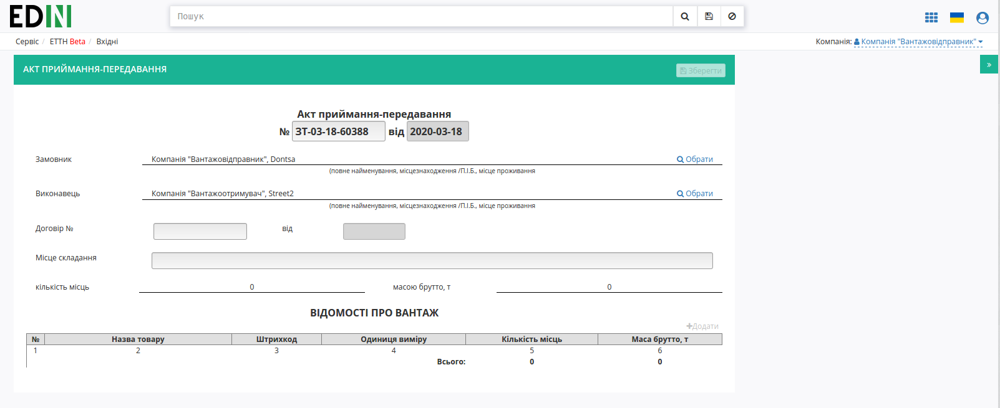

Окрім обов'язкових до заповнення полей номеру та дати договору потрібно додати (кнопка "Додати") та заповнити табличку частину "Відомості про вантаж":

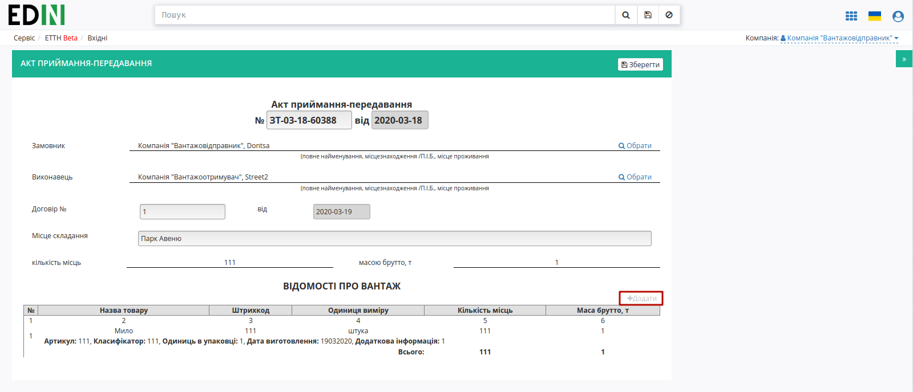

Обов'язкові до заповнення поля позначені червоною зірочкою :red:`*` :

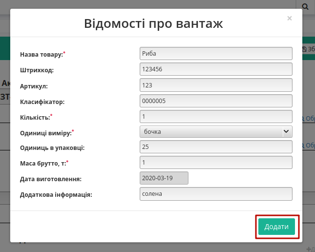

Після того, як документ буде заповнений його потрібно **"Зберегти"** (документ потрапить в "Чернетки") :

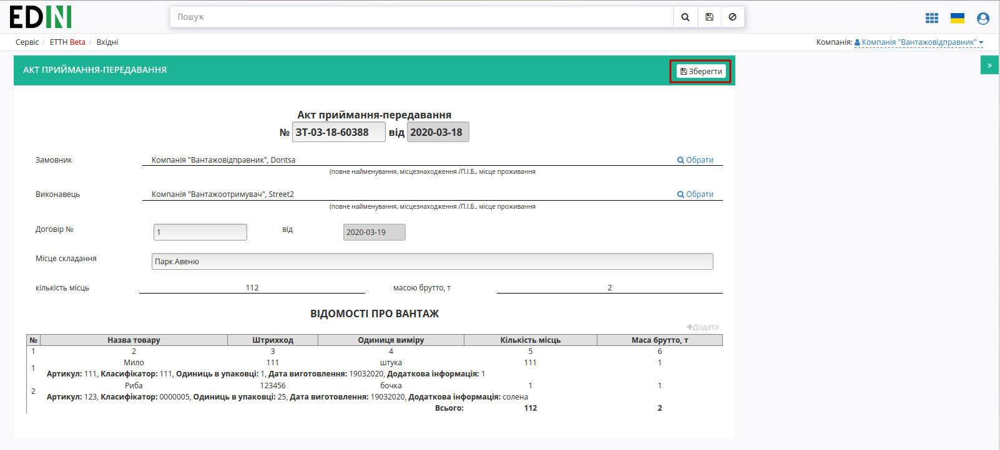

Після всіх подальших змін в "Акті приймання-передавання" його можливо буде **"Зберегти"** (1) та **"Підписати"** (2):

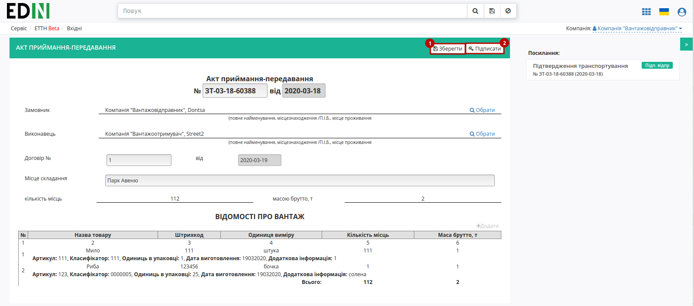

.. _sign:

**1.1 Підписання та відправка "Акта приймання-передавання" "Вантажовідправником"**
-----------------------------------------------------------------------------------------

Після ініціалізації бібліотеки підписання, система надасть можливість додати ключ для підписання. При :underline:`першому` підписанні необхідно додати файловий ключ. Для цього у модальному вікні потрібно обрати файл (2) і ввести пароль (1):

.. image:: pics_Work_with_acceptance_certificate/Work_with_acceptance_certificate_11.png
   :align: center

Після чого натиснути кнопку **"Додати"**:

.. image:: pics_Work_with_acceptance_certificate/Work_with_acceptance_certificate_12.png
   :align: center

При успішному додаванні ключа автоматично відобразиться вибрана особа, від імені якої буде здійснено підписання (кнопка **"Підписати"**):

.. image:: pics_Work_with_acceptance_certificate/Work_with_acceptance_certificate_13.png
   :align: center

При подальшій роботі з раніше доданим ключем/-ами потрібно вводити лише пароль для обраного ключа:

.. image:: pics_Work_with_acceptance_certificate/Work_with_acceptance_certificate_14.png
   :align: center

Після підписання "Акта приймання-передавання" інформація щодо підписанта відображається в блоці "Підписанти", а документ можливо **"Надіслати"**:

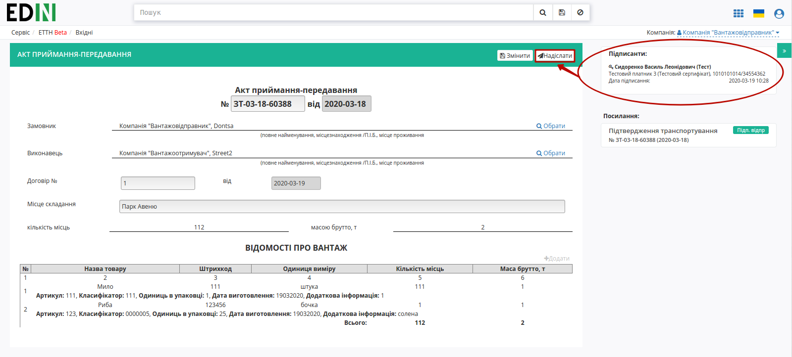

У **"Вантажовідправника"** відправлений документ відображається у **"Надіслані"** зі статусом "У процесі"

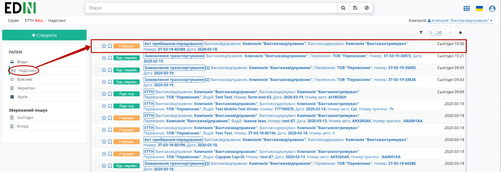

Відправлений "Акт приймання-передавання" має наступний вигляд:

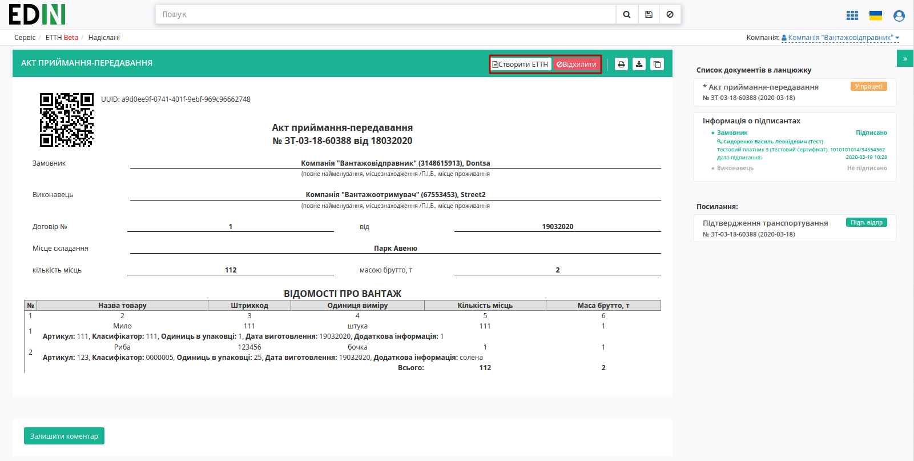

На формі "Акта приймання-передавання" у лівій верхній частині відображаються QR-код та унікальний ідентифікатор документа.

Користувач може скористатись функціоналом для "Друку", "Завантаження" чи "Клонування"; також у разі виявлення помилки в документі у **"Вантажовідправника"** є можливість відхилити відправлений "Акт приймання-передавання" до підписання **"Вантажоотримувачем"**. Для цього потрібно натиснути на кнопку **"Відхилити"**.

**1.2 Відхилення "Акта приймання-передавання" "Вантажовідправником"**
----------------------------------------------------------------------------------------

Для того, щоб відхилити документ (доступно **до підписання "Вантажоотримувачем"**) потрібно натиснути **"Відхилити"**. 

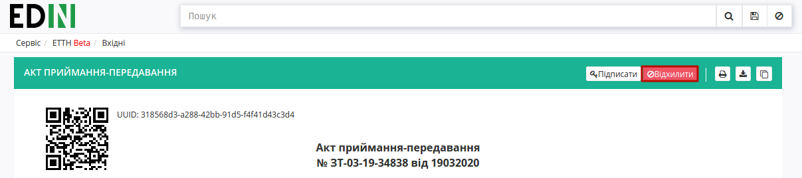

Після чого в модульному вікні обов'язково потрібно заповнити причину відміни документа:

.. image:: pics_Work_with_acceptance_certificate/Work_with_acceptance_certificate_19.png
   :align: center

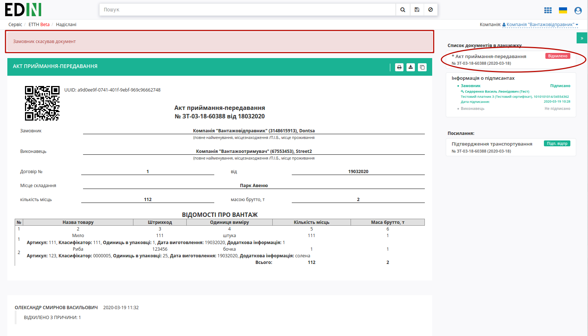

На платформі відображається повідомлення та змінюється статус документа в ланцюжку ("Відхилено").

**2 Отримання "Акта приймання-передавання" "Вантажоотримувачем"**
=================================================================================================================

Відправлений з боку **"Вантажовідправника"** "Акт приймання-передавання" відображається в папці "Вхідні".

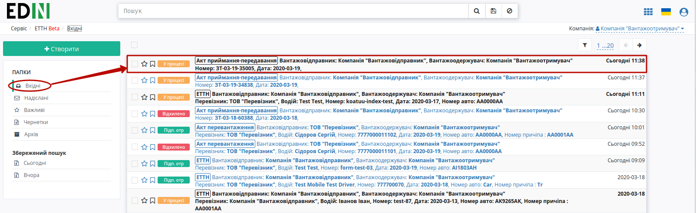

Вхідний підписаний документ можливо "Підписати" чи "Відхилити".

**2.1 Підписання "Акта приймання-передавання" "Вантажоотримувачем"**
----------------------------------------------------------------------------

Для підписання документу потрібно натиснути на кнопку **"Підписати"**:

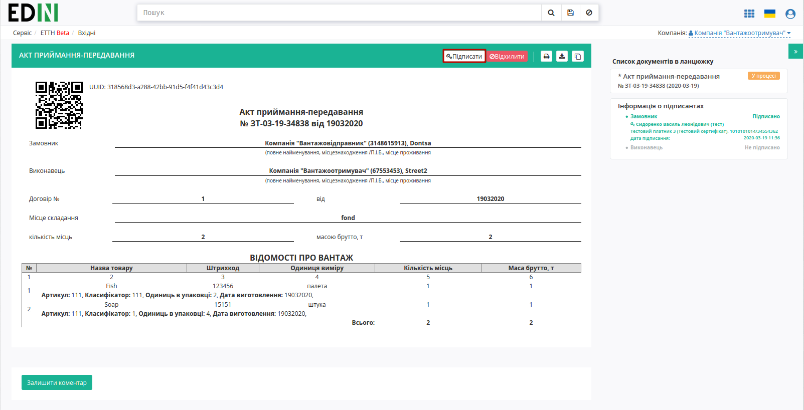

.. hint::
    Процес підписання **"Вантажоотримувачем"** не відрізняється від підписання **"Вантажовідправником"** та описаний в `розділі вище <https://wiki.edi-n.com/uk/latest/ETTN_2_0/Work_with_acceptance_certificate.html#sign>`__ . 

Після підписання система повідомить про завершення документообігу інформаційним повідомленням в формі документу:

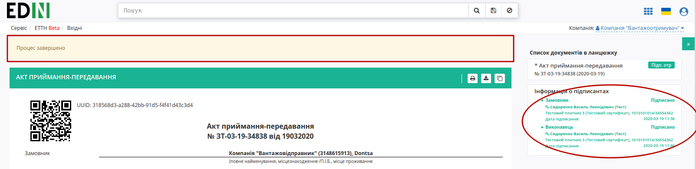

**2.2 Відхилення "Акта приймання-передавання" "Вантажоотримувачем"**
----------------------------------------------------------------------------

У **"Вантажоотримувача"** є можливість відхилити отриманий "Акт приймання-передавання". Для цього потрібно натиснути на кнопку **"Відхилити"**. Після чого в модульному вікні обов'язково потрібно заповнити причину відміни документа:

.. image:: pics_Work_with_acceptance_certificate/Work_with_acceptance_certificate_19.png
   :align: center

Для відхиленого **"Вантажоотримувачем"** "Акта приймання-передавання" присвоєно статус "Відхилено".

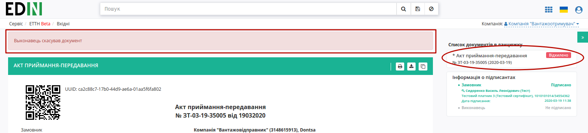

Документ з цим статусом відображається у "Вхідних" **"Вантажоотримувача"** - документообіг завершено.

.. include:: kontakti.rst