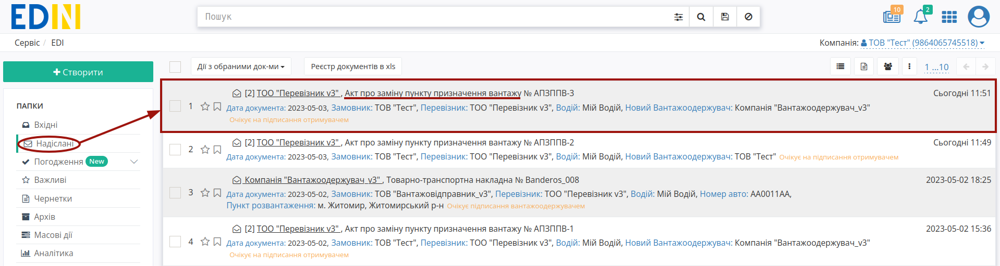
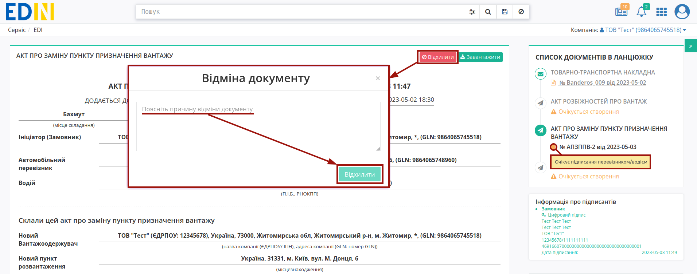
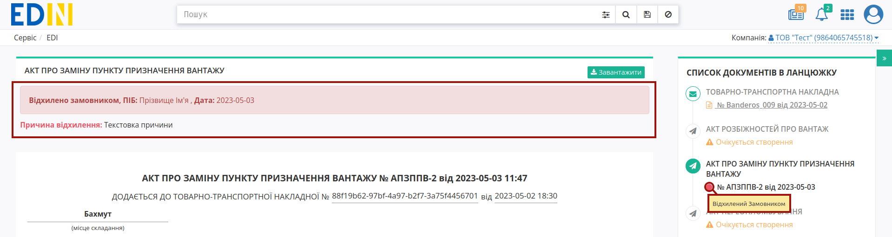
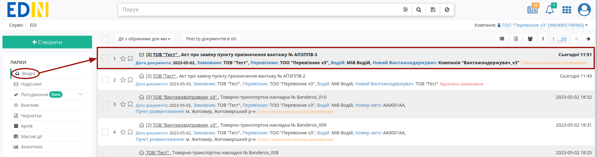
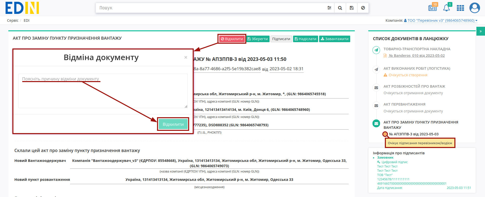
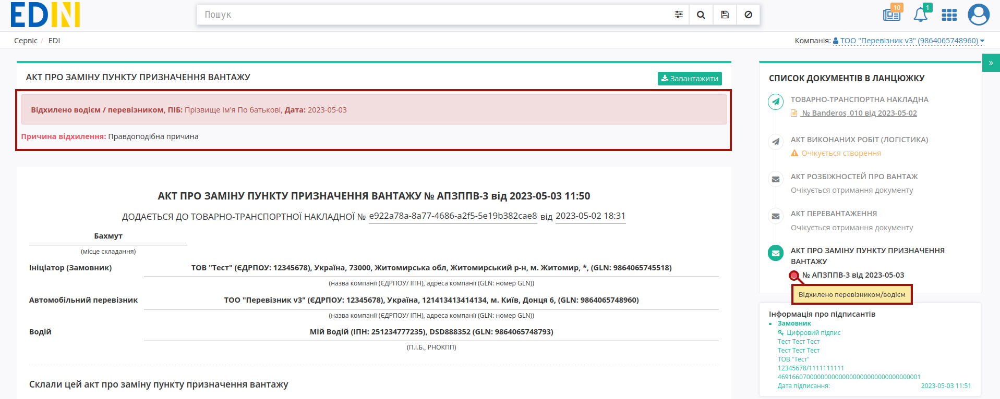

Відхилення "Акта про заміну пункту призначення вантажу"
####################################################################################################################################

.. role:: red

.. role:: green

.. role:: orange

.. role:: underline

.. contents:: Зміст:
   :depth: 3

---------

При роботі з транспортними документами передбачені 4 основні ролі учасників документообігу: **"Замовник"**, **"Вантажовідправник"**, **"Перевізник"**, **"Вантажоотримувач"**. Ініціатором відхилення "Акта про заміну пункту призначення вантажу", в залежності від налаштованої `схеми обміну <https://wiki.edin.ua/uk/latest/ETTN_3_0/Create_Consignee_Change_Act_from.html>`__, може виступати будь-яка роль (**"Ініціатор"** відхилення). 

Відхилити "Акт про заміну пункту призначення вантажу" можливо:

   * зі сторони Ініціатора Акта поки документ перебуває в статусі :orange:`"Очікує підписання перевізником/водієм" / "Очікує підписання замовником"` тобто поки Отримувач (**"Перевізник"** / **"Замовник"**) не підписав документ;
   * зі сторони одного з Отримувачів Акта (**"Перевізник"** / **"Замовник"**) поки документ перебуває в статусі :orange:`"Очікує підписання перевізником/водієм" / "Очікує підписання замовником"` відповідно.

.. _consignee-reject:

**1 Відхилення "Акта про заміну пункту призначення вантажу" Ініціатором (Вантажовідправник/Вантажоодержувач/Перевізник/Замовник)**
========================================================================================================================================

Для відхилення "Акта про заміну пункту призначення вантажу" **"Ініціатору"** (відправнику документа) потрібно перейти в **"Надіслані"** та відкрити потрібний документ: 

Документ можливо **"Відхилити"** за допомогою відповідної кнопки (в модульному вікні обов'язково потрібно заповнити причину відхилення документа):

Після відхилення документ змінює свій статус на:

* для ініціатора "Вантажовідправника" **=>** **"Відхилено вантажовідправником"**
* для ініціатора "Вантажоодержувача" **=>** **"Відхилено вантажоодержувачем"**
* для ініціатора "Перевізника" **=>** **"Відхилено перевізником / водієм"**
* для ініціатора "Замовника" **=>** **"Відхилено замовником"**

Кінцевий статус документа разом з датою та текстом причини відхилення відображається в шапці документа:

Після відхилення Акта функціонал по роботі з "е-ТТН" знову стає доступним.

.. _carrier-reject:

**2 Відхилення "Акта про заміну пункту призначення вантажу" Отримувачем Акта (Перевізник/Замовник)**
==================================================================================================================

Для відхилення "Акта про заміну пункту призначення вантажу" Отримувачу документа потрібно перейти в **"Вхідні"** та відкрити потрібний документ: 

Документ можливо **"Відхилити"** за допомогою відповідної кнопки (в модульному вікні обов'язково потрібно заповнити причину відхилення документа):

Після відхилення документ змінює свій статус на:

* для отримувача "Перевізника" **=>** **"Відхилено перевізником / водієм"**
* для отримувача "Замовника" **=>** **"Відхилено замовником"**

Кінцевий статус документа разом з датою та текстом причини відхилення відображається в шапці документа:  

Після відхилення Акта функціонал по роботі з "е-ТТН" знову стає доступним.

---------------------------------

.. include:: /_constant/kontakti.rst

Відправлений "Акт про заміну пункту призначення вантажу" Ініціатор може **"Відхилити"**, а контагенти прив'язаного документа "е-ТТН" отримують помітку і додаткове повідомлення про те, що дії з документом тимчасово обмежені:

.. image:: pics_Create_warehouse_change/Create_warehouse_change_009.png
   :align: center

.. image:: pics_Create_warehouse_change/Create_warehouse_change_010.png
   :align: center

**1.2 Відхилення "Акта про заміну пункту призначення вантажу" Ініціатором (Вантажовідправник/Вантажоодержувач/Перевізник/Замовник)**
-----------------------------------------------------------------------------------------------------------------------------------------------------------------------

Для того, щоб відхилити документ Ініціатору потрібно натиснути кнопку **"Відхилити"**. 

.. image:: pics_Create_warehouse_change/Create_warehouse_change_011.png
   :align: center

Після чого в модульному вікні обов'язково потрібно заповнити причину відміни документа:

.. image:: pics_Create_warehouse_change/Create_warehouse_change_012.png
   :align: center

.. image:: pics_Create_warehouse_change/Create_warehouse_change_013.png
   :align: center

Документ змінює свій статус на:

* для ініціатора "Вантажовідправника" **=>** **"Відхилено вантажовідправником"**
* для ініціатора "Вантажоодержувача" **=>** **"Відхилено вантажоодержувачем"**
* для ініціатора "Перевізника" **=>** **"Відхилено водієм / перевізником"**
* для ініціатора "Замовника" **=>** **"Відхилено замовником"**

В історії відображаються додаткові дані. Документообіг завершено. Після відхилення "Акта про заміну пункту призначення вантажу" функціонал по роботі з "е-ТТН" знову стає доступним:

.. image:: pics_Create_warehouse_change/Create_warehouse_change_014.png
   :align: center

**2 Отримання "Акта про заміну пункту призначення вантажу" Перевізником чи Замовником**
=================================================================================================================

Вхідний підписаний "Акт про заміну пункту призначення вантажу" можливо **"Підписати** чи **"Відхилити"**:

.. image:: pics_Create_warehouse_change/Create_warehouse_change_015.png
   :align: center

**2.1 Підписання "Акта про заміну пункту призначення вантажу" Перевізником чи Замовником**
-------------------------------------------------------------------------------------------------

Підписання здійснюється за допомогою кнопки **"Підписати**:

.. image:: pics_Create_warehouse_change/Create_warehouse_change_016.png
   :align: center

Після чого до документу можливо додати особливі відмітки і підтвердити підписання (кнопка **"Підписати**): 

.. image:: pics_Create_warehouse_change/Create_warehouse_change_017.png
   :align: center

.. hint::
   Процес підписання не відрізняється від підписання описаного в `розділі вище <https://wiki.edin.ua/uk/latest/ETTN_2_0/Create_warehouse_change.html#sign>`__ .

Після підписання документ змінює свій статус на **"Підписано водієм / перевізником"** або **"Очікує підписання замовником"**, якщо `схема <https://wiki.edin.ua/uk/latest/ETTN_2_0/Create_warehouse_change.html#logic>`__ передбачає трьох підписантів.

.. image:: pics_Create_warehouse_change/Create_warehouse_change_019.png
   :align: center

.. image:: pics_Create_warehouse_change/Create_warehouse_change_018.png
   :align: center

Після підписання документу "Відхилити" його неможливо. Після двостороннього підписання "Акта про заміну пункту призначення вантажу" в схемах з двома підписантами функціонал по роботі з "е-ТТН" знову стає доступним, можливо за потреби **"Показати зміни в ТТН"** (зміни виділяються жовтим кольором):

.. image:: pics_Create_warehouse_change/Create_warehouse_change_020.png
   :align: center

**2.2 Відхилення "Акта про заміну пункту призначення вантажу" Перевізником чи Замовником**
-------------------------------------------------------------------------------------------------

Для того, щоб відхилити документ потрібно натиснути **"Відхилити"**. 

.. image:: pics_Create_warehouse_change/Create_warehouse_change_021.png
   :align: center

Після чого в модульному вікні обов'язково потрібно заповнити причину відміни документа:

.. image:: pics_Create_warehouse_change/Create_warehouse_change_012.png
   :align: center

.. image:: pics_Create_warehouse_change/Create_warehouse_change_022.png
   :align: center

Документ змінює свій статус на **"Відхилено водієм / перевізником"** чи **"Відхилено замовником"** в залежності від ролі контрагента. В історії відображаються додаткові дані. Документообіг завершено. Після відхилення "Акта про заміну пункту призначення вантажу" функціонал по роботі з "е-ТТН" знову стає доступним:

.. image:: pics_Create_warehouse_change/Create_warehouse_change_023.png
   :align: center

**3 Отримання "Акта про заміну пункту призначення вантажу" Замовником**
=================================================================================================================

.. note::
   Для схем в яких документ підписується двома учасниками цей пункт відсутній.

Вхідний підписаний "Акт про заміну пункту призначення вантажу" можливо **"Підписати** чи **"Відхилити"**:

.. image:: pics_Create_warehouse_change/Create_warehouse_change_024.png
   :align: center

**3.1 Підписання "Акта про заміну пункту призначення вантажу" Замовником**
-------------------------------------------------------------------------------------------------

Підписання здійснюється за допомогою кнопки **"Підписати**:

.. image:: pics_Create_warehouse_change/Create_warehouse_change_025.png
   :align: center

Після чого до документу можливо додати особливі відмітки і підтвердити підписання (кнопка **"Підписати**): 

.. image:: pics_Create_warehouse_change/Create_warehouse_change_017.png
   :align: center

.. hint::
   Процес підписання не відрізняється від підписання описаного в `розділі вище <https://wiki.edin.ua/uk/latest/ETTN_2_0/Create_warehouse_change.html#sign>`__ .

Після підписання документ змінює свій статус на **"Підписано замовником"**, додається запис в інформацію про підписантів:

.. image:: pics_Create_warehouse_change/Create_warehouse_change_026.png
   :align: center

Після підписання документу "Відхилити" його неможливо. Після трьохстороннього підписання "Акта про заміну пункту призначення вантажу" функціонал по роботі з "е-ТТН" знову стає доступним, можливо за потреби **"Показати зміни в ТТН"** (зміни виділяються жовтим кольором):

.. image:: pics_Create_warehouse_change/Create_warehouse_change_027.png
   :align: center

**3.2 Відхилення "Акта про заміну пункту призначення вантажу" Перевізником чи Замовником**
-------------------------------------------------------------------------------------------------

Для того, щоб відхилити документ потрібно натиснути **"Відхилити"**. 

.. image:: pics_Create_warehouse_change/Create_warehouse_change_028.png
   :align: center

Після чого в модульному вікні обов'язково потрібно заповнити причину відміни документа:

.. image:: pics_Create_warehouse_change/Create_warehouse_change_012.png
   :align: center

.. image:: pics_Create_warehouse_change/Create_warehouse_change_029.png
   :align: center

Документ змінює свій статус на **"Відхилено замовником"**, в історії відображаються додаткові дані. Документообіг завершено. Після відхилення "Акта про заміну пункту призначення вантажу" функціонал по роботі з "е-ТТН" знову стає доступним:

.. image:: pics_Create_warehouse_change/Create_warehouse_change_030.png
   :align: center

---------------------------------

.. [#] **Заборонити створення пункту розвантаження** - додаткові налаштування "Вантажоодержувача", що можуть бути виконані при зверненні через службу підтримки. Якщо ці налаштуванні активовані, то при створенні "е-ТТН" / "Акта про заміну пункту призначення вантажу" за допомогою WEB чи API ініціатор документа неспроможний додати новий пункт розвантаження. Відповідальність за коректність заповнення даних довідника лежить на "Вантажоодержувачу".

---------------------------------

.. include:: /_constant/kontakti.rst