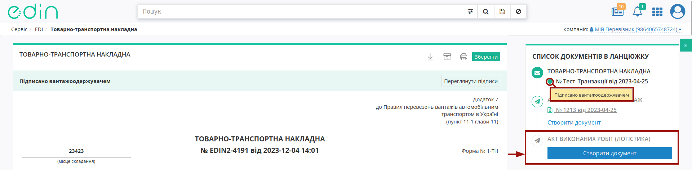

Створення "Акта наданих послуг (Логістика)" на базі інших електронних документів
###################################################################################################

.. сюда закину немного картинок для текста + юзаєм спільні зображення

.. |лупа| image:: /_constant/icons/magnifying_glass.png

.. |будинок| image:: /_constant/icons/house.png

.. |trash| image:: /_constant/icons/trash.png

.. |download| image:: /_constant/icons/download.png

.. role:: red

.. role:: green

.. role:: orange

.. role:: underline

.. contents:: Зміст:
   :depth: 3

---------

Документ "Акт наданих послуг (Логістика)" (COMDOC_037) може бути створений на підставі:

* вхідної підписаної з обох сторін "Заявки на транспортування" (TRANSPORTATIONORDER з SUBDOCTYPE = 1);
* надісланого підписаного з обох сторін "Підтвердження заявки на транспортування" (TRANSPORTATIONORDER з SUBDOCTYPE = 2);
* пов'язаної "е-ТТН" :underline:`підписаної контрагентами (з трьох сторін)` (документ перебуває в статусі :green:`"Підписано вантажоодержувачем"`);
* надісланого "Рахунку (Логістика)" (COMDOC_040).

Ініціатором "Акта наданих послуг (Логістика)" виступає користувач з роллю **"Перевізник"** (при роботі з транспортними документами передбачені 4 основні ролі учасників документообігу: **"Замовник"**, **"Вантажовідправник"**, **"Перевізник"**, **"Вантажоотримувач"**). Обмін документами здійснюється між **"Перевізником"** та **"Замовником"**:

:green:`"Перевізник" -> "Замовник"`

.. _create-from-proposal-ttn:

**1 Створення "Акта наданих послуг (Логістика)" на підставі "Заявки на транспортування" / "Підтвердження заявки на транспортування" / "е-ТТН" / "Рахунку (Логістика)"**
===========================================================================================================================================

**Перевізнику** для створення в сервісі "EDI Network" **"Акта наданих послуг (Логістика)"** :

* :underline:`на підставі "Заявки на транспортування"` потрібно перейти у **"Вхідні"** та вибрати "Заявку на транспортування" в статусі :green:`"Підписано перевізником"` (для зручності можливо скористатись рядком пошуку);
* :underline:`на підставі "Підтвердження заявки на транспортування"` потрібно перейти у **"Надіслані"** та вибрати "Підтвердження заявки на транспортування" в статусі :green:`"Підписано замовником"` (для зручності можливо скористатись рядком пошуку);
* :underline:`на підставі "е-ТТН"` потрібно перейти у **"Вхідні"** та вибрати "е-ТТН" в статусі :green:`"Підписано вантажоодержувачем"` (для зручності можливо скористатись рядком пошуку);
* :underline:`на підставі "Рахунку (Логістика)"` потрібно перейти у **"Надіслані"** та вибрати "Рахунку (Логістика)" (COMDOC_040) (для зручності можливо скористатись рядком пошуку):

.. hint::
   Також на підставі :underline:`підписаних з обох сторін` "Заявок на транспортування", "Підтверджень заявок на транспортування" та :underline:`підписаних контрагентами (з трьох сторін)` "е-ТТН" доступне `масове створення чернеток "Актів наданих послуг (Логістика)" <https://wiki.edin.ua/uk/latest/general_2_0/massovi_operacii_EDIN_2.0.html#create-comdoc-037>`__.

У відкритому документі натисніть **"Створити документ"** "Акт наданих послуг (Логістика)" в блоці `ланцюжка документів <https://wiki.edin.ua/uk/latest/_constant/chain/chain.html>`__, наприклад:

.. початок блоку для COMDOC_037_from_transport_001

Відкриється форма редагування документа "Акта наданих послуг (Логістика)", що включає в собі дані документа-підстави ("Заявки на транспортування" / "Підтвердження заявки на транспортування" / "е-ТТН"):

.. image:: /ETTN_3_0/pics_Create_COMDOC_037_from/Create_COMDOC_037_from_025.png
   :align: center

Всі обов'язкові до заповнення поля позначені червоною зірочкою :red:`*`. Вам необхідно вказати "Номер документа" ("Дата документа" заповнюється автоматично), "Місце складання"...

.. include:: /retail_2.0/formirovanie_otpravka_dokumenta_Vydatkova_Nakladna_na_EDI_Network_2.0.rst
   :start-after: .. початок блоку для ForAllCOMDOC_006/032/037
   :end-before: .. кінець блоку для ForAllCOMDOC_006/032/037

Ваші дані, як контрагента-Перевізника автоматично заповнюються `з Вашого основного GLN <https://wiki.edin.ua/uk/latest/Personal_Cabinet/PCInstruction.html#gln-main>`__.

.. include:: /ClientProcesses/ATB/ATB_Instructions/ATB_external_EDI_instruction_post.rst
   :start-after: .. початок блоку для Prizvusche
   :end-before: .. кінець блоку для Prizvusche

Після того, як всі обов'язкові дані контрагента будуть заповнені блоки можливо згорнути за допомогою кнопки **"Сховати"**. Поки документ не відправлено блок можливо **"Редагувати"** за потреби. Незаповнені поля контрагента-Замовника заповнюються аналогічно.

Блок "Результат" автоматично розраховується з таблиці. Дані позиції в табличній частині частково заповнюються з документа-підстави, для ознайомлення з яким потрібно відкрити детальний перегляд позиції:

.. image:: /ETTN_3_0/pics_Create_COMDOC_037_from/Create_COMDOC_037_from_004.png
   :align: center

.. note::
   Якщо в ланцюжку поставки (ланцюжку з документом-підставою) знаходився "Акт перевантаження" (ReloadAct) то при формуванні "Акта наданих послуг (Логістика)" :underline:`дані про Транспорт та Водія` атоматично доповнюються (додаються без дублів) в табличну частину документа:

   .. image:: /ETTN_3_0/pics_Create_COMDOC_037_from/Create_COMDOC_037_from_013.png
      :align: center

Для редагування (доповнення) даних позиції потрібно обрати кнопку **"Змінити"**, навівши курсор на відповідну позицію:

.. image:: /ETTN_3_0/pics_Create_COMDOC_037_from/Create_COMDOC_037_from_005.png
   :align: center

Також можливо **"+Додати"** нову позицію в таблицю та внести всі дані вручну. За потреби табличні позиції можливо **"Видалити"**.

.. note::
   Для бізнес-процесів Перевізника, в яких беруть участь субпідрядні компанії послуги, що мають назву **Транспортно-експедиційні послуги** при наведенні на рядок в табличній частині документа дозволяють **"Розділити"** **Транспортно-експедиційні послуги** на **Транспортні послуги** та **Експедиційну винагороду**:

   .. image:: /ETTN_3_0/pics_Create_COMDOC_037_from/Create_COMDOC_037_from_018.png
      :align: center

   В модальному вікні потрібно зазначити "Вартість перевезення без ПДВ", "Ставку ПДВ" та натиснути **"Розділити"**:

   .. image:: /ETTN_3_0/pics_Create_COMDOC_037_from/Create_COMDOC_037_from_019.png
      :align: center

   Після чого одна послуга **Транспортно-експедиційні послуги** розділяється на два рядки **Транспортні послуги** та **Експедиційна винагорода**, сумарна загальна вартість за якими не змінюється:

   .. image:: /ETTN_3_0/pics_Create_COMDOC_037_from/Create_COMDOC_037_from_020.png
      :align: center

   .. attention::
      Для **Замовника** ПрАТ «Монделіс Україна» документ "Акта наданих послуг (Логістика)" при створенні додатково має контрольну перевірку загальної вартості послуг з ПДВ:
      
      .. image:: /ETTN_3_0/pics_Create_COMDOC_037_from/Create_COMDOC_037_from_021.png
         :align: center
      
      та виводиться помилка-попередження, якщо внесені Вами зміни створили невідповідність.

Після того, як всі обов'язкові дані були внесені/змінені (обов'язкові до заповнення поля позначені червоною зірочкою :red:`*`), документ можливо **"Зберегти"**:

.. image:: /ETTN_3_0/pics_Create_COMDOC_037_from/Create_COMDOC_037_from_026.png
   :align: center

.. hint::
   До чернетки (збережений невідправлений документ) можливо **"+Додати файл"** - супровідний документ (вкладення в pdf форматі не має перевищувати 25MB):

   .. image:: /ETTN_3_0/pics_Create_COMDOC_037_from/Create_COMDOC_037_from_027.png
      :align: center

   Додані файли відображаються в правому верхньому куті документа, їх можливо **переглянути**, натиснувши на назву файлу, **зберегти** (|download|) чи **видалити** (|trash|):

   .. image:: /ETTN_3_0/pics_Create_COMDOC_037_from/Create_COMDOC_037_from_016.png
      :align: center

:underline:`Після Зберігання документа` його потрібно **"Підписати"** та **"Відправити"** контрагентам:

.. image:: /ETTN_3_0/pics_Create_COMDOC_037_from/Create_COMDOC_037_from_028.png
   :align: center

.. кінець блоку для COMDOC_037_from_transport_001

.. _sign:

**1.1 Підписання та відправка "Підтвердження заявки на транспортування" Перевізником**
-----------------------------------------------------------------------------------------------------

.. початок блоку для COMDOC_037_from_transport_002

.. include:: /_constant/atb_check/atb_check.rst
   :start-after: .. початок блоку для ATB_check
   :end-before: .. кінець блоку для ATB_check

.. tabs::

   .. tab:: Файловий ключ

      .. include:: /_constant/signing/signing.rst
         :start-after: .. початок блоку для Signing
         :end-before: .. кінець блоку для Signing

   .. tab:: Token

      .. include:: /_constant/token_signing/token_signing.rst
         :start-after: .. початок блоку для TokenSign
         :end-before: .. кінець блоку для TokenSign

   .. tab:: Гряда

      .. include:: /_constant/gryada_signing/gryada_signing.rst
         :start-after: .. початок блоку для GryadaSign
         :end-before: .. кінець блоку для GryadaSign

   .. tab:: Cloud

      .. include:: /_constant/cloud_signing/cloud_signing.rst
         :start-after: .. початок блоку для CloudSign
         :end-before: .. кінець блоку для CloudSign

.. початок блоку для COMDOC_037_from_transport_003

Після підписання "Акта наданих послуг (Логістика)" окремим блоком відображається інформація про підписантів. Підписаний документ можливо **"Відправити"**:

.. image:: /ETTN_3_0/pics_Create_COMDOC_037_from/Create_COMDOC_037_from_029.png
   :align: center

Після відправки документа контрагенту він відображається в журналі вихідних документів. Відправленому **"Перевізником"** "Акту наданих послуг (Логістика)" присвоюється статус :orange:`"Потребує підписання отримувачем"`:

.. image:: /ETTN_3_0/pics_Create_COMDOC_037_from/Create_COMDOC_037_from_030.png
   :align: center

Відправлений "Акт наданих послуг (Логістика)" має наступний вигляд:

.. image:: /ETTN_3_0/pics_Create_COMDOC_037_from/Create_COMDOC_037_from_031.png
   :align: center

На формі перегляду можливо виконати `дії з документом <https://wiki.edin.ua/uk/latest/general_2_0/rabota_s_platformoj_EDIN_2.0.html#doc-actions>`__, а для того, щоб ознайомитись з підписантами даного документа потрібно натиснути кнопку **"Переглянути підписи"**:

.. image:: /ETTN_3_0/pics_Create_COMDOC_037_from/Create_COMDOC_037_from_032.png
   :align: center

Можливо виконати **"Відхилення підпису"** поки отримувач не підписав документ (`детальніше про відхилення <https://wiki.edin.ua/uk/latest/_constant/comdoc_revoke/comdoc_revoke.html>`__). Лише після того, як отримувач підпише документ (підписаний з обох сторін), його можливо `клонувати <https://wiki.edin.ua/uk/latest/general_2_0/rabota_s_platformoj_EDIN_2.0.html#doc-actions>`__ за потреби.

.. кінець блоку для COMDOC_037_from_transport_002

---------------------------------

.. include:: /_constant/kontakti.rst
