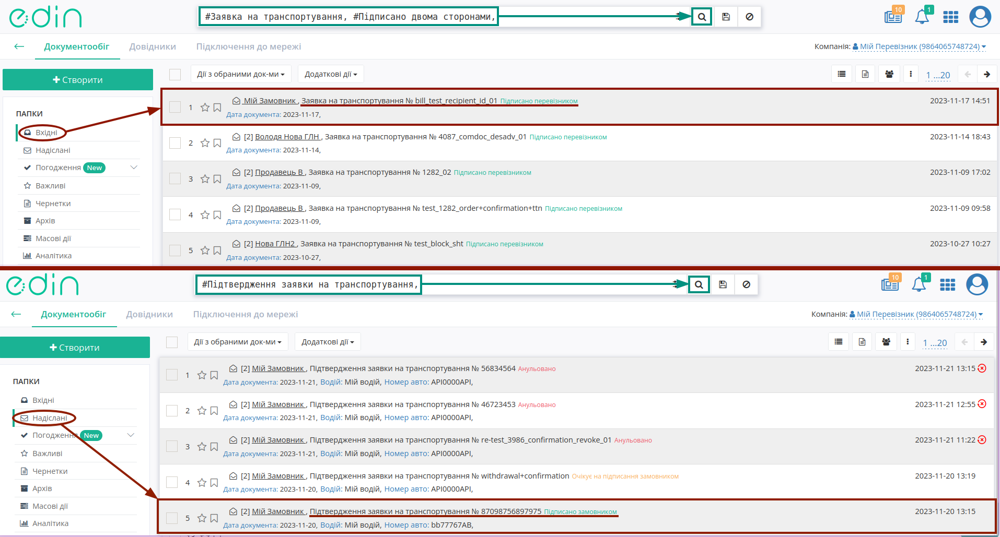
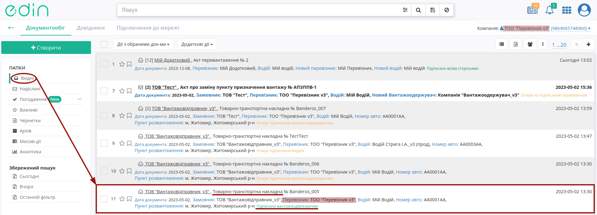
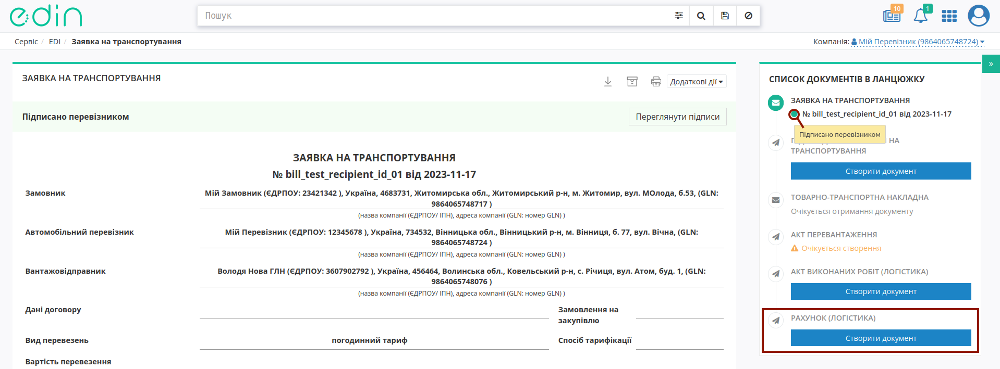
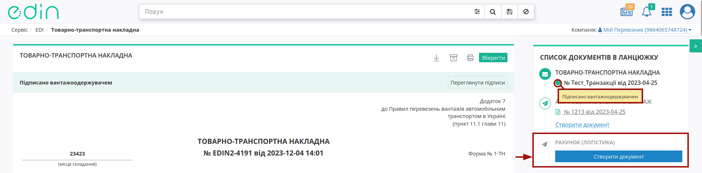

Створення "Рахунку (Логістика)" на базі інших електронних документів
###################################################################################################

.. сюда закину немного картинок для текста + юзаєм спільні зображення

.. |лупа| image:: /_constant/icons/magnifying_glass.png

.. |будинок| image:: /_constant/icons/house.png

.. |trash| image:: /_constant/icons/trash.png

.. |download| image:: /_constant/icons/download.png

.. role:: red

.. role:: green

.. role:: orange

.. role:: underline

.. contents:: Зміст:
   :depth: 3

---------

Дана інструкція описує порядок формування та відправки документа "Рахунок (Логістика)" (COMDOC_040).

Документ "Рахунок (Логістика)" (COMDOC_040) може бути створений на підставі:
   * вхідної підписаної з обох сторін "Заявки на транспортування" (TRANSPORTATIONORDER з SUBDOCTYPE = 1);
   * надісланого підписаного з обох сторін "Підтвердження заявки на транспортування" (TRANSPORTATIONORDER з SUBDOCTYPE = 2);
   * пов'язаної "е-ТТН" :underline:`підписаної контрагентами (з трьох сторін)` (документ перебуває в статусі :green:`"Підписано вантажоодержувачем"`);
   * надісланого "Акта наданих послуг (Логістика)" (COMDOC_037).

Ініціатором "Рахунку (Логістика)" виступає користувач з роллю **"Перевізник"** (при роботі з транспортними документами передбачені 4 основні ролі учасників документообігу: **"Замовник"**, **"Вантажовідправник"**, **"Перевізник"**, **"Вантажоотримувач"**). Обмін документами здійснюється між **"Перевізником"** та **"Замовником"**:

:green:`"Перевізник" -> "Замовник"`

.. _create-from-proposal-ttn:

**1. Створення "Рахунку (Логістика)" на підставі "Заявки на транспортування" / "Підтвердження заявки на транспортування" / "е-ТТН" / "Акта наданих послуг (Логістика)"**
===========================================================================================================================================

.. include:: /general_2_0/rabota_s_platformoj_EDIN_2.0.rst
   :start-after: .. початок блоку для COMDOC_037/040
   :end-before: .. кінець блоку для COMDOC_037/040

**Перевізнику** для створення в сервісі "EDI Network" **"Рахунку (Логістика)"** :

* :underline:`на підставі "Заявки на транспортування"` потрібно перейти у **"Вхідні"** та вибрати "Заявку на транспортування" в статусі :green:`"Підписано перевізником"` (для зручності можливо скористатись рядком пошуку);
* :underline:`на підставі "Підтвердження заявки на транспортування"` потрібно перейти у **"Надіслані"** та вибрати "Підтвердження заявки на транспортування" в статусі :green:`"Підписано замовником"` (для зручності можливо скористатись рядком пошуку);
* :underline:`на підставі "е-ТТН"` потрібно перейти у **"Вхідні"** та вибрати "е-ТТН" в статусі :green:`"Підписано вантажоодержувачем"` (для зручності можливо скористатись рядком пошуку);
* :underline:`на підставі "Акта наданих послуг (Логістика)"` потрібно перейти у **"Надіслані"** та вибрати "Акт наданих послуг (Логістика)" (COMDOC_037) (для зручності можливо скористатись рядком пошуку):

.. hint::
   Також на підставі :underline:`підписаних з обох сторін` "Заявок на транспортування", "Підтверджень заявок на транспортування" та  :underline:`підписаних контрагентами (з трьох сторін)` "е-ТТН" доступне `масове створення чернеток "Рахунків (Логістика)" <https://wiki.edin.ua/uk/latest/general_2_0/massovi_operacii_EDIN_2.0.html#create-comdoc-040>`__. 

У відкритому документі натисніть **"Створити документ"** "Рахунок (Логістика)" в блоці `ланцюжка документів <https://wiki.edin.ua/uk/latest/_constant/chain/chain.html>`__, наприклад:

.. початок блоку для COMDOC_040_from_transport_001

Відкриється форма редагування документа "Рахунок (Логістика)", що включає в собі дані документа-підстави ("Заявки на транспортування" / "Підтвердження заявки на транспортування" / "е-ТТН"):

.. image:: /ETTN_3_0/pics_Create_COMDOC_040_from/Create_COMDOC_040_from_025.png
   :align: center

Всі обов'язкові до заповнення поля позначені червоною зірочкою :red:`*`. Вам необхідно вказати "Номер документа" ("Дата документа" заповнюється автоматично), "Місце складання"...

.. include:: /retail_2.0/formirovanie_otpravka_dokumenta_Vydatkova_Nakladna_na_EDI_Network_2.0.rst
   :start-after: .. початок блоку для ForAllCOMDOC_006/032/037
   :end-before: .. кінець блоку для ForAllCOMDOC_006/032/037

Ваші дані, як контрагента-Перевізника автоматично заповнюються `з Вашого основного GLN <https://wiki.edin.ua/uk/latest/Personal_Cabinet/PCInstruction.html#gln-main>`__.

Після того, як всі обов'язкові дані контрагента будуть заповнені блоки можливо згорнути за допомогою кнопки **"Сховати"**. Поки документ не відправлено блок можливо **"Редагувати"** за потреби. Незаповнені поля контрагента-Замовника заповнюються аналогічно.

Можливо встановити відмітку (галочку) **"Одностороннє підписання"** - це налаштування документа для вашого контрагента, за якого отримувач документа не зобов'язаний його підписувати:

.. image:: /ETTN_3_0/pics_Create_COMDOC_040_from/Create_COMDOC_040_from_026.png
   :align: center

В документ можливо **"+Додати"** текстові **"Коментарі"** (рядки для введення тексту можливо додавати та видаляти):

.. image:: /ETTN_3_0/pics_Create_COMDOC_040_from/Create_COMDOC_040_from_022.gif
   :align: center

Блок "Результат" автоматично розраховується з таблиці. Дані позиції в табличній частині частково заповнюються з документа-підстави, для ознайомлення з яким потрібно відкрити детальний перегляд позиції:

.. image:: /ETTN_3_0/pics_Create_COMDOC_040_from/Create_COMDOC_040_from_004.png
   :align: center

.. note::
   Якщо в ланцюжку поставки (ланцюжку з документом-підставою) знаходився "Акт перевантаження" (ReloadAct) то при формуванні "Акта наданих послуг (Логістика)" :underline:`дані про Транспорт та Водія` атоматично доповнюються (додаються без дублів) в табличну частину документа:

   .. image:: /ETTN_3_0/pics_Create_COMDOC_040_from/Create_COMDOC_040_from_013.png
      :align: center

Для редагування (доповнення) даних позиції потрібно обрати кнопку **"Змінити"**, навівши курсор на відповідну позицію:

.. image:: /ETTN_3_0/pics_Create_COMDOC_040_from/Create_COMDOC_040_from_005.png
   :align: center

Також можливо **"+Додати"** нову позицію в таблицю та внести всі дані вручну. За потреби табличні позиції можливо **"Видалити"**.

.. note::
   Для бізнес-процесів Перевізника, в яких беруть участь субпідрядні компанії послуги, що мають назву **Транспортно-експедиційні послуги** при наведенні на рядок в табличній частині документа дозволяють **"Розділити"** **Транспортно-експедиційні послуги** на **Транспортні послуги** та **Експедиційну винагороду**:

   .. image:: /ETTN_3_0/pics_Create_COMDOC_040_from/Create_COMDOC_040_from_018.png
      :align: center

   В модальному вікні потрібно зазначити "Вартість перевезення без ПДВ", "Ставку ПДВ" та натиснути **"Розділити"**:

   .. image:: /ETTN_3_0/pics_Create_COMDOC_040_from/Create_COMDOC_040_from_019.png
      :align: center

   Після чого одна послуга **Транспортно-експедиційні послуги** розділяється на два рядки **Транспортні послуги** та **Експедиційна винагорода**, сумарна загальна вартість за якими не змінюється:

   .. image:: /ETTN_3_0/pics_Create_COMDOC_040_from/Create_COMDOC_040_from_020.png
      :align: center

Після того, як всі обов'язкові дані були внесені/змінені (обов'язкові до заповнення поля позначені червоною зірочкою :red:`*`), документ можливо **"Зберегти"**:

.. image:: /ETTN_3_0/pics_Create_COMDOC_040_from/Create_COMDOC_040_from_014.png
   :align: center

.. hint::
   До чернетки (збережений невідправлений документ) можливо **"+Додати файл"** - супровідний документ (вкладення в pdf форматі не має перевищувати 25MB):

   .. image:: /ETTN_3_0/pics_Create_COMDOC_040_from/Create_COMDOC_040_from_015.png
      :align: center

   Додані файли відображаються в правому верхньому куті документа, їх можливо **переглянути**, натиснувши на назву файлу, **зберегти** (|download|) чи **видалити** (|trash|):

   .. image:: /ETTN_3_0/pics_Create_COMDOC_040_from/Create_COMDOC_040_from_016.png
      :align: center

:underline:`Після Зберігання документа` його потрібно **"Підписати"** та **"Відправити"** контрагентам:

.. image:: /ETTN_3_0/pics_Create_COMDOC_040_from/Create_COMDOC_040_from_017.png
   :align: center

.. кінець блоку для COMDOC_040_from_transport_001

.. _sign:

**1.1 Підписання та відправка "Підтвердження заявки на транспортування" Перевізником**
-----------------------------------------------------------------------------------------------------

.. початок блоку для COMDOC_040_from_transport_002

.. include:: /_constant/atb_check/atb_check.rst
   :start-after: .. початок блоку для ATB_check
   :end-before: .. кінець блоку для ATB_check

.. tabs::

   .. tab:: Файловий ключ

      .. include:: /_constant/signing/signing.rst
         :start-after: .. початок блоку для Signing
         :end-before: .. кінець блоку для Signing

   .. tab:: Token

      .. include:: /_constant/token_signing/token_signing.rst
         :start-after: .. початок блоку для TokenSign
         :end-before: .. кінець блоку для TokenSign

   .. tab:: Гряда

      .. include:: /_constant/gryada_signing/gryada_signing.rst
         :start-after: .. початок блоку для GryadaSign
         :end-before: .. кінець блоку для GryadaSign

   .. tab:: Cloud

      .. include:: /_constant/cloud_signing/cloud_signing.rst
         :start-after: .. початок блоку для CloudSign
         :end-before: .. кінець блоку для CloudSign

.. початок блоку для COMDOC_040_from_transport_003

Після підписання "Рахунку (Логістика)" окремим блоком відображається інформація про підписантів. Підписаний документ можливо **"Відправити"**:

.. image:: /ETTN_3_0/pics_Create_COMDOC_040_from/Create_COMDOC_040_from_007.png
   :align: center

Після відправки документа контрагенту він відображається в журналі вихідних документів. Відправленому **"Перевізником"** "Рахунку (Логістика)" присвоюється статус :orange:`"Очікує на підписання отримувачем"`:

.. image:: /ETTN_3_0/pics_Create_COMDOC_040_from/Create_COMDOC_040_from_008.png
   :align: center

.. note::
   Якщо на етапі редагування документа була встановлена відмітка-налаштування **"Одностороннє підписання"**, відправлений документ при цьому матиме статус :green:`"Документ не потребує підписання отримувачем"`:

   .. image:: /ETTN_3_0/pics_Create_COMDOC_040_from/Create_COMDOC_040_from_027.png
      :align: center

Відправлений "Рахунок (Логістика)" має наступний вигляд:

.. image:: /ETTN_3_0/pics_Create_COMDOC_040_from/Create_COMDOC_040_from_023.png
   :align: center

На формі перегляду можливо виконати `дії з документом <https://wiki.edin.ua/uk/latest/general_2_0/rabota_s_platformoj_EDIN_2.0.html#doc-actions>`__, а для того, щоб ознайомитись з підписантами даного документа потрібно натиснути кнопку **"Переглянути підписи"**:

.. image:: /ETTN_3_0/pics_Create_COMDOC_040_from/Create_COMDOC_040_from_024.png
   :align: center

Можливо виконати **"Відхилення підпису"** поки отримувач не підписав документ (`детальніше про відхилення <https://wiki.edin.ua/uk/latest/_constant/comdoc_revoke/comdoc_revoke.html>`__).

.. кінець блоку для COMDOC_040_from_transport_002

---------------------------------

.. include:: /_constant/kontakti.rst
