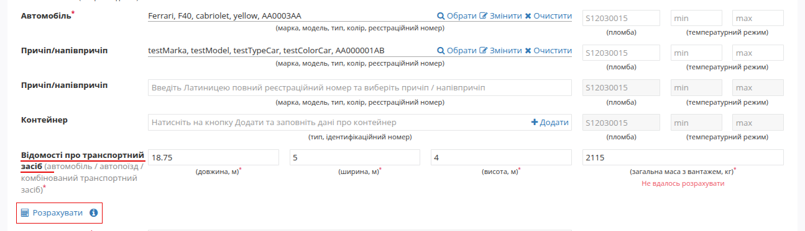
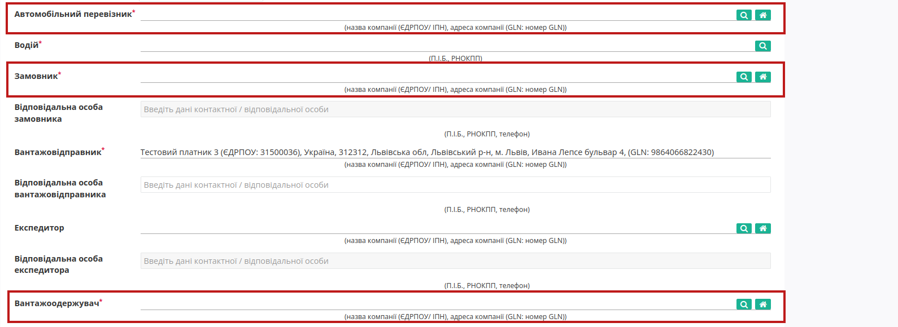
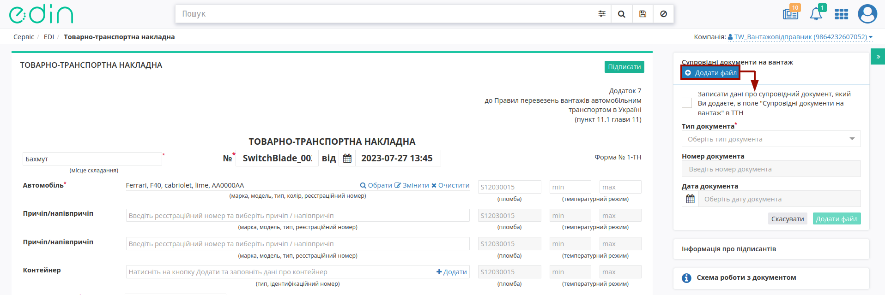
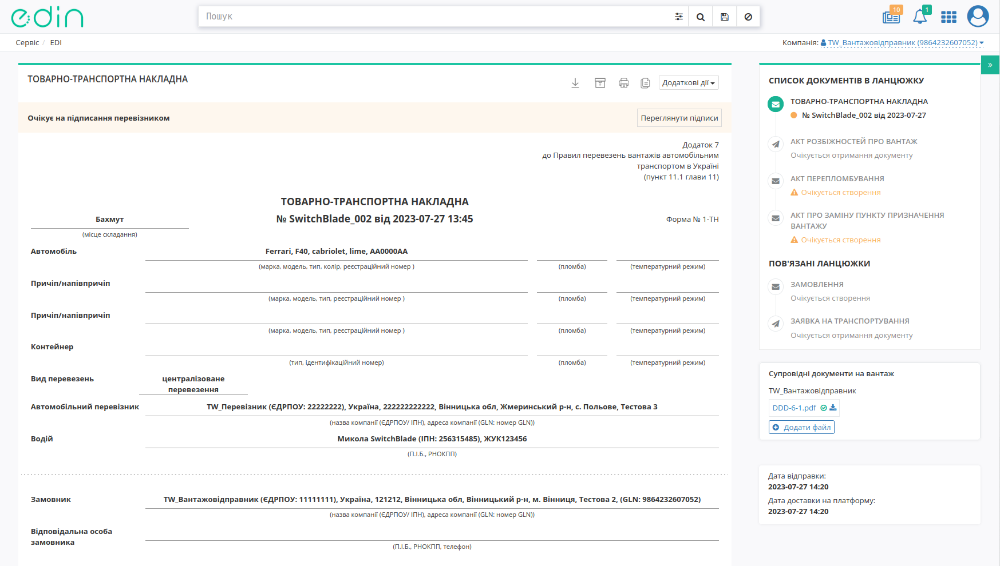

Створення та відправка "е-ТТН" з "нуля" (ручне заповнення)
###################################################################################################

.. role:: red

.. role:: orange

.. role:: green

.. role:: underline

.. сюда закину немного картинок для текста

.. |лупа| image:: /_constant/icons/magnifying_glass.png

.. |будинок| image:: /_constant/icons/house.png

.. |pencil_stencil| image:: /_constant/icons/pencil_stencil.png

.. |лупа2| image:: /_constant/icons/magnifying_glass2.png

.. |trash| image:: /_constant/icons/trash.png

.. |download| image:: /_constant/icons/download.png

.. |clone| image:: /_constant/icons/clone.png

.. |print| image:: /_constant/icons/print.png

.. |arch| image:: /_constant/icons/arch.png

.. |doc_download| image:: /_constant/icons/doc_download.png

.. |rotate| image:: /_constant/icons/rotate.png

.. contents:: Зміст:
   :depth: 6

---------

Існують різні схеми роботи з "е-ТТН" документом, що може бути створений на підставі "Замовлення" (ORDER), "Повідомлення про відвантаження" (DESADV), «Заявки на транспортування» / «Підтвердження заявки на транспортування» (TRANSPORTATIONORDER). Ініціатором документообігу може виступати будь-який учасник, однак класичною вважається схема де ініціатором документообігу виступає учасник з роллю Вантажовідправник: :green:`"Вантажовідправник" -> "Перевізник" -> "Вантажоодержувач"`

.. Розглянемо алгоритм створення "е-ТТН" без початкових документів

.. _consignor-create:

**1 Створення та відправка "е-ТТН" Вантажовідправником**
================================================================================

Для створення "е-ТТН" в сервісі "EDI Network" потрібно натиснути на кнопку **"Створити"**, вибрати **"Товарно-транспортна накладна"** як тип створюваного документа в модальному вікні (для зручності можливо скористатись рядком пошуку):

Після чого відкривається готова до заповнення порожня форма "е-ТТН" документа:

.. hint::
   Поля обов'язкові до заповнення позначені червоною зірочкою :red:`*`! **"Зберегти"** документ до чернеток можливо лише після заповнення всіх обов'язкових полів.

Для автомобілів та причепів реалізований Ваш особистий довідник, що автоматично формується при додаванні нового транспортного засобу (кнопка **"+Новий транспортний засіб"**). При додаванні нового транспортного засобу в модальному вікні потрібно заповнити "Реєстраційний номер", "Марка", "Модель", "Тип":

.. hint::
   Для раніше введеного реєстрайійного номеру (лише латинниця), наприклад, **AA0001AA** користувач може скористатись пошуком з довідника (min 4 символи), наприклад, ``AA00, 0001, 01AA, ...``:

   .. image:: pics_Create_ETTN/Create_ETTN_004.png
      :align: center

   Також через наш пошук можливо за повним збігом (8 символів) знайти транспортний засіб у відкритих джерелах:

   .. image:: pics_Create_ETTN/Create_ETTN_075.png
      :align: center

   **Примітка:** запис про зміни даних транспортного засобу вносяться в довідник лише при відправці документа!

Після додавання чи вибору транспортного засобу з'являються кнопки:

* **"Обрати"** - вибір іншого транспортного засобу;
* **"Змінити"** - редагування даних обраного транспортного засобу (редагування довідника);
* **"Очистити"** - видалити введені в рядок дані.

.. note::
   Незважаючи на те, що поля причіпа/напівпричіпа / контейнера є опціональним, при їх наявності такі дані є обов'язковими до заповнення! 

Принцип заповнення причіпа/напівпричіпа теж реалізований через довідник (аналогічно додаванню даних про автомобіль): 

При додаванні даних контейнера (кнопка **"+Додати"**) в модальному вікні потрібно обрати "Тип контейнера": 20-футовий / 40-футовий та зазначити "Ідентифікаційний номер":

По кожному вказаному транспорному засобу є можливість зазначити (опціонально) номер пломби та температурний режим:

**"Відомості про транспортний засіб"** - реалізовано можливість автоматичного розрахунку довжини, ширини, висоти транспортних засобів та загальної маси з вантажем, що значно спрощує заповнення ТТН.
Для автоматичного розрахунку: 
  * додайте всі транспортні засоби до ТТН;
  * за необхідністю відкорегуйте табличну область (товари).
  Після чого натисніть кнопку **"Розрахувати"**.

.. attention::
   * розрахунок здійснюється на основі вже доданих транспортних засобів і товару;
   * поля, які були заповнені вручну або підтягнуті з документа-підстави, не перезаписуються під час автоматичного розрахунку.
  
.. note::
   Як працює автоматичний розрахунок детально описано за `посиланням <https://wiki.edin.ua/uk/latest/ETTN_3_0/What_work_calculation.html>`__

Заповнити дані **"Автомобільний перевізник"/"Замовник"/"Вантажоодержувач"** (обов'язково) та "Проміжного складу" / "Охоронної компанії" (опціонально) можливо за допомогою кнопки **"Пошук контрагента"** (|лупа|) або ж за допомогою кнопки **"Вказати себе"** (|будинок|):

Для пошуку контрагента в модальному вікні потрібно ввести назву компанії, GLN або ІПН:

.. note::
   Дані **Вантажовідправника** - це дані Вашої компанії, що заповнюються автоматично:

   .. image:: pics_Create_ETTN/Create_ETTN_048.png
      :align: center

   Якщо ТТН формується не від імені **Вантажовідправника** (в полі зазначений учасник документообігу, відмінний від поточного), то даний документ буде відправлений лише **Вантажовідправнику** до ознайомлення, як "Попередня ТТН" (такий документ не потребує підписання і слугує підставою для `створення "е-ТТН" вказаним Вантажовідправником <https://wiki.edin.ua/uk/latest/ETTN_3_0/Create_ETTN_from.html#create-from-previous-ttn>`__):

   .. image:: pics_Create_ETTN/Create_ETTN_049.png
      :align: center

   .. attention::
      Компанія, що створює документ ТТН обов'язково має бути зазначеною серед учасників документообігу (**"Замовник" / "Вантажовідправник" / "Перевізник" / "Вантажоодержувач"**)!

Дані **"Водія"** можливо обрати за допомогою кнопки **"Пошук контрагента"** (|лупа|) за ПІБ / ІПН / даними водійського посвідчення:

Якщо водій відсутній у випадаючому списку його можливо **"+Додати"** (для того, щоб повернутись до пошуку потрібно **"Скасувати"** додавання):

Після того в модальному вікні потрібно буде заповнити обов’язкові дані про водія (поля позначені червоною зірочкою :red:`*`) та **"Додати"** Водія:

Після того, як контрагенти були обрані можливо вказати їх відповідальних осіб:

Дані раніше доданих відповідальних осіб можливо обрати з віртуального довідника чи видалити зі списку за допомогою |trash|:

Довідник автоматично наповнюється при додаванні нового відповідального (кнопка **"+Додати особу"**). При додаванні нового відповідального в модальному вікні потрібно заповнити обов'язкові контактні дані (обов'язкові поля позначені червоною зірочкою :red:`*`):

Редагувати дані раніше введених осіб можливо за допомогою кнопки **"Змінити"**:

.. image:: pics_Create_ETTN/Create_ETTN_029.png
   :align: center

Заповнене поле документа даними відповідальної особи можливо **"Очистити"** за потреби чи **"Обрати"** іншу особу. 

**"Пункт навантаження"** та **"Пункт розвантаження"** (зазвичай: дані **Вантажовідправника** та **Вантажоодержувача** відповідно) необхідно обрати за допомогою кнопки **"Пошук контрагента"** (|лупа|) за назвою компанії, GLN або ІПН:

Можливо вказати за потреби дані "Супровідних документів на вантаж" через кнопку **"+Додати"** та вибравши тип документа, згідно з яким здійснюється супровід, вказати номер та дату документа:

.. hint::
   За потреби можливо **"Додати 3тю сторону (додатковий учасник)"**, обравши додаткову роль та вибравши учасника за Назвою / GLN / ІПН компанії:

   .. image:: pics_Create_ETTN/Create_ETTN_074.png
      :align: center

   Для всіх додаткових учасників доступний лише перегляд "е-ТТН" та вкладень до документа!

.. note::
   Супровідних документів може бути багато (додаються кнопкою **"+Додати"**), їх можливо редагувати (|pencil|) після додавання чи видалити за потреби (|x|).

Також можлив вказати за потреби номер та дату "Спеціальної охорону вантажу" та/чи "Права на пред'влення претензії" через кнопку **"Додати"**:

 .. hint::
   Після заповнення всіх обов'язкових полів "е-ТТН" можливо **"Зберегти"**, як "Чернетку" та повернутись до редагування пізніше:

   .. image:: pics_Create_ETTN/Create_ETTN_022.png
      :align: center

.. note::
   Загальні дані полів **"Кількість місць"**, **"Масою бруто, кг"**, **"Усього відпущено на загальну суму"**, "у т.ч. ПДВ" автоматично підраховуються та заповнюються (перезаписуються) при додаванні значень в таблицю **"Відомостей про вантаж"**:

   .. image:: pics_Create_ETTN/Create_ETTN_025.png
      :align: center

.. _consignor-table:

**1.1 Заповнення табличної частини**
---------------------------------------

Таблична частина на етапі заповнення документа складається з блоків **"Відомості про вантаж"**, **"Вантажно-розвантажувальні операції"** та **"Додаткові дані"**:

**1.1.1 Відомості про вантаж**
~~~~~~~~~~~~~~~~~~~~~~~~~~~~~~~~~~~~~~~~~~~~~~~~~~~~~~

Заповнення "Відомостей про вантаж" є обов'язковим і його можливо здійснити кількома способами: 

**1. Вручну**
""""""""""""""""""""""""""""""""""""

Потрібно натиснути на кнопку **"Додати"** та заповнити відповідні поля в модальному вікні (поля обов'язкові до заповнення позначені червоною зірочкою :red:`*`):

Для заповнення даних "Документ з вантажем" реалізована кнопка **"+Додати"**, при натисканні на яку відкриваються обов'язкові до заповнення поля:

Внесення даних можливо **"Скасувати"**, а вже введені дані можливо редагувати (|pencil|) чи видалити за потреби (|x|). Після того, як всі обов'язкові поля форми будуть заповнені їх можливо **"Додати"**. Поля "Загальна сума з ПДВ" та "Загальна сума без ПДВ" позиції розраховуються автоматично з кількості одиниць та ціни з/без ПДВ відповідно з округленням до двох знаків після коми.

**2. Шаблоном** 
""""""""""""""""""""""""""""""""""""

Також для додавання табличних даних (вантаж) є можливість скористатись шаблоном. Для цього над таблицею необхідно натиснути **"Зберегти шаблон Excel"** (1).

На Ваш комп’ютер буде завантажено файл з назвою **ettn_products_sample.xlsx**. Відкривши його, необхідно внести інформацію про вантаж.

Обов’язкові для заповнення поля в файлі відмічені зеленим кольором ("Найменування вантажу", "Маса брутто, кг").

.. important:: Не дозволяється: змінювати формат шаблону, видаляти або додавати нові стовпці. Також не допускається зміна формату комірок.

Після заповнення файлу інформацією про вантаж потрібно завантажити файл за допомогою кнопки **"Завантажити позиції з Excel"** (2).

.. warning::
   Якщо у файлі будуть допущені помилки, то позиції не додаються в таблицю, а виводиться повідомлення з помилками:

   .. image:: pics_Create_ETTN/Create_ETTN_063.png
      :align: center

   Детально з помилками Ви можете ознайомитись, натиснувши на кнопку **"Подивитися звіт про помилки"**:

   .. image:: pics_Create_ETTN/Create_ETTN_064.png
      :align: center

   Потрібно виправити вказані помилки та повторно **"Завантажити позиції з Excel"**!

За необхідністю є можливість додавати ще вантаж(і), для цього необхідно натиснути на кнопку **"Додати"** та заповнити інформацію в модальному вікні.

Для редагування інформації щодо вантажу необхідно навести курсор на рядок цього вантажу та натиснути **"Змінити"**, для видалення – **"Видалити"**:

Для збереження внесених змін при редагуванні потрібно підтвердити зміни у відкритій формі кнопкою **"Змінити"**!

**1.1.2 Вантажно-розвантажувальні операції**
~~~~~~~~~~~~~~~~~~~~~~~~~~~~~~~~~~~~~~~~~~~~~~~~~~~~~~

При заповненні **"Вантажно-розвантажувальних операцій"** вказуються "Маса бруто, кг" (копіюється загальне значення при активації курсора), "Дата і час прибуття", "Дата і час вибуття", "Час простою":

Додатково в таблиці вантажно-розвантажувальних операцій можливо **"+Додати"** поля для внесення даних відповідальних осіб, що здають вантаж зі сторони Вантажовідправника чи видалити кнопкою **"-"**:

.. початок блоку для TTN_to_Processing

Дані раніше доданих відповідальних осіб можливо обрати з віртуального довідника чи видалити зі списку за допомогою |trash|:

.. image:: /ETTN_3_0/pics_Create_ETTN/Create_ETTN_031.png
   :align: center

Довідник автоматично наповнюється при додаванні нового відповідального (кнопка **"+Додати особу"**). При додаванні нового відповідального в модальному вікні потрібно заповнити обов'язкові контактні дані (обов'язкові поля позначені червоною зірочкою :red:`*`):

.. image:: /ETTN_3_0/pics_Create_ETTN/Create_ETTN_032.png
   :align: center

Редагувати дані раніше введених осіб можливо за допомогою кнопки **"Змінити"** (|pencil_stencil|):

.. image:: /ETTN_3_0/pics_Create_ETTN/Create_ETTN_034.png
   :align: center

За потреби можливо **"Обрати"** (|лупа2|) іншу особу замість обраної/доданої раніше. 

.. hint::
   **При підписанні:** якщо поле Вашої **"Відповідальної особи"** :underline:`незаповнене`, то воно може автоматично заповнюватись даними з Вашого ЕЦП (якщо це можливо).

.. кінець блоку для TTN_to_Processing

**1.1.3 Додаткові дані**
~~~~~~~~~~~~~~~~~~~~~~~~~~~~~~~~~~~~~~~~~~~~~~~~~~~~~~

Опціонально можуть бути заповнені **"Додаткові дані"** за допомогою кнопки **"Додати"**:

Автоматично визначається Ваша роль в документообігу. Для різних ролей існує свій набір полів. Можливо обрати поле та ввести відповідне значення. Такі додаткові поля не можуть повторюватись на рівні одного документа.

--------

:underline:`Після Зберігання документа` до чернетки можливо **"+Додати файл"** на вантаж (лише в pdf форматі):

При додаванні файлу потрібно обрати **"Тип документа"**, після чого можливо **"Додати файл"**:

Додані файли відображаються в правому верхньому куті документа, їх можливо **переглянути**, натиснувши на назву файлу, **зберегти** (|download|) чи **видалити** (|trash|):

.. hint::
   Можливо записати дані про супровідний документ, який Ви додаєте, в поле "Супровідні документи на вантаж" в ТТН, поставивши відмітку (при цьому обов'язково заповнюються номер та дата документа):

   .. image:: pics_Create_ETTN/Create_ETTN_038.png
      :align: center

   При цьому в поле "Супровідні документи на вантаж" додається відповідний запис:

   .. image:: pics_Create_ETTN/Create_ETTN_039.png
      :align: center

   Додані супровідні документи можливо завантажити, переглянути в браузері (натиснувши на назву) чи видалити. При видаленні такого файлу система запитає чи потрібно видаляти дані з поля "Супровідні документи на вантаж", що були внесені при додаванні файлу:

   .. image:: pics_Create_ETTN/Create_ETTN_042.png
      :align: center

.. _sign:

**1.2 Підписання та відправка документа**
------------------------------------------------------------------------------

Для підписання "е-ТТН" необхідно натиснути на кнопку **"Підписати"**:

.. note::
   "Попередня ТТН" (документ, в якому поле **Вантажовідправника** заповнено даними компанії відмінної від поточної) не потребує підписання (кнопка **"Підписати"** відсутня).

.. include:: /_constant/atb_check/atb_check.rst
   :start-after: .. початок блоку для ATB_check
   :end-before: .. кінець блоку для ATB_check

.. tabs::

   .. tab:: Файловий ключ

      .. include:: /_constant/signing/signing.rst
         :start-after: .. початок блоку для Signing
         :end-before: .. кінець блоку для Signing

   .. tab:: Token

      .. include:: /_constant/token_signing/token_signing.rst
         :start-after: .. початок блоку для TokenSign
         :end-before: .. кінець блоку для TokenSign

   .. tab:: Гряда

      .. include:: /_constant/gryada_signing/gryada_signing.rst
         :start-after: .. початок блоку для GryadaSign
         :end-before: .. кінець блоку для GryadaSign

   .. tab:: Дія.Підпис

      .. include:: /_constant/diya_signing/diya_signing.rst
         :start-after: .. початок блоку для DiyaPidps
         :end-before: .. кінець блоку для DiyaPidps

   .. tab:: Cloud

      .. include:: /_constant/cloud_signing/cloud_signing.rst
         :start-after: .. початок блоку для CloudSign
         :end-before: .. кінець блоку для CloudSign

Після підписання "е-ТТН" відображається інформація щодо підписантів. Для відправки е-ТТН необхідно натинути на кнопку **"Надіслати"**:

Після відправки "е-ТТН" **Вантажовідправником** документ відображається в журналі надісланих документів в статусі :orange:`"Очікує на підписання перевізником"`:

.. note::
   Якщо ж документ створювався іншим учасником документообігу, то після відправки документ відображається в журналі надісланих документів в статусі :orange:`"Попередня ТТН"`:

   .. image:: pics_Create_ETTN/Create_ETTN_050.png
      :align: center

.. attention::
   Якщо один учасник документообігу (ідентифікатором є GLN) зазначений для кількох ролей (**"Замовник"**, **"Вантажовідправник"**, **"Експедитор"**, **"Водій"**, **"Перевізник"**, **"Вантажоодержувач"**), то після відправки документа у цього контрагента буде кнопка, що дозволяє йому **"Змінити роль"** (жовтим кольором відображається підказка з поточною роллю за замовмуванням):

   .. image:: pics_Create_ETTN/Create_ETTN_055.png
      :align: center

   Функціонал Відхилення / Підписання / Відправки / ... буде доступний лише для відведеної для цих дій ролі відповідно до життєвого циклу документа (статусу), що відповідає основній послідовності обробки та схемі обміну цим документом. 

Відправлена е-ТТН має наступний вигляд:

В шапці документа відображається статус, виділений відповідним кольором. В цьому ж рядку можливо **"Переглянути підписи"**, натиснувши на одноіменну кнопку:

За потреби можливо (**"Додаткові дії"** ->) **"Відмовитись від підписання"** (`детальніше <https://wiki.edin.ua/uk/latest/ETTN_3_0/ETTN_Reject.html>`__).

У відправленого документа з'являється ряд функціональних кнопок:

За допомогою цих кнопок можливо:

* |doc_download| - завантажити створену "е-ТТН", обравши один з доступних форматів (.pdf / .xml / .xls / .zip / Архів для ЦЗО);
* |arch| - відправити/повернути ланцюжок документів до/з папки "Архів";
* |print| - відправити на друк даний документ;
* |clone| - створити новий "е-ТТН" документ з автоматично заповненими даними з цього документа.

.. hint::
   Можливість завантажити "Архів для ЦЗО" дає Вам змогу перевірити всі транзакції з документом (окремо) на державному ресурсі https://czo.gov.ua/verify

   .. image:: pics_Create_ETTN/Create_ETTN_077.gif
      :align: center

При відправці документа в ЦБД реєструються й Ваші додані супровідні документи. При успішній реєстрації після назви файлу ставиться зелена галочка, а при виникненні помилки червоний хрестик:

При цьому при виникненні помилки з вкладенням його можливо спробувати перевідправити за допомогою кнопки |rotate| чи видалити (|trash|).

Будь-який учасник документообігу завжди має можливість **"Додати файл"** супровідного документа (без можливості його видалити)! Однак, якщо при додаванні файлу є відмітка про додавання цих даних в форму документа, то такі дії прирівнюються до внесення змін в документ і потребують підписання та відправки нової транзакції:

Також можливо відмінити зміни в документ кнопкою **"Очистити"** (вкладення при цьому залишається).

---------------------------------

.. include:: /_constant/kontakti.rst

