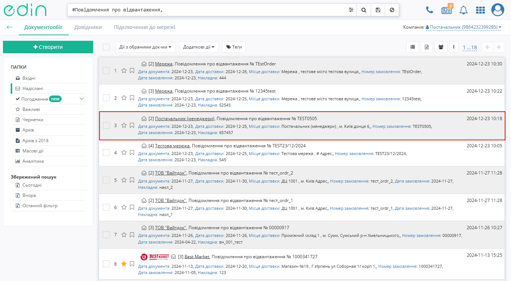
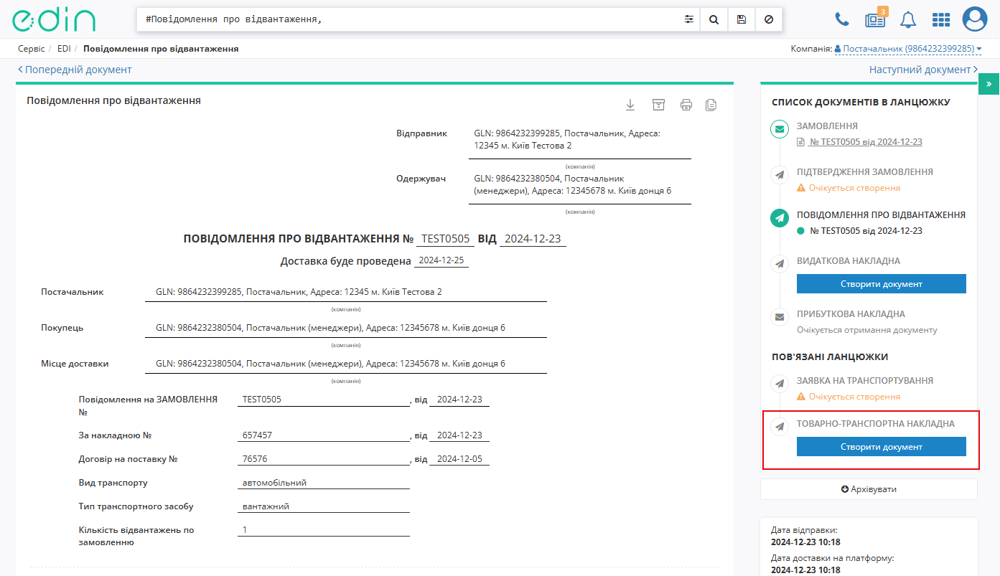
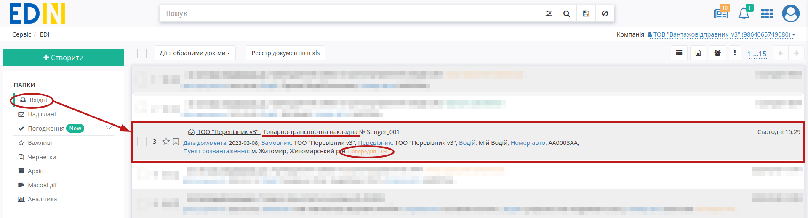
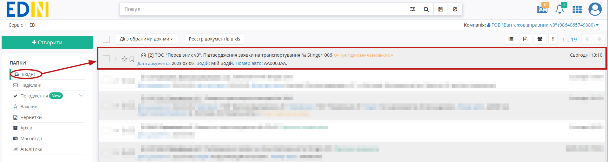
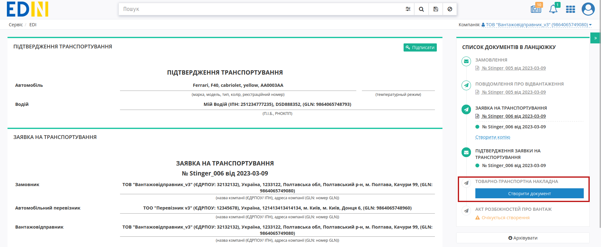
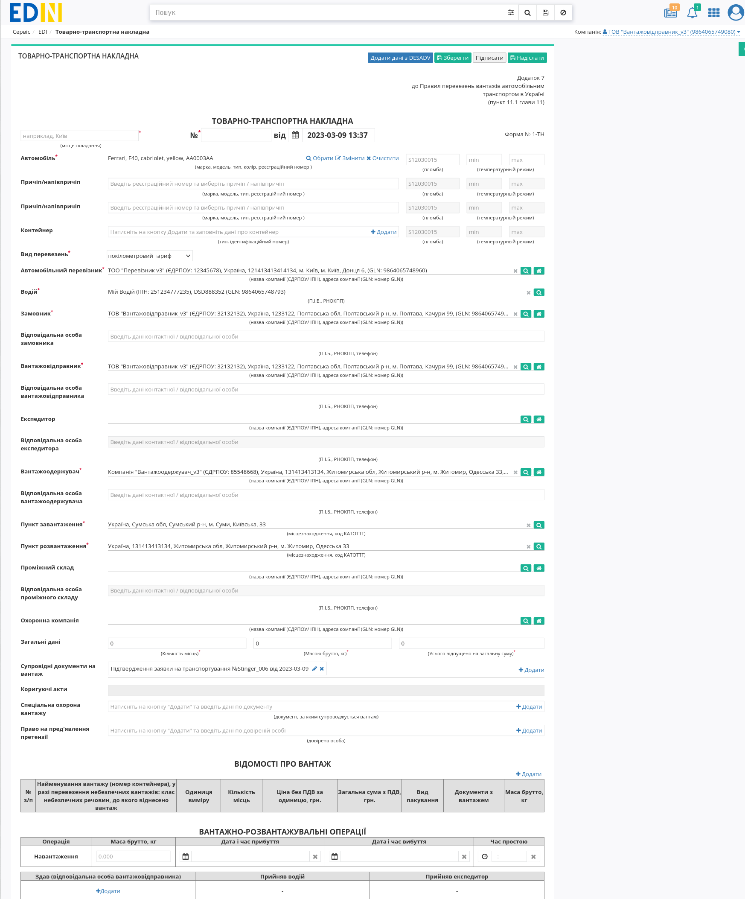

Створення "е-ТТН" на базі інших електронних документів
###################################################################################################

.. role:: red

.. role:: orange

.. role:: green

.. role:: underline

.. сюда закину немного картинок для текста

.. |pencil| image:: pics_Create_ETTN_from/Create_ETTN_from_020.png

.. |x| image:: pics_Create_ETTN_from/Create_ETTN_from_021.png

.. |pencil_stencil| image:: pics_Create_ETTN_from/Create_ETTN_from_033.png

.. |лупа2| image:: pics_Create_ETTN_from/Create_ETTN_from_035.png

.. |trash| image:: pics_Create_ETTN_from/Create_ETTN_from_040.png

.. contents:: Зміст:
   :depth: 6

---------

Для реалізації різних схем електронного документообігу "е-ТТН" документ можливо створити на підставі "Замовлення" (ORDER), "Повідомлення про відвантаження" (DESADV), «Підтвердження заявки на транспортування» (TRANSPORTATIONORDER). Ініціатором документообігу може виступати будь-який учасник, однак класичною вважається схема де ініціатором документообігу виступає учасник з роллю Вантажовідправник: :green:`"Вантажовідправник" -> "Перевізник" -> "Вантажоотримувач"`. `Інструкція створення "е-ТТН" документа "з нуля" <https://wiki.edin.ua/uk/latest/ETTN_3_0/Create_ETTN.html>`__ за посиланням.

.. _create-from-previous-ttn:

**1 Створення "е-ТТН" на підставі "Попередньої ТТН"**
==========================================================================================

Якщо ТТН формується не від імені **Вантажовідправника** (в полі зазначений учасник документообігу, відмінний від того, що створює "е-ТТН"), то даний документ буде відправлений лише **Вантажовідправнику** до ознайомлення, як "Попередня ТТН" (такий документ не потребує підписання).

Для створення "е-ТТН" на підставі "Попередньої ТТН" в сервісі "EDI+ЮЗД" **Вантажовідправнику** потрібно перейти у **"Вхідні"** та вибрати **"Товарно-транспортна накладна"** в статусі :orange:`"Попередня ТТН"` (для зручності можливо скористатись рядком пошуку):

Ви можете ознайомитись з відкритим документом і **"Створити Документ ТТН"**:

.. image:: pics_Create_ETTN_from/Create_ETTN_from_002.png
   :align: center

Відкриється форма редагування документа "е-ТТН", що вже заповнена даними з "Попередньої ТТН" (документ доступний до редагування/доповнення):

.. image:: pics_Create_ETTN_from/Create_ETTN_from_003.png
   :align: center

Після того, як всі зміни (за потреби) були внесені документ можливо **"Зберегти"**, **"Підписати"** та **"Надіслати"**. Процеси `заповнення/редагування даних чернетки "е-ТТН", підписання та відправка <https://wiki.edin.ua/uk/latest/ETTN_3_0/Create_ETTN.html#consignor-create>`__ детально описані в окремій інструкції.

.. _create-from-transportationorder:

**2 Створення "е-ТТН" на підставі «Підтвердження заявки на транспортування» (TRANSPORTATIONORDER з SUBDOCTYPE = 2)**
==========================================================================================================================

Для створення "е-ТТН" на підставі «Підтвердження заявки на транспортування» (TRANSPORTATIONORDER з SUBDOCTYPE = 2) в сервісі "EDI+ЮЗД" **Вантажовідправнику** потрібно перейти у **"Вхідні"** та вибрати «Підтвердження заявки на транспортування» (для зручності можливо скористатись рядком пошуку):

У відкритому документі натисніть **"Створити документ"** в блоці `ланцюжка документів <https://wiki.edin.ua/uk/latest/_constant/chain/chain.html>`__ "Товарно-транспортна накладна"(ETTN):

.. note::
   Якщо в "Заявці на транспортування" вказано кілька **Вантажоодержувачів**, то згідно з правилами оформлення електронної ТТН, тільки одна адреса навантаження та розвантаження може бути використана (в модальному вікні потрібно обрати одну адресу з переліку, для котрої буде створено ТТН):

   .. image:: pics_Create_ETTN_from/Create_ETTN_from_011.png
      :align: center

Відкриється форма редагування документа "е-ТТН", що вже заповнена даними з документа-підстави:

Дані, що переносяться з "Підтвердження заявки на транспортування" доступні до редагування.

.. tip::
   "Підтвердження заявки на транспортування", на базі якої була заповнена створена "е-ТТН" не містить інформацію про товарні позиції, однак якщо в `ланцюжку документів <https://wiki.edin.ua/uk/latest/_constant/chain/chain.html>`__ присутній відправлений **Вантажовідправником** документ "Повідомлення про відвантаження" (DESADV):

   .. image:: pics_Create_ETTN_from/Create_ETTN_from_007.png
      :align: center

   То в такому випадку при створенні "е-ТТН" **Вантажовідправником** на формі редагування документа можливо **"Додати дані з DESADV"**:

   .. image:: pics_Create_ETTN_from/Create_ETTN_from_008.png
      :align: center

   Якщо в `ланцюжку документів <https://wiki.edin.ua/uk/latest/_constant/chain/chain.html>`__ кілька "Повідомлень про відвантаження" (DESADV), то при натисканні на кнопку **"Додати дані з DESADV"** можливо обрати один або ж декілька документів, з яких Ви бажаєте підтягнути дані у Товарно-транспортну накладну:

   .. image:: pics_Create_ETTN_from/Create_ETTN_from_009.png
      :align: center

   В супровідних документах при цьому відображаються дані документа-підстави ("Підтвердження заявки на транспортування") та всіх обраних до додавання "Повідомлень про відвантаження":

   .. image:: pics_Create_ETTN_from/Create_ETTN_from_010.png
      :align: center

Після того, як всі обов'язкові поля на формі редагування "е-ТТН" будуть заповнені (позначені червоною зірочкою :red:`*`) документ можливо **"Зберегти"**, **"Підписати"** та **"Надіслати"**. Процеси `заповнення/редагування даних чернетки "е-ТТН", підписання та відправка <https://wiki.edin.ua/uk/latest/ETTN_3_0/Create_ETTN.html#consignor-create>`__ детально описані в окремій інструкції.

---------------------------------

.. include:: /_constant/kontakti.rst

