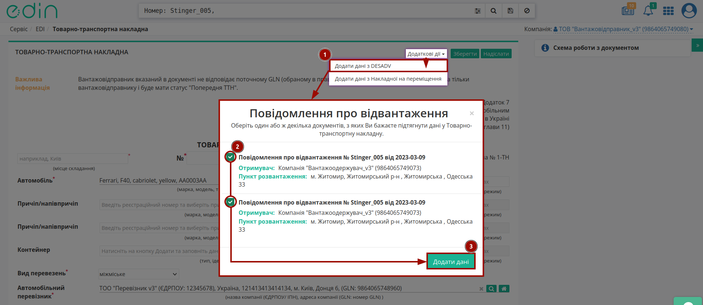
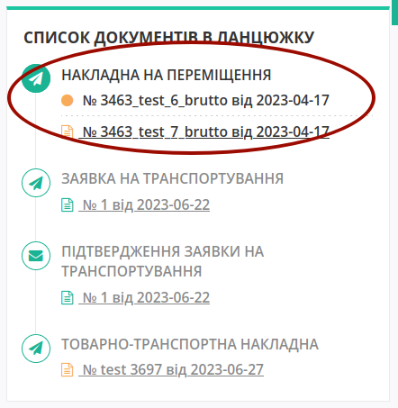
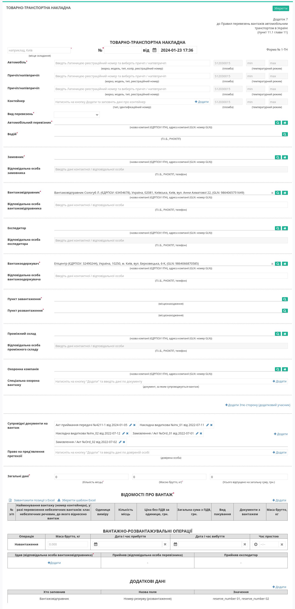
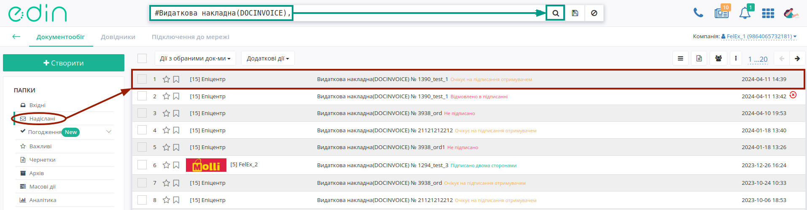
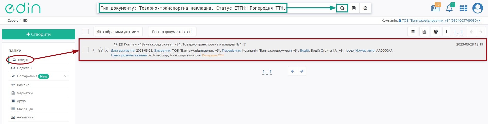
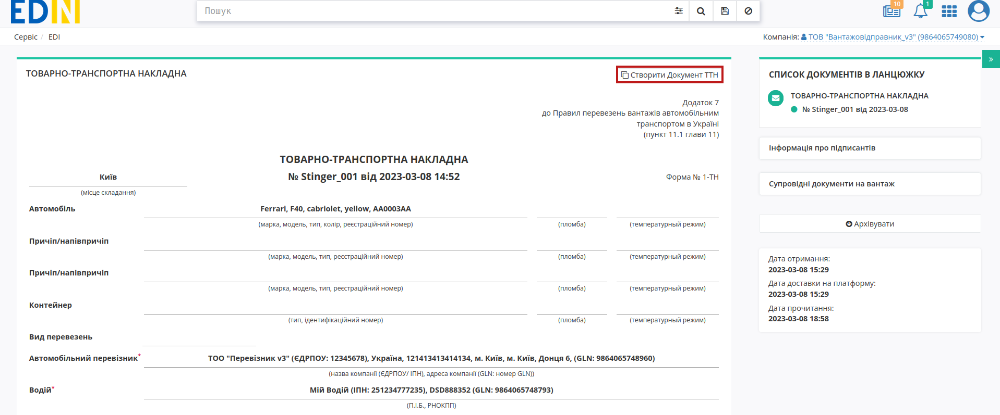
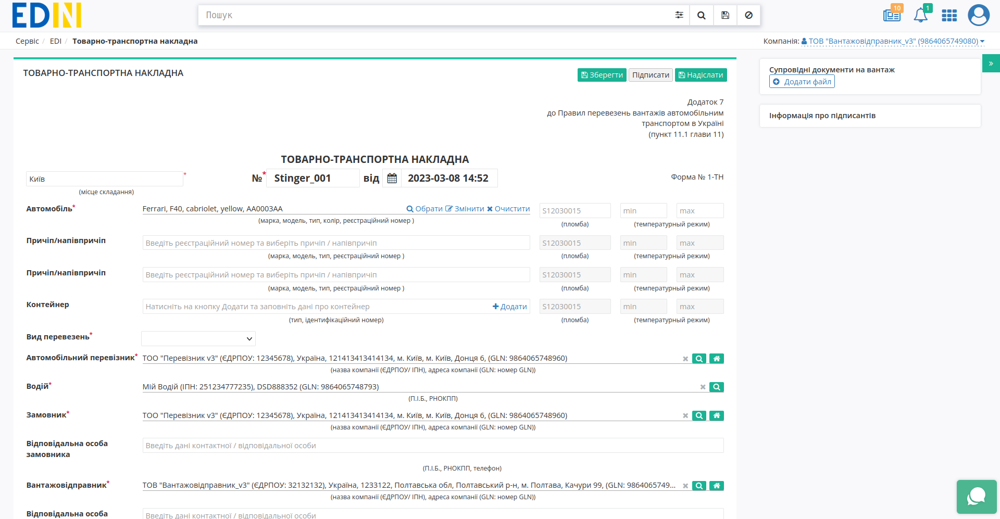

Створення "е-ТТН" на базі інших електронних документів
###################################################################################################

.. role:: red

.. role:: orange

.. role:: green

.. role:: underline

.. сюда закину немного картинок для текста

.. |лупа| image:: /_constant/icons/magnifying_glass.png

.. |будинок| image:: /_constant/icons/house.png

.. |trash| image:: pics_Create_ETTN_from/Create_ETTN_from_040.png

.. contents:: Зміст:
   :depth: 6

---------

Для реалізації різних схем електронного документообігу "е-ТТН" документ можливо створити на підставі:
   * "Замовлення" (ORDER);
   * "Повідомлення про відвантаження" (DESADV);
   * «Підтвердження заявки на транспортування» (TRANSPORTATIONORDER).
   
Ініціатором документообігу може виступати будь-який учасник, однак класичною вважається схема де ініціатором документообігу виступає учасник з роллю Вантажовідправник: :green:`"Вантажовідправник" -> "Перевізник" -> "Вантажоодержувач"`. 

.. hint::
   `Інструкція створення "е-ТТН" документа "з нуля" <https://wiki.edin.ua/uk/latest/ETTN_3_0/Create_ETTN.html>`__.

.. _create-from-previous-ttn:

**1. Створення "е-ТТН" на підставі "Попередньої ТТН"**
==========================================================================================

Якщо ТТН формується не від імені **Вантажовідправника** (в полі зазначений учасник документообігу, відмінний від того, що створює "е-ТТН"), то даний документ буде відправлений лише **Вантажовідправнику** до ознайомлення, як "Попередня ТТН" (такий документ не потребує підписання).

Для створення "е-ТТН" на підставі "Попередньої ТТН" в сервісі "EDI Network" **Вантажовідправнику** потрібно перейти у **"Вхідні"** та вибрати **"Товарно-транспортна накладна"** в статусі :orange:`"Попередня ТТН"` (для зручності можливо скористатись `пошуком <https://wiki.edin.ua/uk/latest/general_2_0/rabota_s_platformoj_EDIN_2.0.html#doc-search>`__):

Ви можете ознайомитись з відкритим документом і **"Створити Документ ТТН"**:

Відкриється форма редагування документа "е-ТТН", що вже заповнена даними з "Попередньої ТТН" (документ доступний до редагування/доповнення):

Після того, як всі зміни (за потреби) були внесені документ можливо **"Зберегти"**, **"Підписати"** та **"Надіслати"**. Процеси `заповнення/редагування даних чернетки "е-ТТН", підписання та відправка <https://wiki.edin.ua/uk/latest/ETTN_3_0/Create_ETTN.html#consignor-create>`__ детально описані в окремій інструкції.

.. _create-from-transportationorder:

**2. Створення "е-ТТН" на підставі «Підтвердження заявки на транспортування» (TRANSPORTATIONORDER з SUBDOCTYPE = 2)**
==========================================================================================================================

.. початок блоку для ETTN_from_Proposal_Confirmation

Для створення "е-ТТН" на підставі «Підтвердження заявки на транспортування» (TRANSPORTATIONORDER з SUBDOCTYPE = 2) в сервісі "EDI Network" **Вантажовідправнику** потрібно перейти у **"Вхідні"** та вибрати «Підтвердження заявки на транспортування» (для зручності можливо скористатись рядком пошуку):

.. image:: /ETTN_3_0/pics_Create_ETTN_from/Create_ETTN_from_027.png
   :align: center

У відкритому документі натисніть **"Створити документ"** в блоці `ланцюжка документів <https://wiki.edin.ua/uk/latest/_constant/chain/chain.html>`__ "Товарно-транспортна накладна"(ETTN):

.. image:: /ETTN_3_0/pics_Create_ETTN_from/Create_ETTN_from_026.png
   :align: center

.. note::
   Якщо в "Заявці на транспортування" вказано кілька **Вантажоодержувачів**, то згідно з правилами оформлення електронної ТТН, тільки одна адреса навантаження та розвантаження може бути використана (в модальному вікні потрібно обрати одну адресу з переліку, для котрої буде створено ТТН):

   .. image:: /ETTN_3_0/pics_Create_ETTN_from/Create_ETTN_from_011.png
      :align: center

Відкриється форма редагування документа "е-ТТН", що вже заповнена даними з документа-підстави:

.. image:: /ETTN_3_0/pics_Create_ETTN_from/Create_ETTN_from_025.png
   :align: center

Дані, що переносяться з "Підтвердження заявки на транспортування" доступні до редагування.

.. кінець блоку для ETTN_from_Proposal_Confirmation

.. tip::
   .. tabs::

      .. tab:: Додати дані з DESADV

         "Підтвердження заявки на транспортування", на базі якої була заповнена створена "е-ТТН" не містить інформацію про товарні позиції, однак якщо в `ланцюжку документів <https://wiki.edin.ua/uk/latest/_constant/chain/chain.html>`__ присутній відправлений **Вантажовідправником** документ "Повідомлення про відвантаження" (DESADV):

         .. image:: /ETTN_3_0/pics_Create_ETTN_from/Create_ETTN_from_007.png
            :align: center

         В такому випадку при створенні "е-ТТН" **Вантажовідправником** на формі редагування документа можливо **"Додати дані з DESADV"** (**"Додаткові дії"**):

         .. image:: /ETTN_3_0/pics_Create_ETTN_from/Create_ETTN_from_023.png
            :align: center

         Якщо в `ланцюжку документів <https://wiki.edin.ua/uk/latest/_constant/chain/chain.html>`__ кілька "Повідомлень про відвантаження" (DESADV), то при натисканні на кнопку **"Додати дані з DESADV"** можливо обрати один або ж декілька документів, з яких Ви бажаєте підтягнути дані у Товарно-транспортну накладну:

         .. image:: /ETTN_3_0/pics_Create_ETTN_from/Create_ETTN_from_020.png
            :align: center

         В супровідних документах при цьому відображаються дані документа-підстави ("Підтвердження заявки на транспортування") та всіх обраних до додавання "Повідомлень про відвантаження":

         .. image:: /ETTN_3_0/pics_Create_ETTN_from/Create_ETTN_from_010.png
            :align: center
         
         .. note::
            Додаткові налаштування за замовчуванням для **Вантажовідправника** = ПрАТ "Монделіс Україна" заповнюються поля "Вид пакування" = Ящик та "Документи з вантажем" = Номер та Дата з "Повідомлення про відвантаження" (DESADV) для всіх товарних позицій:

            .. image:: /ETTN_3_0/pics_Create_ETTN_from/Create_ETTN_from_030.png
               :align: center
            
            Однак, якщо при цьому **Вантажоодержувач** = ТМ "АТБ" то заповнюється лише поле "Вид пакування" = Ящик для всіх товарних позицій:

            .. image:: /ETTN_3_0/pics_Create_ETTN_from/Create_ETTN_from_029.png
               :align: center

      .. tab:: Додати дані з Накладної на переміщення

         "Підтвердження заявки на транспортування", на базі якої була заповнена створена "е-ТТН" не містить інформацію про товарні позиції, однак якщо в `ланцюжку документів <https://wiki.edin.ua/uk/latest/_constant/chain/chain.html>`__ присутній документ "Накладна на переміщення" (COMDOC_022):

         .. image:: /ETTN_3_0/pics_Create_ETTN_from/Create_ETTN_from_021.png
            :align: center

         То в такому випадку при створенні "е-ТТН" **Вантажовідправником** на формі редагування документа можливо **"Додати дані з Накладної на переміщення"** (**"Додаткові дії"**):

         .. image:: /ETTN_3_0/pics_Create_ETTN_from/Create_ETTN_from_024.png
            :align: center

         Якщо в `ланцюжку документів <https://wiki.edin.ua/uk/latest/_constant/chain/chain.html>`__ кілька "Накладних на переміщення" (COMDOC_022), то при натисканні на кнопку **"Додати дані з Накладної на переміщення"** можливо обрати один або ж декілька документів, з яких Ви бажаєте підтягнути дані у Товарно-транспортну накладну:

         .. image:: /ETTN_3_0/pics_Create_ETTN_from/Create_ETTN_from_019.png
            :align: center

         В супровідних документах при цьому відображаються дані документа-підстави ("Підтвердження заявки на транспортування") та всіх обраних до додавання "Накладні на переміщення":

         .. image:: /ETTN_3_0/pics_Create_ETTN_from/Create_ETTN_from_022.png
            :align: center

Після того, як всі обов'язкові поля на формі редагування "е-ТТН" будуть заповнені (позначені червоною зірочкою :red:`*`) документ можливо **"Зберегти"**, **"Підписати"** та **"Надіслати"**. Процеси `заповнення/редагування даних чернетки "е-ТТН", підписання та відправка <https://wiki.edin.ua/uk/latest/ETTN_3_0/Create_ETTN.html#consignor-create>`__ детально описані в окремій інструкції.

.. _create-from-desadv:

**3. Створення "е-ТТН" на підставі "Повідомлення про відвантаження" (DESADV)**
==========================================================================================================================

.. початок блоку для ETTN_from_DESADV

ТТН можна створити на основі одного або декількох "Повідомлень про відвантаження" (DESADV).

Для створення **"е-ТТН"** на підставі **"Повідомлення про відвантаження"** (DESADV) в сервісі **"EDI Network"** Вантажовідправнику потрібно відкрити папку **"Надіслані"** та відфільтрувати в журналі документів "Повідомлення про відвантаження". 

   .. note::
      Для зручності скористайтесь рядком пошуку.

.. image:: /ETTN_3_0/pics_Create_ETTN_from/Create_ETTN_from_012.png
   :align: center

.. tabs::

   .. tab:: На підставі одного DESADV

      Для створення **"е-ТТН"** на основі одного DESADV оберіть відповідне **"Повідомлення про відвантаження"** в журналі документів. 

      .. image:: /ETTN_3_0/pics_Create_ETTN_from/Create_ETTN_from_013.png
         :align: center

      
      У відкритому документі натисніть **"Створити документ"** в блоці `ланцюжка документів <https://wiki.edin.ua/uk/latest/_constant/chain/chain.html>`__ "Товарно-транспортна накладна"(ETTN).

      .. image:: /ETTN_3_0/pics_Create_ETTN_from/Create_ETTN_from_014.png
         :align: center

   .. tab:: На підставі декількох DESADV

      Для створення **"е-ТТН"** на основі декількох DESADV оберіть декілька **"Повідомлень про відвантаження"** в журналі документів.
      Після чого в меню масових дій з обраними документами оберіть дію **"Створити товарно-транспортну накладну (ТТН)"**. 

      .. important::
         Кнопка **"Створити товарно-транспортну накладну (ТТН)"** може бути неактивна, якщо:
         
            *  Чекбоксом відмічені документи різних типів (наприклад, разом із "Повідомленням про відвантаження" вибрані інші документи);
            *  GLN одержувачів у вибраних документах відрізняються;
            *  GLN місця доставки у вибраних документах відрізняються.

      .. image:: /ETTN_3_0/pics_Create_ETTN_from/Create_ETTN_from_038.png
         :align: center

Після цього відкриється форма редагування документа **"е-ТТН"**, яка вже буде частково заповнена даними з "Повідомлення про відвантаження" як документа-підстави.

Дані, що переносяться з "Повідомлення про відвантаження", доступні для редагування:

.. image:: /ETTN_3_0/pics_Create_ETTN_from/Create_ETTN_from_039.png
   :align: center

Після редагування або доповнення форми "е-ТТН" документ можна **"Зберегти"**, **"Підписати"** та **"Надіслати"**. Процеси `заповнення/редагування даних чернетки "е-ТТН", підписання та відправка <https://wiki.edin.ua/uk/latest/ETTN_3_0/Create_ETTN.html#consignor-create>`__ детально описані в окремій інструкції.

.. кінець блоку для ETTN_from_DESADV

.. для Метро only може колись і для всіх .. _create-from-comdoc027:

   **3 Створення "е-ТТН" на підставі "Товарної накладної" (COMDOC_027)**
   ==========================================================================================================================

   Для створення "е-ТТН" на підставі "Товарної накладної" (COMDOC_027) в сервісі "EDI Network" **Вантажовідправнику** потрібно перейти у **"Надіслані"** та вибрати "Товарну накладну" (для зручності можливо скористатись рядком пошуку):

   .. image:: pics_Create_ETTN_from/Create_ETTN_from_015.png
      :align: center

   У відкритому документі натисніть **"Створити документ"** в блоці `ланцюжка документів <https://wiki.edin.ua/uk/latest/_constant/chain/chain.html>`__ "Товарно-транспортна накладна"(ETTN):

   .. image:: pics_Create_ETTN_from/Create_ETTN_from_016.png
      :align: center

   Відкриється форма редагування документа "е-ТТН", що вже буде частково заповнена даними з "Товарної накладної" (COMDOC_027), як документа-підстави. Дані, що переносяться з "Товарної накладної" (COMDOC_027) доступні до редагування:

   .. image:: pics_Create_ETTN_from/Create_ETTN_from_017.png
      :align: center

   Після того, як Ви доповните/відредагуєте форму "е-ТТН" документ можливо **"Зберегти"**, **"Підписати"** та **"Надіслати"**. Процеси `заповнення/редагування даних чернетки "е-ТТН", підписання та відправка <https://wiki.edin.ua/uk/latest/ETTN_3_0/Create_ETTN.html#consignor-create>`__ детально описані в окремій інструкції.

.. _create-from-documentinvoice-app:

**4. Створення "е-ТТН" на підставі "Акту приймання-передачі" (DOCUMENTINVOICE_APP)**
==========================================================================================================================

.. початок блоку для ETTN_from_documentinvoice_app

Для створення "е-ТТН" на підставі "Акту приймання-передачі" (`DOCUMENTINVOICE_APP <https://wiki.edin.ua/uk/latest/ClientProcesses/Epicentr/Epicentr_XML-structure.html#documentinvoice-app>`__) в сервісі "EDI Network" **Вантажовідправнику** потрібно перейти у **"Надіслані"** та вибрати "Акт приймання-передачі" (для зручності можливо скористатись рядком пошуку):

.. image:: /ETTN_3_0/pics_Create_ETTN_from/Create_ETTN_from_031.png
   :align: center

.. hint::
   Також доступне `створення «Електронної товарно-транспортної накладної» (е-ТТН) <https://wiki.edin.ua/uk/latest/general_2_0/massovi_operacii_EDIN_2.0.html#create-ttn-v3>`__ на підставі кількох (1-100) :underline:`надісланих` "Актів приймання-передачі" від одного контрагента.

У відкритому документі натисніть **"Створити документ"** в блоці `ланцюжка документів <https://wiki.edin.ua/uk/latest/_constant/chain/chain.html>`__ "Товарно-транспортна накладна" (ETTN):

.. image:: /ETTN_3_0/pics_Create_ETTN_from/Create_ETTN_from_032.png
   :align: center

Після чого відкриється форма редагування документа "е-ТТН", що вже буде містити дані з обраного "Акту приймання-передачі" (дані майбутнього **Вантажоодержувача** (контрагента), перелік супровідних документів на вантаж, номери резерву (додаткові дані)):

.. image:: /ETTN_3_0/pics_Create_ETTN_from/Create_ETTN_from_033.png
   :align: center

Документ готовий до доповнення/редагування (логіка наповнення форми ідентична до процесу `заповнення/редагування даних чернетки "е-ТТН", створеної з "нуля" <https://wiki.edin.ua/uk/latest/ETTN_3_0/Create_ETTN.html#consignor-create>`__).

Після того, як Ви доповните/відредагуєте форму "е-ТТН" документ можливо **"Зберегти"**, **"Підписати"** та **"Надіслати"**.

.. кінець блоку для ETTN_from_documentinvoice_app

.. _create-from-documentinvoice-drn:

**5. Створення "е-ТТН" на підставі "Видаткової накладної" (DOCUMENTINVOICE_DRN)**
==========================================================================================================================

.. початок блоку для ETTN_from_documentinvoice_drn

Для створення "е-ТТН" на підставі "Видаткової накладної" (`DOCUMENTINVOICE_DRN <https://wiki.edin.ua/uk/latest/EDIN_Specs/XML/DOCUMENTINVOICE_x.html>`__) в сервісі "EDI Network" **Вантажовідправнику** потрібно перейти у **"Надіслані"** та вибрати "Видаткову накладну" (для зручності можливо скористатись рядком пошуку):

.. image:: /ETTN_3_0/pics_Create_ETTN_from/Create_ETTN_from_035.png
   :align: center

.. hint::
   Також доступне `створення «Електронної товарно-транспортної накладної» (е-ТТН) <https://wiki.edin.ua/uk/latest/general_2_0/massovi_operacii_EDIN_2.0.html#create-ttn-v3>`__ на підставі кількох (1-100) :underline:`надісланих` "Видаткових накладних" від одного контрагента.
 
У відкритому документі натисніть **"Створити документ"** в блоці `ланцюжка документів <https://wiki.edin.ua/uk/latest/_constant/chain/chain.html>`__ "Товарно-транспортна накладна" (ETTN):

.. image:: /ETTN_3_0/pics_Create_ETTN_from/Create_ETTN_from_036.png
   :align: center

Після чого відкриється форма редагування документа "е-ТТН", що вже буде містити дані з обраної "Видаткової накладної" (дані майбутнього **Вантажоодержувача** (контрагента), пункт розвантаження, перелік супровідних документів на вантаж, відомості про вантаж):

.. image:: /ETTN_3_0/pics_Create_ETTN_from/Create_ETTN_from_037.png
   :align: center

Документ готовий до доповнення/редагування (логіка наповнення форми ідентична до процесу `заповнення/редагування даних чернетки "е-ТТН", створеної з "нуля" <https://wiki.edin.ua/uk/latest/ETTN_3_0/Create_ETTN.html#consignor-create>`__).

Після того, як Ви доповните/відредагуєте форму "е-ТТН" документ можливо **"Зберегти"**, **"Підписати"** та **"Надіслати"**.

.. кінець блоку для ETTN_from_documentinvoice_drn

---------------------------------

.. include:: /_constant/kontakti.rst

