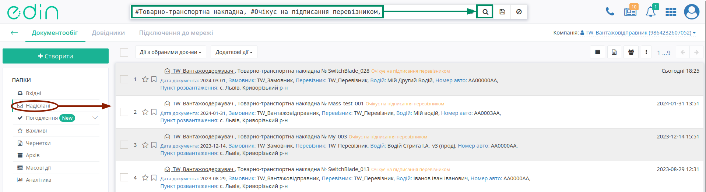
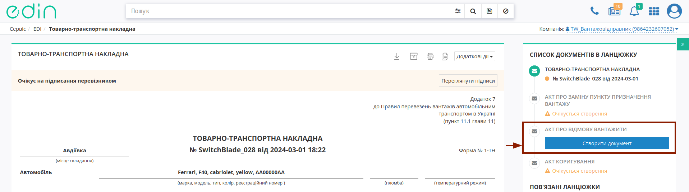
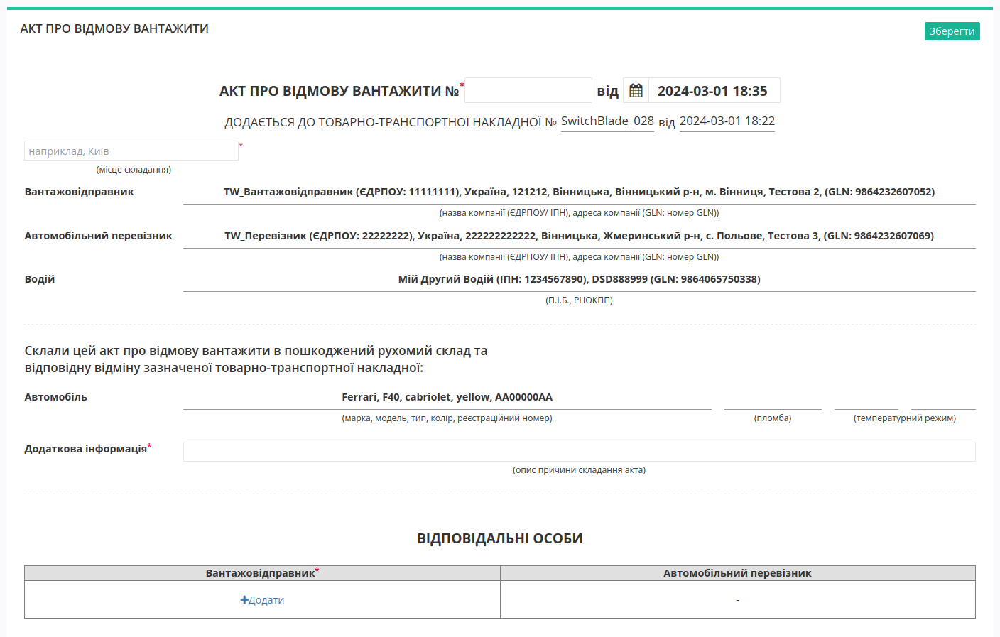
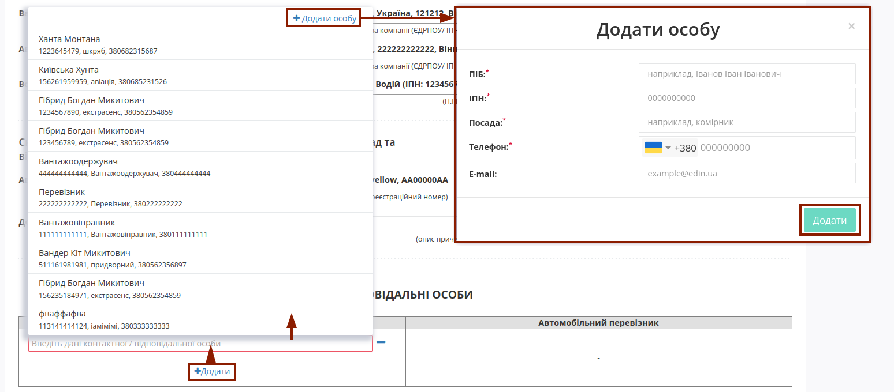
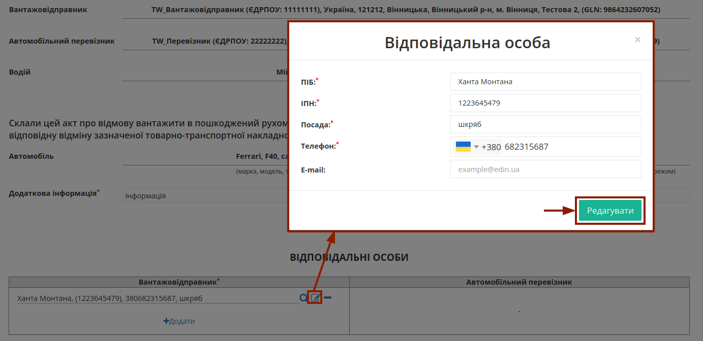
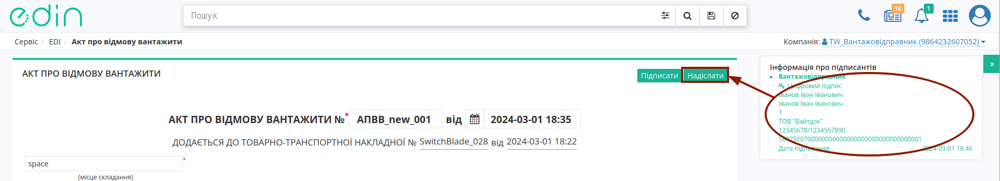
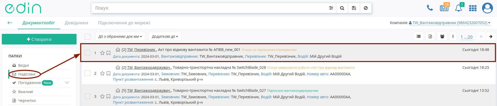
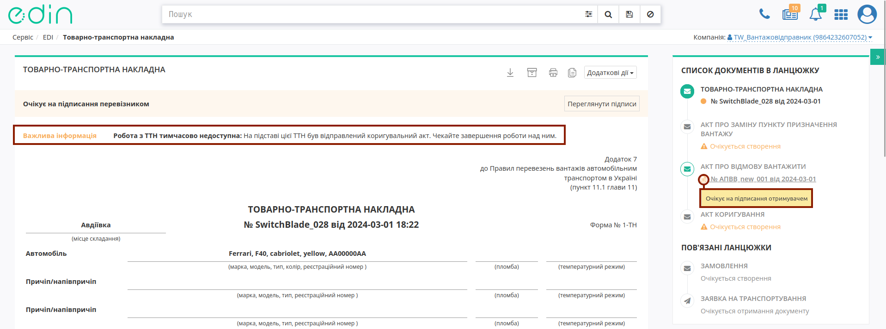

Створення "Акта про відмову вантажити" до е-ТТН
###################################################################################################

.. картинки в текст

.. |лупа| image:: /_constant/icons/magnifying_glass.png

.. |будинок| image:: /_constant/icons/house.png

.. |pencil_stencil| image:: /_constant/icons/pencil_stencil.png

.. |лупа2| image:: /_constant/icons/magnifying_glass2.png

.. |trash| image:: /_constant/icons/trash.png

.. role:: red

.. role:: green

.. role:: orange

.. role:: underline

.. contents:: Зміст:
   :depth: 3

---------

"Акт про відмову вантажити" складається у разі виявлення непридатності рухомого складу або контейнера для перевезення вантажу.

При формуванні "Акта про відмову вантажити" ініціатором документа виступає **"Вантажовідправник"** (при роботі з транспортними документами передбачені 4 основні ролі учасників документообігу: **"Замовник"**, **"Вантажовідправник"**, **"Перевізник"**, **"Вантажоодержувач"**). Обмін документом здійснюється та скріплюється електронними підписами представників між учасниками в наступному порядку: 

:green:`"Вантажовідправник" -> "Перевізник"`

"Акт про відмову вантажити" створюється на підставі "е-ТТН", що вже підписаний **Вантажовідправником** (документ має статус :orange:`"Очікує на підписання перевізником"`).

.. _create-from-ttn:

**1 Створення "Акта про відмову вантажити" на підставі "е-ТТН"**
================================================================================================================================

Для того аби створити "Акт про відмову вантажити" **"Вантажовідправнику"** потрібно перейти до каталогу **"Надіслані"** та обрати потрібний "е-ТТН" документ в статусі :orange:`"Очікує на підписання перевізником"` (для зручності можливо скористатись `пошуком <https://wiki.edin.ua/uk/latest/general_2_0/rabota_s_platformoj_EDIN_2.0.html#doc-search>`__):

У відкритому документі натисніть **"Створити документ"** "Акт про відмову вантажити" в блоці `ланцюжка документів <https://wiki.edin.ua/uk/latest/_constant/chain/chain.html>`__:

При створенні документа "Акта про відмову вантажити" його форма частково автоматично заповнюється даними (дані **"Вантажовідправника"**, **"Перевізника"**, **"Водія"**, дані про транспортний засіб) з "е-ТТН", як документа-підстави: 

Потрібно зазначити номер Акта (автоматично проставляється поточна дата та час створення документа) та місце його складання (обов'язкові до заповнення поля позначені червоною зірочкою :red:`*`). При формуванні "Акта про відмову вантажити" обов'язково заповнюється поле **"Додаткова інформація"** з описом причини складання Акта!

В документі також обов'язково зазначається відповідальна/-ні особи **Вантажовідправника** за допомогою кнопки **"+Додати"**. Дані раніше доданих відповідальних осіб можливо обрати з віртуального довідника чи видалити зі списку за допомогою |trash|:

Довідник автоматично наповнюється при додаванні нового відповідального (кнопка **"+Додати особу"**). При додаванні нового відповідального в модальному вікні потрібно заповнити обов'язкові контактні дані (обов'язкові поля позначені червоною зірочкою :red:`*`).

Редагувати дані раніше введених осіб можливо за допомогою кнопки **"Змінити"** (|pencil_stencil|):

За потреби можливо **"Обрати"** (|лупа2|) іншу особу замість обраної/доданої раніше.

.. hint::
   **При підписанні:** якщо поле Вашої **"Відповідальної особи"** :underline:`незаповнене`, то воно може автоматично заповнюватись даними з Вашого ЕЦП (якщо це можливо).

Після того, як обов'язкові дані будуть введені потрібно **"Зберегти"**, **"Підписати"** та **"Надіслати"** документ (кнопки в правій верхній частині форми документа відображаються для виконання потрібної дії):

.. image:: /_constant/signing/universal_button.gif
   :align: center

.. _sign:

**1.1 Підписання та відправка "Акта про відмову вантажити" Ініціатором**
------------------------------------------------------------------------------------------------------------

.. include:: /_constant/atb_check/atb_check.rst
   :start-after: .. початок блоку для ATB_check
   :end-before: .. кінець блоку для ATB_check

.. tabs::

   .. tab:: Файловий ключ

      .. include:: /_constant/signing/signing.rst
         :start-after: .. початок блоку для Signing
         :end-before: .. кінець блоку для Signing

   .. tab:: Token

      .. include:: /_constant/token_signing/token_signing.rst
         :start-after: .. початок блоку для TokenSign
         :end-before: .. кінець блоку для TokenSign

   .. tab:: Гряда

      .. include:: /_constant/gryada_signing/gryada_signing.rst
         :start-after: .. початок блоку для GryadaSign
         :end-before: .. кінець блоку для GryadaSign

   .. tab:: Дія.Підпис

      .. include:: /_constant/diya_signing/diya_signing.rst
         :start-after: .. початок блоку для DiyaPidps
         :end-before: .. кінець блоку для DiyaPidps

   .. tab:: Cloud

      .. include:: /_constant/cloud_signing/cloud_signing.rst
         :start-after: .. початок блоку для CloudSign
         :end-before: .. кінець блоку для CloudSign

Після підписання "Акта про відмову вантажити" відображається "Інформація про підписантів", а документ можливо **"Надіслати"**:

Після відправки автоматично відкривається папка **"Надіслані"**, де надісланий акт відображається зі статусом :orange:`"Очікує на підписання отримувачем"`:

Після відправки у пов'язаного документа "е-ТТН" при його перегляді в блоці `ланцюжка документів <https://wiki.edin.ua/uk/latest/_constant/chain/chain.html>`__ відобрається створений Акт і виводиться повідомлення про обмежені дії з документом до кінця життєвого циклу акта (поки всі учасники "Акта про відмову вантажити" не підпишуть документ або один з учасників не відхилить документ):

-------------------------------------

.. include:: /_constant/kontakti.rst

