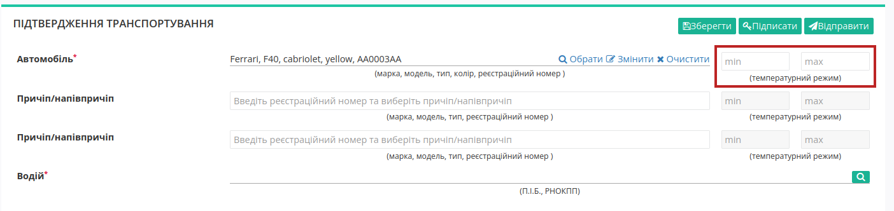

Створення "Підтвердження заявки на транспортування" на базі інших електронних документів
###################################################################################################

.. сюда закину немного картинок для текста + юзаєм спільні зображення

.. |лупа| image:: pics_Create_ETTN/Create_ETTN_013.png

.. |будинок| image:: pics_Create_ETTN/Create_ETTN_014.png

.. role:: red

.. role:: green

.. role:: orange

.. role:: underline

.. contents:: Зміст:
   :depth: 3

---------

Для реалізації різних схем електронного документообігу документ "Підтвердження заявки на транспортування" можливо створити на підставі "Замовлення" (ORDER), "Повідомлення про відвантаження" (DESADV), «Заявки на транспортування» (TRANSPORTATIONORDER з SUBDOCTYPE = 1). Ініціатором "Підтвердження заявки на транспортування" виступає користувач з роллю **"Перевізник"** (при роботі з транспортними документами передбачені 4 основні ролі учасників документообігу: **"Замовник"**, **"Вантажовідправник"**, **"Перевізник"**, **"Вантажоотримувач"**). Обмін документами здійснюється між **"Перевізником"** та **"Замовником"**:

:green:`"Перевізник" -> "Замовник"`

.. _create-from-proposal:

**1 Створення "Підтвердження заявки на транспортування" на підставі "Заявки на транспортування"**
====================================================================================================================================

Для створення "Підтвердження заявки на транспортування" на підставі "Заявки на транспортування" в сервісі "EDI+ЮЗД" **Перевізнику** потрібно перейти у **"Вхідні"** та вибрати **"Заявку на транспортування"** в статусі :green:`"Підписано перевізником"` чи :orange:`"Очікує підписання перевізником"` (для зручності можливо скористатись рядком пошуку):

.. note::
   **"Заявку на транспортування"** в статусі :orange:`"Очікує підписання перевізником"` попередньо потрібно **"Підписати"**: 

   .. image:: pics_Create_Proposal_Confirmation_from/Create_Proposal_Confirmation_from_002.png
      :align: center

У відкритому документі натисніть **"Створити документ"** "Підтвердження заявки на транспортування" в блоці `ланцюжка документів <https://wiki.edin.ua/uk/latest/_constant/chain/chain.html>`__ :

Відкриється форма редагування документа "Підтвердження заявки на транспортування", що включає в собі дані "Заявки на транспортування":

.. hint::
   Якщо **"Замовник"** знав хто буде здійснювати поставку і заповнив дані по авто і водієві в "Заявці на транспортування", то блок "Підтвердження заявки на транспортування" автоматично заповнюється цим даними (поля доступні до редагування/доповнення):

   .. image:: pics_Create_Proposal_Confirmation_from/Create_Proposal_Confirmation_from_005.png
      :align: center

Для автомобілів та причепів реалізований Ваш особистий довідник, що автоматично формується при додаванні нового транспортного засобу (кнопка **"+Новий транспортний засіб"**). При додаванні нового транспортного засобу в модальному вікні потрібно заповнити "Реєстраційний номер", "Марка", "Модель", "Тип":

.. hint::
   Для раніше введеного реєстрайійного номеру, наприклад, **АА0001АА** користувач може скористатись пошуком, наприклад, ``АА0, 001, 1АА, 01...``:

   .. image:: pics_Create_Proposal_Confirmation_from/Create_Proposal_Confirmation_from_007.png
      :align: center

Після додавання чи вибору транспортного засобу з'являються кнопки:

* **"Обрати"** - вибір іншого транспортного засобу;
* **"Змінити"** - редагування даних обраного транспортного засобу (редагування довідника);
* **"Очистити"** - видалити введені в рядок дані.

.. note::
   Незважаючи на те, що поля причіпа/напівпричіпа є опціональним, при їх наявності такі дані є обов'язковими до заповнення! 

Принцип заповнення причіпа/напівпричіпа теж реалізований через довідник (аналогічно додаванню даних про автомобіль): 

По кожному вказаному транспорному засобу є можливість зазначити (опціонально) температурний режим:

Дані **"Водія"** можливо обрати за допомогою кнопки **"Пошук контрагента"** (|лупа|) за ПІБ / ІПН / даними водійського посвідчення:

Після того, як всі обов'язкові дані були внесені/змінені (обов'язкові до заповнення поля позначені червоною зірочкою :red:`*` ), документ можливо **"Зберегти"**, **"Підписати"** та **"Відправити"**:

.. _sign:

**1.1 Підписання та відправка "Підтвердження заявки на транспортування" Перевізником**
-----------------------------------------------------------------------------------------------------

.. include:: /_constant/atb_check/atb_check.rst
   :start-after: .. початок блоку для ATB_check
   :end-before: .. кінець блоку для ATB_check

.. tabs::

   .. tab:: Файловий ключ

      .. include:: /_constant/signing/signing.rst
         :start-after: .. початок блоку для Signing
         :end-before: .. кінець блоку для Signing

   .. tab:: Token

      .. include:: /_constant/token_signing/token_signing.rst
         :start-after: .. початок блоку для TokenSign
         :end-before: .. кінець блоку для TokenSign

   .. tab:: Гряда

      .. include:: /_constant/gryada_signing/gryada_signing.rst
         :start-after: .. початок блоку для GryadaSign
         :end-before: .. кінець блоку для GryadaSign

   .. tab:: Cloud

      .. include:: /_constant/cloud_signing/cloud_signing.rst
         :start-after: .. початок блоку для CloudSign
         :end-before: .. кінець блоку для CloudSign

Після підписання "Підтвердження заявки на транспортування" окремим блоком відображається інформація про підписантів. Підписаний документ можливо **"Відправити"**:

Після відправки документа контрагенту він відображається в журналі вихідних документів. Відправленому **"Перевізником"** "Підтвердженню заявки на транспортування" присвоюється статус :orange:`"Очікує підписання замовником"`:

Відправлене "Підтвердження заявки на транспортування" має наступний вигляд:

В правій частині відображається блок з даними про `ланцюжок документів <https://wiki.edin.ua/uk/latest/_constant/chain/chain.html>`__. Документ можливо **"Відхилити"** поки отримувач не підписав документ (`детальніше про відхилення <https://wiki.edin.ua/uk/latest/ETTN_3_0/Proposal_Confirmation_Reject.html>`__).

---------------------------------

.. include:: /_constant/kontakti.rst
