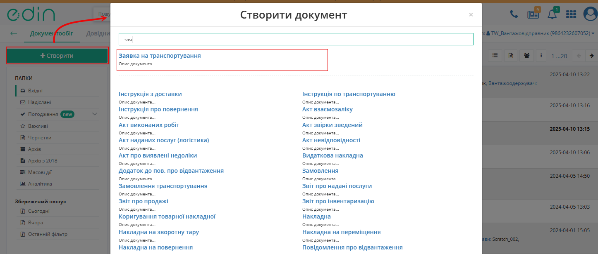
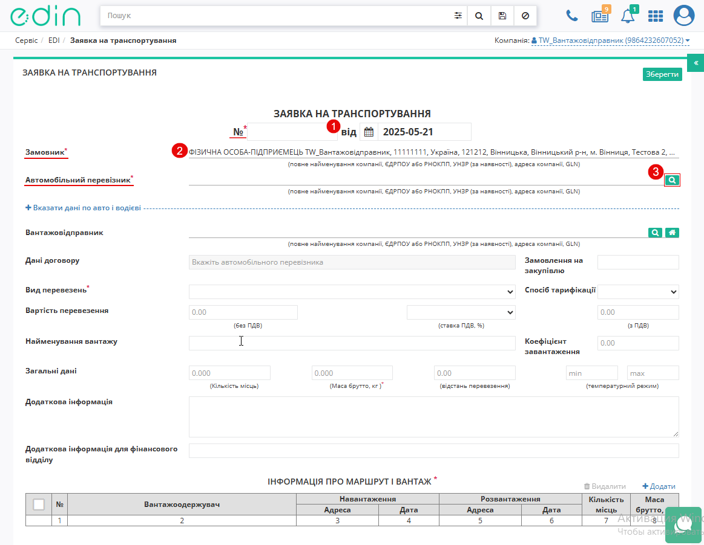

Створення та відправка "Заявки на транспортування" з "нуля" (ручне заповнення)
###################################################################################################

.. сюда закину немного картинок для текста + юзаєм спільні зображення

.. |лупа| image:: /_constant/icons/magnifying_glass.png

.. |будинок| image:: /_constant/icons/house.png

.. |drag_dots| image:: /_constant/icons/drag_dots.png

.. |trash| image:: /_constant/icons/trash.png

.. |delete| image:: /_constant/icons/delete.png

.. role:: red

.. role:: green

.. role:: orange

.. role:: underline

.. contents:: Зміст:
   :depth: 3

---------

Ініціатором документообігу "Заявка на транспортування" -> "Підтвердженням заявки на транспортування" виступає користувач з роллю **"Замовник"** (при роботі з транспортними документами передбачені 4 основні ролі учасників документообігу: **"Замовник"**, **"Вантажовідправник"**, **"Перевізник"**, **"Вантажоотримувач"**). 
Обмін документами здійснюється між **"Замовником"** та **"Перевізником"**:

:green:`"Замовник" -> "Перевізник"`

.. hint::
   При роботі з "Заявкою на транспортування" можливо організувати:

   1. Документообіг, в якому "Заявка на транспортування" пропонує перевезення між трьома компаніями-учасниками (1 **"Замовник"** - 1 **"Перевізник"** - 1 **"Вантажоотримувач"**) з пункту навантаження в пункт розвантаження (дві адреси).
   2. Документообіг, в якому "Заявка на транспортування" пропонує перевезення одразу з кількома **"Вантажоотримувачами"** (1 **"Замовник"** - 1 **"Перевізник"** - N **"Вантажоотримувачів"**) з відповідною кількістю пунктів навантаження та розвантаження (кілька адрес).

**1. Створення "Заявки на транспортування" Замовником**
================================================================================================

Для створення "Заявки на транспортування" в сервісі **"EDI Network"** **"Замовнику"** необхідно натиснути на кнопку **"Створити"**. Після цього відкриється модальне вікно
**"Створити документ"**, у якому оберіть документ **"Заявка на транспортування"** (за необхідністю скористатись рядком пошуку).

Після чого відкриється порожня форма документа **"Заявка на транспортування"**, у якій заповніть поля:

- **"№"** - введіть номер документа (Покажчик 1);
- **"Замовник"** - заповнюється автоматично даними учасника-ініціатора документообіга та недосупне для редагування (Покажчик 2); 
- **"Автомобільний перевізник"** - натисніть на кнопку **"Пошук перевізника"** (|лупа|) (Покажчик 3). Після цього відкриється модальне вікно **"Пошук перевізника"**,
  у якому в рядку пошуку здійсніть пошук контрагента за назвою компанії / GLN / ІПН (Покажчик 4). Для підтвердження вибору натисніть кнопку **"Вибрати"** (Покажчик 5). 
  Для очищення поля натисніть на кнопку (|delete|), яка з'явиться в полі **"Автомобільний перевізник"** після обраного значення (Покажчик 6).

.. note::
   Поля позначені - :red:`*` обов'язкові до заповнення

.. image:: /ETTN_3_0/pics_Create_Proposal/Create_Proposal_003_v2.png
   :align: center
   :width: 80%  

**Вказати дані по авто і водієві** (за замовчуванням блок згорнутий) 

- **"Автомобіль"** - введіть латиницею мінімум 4 символи реєстраційного номеру для пошуку з особистого довідника. Або 8 символів для пошуку у відкритих джерелах (Покажчик 7). 

Для того, щоб додати новий транспортний засіб натисніть на кнопку **"+ Новий транспортний засіб"** (Покажчик 8). Після цього відкриється модальне вікно **"Новий автомобіль"**, 
у якому  заповніть поля: **"Реєстраційний номер"**, **"Марка"**, **"Модель"**, **"Тип"**, **"Колір"**, **"Довжина, м"**, **"Ширина, м"**, **"Висота, м"**, **"Загальна вага без вантажу"**.
Для збереження даних натисніть на кнопку **"Додати"** (Покажчик 9).

.. note::
   Після заповнення поля **"Довжина"** наступні поля обов'язкові для заповненя. 

.. image:: /ETTN_3_0/pics_Create_Proposal/Create_Proposal_004_v2.png
   :align: center
   :width: 80%  

Після вибору транспортного засобу в полі **"Автомобіль"** з’явиться додатковий функціонал для подальших дій: вибору іншого авто, редагування даних або очищення поля (Покажчик 10).

Після натискання на кнопку:

   * **"Обрати"** - поле стане активним для вибору нового значення. Якщо нове значення не буде вибрано, у полі відображатиметься попереднє.
   * **"Змінити"** - відкриється вікно **"Редагування даних авто"**, у якому можна змінити дані обраного транспортного засобу. Для збереження внесених змін, натисніть на кнопку **"Редагувати"** (Покажчик 11);
   * **"Очистити"** - поле буде очищене від обраного значення. 

**"Температурний режим"** - введіть мінімальний та максимальний температурний режим (Покажчик 12).

.. image:: /ETTN_3_0/pics_Create_Proposal/Create_Proposal_005_v2.png
   :align: center
   :width: 80%  

* **"Причіп/напівпричіп"** - введіть латиницею мінімум 4 символи реєстраційного номеру для пошуку з особистого довідника. Або 8 символів для пошуку у відкритих джерелах (Покажчик 13). 
  
Для того, щоб додати новий транспортний засіб натисніть на кнопку **"+ Новий транспортний засіб"** (Покажчик 14). Після цього відкриється модальне вікно **"Новий причіп / напівпричіп"**, 
у якому  заповніть поля: **Тип транспортного засобу**, **"Реєстраційний номер"**, **"Марка"**, **"Модель"**, **"Тип"**, **"Довжина, мм"**, **"Ширина, мм"**, **"Висота"**, **"Загальна вага без вантажу"**.
Для збереження даних натисніть на кнопку **"Додати"** (Покажчик 15).

.. note::
   Після заповнення поля **"Довжина"** наступні поля обов'язкові для заповненя. 

.. image:: /ETTN_3_0/pics_Create_Proposal/Create_Proposal_006_v2.png
   :align: center
   :width: 80%  

Після вибору транспортного засобу в полі **"Причіп/напівпричіп"** з’явиться додатковий функціонал для подальших дій: вибору іншого причіпа/напівпричіпа, редагування даних або очищення поля (Покажчик 16).

Після натискання на кнопку:

   * **"Обрати"** - поле стане активним для вибору нового значення. Якщо нове значення не буде вибрано, у полі відображатиметься попереднє.
   * **"Змінити"** - відкриється вікно **"Редагування даних причепа / напівпричепа"**, у якому можна змінити дані обраного транспортного засобу. Для збереження внесених змін, натисніть на кнопку **"Редагувати"** (Покажчик 17);
   * **"Очистити"** - поле буде очищене від обраного значення. 

**"Температурний режим"** - введіть мінімальний та максимальний температурний режим (Покажчик 18).

.. note::
   У разі наявності двох причепів або напівпричепів заповніть ще одне поле (Покажчик 19).

.. image:: /ETTN_3_0/pics_Create_Proposal/Create_Proposal_007_v2.png
   :align: center
   :width: 80%    

* **"Відомості про транспортний засіб без урахування вантажу"** (Покажчик 20)
  
   - "Довжина, м" - введіть загальну довжину транспортного засобу з урахуванням причепів або напівпричепів;
   - "Ширина, м" - заповнюється автоматично найбільшим значенням із полів "Автомобіль" або "Причіп/напівпричіп";
   - "Висота, м" - заповнюється автоматично найбільшим значенням із полів "Автомобіль" або "Причіп/напівпричіп".

.. image:: /ETTN_3_0/pics_Create_Proposal/Create_Proposal_008_v2.png
   :align: center
   :width: 80%   
   
* **"Водій"** - натисніть на кнопку **"Пошук водія"** (|лупа|) (Покажчик 21). Після цього відкриється модальне вікно **"Пошук водія"**, у якому в рядку пошуку здійсніть пошук за ПІБ / GLN / ІПН водія (Покажчик 22). Для підтвердження вибору натисніть кнопку **"Вибрати"** (Покажчик 23). 
Для очищення поля натисніть на кнопку (|delete|), яка з'явиться в полі **"Водій"** після обраного значення (Покажчик 24).

.. note::
   За необхідністю очистити дані у полях блоку **"Вказати дані по авто і водієві"** натисніть на **"Очистити дані по авто і водієві"** (Покажчик 25).

* **"Вантажовідправник"** - натисніть на кнопку **"Пошук вантажовідправника"** (|лупа|) або **"Вказати себе"** (|будинок|) (Покажчик 26). Після натискання на кнопку **"Пошук вантажовідправника"** відкриється модальне вікно **"Пошук вантажовідправника"**, у якому в рядку пошуку здійсніть пошук за назвою компанії / GLN / ІПН вантажовідправника (Покажчик 27). 
Для підтвердження вибору натисніть кнопку **"Вибрати"** (Покажчик 28). 
Після натискання на кнопку **"Вказати себе"** (|будинок|) поле буде автоматично заповнене даними ініціатора документообігу.
Для очищення поля натисніть на кнопку (|delete|), яка з'явиться в полі **"Вантажовідправник"** після обраного значення (Покажчик 29).

.. image:: /ETTN_3_0/pics_Create_Proposal/Create_Proposal_009_v2.png
   :align: center
   :width: 80%

*  **"Дані договору"** - натисніть на поле та оберіть договір зі списку (Покажчик 30). У випадку відсутності договорів із контрагентом натисніть на кнопку **"+ Новий договір"**, після чого відкриється модальне вікно **"Дані договору"**, у якому заповніть поля: **"Номер договору"** та **"Дата договору"**. Для створення договору натисніть на кнопку **"Створити договір"** (Покажчик 32).
  Для вибору іншого договору натисніть на кнопку **"Обрати"**, яка з'явиться в полі **"Дані договору "** після обраного значення (Покажчик 33).

.. image:: /ETTN_3_0/pics_Create_Proposal/Create_Proposal_010_v2.png
   :align: center
   :width: 80%

* **"Замовлення на закупівлю"** - введіть номер документа замовлення (Покажчик 34); 
* **"Вид перевезень"** - натисніть на поле та оберіть тип перевезення зі списку (Покажчик 35);
* **"Спосіб тарифікації"** - натисніть на поле та оберіть спосіб тарифікації зі списку (Покажчик 36);
* **"Вартість перевезення"** (Покажчик 37): 
   - "(без ПДВ)" - введіть вартість перевезення без ПДВ;  
   - "(ставка ПДВ, %)" - натисніть на поле та оберіть ставку ПДВ;
   - "(з ПДВ)" - вартість перевезення з ПДВ буде відображатись автоматично після введення вартості без ПДВ та вибору ставки ПДВ.
  
.. note:: 
  У випадку якщо в полі **"Спосіб тарифікації"** обрано значення "фіксована вартість" поле **"Вартість перевезення"**: "(без ПДВ)" та "(з ПДВ)" обов'язкове для заповнення.

* **"Найменування вантажу"** - введіть назву або опис того, що саме перевозиться (Покажчик 38);
* **"Коефіцієнт завантаження"** - введіть показник, який відображає наскільки ефективно використано вантажний простір транспортного значення (Покажчик 39);

.. image:: /ETTN_3_0/pics_Create_Proposal/Create_Proposal_011_v2.png
   :align: center
   :width: 80%

* **Загальні данні"** (Покажчик 40): 

   - "(Кількість місць)" - введіть скільки пакувальних місць містить вантаж;
   - "(Маса брутто, кг)" - введіть загальну масу вантажу разом з пакування;
   - "(відстань перевезення)" - введіть відстань між пункта відправлення до пункта призначення; 
   - "(температурний режим)" - введіть допустимий діапазон температур, за якого має транспортуватись вантаж. 

.. note:: 
  У випадку якщо в полі **"Спосіб тарифікації"** обрано значення "за кілометраж" поле **Загальні данні"**: "(відстань перевезення)" обов'язкове для заповнення.

* **"Додаткова інформація"** - введіть будь-які уточнення або коментарі, які не охоплюються іншими полями форми (Покажчик 41);
* **"Додаткова інформація для фінансового відділу"** - введіть будь-які уточнення або коментарі, які стосуються фінансового відділу (Покажчик 42).

.. image:: /ETTN_3_0/pics_Create_Proposal/Create_Proposal_012_v2.png
   :align: center
   :width: 80%

.. _customer-table:

**1.1 Заповнення табличної частини**
---------------------------------------

Для заповнення табличної частини документа потрібно натиснути на кнопку **"+Додати"**, після чого відкриється модальне вікно "Інформація про маршрут і вантаж" (обов'язкові до заповнення поля позначені червоною зірочкою :red:`*` ):

.. image:: /ETTN_3_0/pics_Create_Proposal/Create_Proposal_016.png
   :align: center

.. початок блоку для Proposal_for_Proposal_from2

Вікно розділено на блоки з даними про маршрут (Навантаження і Розвантаження) та блок з інформацією про вантаж. Для блоків Навантаження та Розвантаження дані "Адрес" необхідно обрати з випадаючого списку, користуючись пошуком (для Навантаження значення підтягуються з довідника **"Вантажовідправника"**, а для Розвантаження - **"Вантажоодержувача"**):

.. image:: /ETTN_3_0/pics_Create_Proposal/Create_Proposal_017.png
   :align: center

За потреби можливо додати дату та час **"Обравши"** значення кінцевих термінів, в рамках яких потрібно здійснити доставку вантажу:

.. image:: /ETTN_3_0/pics_Create_Proposal/Create_Proposal_018.png
   :align: center

Дані відповідальних осіб **"Вантажовідправника"** / **"Вантажоодержувача"** можливо обрати з віртуального довідника чи видалити зі списку за допомогою |trash| (присутній пошук):

.. image:: /ETTN_3_0/pics_Create_Proposal/Create_Proposal_019.png
   :align: center

Довідник автоматично наповнюється при додаванні нового відповідального (кнопка **"+Додати особу"**). При додаванні нового відповідального в модальному вікні потрібно заповнити обов'язкові контактні дані (обов'язкові поля позначені червоною зірочкою :red:`*`):

.. image:: /ETTN_3_0/pics_Create_Proposal/Create_Proposal_020.gif
   :align: center

Редагувати дані раніше введених осіб можливо за допомогою кнопки **"Змінити"**:

.. image:: /ETTN_3_0/pics_Create_Proposal/Create_Proposal_021.gif
   :align: center

Заповнене поле документа даними відповідальної особи можливо **"Очистити"** за потреби чи **"Обрати"** іншу особу. 

Дані пункту **"Розвантаження"** заповнюються аналогічно після вибору **Вантажоодержувача** за допомогою пошуку за назвою компанії чи GLN:

.. image:: /ETTN_3_0/pics_Create_Proposal/Create_Proposal_022.png
   :align: center

Для редагування інформації щодо вантажу необхідно навести курсор на рядок цього вантажу та натиснути **"Змінити"**, для видалення – **"Видалити"** (або масово відмітити галочками та **"Видалити"** кнопкою над таблицею):

.. image:: /ETTN_3_0/pics_Create_Proposal/Create_Proposal_038.png
   :align: center

Перевізники, отримавши "Заявку на транспортування", орієнтуються на послідовність вказаних в ній маршрутів. До відправки документа можливо змінити послідовність маршрутів, перетягнувши позицію лівою кнопкою миші за |drag_dots|:

.. image:: /ETTN_3_0/pics_Create_Proposal/Create_Proposal_039.gif
   :align: center

Для збереження "Заявки на транспортування" необхідно натиснути кнопку **"Зберегти"**, документ потрапить у папку **"Чернетки"**:

.. image:: /ETTN_3_0/pics_Create_Proposal/Create_Proposal_040.png
   :align: center

Після того, як усі обов'язкові поля заповнені та збережені документ можливо **"Підписати"**:

.. image:: /ETTN_3_0/pics_Create_Proposal/Create_Proposal_041.png
   :align: center

.. hint::
   Також для даного документа доступні `масове підписання та масова відправка <https://wiki.edin.ua/uk/latest/general_2_0/massovi_operacii_EDIN_2.0.html#mass-sign-and-send>`__.

.. _sign:

**1.2 Підписання та відправка "Заявки на транспортування" Замовником**
------------------------------------------------------------------------------

.. include:: /_constant/atb_check/atb_check.rst
   :start-after: .. початок блоку для ATB_check
   :end-before: .. кінець блоку для ATB_check

.. tabs::

   .. tab:: Файловий ключ

      .. include:: /_constant/signing/signing.rst
         :start-after: .. початок блоку для Signing
         :end-before: .. кінець блоку для Signing

   .. tab:: Token

      .. include:: /_constant/token_signing/token_signing.rst
         :start-after: .. початок блоку для TokenSign
         :end-before: .. кінець блоку для TokenSign

   .. tab:: Гряда

      .. include:: /_constant/gryada_signing/gryada_signing.rst
         :start-after: .. початок блоку для GryadaSign
         :end-before: .. кінець блоку для GryadaSign

   .. tab:: Cloud

      .. include:: /_constant/cloud_signing/cloud_signing.rst
         :start-after: .. початок блоку для CloudSign
         :end-before: .. кінець блоку для CloudSign

Після підписання "Заявки на транспортування" окремим блоком відображається інформація про підписантів. Підписаний документ можливо **"Надіслати"**:

.. image:: /ETTN_3_0/pics_Create_Proposal/Create_Proposal_042.png
   :align: center

.. кінець блоку для Proposal_for_Proposal_from2

Після відправки документа контрагенту він відображається в журналі вихідних документів. Відправленій **"Замовником"** "Заявці на транспортування" присвоюється статус :orange:`"Очікує підписання перевізником"`:

.. image:: pics_Create_Proposal/Create_Proposal_043.png
   :align: center

Відправлена "Заявка на транспортування" має наступний вигляд:

.. image:: pics_Create_Proposal/Create_Proposal_044.png
   :align: center

В правій частині відображається блок з даними про `ланцюжок документів <https://wiki.edin.ua/uk/latest/_constant/chain/chain.html>`__. Інформація про нового підписанта відображається після натискання кнопки **"Переглянути підписи"**. У разі помилкової відправки документа можливо виконати **"Відкликання підпису"** поки отримувач не підписав документ (`детальніше про відкликання <https://wiki.edin.ua/uk/latest/ETTN_3_0/Proposal_Revoke.html>`__).

---------------------------------

.. include:: /_constant/kontakti.rst
