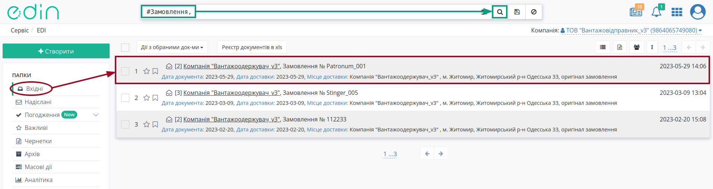
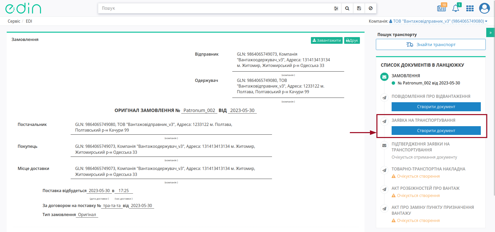
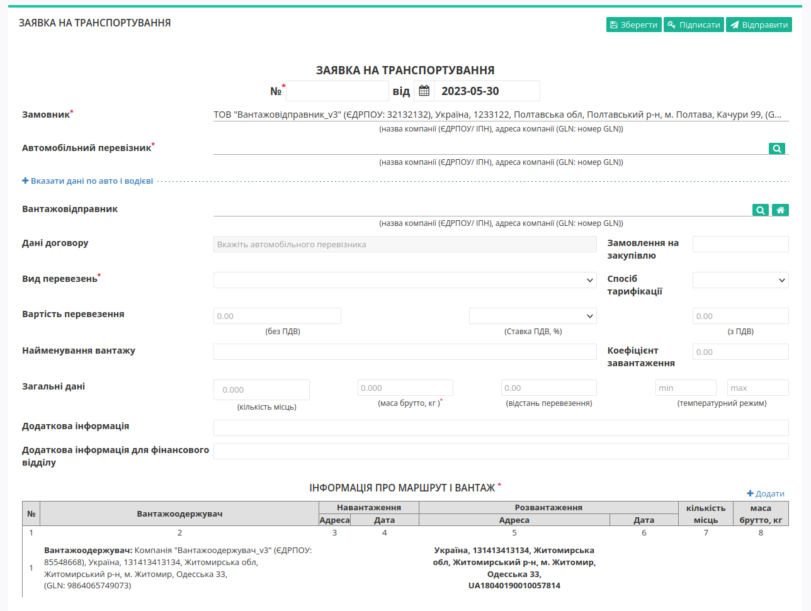
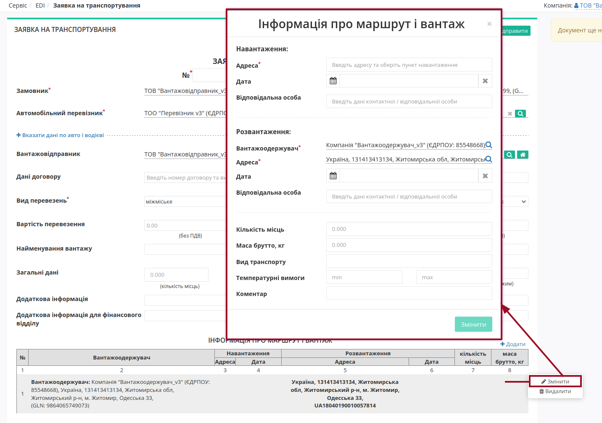
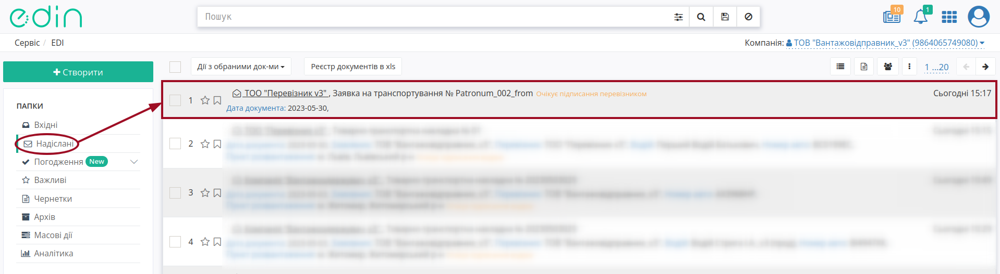
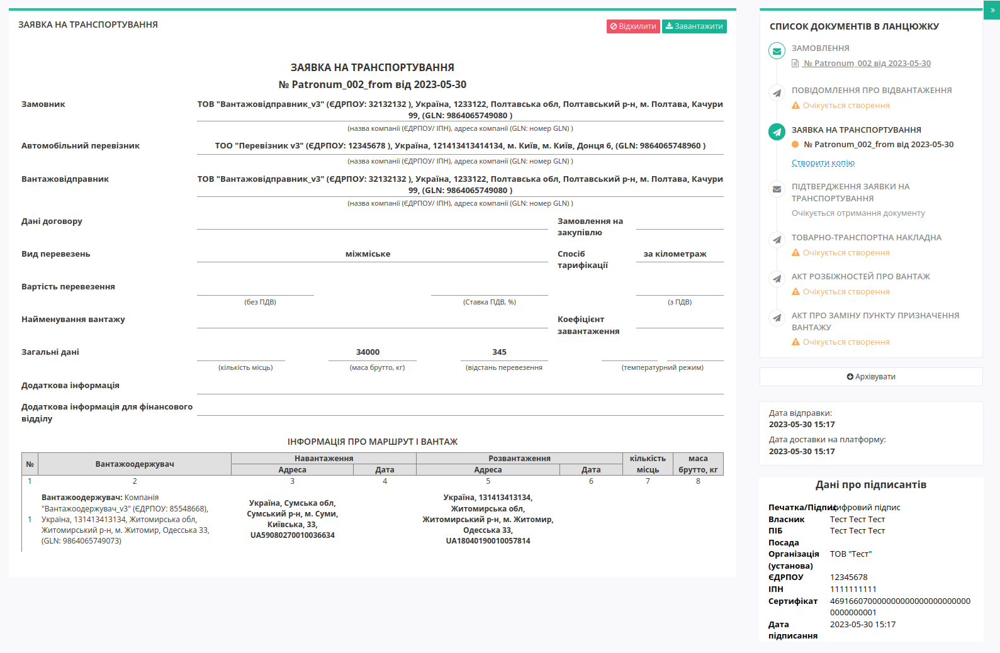

Створення "Заявки на транспортування" на базі інших електронних документів
###################################################################################################

.. картинки в текст

.. |лупа| image:: /_constant/icons/magnifying_glass.png

.. |будинок| image:: /_constant/icons/house.png

.. role:: red

.. role:: green

.. role:: orange

.. role:: underline

.. contents:: Зміст:
   :depth: 3

---------

Документ "Заявка на транспортування" (TRANSPORTATIONORDER з SUBDOCTYPE = 1) можливо створити на підставі "Замовлення" (ORDER). Ініціатором "Заявки на транспортування" виступає користувач з роллю **"Замовник"** (при роботі з транспортними документами передбачені 4 основні ролі учасників документообігу: **"Замовник"**, **"Вантажовідправник"**, **"Перевізник"**, **"Вантажоотримувач"**). Обмін документами здійснюється між **"Замовником"** та **"Перевізником"**:

:green:`"Замовник" -> "Перевізник"`

.. _create-from-proposal:

**1 Створення "Заявки на транспортування" на підставі "Замовлення" (ORDER)**
====================================================================================================================================

.. початок блоку для Proposal_from_Order

Для створення "Заявки на транспортування" на підставі "Замовлення" (ORDER) в сервісі "EDI+ЮЗД" **Замовнику** потрібно перейти у **"Вхідні"** та вибрати "Замовлення" (ORDER), за яким потрібно зробити заявку (для зручності можливо скористатись `пошуком <https://wiki.edin.ua/uk/latest/general_2_0/rabota_s_platformoj_EDIN_2.0.html#doc-search>`__):

У відкритому документі натисніть **"Створити документ"** "Заявка на транспортування" в блоці `ланцюжка документів <https://wiki.edin.ua/uk/latest/_constant/chain/chain.html>`__ :

У відкритій формі "Заявки на транспортування" поля, що стосуються **Замовника** та **Вантажоодержувача** (таблична частина) заповнюються автоматично з пов'язаного "Замовлення" (обов'язкові до заповнення поля позначені червоною зірочкою :red:`*`):

.. include:: /ETTN_3_0/Create_Proposal.rst
   :start-after: .. початок блоку для Proposal_for_Proposal_from
   :end-before: .. кінець блоку для Proposal_for_Proposal_from

.. _customer-table:

**1.1 Заповнення табличної частини**
---------------------------------------

В табличну частину документа дані **Вантажоодержувача** підтягуються автоматично з документа підстави ("Замовлення"), однак дані про маршрут та вантаж не є повними - потрібно обрати маршрут мишкою та натиснути на кнопку **"Змінити"** (обов'язкові до заповнення поля позначені червоною зірочкою :red:`*` ):

.. note::
   За потреби можливо **"+Додати"** новий маршрут, повністю заповнивши модальне вікно "Інформація про маршрут і вантаж".

.. include:: /ETTN_3_0/Create_Proposal.rst
   :start-after: .. початок блоку для Proposal_for_Proposal_from2
   :end-before: .. кінець блоку для Proposal_for_Proposal_from2

Відправлений документ автоматично потрапляє в папку "Надіслані" і буде знаходиться в ланцюжку документів разом із "Замовленням". Відправленій **"Замовником"** "Заявці на транспортування" присвоюється статус :orange:`"Очікує підписання перевізником"`:

Відправлена "Заявка на транспортування" має наступний вигляд:

В правій частині відображається блок з даними про `ланцюжок документів <https://wiki.edin.ua/uk/latest/_constant/chain/chain.html>`__. Документ можливо **"Відхилити"** поки отримувач не підписав документ (`детальніше про відхилення <https://wiki.edin.ua/uk/latest/ETTN_3_0/Proposal_Reject.html>`__).

.. кінець блоку для Proposal_from_Order

---------------------------------

.. include:: /_constant/kontakti.rst
