Створення "Акта перевантаження" на базі інших електронних документів
###################################################################################################

.. сюда закину немного картинок для текста + юзаєм спільні зображення

.. |лупа| image:: pics_Create_ETTN/Create_ETTN_013.png

.. |будинок| image:: pics_Create_ETTN/Create_ETTN_014.png

.. |pencil_stencil| image:: /_constant/icons/pencil_stencil.png

.. |лупа2| image:: /_constant/icons/magnifying_glass2.png

.. role:: red

.. role:: green

.. role:: orange

.. role:: underline

.. contents:: Зміст:
   :depth: 3

---------

Документ "Акт перевантаження" можливо створити на підставі "е-ТТН", що вже підписаний **Перевізником** (документ має статус "Очікує підписання вантажоодержувачем"). Документообіг "Актом перевантаження" здійснюється між двома контагентами-Перевізниками (при роботі з транспортними документами передбачені 4 основні ролі учасників документообігу: **"Замовник"**, **"Вантажовідправник"**, **"Перевізник"**, **"Вантажоодержувач"**). При формуванні "Акта перевантаження" ініціатором документа виступає **"Перевізник, що здає вантаж"**. Обмін документом здійснюється між учасниками в наступному порядку: 

:green:`"Перевізник, що здає вантаж" -> "Перевізник, що приймає вантаж"`

.. _create-from-ttn:

**1 Створення "Акта перевантаження" на підставі "е-ТТН"**
================================================================================================================================

.. attention::
   Після створення "Акта перевантаження" дії з документом-підставою ("е-ТТН") будуть обмежені до кінця життєвого циклу акта (поки "Акт перевантаження" не буде підписаний чи відхилений **"Перевізником, що приймає вантаж"**).

**"Перевізнику, що здає вантаж"** для створення **"Акта перевантаження"** в сервісі "EDI+ЮЗД" потрібно перейти у **"Вхідні"** та перейти в "Товарно-транспортну накладну", до якої потібно створити коригуючий акт ("е-ТТН" в статусі "Очікує підписання вантажоодержувачем"):

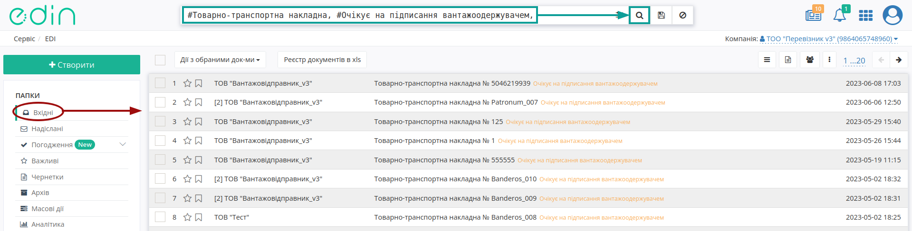

У відкритому документі натисніть **"Створити документ"** "Акт перевантаження" в блоці `ланцюжка документів <https://wiki.edin.ua/uk/latest/_constant/chain/chain.html>`__:

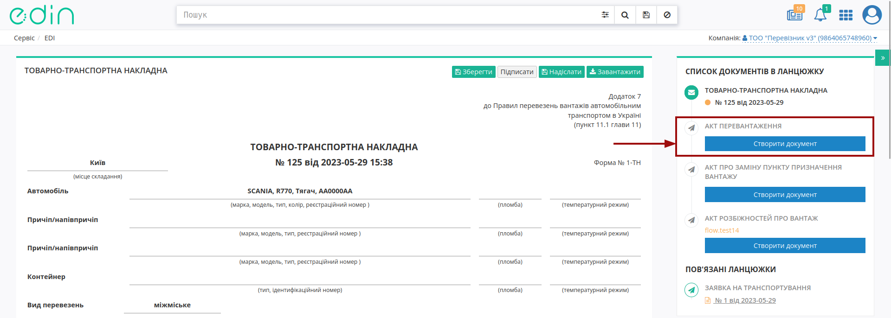

При створенні документа "Акта перевантаження" його форма в значній мірі автоматично заповнюється даними (дані контрагентів, перевізника, відомості про вантаж) з е-ТТН, як документа-підстави: 

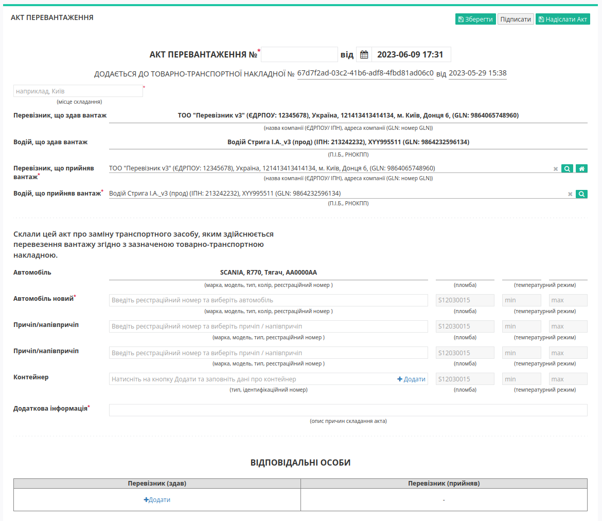

Таблиця **"Розбіжності щодо кількісних характеристик вантажу"** за потреби підлягає редагуванню та зміні обраної товарної позиції за допомогою кнопки **"Змінити"**:

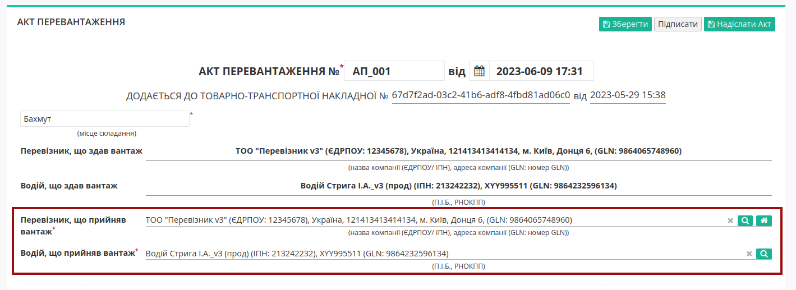

При редагуванні позиції при введенні фактичного значення (по кількості місць, массі брутто, загальній сумі з ПДВ) опціонально можливо вказати причину розбіжності. По завершенню введення потрібно натиснути кнопку **"Змінити"**:

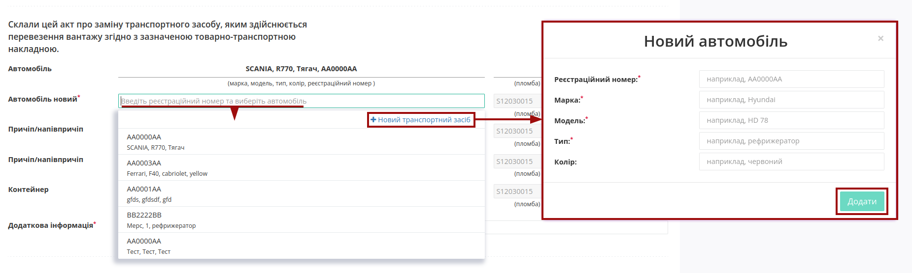

Для внесення даних в таблицю **"Розбіжностей щодо якісних характеристик вантажу"** потрібно поставити курсор в колонку виявлених порушень перевезення для стандартних показників чи вказати :underline:`інше` недотримання: 

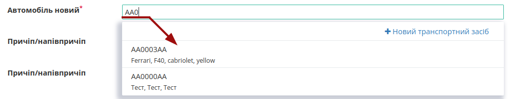

Поля, що потребують обов'язкового заповнення позначені червоною зірочкою :red:`*`: окрім номера документа, місця його складання обов'язково потрібно вказати опис причин складання акта (поле "Додаткова iнформацiя") та рішення за виявленими розбіжностями (поле "Висновок"):

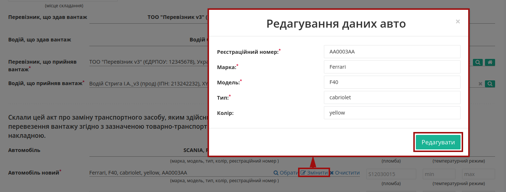

Також у транспортних документах обов'язково вказується відповідальна особа (Вантажоодержувач) за допомогою кнопки **"+Додати"** (можливо вказати кілька осіб):

.. image:: pics_Create_Reload_Act_from/Create_Reload_Act_from_008.gif
   :align: center

Дані раніше доданих відповідальних осіб можливо обрати з віртуального довідника:

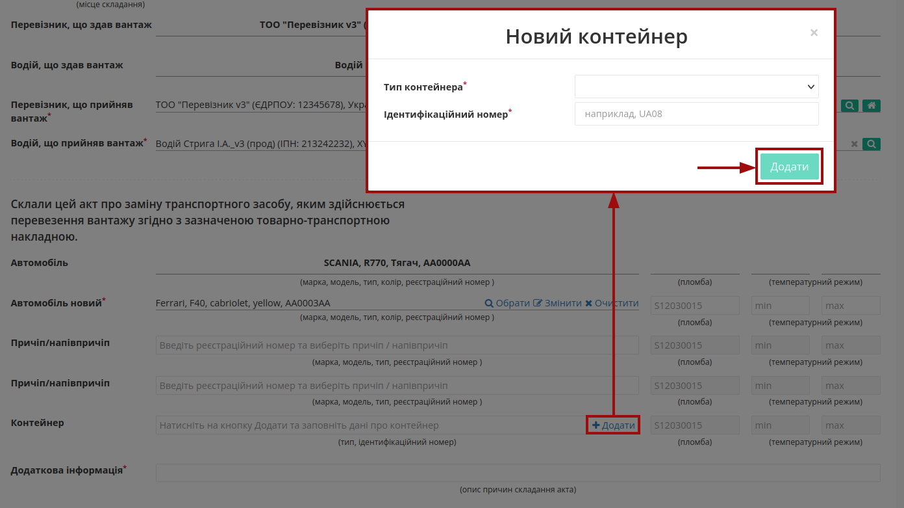

Довідник автоматично наповнюється при додаванні нового відповідального (кнопка **"+Додати особу"**). При додаванні нового відповідального в модальному вікні потрібно заповнити обов'язкові контактні дані (обов'язкові поля позначені червоною зірочкою :red:`*`):

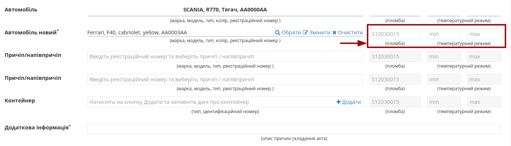

Редагувати дані раніше введених осіб можливо за допомогою кнопки **"Змінити"** (|pencil_stencil|):

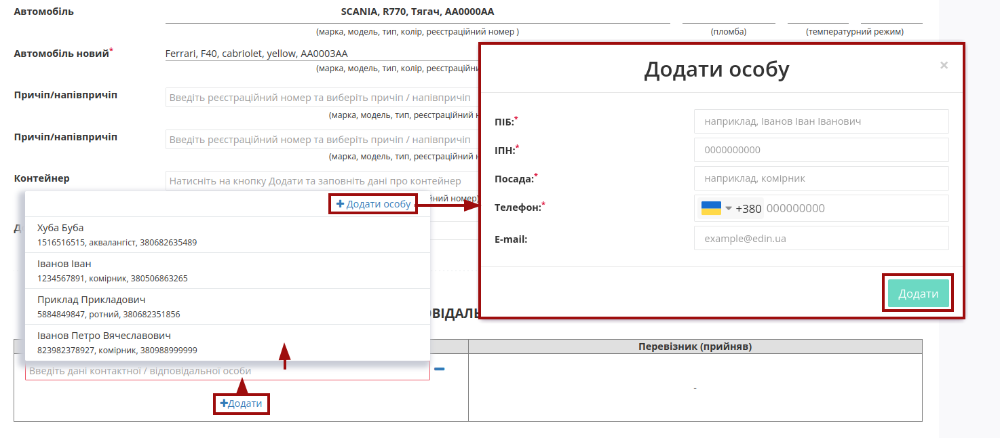

За потреби можливо **"Обрати"** (|лупа2|) іншу особу замість обраної/доданої раніше. 

Після того, як обов'язкові дані будуть введені потрібно **"Зберегти"** (1), **"Підписати"** (2) та **"Надіслати"** (3) документ:

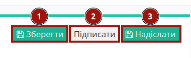

.. _sign:

**1.1 Підписання та відправка "Акта перевантаження" "Вантажоодержувачем"**
------------------------------------------------------------------------------------------------------------

.. include:: /_constant/atb_check/atb_check.rst
   :start-after: .. початок блоку для ATB_check
   :end-before: .. кінець блоку для ATB_check

.. tabs::

   .. tab:: Файловий ключ

      .. include:: /_constant/signing/signing.rst
         :start-after: .. початок блоку для Signing
         :end-before: .. кінець блоку для Signing

   .. tab:: Token

      .. include:: /_constant/token_signing/token_signing.rst
         :start-after: .. початок блоку для TokenSign
         :end-before: .. кінець блоку для TokenSign

   .. tab:: Гряда

      .. include:: /_constant/gryada_signing/gryada_signing.rst
         :start-after: .. початок блоку для GryadaSign
         :end-before: .. кінець блоку для GryadaSign

   .. tab:: Дія.Підпис

      .. include:: /_constant/diya_signing/diya_signing.rst
         :start-after: .. початок блоку для DiyaPidps
         :end-before: .. кінець блоку для DiyaPidps

   .. tab:: Cloud

      .. include:: /_constant/cloud_signing/cloud_signing.rst
         :start-after: .. початок блоку для CloudSign
         :end-before: .. кінець блоку для CloudSign

Після підписання "Акта перевантаження" відображається "Інформація про підписантів", а документ можливо **"Надіслати"**:

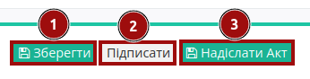

Після відправки автоматично відкривається папка **"Надіслані"**, де надісланий акт відображається зі статусом **"Очікує підписання перевізником/водієм"**:

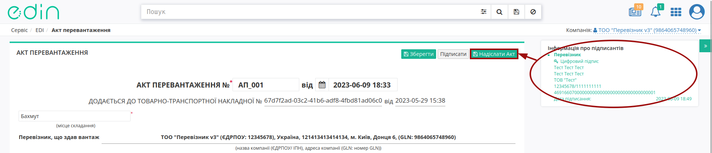

Після відправки у пов'язаного документа "е-ТТН" при його перегляді в блоці `ланцюжка документів <https://wiki.edin.ua/uk/latest/_constant/chain/chain.html>`__ відобрається створений Акт і виводиться повідомлення про обмежені дії з документом до кінця життєвого циклу акта (поки **"Перевізник"** не підпише або відхилить створений "Акт перевантаження"):

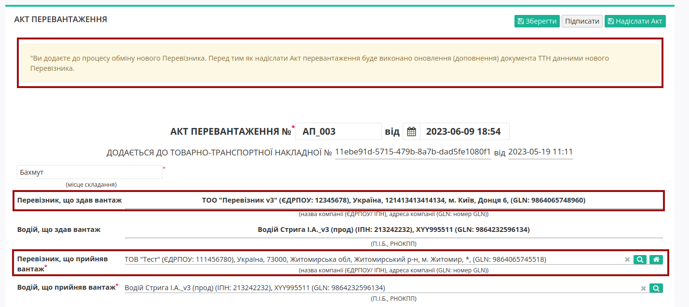

-------------------------------------

.. include:: /_constant/kontakti.rst

.. attention::
   "Акт перевантаження" створюється на основі підписаного документу "Товарно-транспортна накладна", що має статус "Очікує підписання вантажоодержувачем" (підписаний **"Перевізником"**).

**1 Створення "Акта перевантаження" на підставі "Товарно-транспортної накладної" ("Перевізник, що здає вантаж")**
====================================================================================================================

Для того аби створити "Акт перевантаження" потрібно перейти до каталогу **"Вхідні"** (1) та в розділі **"Додатковий пошук"** (2) скористатись |фільтр| фільтром **"Для акту перевантаження"** (3), що дозволяє відсортувати "Товарно-транспортні накладні", на підставі яких може бути створений відповідний акт.

.. image:: pics_Create_reload_act/Create_reload_act_03.png
   :align: center

В журналі з відібраними документами потрібно вибрати один зі списку та відкрити його. У відкритому документі натиснути кнопку :kbd:`+Створити Акт перевантаження`:

.. image:: pics_Create_reload_act/Create_reload_act_04.png
   :align: center

Далі відкриється форма "Акта перевантаження" з заповненими даними **"Перевізника, що здає вантаж"** (ініціатор) та частково заповненими полями **"Перевізника, що приймає вантаж"** (дані контрагентів підтягуються з е-ТТН, як документа-підстави): 

.. image:: pics_Create_reload_act/Create_reload_act_05.png
   :align: center

До редагування доступні лише поля **"Перевізника, що приймає вантаж"** (дані автомобіля, водія, пломби, додаткової інформації). Обов'язкові до заповнення поля позначені червоною зірочкою :red:`*`.

Заповнений документ потрібно :kbd:`Зберегти` (зберігається в якості чернетки):

.. image:: pics_Create_reload_act/Create_reload_act_06.png
   :align: center

Після всіх подальших змін в "Акті перевантаження" його можливо, за необхідності, повторно :kbd:`Зберегти` (1) та :kbd:`Підписати` (2):

.. image:: pics_Create_reload_act/Create_reload_act_07.png
   :align: center

.. _sign:

**1.1 Підписання та відправка "Акта перевантаження" "Перевізником, що здає вантаж"**
-------------------------------------------------------------------------------------------------

.. include:: /_constant/atb_check/atb_check.rst
   :start-after: .. початок блоку для ATB_check
   :end-before: .. кінець блоку для ATB_check

.. tabs::

   .. tab:: Файловий ключ

      .. include:: /_constant/signing/signing.rst
         :start-after: .. початок блоку для Signing
         :end-before: .. кінець блоку для Signing

   .. tab:: Token

      .. include:: /_constant/token_signing/token_signing.rst
         :start-after: .. початок блоку для TokenSign
         :end-before: .. кінець блоку для TokenSign

   .. tab:: Гряда

      .. include:: /_constant/gryada_signing/gryada_signing.rst
         :start-after: .. початок блоку для GryadaSign
         :end-before: .. кінець блоку для GryadaSign

   .. tab:: Cloud

      .. include:: /_constant/cloud_signing/cloud_signing.rst
         :start-after: .. початок блоку для CloudSign
         :end-before: .. кінець блоку для CloudSign

Після підписання "Акта перевантаження" інформація щодо підписанта відображається в блоці "Підписанти", а документ можливо **"Надіслати"**:

.. image:: pics_Create_reload_act/Create_reload_act_08.png
   :align: center

Після відправки документа контрагенту він відображається в журналі вихідних документів (папка "Надіслані"). Для відправленого "Акта перевантаження" присвоюється статус "Очікує підписання іншим водієм / перевізником":

.. image:: pics_Create_reload_act/Create_reload_act_09.png
   :align: center

На формі "Акта перевантаження" у лівій верхній частині відображаються QR-код та унікальний ідентифікатор документа. Відправлений "Акт перевантаження" "Перевізник, що здає вантаж" може **"Відхилити"**, а контагенти прив'язаного документа "е-ТТН" отримують помітку і додаткове повідомлення про те, що дії з документом тимчасово обмежені:

.. image:: pics_Create_reload_act/Create_reload_act_10.png
   :align: center

.. image:: pics_Create_reload_act/Create_reload_act_11.png
   :align: center

**1.2 Відхилення "Акта перевантаження" "Перевізником, що здає вантаж"**
-------------------------------------------------------------------------------------------------

Для того, щоб відхилити документ **"Перевізнику, що здає вантаж"** потрібно натиснути **"Відхилити"**. 

.. image:: pics_Create_reload_act/Create_reload_act_12.png
   :align: center

Після чого в модульному вікні обов'язково потрібно заповнити причину відміни документа:

.. image:: pics_Create_reload_act/Create_reload_act_13.png
   :align: center

.. image:: pics_Create_reload_act/Create_reload_act_14.png
   :align: center

Документ змінює свій статус на "Скасовано водієм / перевізником-ініціатором", в історії відображаються додаткові дані. Документообіг завершено. Після відхилення "Акта перевантаження" функціонал по роботі з "е-ТТН" знову стає доступним:

.. image:: pics_Create_reload_act/Create_reload_act_15.png
   :align: center

**2 Отримання "Акта перевантаження" "Перевізником, що приймає вантаж"**
=================================================================================================================

Вхідний підписаний "Акт перевантаження" можливо :kbd:`Підписати` чи **"Відхилити"**:

.. image:: pics_Create_reload_act/Create_reload_act_16.png
   :align: center

**2.1 Підписання "Акта перевантаження" "Перевізником, що приймає вантаж"**
-------------------------------------------------------------------------------------------------

Підписання здійснюється за допомогою кнопки :kbd:`Підписати`:

.. image:: pics_Create_reload_act/Create_reload_act_17.png
   :align: center

Після чого до документу можливо додати особливі відмітки і підтвердити підписання (кнопка :kbd:`Підписати`): 

.. image:: pics_Create_reload_act/Create_reload_act_18.png
   :align: center

.. hint::
   Процес підписання не відрізняється від підписання описаного в `розділі вище <https://wiki.edin.ua/uk/latest/ETTN_2_0/Create_reload_act.html#sign>`__ .

Після підписання документ змінює свій статус на "Підписано іншим водієм / перевізником", додається запис в інформацію про підписантів:

.. image:: pics_Create_reload_act/Create_reload_act_19.png
   :align: center

Після підписання документу "Відхилити" його неможливо. Після двостороннього підписання "Акта перевантаження" функціонал по роботі з "е-ТТН" знову стає доступним, можливо за потреби :kbd:`Показати зміни в ТТН`:

.. image:: pics_Create_reload_act/Create_reload_act_20.png
   :align: center

**2.2 Відхилення "Акта перевантаження" "Перевізником, що приймає вантаж"**
-------------------------------------------------------------------------------------------------

Для того, щоб відхилити документ потрібно натиснути **"Відхилити"**. 

.. image:: pics_Create_reload_act/Create_reload_act_21.png
   :align: center

Після чого в модульному вікні обов'язково потрібно заповнити причину відміни документа:

.. image:: pics_Create_reload_act/Create_reload_act_13.png
   :align: center

Документ змінює свій статус на "Скасовано іншим водієм / перевізником", в історії відображаються додаткові дані. Документообіг завершено. Після відхилення "Акта перевантаження" функціонал по роботі з "е-ТТН" знову стає доступним:

.. image:: pics_Create_reload_act/Create_reload_act_15.png
   :align: center

--------------------------------------

.. include:: kontakti.rst

