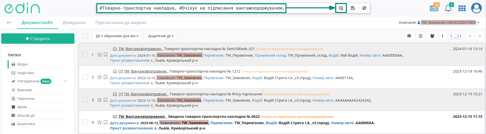
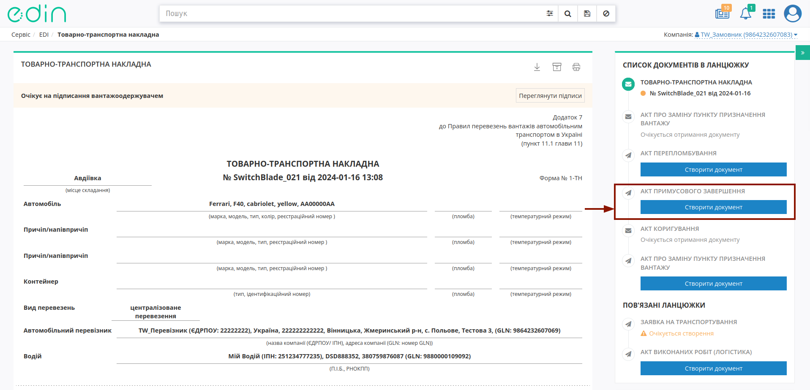
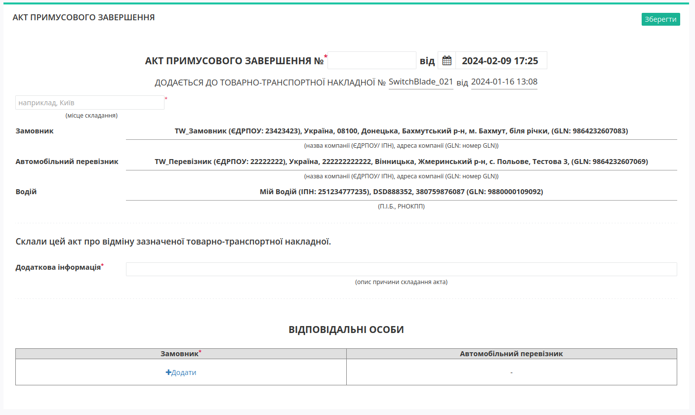
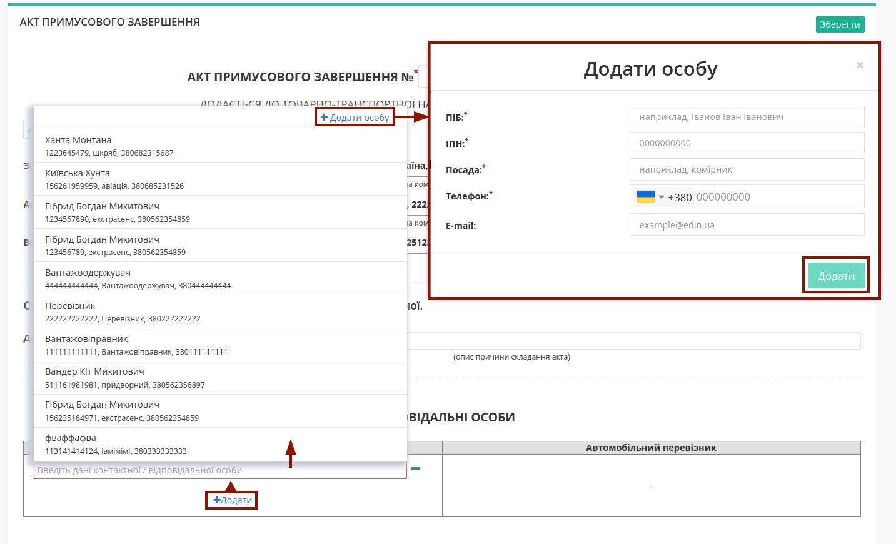
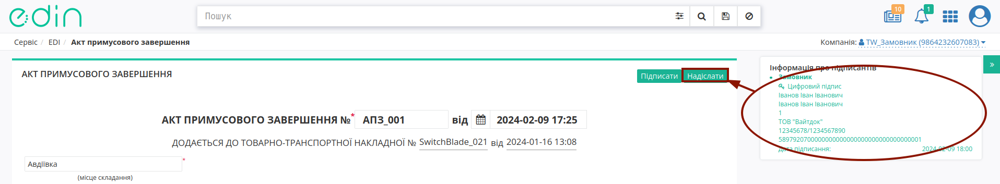
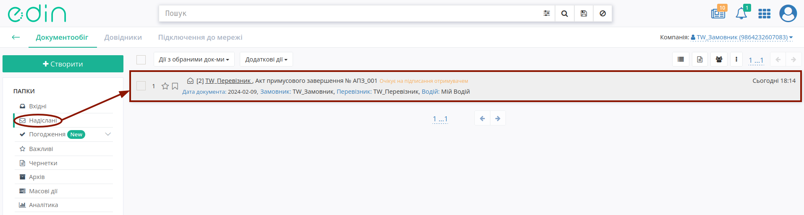

Створення "Акта примусового завершення" на базі інших електронних документів
###################################################################################################

.. картинки в текст

.. |лупа| image:: /_constant/icons/magnifying_glass.png

.. |будинок| image:: /_constant/icons/house.png

.. |pencil_stencil| image:: /_constant/icons/pencil_stencil.png

.. |лупа2| image:: /_constant/icons/magnifying_glass2.png

.. |trash| image:: /_constant/icons/trash.png

.. role:: red

.. role:: green

.. role:: orange

.. role:: underline

.. contents:: Зміст:
   :depth: 3

---------

«Акт примусового завершення» складається **Замовником** у разі неможливості завершення життєвого циклу «е-ТТН». 
Документ створюється на підставі «е-ТТН», яка вже підписана **Перевізником** та має статус :orange:`"Очікує підписання вантажоодержувачем"`.

.. hint::
   Також "Акт примусового завершення" може бути створений на підставі "е-ТТН" у випадку, коли вантаж розвантажено та отримувач підписав «Акт завантаження на проміжному складі».

Документообіг "Актом примусового завершення" здійснюється між **Замовником** та **Перевізником**. 

Обмін документом здійснюється між учасниками в наступному порядку: 

:green:`"Замовник" -> "Перевізник"`

.. _create-from-ttn:

**1 Створення "Акта примусового завершення" на підставі "е-ТТН"**
================================================================================================================================

.. attention::
   Після створення "Акта примусового завершення" дії з документом-підставою ("е-ТТН") будуть обмежені до кінця життєвого циклу акта (поки "Акт примусового завершення" не буде підписаний **"Перевізником"** чи відхилений **"Замовником"** / **"Перевізником"**). Після успішного підписання "Акта примусового завершення" обома учасниками "е-ТТН" (документ-підстава) відхиляється, тобто приймає кінцевий статус, на якому документообіг завершується.

**"Замовнику"** для створення **"Акта примусового завершення"** в сервісі "EDI Network" потрібно перейти у **"Вхідні"** та перейти в "Товарно-транспортну накладну", до якої потібно створити коригуючий акт ("е-ТТН" в статусі :orange:`"Очікує підписання вантажоодержувачем"` - для зручності можливо скористатись `пошуком <https://wiki.edin.ua/uk/latest/general_2_0/rabota_s_platformoj_EDIN_2.0.html#doc-search>`__):

У відкритому документі натисніть **"Створити документ"** "Акт примусового завершення" в блоці `ланцюжка документів <https://wiki.edin.ua/uk/latest/_constant/chain/chain.html>`__:

При створенні документа "Акта примусового завершення" дані **"Замовника"**, **"Перевізника"**, **"Водія"** автоматично заповнюються з "е-ТТН", як документа-підстави: 

Потрібно зазначити номер Акта (автоматично проставляється поточна дата та час створення документа) та місце його складання (обов'язкові до заповнення поля позначені червоною зірочкою :red:`*`)

Як вже було зазначено раніше, "Акта примусового завершення" може складатись для завершення життєвого циклу "е-ТТН", тому при формуванні "Акта перепломбування" обов'язково заповнюється поле **"Додаткова інформація"** з описом причини складання Акта!

В документі також обов'язково зазначається відповідальна/-ні особи **"Замовника"** за допомогою кнопки **"+Додати"**. Дані раніше доданих відповідальних осіб можливо обрати з віртуального довідника чи видалити зі списку за допомогою |trash|:

Довідник автоматично наповнюється при додаванні нового відповідального (кнопка **"+Додати особу"**). При додаванні нового відповідального в модальному вікні потрібно заповнити обов'язкові контактні дані (обов'язкові поля позначені червоною зірочкою :red:`*`).

Редагувати дані раніше введених осіб можливо за допомогою кнопки **"Змінити"** (|pencil_stencil|):

.. image:: pics_Create_Stop_Act_from/Create_Stop_Act_from_005.png
   :align: center

За потреби можливо **"Обрати"** (|лупа2|) іншу особу замість обраної/доданої раніше.

.. hint::
   **При підписанні:** якщо поле Вашої **"Відповідальної особи"** :underline:`незаповнене`, то воно може автоматично заповнюватись даними з Вашого ЕЦП (якщо це можливо).

Після того, як обов'язкові дані будуть введені потрібно **"Зберегти"**, **"Підписати"** та **"Надіслати"** документ (кнопки в правій верхній частині форми документа відображаються для виконання потрібної дії):

.. image:: /_constant/signing/universal_button.gif
   :align: center

.. _sign:

**1.1 Підписання та відправка "Акта примусового завершення" "Замовником"**
------------------------------------------------------------------------------------------------------------

.. include:: /_constant/atb_check/atb_check.rst
   :start-after: .. початок блоку для ATB_check
   :end-before: .. кінець блоку для ATB_check

.. tabs::

   .. tab:: Файловий ключ

      .. include:: /_constant/signing/signing.rst
         :start-after: .. початок блоку для Signing
         :end-before: .. кінець блоку для Signing

   .. tab:: Token

      .. include:: /_constant/token_signing/token_signing.rst
         :start-after: .. початок блоку для TokenSign
         :end-before: .. кінець блоку для TokenSign

   .. tab:: Гряда

      .. include:: /_constant/gryada_signing/gryada_signing.rst
         :start-after: .. початок блоку для GryadaSign
         :end-before: .. кінець блоку для GryadaSign

   .. tab:: Дія.Підпис

      .. include:: /_constant/diya_signing/diya_signing.rst
         :start-after: .. початок блоку для DiyaPidps
         :end-before: .. кінець блоку для DiyaPidps

   .. tab:: Cloud

      .. include:: /_constant/cloud_signing/cloud_signing.rst
         :start-after: .. початок блоку для CloudSign
         :end-before: .. кінець блоку для CloudSign

Після підписання "Акта примусового завершення" відображається "Інформація про підписантів", а документ можливо **"Надіслати"**:

Після відправки автоматично відкривається папка **"Надіслані"**, де надісланий акт відображається зі статусом :orange:`"Очікує на підписання отримувачем"`:

Після відправки у пов'язаного документа "е-ТТН" при його перегляді в блоці `ланцюжка документів <https://wiki.edin.ua/uk/latest/_constant/chain/chain.html>`__ відобрається створений Акт і виводиться повідомлення про обмежені дії з документом до кінця життєвого циклу акта (поки **"Перевізник"** не підпише або відхилить створений "Акт примусового завершення"):

.. image:: pics_Create_Stop_Act_from/Create_Stop_Act_from_008.png
   :align: center

-------------------------------------

.. include:: /_constant/kontakti.rst

