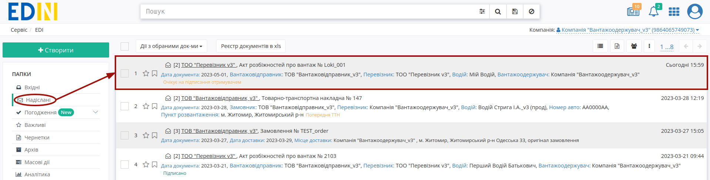
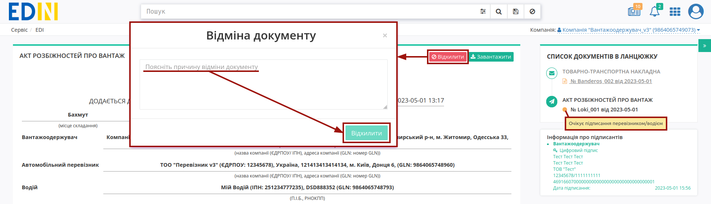
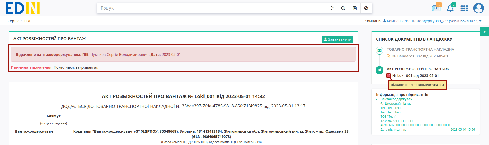
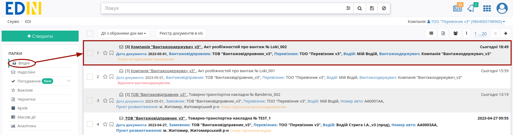
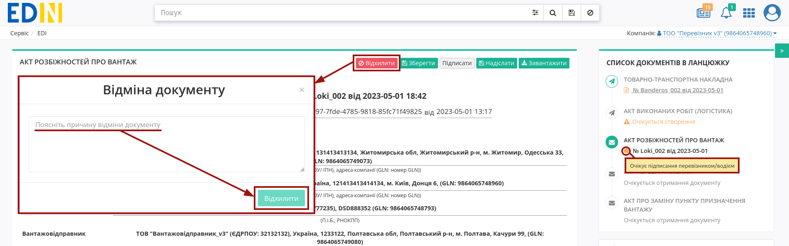
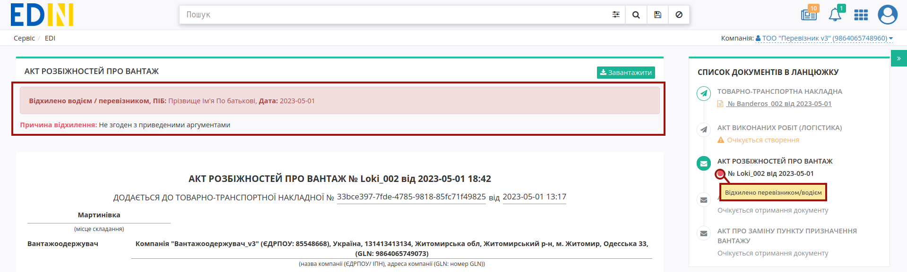

Відхилення "Акта розбіжностей про вантаж"
###################################################################################################

.. role:: red

.. role:: green

.. role:: orange

.. role:: underline

.. contents:: Зміст:
   :depth: 3

---------

Ініціатором відхилення "Акта розбіжностей про вантаж" може виступати **"Вантажоодержувач"** (відправник документа) та **"Перевізник"** (отримувач документа). Відхилити "Акт розбіжностей про вантаж" можливо поки документ перебуває в статусі :orange:`"Очікує підписання перевізником/водієм"` тобто поки **"Перевізник"** не підписав документ.

.. _consignee-reject:

**1 Відхилення "Акта розбіжностей про вантаж" Вантажоодержувачем**
================================================================================================

Для відхилення "Акта розбіжностей про вантаж" **"Вантажоодержувачу"** (відправнику документа) потрібно перейти в **"Надіслані"** та відкрити потрібний документ: 

Документ можливо **"Відхилити"** за допомогою відповідної кнопки (в модульному вікні обов'язково потрібно заповнити причину відхилення документа):

Після відхилення документ змінює свій статус на :red:`"Відхилено вантажоодержувачем"`. Кінцевий статус документа разом з датою та текстом причини відхилення відображається в шапці документа:  

Після відхилення Акта функціонал по роботі з "е-ТТН" знову стає доступним.

.. _carrier-reject:

**2 Відхилення "Акта розбіжностей про вантаж" Перевізником**
================================================================================================

Для відхилення "Акта розбіжностей про вантаж" **"Перевізнику"** (отримувачу документа) потрібно перейти в **"Вхідні"** та відкрити потрібний документ: 

Документ можливо **"Відхилити"** за допомогою відповідної кнопки (в модульному вікні обов'язково потрібно заповнити причину відхилення документа):

Після відхилення документ змінює свій статус на :red:`"Відхилено перевізником/водієм"`. Кінцевий статус документа разом з датою та текстом причини відхилення відображається в шапці документа:  

Після відхилення Акта функціонал по роботі з "е-ТТН" знову стає доступним.

---------------------------------

.. include:: /_constant/kontakti.rst