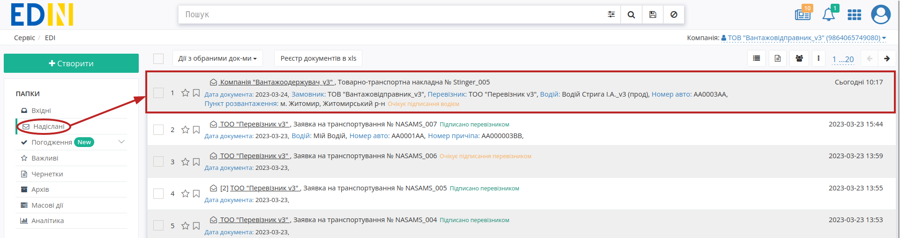
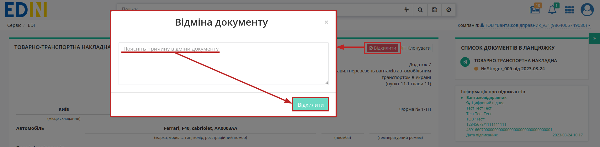
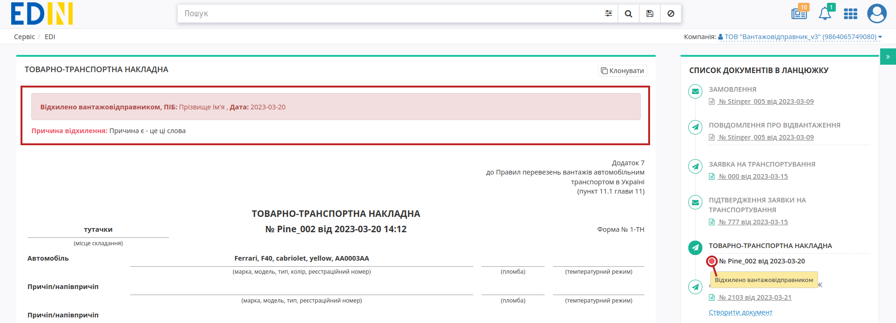
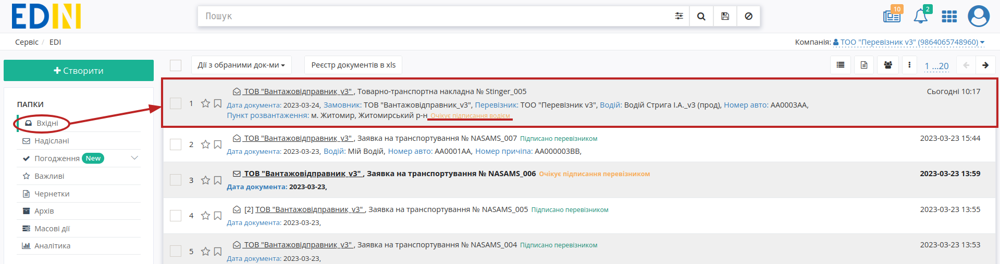
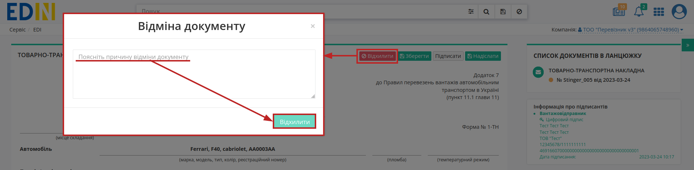
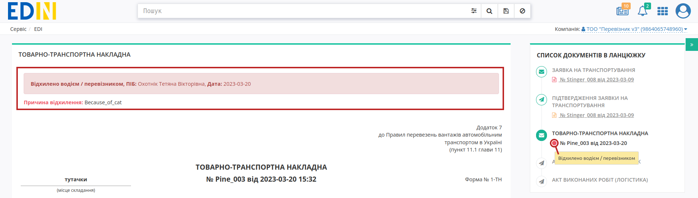

Відхилення "е-ТТН"
###################################################################################################

.. role:: red

.. role:: green

.. role:: orange

.. role:: underline

.. contents:: Зміст:
   :depth: 3

---------

Ініціатором відхилення "е-ТТН" може виступати **"Вантажовідправник"** (відправник документа) та **"Водій" / "Перевізник"** (учасник документообігу в схемі :green:`"Вантажовідправник" -> "Перевізник" -> "Вантажоотримувач"`). Відхилити "е-ТТН" можливо поки документ перебуває в статусі :orange:`"Очікує на підписання водієм/перевізником"` тобто поки **"Водій" / "Перевізник"** не підписав документ.

.. _consignor-reject:

**1 Відхилення "е-ТТН" Вантажовідправником**
================================================================================================

Для відхилення "е-ТТН" **"Вантажовідправнику"** (відправнику документа) потрібно перейти в **"Надіслані"** та відкрити потрібний документ: 

Документ можливо **"Відхилити"** за допомогою відповідної кнопки (в модульному вікні обов'язково потрібно заповнити причину відхилення документа):

Після відхилення документ змінює свій статус на :red:`"Відхилено вантажовідправником"`. Кінцевий статус документа разом з датою та текстом причини відхилення відображається в шапці документа:  

.. _carrier-reject:

**2 Відхилення "е-ТТН" Перевізником**
================================================================================================

Для відхилення "е-ТТН" **"Водію" / "Перевізнику"** (отримувачу документа) потрібно перейти в **"Вхідні"** та відкрити потрібний документ: 

Документ можливо **"Відхилити"** за допомогою відповідної кнопки (в модульному вікні обов'язково потрібно заповнити причину відхилення документа):

Після відхилення документ змінює свій статус на :red:`"Відхилено водієм / перевізником"`. Кінцевий статус документа разом з датою та текстом причини відхилення відображається в шапці документа:  

---------------------------------

.. include:: /_constant/kontakti.rst