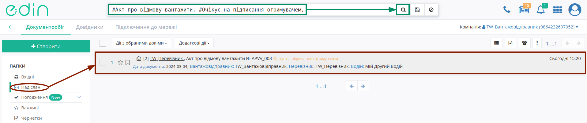
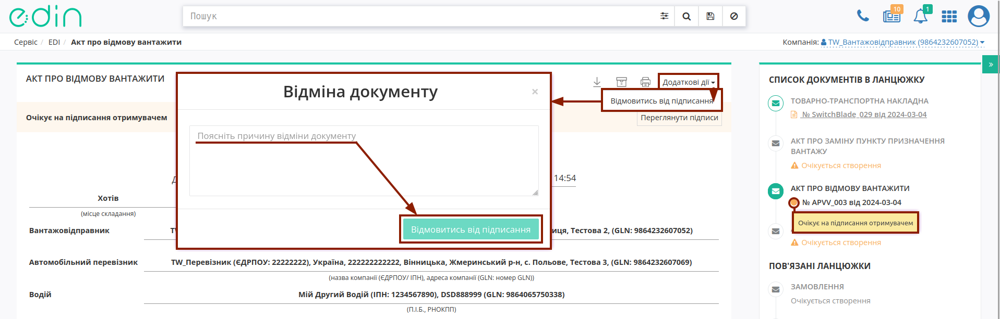
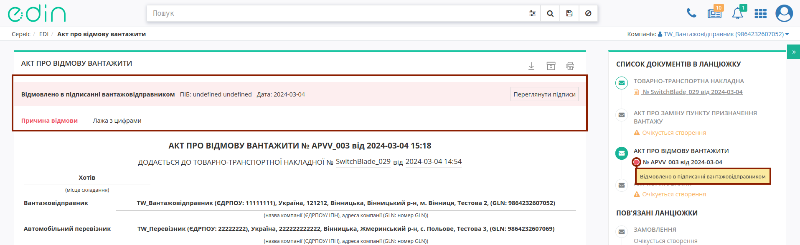
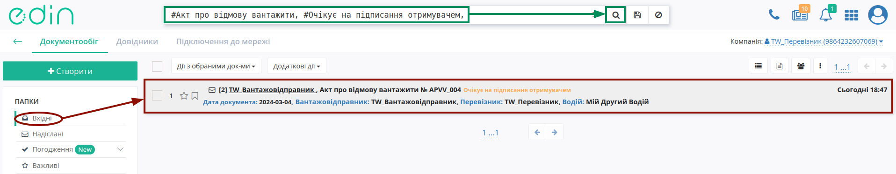
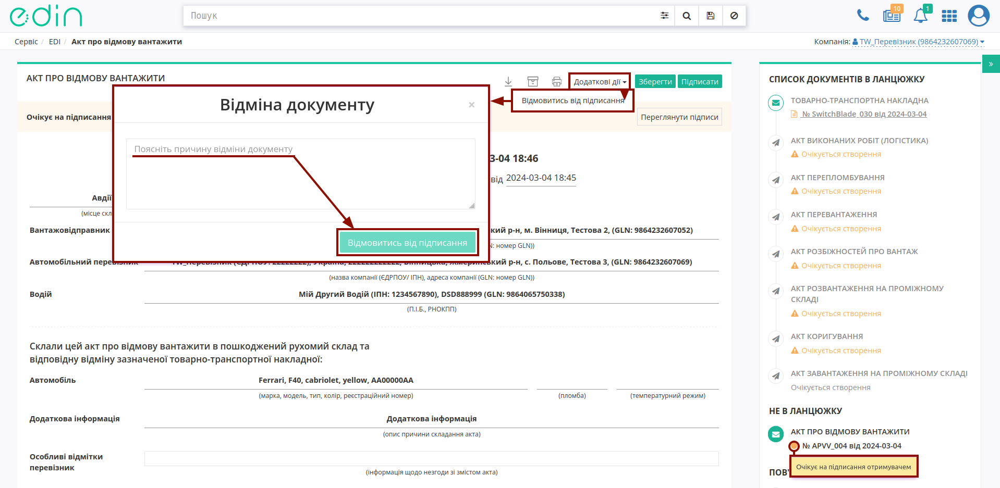
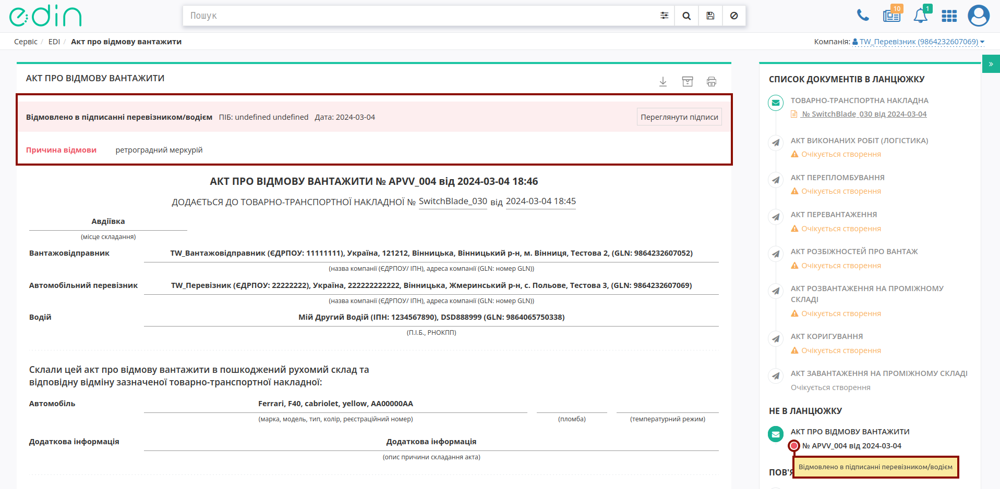

Відхилення "Акта про відмову вантажити"
####################################################################################################################################

.. role:: red

.. role:: green

.. role:: orange

.. role:: underline

.. contents:: Зміст:
   :depth: 3

---------

При роботі з транспортними документами передбачено кілька основних ролей учасників документообігу: **"Замовник"**, **"Вантажовідправник"**, **"Перевізник"**, **"Вантажоотримувач"**, **"Проміжний склад"**. Ініціатором відхилення "Акта про відмову вантажити" згідно загальної `схеми обміну <https://wiki.edin.ua/uk/latest/API_ETTNv3_1/Work_with_API/LoadRejectActv3_API_work.html>`__ документом, може виступати **"Вантажовідправник"** або **"Перевізник (Водій)"**.

Відхилити "Акт про відмову вантажити" можливо:

   * зі сторони **"Вантажовідправника"** поки документ перебуває в статусі :orange:`"Очікує на підписання отримувачем"` тобто поки Отримувач (**"Перевізник (Водій)"**) не підписав документ;
   * зі сторони **"Перевізника (Водія)"** поки документ перебуває в статусі :orange:`"Очікує на підписання отримувачем"` (до підписання).

.. _consignor-reject:

**1 Відхилення "Акта про відмову вантажити" Вантажовідправником**
=============================================================================================================================

Для відхилення "Акта про відмову вантажити" **"Вантажовідправнику"** (відправнику документа) в сервісі "EDI Network" потрібно перейти в **"Надіслані"** та вибрати **"Акт про відмову вантажити"** в статусі :orange:`"Очікує на підписання отримувачем"` (для зручності можливо скористатись рядком `пошуку <https://wiki.edin.ua/uk/latest/general_2_0/rabota_s_platformoj_EDIN_2.0.html#doc-search>`__):

Далі у випадаючому списку під кнопкою **"Додаткові дії"** потрібно обрати дію **"Відмовитись від підписання"** (в модульному вікні обов'язково потрібно заповнити причину відхилення документа та підтвердити дію - **"Відмовитись від підписання"**):

Після відхилення документ змінює свій статус на :red:`"Відхилено в підписанні вантажовідправником"`, а кінцевий статус документа разом з ПІБ особи, що відмовилась від підписання, датою та текстом причини відхилення відображається в шапці документа:

Після відхилення Акта функціонал по роботі з "е-ТТН" знову стає доступним.

.. _carrier-reject:

**2 Відхилення "Акта про відмову вантажити" Отримувачем Акта (Перевізником/Водієм)**
==================================================================================================================

Для відхилення "Акта про відмову вантажити" Отримувачу документа (**"Перевізнику/Водію"**) потрібно перейти в **"Вхідні"** та вибрати **"Акт про відмову вантажити"** в статусі :orange:`"Очікує на підписання отримувачем"` (для зручності можливо скористатись рядком `пошуку <https://wiki.edin.ua/uk/latest/general_2_0/rabota_s_platformoj_EDIN_2.0.html#doc-search>`__):

Далі у випадаючому списку під кнопкою **"Додаткові дії"** потрібно обрати дію **"Відмовитись від підписання"** (в модульному вікні обов'язково потрібно заповнити причину відхилення документа та підтвердити дію - **"Відмовитись від підписання"**):

Після відхилення документ змінює свій статус на :red:`"Відмовлено в підписанні перевізником/водієм"`, а кінцевий статус документа разом з ПІБ особи, що відмовилась від підписання, датою та текстом причини відхилення відображається в шапці документа:

Після відхилення Акта функціонал по роботі з "е-ТТН" знову стає доступним.

---------------------------------

.. include:: /_constant/kontakti.rst

