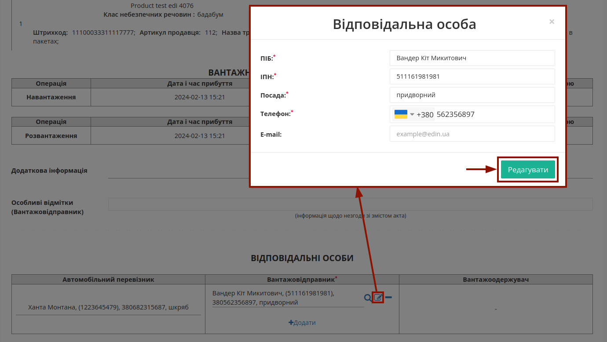

Обробка вхідного "Акта коригування"
###################################################################################################

.. картинки в текст

.. |лупа| image:: /_constant/icons/magnifying_glass.png

.. |будинок| image:: /_constant/icons/house.png

.. |pencil_stencil| image:: /_constant/icons/pencil_stencil.png

.. |лупа2| image:: /_constant/icons/magnifying_glass2.png

.. |trash| image:: /_constant/icons/trash.png

.. role:: red

.. role:: green

.. role:: orange

.. role:: underline

.. contents:: Зміст:
   :depth: 3

---------

"Акт коригування" складається у разі виявлення помилки в реквізитах "е-ТТН", щоб зафіксувати в Акті правильні реквізити "е-ТТН". Ініціатором "Акт коригування" може виступати: **"Замовник"**, **"Вантажовідправник"**, **"Перевізник/Водій"**, **"Вантажоодержувач"**. Обмін документом здійснюється та скріплюється електронними підписами представників між учасниками документообігу.

.. attention::
   Акт коригування складається Замовником або будь-яким іншим учасником е-ТТН, що ініціює виправлення помилки. В залежності від стадії перевезення набір сторін-підписувачів може змінюватись. Так, **Акт підписується всіма учасниками перевезення, які заявлені в мета-даних е-ТТН і накладали свій підпис на документ у процесі перевезення** , при цьому учасники, які ще не накладали підпис на е-ТТН (наприклад, Вантажоодержувач), можуть не підписувати Акт.

.. _from-initiator-to-receiver:

**1 Обробка вхідного "Акта коригування"**
====================================================================================================================

Розглянемо обробку вхідного "Акта коригування" з боку **Вантажовідправника** в сервісі "EDI Network". Для цього потрібно перейти у **"Вхідні"** та вибрати **"Акт коригування"** в статусі :orange:`"Очікує на підписання отримувачем"` (для зручності можливо скористатись рядком `пошуку <https://wiki.edin.ua/uk/latest/general_2_0/rabota_s_platformoj_EDIN_2.0.html#doc-search>`__):

Після ознайомлення з документом Ви можете **Прийняти** чи `"Відхилити" <https://wiki.edin.ua/uk/latest/ETTN_3_0/Adjustment_Act_Reject.html>`__ "Акт коригування". Для того, щоб **Прийняти** документ обов'язково потрібно **"+Додати"** дані відповідальної особи в табличній частині блоку **"Відповідальні особи"** в нижній частині документа:

.. image:: pics_Processing_Adjustment_Act/Processing_Adjustment_Act_002.png
   :align: center

.. hint::
   **При підписанні:** якщо поле Вашої **"Відповідальної особи"** :underline:`незаповнене`, то воно може автоматично заповнюватись даними з Вашого ЕЦП (якщо це можливо).

Дані раніше доданих відповідальних осіб можливо обрати з віртуального довідника чи видалити зі списку за допомогою |trash|:

Довідник автоматично наповнюється при додаванні нового відповідального (кнопка **"+Додати особу"**). При додаванні нового відповідального в модальному вікні потрібно заповнити обов'язкові контактні дані (обов'язкові поля позначені червоною зірочкою :red:`*`).

Редагувати дані раніше введених осіб можливо за допомогою кнопки **"Змінити"** (|pencil_stencil|):

За потреби можливо **"Обрати"** (|лупа2|) іншу особу замість обраної/доданої раніше.

Після того, як обов'язкові дані будуть введені потрібно **"Зберегти"**:

та **"Підписати"** документ:

.. _sign:

**1.1 Підписання та відправка "Акта коригування" "Перевізником"**
-----------------------------------------------------------------------------------------------------

.. include:: /_constant/atb_check/atb_check.rst
   :start-after: .. початок блоку для ATB_check
   :end-before: .. кінець блоку для ATB_check

.. tabs::

   .. tab:: Файловий ключ

      .. include:: /_constant/signing/signing.rst
         :start-after: .. початок блоку для Signing
         :end-before: .. кінець блоку для Signing

   .. tab:: Token

      .. include:: /_constant/token_signing/token_signing.rst
         :start-after: .. початок блоку для TokenSign
         :end-before: .. кінець блоку для TokenSign

   .. tab:: Гряда

      .. include:: /_constant/gryada_signing/gryada_signing.rst
         :start-after: .. початок блоку для GryadaSign
         :end-before: .. кінець блоку для GryadaSign

   .. tab:: Cloud

      .. include:: /_constant/cloud_signing/cloud_signing.rst
         :start-after: .. початок блоку для CloudSign
         :end-before: .. кінець блоку для CloudSign

Після підписання "Акта коригування" інформація про нового підписанта відображається після натискання кнопки **"Переглянути підписи"**. Підписаний документ можливо **"Надіслати"**:

В залежності від кількості підписантів та етапу документообігу, "Акт коригування" може залишити статус :orange:`"Очікує на підписання отримувачем"` (документ потребує дій на стороні інших учасників документообігу) або змінити свій статус на :green:`"Підписано всіма сторонами"`:

.. image:: pics_Processing_Adjustment_Act/Processing_Adjustment_Act_008.png
   :align: center

При цьому документ "е-ТТН" все ще перебуває в статусі :orange:`"Очікує завершення роботи з Актом коригування"` і потребує оновлення даних на стороні **Ініціатора** "Акта коригування" (розглянемо на прикладі **Вантажовідправника**)! **Ініціатор** має відкрити "е-ТТН" та **"Підписати"** зміни до "е-ТТН":

.. hint::
   Процес підписання є типовим на платформі EDI Network та описаний вище.

Після підписання зміни до "е-ТТН" потрібно **"Надіслати"**:

Після чого функціонал по роботі з "е-ТТН" знову стає доступним контрагентам цього документа.

---------------------------------

.. include:: /_constant/kontakti.rst
