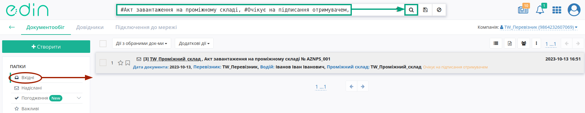
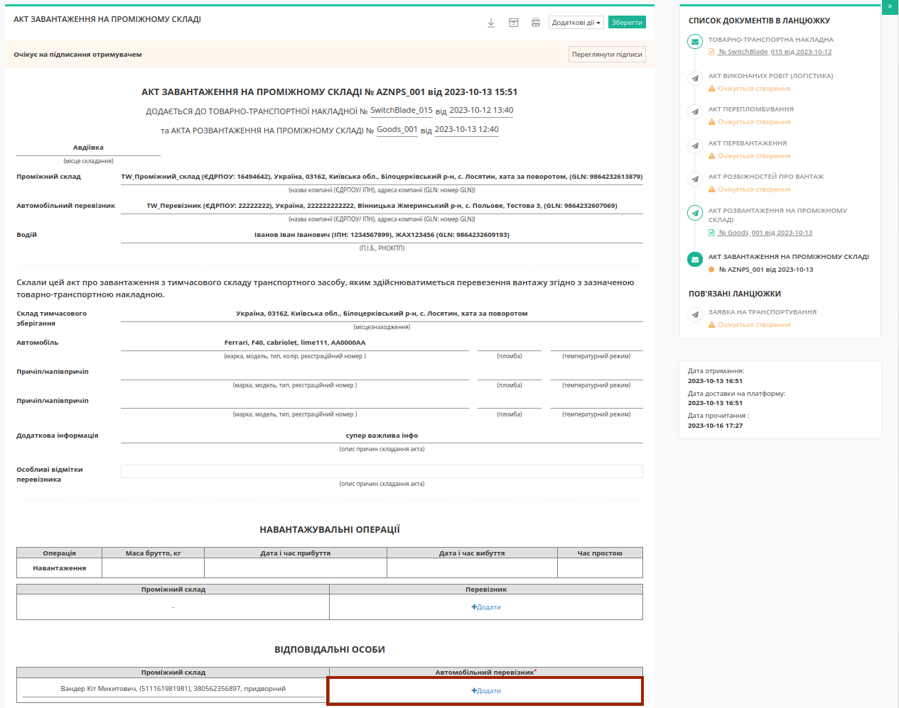
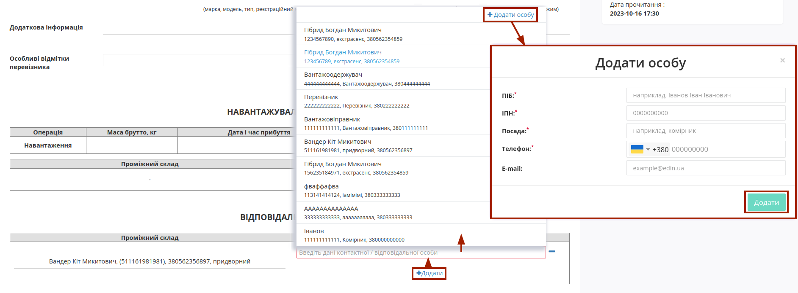
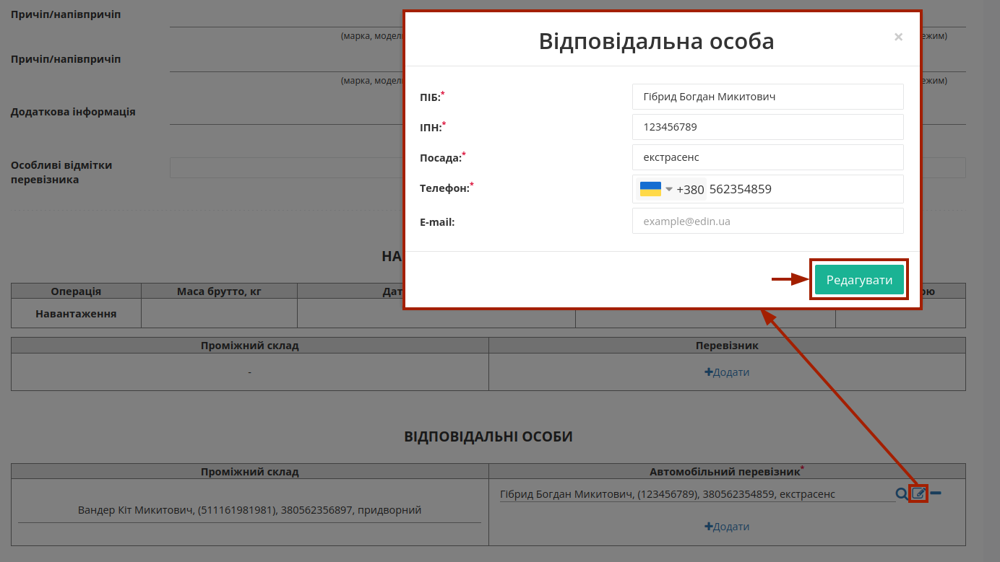
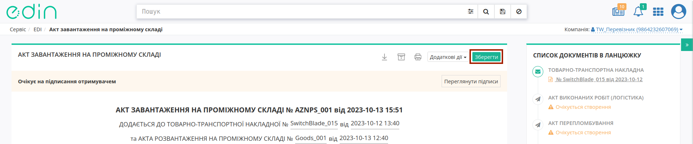
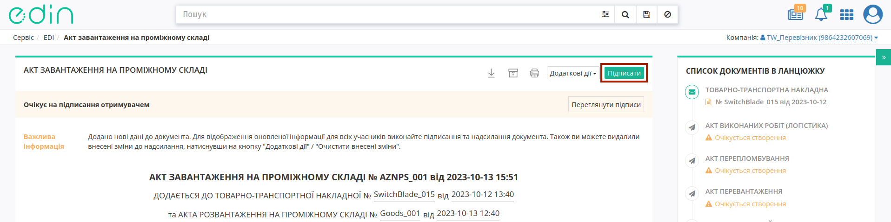
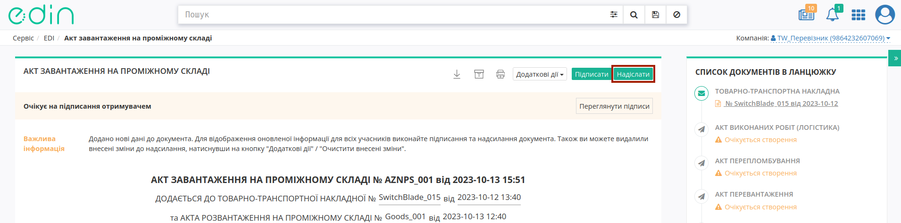
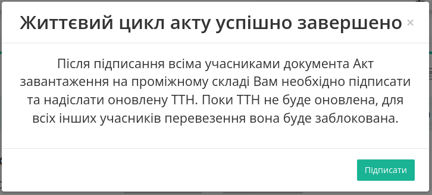
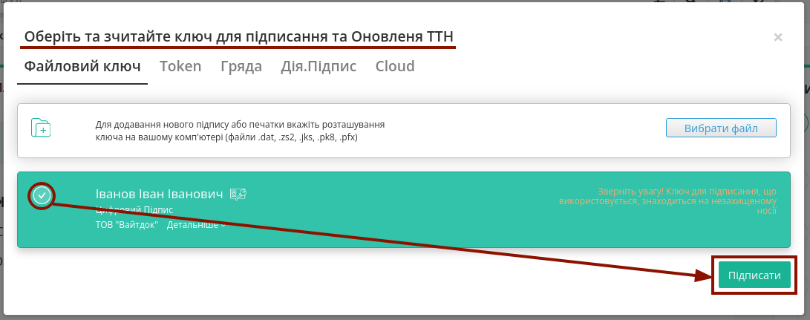

Обробка вхідного "Акта завантаження на проміжному складі"
###################################################################################################

.. картинки в текст

.. |лупа| image:: /_constant/icons/magnifying_glass.png

.. |будинок| image:: /_constant/icons/house.png

.. |pencil_stencil| image:: /_constant/icons/pencil_stencil.png

.. |лупа2| image:: /_constant/icons/magnifying_glass2.png

.. |trash| image:: /_constant/icons/trash.png

.. role:: red

.. role:: green

.. role:: orange

.. role:: underline

.. contents:: Зміст:
   :depth: 3

---------

"Акт завантаження на проміжному складі" складається у разі повного перевантаження вантажу (без розподілу на кілька актів) в процесі перевезення на Проміжний склад з подальшим перевантаженням на інший автомобіль. Ініціатором "Акт завантаження на проміжному складі" виступає **"Проміжний склад"**. Обмін документом здійснюється та скріплюється електронними підписами представників між учасниками в наступному порядку: 

:green:`"Проміжний склад" -> "Перевізник"`

Отримувачем "Акта завантаження на проміжному складі" виступає учасник з роллю **"Перевізник"**.

.. _from-storage-to-carrier:

**1 Обробка вхідного "Акта завантаження на проміжному складі" на стороні "Перевізника"**
====================================================================================================================================

Для обробки "Акта завантаження на проміжному складі" **Перевізником** в сервісі "EDI Network" потрібно перейти у **"Вхідні"** та вибрати **"Акт завантаження на проміжному складі"** в статусі :orange:`"Очікує на підписання отримувачем"` (для зручності можливо скористатись рядком `пошуку <https://wiki.edin.ua/uk/latest/general_2_0/rabota_s_platformoj_EDIN_2.0.html#doc-search>`__):

Після ознайомлення з документом Ви можете **Прийняти** чи `"Відхилити" <https://wiki.edin.ua/uk/latest/ETTN_3_0/StoragePickUp_Act_Reject.html>`__ "Акт завантаження на проміжному складі". Для того, щоб **Прийняти** документ обов'язково потрібно **"+Додати"** дані відповідальної особи в табличній частині блоку **"Вантажно-розвантажувальні операції"** в нижній частині документа:

Дані раніше доданих відповідальних осіб можливо обрати з віртуального довідника чи видалити зі списку за допомогою |trash|:

Довідник автоматично наповнюється при додаванні нового відповідального (кнопка **"+Додати особу"**). При додаванні нового відповідального в модальному вікні потрібно заповнити обов'язкові контактні дані (обов'язкові поля позначені червоною зірочкою :red:`*`).

Редагувати дані раніше введених осіб можливо за допомогою кнопки **"Змінити"** (|pencil_stencil|):

За потреби можливо **"Обрати"** (|лупа2|) іншу особу замість обраної/доданої раніше.

Після того, як обов'язкові дані будуть введені потрібно **"Зберегти"**:

та **"Підписати"** документ:

.. _sign:

**1.1 Підписання та відправка "Акта завантаження на проміжному складі" "Перевізником"**
-----------------------------------------------------------------------------------------------------

.. include:: /_constant/atb_check/atb_check.rst
   :start-after: .. початок блоку для ATB_check
   :end-before: .. кінець блоку для ATB_check

.. tabs::

   .. tab:: Файловий ключ

      .. include:: /_constant/signing/signing.rst
         :start-after: .. початок блоку для Signing
         :end-before: .. кінець блоку для Signing

   .. tab:: Token

      .. include:: /_constant/token_signing/token_signing.rst
         :start-after: .. початок блоку для TokenSign
         :end-before: .. кінець блоку для TokenSign

   .. tab:: Гряда

      .. include:: /_constant/gryada_signing/gryada_signing.rst
         :start-after: .. початок блоку для GryadaSign
         :end-before: .. кінець блоку для GryadaSign

   .. tab:: Cloud

      .. include:: /_constant/cloud_signing/cloud_signing.rst
         :start-after: .. початок блоку для CloudSign
         :end-before: .. кінець блоку для CloudSign

Після підписання "Акта завантаження на проміжному складі" інформація про нового підписанта відображається після натискання кнопки **"Переглянути підписи"**. Підписаний документ можливо **"Надіслати"**:

Життєвий цикл "Акту завантаження на проміжному складі" завершено (документу присвоюється статус :green:`"Підписано всіма сторонами"`), однак документ "е-ТТН" все ще залишається недоступним до опрацювання на стороні кінцевого контрагента поки Ви (**"Перевізник"**) не підпишете та не оновите за змінами (згідно Акту) "е-ТТН". В якості нагадування та підказки відображається pop-up вікно, що дозволяє однією кнопкою внести і **"Підписати"** зміни до "е-ТТН":

Про успішне оновлення даних в "е-ТТН" Ви будете проінформовані спливаючою підказкою:

.. image:: pics_Processing_StoragePickUp_Act/Processing_StoragePickUp_Act_021.png
   :align: center

Після чого функціонал по роботі з "е-ТТН" знову стає доступним контрагентам цього документа.

---------------------------------

.. include:: /_constant/kontakti.rst
