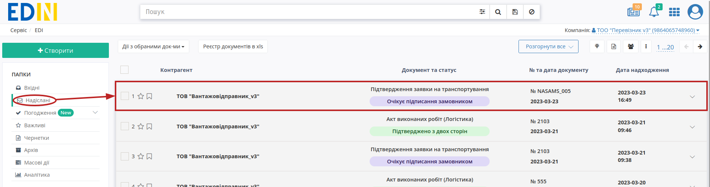
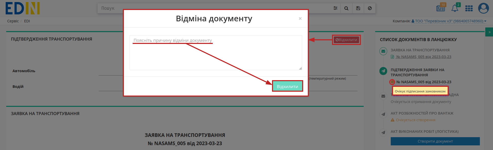
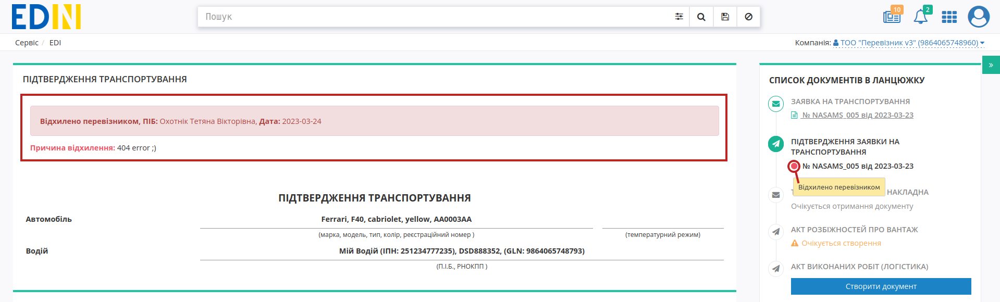

Відхилення "Підтвердження заявки на транспортування"
###################################################################################################

.. role:: red

.. role:: green

.. role:: orange

.. role:: underline

.. contents:: Зміст:
   :depth: 3

---------

Ініціатором відхилення "Підтвердження заявки на транспортування" може виступати лише **"Перевізник"** (відправник документа). Відхилити "Підтвердження заявки на транспортування" можливо поки документ перебуває в статусі :orange:`"Очікує підписання замовником"` тобто поки **"Замовник"** (отримувач документа) не підписав документ.

.. _carrier-reject:

**1 Відхилення "Підтвердження заявки на транспортування" Перевізником**
================================================================================================

Для відхилення "Підтвердження заявки на транспортування" **"Перевізнику"** (відправнику документа) потрібно перейти в **"Надіслані"** та відкрити потрібний документ: 

Документ можливо **"Відхилити"** за допомогою відповідної кнопки (в модульному вікні обов'язково потрібно заповнити причину відхилення документа):

Після відхилення документ змінює свій статус на :red:`"Відхилено перевізником"`. Кінцевий статус документа разом з датою та текстом причини відхилення відображається в шапці документа:  

---------------------------------

.. include:: /_constant/kontakti.rst