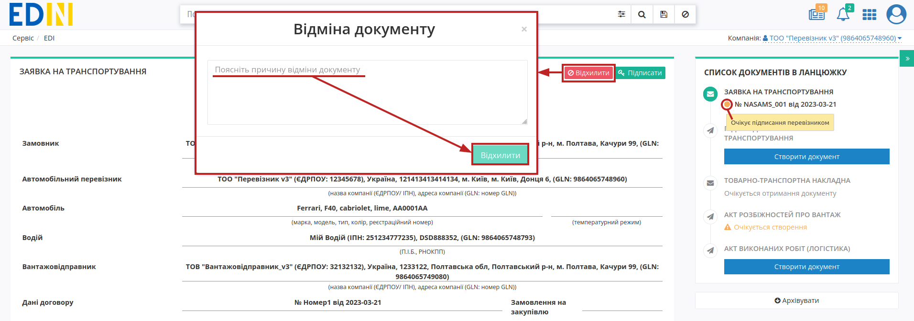

Відхилення "Заявки на транспортування"
###################################################################################################

.. role:: red

.. role:: green

.. role:: orange

.. role:: underline

.. contents:: Зміст:
   :depth: 3

---------

Ініціатором відхилення "Заявки на транспортування" може виступати **"Замовник"** (відправник документа) та **"Перевізник"** (отримувач документа). Відхилити "Заявку на транспортування" можливо поки документ перебуває в статусі :orange:`"Очікує підписання перевізником"` тобто поки **"Перевізник"** не підписав документ.

.. _customer-reject:

**1 Відхилення "Заявки на транспортування" Замовником**
================================================================================================

Для відхилення "Заявки на транспортування" **"Замовнику"** (відправнику документа) потрібно перейти в **"Надіслані"** та відкрити потрібний документ: 

Документ можливо **"Відхилити"** за допомогою відповідної кнопки (в модульному вікні обов'язково потрібно заповнити причину відхилення документа):

Після відхилення документ змінює свій статус на :red:`"Відхилено замовником"`. Кінцевий статус документа разом з датою та текстом причини відхилення відображається в шапці документа:  

.. _carrier-reject:

**2 Відхилення "Заявки на транспортування" Перевізником**
================================================================================================

Для відхилення "Заявки на транспортування" **"Перевізнику"** (отримувачу документа) потрібно перейти в **"Вхідні"** та відкрити потрібний документ: 

Документ можливо **"Відхилити"** за допомогою відповідної кнопки (в модульному вікні обов'язково потрібно заповнити причину відхилення документа):

Після відхилення документ змінює свій статус на :red:`"Відхилено перевізником"`. Кінцевий статус документа разом з датою та текстом причини відхилення відображається в шапці документа:  

---------------------------------

.. include:: /_constant/kontakti.rst