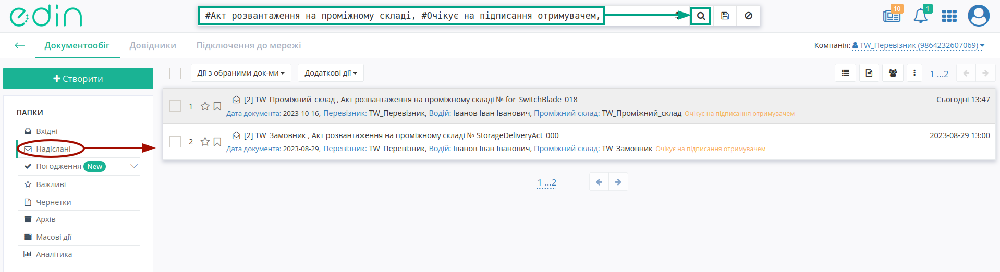
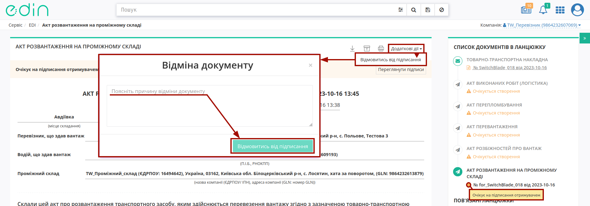
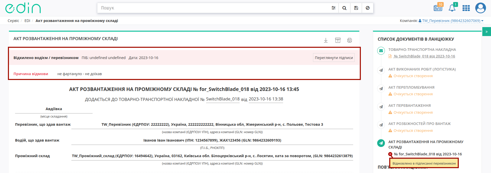
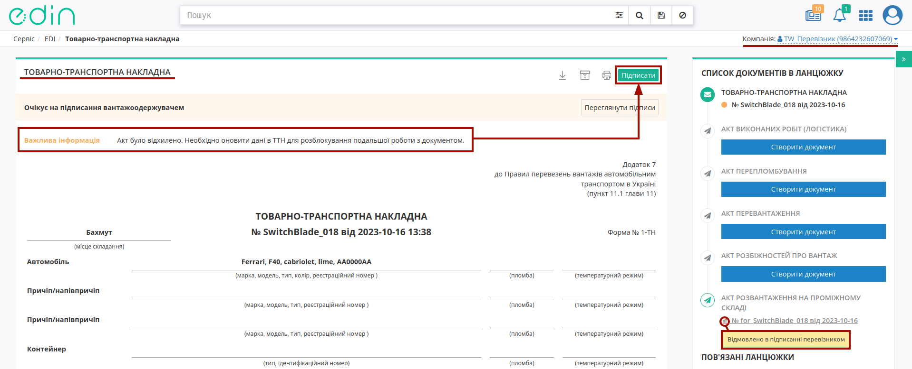
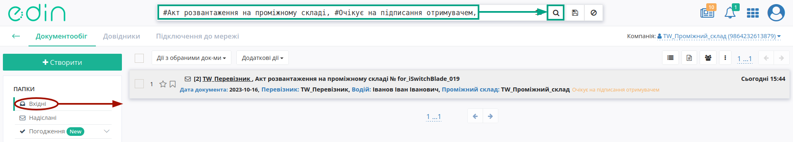
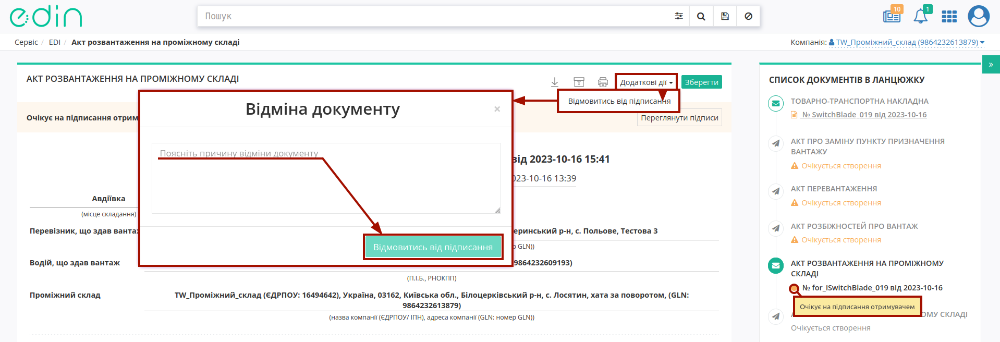
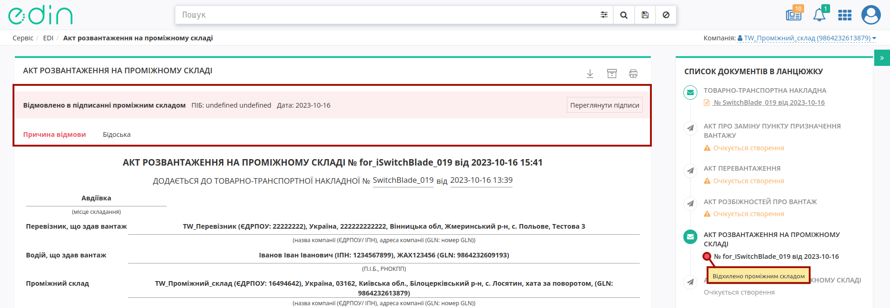
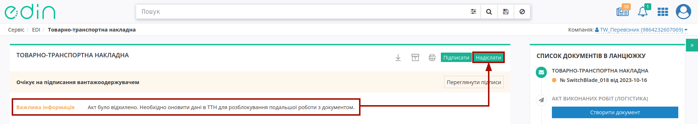

Відхилення "Акта розвантаження на проміжному складі"
####################################################################################################################################

.. role:: red

.. role:: green

.. role:: orange

.. role:: underline

.. contents:: Зміст:
   :depth: 3

---------

При роботі з транспортними документами передбачено кілька основних ролей учасників документообігу: **"Замовник"**, **"Вантажовідправник"**, **"Перевізник"**, **"Вантажоотримувач"**, **"Проміжний склад"**. Ініціатором відхилення "Акта розвантаження на проміжному складі" згідно загальної `схеми обміну <https://wiki.edin.ua/uk/latest/API_ETTNv3_1/Work_with_API/StorageDeliveryActv3_API_work.html>`__ документом, може виступати **"Перевізник (Водій)"** або **"Проміжний склад"**. 

Відхилити "Акт розвантаження на проміжному складі" можливо:

   * зі сторони **"Перевізника (Водія)"** поки документ перебуває в статусі :orange:`"Очікує на підписання отримувачем"` тобто поки Отримувач (**"Проміжний склад"**) не підписав документ;
   * зі сторони **"Проміжного складу"** поки документ перебуває в статусі :orange:`"Очікує на підписання отримувачем"` (до підписання).

.. _carrier-reject:

**1 Відхилення "Акта розвантаження на проміжному складі" Перевізником/Водієм**
========================================================================================================================================

Для відхилення "Акта розвантаження на проміжному складі" **"Перевізнику"** (відправнику документа) в сервісі "EDI Network" потрібно перейти в **"Надіслані"** та вибрати **"Акт розвантаження на проміжному складі"** в статусі :orange:`"Очікує на підписання отримувачем"` (для зручності можливо скористатись рядком `пошуку <https://wiki.edin.ua/uk/latest/general_2_0/rabota_s_platformoj_EDIN_2.0.html#doc-search>`__):

Далі у випадаючому списку під кнопкою **"Додаткові дії"** потрібно обрати дію **"Відмовитись від підписання"** (в модульному вікні обов'язково потрібно заповнити причину відхилення документа та підтвердити дію - **"Відмовитись від підписання"**):

Після чого статус документа змінюється на :red:`"Відхилено водієм/перевізником"`. Інформація про кінцевий статус разом з ПІБ особи, що відмовилась від підписання, датою та текстом причини відхилення відображається в шапці документа:

.. note::
   Для забезпечення можливості оновлення ТТН або створення нового Акта розвантаження система автоматично створює транзакцію на оновлення документа.

У результаті виконаних дій життєвий цикл акта завершено. ТТН необхідно підписати та надіслати, про що свідчить інформаційне вікно, яке відкривається після відхилення Акта.

.. dropdown:: Детальніше про підписання на платформі EDIN
   :color: info
   :icon: info
   :animate: fade-in-slide-down

   .. include:: /_constant/atb_check/atb_check.rst
      :start-after: .. початок блоку для ATB_check
      :end-before: .. кінець блоку для ATB_check

   .. tabs::

      .. tab:: Файловий ключ

         .. include:: /_constant/signing/signing.rst
            :start-after: .. початок блоку для Signing
            :end-before: .. кінець блоку для Signing

      .. tab:: Token

         .. include:: /_constant/token_signing/token_signing.rst
            :start-after: .. початок блоку для TokenSign
            :end-before: .. кінець блоку для TokenSign

      .. tab:: Гряда

         .. include:: /_constant/gryada_signing/gryada_signing.rst
            :start-after: .. початок блоку для GryadaSign
            :end-before: .. кінець блоку для GryadaSign

      .. tab:: Cloud

         .. include:: /_constant/cloud_signing/cloud_signing.rst
            :start-after: .. початок блоку для CloudSign
            :end-before: .. кінець блоку для CloudSign

Після чого функціонал по роботі з "е-ТТН" знову стає доступним контрагентам цього документа.

.. _storage-reject:

**2 Відхилення "Акта розвантаження на проміжному складі" Отримувачем Акта (Проміжний склад)**
==================================================================================================================

Для відхилення "Акта розвантаження на проміжному складі" Отримувачу документа (**"Проміжний склад"**) потрібно перейти в **"Вхідні"** та вибрати **"Акт розвантаження на проміжному складі"** в статусі :orange:`"Очікує на підписання отримувачем"` (для зручності можливо скористатись рядком `пошуку <https://wiki.edin.ua/uk/latest/general_2_0/rabota_s_platformoj_EDIN_2.0.html#doc-search>`__):

Далі у випадаючому списку під кнопкою **"Додаткові дії"** потрібно обрати дію **"Відмовитись від підписання"** (в модульному вікні обов'язково потрібно заповнити причину відхилення документа та підтвердити дію - **"Відмовитись від підписання"**):

Після відхилення документ змінює свій статус на :red:`"Відмовлено в підписанні проміжним складом"`, а кінцевий статус документа разом з ПІБ особи, що відмовилась від підписання, датою та текстом причини відхилення відображається в шапці документа:

Після відхилення Акта функціонал по роботі з "е-ТТН" все ще недоступний. Ініціатор відхилення (**"Перевізник"**) може перестворити Акт (кнопка **"Створити документ"**) або прийняти відхилення - для цього потрібно відкрити та оновити "е-ТТН", до якого складався Акт, підписавши та надіславши зміни:

.. image:: pics_StorageDelivery_Act_Reject/StorageDelivery_Act_Reject_009.png
   :align: center

.. dropdown:: Детальніше про підписання на платформі EDIN
   :color: info
   :icon: info
   :animate: fade-in-slide-down

   .. include:: /_constant/atb_check/atb_check.rst
      :start-after: .. початок блоку для ATB_check
      :end-before: .. кінець блоку для ATB_check

   .. tabs::

      .. tab:: Файловий ключ

         .. include:: /_constant/signing/signing.rst
            :start-after: .. початок блоку для Signing
            :end-before: .. кінець блоку для Signing

      .. tab:: Token

         .. include:: /_constant/token_signing/token_signing.rst
            :start-after: .. початок блоку для TokenSign
            :end-before: .. кінець блоку для TokenSign

      .. tab:: Гряда

         .. include:: /_constant/gryada_signing/gryada_signing.rst
            :start-after: .. початок блоку для GryadaSign
            :end-before: .. кінець блоку для GryadaSign

      .. tab:: Cloud

         .. include:: /_constant/cloud_signing/cloud_signing.rst
            :start-after: .. початок блоку для CloudSign
            :end-before: .. кінець блоку для CloudSign

Після чого функціонал по роботі з "е-ТТН" знову стає доступним контрагентам цього документа.

---------------------------------

.. include:: /_constant/kontakti.rst

