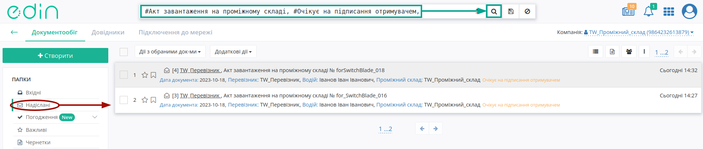
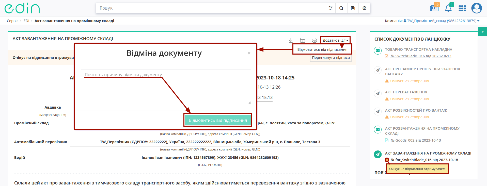
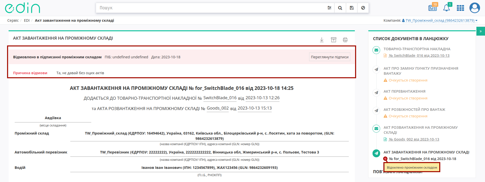
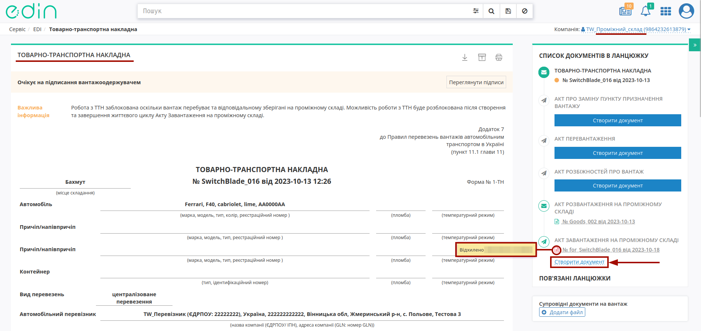
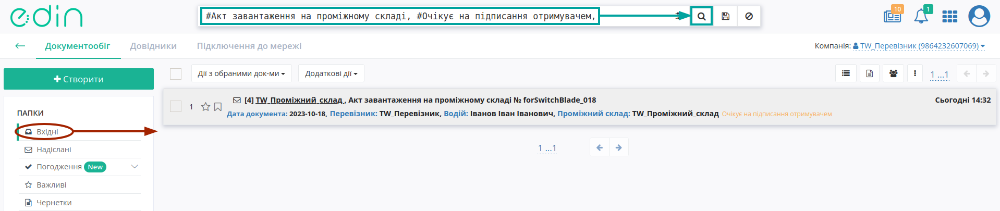
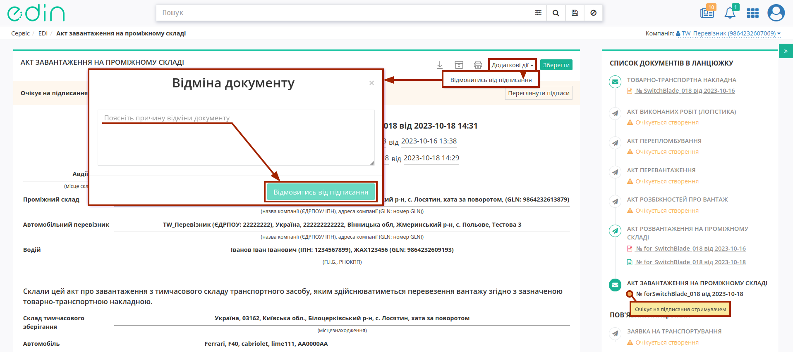
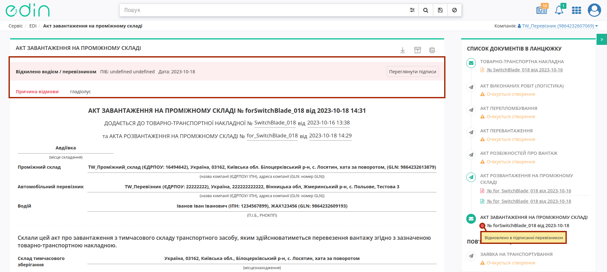

Відхилення "Акта завантаження на проміжному складі"
####################################################################################################################################

.. role:: red

.. role:: green

.. role:: orange

.. role:: underline

.. contents:: Зміст:
   :depth: 3

---------

При роботі з транспортними документами передбачено кілька основних ролей учасників документообігу: **"Замовник"**, **"Вантажовідправник"**, **"Перевізник"**, **"Вантажоотримувач"**, **"Проміжний склад"**. Ініціатором відхилення "Акта завантаження на проміжному складі" згідно загальної `схеми обміну <https://wiki.edin.ua/uk/latest/API_ETTNv3_1/Work_with_API/StoragePickUpActv3_API_work.html>`__ документом, може виступати **"Проміжний склад"** або **"Перевізник (Водій)"**.

Відхилити "Акт завантаження на проміжному складі" можливо:

   * зі сторони **"Проміжного складу"** поки документ перебуває в статусі :orange:`"Очікує на підписання отримувачем"` (до підписання);
   * зі сторони **"Перевізника (Водія)"** поки документ перебуває в статусі :orange:`"Очікує на підписання отримувачем"` тобто поки Отримувач (**"Проміжний склад"**) не підписав документ.

.. _storage-reject:

**1 Відхилення "Акта завантаження на проміжному складі" Проміжним складом**
========================================================================================================================================

Для відхилення "Акта завантаження на проміжному складі" **"Проміжному складу"** (відправнику документа) в сервісі "EDI Network" потрібно перейти в **"Надіслані"** та вибрати **"Акт завантаження на проміжному складі"** в статусі :orange:`"Очікує на підписання отримувачем"` (для зручності можливо скористатись рядком `пошуку <https://wiki.edin.ua/uk/latest/general_2_0/rabota_s_platformoj_EDIN_2.0.html#doc-search>`__):

Далі у випадаючому списку під кнопкою **"Додаткові дії"** потрібно обрати дію **"Відмовитись від підписання"** (в модульному вікні обов'язково потрібно заповнити причину відхилення документа та підтвердити дію - **"Відмовитись від підписання"**):

Після відхилення документ змінює свій статус на :red:`"Відхилено проміжним складом"`, а кінцевий статус документа разом з ПІБ особи, що відмовилась від підписання, датою та текстом причини відхилення відображається в шапці документа:

Після відхилення Акта функціонал по роботі з "е-ТТН" все ще недоступний. Після відхилення "Акта завантаження на проміжному складі" учасник з роллю **Проміжний склад** має на формі перегляду "е-ТТН", до якого складався Акт, заново перестворити "Акта завантаження на проміжному складі", натиснувши на кнопку **"Створити документ"** в блоці `ланцюжка документів <https://wiki.edin.ua/uk/latest/_constant/chain/chain.html>`__:

З інструкцією `Створення "Акта завантаження на проміжному складі" <https://wiki.edin.ua/uk/latest/_constant/chain/chain.html>`__ можна ознайомитись за посиланням.

.. _carrier-reject:

**2 Відхилення "Акта завантаження на проміжному складі" Отримувачем Акта (Перевізником/Водієм)**
==================================================================================================================

Для відхилення "Акта завантаження на проміжному складі" Отримувачу документа (**"Перевізнику/Водію"**) потрібно перейти в **"Вхідні"** та вибрати **"Акт завантаження на проміжному складі"** в статусі :orange:`"Очікує на підписання отримувачем"` (для зручності можливо скористатись рядком `пошуку <https://wiki.edin.ua/uk/latest/general_2_0/rabota_s_platformoj_EDIN_2.0.html#doc-search>`__):

Далі у випадаючому списку під кнопкою **"Додаткові дії"** потрібно обрати дію **"Відмовитись від підписання"** (в модульному вікні обов'язково потрібно заповнити причину відхилення документа та підтвердити дію - **"Відмовитись від підписання"**):

Після відхилення документ змінює свій статус на :red:`"Відмовлено в підписанні перевізником"`, а кінцевий статус документа разом з ПІБ особи, що відмовилась від підписання, датою та текстом причини відхилення відображається в шапці документа:

.. note::
   Після відхилення Акта функціонал по роботі з "е-ТТН" все ще недоступний. Після відхилення "Акта завантаження на проміжному складі" учасник з роллю **Проміжний склад** має на формі перегляду "е-ТТН", до якого складався Акт, заново перестворити "Акта завантаження на проміжному складі", натиснувши на кнопку **"Створити документ"** в блоці `ланцюжка документів <https://wiki.edin.ua/uk/latest/_constant/chain/chain.html>`__:

   .. image:: pics_StoragePickUp_Act_Reject/StoragePickUp_Act_Reject_004.png
      :align: center

---------------------------------

.. include:: /_constant/kontakti.rst

