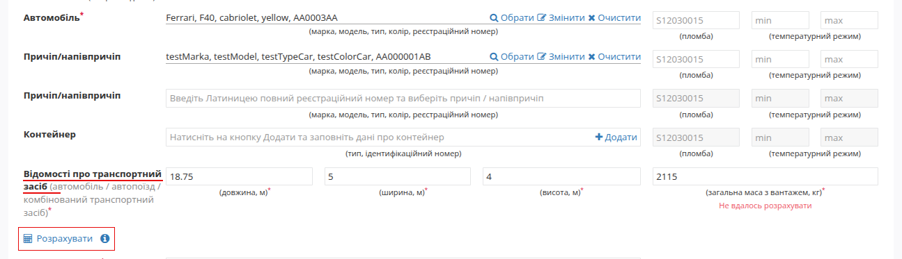

###################################################################################################
Розрахунок поля "Відомості про транспортний засіб" 
###################################################################################################

Для автоматичного розрахунку: 
  * додайте всі транспортні засоби до ТТН;
  * за необхідністю відкорегуйте табличну область (товари).
  Після чого натисніть кнопку **"Розрахувати"**.

.. attention::
   * розрахунок здійснюється на основі вже доданих транспортних засобів і товару;
   * поля, які були заповнені вручну або підтягнуті з документа-підстави, не перезаписуються під час автоматичного розрахунку.

**Як працює автоматичний розрахунок?**

**Довжина**
Встановлюється максимально допустиме значення відповідно до кількості транспортних одиниць згідно з ПДР (`пункт 22.5 <https://zakon.rada.gov.ua/laws/show/1306-2001-%D0%BF#Text>`__):
    * 1 ТЗ - 12м
    * 2 ТЗ (авто + причіп) - 18,75м
    * 3 і більше ТЗ - 22м

**Ширина**
    * якщо у всіх ТЗ вказана ширина - використовується максимальна з них;
    * якщо хоча б в одного немає ширини - автоматично підставляється 2,6м (максимально допустиме значення з ПДР)

**Висота**
    * якщо у всіх ТЗ вказана висота - використовується максимальна з них; 
    * якщо хоча б в одного немає висоти - автоматично підставляється 4 м (максимально допустиме значення згідно з ПДР).

**Маса**
    * якщо у всіх ТЗ вказана маса - обчислюється за формулою: Загальна маса з вантажем = сума мас усіх ТЗ + маса вантажу (з табличної частини документа).

**Коли значення не вдається розрахувати:**
   * Якщо за шириною, висотою або масою - не знайдено значень у довіднику, та було підставлено максимально допустиме значення, то під відповідним полем з'являється червоний текст: **"Не вдалось розрахувати"**.

❗ Для маси розрахунок буде неможливим, якщо маса не вказана у ТЗ, або відсутня таблична частина з товарами.

