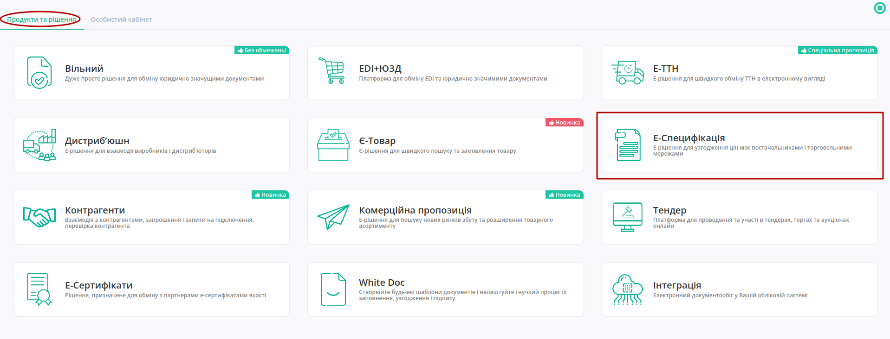
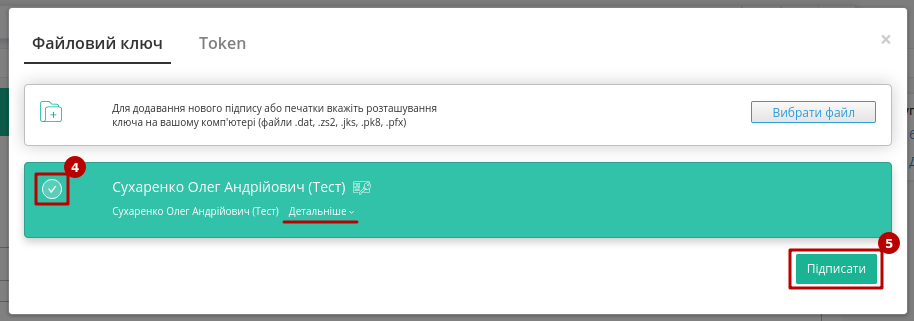

Новий інтерфейс! Узгодження цін на web-платформі Е-СПЕЦИФІКАЦІЯ. Інструкція для роздрібної мережі
#####################################################################################################

.. сюда закину немного картинок для текста

.. УВАГА ПРИСУТНІ ЗОБРАЖЕННЯ З ПОСТАЧАЛЬНИКА

.. |drop_pass| image:: signing/drop_pass.png

.. |del_key| image:: signing/del_key2.png

.. |важливий| image:: pics_E_Spec_Іnstruction_postachalnik/E_Spec_Іnstruction_postachalnik_25.png

.. role:: red

.. role:: green

.. role:: blue

.. role:: underline

---------

.. contents:: Зміст:
   :depth: 3

---------

Вступ
==========================================

**Е-СПЕЦИФІКАЦІЯ** - рішення для швидкого узгодження цін між постачальниками і торговими мережами.
Інструкція описує порядок узгодження ціни і підписання документа на стороні Мережі на веб-платформі EDIN. Функціонал сервісу не передбачає введення нових товарних позицій!

1 Робота в Е-СПЕЦИФІКАЦІЯ
===============================================================

В залежності від ролі користувача (**Покупець** (роздрібна мережа) чи **Постачальник**) функціонал сервісу відрізняється.

Алгоритм взаємодії контрагентів:

1. **Покупець** (роздрібна мережа) зі своєї облікової системи вивантажує на FTP актуальний (на даний момент) товарний довідник (контракт, специфікацію) в форматі XML (PRODUCTLIST.XML).
2. **Постачальник** на підставі специфікації (узгодженого товарного довідника) формує пропозицію щодо зміни цін і направляє його в торгівельну **Мережу**.
3. **Покупець** (торгова мережа) проводить узгодження даної пропозиції. У разі успішного вирішення **Покупець** (мережа) підписує зі свого боку комерційний документ і направляє його **Постачальнику**.
4. **Постачальник** зі свого боку підписує комерційний документ ("Товарна специфікація" (`COMDOC_008 <https://wiki.edin.ua/uk/latest/XML/XML-structure.html#comdoc-008>`__)) і відправляє **Покупцю** (мережі).
5. Після отримання підписаного з обох сторін комерційного документа, на FTP торгової **Мережі** викладається новий узгоджений `PRODUCTLIST <https://wiki.edin.ua/uk/latest/XML/XML-structure.html#productlist>`__.XML, на підставі якого оновлюються дані в обліковій системі, а також документ з підписами (comdoc_008.p7s). Після цих змін **Покупець** (мережа) повторно вивантажує вже оновлений товарний довідник (контракт, специфікацію) на FTP. 

.. note:: У разі будь-яких змін даних, погоджених не через систему EDI, PRODUCTLIST.XML вивантажується повторно. 

2 Функціонал сервісу
===============================================================

Для початку роботи з сервісом необхідно виконати вхід в систему за допомогою наданих логіна і пароля. Далі серед доступних сервісів обрати **Е-СПЕЦИФІКАЦІЯ**:

Основне вікно сервісу **Е-СПЕЦИФІКАЦІЯ** містить:

1. Розділ для роботи з документами (узгодження цін, комерційні пропозиції);
2. Розділ для роботи з довідниками (специфікації, контракти, робота з акційними пропозиціями);
3. Журнал документів;
4. Рядок пошуку документів за різними критеріями (детальніше в розділі "`Пошук <https://wiki.edin.ua/uk/latest/E_SPEC/EDIN_2_0/Instructions_2_0/E_Spec_Instruction_merezha.html#search>`__");
5. Меню вибору GLN організації, від імені якої буде відбуватись взаємодія з контрагентами;
6. Історія системних повідомлень впродовж користувацької сесії;
7. Перехід в меню сервісів;
8. Вибір мови інтерфейсу;
9. `Особистий кабінет <https://wiki.edin.ua/uk/latest/Personal_Cabinet/PCInstruction.html>`__, `налаштування користувача <https://wiki.edin.ua/uk/latest/general_2_0/rabota_s_platformoj_EDIN_2.0.html#pers-settings>`__ та вихід з платформи. 

3 Актуальні специфікації
===============================================================

Після того як по FTP буде вивантажено товарний довідник (контракт, специфікацію) у розділі **ДОВІДНИКИ** у вкладці **Специфікація** відобразиться перелік **Постачальників** та діючих специфікацій з ними. Усі специфікації зручно згруповані по назві **Постачальника**. Потрібно обрати **Постачальника** та **"Перейти"** в одну з актуальних специфікацій:

Після переходу відкривається детальна форма довідника з пропозиціями. Можливо відфільтрувати позиції за назвою, штрих-кодом чи артикулом та **"Скачати специфікацію"**:

4 Робота з документами 
========================

Для зручної роботи розділ **"ДОКУМЕНТИ"** має 3 вкладки для роботи з узгодженнями:

.. image:: pics_E_Spec_Instruction_merezha/E_Spec_Instruction_merezha_16.png
   :align: center

* **Узгодження цін** - містить весь список Товарних узгодженнь, тобто створених документів-пропозицій щодо зміни цін.
* **Важливі** - містить документи, що були відмічені користувачем, як важливі (іконка зірочки |неважливий|->|важливий|).
* **Оброблені** - містить документи, що були переміщені користувачем (кнопки "Перемістити в оброблені"/"Відновити з оброблених")

В журналі документів міститься коротка інформація про документ та його стан (номер/дату документу, його статус, тип, кількість позицій (відхилених/всього) в документі). Перехід до документу здійснюється кліком по номеру документа.

Статуси документів:

1. *На погодженні* - отримано мережею, у такому статусі відображаєтьмя для Постачальника під час процесу узгодження з боку мережі
2. *Підготовлено* - статус для мережі
3. *Підтверджений* - статус для мережі
4. *Перевірений* - статус для мережі
5. *Узгоджений* - статус для мережі
6. *Готовий до підписання* - статус для мережі
7. *Підписання постачальником* - після обробки мережею
8. *Завершено* - отримано всі необхідні підписи (Мережі та Постачальника)
9. *Відхилено*

.. important::
    При наявності в бізнес процесі додаткових департаментів (керівник відділу закупівлі, служба безпеки, економічна безпека, фінансовий аналітик, логістика) статуси та етапи можуть змінюватися. Зверніться до вашого менеджера АТС або до Служби підтримки за налаштуваннями.

.. hint::
   Додатково для зручності в журналі документів можливо робити відмітки (іконки). Системними відмітками також позначаються документи, до яких додано коментар (|чат|) чи обгрунтування (|скріпка|):

   .. image:: pics_E_Spec_Іnstruction_postachalnik/E_Spec_Іnstruction_postachalnik_55.png
      :align: center

.. note::
    Процес узгодження проходить кілька етапів. Кількість етапів узгодження залежить від налаштуваннь мережі, тобто кожне узгодження унікальне. Кількість етапів варіюється від двох до п'яти. Для налаштування етапів зверніться до свого менеджера АТС або у Службу підтримки.

4.1 Обробка товарного узгодження категорійним менеджером (1-ий етап)
----------------------------------------------------------------------------

Нові узгодження, відправлені **Постачальником**, знаходяться у статусі **"На погодженні"**. При переході в документ (через номер документа) відкривається форма документа-пропозиції:

1. Функціонал для роботи з усім документом одразу.

   * Прийняти - документ буде прийнято разом з усіма позиціями
   * Відхилити - відхилення документа (завершення процес узгодження)
2. Інформацію про документ-ропозицію на зміну ціни, її опис (номер специфікації, що оновлюється; дати дії нової ціни; статус)
3. Контрагенти - інфо по партнеру, що надіслав документ, також тут відображаються іконки візуалізації підписів з боку мережі і постачальника (при наявності)
4. Таблична частина з товарними позиціями та інфо по них, можливістю прийняти / відхилити кожною окрему позицію та всі разом
5. Блок `коментарів <https://wiki.edin.ua/uk/latest/E_SPEC/EDIN_2_0/Instructions_2_0/E_Spec_Instruction_merezha.html#comment>`__
6. Історія всіх збережених змін в документі

У документі на зміну регулярної / промо ціни Вам необхідно перевірити ціни в кожній з позицій і вказати статус - "Прийнято" / "Відхилено", по необхідності змінити період для нової ціни після чого змінится загальний статус документа на - **Узгодженно** (або на той статус який закріплено за данним погоджувачем).

.. note:: Якщо позиція не була "прийнята" / "відхилена", то при переході на наступний етап - вона автоматично буде прийнята.

Якщо ви не маєте можливість змінити статус пропозицій, це означає що за налаштуваннями узгодження у вас немає прав на прийняття/відхилення пропозиції у данному статусі.

На будь-якому етапі можливо відхилити документ, й він відразу змінить статус на **Відхилено**.

.. note::
    **Постачальник** може сформувати пропозиції на зміну *регулярної ціни зі знижкою*, в залежності від індивідуальних налаштувань мережі. У такому випадку таблична частина з позиціями буде розширена додатковими стовбцями з можливістю вказати ціну зі знижкою. У таких пропозиціях мережа може знінювати поле "**Кількість**". 

4.2 Обробка Товарного узгодження Керівником відділу (2-ий етап) 
-------------------------------------------------------------------

Документ Товарне узгодження, узгоджений Категорійним менеджером на першому етапі, надходить на наступний зі статусом **Узгодженно** (статус пропозиції що розглядається, може відрізнятися, бо залежить від індивідуальних налаштувань етапів мережі).

У формі документа Вам необхідно перевірити ціни в кожній з позицій, вказати статус - "Прийнято" / "Відхилено".

Після зміни статусу позицій для продовження узгодження потрібно "Прийняти" документ (система попереджає про невідхильність такої дії):

Після підтвердження документ змінює статус на «**Готовий до підписання**» й відправляється на наступний етап - **"Підписання"**.

4.3 Обробка і підписання Товарного узгодження Комерційним директором (3-ій етап)
------------------------------------------------------------------------------------

.. note::
    Підписати документ можливо лише у статусі **"Готовий до підписання"**!

Документ Товарне узгодження, узгоджений Керівником відділу надходить зі статусом **Готовий до підписання**.

У формі документа Вам необхідно перевірити ціни в кожній з позицій, вказати статус - "Прийнято" / "Відхилено", потім змінити загальний статус документа - "Погоджено" / "Відхилено". Після зміни статусу натисніть кнопку **Підписати**.

Після ініціалізації бібліотеки підписання, система надасть можливість додати ключ для підписання. При :underline:`першому` підписанні у модальному вікні потрібно обрати файл чи токен (1), ввести пароль (2) та натиснути **"Считати"** (3) ключ для підписання:

.. image:: signing/file1n.png
   :align: center

.. image:: signing/file2n.png
   :align: center

При успішному додаванні ключа автоматично відобразиться особа, від імені якої буде здійснено підписання. У користувача може бути додано кілька ключів - для вибору потрібного для здійснення операції підписання потрібно проставити відмітку (4) лівою кнопкою миші і натиснути "Підписати" (5):

.. important::
   Якщо підписання цим ключем вже було здійснено або знайдена невідповідність даних ЄДРПОУ/ІПН (перевірка), то підписання блокується, а користувачу виводиться відповідне повідомлення:

.. image:: signing/wrong_key.png
   :align: center

Додатково в вікні підписання можливо натиснути **"Детальніше"** для того, щоб переглянути інформацію про підписанта, обрати за необхідності посаду, скинути пароль активного ключа (|drop_pass|) чи видалити помилкові (|del_key|).

При подальшій роботі з раніше доданим ключем/-ами потрібно вводити лише пароль для обраного ключа:

.. image:: signing/file4n.png
   :align: center

Після підписання узгодження інформація щодо підписанта відображається в блоці "Контрагенти". 

Після успішного підписання, натисніть кнопку **Надіслати**. 
Після підписання й відправки статус докумена міняється на **Підписання постачальником** й відображається один підпис - від мережі:

Вже після підписання **Постачальником**, статус узгодження зміниться на **Завершено** та з'явиться ще один підпис у блоці Контрагенти. Тепер обидві візуалізації ЕЦП зеленого кольору:

.. _promotion:

5 Акції 
========================

.. початок блоку для Promotions

Розділ **"Акції"** доступний в "ДОВІДНИКАХ" на стороні **Покупця** (мережі) та **Постачальника**. Представник мережі може редагувати (додавати/змінювати/видаляти позиції) основну таблицю розділу, а **Постачальнику** доступно лише переглядати інформацію по акціям.

Список акцій можливо редагувати вручну чи шляхом вивантаження xls-файлу (кнопка **"Завантажити акції з Excel"** (2)) - для цього попередньо потрібно **"Завантажити шаблон Excel"** (1).

.. кінець блоку для Promotions

6 Комерційні пропозиції 
========================

.. початок блоку для Commercial_offers

Розділ **"Комерційні пропозиції"** доступний на стороні **Покупця** (мережі) та **Постачальника**. Якщо у **Покупця** (мережі) налаштовані повідомлення на ел. пошту, то він буде проінформований про новинки, навіть не заходячи до сервісу:

.. image:: pics_E_Spec_Instruction_merezha/E_Spec_Instruction_merezha_19.png
   :align: center

При переході в **"Комерційні пропозиції"** відкривається журнал з пропозиціями. **Постачальники** відправляють позиції на узгодження, а представник Мережі проводить їх узгодження: із загального списку обирає позиції в статусі "Узгодження" та прийняти рішення (масово **"Відхилити"** чи **"Прийняти"**) по обраним позиціям:

.. image:: pics_E_Spec_Instruction_merezha/E_Spec_Instruction_merezha_18.png
   :align: center

.. image:: pics_E_Spec_Instruction_merezha/E_Spec_Instruction_merezha_13.png
   :align: center

Також можливо детальніше ознайомитись з пропозицією (перехід через її найменування) і одразу **"Прийняти"** чи **"Відхилити"** ту позицію:

Після прийняття рішення статус позиції автоматично оновлюється в таблиці розділу :blue:`"Узгодження"` -> :green:`"Прийнято"` чи :red:`"Відхилено"` відповідно.

.. hint::
   Користувачі можуть отримувати повідомлення на ел. пошту про зміну статуса відправленої новинки. Для налаштувань такої опції потрібно звертутись до співробітників компанії-провайдера.

.. кінець блоку для Commercial_offers

7 Додатковий функціонал
========================

.. _search:

Пошук
---------------------

Рядок пошуку допомагає відфільтрувати документи в журналі, а всі доступні ключі пошуку детально описані в підказці:

Можливо обрати ключ зі списку чи вводити ключ з клавіатури (при фільтруванні кількома ключами одночасно елементи пошуку повині бути розділені комою з пробілом). Після цього натисніть - **"Пошук"**:

Окремо винесені фільтри документів по даті (**"Сьогодні"**, **"Вчора"**), а останній введений пошук зберігається платформою автоматично і при натисканні кнопки **"Останній фільтр"** він виконується повторно в тій вкладці ("Узгодження цін" / "Важливі" / "Оброблені"), в якій він був виконаний останнього разу (Вас буде переадресовано):

Також можливо перманентно **Зберегти** данні власного рядку пошуку, натиснувши на іконку дискети:

Вилучити збережений пошук можна за допомогою хрестика:

.. _attach:

Обгрунтування від постачальника
----------------------------------------------------------------------------------------------------------------

Лише для **Постачальника**, існує можливість додати обгрунтування зміни ціни або інші документи, які можуть прискорити погодження.

Для скачування потрібно натиснути на назву документу. Документ що містить обгрунтування позначається в журналі документів символом |скріпка|.

.. _comment:

Коментарі
----------------------------------------------------------------------------------------------------------------

Під табличною частиною з позиціями після відправки документа з'являється блок для звязку контрагентів.

Документ що містить коментар позначається в журналі документів символом |чат|.

----------------------------------

.. include:: kontakti.rst

