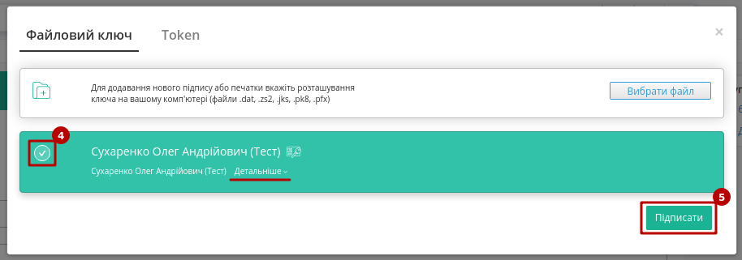
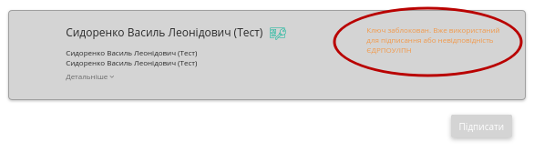

Узгодження цін на платформі Е-СПЕЦИФІКАЦІЯ. Інструкція для Постачальника
############################################################################################################

.. сюда закину немного картинок для текста

.. |drop_pass| image:: signing/drop_pass.png

.. |del_key| image:: signing/del_key2.png

.. |на_погодженні| image:: /E_SPEC/EDIN_2_0/Instructions_2_0/pics_E_Spec_Іnstruction_postachalnik/E_Spec_Іnstruction_postachalnik_21.png

.. |підписано| image:: /E_SPEC/EDIN_2_0/Instructions_2_0/pics_E_Spec_Іnstruction_postachalnik/E_Spec_Іnstruction_postachalnik_23.png

.. |завершено| image:: /E_SPEC/EDIN_2_0/Instructions_2_0/pics_E_Spec_Іnstruction_postachalnik/E_Spec_Іnstruction_postachalnik_20.png

.. |відхилено| image:: /E_SPEC/EDIN_2_0/Instructions_2_0/pics_E_Spec_Іnstruction_postachalnik/E_Spec_Іnstruction_postachalnik_22.png

.. |важливий| image:: /E_SPEC/EDIN_2_0/Instructions_2_0/pics_E_Spec_Іnstruction_postachalnik/E_Spec_Іnstruction_postachalnik_25.png

.. |неважливий| image:: /E_SPEC/EDIN_2_0/Instructions_2_0/pics_E_Spec_Іnstruction_postachalnik/E_Spec_Іnstruction_postachalnik_24.png

.. |чат| image:: /E_SPEC/EDIN_2_0/Instructions_2_0/pics_E_Spec_Іnstruction_postachalnik/E_Spec_Іnstruction_postachalnik_27.png

.. |скріпка| image:: /E_SPEC/EDIN_2_0/Instructions_2_0/pics_E_Spec_Іnstruction_postachalnik/E_Spec_Іnstruction_postachalnik_26.png

.. role:: red

.. role:: green

.. role:: blue

.. role:: orange

.. role:: underline

---------

.. contents:: Зміст:
   :depth: 3

---------

**Е-СПЕЦИФІКАЦІЯ** - рішення для швидкого узгодження цін між постачальниками і торговими мережами.
Інструкція описує порядок узгодження ціни і підписання документа на стороні Постачальника на веб-платформі EDIN. Функціонал сервісу не передбачає введення нових товарних позицій!
 
1 Робота в Е-СПЕЦИФІКАЦІЯ
===============================================================

В залежності від ролі користувача (**Покупець** (роздрібна мережа) чи **Постачальник**) функціонал сервісу відрізняється.

Алгоритм взаємодії контрагентів:

1. **Покупець** (роздрібна мережа) зі своєї облікової системи вивантажує на FTP актуальний (на даний момент) товарний довідник (контракт, специфікацію) в форматі XML (PRODUCTLIST.XML).
2. **Постачальник** на підставі специфікації (узгодженого товарного довідника) формує пропозицію щодо зміни цін і направляє його в торгівельну **Мережу**.
3. **Покупець** (торгова мережа) проводить узгодження даної пропозиції. У разі успішного вирішення **Покупець** (мережа) підписує зі свого боку комерційний документ і направляє його **Постачальнику**.
4. **Постачальник** зі свого боку підписує комерційний документ ("Товарна специфікація" (`COMDOC_008 <https://wiki.edin.ua/uk/latest/XML/XML-structure.html#comdoc-008>`__)) і відправляє **Покупцю** (мережі).
5. Після отримання підписаного з обох сторін комерційного документа, на FTP торгової **Мережі** викладається новий узгоджений `PRODUCTLIST <https://wiki.edin.ua/uk/latest/XML/XML-structure.html#productlist>`__.XML, на підставі якого оновлюються дані в обліковій системі, а також документ з підписами (comdoc_008.p7s). Після цих змін **Покупець** (мережа) повторно вивантажує вже оновлений товарний довідник (контракт, специфікацію) на FTP. 

.. note:: У разі будь-яких змін даних, погоджених не через систему EDI, PRODUCTLIST.XML вивантажується повторно. 

2 Функціонал сервісу
===============================================================

Для початку роботи з сервісом необхідно виконати вхід в систему за допомогою наданих логіна і пароля. Далі серед доступних сервісів обрати **Е-СПЕЦИФІКАЦІЯ**:

.. image:: /E_SPEC/EDIN_2_0/Instructions_2_0/pics_E_Spec_Іnstruction_postachalnik/E_Spec_Іnstruction_postachalnik_53.png
   :align: center

Основне вікно сервісу **Е-СПЕЦИФІКАЦІЯ** містить:

.. image:: /E_SPEC/EDIN_2_0/Instructions_2_0/pics_E_Spec_Іnstruction_postachalnik/E_Spec_Іnstruction_postachalnik_54.png
   :align: center

1. Розділ для роботи з документами (узгодження цін, комерційні пропозиції);
2. Розділ для роботи з довідниками (специфікації, контракти, робота з акційними пропозиціями);
3. Журнал документів;
4. Рядок пошуку документів за різними критеріями (детальніше в розділі "`Пошук <https://wiki.edin.ua/uk/latest/E_SPEC/EDIN_2_0/Instructions_2_0/E_Spec_Іnstruction_postachalnik.html#search>`__");
5. Меню вибору GLN організації, від імені якої буде відбуватись взаємодія з контрагентами;
6. Історія системних повідомлень впродовж користувацької сесії;
7. Перехід в меню сервісів;
8. Вибір мови інтерфейсу;
9. `Особистий кабінет <https://wiki.edin.ua/uk/latest/Personal_Cabinet/PCInstruction.html>`__, `налаштування користувача <https://wiki.edin.ua/uk/latest/general_2_0/rabota_s_platformoj_EDIN_2.0.html#pers-settings>`__ та вихід з платформи. 

3 Товарне узгодження
===============================================================

Після того як **Покупець** (мережа) вивантажить актуальний товарний довідник (контракт, специфікацію) у **Постачальника** в сервісі **Е-СПЕЦИФІКАЦІЯ** у розділі **ДОВІДНИКИ** у вкладці **Специфікація** відобразиться перелік мереж та діючих специфікацій з мережею. 

.. hint::
   Для відображення прострочених контрактів потрібно скористатись пошуковим фільтром ``#Завершені контракти,``.

Усі специфікації зручно згруповані по назві мережі. Потрібно обрати мережу та **"Перейти"** в одну з актуальних специфікацій:

.. image:: /E_SPEC/EDIN_2_0/Instructions_2_0/pics_E_Spec_Іnstruction_postachalnik/E_Spec_Іnstruction_postachalnik_03.png
   :align: center

Після переходу відкривається детальна форма довідника з пропозиціями та можливими діями з ними:

.. image:: /E_SPEC/EDIN_2_0/Instructions_2_0/pics_E_Spec_Іnstruction_postachalnik/E_Spec_Іnstruction_postachalnik_04.png
   :align: center

Товарні позиції в специфікації відображаються в алфавітному порядку. Для швидкого пошуку можливо відфільтрувати позиції за назвою, штрих-кодом чи артикулом:

.. image:: /E_SPEC/EDIN_2_0/Instructions_2_0/pics_E_Spec_Іnstruction_postachalnik/E_Spec_Іnstruction_postachalnik_05.png
   :align: center

3.1 Створення Пропозиції 
-----------------------------------------------------------

Створити пропозицію (документ **"Товарне узгодження"** `AGREEM <https://wiki.edin.ua/uk/latest/XML/XML-structure.html#agreem>`__) можливо:

1. Шляхом вивантаження xls-файлу (згідно шаблону) "Для регулярної ціни" та "Для промо ціни - "Зниження ціни""
2. Шляхом формування "Переузгодження" на всі/окремі товарні позиції в специфікації.

.. image:: /E_SPEC/EDIN_2_0/Instructions_2_0/pics_E_Spec_Іnstruction_postachalnik/E_Spec_Іnstruction_postachalnik_06.png
   :align: center

3.1.1 Формування пропозиції з xls-файлу
~~~~~~~~~~~~~~~~~~~~~~~~~~~~~~~~~~~~~~~~~~~~~~~~~~~~~~~~

Постачальник може **"Завантажити шаблон"** (2) (в форматі xls), попередньо скориставшись при заповненні файлу відповідним шаблоном (1). Для зручної роботи з представленими позиціями можливо "Скачати специфікацію" **Мережі**.

.. attention::
    **"Для регулярної ціни"** та **"Для промо ціни - "Зниження ціни""** використовуються різні шаблони, про що також потрібно зважати й при завантаженні файлу на платформу!

    .. image:: /E_SPEC/EDIN_2_0/Instructions_2_0/pics_E_Spec_Іnstruction_postachalnik/E_Spec_Іnstruction_postachalnik_07.png
       :align: center

Після завантаження заповненої xls-форми на WEB-платформу формується і відображається пропозиція (в статусі "Чернетка"), наприклад: 

.. image:: /E_SPEC/EDIN_2_0/Instructions_2_0/pics_E_Spec_Іnstruction_postachalnik/E_Spec_Іnstruction_postachalnik_08.png
   :align: center

3.1.2 Формування пропозиції через "Переузгодження"
~~~~~~~~~~~~~~~~~~~~~~~~~~~~~~~~~~~~~~~~~~~~~~~~~~~~~~~~

Процес Переузгодження (кнопка **"Переузгодити"**) обраних товарних позицій можливо здійснити тільки на WEB-платформі для різних типів Пропозицій:

* **Зміна регулярної ціни**
* **Зміна промо ціни - "Зниження ціни"**
* **Зміна промо ціни - "Компенсація"**
* **Зміна промо ціни - "Комбо" ("Зниження ціни" + "Компенсація")**

Під час "Переузгодження" обраних товарних позицій створюється документ **"Товарне узгодження"** (`AGREEM <https://wiki.edin.ua/uk/latest/XML/XML-structure.html#agreem>`__).

.. image:: /E_SPEC/EDIN_2_0/Instructions_2_0/pics_E_Spec_Іnstruction_postachalnik/E_Spec_Іnstruction_postachalnik_09.png
   :align: center

.. note:: Відображення табличної частини з позиціями залежить від налаштувань Мережі та обраного типу пропозиції! 

3.2 Товарне переузгодження: Зміна регулярної ціни та ціни зі знижкою
---------------------------------------------------------------------------------------------

Для створення товарного узгодження необхідно в розділі **ДОВІДНИКИ** у вкладці **Специфікація** обрати мережу, **"Перейти"** в одну з актуальних специфікацій. У формі що відкрилась вибрати позиції для переузгодження і натиснути кнопку **Переузгодити** -> **"Змінити регулярну ціну"** (також для ціни зі знижкою).

.. image:: /E_SPEC/EDIN_2_0/Instructions_2_0/pics_E_Spec_Іnstruction_postachalnik/E_Spec_Іnstruction_postachalnik_10.png
   :align: center

У новому вікні відкриється форма створеної пропозиції. Відображається номер/дата документа, його статус (Чернетка), дати дії нової ціни, дані контрагентів та таблична частину з позиціями на переузгодження:

.. image:: /E_SPEC/EDIN_2_0/Instructions_2_0/pics_E_Spec_Іnstruction_postachalnik/E_Spec_Іnstruction_postachalnik_11.png
   :align: center

В табличній частині можливо встановити нові ціни: **"Нову ціну без ПДВ"** та **"Нову ціну зі знижкою без ПДВ"** (за умовами договору з **Мережею**). 

.. _add-and-rules:

В Пропозиціях-Чернетках на етапі редагування можливо **"Додати/Вилучити товарну позицію"** (для вилучення потрібно обрати позицію чекером). При додаванні відкриється вікно з товарними позиціями, що належать до раніше обраної специфікації, але не були додані в пропозицію-чернетку (доступний пошук по назві, штрих-коду або артикулу):

.. image:: /E_SPEC/EDIN_2_0/Instructions_2_0/pics_E_Spec_Іnstruction_postachalnik/E_Spec_Іnstruction_postachalnik_12.png
   :align: center

.. note::
   В документі потрібно обрати Дату початку дії і Дату закінчення дії нової ціни!

   * Дата початку дії нової ціни не може бути більше дати закінчення дії нової ціни.
   * Дата початку дії нової ціни повинна враховувати кількість днів на розгляд пропозиції, тобто, не може бути менше ніж дата створення документу "Товарне узгодження" + N днів на розгляд та прийняття пропозиції мережею, а також не може бути пізніше ніж дата закінчення терміну дії. Мінімальна кількість днів на розгляд  - 3 дні.
   * Дата закінчення терміну дії не може бути більше, ніж дата закінчення дії специфікації.

.. important::
   **Покупець** (мережа) має право змінити запропоновані/зазначені **Постачальником** дати перед підписанням документа.

Після корректного заповнення документа його можливо **"Зберегти"** та **"Надіслати"**:

.. image:: /E_SPEC/EDIN_2_0/Instructions_2_0/pics_E_Spec_Іnstruction_postachalnik/E_Spec_Іnstruction_postachalnik_13.png
   :align: center

.. attention::
   За відправки Пропозиції-чернетки виконується перевірка наявності контракту та товарних позицій в мережі. За їх відстуності виводиться відповідне повідомлення про помилку: "Контракт був видалений торговельною мережею. Зв'яжіться, будь ласка, з представником торгової мережі." чи "Виділені товарні позиції не були знайдені в контракті. Зв'яжіться, будь ласка, з представником торгової мережі."

Після відправки документа його статус зміниться на **На узгодженні**, та з'явиться можливість лишити `комментар <https://wiki.edin.ua/uk/latest/E_SPEC/EDIN_2_0/Instructions_2_0/E_Spec_Іnstruction_postachalnik.html#comment>`__ для мережі, наприклад, для певних уточнень.

.. important::
   Під час формування документа або після його відправки (в статусі документа-узгодження **Чернетка** або **На узгодженні**) **Постачальник** може додати вкладення в якості `"Обгрунтування" <https://wiki.edin.ua/uk/latest/E_SPEC/EDIN_2_0/Instructions_2_0/E_Spec_Іnstruction_postachalnik.html#attach>`__.

------------------------------------------------------------------------------------------

.. note::
   Можливе формування пропозиції на зміну регулярної ціни зі знижкою, в залежності від налаштувань мережі. У такому випадку таблична частина з позиціями буде розширена додатковими стовбцями з можливістю вказати ціну зі знижкою. У таких пропозиціях мережа може знінювати поле **кількість**!

.. attention::
   Промо ціна змінюється тільки в окремому документі "Товарне узгодження для промо ціни". "Ціна зі знижкою" - це НЕ те саме, що "промо"!

3.3 Товарне переузгодження: Зміна промо ціни - "Зниження ціни"
---------------------------------------------------------------------------------------------

Для створення товарного узгодження необхідно в розділі **ДОВІДНИКИ** у вкладці **Специфікація** обрати мережу, **"Перейти"** в одну з актуальних специфікацій. У формі що відкрилась вибрати позиції для переузгодження і натиснути кнопку **Переузгодити** -> **"Змінити промо ціну - "Зниження ціни""**:

.. image:: /E_SPEC/EDIN_2_0/Instructions_2_0/pics_E_Spec_Іnstruction_postachalnik/E_Spec_Іnstruction_postachalnik_14.png
   :align: center

У новому вікні відкриється форма створеної пропозиції. Відображається номер/дата документа, його статус (Чернетка), дати дії нової ціни, дані контрагентів та таблична частину з позиціями на переузгодження. Додатково можливо надати дані відповідального співробітника постачальника, номер та дату маркетингового договору:

.. image:: /E_SPEC/EDIN_2_0/Instructions_2_0/pics_E_Spec_Іnstruction_postachalnik/E_Spec_Іnstruction_postachalnik_15.png
   :align: center

Для всіх "промо-пропозицій" можливо обрати `Акції <https://wiki.edin.ua/uk/latest/E_SPEC/EDIN_2_0/Instructions_2_0/E_Spec_Іnstruction_postachalnik.html#promotion>`__, якщо вони були додані мережею і їх дати не конфліктують з датами створюваного документа-пропозиції на підставі договору з цією мережею.

В табличній частині можливо встановити: **"Нову промо ціну без ПДВ"**, **"Кількість промо"**, **"Суму за активацію акції"** та **"Рекомендовану роздрібну ціну з ПДВ"** (за умовами договору з **Мережею**).

Функціонал **"Додати/Вилучити позицію"** та встановлені правила заповнення "Дат дії нової ціни" перед "Надсиланням" документа описані в розділі 3.2 (`пряме посилання <https://wiki.edin.ua/uk/latest/E_SPEC/EDIN_2_0/Instructions_2_0/E_Spec_Іnstruction_postachalnik.html#add-and-rules>`__).

3.4 Товарне переузгодження: Зміна промо ціни - "Компенсація"
---------------------------------------------------------------------------------------------

Формування пропозицій на компенсацію продажів під конкретну акцію дозволяє збільшити кількість товару в обігу. 

Для створення товарного узгодження необхідно в розділі **ДОВІДНИКИ** у вкладці **Специфікація** обрати мережу, **"Перейти"** в одну з актуальних специфікацій. У формі що відкрилась вибрати позиції для переузгодження і натиснути кнопку **Переузгодити** -> **"Змінити промо ціну - "Компенсація""**: 

.. image:: /E_SPEC/EDIN_2_0/Instructions_2_0/pics_E_Spec_Іnstruction_postachalnik/E_Spec_Іnstruction_postachalnik_16.png
   :align: center

У новому вікні відкриється форма створеної пропозиції. Відображається номер/дата документа, його статус (Чернетка), дати дії нової ціни, дані контрагентів та таблична частину з позиціями на переузгодження. Додатково можливо надати дані відповідального співробітника постачальника, номер та дату маркетингового договору:

.. image:: /E_SPEC/EDIN_2_0/Instructions_2_0/pics_E_Spec_Іnstruction_postachalnik/E_Spec_Іnstruction_postachalnik_17.png
   :align: center

Для всіх "промо-пропозицій" можливо обрати `Акції <https://wiki.edin.ua/uk/latest/E_SPEC/EDIN_2_0/Instructions_2_0/E_Spec_Іnstruction_postachalnik.html#promotion>`__, якщо вони були додані мережею і їх дати не конфліктують з датами створюваної Пропозиції на підставі договору з цією мережею. Додатково можливо обрати "Оплату за компенсацію".

В табличній частині можливо встановити: **"Кількість промо"** (повинно бути >0), **"% компенсації"**, **"Суму за активацію акції"** та **"Рекомендовану роздрібну ціну з ПДВ"** (за умовами договору з **Мережею**).

Функціонал **"Додати/Вилучити позицію"** та встановлені правила заповнення "Дат дії нової ціни" перед "Надсиланням" документа описані в розділі 3.2 (`пряме посилання <https://wiki.edin.ua/uk/latest/E_SPEC/EDIN_2_0/Instructions_2_0/E_Spec_Іnstruction_postachalnik.html#add-and-rules>`__).

3.5 Товарне переузгодження: Зміна промо ціни - "Комбо" ("Зниження ціни" + "Компенсація")
----------------------------------------------------------------------------------------------------------------

Формування пропозицій на зниження закупочної ціни і компенсацію продажів під конкретну акцію дозволяє збільшити кількість товару в обігу. 

Для створення товарного узгодження необхідно в розділі **ДОВІДНИКИ** у вкладці **Специфікація** обрати мережу, **"Перейти"** в одну з актуальних специфікацій. У формі що відкрилась вибрати позиції для переузгодження і натиснути кнопку **Переузгодити** -> **"Змінити промо ціну - "Комбо""**: 

.. image:: /E_SPEC/EDIN_2_0/Instructions_2_0/pics_E_Spec_Іnstruction_postachalnik/E_Spec_Іnstruction_postachalnik_18.png
   :align: center

У новому вікні відкриється форма створеної пропозиції. Відображається номер/дата документа, його статус (Чернетка), дати дії нової ціни, дані контрагентів та таблична частину з позиціями на переузгодження. Додатково можливо надати дані відповідального співробітника постачальника, номер та дату маркетингового договору:

.. image:: /E_SPEC/EDIN_2_0/Instructions_2_0/pics_E_Spec_Іnstruction_postachalnik/E_Spec_Іnstruction_postachalnik_19.png
   :align: center

Для всіх "промо-пропозицій" можливо обрати `Акції <https://wiki.edin.ua/uk/latest/E_SPEC/EDIN_2_0/Instructions_2_0/E_Spec_Іnstruction_postachalnik.html#promotion>`__, якщо вони були додані мережею і їх дати не конфліктують з датами створюваної Пропозиції на підставі договору з цією мережею. Додатково можливо обрати "Оплату за компенсацію".

В табличній частині можливо встановити: **"Нову промо ціну без ПДВ"**, **"Кількість промо"** (повинно бути >0), **"% компенсації"**, **"Суму за активацію акції"** та **"Рекомендовану роздрібну ціну з ПДВ"** (за умовами договору з **Мережею**).

Функціонал **"Додати/Вилучити позицію"** та встановлені правила заповнення "Дат дії нової ціни" перед "Надсиланням" документа описані в розділі 3.2 (`пряме посилання <https://wiki.edin.ua/uk/latest/E_SPEC/EDIN_2_0/Instructions_2_0/E_Spec_Іnstruction_postachalnik.html#add-and-rules>`__).

.. _agreem-clone:

3.6 Клонування товарного узгодження
----------------------------------------------------------------------------------------------------------------

На стороні почтачальника реалізована можливість клонування відправленого товарного узгодження усіх типів (кнопка **"Клонування"**):

.. image:: /E_SPEC/EDIN_2_0/Instructions_2_0/pics_E_Spec_Іnstruction_postachalnik/E_Spec_Іnstruction_postachalnik_64.png
   :align: center

.. attention::
   Клонування можливе за **наявності специфікації** між Постачальником і Мережею, **дати початку та закінчення дії нової ціни є коректними** та за умови, що Мережа працює з даним типом товарного узгодження (промо ціна/компенсація/комбо). Інакше система вкаже в повідомленні причину неможливості клонування в Вашому випадку.

4 Робота з документами 
========================

Для зручної роботи розділ **"ДОКУМЕНТИ"** має 3 вкладки для роботи з узгодженнями:

.. image:: /E_SPEC/EDIN_2_0/Instructions_2_0/pics_E_Spec_Іnstruction_postachalnik/E_Spec_Іnstruction_postachalnik_56.png
   :align: center

* **Узгодження цін** - містить весь список Товарних узгодженнь, тобто створених документів-пропозицій щодо зміни цін.
* **Важливі** - містить документи, що були відмічені користувачем, як важливі (іконка зірочки |неважливий|->|важливий|).
* **Оброблені** - містить документи, що були переміщені користувачем (кнопки "Перемістити в оброблені"/"Відновити з оброблених")

В журналі документів міститься коротка інформація про документ та його стан (номер/дату документу, його статус, тип, кількість позицій (відхилених/всього) в документі). Перехід до документу здійснюється кліком по номеру документа. Поле "Дедлайн підписання" (заповнюється з `COMDOC_008 <https://wiki.edin.ua/uk/latest/E_SPEC/EDIN_2_0/XML/XML_structure.html#comdoc-008>`__ <ТермінПідпису>/<Кінець>) відображається:

* :red:`червоним кольором`, якщо "дата дедлайна підписання" - "поточна дата" <= 2 дні
* :orange:`помаранчевим кольором`, якщо "дата дедлайна підписання" - "поточна дата" > 2 днів

Статуси документів:

* |на_погодженні| - відправлений **Покупцю** (в мережу) документ
* |підписано| - документ підписаний **Покупцем** (мережею)
* |завершено| - документ підписаний обома сторонами (**Покупцем** і **Постачальником**)
* |відхилено| - документ відхилено **Покупцем** (мережею)

.. hint::
   Додатково для зручності в журналі документів можливо робити відмітки (іконки). Системними відмітками також позначаються документи, до яких додано коментар (|чат|) чи обгрунтування (|скріпка|):

   .. image:: /E_SPEC/EDIN_2_0/Instructions_2_0/pics_E_Spec_Іnstruction_postachalnik/E_Spec_Іnstruction_postachalnik_55.png
      :align: center

4.1 Перегляд і обробка вхідного документа від **Покупця** (мережі) 
----------------------------------------------------------------------------------------------------------------

Поки узгодження опрацьовується **Покупцем**, він знаходиться у статусі **На погодженні**. Після обробки **Покупцем**, за затвердженими позиціями **Постачальник** отримує документ, підписаний з боку **Покупця** у статусі **Підписання постачальником**. Перед відкриттям **Постачальник** вже може переглянути загальну кількість прийнятих та відхилених позицій. У відкритому вхідному документі (перехід по номеру документа) відображається, які саме позиції були прийняті, а які відхилені (доступний зручний фільтр по статусу позицій), при кліку по кнопці **"Підписано"** можливо переглянути деталі підпису контрагента:

.. image:: /E_SPEC/EDIN_2_0/Instructions_2_0/pics_E_Spec_Іnstruction_postachalnik/E_Spec_Іnstruction_postachalnik_30.png
   :align: center

.. image:: /E_SPEC/EDIN_2_0/Instructions_2_0/pics_E_Spec_Іnstruction_postachalnik/E_Spec_Іnstruction_postachalnik_31.png
   :align: center

Користувач може роздрукувати (кнопка **"Друк"**) чи завантажити документ **"Товарне узгодження"** (`AGREEM <https://wiki.edin.ua/uk/latest/XML/XML-structure.html#agreem>`__) (XLS), підписаний документ **"Товарна специфікація"** (`COMDOC_008 <https://wiki.edin.ua/uk/latest/XML/XML-structure.html#comdoc-008>`__) (P7S), друкований макет підписаного документа COMDOC_008 з візуалізацією підписів (PDF).

Для продовження узгодження потрібно **"Підписати"** документ:

.. image:: /E_SPEC/EDIN_2_0/Instructions_2_0/pics_E_Spec_Іnstruction_postachalnik/E_Spec_Іnstruction_postachalnik_32.png
   :align: center

Після ініціалізації бібліотеки підписання, система надасть можливість додати ключ для підписання. При :underline:`першому` підписанні у модальному вікні потрібно обрати файл чи токен (1), ввести пароль (2) та натиснути **"Считати"** (3) ключ для підписання:

.. image:: signing/file1n.png
   :align: center

.. image:: signing/file2n.png
   :align: center

При успішному додаванні ключа автоматично відобразиться особа, від імені якої буде здійснено підписання. У користувача може бути додано кілька ключів - для вибору потрібного для здійснення операції підписання потрібно проставити відмітку (4) лівою кнопкою миші і натиснути "Підписати" (5):

.. important::
   Якщо підписання цим ключем вже було здійснено або знайдена невідповідність даних ЄДРПОУ/ІПН (перевірка), то підписання блокується, а користувачу виводиться відповідне повідомлення:

Додатково в вікні підписання можливо натиснути **"Детальніше"** для того, щоб переглянути інформацію про підписанта, обрати за необхідності посаду, скинути пароль активного ключа (|drop_pass|) чи видалити помилкові (|del_key|).

При подальшій роботі з раніше доданим ключем/-ами потрібно вводити лише пароль для обраного ключа:

.. image:: signing/file4n.png
   :align: center

Після підписання документа-узгодження інформація щодо підписанта також відображається відображається в блоці "Контрагентів". Тепер обидві візуалізації ЕЦП в зеленому кольорі. 

.. image:: /E_SPEC/EDIN_2_0/Instructions_2_0/pics_E_Spec_Іnstruction_postachalnik/E_Spec_Іnstruction_postachalnik_39.png
   :align: center

Після успішного підписання, можливо **Надіслати** документ контрагенту:

.. image:: /E_SPEC/EDIN_2_0/Instructions_2_0/pics_E_Spec_Іnstruction_postachalnik/E_Spec_Іnstruction_postachalnik_40.png
   :align: center

Після підписання й відправки статус документа змінюється на **Завершено**.

.. _promotion:

5 Акції 
========================

.. початок блоку для Promotions

Розділ **"Акції"** доступний в "ДОВІДНИКАХ" на стороні **Покупця** (мережі) та **Постачальника**. Представник мережі може редагувати (додавати/змінювати/видаляти позиції) основну таблицю розділу, а **Постачальнику** доступно лише переглядати інформацію по акціям.

.. image:: /E_SPEC/EDIN_2_0/Instructions_2_0/pics_E_Spec_Іnstruction_postachalnik/E_Spec_Іnstruction_postachalnik_44.png
   :align: center

Відображається лише список мереж, з якими працює **Постачальник**, а також увімкнені налаштування на платформі (за потреби звертайтесь на support@edin.ua ). Якщо мережа не завантажила акції, то при натисканні на блок з назвою мережі виводиться повідомлення: 

.. attention::
   Немає доступного списку акцій. Зв'яжіться, будь ласка, з представником торгової мережі.

.. кінець блоку для Promotions

6 Додатковий функціонал
========================

.. _search:

Пошук
---------------------

Рядок пошуку допомагає відфільтрувати документи в журналі, а всі доступні ключі пошуку детально описані в підказці:

.. image:: /E_SPEC/EDIN_2_0/Instructions_2_0/pics_E_Spec_Іnstruction_postachalnik/E_Spec_Іnstruction_postachalnik_33.png
   :align: center

Можливо обрати ключ зі списку чи вводити ключ з клавіатури (при фільтруванні кількома ключами одночасно елементи пошуку повині бути розділені комою з пробілом). Після цього натисніть - **"Пошук"**:

.. image:: /E_SPEC/EDIN_2_0/Instructions_2_0/pics_E_Spec_Іnstruction_postachalnik/E_Spec_Іnstruction_postachalnik_57.png
   :align: center

Окремо винесені фільтри документів по даті (**"Сьогодні"**, **"Вчора"**), а останній введений пошук зберігається платформою автоматично і при натисканні кнопки **"Останній фільтр"** він виконується повторно в тій вкладці ("Узгодження цін" / "Важливі" / "Оброблені"), в якій він був виконаний останнього разу (Вас буде переадресовано):

.. image:: /E_SPEC/EDIN_2_0/Instructions_2_0/pics_E_Spec_Іnstruction_postachalnik/E_Spec_Іnstruction_postachalnik_35.png
   :align: center

Також можливо перманентно **Зберегти** данні власного рядку пошуку, натиснувши на іконку дискети:

.. image:: /E_SPEC/EDIN_2_0/Instructions_2_0/pics_E_Spec_Іnstruction_postachalnik/E_Spec_Іnstruction_postachalnik_36.png
   :align: center

.. image:: /E_SPEC/EDIN_2_0/Instructions_2_0/pics_E_Spec_Іnstruction_postachalnik/E_Spec_Іnstruction_postachalnik_37.png
   :align: center

Вилучити збережений пошук можна за допомогою хрестика:

.. image:: /E_SPEC/EDIN_2_0/Instructions_2_0/pics_E_Spec_Іnstruction_postachalnik/E_Spec_Іnstruction_postachalnik_38.png
   :align: center

.. _attach:

Обгрунтування
----------------------------------------------------------------------------------------------------------------

Лише для **Постачальника**, існує можливість додати обгрунтування зміни ціни або інші документи, які можуть прискорити погодження. Для цього натисніть кнопку **"Додати обгрунтування"** та додайте необхідні файли.

.. image:: /E_SPEC/EDIN_2_0/Instructions_2_0/pics_E_Spec_Іnstruction_postachalnik/E_Spec_Іnstruction_postachalnik_41.png
   :align: center

Додати обгрунтування можливо до документу у статусі узгодження **Чернетка** або **На узгодженні**, та лише файл формату PDF, JPEG, ZIP. Максимальний розмір файлу - 10 МБ.

.. image:: /E_SPEC/EDIN_2_0/Instructions_2_0/pics_E_Spec_Іnstruction_postachalnik/E_Spec_Іnstruction_postachalnik_42.png
   :align: center

Для скачування потрібно натиснути на назву документу. Після додавання "Обгрунтування" до відправленої Пропозиції в блоці коментарів автоматично додається новий коментар: "Додано вкладення для обгрунтування" (коментар також відображається на стороні мережі).

Документ що містить обгрунтування позначається в журналі документів символом |скріпка|.

.. _comment:

Коментарі
----------------------------------------------------------------------------------------------------------------

Під табличною частиною з позиціями після відправки документа з'являється блок для звязку контрагентів.

.. image:: /E_SPEC/EDIN_2_0/Instructions_2_0/pics_E_Spec_Іnstruction_postachalnik/E_Spec_Іnstruction_postachalnik_43.png
   :align: center

Документ що містить коментар позначається в журналі документів символом |чат|.

----------------------------------

.. include:: kontakti.rst

