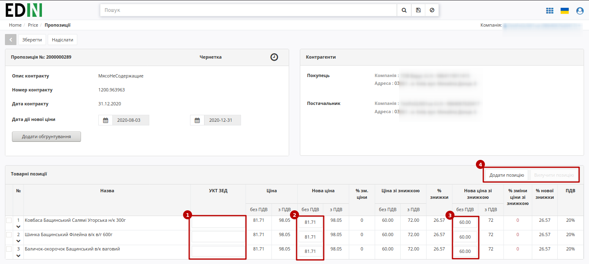
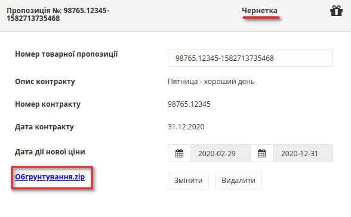
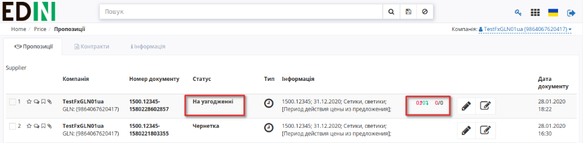
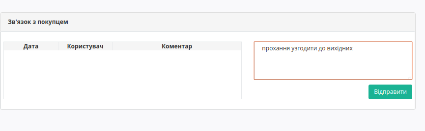
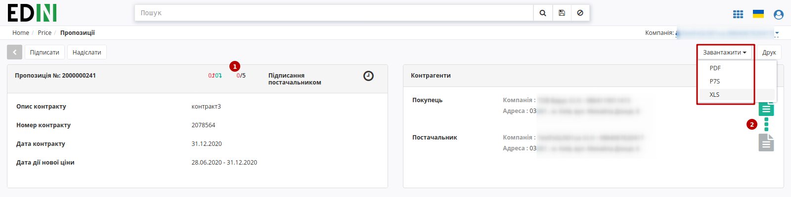
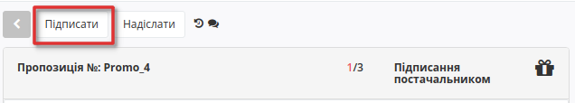

Узгодження цін на платформі Е-СПЕЦИФІКАЦІЯ. Інструкція для постачальника
########################################################################

.. сюда закину немного картинок для текста

.. |drop_pass| image:: signing/drop_pass.png

.. |del_key| image:: signing/del_key.png

.. role:: underline

---------

.. contents:: Зміст:
   :depth: 2

---------

Вступ
************************************

Е-СПЕЦИФІКАЦІЯ - рішення для швидкого узгодження цін між постачальниками і торговими мережами.
Інструкція визначає порядок узгодження ціни і підписання документа на стороні Постачальника на веб-платформі EDIN-Price. Описаний функціонал не передбачає введення нових товарних позицій!
 
Схема роботи
************************************

Роздрібна мережа зі своєї облікової системи вивантажує на FTP товарний довідник (контракт, специфікацію) в форматі XML (PRODUCTLIST.XML), актуальний на даний момент. Після обробки даного файлу на платформі, у постачальника, у сервісі **Е-СПЕЦИФІКАЦІЯ** у вкладці **Контракти**, відобразиться перелік мереж та діючих контрактів з мережею. Усі контракти зручно згруповані по назві мережі. Фільтр допоможе знайти необхідну мережу, а за допомогою пошуку по номеру контракту або договору, чи навіть по штрихкоду або артикулу позиції можна вибрати конкретний контракт. 

Постачальник на підставі узгодженого товарного довідника формує пропозицію щодо зміни цін і направляє його в торговельну мережу.

Торгова мережа проводить узгодження даної пропозиції. У разі успішного вирішення підписує зі свого боку комерційний документ і направляє його постачальнику. Постачальник зі свого боку підписує комерційний документ і відправляє Торгової мережі. Після отримання підписаного з обох сторін комерційного документа, на FTP Торгової мережі викладається новий узгоджений PRODUCTLIST.XML, на підставі якого оновлюються дані в обліковій системі, а також документ з підписами comdoc_008.p7s. Після цих змін мережа повторно вивантажує вже оновлений товарний довідник (контракт, специфікацію) на FTP. 

.. note:: У разі будь-яких змін даних, погоджених не через систему EDI, PRODUCTLIST.XML вивантажується повторно. 

Створення Товарного узгодження 
*********************************************

Перегляд актуального узгодженого товарного довідника 
===============================================================

Для перегляду і подальшої роботи з узгодженим довідником необхідно виконати вхід в систему за допомогою наданих логіна і пароля. Далі серед доступних сервісів виберіть **Е-СПЕЦИФІКАЦІЯ**

.. image:: pics_E_Spec_Іnstrukcіya_dlya_postachalnika/pics_Іnstrukcіya_dlya_postachalnika_02.png
   :align: center

Після вибору сервісу відобразиться вкладка **Пропозиції** та весь список Товарних узгодженнь, тобто пропозицій щодо зміни цін, та статус пропозицій, тип ціни - регулярна або промо , кількість змінених позицій і кількість відхилених позицій, інформація по підписам.

.. image:: pics_E_Spec_Іnstrukcіya_dlya_postachalnika/pics_Іnstrukcіya_dlya_postachalnika_03.png
   :align: center

У вкладці **Контракти**, відобразиться перелік роздрібних мереж та діючих контрактів з мережами (з актуальними товарними довідниками). Фільтри по **Компанії**, **Статусу** допоможуть вибрати необхідну мережу, а за допомогою Пошуку по номеру контракту, номеру договору, штрих-коду або артикулу позиції можна відібрати конкретний контракт. Усі контракти зручно згруповані за назвою торгової мережі:

.. image:: pics_E_Spec_Іnstrukcіya_dlya_postachalnika/pics_Іnstrukcіya_dlya_postachalnika_15.png
   :align: center

.. note:: Всі дані, наведені в Інструкції - фіктивні, використовуються тільки в якості прикладу 

Для перегляду вмісту довідника необхідно перейти до вмісту відповідного документа клікнувши лівою кнопкою миші на номер документу. Буде відкрита детальна форма довідника з пропозиціями та можливими діями з ними.

.. image:: pics_E_Spec_Іnstrukcіya_dlya_postachalnika/pics_Іnstrukcіya_dlya_postachalnika_04n.png
   :align: center

Постачальник може завантажити пропозицію до контракту з Excel (в форматі xls), як "Для регулярної ціни" так і "Для промо ціни - "Зниження ціни"" використовуючи відповідний шаблон. Після завантаження шаблону формується пропозиція в статусі "Чернетка" і відображається сформована пропозиція. 

Створення пропозиції 
===============================================================

Процес ініціації переузгодження доступний тільки на WEB-платформі. Для ініціювання процесу перепогодження регулярної або промо ціни, або регулярної ціни зі знижкою, необхідно створити «**Товарне узгодження**». Створення документа для перепогодження регулярної та промо цін можливе за допомогою простих дій з пропозиціями.

.. note:: Відображення табличної частини з позиціями залежить від налаштувань Мережі! 

Створення Товарного узгодження для перепогодження регулярної ціни та ціни зі знижкою
---------------------------------------------------------------------------------------------

Для створення товарного узгодження зайдіть в необхідний узгоджений довідник. У формі що відкрилась виберіть позиції для перепогодження, і натисніть кнопку **Переузгодити**: 

У спливаючому вікні виберіть тип дії або тип ціни для узгодження:
 - Змінити регулярну ціну (також для ціни зі знижкою);
 - Змінити промо ціну;

.. image:: pics_E_Spec_Іnstrukcіya_dlya_postachalnika/pics_Іnstrukcіya_dlya_postachalnika_05.png
   :align: center

У новому вікні відкриється нова створена пропозиція - ви можете переглянути її номер та статус (Чернетка), опис та номер контракту, до якого вона створена, дані контрагентів та табличну частину з позиціями на переузгодження. 

У табличній частині встановіть нові ціни у відповідних колонках (у данному прикладі - "Нову ціну без ПДВ" та "Нову ціну зі знижкою без ПДВ", за умовами договору з мережею), а також код УКТ ЗЕД (1), якщо раніше він не був заповнений в Товарному довіднику. 

В Пропозиціях-Чернетках на етапі редагування можливо **"Додати/Вилучити товарну позицію"** (4) (для вилучення потрібно обрати позицію чекером). При додаванні відкриється вікно з товарними позиціями, що належать до раніше обраного контракту, але не були додані в пропозицію-чернетку.

.. image:: pics_E_Spec_Іnstrukcіya_dlya_postachalnika/pics_Іnstrukcіya_dlya_postachalnika_17.png
   :align: center

Потім виберіть Дату початку дії і Дату закінчення дії нової ціни. Дата початку дії нової ціни не може бути більше дати закінчення дії нової ціни.
Дата початку дії нової ціни повинна враховувати кількість днів на розгляд пропозиції, тобто, не може бути менше ніж дата створення документу Товарне узгодження + N днів на розгляд та прийняття пропозиції мережею, а також не може бути пізніше ніж дата закінчення терміну дії. Мінімальна кількість днів на розгляд  - 3 дні.
Дата закінчення терміну дії не може бути більше, ніж дата закінчення дії контракту.

**Обов'язково збережіть зміни.**

Можливе формування пропозиції на зміну регулярної ціни зі знижкою, в залежності від налаштувань мережі. У такому випадку таблична частина з позиціями буде розширена додатковими стовбцями з можливістю вказати ціну зі знижкою. У таких пропозиціях мережа може знінювати поле **кількість**!

.. note:: Зверніть увагу! Промо ціна змінюється тільки в окремому документі Товарне узгодження для промо ціни. Ціна зі знижкою - це НЕ те саме, що промо!

Створення Товарного узгодження для перепогодження промо ціни
---------------------------------------------------------------------------------------------

Промо ціна - акційна ціна, яка діє протягом короткого терміну часу. Пропозиція на узгодження промо ціни виділяється зеленим кольором. 
Також у списку відображається тип ціни, яку узгоджують, та кільксть позицій в узгодженні:

.. image:: pics_E_Spec_Іnstrukcіya_dlya_postachalnika/pics_Іnstrukcіya_dlya_postachalnika_11.png
   :align: center

Для створення погодження промо ціни, таблична частина пропозиції з товарними позиціями відрізняється від пропозиції з регулярними цінами.

.. image:: pics_E_Spec_Іnstrukcіya_dlya_postachalnika/pics_Іnstrukcіya_dlya_postachalnika_07_promo.png
   :align: center

Встановіть нові ціни у відповідних колонках, у данному прикладі - промо ціну без ПДВ, кількість та рекомендовану роздрібну ціну, а також код УКТ ЗЕД, якщо раніше він не був заповнений в Товарному довіднику. 

Вкажіть Дату початку дії і Дату закінчення дії нової ціни. Дата початку дії нової ціни не може бути більше дати закінчення дії нової ціни.
Дата початку дії нової ціни повинна враховувати кількість днів на розгляд пропозиції, тобто, не може бути менше ніж дата створення документу Товарне узгодження + N днів на розгляд та прийняття пропозиції мережею, а також не може бути пізніше ніж дата закінчення терміну дії. Мінімальна кількість днів на розгляд  - 3 дні.
Дата закінчення терміну дії не може бути більше, ніж дата закінчення дії контракту.

Обов'язково збережіть зміни.

.. important:: Важливо! Мережа має право змінити запропоновані / зазначені Постачальником дати перед підписанням документа.

Обгрунтування
------------------------------------

Лише для Постачальника, існує можливість додати обгрунтування зміни ціни або інші документи, які можуть прискорити погодження. Для цього натисніть кнопку «**Додати обгрунтування**».
У вікні що відкрилось, виберіть та додайте необхідні файли.

.. image:: pics_E_Spec_Іnstrukcіya_dlya_postachalnika/pics_Іnstrukcіya_dlya_postachalnika_008.png
   :align: center

Додати обгрунтування можливо документу у статусі узгодження **Чернетка**, та лише файл формату PDF, JPEG, ZIP. Максимальний розмір файлу - 10 МБ.

Після завантаження файлів з'являться кнопки **Змінити** - якщо ви хочете завантажити інший файл, та **Видалити** - для видалення вкладення для обґрунтування. Для скачування потрібно натиснути на назву документу.

Після збереження та до відправки, документу присвоєно статус **Чернетка**. 
Для відправки документа необхідно натиснути на кнопку «**Надіслати**».

.. image:: pics_E_Spec_Іnstrukcіya_dlya_postachalnika/pics_Іnstrukcіya_dlya_postachalnika_09.png
   :align: center

.. attention::
   За відправки Пропозиції-чернетки виконується перевірка наявності контракту та товарних позицій в мережі. За їх відстуності виводиться відповідне повідомлення про помилку: "Контракт був видалений торговельною мережею. Зв'яжіться, будь ласка, з представником торгової мережі." чи "Виділені товарні позиції не були знайдені в контракті. Зв'яжіться, будь ласка, з представником торгової мережі."

Псля відправки документа його статус зміниться на **На узгодженні**, та з'явиться можливість лишити комментар для мережі, наприклад, для певних уточнень.

.. important::
   Постачальник може додати вкладення в якості "Обгрунтування" під час формування Пропозиції або після її відправки, якщо вона має статус "На узгодженні" і до Пропозиції раніше не було додано іншог вкладення. Після додавання "Обгрунтування" до відправленої Пропозиції в блоці коментарів автоматично додається новий коментар: "Додано вкладення для обгрунтування" (коментар також відображається на стороні мережі).

Зв'язок з мережею
------------------------------------

Під табличною частиною з позиціями з'явився блок для звязку з покупцем.

Введіть текст повідомлення у поле з підсказкою *Введіть коментар* у блоці **Зв'язок з покупцем** під табличною частиною:

Документ що містить вкладення позначається скріпкою, а документ що містить коментар позначається символом заповненого коментаря:

.. image:: pics_E_Spec_Іnstrukcіya_dlya_postachalnika/pics_Іnstrukcіya_dlya_postachalnika_11_2.png
   :align: center

Перегляд і обробка вхідного документа від Мережі (ініціація постачальника) 
********************************************************************************

Поки узгодження опрацьовується мережею, він знаходиться у статусі **На узгодженні**. Після обробки мережею, за затвердженими позиціями ви отримаєте документ, підписаний з боку мережі у статусі **Підписання постачальником**. Перед відкриттям ви вже можете переглянути загальну кількість принятих та відхилених позицій. Відкрийте вхідний документ:

.. image:: pics_E_Spec_Іnstrukcіya_dlya_postachalnika/pics_Іnstrukcіya_dlya_postachalnika_signing_1.png
   :align: center

У відкритому узгодженні можна побачити основну інформацію по документу:

1. Показник кількості позицій з підвищенням ціни та кількість позицій з пониженням ціни; **лише при узгодженні регулярних цін**! Загальну кількість позицій, що відправленні на узгодження (чорним) та з них кількість відхилених (червоним). 
2. Візуалізацію підпису від Мережі у блоці **Контрагенти** (натиснувши на візуалізацію ЕЦП, відкриється вікно з данними про підписантів)

Також є можливість роздрукувати чи завантажити документ AGREEM (XLS), підписаний документ COMDOC_008 (P7S), друкований макет підписаного документа COMDOC_008 з візуалізацією підписів (PDF).

У табличній частині перелік усіх надісланих позицій з відповідним статусом від мережі, а нижче коментарі від Мережі (за наявності).

.. image:: pics_E_Spec_Іnstrukcіya_dlya_postachalnika/pics_Іnstrukcіya_dlya_postachalnika_signing_3.png
   :align: center

Натисніть кнопку Підписати для ініціалізації підписання документу:

Після ініціалізації бібліотеки підписання, система надасть можливість додати ключ для підписання. При :underline:`першому` підписанні у модальному вікні потрібно обрати файл чи токен (1), ввести пароль (2) та натиснути **"Считати"** (3) ключ для підписання:

.. image:: signing/file1.png
   :align: center

.. image:: signing/file2.png
   :align: center

При успішному додаванні ключа автоматично відобразиться особа, від імені якої буде здійснено підписання. У користувача може бути додано кілька ключів - для вибору потрібного для здійснення операції підписання потрібно проставити відмітку (4) лівою кнопкою миші і натиснути "Підписати" (5):

.. image:: signing/file3.png
   :align: center

.. important::
   Якщо підписання цим ключем вже було здійснено або знайдена невідповідність даних ЄДРПОУ/ІПН (перевірка), то підписання блокується, а користувачу виводиться відповідне повідомлення:

.. image:: signing/wrong_key.png
   :align: center

Додатково в вікні підписання можливо натиснути **"Детальніше"** для того, щоб переглянути інформацію про підписанта, обрати за необхідності посаду, скинути пароль активного ключа (|drop_pass|) чи видалити помилкові (|del_key|).

При подальшій роботі з раніше доданим ключем/-ами потрібно вводити лише пароль для обраного ключа:

.. image:: signing/file4.png
   :align: center

Після підписання узгодження інформація щодо підписанта відображається в блоці "Контрагенти". Тепер обидві візуалізації ЕЦП в зеленому кольорі. 

.. image:: pics_E_Spec_Іnstrukcіya_dlya_postachalnika/pics_Іnstrukcіya_dlya_postachalnika_signing_9.png
   :align: center

Після успішного підписання, натисніть кнопку **Надіслати**:

.. image:: pics_E_Spec_Іnstrukcіya_dlya_postachalnika/pics_Іnstrukcіya_dlya_postachalnika_signing_10.png
   :align: center

Після підписання й відправки статус докумена міняється на **Завершено**. У блоці Контрагенти відображаються два підписи.

.. include:: kontakti.rst
