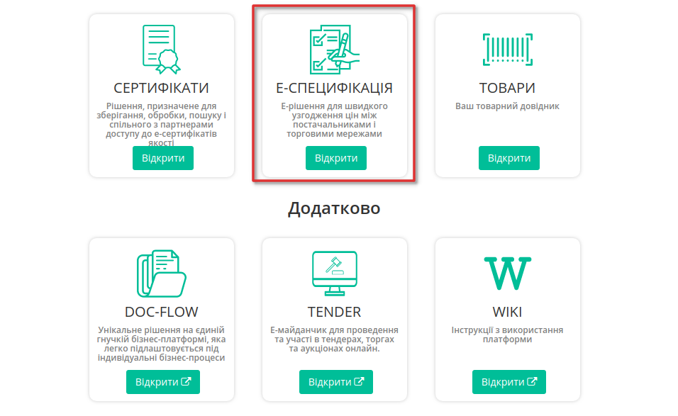
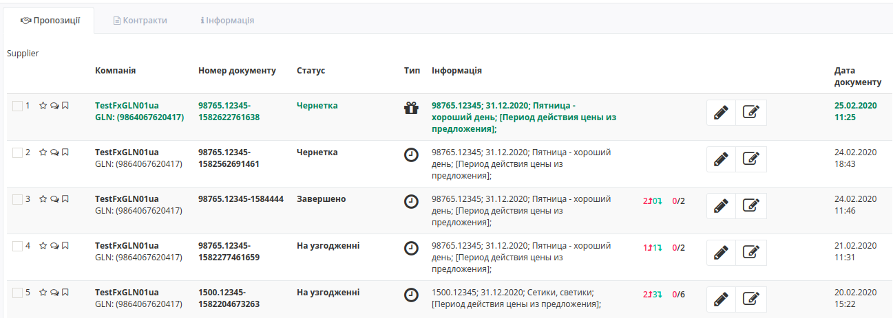
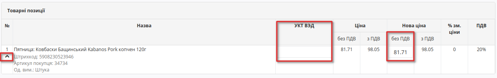
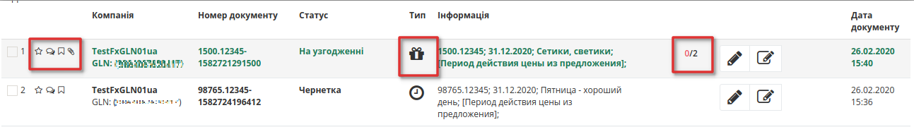

Узгодження цін на платформі Е-СПЕЦИФІКАЦІЯ. Інструкція для постачальника
########################################################################
---------

.. contents:: Зміст:
   :depth: 2

---------

Вступ
************************************
Е-СПЕЦИФІКАЦІЯ - рішення для швидкого узгодження цін між постачальниками і торговими мережами.
Інструкція визначає порядок узгодження ціни і підписання документа на стороні Постачальника на веб-платформі EDIN-Price. Описаний функціонал не передбачає введення нових товарних позицій!
 
Схема роботи
************************************

.. image:: pics_Uzgodzhennya_cіn_EDIN-Price_dlya_postachalnika/pics_EDIN-Price_dlya_postachalnika_01.png
   :align: center 

Роздрібна мережа зі своєї облікової системи вивантажує на FTP товарний довідник (контракт, специфікацію) в форматі XML (PRODUCTLIST.XML), актуальний на даний момент. Після обробки даного файлу на платформі, у постачальника, в меню «**Сервіс -> Е-СПЕЦИФІКАЦІЯ -> Контракти**», відобразиться перелік мереж та діючих контрактів з мережею. Фільтр допоможе вибрати необхідну мережу , а за допомогою пошуку по номеру контракту або договору, чи навіть по штрихкоду або артикулу позиції можна вибрати конкретний контракт. Усі контракти зручно згруповані по мережам.

 Постачальник на підставі узгодженого товарного довідника формує пропозицію щодо зміни цін і направляє його в торговельну мережу.

Торгова мережа проводить узгодження даної пропозиції. У разі успішного вирішення підписує зі свого боку комерційний документ і направляє його постачальнику. Постачальник зі свого боку підписує комерційний документ і відправляє Торгової мережі. Після отримання підписаного з обох сторін комерційного документа, на FTP Торгової мережі викладається новий узгоджений PRODUCTLIST.XML, на підставі якого оновлюються дані в обліковій системі. Після цих змін мережа повторно вивантажує вже оновлений товарний довідник (контракт, специфікацію) на FTP. 

.. note:: У разі будь-яких змін даних, погоджених не через систему EDI, PRODUCTLIST.XML вивантажується повторно. 

Обробка Товарного узгодження 
************************************

Перегляд актуального узгодженого товарного довідника 
===============================================================

Для перегляду і подальшої роботи з узгодженим довідником необхідно виконати вхід в систему за допомогою наданих логіна і пароля. Далі серед доступних сервісів виберіть **Е-СПЕЦИФІКАЦІЯ**

Після вибору сервісу відобразиться вкладка **Пропозиції** та весь список Товарних узгодженнь, тобто пропозицій щодо зміни цін, та статус пропозицій, тип ціни - регулярна або промо , кількість змінених позицій і кількість відхилених позицій, інформація по підписам.

У вкладці **Контракти**, відобразиться перелік роздрібних мереж та діючих контрактів з мережами (з актуальними товарними довідниками). Фільтр допоможе вибрати необхідну мережу , а за допомогою пошуку по номеру контракту або договору, чи навіть по штрихкоду або артикулу позиції можна вибрати конкретний контракт. Усі контракти зручно згруповані за назвою торгової мережі:

.. note:: Всі дані, наведені в Інструкції - фіктивні, використовуються тільки в якості прикладу 

Для перегляду вмісту довідника необхідно перейти до вмісту відповідного документа клікнувши лівою кнопкою миші на номер документу. Буде відкрита детальна форма довідника з пропозиціями та можливими діями з ними.

.. image:: pics_E_Spec_Іnstrukcіya_dlya_postachalnika/pics_Іnstrukcіya_dlya_postachalnika_04.png
   :align: center

Створення пропозиції 
===============================================================

Процес ініціації переузгодження доступний тільки на WEB-платформі. Для ініціювання процесу перепогодження регулярної або промо ціни, виведення товару з асортименту, тимчасового призупинення постачання необхідно створити «**Товарне узгодження**». Створення документа для перепогодження регулярної та промо цін можливе за допомогою простих дій х пропозиціями.

Створення Товарного узгодження для перепогодження регулярної ціни та ціни зі знижкою
---------------------------------------------------------------------------------------------

Для створення товарного узгодження зайдіть в необхідний узгоджений довідник. У формі що відкрилась виберіть позиції для перепогодження, і натисніть кнопку **Переузгодити**: 

У спливаючому вікні виберіть тип дії або тип ціни для узгодження:
 - Змінити регулярну ціну;
 - Змінити промо ціну;
 - Вивести товар з асортименту;
 - Тимчасово призупинити поставку;

.. image:: pics_E_Spec_Іnstrukcіya_dlya_postachalnika/pics_Іnstrukcіya_dlya_postachalnika_05.png
   :align: center

У новому вікні відкрилася нова створена пропозиція - ви можете переглянути її номер та статус, опис та номер контракту, до якого вона створена, дані контрагентів та табличну частину з позиціями на переузгодження. 

.. image:: pics_E_Spec_Іnstrukcіya_dlya_postachalnika/pics_Іnstrukcіya_dlya_postachalnika_06.png
   :align: center

У табличній частині встановіть нові ціни у відповідних колонках (у данному прикладі - нову ціну без ПДВ, за умовами договору з мережею), а також код УКТ ЗЕД, якщо раніше він не був заповнений в Товарному довіднику. 

.. note:: Відображення табличної частини з позиціями залежить від налаштувань Мережі! 

Потім виберіть Дату початку дії і Дату закінчення дії нової ціни. Дата початку дії нової ціни повинна перевищувати узгоджену з мережею к-ть днів від дати створення документа Товарне узгодження.
Обов'язково збережіть зміни.

Можливе формування пропозиції на зміну регулярної ціни зі знижкою, в залежності від налаштувань мережі. У такому випадку таблична частина з позиціями буде розширена додатковими стовбцями з можливістю вказати ціну зі знижкою.

Ціна зі знижкою - це НЕ те саме, що промо!

Створення Товарного узгодження для перепогодження промо ціни
---------------------------------------------------------------------------------------------

Для створення погодження промо ціни, таблична частина з позиціями відрізняється.

.. image:: pics_E_Spec_Іnstrukcіya_dlya_postachalnika/pics_Іnstrukcіya_dlya_postachalnika_07_promo.png
   :align: center

Встановіть нові ціни у відповідних колонках, у данному прикладі - промо ціну без ПДВ, кількість та рекомендовану роздрібну ціну, а також код УКТ ЗЕД, якщо раніше він не був заповнений в Товарному довіднику. 

Вкажіть Дату початку дії і Дату закінчення дії нової ціни. Дата початку дії нової ціни повинна перевищувати узгоджену з мережею к-ть днів від дати створення документа Товарне узгодження.
Обов'язково збережіть зміни.

.. note:: Зверніть увагу! Промо ціна змінюється тільки в окремому документі Товарне узгодження для промо ціни.

.. important:: Важливо! Мережа має право змінити запропоновані / зазначені Постачальником дати перед підписанням документа.

Лише для Постачальника, існує можливість додати обгрунтування зміни ціни або інші документи, які можуть прискорити погодження. Для цього натисніть кнопку «**Додати обгрунтування**».
У вікні що відкрилось, виберіть та додайте необхідні файли.

.. image:: pics_E_Spec_Іnstrukcіya_dlya_postachalnika/pics_Іnstrukcіya_dlya_postachalnika_08.png
   :align: center

Додати обгрунтування можливо лише у статусі узгодження Чернетка, та лише файл формату PDF, JPEG, ZIP. Максимальний розмір файлу - 10 МБ.

.. image:: pics_E_Spec_Іnstrukcіya_dlya_postachalnika/pics_Іnstrukcіya_dlya_postachalnika_08_02.png
   :align: center

Після завантаження файлів з'являться кнопки **Змінити** - якщо ви хочете завантажити інший файл, та **Видалити** - для видалення вкладення для обґрунтування. Для скачування потрібно натиснути на назву документу.

Після збереження та до відправки, документу присвоєно статус **Чернетка**. 
Для відправки документа необхідно натиснути на кнопку «**Надіслати**».

.. image:: pics_E_Spec_Іnstrukcіya_dlya_postachalnika/pics_Іnstrukcіya_dlya_postachalnika_09.png
   :align: center

Псля відправки документа його статус зміниться на **На узгодженні**, та з'явиться можливість лишити комментар для мережі, наприклад, для певних уточнень.

.. image:: pics_E_Spec_Іnstrukcіya_dlya_postachalnika/pics_Іnstrukcіya_dlya_postachalnika_12.png
   :align: center

Зв'язок з мережею
------------------------------------

Під табличною частиною з позиціями з'явився блок бля звязку з покупцем.

Введіть текст повідомлення уу поле з підсказкою *Введіть коментар* у блоці **Зв'язок з покупцем** під табличною частиною:

.. image:: pics_E_Spec_Іnstrukcіya_dlya_postachalnika/pics_Іnstrukcіya_dlya_postachalnika_10.png
   :align: center

Пропозиція на узгодження промо ціни виділяється зеленим кольором. 
Також у списку відображається тип ціни, яку узгоджують, та кільксть позицій в узгодженні:

Документ що містить вкладення позначається скріпкою, а документ що містить коментар позначається символом заповненого коментаря:

.. image:: pics_E_Spec_Іnstrukcіya_dlya_postachalnika/pics_Іnstrukcіya_dlya_postachalnika_11_2.png
   :align: center

ПІДПИСАННЯ
===============

Перегляд і обробка вхідного документа від Мережі (ініціація постачальника) 
----------------------------------------------------------------------------------

За затвердженими позиціями Ви отримаєте Комерційний документ (тікет, квитанція??), підписаний з боку мережі. Для відкриття вхідного документа натисніть на нього:

У відкритому документі можна побачити основну інформацію по документу (підписи від Мережі, перелік прийнятих позицій, коментарі від Мережі). Натисніть кнопку Підписати щоб підписати документ:

Після первинного налаштування ЕЦП і введення ключів натисніть кнопку «**Зчитати ключі**»:

Виберіть необхідні ключі для підписання і натисніть «Зчитати ключі»:

Опісля натисніть на «**Підписати**».: 

Після успішного підписання, натисніть кнопку **Надіслати**:

Підписаний і відправлений комерційний документ Товарна специфікація знаходяться в розділі Надіслані.

У разі відхилення частини запропонованих цін, Ви отримаєте Комерційний документ по прийнятим цінам (необхідно підписати ЕЦП) і документ Товарне узгодження зі списком не прийнятих позицій, які Ви можете переузгодити ще раз за допомогою відправки нового документа для узгодження.

Перегляд і обробка вхідного документа від Мережі (ініціація мережі) 
----------------------------------------------------------------------------------

Документ Товарне узгодження, відправлений Мережею для узгодження промо ціни, знаходиться в розділі Вхідні і виділений помаранчевим кольором.

Відібрати документи для обробки можна за допомогою фільтра. Для цього необхідно вибрати тип документа «Товарне узгодження» і статус «На погодженні». Для відкриття вхідного документа натисніть на значок **Редагувати**. 
У відкритому документі необхідно ознайомитися з кількістю товару, промо цінами і періодом їх дії. Також є можливість зв'язатися з мережею, залишивши повідомлення в вікні Зв'язок з покупцем. Доступно дві кнопки -  Відхилити і Підписати. Після натискання на Відхилити Вам необхідно підтвердити дію, натиснувши Закінчити, або відхилити, натиснувши Скасування.

Якщо підтвердити відхилення документа, то змінити рішення Ви не зможете і специфікація буде не узгодженою.

Натисніть кнопку Підписати для створення комерційного документа. Відкриється друкована форма документа. Необхідно виконати процедуру підписання і відправити документ в Мережу. У свою чергу Мережа підпише документ зі свого боку і комерційному документу буде присвоєно статус «**Специфікація узгоджена**».

.. include:: kontakti.rst