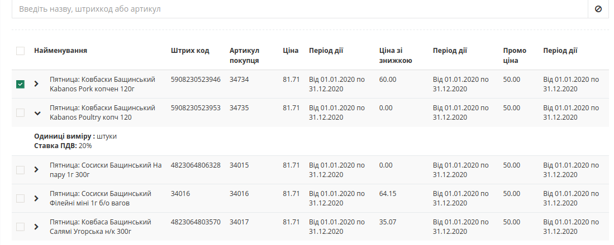
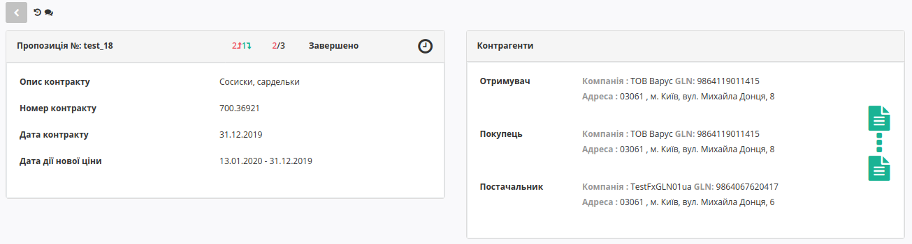

Узгодження цін на web-платформі EDIN-Price. Інструкція для роздрібної мережі
#############################################################################
---------

.. contents:: Зміст:
   :depth: 2

---------

Вступ
************************************
Е-СПЕЦИФІКАЦІЯ - рішення для швидкого узгодження цін між постачальниками і торговими мережами.
Інструкція визначає порядок узгодження ціни і підписання документа на стороні Постачальника на веб-платформі EDIN-Price. 
Зверніть увагу! Описаний функціонал не передбачає введення нових товарних позицій!
 
Схема роботи
************************************

Роздрібна мережа зі своєї облікової системи вивантажує на FTP товарний довідник (контракт, специфікацію) в форматі XML (PRODUCTLIST.XML), актуальний на момент вавантаження. Після обробки даного файлу на платформі, у постачальника, у сервісі **Е-СПЕЦИФІКАЦІЯ** у вкладці **Контракти**, відобразиться перелік мереж та діючих контрактів з мережею. Усі контракти зручно згруповані по назві мережі. Фільтр допоможе знайти необхідну мережу, а за допомогою пошуку по номеру контракту або договору, чи навіть по штрихкоду або артикулу позиції можна вибрати конкретний контракт. 

Постачальник на підставі узгодженого товарного довідника формує пропозицію щодо зміни цін і направляє його в торговельну мережу на узгодження.

Торгова мережа проводить узгодження даної пропозиції. У разі успішного рішення підписує зі свого боку документ і направляє його постачальнику. Постачальник зі свого боку підписує комерційний документ і відправляє Торговій мережі. Після отримання підписаного з обох сторін документа, на FTP Торгової мережі викладається новий узгоджений PRODUCTLIST.XML, на підставі якого оновлюються дані в обліковій системі, а також документ з підписами comdoc_008.p7s. Після цих змін мережа повторно вивантажує вже оновлений товарний довідник (специфікацію) на FTP. 

.. note:: У разі будь-яких змін даних, погоджених не через систему EDI, PRODUCTLIST.XML вивантажується повторно.

Перегляд актуального узгодженого товарного довідника
****************************************************************

.. note:: Всі дані, наведені в Інструкції - фіктивні, використовуються тільки в якості прикладу! 

Для перегляду і подальшої роботи з узгодженим довідником необхідно виконати вхід в систему за допомогою наданих логіна і пароля. Далі серед доступних сервісів виберіть **Е-СПЕЦИФІКАЦІЯ**

.. image:: pics_E_Spec_Іnstrukcіya_dlya_merezhі/pics_E_Spec_Іnstrukcіya_dlya_merezhі_01.png
   :align: center

Після відкриття сервісу, перейдіть у вкладку **Контракти**, де відобразиться перелік постачальників та діючих контрактів з актуальними товарними довідниками. Фільтр допоможе вибрати необхідного Постачальника, а за допомогою пошуку по номеру контракту або договору, чи навіть по штрихкоду або артикулу позиції можна вибрати конкретний контракт. Усі контракти зручно згруповані за назвою компанії Постачальника:

.. image:: pics_E_Spec_Іnstrukcіya_dlya_merezhі/pics_E_Spec_Іnstrukcіya_dlya_merezhі_02.png
   :align: center

Для перегляду вмісту довідника необхідно перейти до відповідного документа клікнувши кнопкою миші на номер контракту. Буде відкрита детальна форма довідника з пропозиціями та можливими діями з ними.

Обробка Товарного узгодження
****************************************************************

Для перегляду пропозицій на переузгодження цін, перейдіть у вкладку **Пропозиції** де відобразиться весь список Товарних узгодженнь, тобто пропозицій щодо зміни цін, та статус пропозицій, тип ціни - регулярна або промо, кількість змінених позицій і кількість відхилених позицій, інформація по підписам.

.. image:: pics_E_Spec_Іnstrukcіya_dlya_merezhі/pics_E_Spec_Іnstrukcіya_dlya_merezhі_04.png
   :align: center

Відображення пропозицій на зміну регулярної ціни та промо ціни відрізняється. Регулярна ціна позначається чорним кольором та спец позначкою у стовбці тип (3):

.. image:: pics_E_Spec_Іnstrukcіya_dlya_merezhі/pics_E_Spec_Іnstrukcіya_dlya_merezhі_05_regular.png
   :align: center

Промо ціни виділені зеленим кольором та спец позначкою у стовбці тип (3):

.. image:: pics_E_Spec_Іnstrukcіya_dlya_merezhі/pics_E_Spec_Іnstrukcіya_dlya_merezhі_05_promo.png
   :align: center

Значення символів:

1. Піктограмма скріпка - означає що до пропозиції додано обгрунтування;
2. Статус пропозиції - нові пропозиції від постачальника приходять у статусі **На погодженні**;
3. Тип - піктограмма інформує про тип ціни, "годинник" - означає регулярна ціна; "пакунок" - означає що пропозиція на промо ціну
4. Показник загальної кількості позицій що відправленні на узгодження -чорним, та з них кількість відхилених - червоним
5. Показник кількості позицій з підвищенням ціни - зеленим, та кількість позицій з пониженням ціни - червоним; лише при узгодженні регулярних цін!

Для відкриття пропозиції та її обробки натиснути Олівець - символ редагування.

**Ціни зі знижкою**
 Постачальник може сформувати пропозиції на зміну *регулярної ціни зі знижкою*, в залежності від індивідуальних налаштувань мережі. У такому випадку таблична частина з позиціями буде розширена додатковими стовбцями з можливістю вказати ціну зі знижкою. У таких пропозиціях мережа може знінювати поле "**Кількість**". 

.. note:: Кількість етапів узгодження залежить від налаштуваннь мережі, тобто кожне узгодження унікальне. Кількість етапів варіюється від двох до п'яти. Для налаштувааня етапів зверніться до свого менеджера АТС або у Службу підтримки.

1 етап. Обробка товарного узгодження категорійним менеджером
====================================================================

Мережа отримує нове узгодження, відправлене Постачальником, у статусі **На погодженні**

Для відкриття вхідного документа натисніть на знак редагування. У новому вікні, ТС бачить форму пропозиції:

.. image:: pics_E_Spec_Іnstrukcіya_dlya_merezhі/pics_E_Spec_Іnstrukcіya_dlya_merezhі_006.png
   :align: center

1. Кнопки Прийняти або Відхилити - для обробки усіх позицій відразу
2. Інформацію про контракт, його опис та дати дії нової ціни, а також статус пропозиції та данні по кількості позицій на зміну
3. Контрагенти - інфо по партнеру, що надіслав пропозицію, також тут відображаються іконки візуалізації підписів з боку мережі і постачальника (при наявності)
4. Таблична частина з товарними позиціями та інфо по них, можливістю прийняти / відхилити кожною окрему позицію та всі разом
5. Блок Зв'язок з продавцем - можливість переглянути коментарі продавця та залишити коментар

У документі на зміну регулярної / промо ціни Вам необхідно перевірити ціни в кожній з позицій і вказати статус - Прийнято / Не прийнято, по необхідності змінити період для нової ціни, а потім змінити загальний статус документа - **Узгодженно**.

Якщо ви не маєте можливість змінити статус пропозицій, це означає що за налаштуваннями узгодження у вас немає прав на прийняття/відхилення пропозиції у данному статусі.

На будь-якому етапі можливо відхилити пропозицію, й вона відразу змінить статус на **Відхилено**.

2 етап. Обробка Товарного узгодження Керівником відділу 
=======================================================================
Документ Товарне узгодження, узгоджений Категорійним менеджером на першому етапі, надходить на наступний зі статусом **Узгодженно**. Для відкриття вхідного документа натисніть на знак редагування.

У формі документа Вам необхідно перевірити ціни в кожній з позицій, вказати статус - Прийнято / Не прийнято, а потім змінити загальний статус документа - **Готовий до підписання**.

Також нижче в формі документа у Вас є можливість звернутися до відповідного постачальника і залишити йому коментар. Для цього введіть текст повідомлення в порожнє поле і натисніть кнопку **Надіслати**.

Після зміни статусу позицій, документ змінює статус на «**Готовий до підписання**» й відпрявляється на наступний етап - Підписання.

3 етап. Обробка і підписання Товарного узгодження Комерційним директором
================================================================================

.. note:: Підписати документ можливо лише у статусі "*Готовий до підписання*"!

Документ Товарне узгодження, узгоджений Керівником відділу надходить зі статусом **Готовий до підписання**. Відкрийте вхідний документ Товарне узгодження, натиснувши на олівець.

У формі документа Вам необхідно перевірити ціни в кожній з позицій, вказати статус - Прийнято / Не прийнято, потім змінити загальний статус документа - Погоджено / Відхилено. Після зміни статусу натисніть кнопку **Підписати**.

.. image:: pics_E_Spec_Іnstrukcіya_dlya_merezhі/pics_E_Spec_Іnstrukcіya_dlya_merezhі_09.png
   :align: center

Після ініціалізації бібліотеки підписання, система надасть можливість додати ключ для підписання. При першому підписанні необхідно додати файловий ключ. Для цього у модальному вікні потрібно обрати файл (1) і ввести пароль (2):

.. image:: pics_E_Spec_Іnstrukcіya_dlya_postachalnika/pics_Іnstrukcіya_dlya_postachalnika_signing_5.png
   :align: center

Після чого натисніть кнопку **"Додати"**:

.. image:: pics_E_Spec_Іnstrukcіya_dlya_postachalnika/pics_Іnstrukcіya_dlya_postachalnika_signing_6.png
   :align: center

При успішному додаванні ключа автоматично відобразиться вибрана особа, від імені якої буде здійснено підписання (кнопка **"Підписати"**):

.. image:: pics_E_Spec_Іnstrukcіya_dlya_postachalnika/pics_Іnstrukcіya_dlya_postachalnika_signing_7.png
   :align: center

При подальшій роботі з раніше доданим ключем/-ами потрібно вводити лише пароль для обраного ключа:

.. image:: pics_E_Spec_Іnstrukcіya_dlya_postachalnika/pics_Іnstrukcіya_dlya_postachalnika_signing_8.png
   :align: center

Після підписання узгодження інформація щодо підписанта відображається в блоці "Контрагенти". 

Після успішного підписання, натисніть кнопку **Надіслати**. 
Після підписання й відправки статус докумена міняється на **Підписання постачальником** й відображається один підпис - від мережі:

.. image:: pics_E_Spec_Іnstrukcіya_dlya_merezhі/pics_E_Spec_Іnstrukcіya_dlya_merezhі_011.png
   :align: center

Після підписання постачальником статус узгодження зміниться на **Завершено** та зявиться ще один підпис у блоці Контрагенти. Тепер обидві візуалізації ЕЦП в зеленому кольорі:

Додаткові можливості і функції
****************************************************************

Інтерфейс
===============================================
Для зручності визначення типу Товарного узгодження, документи різних типів виділені різними кольорами:
 
- чорні - пропозиції щодо зміни регулярної ціни
- зелені - пропозиції щодо зміни промо ціни

Статус документа винесений останньої колонкою. Нижче представлений список можливих проміжніх статусів узгоджень:

1. *На погодженні* - отримано мережею, у такому статусі відображаєтьмя для Постачальника під час процесу узгодження з боку мережі
2. *Підготовлено* - статус для мережі
3. *Підтверджений* - статус для мережі
4. *Перевірений* - статус для мережі
5. *Узгоджений* - статус для мережі
6. *Готовий до підписання* - статус для мережі
7. *Підписання постачальником* - після обробки мережею
8. *Завершено* - отримано всі необхідні підписи (Мережі та Постачальника)
9. *Відхилено*

Примітка! При наявності в бізнес процесі додаткових департаментів (керівник відділу закупівлі, служба безпеки, економічна безпека, фінансовий аналітик, логістика) статуси та етапи можуть змінюватися. Зверніться до Служби підтримки або вашого менеджера АТС за налаштуваннями.

Є лічильник позицій з підвищенням і зниженням регулярної ціни, червоним виводиться кількість позицій на підвищення ціни, а зеленим - зниження. За необхідності документ можна виділити як важливий, ставити мітки, а також прочитати всю історію листування не заходячи в документ.

Обгрунтування
===============================================

У блоці «**Інформація про контракт**» можливо скачати *обгрунтування* - вкладення постачальника, якщо він його додав. Просто натисніть на назву вкладення, скачування почнеться автоматично. Максимальний розмір файлу  - 10МБ.

.. image:: pics_E_Spec_Іnstrukcіya_dlya_merezhі/pics_E_Spec_Іnstrukcіya_dlya_merezhі_08.png
   :align: center

У вікні «**Зв'язок з продавцем**» у Вас є можливість читати коментарі постачальника і залишати свої. Для цього введіть текст повідомлення в порожнє поле і натисніть кнопку **Надіслати**:

.. image:: pics_E_Spec_Іnstrukcіya_dlya_merezhі/pics_E_Spec_Іnstrukcіya_dlya_merezhі_07.png
   :align: center

У разі якщо постачальник додав обгрунтування зміни ціни або приклав якісь інші файли, то вхідні документи з вкладеннями будуть позначені скріпкою, а документ  що містить коментар позначається символом заповненого коментаря(у вигляді заповненої хмаринки):

.. image:: pics_E_Spec_Іnstrukcіya_dlya_merezhі/pics_E_Spec_Іnstrukcіya_dlya_merezhі_011_2.png
   :align: center

Завантажити та ознайомитися з вкладенням можна зайшовши в товарне узгодження і натиснувши **посилання з назвою обгрунтування**. 

.. include:: kontakti.rst