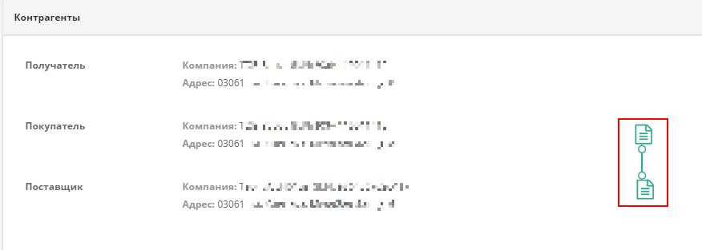

Узгодження цін на web-платформі EDIN-Price. Інструкція для роздрібної мережі
#############################################################################
---------

.. contents:: Зміст:
   :depth: 2

---------

Вступ
************************************
Е-СПЕЦИФІКАЦІЯ - рішення для швидкого узгодження цін між постачальниками і торговими мережами.
Інструкція визначає порядок узгодження ціни і підписання документа на стороні Постачальника на веб-платформі EDIN-Price. Описаний функціонал не передбачає введення нових товарних позицій!
 
Схема роботи
************************************

Роздрібна мережа зі своєї облікової системи вивантажує на FTP товарний довідник (контракт, специфікацію) в форматі XML (PRODUCTLIST.XML), актуальний на даний момент. Після обробки даного файлу на платформі, у постачальника, у сервісі **Е-СПЕЦИФІКАЦІЯ** у вкладці **Контракти**, відобразиться перелік мереж та діючих контрактів з мережею. Усі контракти зручно згруповані по назві мережі. Фільтр допоможе знайти необхідну мережу, а за допомогою пошуку по номеру контракту або договору, чи навіть по штрихкоду або артикулу позиції можна вибрати конкретний контракт. 

Постачальник на підставі узгодженого товарного довідника формує пропозицію щодо зміни цін і направляє його в торговельну мережу.

Торгова мережа проводить узгодження даної пропозиції. У разі успішного вирішення підписує зі свого боку комерційний документ і направляє його постачальнику. Постачальник зі свого боку підписує комерційний документ і відправляє Торгової мережі. Після отримання підписаного з обох сторін комерційного документа, на FTP Торгової мережі викладається новий узгоджений PRODUCTLIST.XML, на підставі якого оновлюються дані в обліковій системі, а також документ з підписами comdoc_008.p7s. Після цих змін мережа повторно вивантажує вже оновлений товарний довідник (контракт, специфікацію) на FTP. 

.. note:: У разі будь-яких змін даних, погоджених не через систему EDI, PRODUCTLIST.XML вивантажується повторно.

Перегляд актуального узгодженого товарного довідника
****************************************************************

.. note:: Всі дані, наведені в Інструкції - фіктивні, використовуються тільки в якості прикладу 

Для перегляду і подальшої роботи з узгодженим довідником необхідно виконати вхід в систему за допомогою наданих логіна і пароля. Далі серед доступних сервісів виберіть **Е-СПЕЦИФІКАЦІЯ**

.. image:: pics_E_Spec_Іnstrukcіya_dlya_merezhі/pics_E_Spec_Іnstrukcіya_dlya_merezhі_01.png
   :align: center

Після відкриття сервісу, перейдіть у вкладку **Контракти**, де відобразиться перелік постачальників та діючих контрактів з актуальними товарними довідниками. Фільтр допоможе вибрати необхідного Постачальника, а за допомогою пошуку по номеру контракту або договору, чи навіть по штрихкоду або артикулу позиції можна вибрати конкретний контракт. Усі контракти зручно згруповані за назвою компанії Постачальника:

.. image:: pics_E_Spec_Іnstrukcіya_dlya_merezhі/pics_E_Spec_Іnstrukcіya_dlya_merezhі_02.png
   :align: center

Для перегляду вмісту довідника необхідно перейти до відповідного документа клікнувши кнопкою миші на номер документу. Буде відкрита детальна форма довідника з пропозиціями та можливими діями з ними.

.. image:: pics_E_Spec_Іnstrukcіya_dlya_merezhі/pics_E_Spec_Іnstrukcіya_dlya_merezhі_03.png
   :align: center

Обробка Товарного узгодження
****************************************************************

Для перегляду пропозицій на переузгодження цін, перейдіть у вкладку **Пропозиції** де відобразиться весь список Товарних узгодженнь, тобто пропозицій щодо зміни цін, та статус пропозицій, тип ціни - регулярна або промо, кількість змінених позицій і кількість відхилених позицій, інформація по підписам.

.. image:: pics_E_Spec_Іnstrukcіya_dlya_merezhі/pics_E_Spec_Іnstrukcіya_dlya_merezhі_04.png
   :align: center

.. note:: Кількість етапів узгодження залежить від налаштуваннь мережі, тобто кожне узгодження унікальне. Кількість етапів варіюється від двох до п'яти.

Відображення пропозицій на зміну регулярної ціни та промо ціни відрізняється. Регулярна ціна позначається чорнім кольором та спец позначкою у стовбці тип:

.. image:: pics_E_Spec_Іnstrukcіya_dlya_merezhі/pics_E_Spec_Іnstrukcіya_dlya_merezhі_05_regular.png
   :align: center

 Промо ціни виділені зеленим кольором та спец позначкою у стовбці тип:

.. image:: pics_E_Spec_Іnstrukcіya_dlya_merezhі/pics_E_Spec_Іnstrukcіya_dlya_merezhі_05_promo.png
   :align: center

1. Піктограмма скріпка - означає до до пропозиції додано обгрунтування;
2. Статус пропозиції - нові пропозиції від постачальника приходять у статусі **На погодженні**;
3. Тип - піктограмма інформує про тип ціни, "годинник" - означає регулярна ціна; ""
4. Показник загальної кількості позицій що відправленні на узгодження -чорним, та з них кількість відхилених - червоним
5. Показник кількості позицій з підвищенням ціни - зеленим, та кількість позицій з пониженням ціни - червоним; лише при узгодженні регулярних цін!

Олівець - символ редагування, натиснути для відкриття пропозиції, для її обробки.

1 етап. Обробка товарного узгодження категорійним менеджером
====================================================================

Мережа отримує нове узгодження, відправлене Постачальником, у статусі **На погодженні**

Для відкриття вхідного документа натисніть на знак редагування. У новому вікні, ТС бачить:

.. image:: pics_E_Spec_Іnstrukcіya_dlya_merezhі/pics_E_Spec_Іnstrukcіya_dlya_merezhі_06.png
   :align: center

1. Кнопки Прийняти або Відхилити - для обробки усіх позицій відразу
2. Інформацію про контракт, його опис та дати дії нової ціни, а також статус пропозиції та данні по кількості позицій на зміну
3. Контрагенти - інфо по партнеру, що надіслав пропозицію, також тут відображаються іконки візуалізації підписів з боку мережі і постачальника (при наявності)
4. Таблична частина з товарними позиціями та інфо по них, можливістю прийняти / відхилити кожною окрему позицію та всі разом
5. Блок Зв'язок з продавцем - можливість переглянути коментарі продавця та залишити коментар

У вікні «**Зв'язок з продавцем**» у Вас є можливість читати коментарі постачальника і залишати свої. Для цього введіть текст повідомлення в порожнє поле і натисніть кнопку **Надіслати**:

фото

У документі на зміну регулярної / промо ціни Вам необхідно перевірити ціни в кожній з позицій і вказати статус - Прийнято / Не прийнято, по необхідності змінити період для нової ціни, а потім змінити загальний статус документа - **На погодженні / Підготовлено**.

Якщо ви не маєте можливість змінити статус пропозицій, це означає що за налаштуваннями узгодження у вас немає прав на прийняття/відхилення пропозиції у данному статусі.

2 етап. Обробка Товарного узгодження Керівником відділу закупівель
=======================================================================
Документ Товарне узгодження, узгоджений Категорійним менеджером надходить зі статусом **Підготовлено (Підтверджено)**. Для відкриття вхідного документа натисніть на знак редагування.

У формі документа Вам необхідно перевірити ціни в кожній з позицій, вказати статус - Прийнято / Не прийнято, а потім змінити загальний статус документа - Готовий до підписання / Відхилено.

Також нижче в формі документа у Вас є можливість звернутися до відповідного постачальника і залишити йому коментар. Для цього введіть текст повідомлення в порожнє поле і натисніть кнопку **Надіслати**.

Після зміни статусу позицій, документ змінює статус на «**Узгоджено**»:

.. image:: pics_Soglasovanie_cen_Instrukcija_dlja_seti/pics_Soglasovanie_cen_Instrukcija_dlja_seti_10.png
   :align: center

3 етап. Обробка і підписання Товарного узгодження Комерційним директором
================================================================================
Документ Товарне узгодження, узгоджений Керівником відділу закупівель надходить зі статусом **Готовий до підписання**. Відкрийте вхідний документ Товарне узгодження, натиснувши на олівець:

У формі документа Вам необхідно перевірити ціни в кожній з позицій, вказати статус - Прийнято / Не прийнято, потім змінити загальний статус документа - Погоджено / Відхилено. Після зміни статусу натисніть кнопку **Підписати**.
фото

Після ініціалізації бібліотеки підписання, система надасть можливість додати ключ для підписання. При першому підписанні необхідно додати файловий ключ. Для цього у модальному вікні потрібно обрати файл (1) і ввести пароль (2):

.. image:: pics_E_Spec_Іnstrukcіya_dlya_postachalnika/pics_Іnstrukcіya_dlya_postachalnika_signing_5.png
   :align: center

Після чого натиснути кнопку **"Додати"**:

.. image:: pics_E_Spec_Іnstrukcіya_dlya_postachalnika/pics_Іnstrukcіya_dlya_postachalnika_signing_6.png
   :align: center

При успішному додаванні ключа автоматично відобразиться вибрана особа, від імені якої буде здійснено підписання (кнопка **"Підписати"**):

.. image:: pics_E_Spec_Іnstrukcіya_dlya_postachalnika/pics_Іnstrukcіya_dlya_postachalnika_signing_7.png
   :align: center

При подальшій роботі з раніше доданим ключем/-ами потрібно вводити лише пароль для обраного ключа:

.. image:: pics_E_Spec_Іnstrukcіya_dlya_postachalnika/pics_Іnstrukcіya_dlya_postachalnika_signing_8.png
   :align: center

Після підписання узгодження інформація щодо підписанта відображається в блоці "Контрагенти". Тепер обидві візуалізації ЕЦП в зеленому кольорі. 

Після успішного підписання, натисніть кнопку **Надіслати**:

.. image:: pics_E_Spec_Іnstrukcіya_dlya_postachalnika/pics_Іnstrukcіya_dlya_postachalnika_signing_10.png
   :align: center

Після підписання й відправки статус докумена міняється на **Завершено**.

.. include:: kontakti.rst

Узгодження промо ціни 
---------------------------------------------------------------------------
Для створення товарного узгодження зайдіть в необхідний узгоджений довідник. У формі що відкрилась виберіть позиції для перепогодження, і натисніть кнопку **Перепогодити**:

У спливаючому вікні виберіть «**Змінити промо ціну**» і натисніть «**ОК**»:

У вікні встановіть нові ціни у відповідних колонках (Нова ціна без ПДВ / Нова ціна з ПДВ - за умовами договору з мережею). Потім вкажіть Дату початку і Дату закінчення дії нової ціни. Дата початку дії нової ціни повинна перевищувати узгоджену к-ть днів від дати створення документа Товарне узгодження.

При необхідності перелік позицій можна розширити або скоротити за допомогою кнопок «Додати позицію» і «Видалити позицію». Біля найменування товарної позиції розміщена іконка з назвою каталогу. Після її натискання, в додатковому вікні відкриваються піктограми *Listex* і *Ucat*. Натиснувши на них відбувається перехід на сайт відповідних каталогів.

Існує можливість додати обгрунтування зміни ціни або інші документи, які можуть прискорити узгодження. Для цього натисніть кнопку «**Додати обгрунтування**»:

 
У вікні що відкрилось можна додати необхідні файли:

Для додавання файлів використовується кнопка «**Додати файл**», для видалення зайвих файлів - кнопка з хрестиком біля імені файлу.

Після того, як всі файли були додані - необхідно натиснути на кнопку «**Створити обгрунтування**», в результаті файли будуть збережені в окремий архів і довантажені до товарного узгодженням. Після натискання кнопки «Створити обгрунтування» зміна архіву буде неможлива. У разі якщо необхідно додати і / або видалити якісь файли - всю процедуру слід повторити спочатку. Після збереження внесених змін натисніть кнопку **Відправити**.

Зверніть увагу! Доступ до поля Кількість регулюється (заповнюється / не заповнюється). Дату початку дії нової ціни і дату закінчення дії нової ціни постачальник не змінює.

Жирним курсивом виділено ще не прочитаний Постачальником документ.

Товарне узгодження має кілька етапів узгодження документа на стороні постачальника, які у Вас відображаються у вигляді статусу документа:

- **На погодженні** - отриманий постачальником
- **Відхилено** - відхилений постачальником
- **Погоджено** - узгоджений, але комерційний документ не підписаний
- **Підписано** - накладена ЕЦП з боку постачальника

Для перегляду відправленого документа «**Товарне узгодження**» натисніть на нього. У відкритому документі можна побачити основну інформацію по документу.
Для зв'язку з постачальником введіть текст повідомлення у вікно **Зв'язок з продавцем** і натисніть кнопку **Надіслати**:

.. image:: pics_Soglasovanie_cen_Instrukcija_dlja_seti/pics_Soglasovanie_cen_Instrukcija_dlja_seti_25.png
   :align: center

Нижче представлений список можливих статусів узгоджень:

1. **На погодженні** - отримано мережею, без внесення змін
2. **Підготовлено** - оброблений категорійним менеджером мережі

Проміжні статуси обробки документів для регулювання бізнес процесів узгодження:

- *Підтверджений*
- *Перевірений*
- *Узгоджений*
- *Готовий до підписання*

3. **Підписано** - оброблений фінальним підписантом і накладена ЕЦП з боку мережі

3. **Завершено** - отримано всі необхідні підписи (Мережі та Постачальника)

Примітка! При наявності в бізнес процесі додаткових департаментів (керівник відділу закупівлі, служба безпеки, економічна безпека, фінансовий аналітик, логістика) статуси можуть змінюватися. Зверніться до Служби підтримки або вашого менеджера АТС за налаштуваннями.

Додаткові можливості і функції
****************************************************************

Інтерфейс
===============================================
Для зручності визначення типу Товарного узгодження, документи різних типів виділені різними кольорами:
 
- чорні - пропозиції щодо зміни регулярної ціни
- помаранчеві - пропозиції щодо зміни промо ціни
- зелені - пропозиція щодо виведення товару з асортименту та тимчасового призупинення постачання товару

Статус документа винесений останньої колонкою. Є лічильник позицій з підвищенням і зниженням регулярної ціни, червоним виводиться кількість позицій на підвищення ціни, а зеленим - зниження. За необхідності документ можна виділити як важливий, ставити мітки, а також прочитати всю історію листування не заходячи в документ.

.. image:: pics_Soglasovanie_cen_Instrukcija_dlja_seti/pics_Soglasovanie_cen_Instrukcija_dlja_seti_28.png
   :align: center

Обгрунтування
===============================================
У разі якщо постачальник додавав обгрунтування зміни ціни або приклав якісь інші файли, то вхідні документи з обгрунтуванням будуть позначені скріпкою біля статусу:

Завантажити та ознайомитися з вкладенням можна зайшовши в товарне узгодження і натиснувши **посилання з назвою обгрунтування**:

фото!

.. include:: kontakti.rst