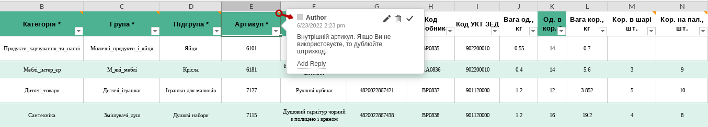
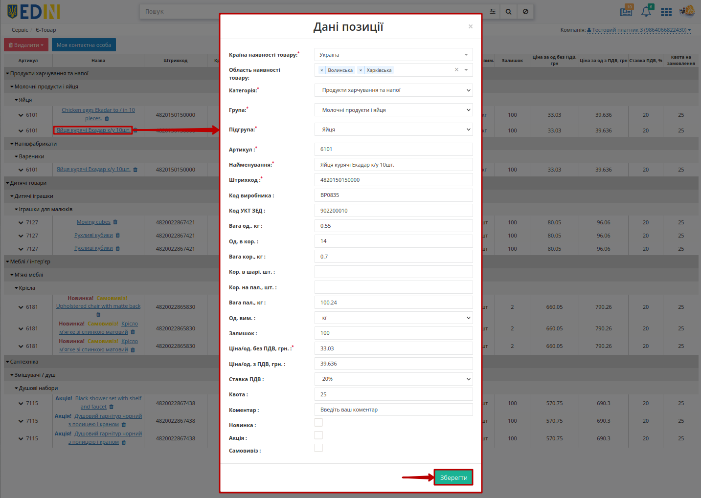
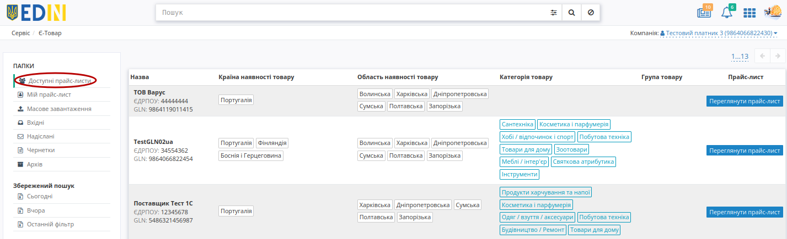
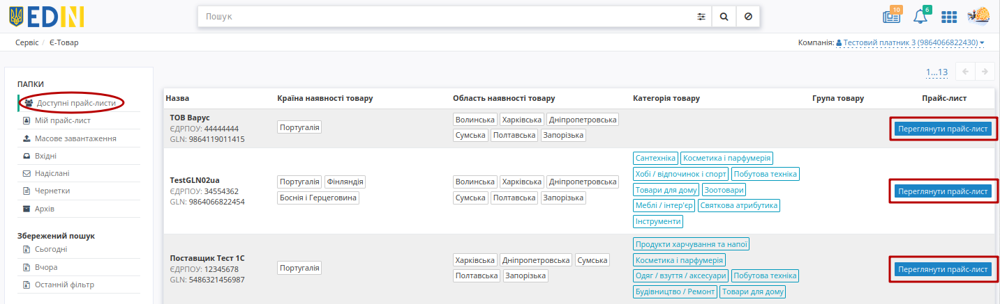

Інструкція по роботі з сервісом "Є-Товар"
###############################################################################

.. примітка: багато функціоналу переїхало з Distribution

.. сюда закину немного картинок для текста

.. |comment| image:: pics_Openprice_instruction/Openprice_instruction_028.png

.. |pencil| image:: pics_Openprice_instruction/Openprice_instruction_002.png

.. |non| image:: pics_Openprice_instruction/Openprice_instruction_044.png

.. |лупа| image:: pics_Openprice_instruction/Openprice_instruction_043.png

.. role:: red

.. role:: green

.. role:: blue

.. role:: orange

.. role:: underline

---------

.. contents:: Зміст:
   :depth: 3

---------

Вступ
===================================

**"Є-Товар"** - це комплексне електронне рішення, орієнтоване в першу чергу на швидкий пошук товарів та зручне створення електронних замовлень.

Сервіс **"Є-Товар"** дозволяє контрагентам виступати в якості **Покупця** (**Дистиб'ютора**) та **Продавця** (**Виробника**) в залежності від дій в сервісі. Дана інструкція описує порядок створення власного `"Прайс-листа" (PRICAT) <https://wiki.edin.ua/uk/latest/Distribution/EDIN_2_0/XML/XML_structure.html#pricat>`__ та формування `"Замовлення" (ORDERS) <https://wiki.edin.ua/uk/latest/Distribution/EDIN_2_0/XML/XML_structure.html#order>`__ на підставі "Прайс-листів" (PRICAT) інших користувачів сервісу **"Є-Товар"**.

.. note:: Всі дані, наведені в Інструкції - фіктивні, використовуються тільки в якості прикладу. 

1 Вхід на платформу
====================================

.. include:: /general_2_0/rabota_s_platformoj_EDIN_2.0.rst
   :start-after: .. початок блоку для Enter
   :end-before: .. кінець блоку для Enter

Після успішної авторизації відкриється основне меню, де у вкладці **"Продукти та рішення"** EDIN потрібно обрати сервіс **Є-Товар**:

-----------------------------------------

Бокове меню сервісу **"Є-Товар"** містить наступні розділи:

* **Доступні прайс-листи** - розділ, в якому відображаються всі доступні прайс-листи користувачів сервісу **"Є-Товар"**;
* **Мій прайс-лист** - розділ, в якому відображається Ваш (поточного GLN) `"Прайс-лист" (PRICAT) <https://wiki.edin.ua/uk/latest/Distribution/EDIN_2_0/XML/XML_structure.html#pricat>`__;
* **Масове завантаження** - функціонал масового завантаження товарів в Ваш `"Прайс-лист" (PRICAT) <https://wiki.edin.ua/uk/latest/Distribution/EDIN_2_0/XML/XML_structure.html#pricat>`__;

* **Вхідні** - всі вхідні документи для організації від контрагентів;
* **Надіслані** - всі відправлені документи для організації до контрагентів;
* **Чернетки** - всі документи які були створені, але не відправлені;
* **Архів** - всі оброблені і архівні документи (перенесені в архів).

Окремо винесені фільтри документів по даті (**"Сьогодні"**, **"Вчора"**), а останній введений пошук зберігається платформою автоматично і при натисканні кнопки **"Останній фільтр"** він виконується повторно в тій папці ("Вхідні" / "Надіслані" / "Архів" / "Рахунки" / "Договори/ДУ з КЕП"), в якій він був виконаний останнього разу (Вас буде переадресовано).

.. _sale:

2 Робота з Покупцями (продаж)
===================================

Для того аби почати роботу з Вашими контагентами-Покупцями потрібно подати Ваш `"Прайс-лист" (PRICAT) <https://wiki.edin.ua/uk/latest/Distribution/EDIN_2_0/XML/XML_structure.html#pricat>`__: перейдіть у розділ **"Масове завантаження"** і ознайомтесь із правилами по створенню Вашого прайс-листа шляхом завантаження його в .xls форматі:

Додати власний прайс-лист можливо за допомогою кнопки **"Завантажити з Excel"** (2). Для коректного формування прайс-листа для початку завантажте шаблон за допомогою кнопки **"Скачати шаблон Excel"** (1). Автоматично почнеться скачування шаблону у форматі .xls

.. important::
   Зверніть увагу! Видаляти, міняти місцями колонки в шаблоні не можна. Ви можете не заповнювати не обовязкові стовпці, але не видаляйте їх.

Відкрийте та заповніть файл Excel. Колонки виділенні зеленим кольором - **обов'язкові для заповнення**! Деякі стовпці мають підказки до заповнення - наведіть курсор у верхній куток назви стовпця для відображення підказки: 

Обовязкові для заповнення в шаблоні дані:

- Область або країна наявності товару
- Лінійка найменувань
- Категорія
- Підкатегорія
- Артикул
- Найменування товару
- Штрихкод
- Одиниць в коробці
- Ціна/од. без ПДВ, грн.

.. hint::
   Квота на замовлення - обмеження кількості одиниць певного товару, що може бути вказана при формуванні "Замовлення".

Після заповнення шаблону, збережіть його! Для завантаження прайс-листа на платформу натисніть на кнопку **"Завантажити з Excel"** та виберіть у новому вікні збережений файл. 

.. note::
   Якщо у користувача в `акаунті <https://wiki.edin.ua/uk/latest/Personal_Cabinet/PCInstruction.html#account-profile>`__ не вказано контактної особи з типом "Відповідальний за прайс-лист", то у цього користувачач спочатку з'являється модальне вікно по `додаванню контактної особи <https://wiki.edin.ua/uk/latest/Openprice/Instructions/Openprice_instruction.html#contacts>`__.

Якщо якусь з колонок заповнено некоректно, позиція зафарбується помаранчевим кольором, та з'явиться повідомлення про помилку, у якій буде вказано який саме стовбець потрібно виправити:

Якщо всі дані заповнено вірно, перед вами відобразиться список доданих товарів. Відмітьте чекером усі товари які ви хочете додати. Навіть якщо деякі позиції додані неправильно, ви все одно можете додати позиції без помилок:

Обрані позиції можливо **"Опублікувати"** - товари автоматично додаються до Вашого прайс-листа (розділ **"Мій прайс-лист"**) поточного GLN.

.. note::
   Зверніть увагу, що перш ніж **"Опублікувати"**, ви можете перевірити та редагувати (|pencil|) дані кожної завантаженої позиції:

   .. image:: pics_Openprice_instruction/Openprice_instruction_033.png
      :align: center

Опубліковані позиції одразу відображаються у всіх **Покупців** та будуть діяти при формуванні "Замовлень".

2.1 Перегляд та редагування Вашого "Прайс-листа"
---------------------------------------------------------

Ваш `"Прайс-лист" (PRICAT) <https://wiki.edin.ua/uk/latest/Distribution/EDIN_2_0/XML/XML_structure.html#pricat>`__ поточного GLN з усіма діючими позиціями знаходиться в розділі **"Мій прайс-лист"**. При переході в розділ відкривається нове вікно прайс-листа з усіма доданими позиціями, згрупованими за наступною ієрархією: ``Лінійка -> Категорія -> Підкатегорія`` продукції:

Кожен зцих трьох рівнів натиснувши на назву можливо приховувати/відкривати для більш зручного **перегляду / редагування / видалення**. Для колонки "Назва" передбачене сортування значень за зростанням згідно правила: ``пустоти, числа (від 0 до 9), пробіли, спецсимволи, букви від А до Z, букви від А до Я`` та за зменшенням в оберненому порядку:

Також за допомогою зручного рядка `Пошуку <https://wiki.edin.ua/uk/latest/Openprice/Instructions/Openprice_instruction.html#search>`__ (в верхній частині екрану) можливо відфільтрувати список товарів.

Для відображеня детальної інформації про товар натисніть на кнопку **∨** біля Артикула позиції:

Для **редагування** даних позиції потрібно натиснути мишкою на її назву, після чого відкриється модальне вікно з Даними позиції (поля відмічені червоною зірочкою :red:`*` **обовязкові до заповнення**):

Дані поля "Область або країна наявності товару" обираються зі списку (при введенні назви області/країни список автоматично фільтується):

Можливо видалити конкретні позиції (кнопка |смітник|) чи повністю **"Видалити"** прайс-лист (дії потребують підтвердження):

.. _contacts:

За допомогою кнопки **"Моя контактна особа"** можливо додати новий чи відредагувати вже існуючий контакт з типом "Відповідальний за прайс-лист", що буде відображатись контрагентам при перегляді Вашого "Прайс-листа" (всі Ваші контакти можливо переглянути/відредагувати/видалити в `акаунті <https://wiki.edin.ua/uk/latest/Personal_Cabinet/PCInstruction.html#account-profile>`__):

В викикаючому pop-up вікні обов'язково потрібно вказати ПІБ контакту (ввести вручну та **"Застосувати введене значення"** чи обрати зі списку користувачів (працює пошук)), мобільний номер телефону, обрати зі списку посаду та **"Зберегти"** контакт.

Якщо контакт з типом "Відповідальний за прайс-лист" вже існує, то при натисканні на кнопку **"Моя контактна особа"** відкривається вже заповнене pop-up вікно для редагування:

.. _purchase:

3 Робота з Продавцями (купівля)
===================================================

Після вибору сервісу автоматично відображається сторінка з усіма доступними `"Прайс-листами" (PRICAT) <https://wiki.edin.ua/uk/latest/Distribution/EDIN_2_0/XML/XML_structure.html#pricat>`__ в сервісі **"Є-Товар"** ("Доступні прайс-листи"):

У таблиці відображається коротка інформація про Продавця (Назва, ЄДРПОУ, GLN), вказується область чи країна наявності товару, категорія товару.

За допомогою зручного рядка `Пошуку <https://wiki.edin.ua/uk/latest/Openprice/Instructions/Openprice_instruction.html#search>`__ (в верхній частині екрану) можливо відфільтрувати потрібних контрагентів.

Для більш детального ознайомлення зі змістом будь-якого документа в журналі можливо скористатись кнопкою **"Переглянути прайс-лист"** у відповідній колонці навпроти обраного **Продавця**:

Відкриється нове вікно прайс-листа з усіма доданими позиціями, згрупованими за наступною ієрархією: ``Лінійка -> Категорія -> Підкатегорія`` продукції:

Кожен зцих трьох рівнів натиснувши на назву можливо приховувати/відкривати для більш зручного перегляду і подальшого формування `"Замовлення" (ORDERS) <https://wiki.edin.ua/uk/latest/Distribution/EDIN_2_0/XML/XML_structure.html#order>`__. Для колонки "Назва" передбачене сортування значень за зростанням згідно правила: ``пустоти, числа (від 0 до 9), пробіли, спецсимволи, букви від А до Z, букви від А до Я`` та за зменшенням в оберненому порядку:

Також за допомогою зручного рядка `Пошуку <https://wiki.edin.ua/uk/latest/Openprice/Instructions/Openprice_instruction.html#search>`__ (в верхній частині екрану) можливо відфільтрувати список товарів.

При натисканні на кнопку **"Контакти продавця"** можливо переглянути контактні дані відповідальної особи:

Для відображеня детальної інформації про товар натисніть на дані позиції:

Якщо **Продавець** повідомляє своїх **Покупців** про залишки на складі, тобто відправляє в Прайс-листі свої дані про залишки продукції, то ці значення відображаються в бланку в колонці **Залишок**. Неможливо оформити більшу кількість товару, ніж **Залишок**, навіть якщо не встановлена **Квота на замовлення** (максимальна кількість товару в одному замовленні, встановлена **Продавцем**):

Помітки :red:`Новинка!`, :blue:`Акція!` та :orange:`Самовивіз!` додає **Продавець**.

3.1 Створення "Замовлення" за "Прайс-листом"
------------------------------------------------

Для створення `Замовлення (ORDERS) <https://wiki.edin.ua/uk/latest/Distribution/EDIN_2_0/XML/XML_structure.html#order>`__ необхідно заповнити ствопці **Кількість одиниць** та **Кількість коробок** враховуючи встановлені **Продавцем** квоту на замовлення та залишок товарів:

В сервісі EDIN **"Є-Товар"** автоматично для всіх обраних позиції та для всього документа `Замовлення (ORDERS) <https://wiki.edin.ua/uk/latest/Distribution/EDIN_2_0/XML/XML_structure.html#order>`__ розраховуються значення:

* Загальна кіл-ть позицій в замовленні = кількість блоків в POSITION в Замовленні (ORDERS) 
* Загальна кіл-ть коробок = сума всіх значень BOXESCOUNT в Замовленні (ORDERS)
* Загальна кіл-ть палет = сума всіх значень PALLETS в Замовленні (ORDERS)
* Загальна вага замовлення = сума всіх значень множників WEIGHT * BOXESCOUNT в Замовленні (ORDERS)
* Сумма замовлення з ПДВ = сума всіх значень множників ORDEREDQUANTITY * PRICEWITHVAT в Замовленні (ORDERS)
* Сума замовлення без ПДВ = сума всіх значень множників ORDEREDQUANTITY * ORDERPRICE в Замовленні (ORDERS)

Ви можете **Зберегти** введену інформацію та повернутись до `Замовлення (ORDERS) <https://wiki.edin.ua/uk/latest/Distribution/EDIN_2_0/XML/XML_structure.html#order>`__ пізніше (для продовження оформлення Замовлення потрібно :underline:`повторно` відкрити прайс-лист **Продавця**):

Після того, як товари обрано (вказана кількість одиниць або кількості коробок) можливо **"+Створити замовлення"**:

.. attention::
   При створенні Замовлення система перевіряє вказані значення і повідомляє про невідповідності, які потрібно виправити для створення документа (перевищищення вказаного значення за квотами чи кількості товару на залишку в **Продавця**):

   .. image:: pics_Openprice_instruction/Openprice_instruction_020.png
      :align: center

При введених значеннях, що відповідають квотам/залишку в **Продавця** при **"+Створенні замовлення"** відкривається фома "Форма замовлення", на якій потрібно заповнити всі поля, позначені червоною зірочкою :red:`*` - **обов'язкові до заповнення**:

- №* - доступно для редагування (за відсутності відмітки);
- від* - вкажіть дату замовлення;
- Дата доставки* - вкажіть дату доставки;
- Місце доставки - виберіть місце доставки з випадаючого списку;
- Умови відвантаження - виберіть умови відвантаження з випадаючого списку;
- Постачальник - GLN Продавця з прайс-листа, недоступно для редагування; 
- Покупець - GLN Покупця з прайс-листа, недоступно для редагування;
- Валюта: грн - недоступно для редагування;
- Тип документа: Оригинал - недоступно для редагування.

Після перевірки та заповнення основих даних документа його можливо **Надіслати**:

.. image:: pics_Openprice_instruction/Openprice_instruction_001.png
   :align: center

Відправлений документ відображається в папці **"Надіслані"** (детальніше за `посиланням <https://wiki.edin.ua/uk/latest/Openprice/Instructions/Openprice_instruction.html#order>`__).

.. _order:

4 Перегляд "Замовлення"
===================================================

В залежності від ролі користувача-учасника (**Покупець** / **Продавець**) документ `Замовлення (ORDERS) <https://wiki.edin.ua/uk/latest/Distribution/EDIN_2_0/XML/XML_structure.html#order>`__ потрапляє в **"Надіслані"** (для **Покупця**) чи у **"Вхідні"** (для **Продавця**), наприклад:

В цих каталогах `Замовлення (ORDERS) <https://wiki.edin.ua/uk/latest/Distribution/EDIN_2_0/XML/XML_structure.html#order>`__ недоступне до редагування, його можливо лише переглянути, перевірити вказані дані (GLN Покупця, GLN Місця доставки, дату поставки...), табличну частину з товарними позиціями.

.. admonition::
   Для **Покупця**:

   На формі перегляду документа можливо замінити дане `Замовлення (ORDERS) <https://wiki.edin.ua/uk/latest/Distribution/EDIN_2_0/XML/XML_structure.html#order>`__ **"Новим"** (1) - клонування змісту документа для його подальшого редагування - такий документ додається в ланцюжок документів автоматично (`детальніше <https://wiki.edin.ua/uk/latest/Openprice/Instructions/Openprice_instruction.html#edi-uzd>`__ про інтеграцію з сервісом **"EDI+ЮЗД"**):

   .. image:: pics_Openprice_instruction/Openprice_instruction_023.png
      :align: center

.. admonition::
   Для **Продавця**:

   На формі перегляду документа можливо Ви можете створити **"Підтвердження замовлення" (ORDRSP), "Повідомлення про відвантаження" (DESADV), "Повідомлення про прийом" (RECADV), "Рахунок" (INVOICE), "Видаткову накладну" (COMDOC_006)** (`детальніше <https://wiki.edin.ua/uk/latest/Openprice/Instructions/Openprice_instruction.html#edi-uzd>`__ про інтеграцію з сервісом **"EDI+ЮЗД"**):

   .. image:: pics_Openprice_instruction/Openprice_instruction_042.png
      :align: center

Не залежно від ролі Ви можете **"Скачати"** (2) `Замовлення (ORDERS) <https://wiki.edin.ua/uk/latest/Distribution/EDIN_2_0/XML/XML_structure.html#order>`__ у форматі .pdf, .xls, .xml, .zip або відразу відправити документ на **"Друк"**.

В табличній частині відображається основна інформація для ознайомлення з усією інформацією, за товарною позицією предбачені кнопки **∨** / **∧** в "№" позиції та **"Показти повністю"** / **"Згорнути"** для всієї таблиці:

Користувачі **Продавця** / **Покупця**, наприклад, співробітники бухгалтерії, зайшовши в відправлений документ, можуть додавати до нього свої Коментарі (видалити коментар неможливо):

.. image:: pics_Openprice_instruction/Openprice_instruction_025.gif
   :align: center

У журналі у **"Вхідних"** / **"Надісланих"** / **"Архіві"** документи з коментарями мають помітку (|comment|), при наведенні на яку відображається кількість коментарів:

.. _edi-uzd:

5 Робота з EDI та ЮЗД
===================================

Користувачу доступна робота з наступними документами:

* `Замовлення (ORDERS) <https://wiki.edin.ua/uk/latest/XML/XML-structure.html#order>`__
* `Підтвердження замовлення (ORDRSP) <https://wiki.edin.ua/uk/latest/XML/XML-structure.html#ordrsp>`__
* `Повідомлення про відвантаження (DESADV) <https://wiki.edin.ua/uk/latest/XML/XML-structure.html#desadv>`__
* `Повідомлення про прийом (RECADV) <https://wiki.edin.ua/uk/latest/XML/XML-structure.html#recadv>`__
* `Рахунок (INVOICE) <https://wiki.edin.ua/uk/latest/XML/XML-structure.html#invoice>`__
* `Видаткова накладна (COMDOC_006) <https://wiki.edin.ua/uk/latest/XML/XML-structure.html#comdoc-006>`__

Для зручності документи логічно пов'язуються в так звані ланцюжки:

Далі представлені можливі схеми/комбінації документообігу (в дужках вказаний відправник документа):

1) ORDERS (**Покупець**) -> ORDRSP (**Продавець**) -> DESADV (**Продавець**) -> RECADV (**Покупець**) -> INVOICE (**Продавець**)
2) ORDERS (**Покупець**) -> ORDRSP (**Продавець**) -> DESADV (**Продавець**) -> COMDOC_006 (**Продавець**)
3) ORDERS (**Покупець**) -> ORDRSP (**Продавець**) -> INVOICE (**Продавець**)
4) ORDERS (**Покупець**) -> ORDRSP (**Продавець**) -> COMDOC_006 (**Продавець**)
5) ORDERS (**Покупець**) -> ORDRSP (**Продавець**) -> RECADV (**Покупець**) -> INVOICE (**Продавець**)
6) ORDERS (**Покупець**) -> DESADV (**Продавець**) -> RECADV (**Покупець**) -> INVOICE (**Продавець**)
7) ORDERS (**Покупець**) -> DESADV (**Продавець**) -> COMDOC_006 (**Продавець**)
8) ORDERS (**Покупець**) -> INVOICE (**Продавець**)
9) ORDERS (**Покупець**) -> COMDOC_006 (**Продавець**)

.. _search:

6 Пошук
=====================================================

Функціональне поле **"Пошуку"** дозволяє використовувати "Доступні для пошуку ключі":

А також меню "Розширеного пошуку" (|advserch|):

.. image:: pics_Openprice_instruction/Openprice_instruction_010.png
   :align: center

.. important::
   В залежності від папки, яку переглядає користувач, список ключів для пошуку, а також меню "Розширеного пошуку" будуть відрізнятись!

У розділах **"Мій прайс-лист"** і **"Доступні прайс-листи"** доступний пошук за наступними характеристиками товару:

* Найменування
* Артикул
* Штрихкод
* Код виробника
* Лінійка
* Категорія
* Підкатегорія

Після введення значення потрібно натиснути кнопку **"Пошук"** / |лупа| для пошуку. Очищення рядка **"Пошуку"** відбувається за допомогою кнопки **"Скинути фільтри"** / |non|.

При складному пошуку з багатьма ключами усі параметри повині бути розділені комами, наприклад, ``Категорія: Жокей, Лінійка: Кава``:

.. image:: pics_Openprice_instruction/Openprice_instruction_011.png
   :align: center

Пошук працює тільки за повним збігом.

----------------------------------

.. include:: /_constant/kontakti.rst

