**Баланс та вибір тарифу (новий інтерфейс)**
#############################################################

.. role:: red

.. role:: orange

.. role:: green

.. role:: underline

.. сюда закину немного картинок для текста

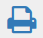

.. |pdf| image:: pics_PCInstruction/PCInstruction_16.png

.. |карандаш| image:: pics_PCInstruction/PCInstruction_17.png

.. contents:: Зміст:
   :depth: 4

---------

Функціонал вкладки **"Баланс та вибір тарифу"** дозволяє в автоматичному чи напівавтоматичному режимі придбати доступ до сервісів провайдера електронного документообігу чи замовити послуги компанії-провайдера; керувати обраними сервісами та тарифними пакетами.

Основними візуальними блоками конструктора тарифів є головне меню (1), панель для роботи з балансом (2) та журнал сервісів/рахунків (3), що змінює свій вигляд в залежності від розділу меню, в якому перебуває користувач:

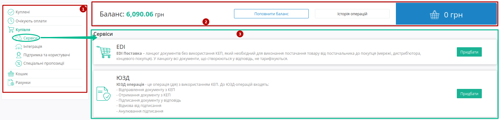

Головне меню **Конструктора тарифів** складається з:

* **Куплені** - активні сервіси/послуги користувача з оплаченим доступом згідно обраного тарифного пакету/кількості доступів.
* **Очікують оплати** - замовлені послуги, по яким був створений рахунок у розділі меню `"Рахунки" <https://wiki.edin.ua/uk/latest/Personal_Cabinet/New_balance_tariff.html#invoice>`__.
* **Купівля** - доступні для придбання тарифні пакети сервісів/послуг, зручно згруповані по категоріям:
   * **Сервіси** - доступні сервіси компанії;
   * **Інтеграція** - рішення та послуги для інтегованої роботи з платфомою EDIN 2.0 з Вашої облікової системи;
   * **Підтримка та користувачі** - підключення підвищеного рівня підтримки та додаткових користувачів до платформи EDIN 2.0;
   * **Спеціальні пропозиції** - спеціальні пропозиції компанії
* **Кошик** - обрані до покупки тарифні пакети.

**1 Вибір тарифу**
================================================

Зручніше всього ознайомитись з цінами на тарифні продукти компанії в розділі меню **Купівля**:

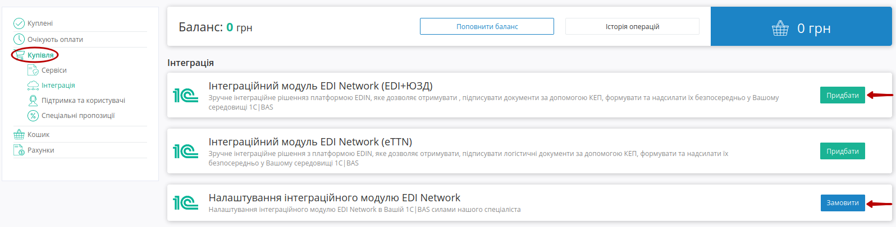

По кожному сервісу/послузі представлена коротка інфомація з перевагами його використання. Дізнатись вартість сервісу/послуги можливо за допомогою кнопок **"Придбати"** чи **"Замовити"**. 

**1.1 Придбання**
------------------------------------------------

У відкритому pop-up вікні потрібно вибрати параметри (період, тарифний план, кількість доступів):

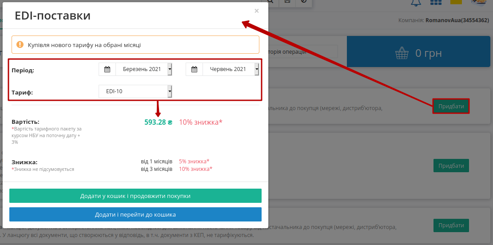

У вікні автоматично відобразиться вартість сервісу/послуги в залежності від обраних параметрів та діючих акційних знижок на момент придбання. Обраний сервіс/послугу можливо додати до кошика (кнопки **"Додати у кошик і продовжити покупки"** чи **"Додати і перейти до кошика"**):

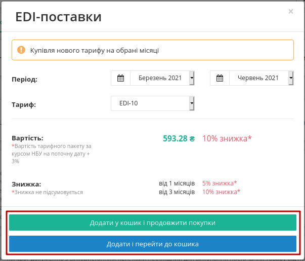

Після чого в розділі меню **"Кошик"** додається помітка з кількістю обраних сервісів/послуг, а в правому верхньому куті відображається загальна їх вартість. В розділі **"Купівля"** додані до **"Кошика"** сервіси мають відповідну помітку і їх можливо вилучити з корзини (кнопка **"Видалити"**):

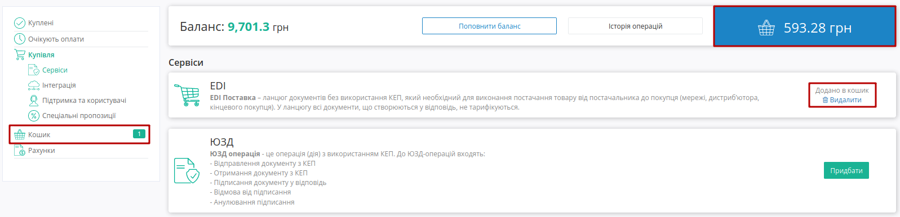

**1.2 Замовлення**
------------------------------------------------

При оформленні замовлення (кнопка **"Замовити"**), на відміну від придбання, додатково можливо вказати інформацію по замовленню (замовлення не потрапляють до **"Кошика"**). Після відправки заявки з Вами зв'яжеться співробітни компанії для обговорення деталей в телефонному режимі:

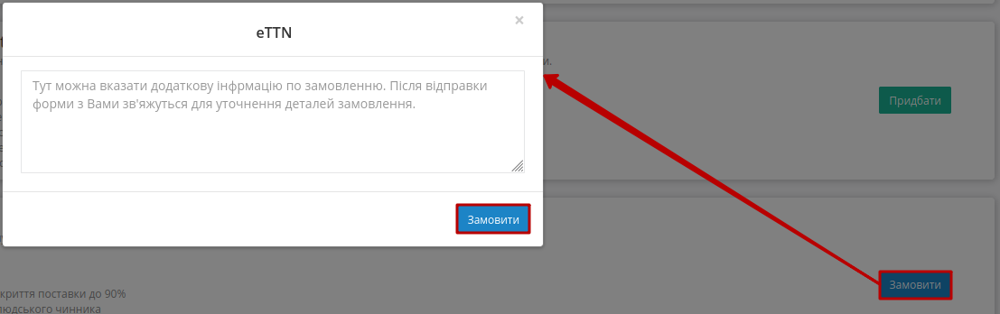

------------------------------------------------

.. hint::
   За замовчуванням активована автоматична пролонгація сервісів при виборі тарифу. При активованій автоматичній пролонгації на початку місяця (1 числа) автоматично продовжується дія обраного тарифного пакету/кількості доступів по сервісу на аналогічний (обраний раніше) період дії на тих самих умовах. (Детальніше в п.6.6 `Правил користування платформою <https://wiki.edin.ua/uk/latest/Legal_info/Rules.html>`__) 

.. _service-purchase:

**2 Придбання сервісу**
================================================

В **"Кошику"** відображаються всі обрані до покупки сервіси. Перейти до **"Кошика"** можливо через меню чи кнопку з вартістю усіх обраних сервісів/послуг:

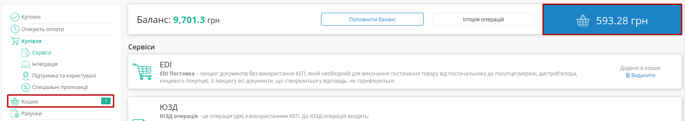

По кожному обраному до покупки сервісу вказується його ціна, знижка; вказується загальна вартість всіх обраних сервісів з урахуванням знижок і рекомендований платіж. За потреби завжди можливо відредагувати параметри обраних сервісів/послуг (кнопка **"Редагувати"**) чи **"Видалити"** з **"Кошика"**:

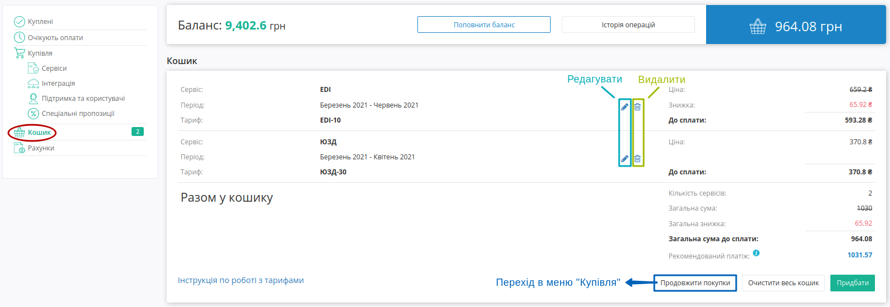

.. hint::
   **"Рекомендований платіж" = Вартість обраного тарифу + 7%**

   Допомагає розрахувати суму поповнення балансу для роботи з обраними сервісами і не є обов'язковим.

Придбання обраних сервісів здійснюється:

1. При достатній кількості коштів на балансі ("сума на балансі" ⩾ "загальної суми до сплати") доступна кнопка **"Придбати"**:

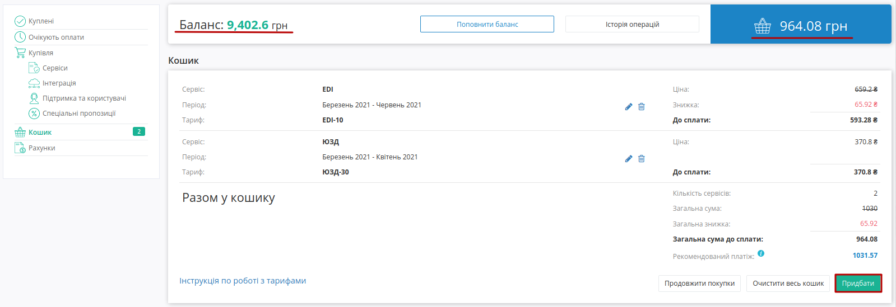

За допомогою кнопки **"Придбати"** здійснюється покупка сервісу з автоматичним списанням коштів з балансу.

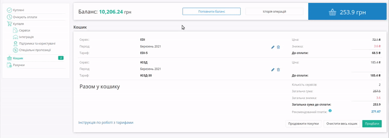

2. Якщо коштів на балансі не достатньо ("сума на балансі" < "загальної суми до сплати"), то доступна кнопка **"Замовити"**:

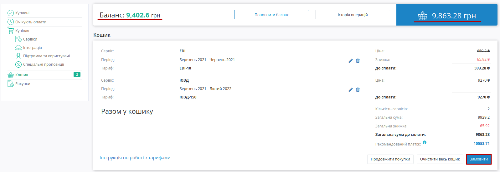

.. _waiting-tariffs:

За допомогою кнопки **"Замовити"** автоматично створюється рахунок, що відображається в розділі меню `"Рахунки" <https://wiki.edin.ua/uk/latest/Personal_Cabinet/PCInstruction.html#invoice>`__, а замовлені сервіси відображаються в розділі меню **"Очікують оплати"**: 

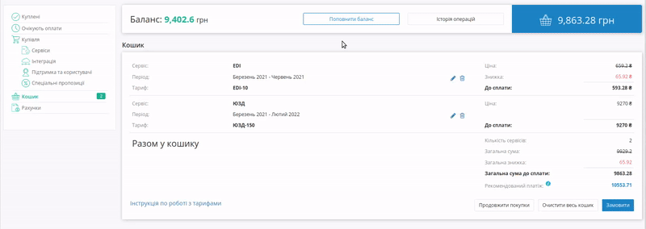

.. important::
   Рахунок на замовлені тарифні пакети, що **"Очікують оплати"** зберігається 7 робочих днів, після чого неоплачені тарифні пакети автоматично видаляються з цього розділу меню.

Здійснити покупку можливо оплативши рахунок (розділ `"Рахунки" <https://wiki.edin.ua/uk/latest/Personal_Cabinet/PCInstruction.html#invoice>`__) в зручний для Вас спосіб або поповнивши баланс (`детальніше <https://wiki.edin.ua/uk/latest/Personal_Cabinet/PCInstruction.html#balance>`__).

.. warning::
   При поповненні балансу, якщо його сума перевищує вартість сервісів/послуг, що **"Очікують оплати"**, то ці кошти списуються автоматично!

В тому випадку, коли загальна вартість замовлених тарифних пакетів перевищує суму на балансі, однак вартість тарифного пакету сервісу менша суми на балансі, то в розділі **"Очікують оплати"** можливо обрати і **"Придбати"** такий тарифний пакет:

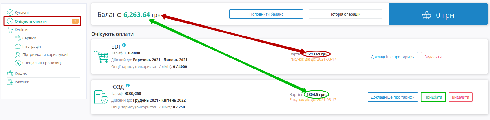

В розділі **"Очікують оплати"** можливо дізнатись **"Докладніше про тарифи"**, що будуть куплені чи **"Видалити"** за потреби обрані тарифні пакети.

.. hint::
   За замовчуванням активована автоматична пролонгація сервісів при виборі тарифу. При активованій автоматичній пролонгації на початку місяця (1 числа) автоматично продовжується дія обраного тарифного пакету/кількості доступів по сервісу на аналогічний (обраний раніше) період дії на тих самих умовах. (Детальніше в п.6.6 `Правил користування платформою <https://wiki.edin.ua/uk/latest/Legal_info/Rules.html>`__).

**3 Докупити/продовжити/змінити тарифний пакет купленого сервісу**
===================================================================

В розділі **"Куплені"** відображаються всі оплачені активні сервіси з інформацією по терміну їх доступності, обраному тарифу, залишок чи кількість (опції) на поточний та інші місяці (кнопка **"Докладніше про тарифи"**):

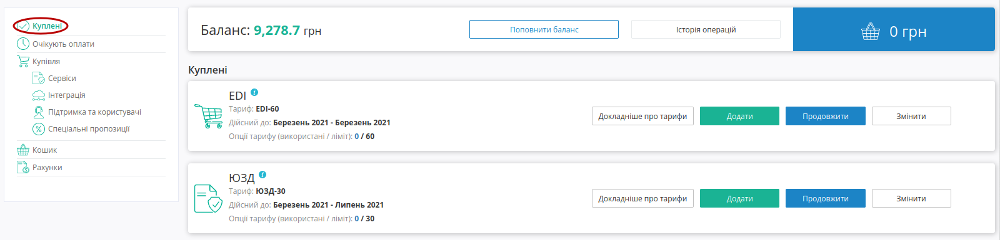

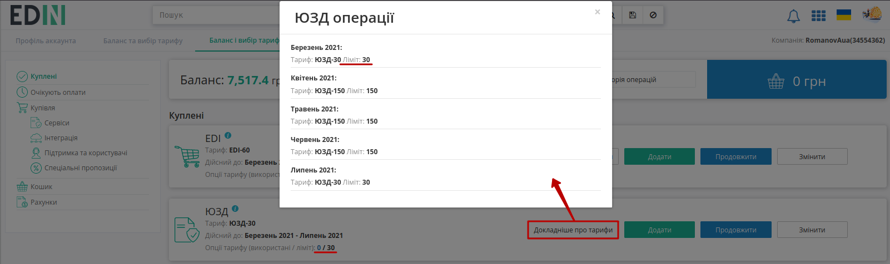

По кліку мишкою на використані транзакції здійснюється перехід до вкладки `"Білінг" <https://wiki.edin.ua/uk/latest/Personal_Cabinet/PCInstruction.html#billing>`__:

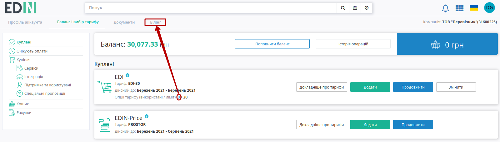

**3.1 Докупити тарифний пакет**
------------------------------------------------

За допомогою кнопки **"Додати"** можливо докупити (додати будь-який додатковий) тарифний пакет до :underline:`поточного місяця`:

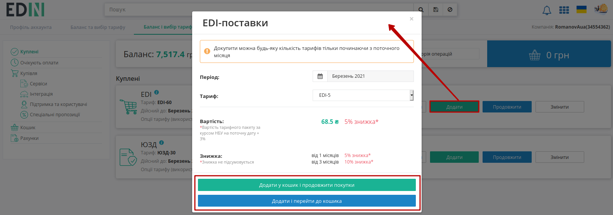

Покупка додаткового тарифного пакету здійснюється через **"Кошик"** (детальніше в розділі `Придбання сервісів <https://wiki.edin.ua/uk/latest/Personal_Cabinet/PCInstruction.html#service-purchase>`__).

**3.2 Продовжити тарифний пакет**
------------------------------------------------

За допомогою кнопки **"Продовжити"** можливо здійснити пролонгацію :underline:`основного тарифу` [1]_ згідно тарифного пакету на поточний місяць (додати такий же тариф (без зміни кількості опцій) на новий період):

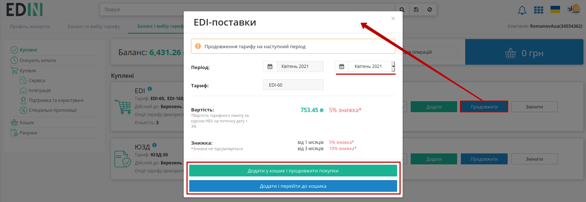

.. important::
   Функція **"Продовжити"** не доступна для :underline:`річних тарифів` [2]_, що вже оплачені більше ніж на 12 місяців.

Продовження тарифного пакету здійснюється через **"Кошик"** (детальніше в розділі `Придбання сервісів <https://wiki.edin.ua/uk/latest/Personal_Cabinet/PCInstruction.html#service-purchase>`__).

**3.3 Змінити тарифний пакет**
------------------------------------------------

За допомогою кнопки **"Змінити"** можливо здійснити зміну :underline:`основного тарифу` [1]_ в обраному періоді (лише в сторону збільшення тарифу):

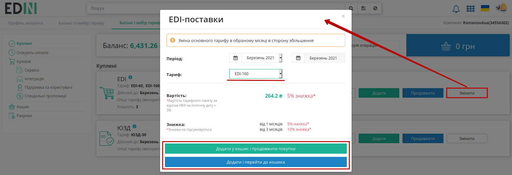

.. note::
   Під зміною тарифного пакету мається на увазі зміна опцій оплаченого сервісу(ів). При зміні вираховується сума, яку потрібно оплатити з урахуванням раніше оплаченого тарифного пакету. Для зміни тарифу на зменшення необхідно зв’язатись з відповідальним менеджером та/або надіслати листа на sales@edin.ua (детальніше в п.6.3 `Правил користування платформою <https://wiki.edin.ua/uk/latest/Legal_info/Rules.html>`__).

Зміна тарифного пакету сервісу здійснюється через **"Кошик"** (детальніше в розділі `Придбання сервісів <https://wiki.edin.ua/uk/latest/Personal_Cabinet/PCInstruction.html#service-purchase>`__).

.. _balance:

**4 Поповнення балансу**
================================================

Панель для роботи з балансом відображає поточний стан коштів на балансі для здійснення покупок тарифних пакетів чи послуг провайдера електронного документообігу:

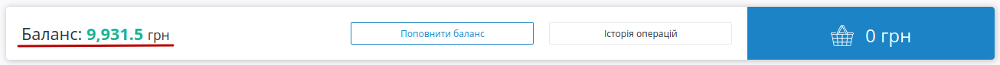

Для **"Поповнення балансу"** потрібно вказати суму поповнення та натиснути кнопку **"Створити рахунок"**:

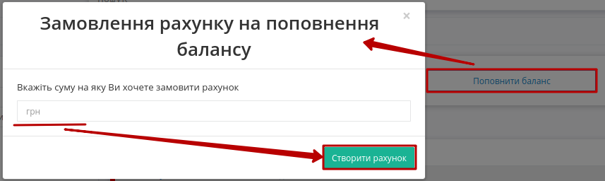

Після чого системою автоматино створюється рахунок-фактура (детальніше в описі розділу меню `"Рахунки" <https://wiki.edin.ua/uk/latest/Personal_Cabinet/New_balance_tariff.html#invoice>`__):

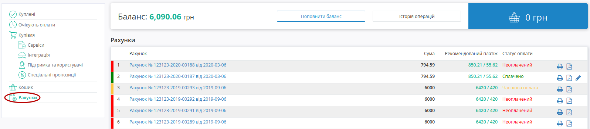

.. hint::
   При створенні рахунку він також автоматично відправляється на пошту.

По всім здійсненим операціям з балансом ведеться **"Історія операцій"** (має зручний пошук):

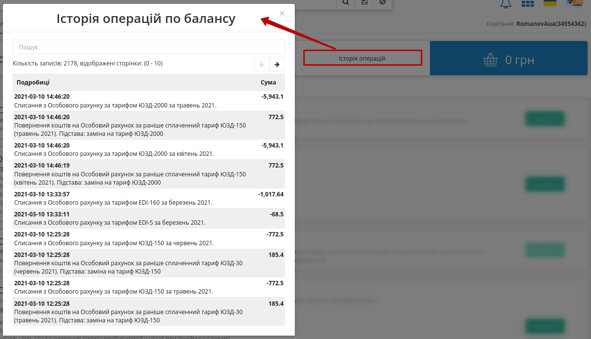

.. _invoice:

**5 Рахунки**
================================================

WEB-платформа завжди нагадає, якщо у Вас є неоплачені рахунки і допомагає в один клік їх переглянути (текст для зручності є посиланням в підрозділ з рахунками):

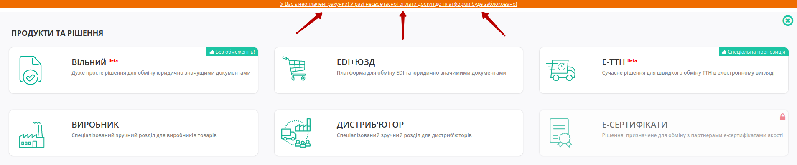

.. attention::
   Вартість сервісів та послуг компанії-провайдера зафіксована в євро валюті і на момент формування суми рахунку відбувається конвертація вартості в гривневий еквівалент згідно курсу валют на поточний день. Формування рахунків:
   
   1) **Після оформлення замовлення** (кнопка **"Замовити"** в Кошику) сума рахунку фіксується на 7 робочих (не календарних) днів. На восьмий робочий день неоплачений рахунок вважається анульованим. При оплаті рахунку після на восьмий день і пізніше кошти поступають на Баланс. Для активації послуги потрібно заново обрати і **"Придбати"** послугу (буде здійснено перерахунок вартості тарифу згідно нового валютного курсу).
   
   2) **При формуванні рахунку за автопролонгацією** (1-го робочого дня місяця) по курсу на цей день рахунок зберігається до кінця місяця. Щоденно за 5 робочих днів до закінчення місяця виконується додаткова перевірка. У разі відсутності активованого тарифного пакету на наступний місяць та в разі відсутності обраних, але ще не активованих тарифних пакетів на наступний місяць на момент перевірки - формується рахунок за автопролонгацією терміном дії 7 робочих днів.

В розділі **"Рахунки"** документи позначаються різним кольором в залежності від статусу [3]_ (:red:`Неоплачений` / :green:`Сплачений` / :orange:`Часткова оплата`) з зазначеними сумою, сумою з рекомендованим платежем / рекомендованим платежем (7% від суми):

В журналі доступний функціонал друку (|друк|), скачування документа в форматі pdf (|pdf|) та можливість запросити оригінал (|карандаш|) для сплаченого рахунку.

Лівою кнопкою миші можливо обрати рахунок, щоб переглянути його вміст:

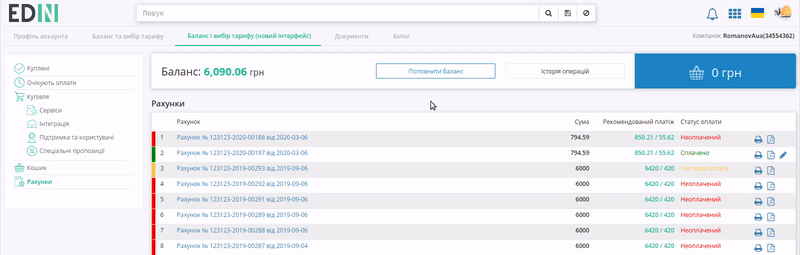

-------------------------------------

.. [#] **Основний тариф** - тарифний пакет сервісу, що був вперше куплений на обраний період.
   
.. [#] **Річний тариф** - тарифний пакет, що продається одразу терміном на один рік, наприклад, Е-Сертифікати (EDIN-Certificate).

.. [#] Статус виставлених рахунків встановлюється зі сторони компанії-провайдера.  

-------------------------------------

.. include:: /_constant/kontakti.rst
