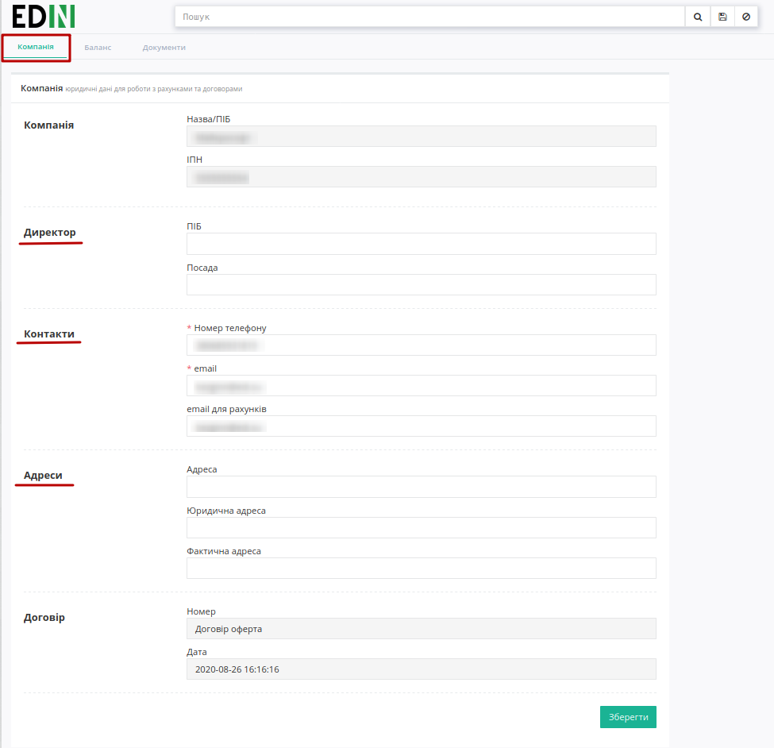
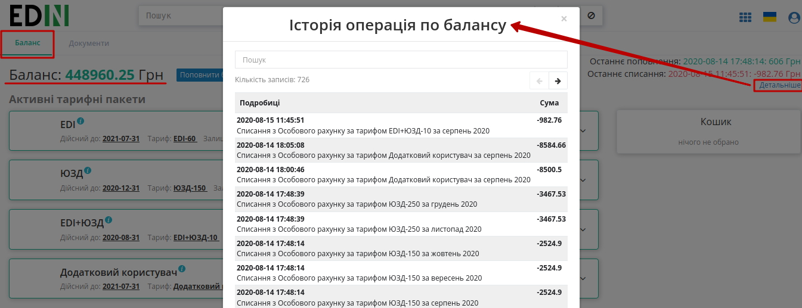
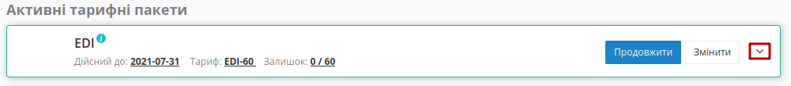
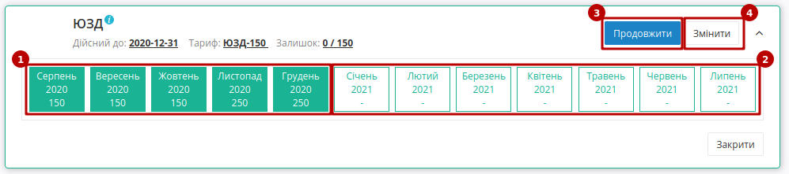
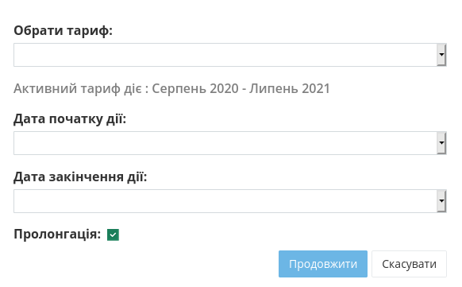
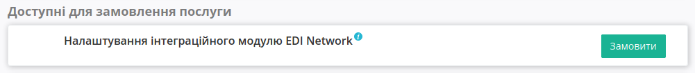

Інструкція
#############################################################

.. role:: red

.. role:: orange

.. role:: green

.. role:: underline

.. сюда закину немного картинок для текста

.. |пресуха| image:: pics_PCInstruction/PCInstruction_03.png

.. |детальніше| image:: pics_PCInstruction/PCInstruction_05.png

.. |мусорка| image:: pics_PCInstruction/PCInstruction_11.png

.. |друк| image:: pics_PCInstruction/PCInstruction_15.png

.. |pdf| image:: pics_PCInstruction/PCInstruction_16.png

.. |карандаш| image:: pics_PCInstruction/PCInstruction_17.png

.. contents:: Зміст:
   :depth: 2

---------

Для початку роботи з "Особистим кабінетом" необіхдно здійснити вхід на платформу EDIN 2.0. Ви можете використовувати будь-який браузер (рекомендованим є **Google Chrome** останньої версії). Для входу до платформи необхідно перейти за посиланням https://edo-v2.edi-n.com/auth .

При переході за вказаним посиланням відкриється вікно авторизації. Необхідно ввести Ваш логін і пароль користувача і натиснути **"Вхід"**, як це зазначено на зображенні нижче:

.. image:: pics_PCInstruction/PCInstruction_01.png
   :align: center

Після успішної авторизації відкриється основне меню, що містить розділи "Сервіси", "Додаткові сервіси" та "Особистий кабінет" для вибору сервісу платформи EDIN: **"EDI", "ETTN", "Виробник", "Дистриб'ютор", "Сертифікати", "Е-Специфікація", "Товари", "DOCflow", "Tender", "Wiki"**. 

"Особистий кабінет" складається з трьох розділів: **"Акаунт"**, **"Налаштування"** і **"Контрагенти"**: 

.. image:: pics_PCInstruction/PCInstruction_02.png
   :align: center

.. hint::
        Для повернення до меню сервісів можливо скористатись кнопкою |пресуха|

**Аккаунт**
================================================

Розділ **"Аккаунт"** - це розділ Особистого кабінету клієнта, який призначений для взаємодії з провайдером, отримання та підписання документів від провайдера, керування Особовим рахунком (Балансом), вибору, зміни та налаштування тарифних пакетів. Підрозділ **"Аккаунт"** містить три основні вкладки: **"Компанія"**, **"Баланс"** та **"Документи"**. 

.. note::
   Розділ **"Аккаунт"** доступний лише для користувачів, котрі використовують Нову тарифну модель. Для підключення нової тарифної моделі Вам необхідно надіслати листа на електронну адресу sales@edi-n.com .

**Компанія**
----------------------------------

Вкладка відображає юридичні дані компанії для роботи з рахунками та договорами (ці дані частково заповнюються при `реєстрації на платформі <https://wiki.edi-n.com/uk/latest/general_2_0/User_registration.html>`__):

На вкладці **"Компанії"** можливо додати дані про **Директора** компанії, відредагувати раніше введені **Контакти** користувача та заповнити **Адреси**.

**Баланс**
----------------------------------

На вкладці представлені дані по балансу користувача, функціонал для його поповнення (кнопка "Поповнити баланс"). Можливо переглянути "Історію операцій по балансу" (кнопка "Детальніше"):

.. note::
        **Конструктор тарифів** - це функціонал, що дозволяє в автоматичному чи напівавтоматичному режимі придбати доступ до сервісів провайдера електронного документообігу чи замовити послуги компанії-провайдера; керувати обраними сервісами та тарифними пакетами.

В **Конструктор тарифів** входять:

#. **Активні тарифні пакети** - активні сервіси користувача з оплаченим доступом згідно обраного тарифного пакету/кількості доступів.
#. **Доступні для покупки тарифні пакети** - сервіси для доступу до яких потрібно обрати і оплатити тарифний пакет.
#. **Доступні для замовлення послуги** - послуги, що надає компанія-провайдер за індивідуальним замовленням.

В **Активних тарифних пакетах** відображається інформація по терміну доступності до сервісу, обраному тарифу, залишок чи кільксть (опції). При детальному перегляді обраного сервісу (кнопка |детальніше|) відкривається функціонал для керування доступом до сервісу:

При перегляді стану активного сервісу зеленим кольором відображаються оплачений період (1) з можливістю розширення періоду доступу в межах року (2) і його "Продовження" (3) згідно обраного раніше тарифного плану.

В **Активних тарифних пакетах** також можливо "Змінити" (4) тарифний пакет/кількість доступів на вказаний період (помісячно впродовж року):

.. note::
        За допомогою особистого кабінету тариф можливо змінити тільки у більшу сторону. Під зміною тарифного пакету мається на увазі зміна опцій оплаченого сервісу(ів). Для зміни тарифу на зменшення необхідно зв’язатись з відповідальним менеджером та/або надіслати листа на sales@edi-n.com (детальніше в п.6.3 `Правил користування платформою <https://wiki.edi-n.com/uk/latest/Legal_info/Rules.html>`__)

В **Доступних для покупки тарифних пакетах** можливо обрати сервіс та "Придбати" (1) доступ до нього на обраний період (2) зідно обраного тарифного пакету/кількості доступів (3):

.. image:: pics_PCInstruction/PCInstruction_08.png
   :align: center

.. image:: pics_PCInstruction/PCInstruction_09.png
   :align: center

.. attention::
        При виборі деяких сервісів (EDIN-Price, EDIN-Certificate), ліцензій на інтеграційні 1С-модулі відсутній вибір періоду (**доступ до сервісу надається лише на період в 1 рік**)!

.. hint::
        За замовчуванням активована автоматична пролонгація сервісів при виборі тарифу. При активованій автоматичній пролонгації на початку місяця (1 числа) автоматично продовжується дія обраного тарифного пакету/кількості доступів по сервісу на аналогічний (обраний раніше) період дії на тих самих умовах. (Детальніше в п.6.6 `Правил користування платформою <https://wiki.edi-n.com/uk/latest/Legal_info/Rules.html>`__) 

Коли обрано період і тарифний пакет/кількість доступів після натискання на активну кнопку "Додати до кошику" автоматично додається і підраховується вартість кожного обраного сервісу, загальна вартість і рекомендований платіж ((Вартість обраного тарифу – Залишок на Особовому рахунку) + 20%), що в якості підказки (з запасом) допомагає розрахувати суму поповнення балансу для роботи з обраними сервісами і є необов'язковим:

.. image:: pics_PCInstruction/PCInstruction_10.png
   :align: center

Кошик дозволяє перевірити вартість обраних сервісів і підтвердити їх покупку кнопкою **"Замовити"**. За потреби завжди можливо видалити обрані сервіси з кошика (кнопка |мусорка|) чи зі списку "Доступні для покупки тарифні пакети" (кнопка **"Видалити"**). В разі нестачі коштів на Особовому рахунку (Балансі) – доступ не активується.

.. important::
        Вартість сервісів та послуг компанії-провайдера зафіксована в євро валюті і на момент формування суми рахунку відбувається конвертація вартості в гривневий еквівалент згідно курсу валют на поточний день. Після оформлення замовлення (кнопка **"Замовити"** в Кошику) сума рахунку фіксується на 5 днів (на шостий день неоплачений рахунок вважається анульованим).

Для **Доступних для замовлення послуг** не вказується їх вартість, оскільки такі послуги для користувачів індивідуальні. При натисканні на кнопку **"Замовити"** в відділ по роботі з клієнтами відправляється лист для встановлення зв'язку з користувачем та обговорення деталей по наданню послуги. 

----------------------------------

**Документи**
----------------------------------

WEB-платформа завжди нагадає, якщо у Вас є неоплачені рахунки і допомагає в один клік їх переглянути (текст для зручності є посиланням в підрозділ **"Документи"**):

.. image:: pics_PCInstruction/PCInstruction_20.png
   :align: center

Функціонал вкладки **"Документи"** дозволяє обмінюватись документами (актами, рахунками) з компанією-провайдером АТС для отримання послуг електронного обміну документами і розділений на два основні блоки: каталоги (1) та журнал документів (2):

.. image:: pics_PCInstruction/PCInstruction_13.png
   :align: center

#. Папка "Вхідні" містить всі вхідні документи від компанії-провайдера для їх подальшого підписання ("Акти наданих послуг" (`COMDOC_013 <https://wiki.edi-n.com/uk/latest/XML/XML-structure.html#comdoc-018>`__) та "Податкові накладні" (`DECLAR <https://wiki.edi-n.com/uk/latest/XML/XML-structure.html#declar>`__)).
#. Папка "Надіслані" містить всі відправлені документи для компанії-провайдера.
#. Папка "Архів" містить всі архівні і оброблені документи, які перенесені в архів.
#. Папка "Рахунки" містить рахунки від компанії-провайдера для своєчасної оплати доступу.
#. Папка "Договори/ДУ з КЕП" містить файли договорів/додаткових угод з КЕП (кваліфікованим електронним підписом)
#. Окремо винесені фільтри документів по даті (**"Сьогодні"**, **"Вчора"**), а останній введений пошук зберігається платформою автоматично і при натисканні кнопки **"Останній фільтр"** він виконується повторно в тій папці ("Вхідні" / "Надіслані" / "Архів" / "Рахунки" / "Договори/ДУ з КЕП"), в якій він був виконаний останнього разу (Вас буде переадресовано)

В папці "Рахунки" документи позначаються різним кольором в залежності від статусу (:red:`Неоплачений` / :green:`Сплачений` / :orange:`Часткова оплата`), доступний функціонал друку (|друк|), скачування документа в форматі pdf (|pdf|) та можливысть запросити оригінал (|карандаш|):

.. image:: pics_PCInstruction/PCInstruction_14.png
   :align: center

.. include:: kontakti.rst
