Інструкція
#############################################################

.. role:: red

.. role:: orange

.. role:: green

.. role:: underline

.. сюда закину немного картинок для текста

.. |пресуха| image:: pics_PCInstruction/PCInstruction_03.png

.. |детальніше| image:: pics_PCInstruction/PCInstruction_05.png

.. |мусорка| image:: pics_PCInstruction/PCInstruction_11.png

.. |друк| image:: pics_PCInstruction/PCInstruction_15.png

.. |pdf| image:: pics_PCInstruction/PCInstruction_16.png

.. |карандаш| image:: pics_PCInstruction/PCInstruction_17.png

.. |bloсked| image:: pics_PCInstruction/PCInstruction_31.png

.. contents:: Зміст:
   :depth: 4

---------

Для початку роботи з "Особистим кабінетом" необіхдно здійснити вхід на платформу EDIN 2.0. Ви можете використовувати будь-який браузер (рекомендованим є **Google Chrome** останньої версії). Для входу до платформи необхідно перейти за посиланням https://edo-v2.edin.ua/auth .

При переході за вказаним посиланням відкриється вікно авторизації. Необхідно ввести Ваш логін і пароль користувача і натиснути **"Вхід"**, як це зазначено на зображенні нижче:

.. image:: pics_PCInstruction/PCInstruction_37.png
   :align: center

Після успішної авторизації відкриється основне меню, що містить розділи "Сервіси", "Додаткові сервіси" та "Особистий кабінет" для вибору сервісу платформи EDIN: **"EDI", "ETTN", "Виробник", "Дистриб'ютор", "Сертифікати", "Е-Специфікація", "Товари", "DOCflow", "Tender", "Wiki"**. 

"Особистий кабінет" складається з трьох розділів: **"Акаунт"**, **"Налаштування"** і **"Контрагенти"**: 

.. image:: pics_PCInstruction/PCInstruction_02.png
   :align: center

.. hint::
   Для повернення до меню сервісів можливо скористатись кнопкою |пресуха|

**1 Аккаунт**
================================================

.. hint::
   В розділ також можливо перейти в два кліки з іконки користувача:

   .. image:: pics_PCInstruction/PCInstruction_38.png
      :align: center

Розділ **"Аккаунт"** - це розділ Особистого кабінету клієнта, який призначений для взаємодії з провайдером, отримання та підписання документів від провайдера, керування Особовим рахунком (Балансом), вибору, зміни та налаштування тарифних пакетів. Підрозділ **"Аккаунт"** містить три основні вкладки: **"Компанія"**, **"Баланс"** та **"Документи"**. 

.. note::
   Розділ **"Аккаунт"** доступний лише для користувачів, котрі використовують Нову тарифну модель. Для підключення нової тарифної моделі Вам необхідно надіслати листа на електронну адресу sales@edin.ua .

**1.1 Профіль аккаунта**
----------------------------------

Вкладка відображає юридичні дані компанії для роботи з рахунками та договорами (ці дані частково заповнюються при `реєстрації на платформі <https://wiki.edin.ua/uk/latest/general_2_0/User_registration.html>`__):

.. image:: pics_PCInstruction/PCInstruction_40.png
   :align: center

На вкладці **"Профіль аккаунта"** можливо додати дані про **Директора** компанії, відредагувати раніше введені **Контакти** користувача та заповнити **Адреси**. Поля обов'язкові до заповнення позначені червоною зірочкою :red:`*`.

**1.2 Баланс та вибір тарифу**
----------------------------------

На вкладці представлені дані по балансу користувача, історія балансу, функціонал для його поповнення, активні/замовлені/доступні тарифні пакети.

.. note::
   **Конструктор тарифів** - це функціонал, що дозволяє в автоматичному чи напівавтоматичному режимі придбати доступ до сервісів провайдера електронного документообігу чи замовити послуги компанії-провайдера; керувати обраними сервісами та тарифними пакетами.

В **Конструктор тарифів** входять:

#. **Активні тарифні пакети** - активні сервіси користувача з оплаченим доступом згідно обраного тарифного пакету/кількості доступів.
#. **Доступні для придбання тарифні пакети** - сервіси для доступу до яких потрібно обрати і оплатити тарифний пакет (кнопка **"Придбати"**); послуги, що надає компанія-провайдер за індивідуальним замовленням (кнопка **"Замовити"**).
#. **Тарифні пакети, які очікують оплати (діє 5 днів)** - замовлені тарифні пакети, по яким був створений рахунок у вкладці `"Документи" <https://wiki.edin.ua/uk/latest/Personal_Cabinet/PCInstruction.html#docs>`__ (очікують підтвердження оплати) - `прочитати детальніше <https://wiki.edin.ua/uk/latest/Personal_Cabinet/PCInstruction.html#waiting-tariffs>`__.

**1.2.1 Активні тарифні пакети**
~~~~~~~~~~~~~~~~~~~~~~~~~~~~~~~~~~~~~~~~~~~~~~~~~~~~~~

В **Активних тарифних пакетах** відображається інформація по терміну доступності до сервісу, обраному тарифу, залишок чи кільксть (опції). При детальному перегляді обраного сервісу (кнопка |детальніше|) відкривається функціонал для керування доступом до сервісу. Зеленим кольором відображаються оплачений період (2) з можливістю розширення опцій доступу чи **"Продовженням"** використання сервісу (3) згідно заздалегідь обраного тарифного плану.

В **Активних тарифних пакетах** можливо:

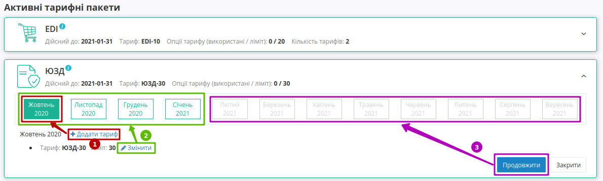

1) **"+Додати тариф"** - додавання лише в :underline:`поточний місяць` додаткового тарифу (необхідно обрати тариф):

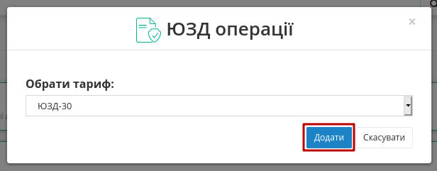

2) **"Змінити"** - зміна обраного тарифу :underline:`для будь-якого місяця оплаченого періоду` (необхідно обрати тариф):

.. image:: pics_PCInstruction/PCInstruction_47.png
   :align: center

.. note::
   За допомогою особистого кабінету тариф можливо змінити тільки у більшу сторону. Під зміною тарифного пакету мається на увазі зміна опцій оплаченого сервісу(ів). Для зміни тарифу на зменшення необхідно зв’язатись з відповідальним менеджером та/або надіслати листа на sales@edin.ua (детальніше в п.6.3 `Правил користування платформою <https://wiki.edin.ua/uk/latest/Legal_info/Rules.html>`__)

.. attention::
   При **"Зміні"** тарифу (розширенні) встроєним в web функціоналом відбувається автоматичне списання коштів з балансу (подробиці в "Історії операцій"), однак якщо суми для автоматичної **"Зміни"** не достатньо, то буде створено рахунок у вкладці `"Документи" <https://wiki.edin.ua/uk/latest/Personal_Cabinet/PCInstruction.html#docs>`__. Після оплати рахунку потрібно ще раз зайти на платформу та повторно натиснути **"Змінити"** для списання коштів з балансу.

3) **"Продовжити"** - придбання вказаного сервісу на подальші періоди (можливо обрати тариф/кількості доступів, вказати період для розрахунку вартості сервісу):

.. image:: pics_PCInstruction/PCInstruction_48.png
   :align: center

За допомогою кнопки **"Придбати"** здійснюється покупка сервісу з автоматичним списанням коштів з балансу.

.. image:: pics_PCInstruction/PCInstruction_49.png
   :align: center

.. hint::
   **"Рекомендований платіж" = (Вартість обраного тарифу – Залишок на Особовому рахунку) + 20%)**
   
   Допомагає розрахувати суму поповнення балансу для роботи з обраними сервісами і не є обов'язковим.

Якщо вартість по сервісу перевищує наявні на балансу кошти, то система автоматично пропонує "Рекомендований платіж" для поповнення рахунку, а замість **"Придбати"** кнопка **"Замовити"** автоматично створює рахунок, що відображається у вкладці `"Документи" <https://wiki.edin.ua/uk/latest/Personal_Cabinet/PCInstruction.html#docs>`__, а замовлений сервіс відображається в **"Тарифних пакетах, які очікують оплати (діє 5 днів)"** (детальніше за `посиланням <https://wiki.edin.ua/uk/latest/Personal_Cabinet/PCInstruction.html#waiting-tariffs>`__)

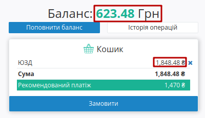

.. hint::
   За замовчуванням активована автоматична пролонгація сервісів при виборі тарифу. При активованій автоматичній пролонгації на початку місяця (1 числа) автоматично продовжується дія обраного тарифного пакету/кількості доступів по сервісу на аналогічний (обраний раніше) період дії на тих самих умовах. (Детальніше в п.6.6 `Правил користування платформою <https://wiki.edin.ua/uk/latest/Legal_info/Rules.html>`__) 

**1.2.2 Доступні для придбання тарифні пакети та сервіси**
~~~~~~~~~~~~~~~~~~~~~~~~~~~~~~~~~~~~~~~~~~~~~~~~~~~~~~

В **Доступних для покупки тарифних пакетах** можливо обрати **"Придбати"** сервіс чи **"Замовити"** послугу.

.. image:: pics_PCInstruction/PCInstruction_52.png
   :align: center

.. hint::
   За замовчуванням активована автоматична пролонгація сервісів при виборі тарифу. При активованій автоматичній пролонгації на початку місяця (1 числа) автоматично продовжується дія обраного тарифного пакету/кількості доступів по сервісу на аналогічний (обраний раніше) період дії на тих самих умовах. (Детальніше в п.6.6 `Правил користування платформою <https://wiki.edin.ua/uk/latest/Legal_info/Rules.html>`__) 

**"Придбати"** - придбання вказаного сервісу на подальші періоди (можливо обрати тариф/кількості доступів, вказати період для розрахунку вартості сервісу):

.. image:: pics_PCInstruction/PCInstruction_54.png
   :align: center

За допомогою кнопки **"Придбати"** здійснюється покупка сервісу з автоматичним списанням коштів з балансу.

.. image:: pics_PCInstruction/PCInstruction_49.png
   :align: center

.. hint::
   **"Рекомендований платіж" = (Вартість обраного тарифу – Залишок на Особовому рахунку) + 20%)**
   
   Допомагає розрахувати суму поповнення балансу для роботи з обраними сервісами і не є обов'язковим.

Якщо вартість по сервісу перевищує наявні на балансу кошти, то система автоматично пропонує "Рекомендований платіж" для поповнення рахунку, а замість **"Придбати"** кнопка **"Замовити"** автоматично створює рахунок, що відображається у вкладці `"Документи" <https://wiki.edin.ua/uk/latest/Personal_Cabinet/PCInstruction.html#docs>`__, а замовлений сервіс відображається в **"Тарифних пакетах, які очікують оплати (діє 5 днів)"** (детальніше за `посиланням <https://wiki.edin.ua/uk/latest/Personal_Cabinet/PCInstruction.html#waiting-tariffs>`__)

Кошик дозволяє перевірити вартість обраних сервісів і підтвердити їх покупку кнопкою **"Замовити"**. За потреби завжди можливо видалити обрані сервіси з кошика чи зі списку "Доступні для покупки тарифні пакети" (кнопка **"Видалити"**):

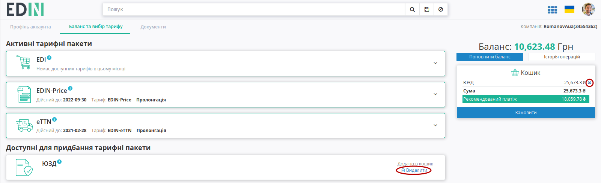

При **"Замовленні"** сервісу додатково можливо вказати інформацію по замовленню. Після відправки заявки на індивідуальну послугу в відділ по роботі з клієнтами відправляється лист в потребі встановлення зв'язку з користувачем та обговорення деталей в телефонному режимі:

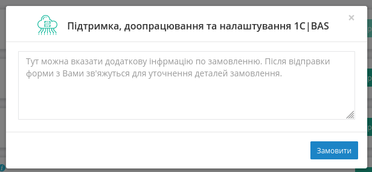

.. _waiting-tariffs:

**1.2.3 Тарифні пакети, які очікують оплати**
~~~~~~~~~~~~~~~~~~~~~~~~~~~~~~~~~~~~~~~~~~~~~~~~~~~~~~

.. attention::
   Вартість сервісів та послуг компанії-провайдера зафіксована в євро валюті і на момент формування суми рахунку відбувається конвертація вартості в гривневий еквівалент згідно курсу валют на поточний день. Після оформлення замовлення (кнопка **"Замовити"** в Кошику) сума рахунку фіксується на 5 днів (на шостий день неоплачений рахунок вважається анульованим) - при оплаті рахунку після 5 дня буде здійснено перерахунок вартості тарифу згідно нового валютного курсу.

В **Тарифних пакетах, які очікують оплати** можливо перевірити дані замовлення (тариф/період сервісу) чи **"Видалити"** помилково замовлений сервіс:

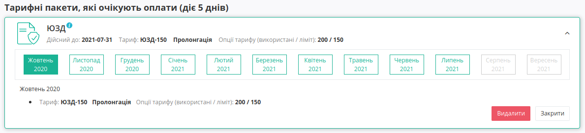

При **"Поповненні балансу"** потрібно вказати суму поповнення та натиснути кнопку **"Створити рахунок"**:

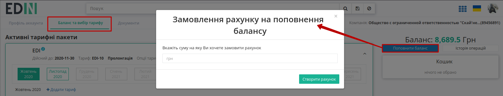

Після чого системою автоматино створюється рахунок-фактура (детальніше в описі вкладки `"Документи" <https://wiki.edin.ua/uk/latest/Personal_Cabinet/PCInstruction.html#docs>`__):

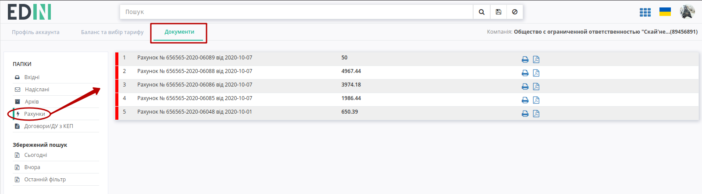

Користувачу доступна **"Історія здійснених операцій"**:

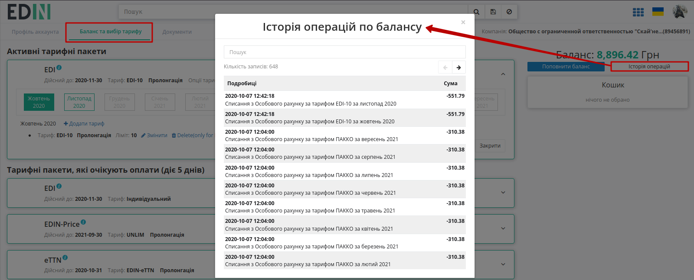

----------------------------------

.. _docs:

**1.3 Документи**
----------------------------------

WEB-платформа завжди нагадає, якщо у Вас є неоплачені рахунки і допомагає в один клік їх переглянути (текст для зручності є посиланням в підрозділ **"Документи"**):

.. image:: pics_PCInstruction/PCInstruction_20.png
   :align: center

Функціонал вкладки **"Документи"** дозволяє обмінюватись документами (актами, рахунками) з компанією-провайдером АТС для отримання послуг електронного обміну документами і розділений на два основні блоки: каталоги (1) та журнал документів (2):

.. image:: pics_PCInstruction/PCInstruction_13.png
   :align: center

#. Папка "Вхідні" містить всі вхідні документи від компанії-провайдера для їх подальшого підписання ("Акти наданих послуг" (`COMDOC_013 <https://wiki.edin.ua/uk/latest/XML/XML-structure.html#comdoc-018>`__) та "Податкові накладні" (`DECLAR <https://wiki.edin.ua/uk/latest/XML/XML-structure.html#declar>`__)).
#. Папка "Надіслані" містить всі відправлені документи для компанії-провайдера.
#. Папка "Архів" містить всі архівні і оброблені документи, які перенесені в архів.
#. Папка "Рахунки" містить рахунки від компанії-провайдера для своєчасної оплати доступу.
#. Папка "Договори/ДУ з КЕП" містить файли договорів/додаткових угод з КЕП (кваліфікованим електронним підписом)
#. Окремо винесені фільтри документів по даті (**"Сьогодні"**, **"Вчора"**), а останній введений пошук зберігається платформою автоматично і при натисканні кнопки **"Останній фільтр"** він виконується повторно в тій папці ("Вхідні" / "Надіслані" / "Архів" / "Рахунки" / "Договори/ДУ з КЕП"), в якій він був виконаний останнього разу (Вас буде переадресовано)

В папці "Рахунки" документи позначаються різним кольором в залежності від статусу (:red:`Неоплачений` / :green:`Сплачений` / :orange:`Часткова оплата`), доступний функціонал друку (|друк|), скачування документа в форматі pdf (|pdf|) та можливысть запросити оригінал (|карандаш|):

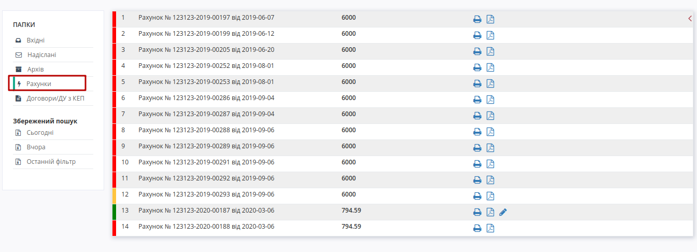

**2 Налаштування**
================================================

.. hint::
   В розділ також можливо перейти в два кліки з іконки користувача:

   .. image:: pics_PCInstruction/PCInstruction_39.png
      :align: center

Розділ дозволяє налаштовувати платформу, окремі сервіси, керувати компаніями, GLN-ами, користувачами та їх повноваженнями.

**2.1 GLN**
----------------------------------

В налаштуваннях **"GLN"** відображаються дані (Номер, Назва, Місто, Вулиця) по всім доданим GLN-ам, присутня можливість редагувати існуючі GLN (клік мишкою на номер) та додати до платфоми нові GLN:

.. image:: pics_PCInstruction/PCInstruction_22.png
   :align: center

При створенні нового GLN відкриється вікно з полями для заповнення, обов'язковим серед яких є лише "Назва", що буде відображатись контрагентам (відмічене червоною зірочкою :red:`*`):

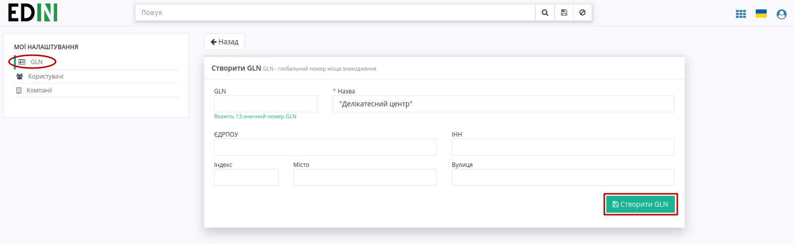

.. important::
   При **"Cтворенні GLN"** з незаповненим полем "GLN" його значення автоматично генерується платформою EDIN 2.0. Номер GLN на відміну від решти даних неможливо відредагувати (лише додати).

Після створення нового GLN автоматично відкривається форма редагування, що дозволяє відредагувати/доповнити інформацію, **"Видалити"** GLN чи додати пов'язаних з ним раніше доданих користувачів. При **"Додаванні користувача"** до GLN відкривається поле з випадаючим списком всіх користувачів в акаунті:

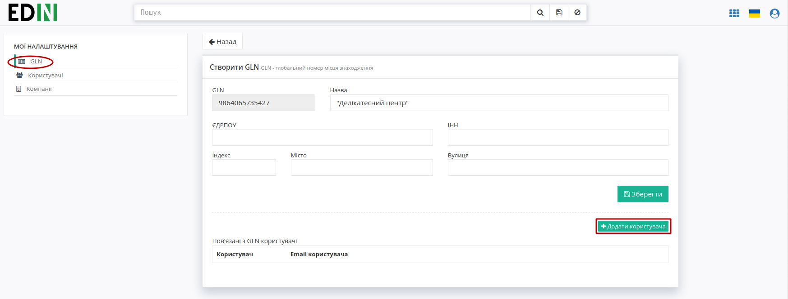

.. image:: pics_PCInstruction/PCInstruction_25n.png
   :align: center

Пов'язані користувачі відображаються у списку. Розірвати зв'язок між користувачем та GLN можливо за допомогою червоної кнопки з іконкою відерця: 

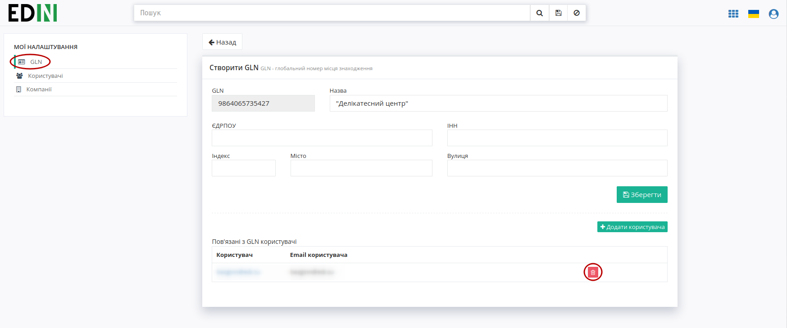

**2.2 Користувачі**
----------------------------------

В підрозділі відображається список всіх користувачів акаунту з їх ПІБ та відміткою про блокування користувача. Присутня можливість редагувати дані існуючих користувачів (клік мишкою на e-mail користувача, що за замовчуванням є і логіном для входу на платформу) та додати нового користувача (кнопка **"Створити"**):

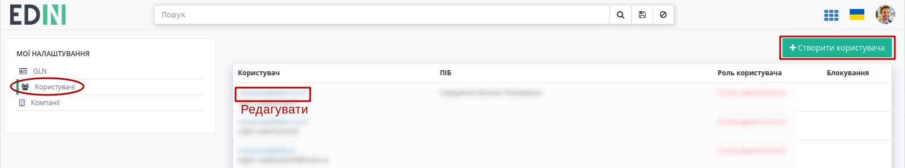

При **створенні** нового користувача відкриється вікно з полями для заповнення, обов'язковими (відмічені червоною зірочкою :red:`*`) серед яких є "Email користувача", "Прізвище" та "Ім'я" та "Роль користувача":

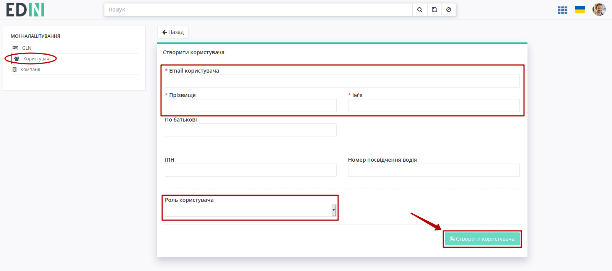

**2.2.1 Ролі користувачів**
~~~~~~~~~~~~~~~~~~~~~~~~~~~~~~~~~~~~~~~~~~~~~~~~~~~~~~

.. note::
   1) Зміна ролей іншим користувачам доступна для **Супер адміністратора** та **Адміністратора**.
   2) Роль користувача не може бути змінена від імені цього користувача.
   3) **Адміністратор** не може змінити роль **Супер адміністратору**.

   * **Супер адміністратор** - необмежений доступ до сервісів та налаштувань. Роль не може бути змінена від імені цього користувача.
   * **Адміністратор** - необмежений доступ до сервісів та налаштувань, окрім розділу "`Аккаунт`_".
   * **Бухгалтер (Фінансист)** - необмежений доступ до розділу Аккаунт та до обраних зі списку сервісів (невідмічені сервіси у користувача не відображаються).
   * **Користувач** - доступ лише до обраних зі списку сервісів (невідмічені сервіси у користувача не відображаються).

   .. image:: pics_PCInstruction/PCInstruction_60.png
      :align: center

.. note::
   Наявність/відсутність відмітки в чекбоксах:
   
   * EDI - одночасно впливає на доступ до EDI и ЮЗД документів;
   * DISTRIBUTION - одночасно впливає на доступ до блоків "Виробник" та "Дистриб'ютор"

.. hint::
   При **"Cтворенні"** нового користувача на вказану електронну пошту відправляється лист з запрошенням: 

   .. image:: pics_PCInstruction/PCInstruction_29.png
      :align: center

Після **створення** нового користувача автоматично відкривається **форма редагування**, що дозволяє змінити/доповнити інформацію, **"Заблокувати"** користувача, повторно **"Згенерувати пароль"** при його втраті:

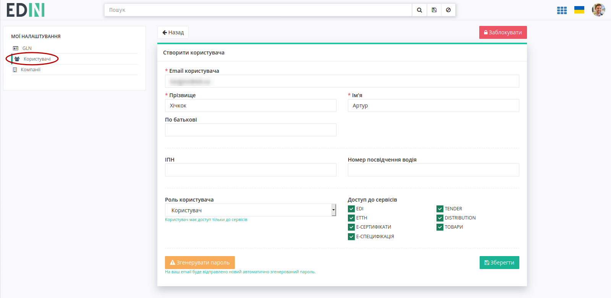

.. hint::
   Заблоковані користувачі помічаються в списку значком |bloсked|. Заблокованих користувачів можливо **"Розблокувати"** при редагуванні обраного користувача

**2.3 Компанії**
----------------------------------

В підрозділі відображається список всіх компаній з короткою інформацією (Назва, ЄДРПОУ, ІПН, Місто, Адреса). Присутня можливість редагувати дані існуючих компаній (клік мишкою на назву компанії) та додати нову компанію (кнопка **"Створити компанію"**):

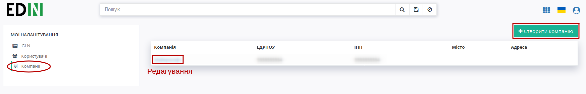

При створенні нової компанії відкриється вікно з полями для заповнення інформації про компанію:

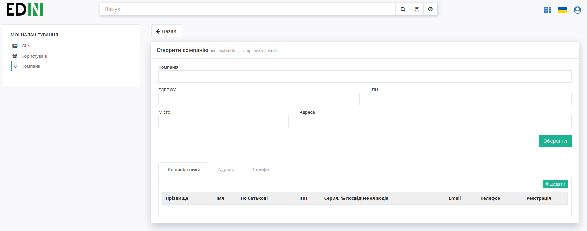

А у вкладках **"Співробітники"**, **"Адреси"** і **"Тарифи"** одразу через кнопку **"Додати"** можливо створювати нових співробітників, додавати нові адреси та створювати `правила тарифікації <https://wiki.edin.ua/uk/latest/ETTN_2_0/Create_act_at_accepted_work.html#additional-functionality>`__ (для сервісу **"Е-ТТН"**) відповідно:   

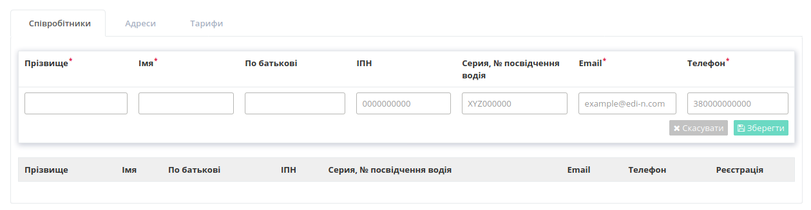

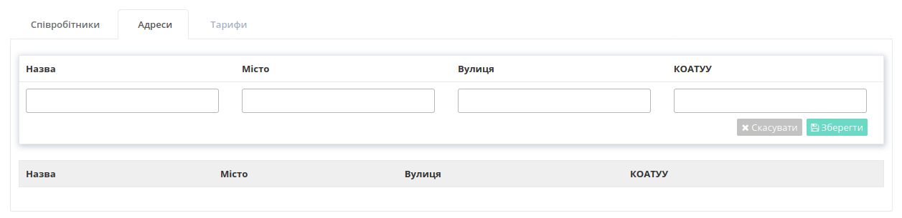

.. image:: pics_PCInstruction/PCInstruction_36.png
   :align: center

-------------------------------------

.. include:: kontakti.rst
