Інструкція
#############################################################

.. role:: red

.. role:: orange

.. role:: green

.. role:: underline

.. сюда закину немного картинок для текста

.. |пресуха| image:: pics_PCInstruction/PCInstruction_03.png

.. |детальніше| image:: pics_PCInstruction/PCInstruction_05.png

.. |мусорка| image:: pics_PCInstruction/PCInstruction_11.png

.. |друк| image:: pics_PCInstruction/PCInstruction_15.png

.. |pdf| image:: pics_PCInstruction/PCInstruction_16.png

.. |карандаш| image:: pics_PCInstruction/PCInstruction_17.png

.. |bloсked| image:: pics_PCInstruction/PCInstruction_31.png

.. |red_trash| image:: pics_PCInstruction/PCInstruction_006.png

.. |drop_pass| image:: signing/drop_pass.png

.. |del_key| image:: signing/del_key2.png

.. contents:: Зміст:
   :depth: 4

---------

Для початку роботи з "Особистим кабінетом" необіхдно здійснити вхід на платформу EDIN 2.0. Ви можете використовувати будь-який браузер (рекомендованим є **Google Chrome** останньої версії). Для входу до платформи необхідно перейти за посиланням https://edo-v2.edin.ua/auth .

При переході за вказаним посиланням відкриється вікно авторизації. Необхідно ввести Ваш логін і пароль користувача і натиснути **"Вхід"**, як це зазначено на зображенні нижче:

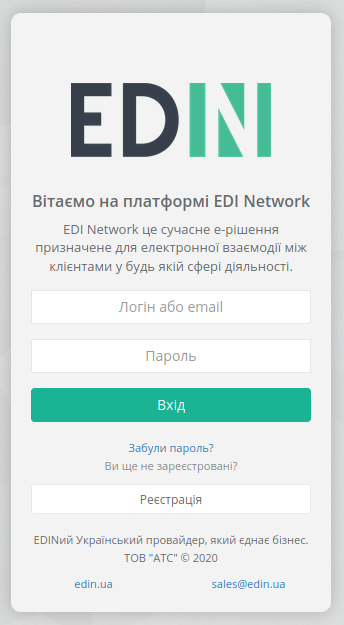

Після успішної авторизації відкриється основне меню, що містить розділи "Сервіси", "Додаткові сервіси" та "Особистий кабінет" для вибору сервісу платформи EDIN: **"EDI", "ETTN", "Виробник", "Дистриб'ютор", "Сертифікати", "Е-Специфікація", "Товари", "DOCflow", "Tender", "Wiki"**. 

"Особистий кабінет" складається з трьох розділів: **"Акаунт"**, **"Налаштування"** і **"Контрагенти"**: 

.. image:: pics_PCInstruction/PCInstruction_02.png
   :align: center

.. hint::
   Для повернення до меню сервісів можливо скористатись кнопкою |пресуха|

.. _account:

**1 Аккаунт**
================================================

.. hint::
   В розділ також можливо перейти в два кліки з іконки користувача:

   .. image:: pics_PCInstruction/PCInstruction_114.png
      :align: center

Розділ **"Аккаунт"** - це розділ Особистого кабінету клієнта, який призначений для взаємодії з провайдером, отримання та підписання документів від провайдера, керування Особовим рахунком (Балансом), вибору, зміни та налаштування тарифних пакетів. Підрозділ **"Аккаунт"** містить три основні вкладки: **"Компанія"**, **"Баланс"** та **"Документи"**. 

.. note::
   Розділ **"Аккаунт"** доступний лише для користувачів, котрі використовують Нову тарифну модель. Для підключення нової тарифної моделі Вам необхідно надіслати листа на електронну адресу sales@edin.ua .

.. _account-profile:

**1.1 Профіль аккаунта**
----------------------------------

Вкладка відображає юридичні дані компанії для роботи з рахунками та договорами (ці дані частково заповнюються при `реєстрації на платформі <https://wiki.edin.ua/uk/latest/general_2_0/User_registration.html>`__):

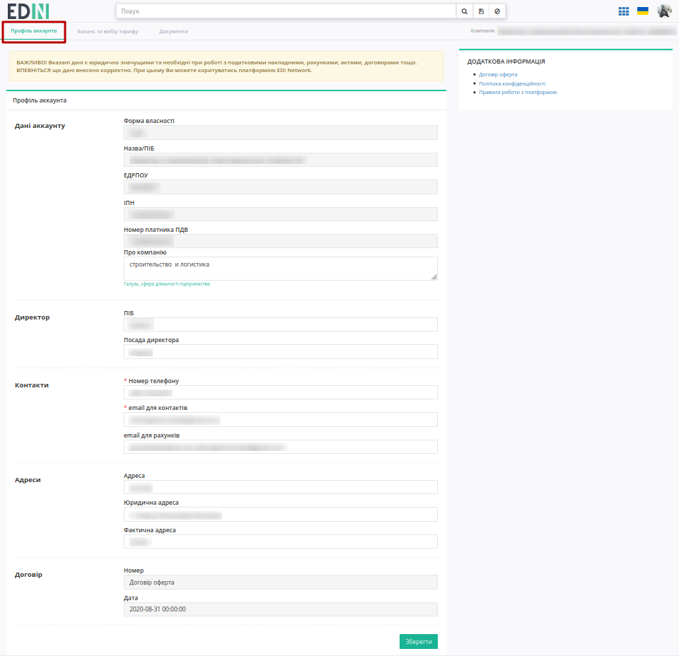

На вкладці **"Профіль аккаунта"** можливо додати дані про **Директора** компанії, відредагувати раніше введені **Контакти** користувача та заповнити **Адреси**. Поля обов'язкові до заповнення позначені червоною зірочкою :red:`*`.

**1.2 Баланс та вибір тарифу**
----------------------------------

.. raw:: html

   

       <iframe src="https://www.youtube.com/embed/n57CmrfT3VA" frameborder="0" allowfullscreen style="position: absolute; top: 0; left: 0; width: 100%; height: 100%;"></iframe>
   

---------

Функціонал вкладки **"Баланс та вибір тарифу"** дозволяє в автоматичному чи напівавтоматичному режимі придбати доступ до сервісів провайдера електронного документообігу чи замовити послуги компанії-провайдера; керувати обраними сервісами та тарифними пакетами.

Основними візуальними блоками конструктора тарифів є головне меню (1), панель для роботи з балансом (2) та журнал сервісів/рахунків (3), що змінює свій вигляд в залежності від розділу меню, в якому перебуває користувач:

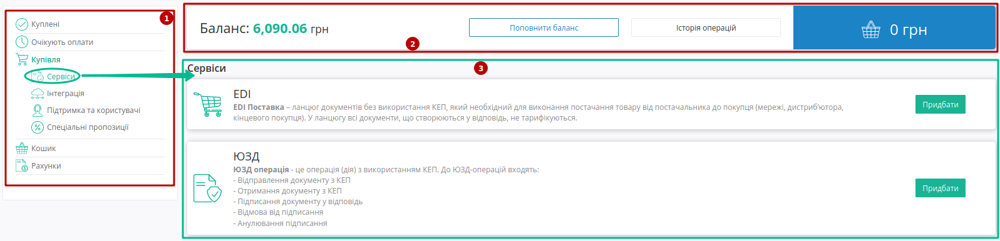

Головне меню **Конструктора тарифів** складається з:

* **Куплені** - активні сервіси/послуги користувача з оплаченим доступом згідно обраного тарифного пакету/кількості доступів.
* **Очікують оплати** - замовлені послуги, по яким був створений рахунок у розділі меню `"Рахунки" <https://wiki.edin.ua/uk/latest/Personal_Cabinet/New_balance_tariff.html#invoice>`__.
* **Купівля** - доступні для придбання тарифні пакети сервісів/послуг, зручно згруповані по категоріям:
   * **Сервіси** - доступні сервіси компанії;
   * **Інтеграція** - рішення та послуги для інтегованої роботи з платфомою EDIN 2.0 з Вашої облікової системи;
   * **Підтримка та користувачі** - підключення підвищеного рівня підтримки та додаткових користувачів до платформи EDIN 2.0;
   * **Спеціальні пропозиції** - спеціальні пропозиції компанії
* **Кошик** - обрані до покупки тарифні пакети.

**1.2.1 Вибір тарифу**
~~~~~~~~~~~~~~~~~~~~~~~~~~~~~~~~~~~~~~~~~~~~~~~~~~~~~~

Зручніше всього ознайомитись з цінами на тарифні продукти компанії в розділі меню **Купівля**:

.. image:: pics_New_balance_tariff/New_balance_tariff_06.png
   :align: center

По кожному сервісу/послузі представлена коротка інфомація з перевагами його використання. Дізнатись вартість сервісу/послуги можливо за допомогою кнопок **"Придбати"** чи **"Замовити"**. 

**1.2.1.1 Придбання**
""""""""""""""""""""""""""""""""""""""""""""""""""""""

У відкритому pop-up вікні потрібно вибрати параметри (період, тарифний план, кількість доступів):

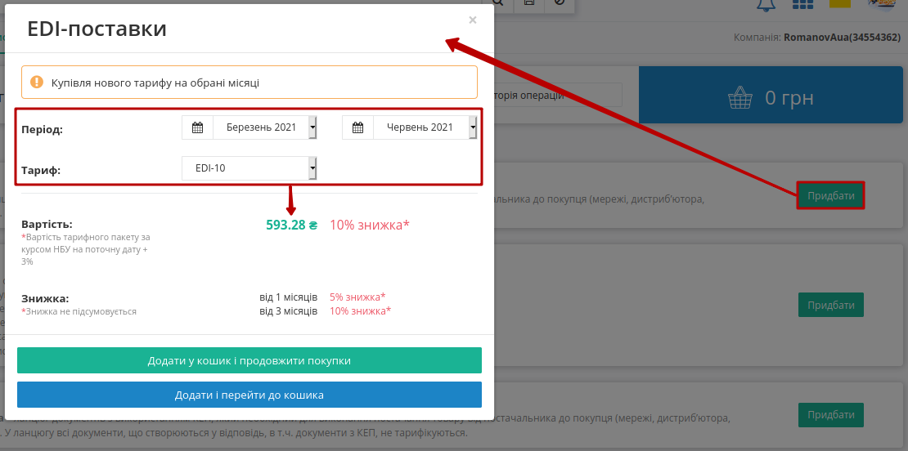

У вікні автоматично відобразиться вартість сервісу/послуги в залежності від обраних параметрів та діючих акційних знижок на момент придбання. Обраний сервіс/послугу можливо додати до кошика (кнопки **"Додати у кошик і продовжити покупки"** чи **"Додати і перейти до кошика"**):

.. image:: pics_New_balance_tariff/New_balance_tariff_08.png
   :align: center

Після чого в розділі меню **"Кошик"** додається помітка з кількістю обраних сервісів/послуг, а в правому верхньому куті відображається загальна їх вартість. В розділі **"Купівля"** додані до **"Кошика"** сервіси мають відповідну помітку і їх можливо вилучити з корзини (кнопка **"Видалити"**):

.. image:: pics_New_balance_tariff/New_balance_tariff_09.png
   :align: center

**1.2.1.2 Замовлення**
""""""""""""""""""""""""""""""""""""""""""""""""""""""

При оформленні замовлення (кнопка **"Замовити"**), на відміну від придбання, додатково можливо вказати інформацію по замовленню (замовлення не потрапляють до **"Кошика"**). Після відправки заявки з Вами зв'яжеться співробітни компанії для обговорення деталей в телефонному режимі:

.. image:: pics_New_balance_tariff/New_balance_tariff_10.png
   :align: center

------------------------------------------------

.. hint::
   За замовчуванням активована автоматична пролонгація сервісів при виборі тарифу. При активованій автоматичній пролонгації на початку місяця (1 числа) автоматично продовжується дія обраного тарифного пакету/кількості доступів по сервісу на аналогічний (обраний раніше) період дії на тих самих умовах. (Детальніше в п.6.6 `Правил користування платформою <https://wiki.edin.ua/uk/latest/Legal_info/Rules.html>`__) 

.. _service-purchase:

**1.2.2 Придбання сервісу / ліцензії**
~~~~~~~~~~~~~~~~~~~~~~~~~~~~~~~~~~~~~~~~~~~~~~~~~~~~~~

В **"Кошику"** відображаються всі обрані до покупки сервіси. Перейти до **"Кошика"** можливо через меню чи кнопку з вартістю усіх обраних сервісів/послуг:

.. image:: pics_New_balance_tariff/New_balance_tariff_11.png
   :align: center

По кожному обраному до покупки сервісу вказується його ціна, знижка; вказується загальна вартість всіх обраних сервісів з урахуванням знижок і рекомендований платіж. За потреби завжди можливо відредагувати параметри обраних сервісів/послуг (кнопка **"Редагувати"**) чи **"Видалити"** з **"Кошика"**:

.. image:: pics_New_balance_tariff/New_balance_tariff_12.png
   :align: center

.. hint::
   **"Рекомендований платіж" = Вартість обраного тарифу + 7%**

   Допомагає розрахувати суму поповнення балансу для роботи з обраними сервісами і не є обов'язковим.

.. _serv-buy:

**1.2.2.1 Придбання сервісів**
""""""""""""""""""""""""""""""""""""""""""""""""""""""

Придбання обраних сервісів здійснюється:

1. При достатній кількості коштів на балансі ("сума на балансі" ⩾ "загальної суми до сплати") доступна кнопка **"Придбати"**:

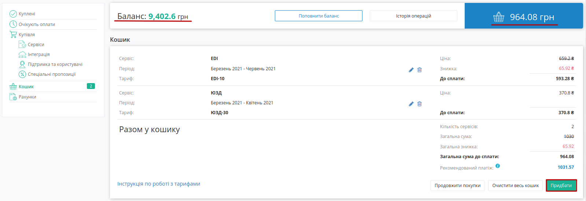

За допомогою кнопки **"Придбати"** здійснюється покупка сервісу з автоматичним списанням коштів з балансу.

.. image:: pics_New_balance_tariff/New_balance_tariff_23.gif
   :align: center

2. Якщо коштів на балансі не достатньо ("сума на балансі" < "загальної суми до сплати"), то доступна кнопка **"Замовити"**:

.. image:: pics_New_balance_tariff/New_balance_tariff_14.png
   :align: center

.. _waiting-tariffs:

За допомогою кнопки **"Замовити"** автоматично створюється рахунок, що відображається в розділі меню `"Рахунки" <https://wiki.edin.ua/uk/latest/Personal_Cabinet/PCInstruction.html#invoice>`__, а замовлені сервіси відображаються в розділі меню **"Очікують оплати"**: 

.. image:: pics_New_balance_tariff/New_balance_tariff_22.gif
   :align: center

.. important::
   Рахунок на замовлені тарифні пакети, що **"Очікують оплати"** зберігається 7 :underline:`робочих` днів, після чого неоплачені тарифні пакети автоматично видаляються з цього розділу меню.

Здійснити покупку можливо оплативши рахунок (розділ `"Рахунки" <https://wiki.edin.ua/uk/latest/Personal_Cabinet/PCInstruction.html#invoice>`__) в зручний для Вас спосіб або поповнивши баланс (`детальніше <https://wiki.edin.ua/uk/latest/Personal_Cabinet/PCInstruction.html#balance>`__).

.. hint::
   При придбанні/зміні/докупці тарифу (за умови, що на балансі недостатньо коштів) активується безлімітний доступ на 2 :underline:`робочих` дні;

   Доступ блокується, якщо рахунок не оплачено на 3-ій :underline:`робочий` день (без оплати "останнього" рахунку доступ ще на 2 дні не надається);

   Блок знімається за умови, що коштів на балансі достатньо для покриття ДТ / тарифу (після цього можливо повторно отримати 2-денний доступ до сплати рахунку).

.. warning::
   При поповненні балансу, якщо його сума перевищує вартість сервісів/послуг, що **"Очікують оплати"**, то ці кошти списуються автоматично!

В тому випадку, коли загальна вартість замовлених тарифних пакетів перевищує суму на балансі, однак вартість тарифного пакету сервісу менша суми на балансі, то в розділі **"Очікують оплати"** можливо обрати і **"Придбати"** такий тарифний пакет:

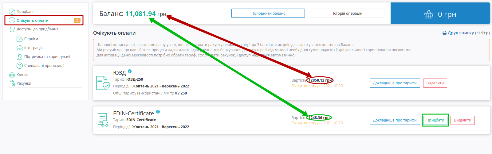

В розділі **"Очікують оплати"** можливо дізнатись **"Докладніше про тарифи"**, що будуть куплені чи **"Видалити"** за потреби обрані тарифні пакети.

.. hint::
   За замовчуванням активована автоматична пролонгація сервісів при виборі тарифу. При активованій автоматичній пролонгації на початку місяця (1 числа) автоматично продовжується дія обраного тарифного пакету/кількості доступів по сервісу на аналогічний (обраний раніше) період дії на тих самих умовах. (Детальніше в п.6.6 `Правил користування платформою <https://wiki.edin.ua/uk/latest/Legal_info/Rules.html>`__).

Також список всіх тарифів, що очікують оплати для зручності можливо розрукувати чи завантажити в pdf форматі:

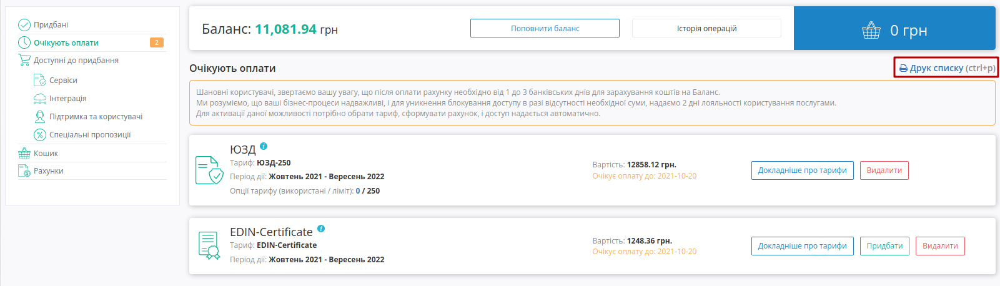

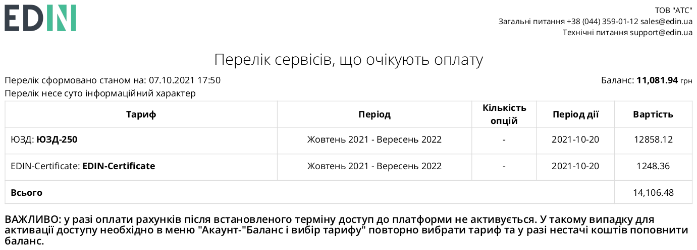

.. _lic-buy:

**1.2.2.2 Придбання ліцензій ("Спец тарифи")**
""""""""""""""""""""""""""""""""""""""""""""""""""""""

.. attention::
   Придбання ліцензій відрізняється від придбання інших продуктів і послуг компанії! Оформлення покупки можливо здійснити через "Особистий кабінет" (отримання рахунку-договору), однак оплата рахунку здійснються лише банківськими операціями зручним для Вас способом. Тобто: коштами на балансі в "Особистому кабінеті" оплата жодним способом не здійснюється (навіть за наявності потрібної суми). 

   Тарифи, що входять до спеціальних тарифів:

   * Інтеграційний модуль EDI Network (eTTN)
   * Інтеграційний модуль EDI Network (EDI+ЮЗД)

Для придбання ліцензій вище згаданих продуктів потрібно перейти в розділі **"Кошика"** натиснути **"Придбати"** чи **"Замовити"** (в даному випадку назва кнопки залежить від коштів на балансі і не впливає на функціонал) доступний спец тариф:

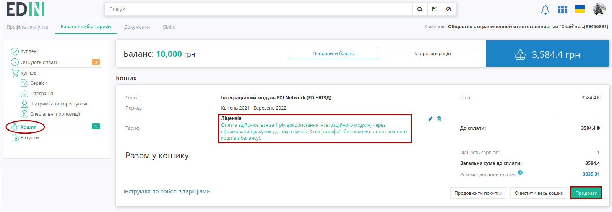

.. important::
   Оплата здійснюється за 1 рік використання інтеграційного модуля, через сформований рахунок-договір в меню **"Спец тарифи"** (без використання грошових коштів з балансу)

Після "Придбання"/"Замовлення" в головному меню з'являється розділ **"Спец тарифи"**:

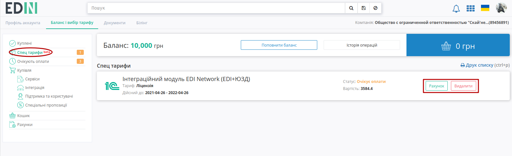

Розділ **"Спец тарифи"** містить неоплачені спеціальні послуги (ліцензії) і дозволяє переглянути/скачати створений рахунок-договір (кнопка **"Рахунок"**) для подальшої оплати через банківські установи чи **"Видалити"** позицію.

Створений рахунок-договір знаходиться в розділі меню `"Рахунки" <https://wiki.edin.ua/uk/latest/Personal_Cabinet/New_balance_tariff.html#invoice>`__.

**1.2.3 Докупити/продовжити/змінити тарифний пакет купленого сервісу**
~~~~~~~~~~~~~~~~~~~~~~~~~~~~~~~~~~~~~~~~~~~~~~~~~~~~~~~~~~~~~~~~~~~~~~~~~~~~~~~~~~~~~~~~~~~~~~~~~~~~~~~~~~~~

В розділі **"Куплені"** відображаються всі оплачені активні сервіси з інформацією по терміну їх доступності, обраному тарифу, залишок чи кількість (опції) на поточний та інші місяці (кнопка **"Докладніше про тарифи"**):

.. image:: pics_New_balance_tariff/New_balance_tariff_17.png
   :align: center

.. image:: pics_New_balance_tariff/New_balance_tariff_18.png
   :align: center

По кліку мишкою на використані транзакції здійснюється перехід до вкладки `"Білінг" <https://wiki.edin.ua/uk/latest/Personal_Cabinet/PCInstruction.html#billing>`__:

.. image:: pics_New_balance_tariff/New_balance_tariff_27.png
   :align: center

**1.2.3.1 Докупити тарифний пакет**
""""""""""""""""""""""""""""""""""""""""""""""""""""""

За допомогою кнопки **"Додати"** можливо докупити (додати будь-який додатковий) тарифний пакет до :underline:`поточного місяця`:

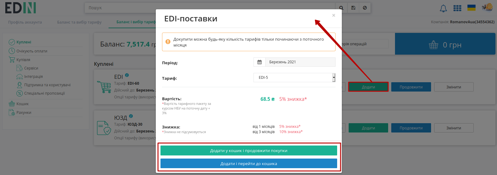

Покупка додаткового тарифного пакету здійснюється через **"Кошик"** (детальніше в розділі `Придбання сервісів <https://wiki.edin.ua/uk/latest/Personal_Cabinet/PCInstruction.html#service-purchase>`__):

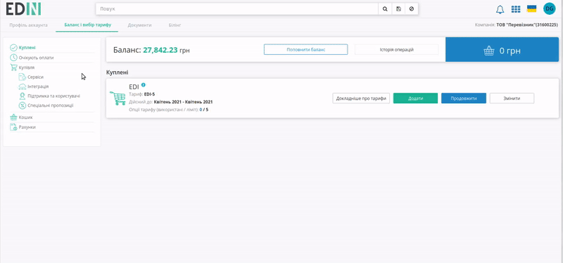

.. hint::
   При придбанні/зміні/докупці тарифу (за умови, що на балансі недостатньо коштів) активується безлімітний доступ на 2 :underline:`робочих` дні;

   Доступ блокується, якщо рахунок не оплачено на 3-ій :underline:`робочий` день (без оплати "останнього" рахунку доступ ще на 2 дні не надається);

   Блок знімається за умови, що коштів на балансі достатньо для покриття ДТ / тарифу (після цього можливо повторно отримати 2-денний доступ до сплати рахунку).

**1.2.3.2 Продовжити тарифний пакет**
""""""""""""""""""""""""""""""""""""""""""""""""""""""

За допомогою кнопки **"Продовжити"** можливо здійснити пролонгацію :underline:`основного тарифу` [1]_ згідно тарифного пакету на поточний місяць (додати такий же тариф (без зміни кількості опцій) на новий період):

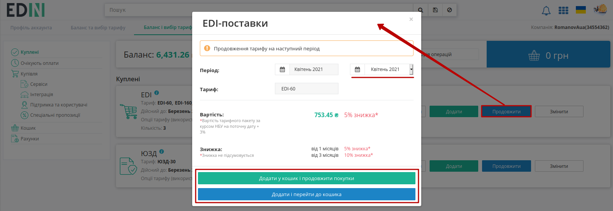

.. important::
   Функція **"Продовжити"** не доступна для :underline:`річних тарифів` [2]_, що вже оплачені більше ніж на 12 місяців.

Продовження тарифного пакету здійснюється через **"Кошик"** (детальніше в розділі `Придбання сервісів <https://wiki.edin.ua/uk/latest/Personal_Cabinet/PCInstruction.html#service-purchase>`__):

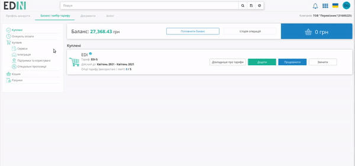

.. hint::
   При придбанні/зміні/докупці тарифу (за умови, що на балансі недостатньо коштів) активується безлімітний доступ на 2 :underline:`робочих` дні;

   Доступ блокується, якщо рахунок не оплачено на 3-ій :underline:`робочий` день (без оплати "останнього" рахунку доступ ще на 2 дні не надається);

   Блок знімається за умови, що коштів на балансі достатньо для покриття ДТ / тарифу (після цього можливо повторно отримати 2-денний доступ до сплати рахунку).

**1.2.3.3 Змінити тарифний пакет**
""""""""""""""""""""""""""""""""""""""""""""""""""""""

За допомогою кнопки **"Змінити"** можливо здійснити зміну :underline:`основного тарифу` [1]_ в обраному періоді (лише в сторону збільшення тарифу):

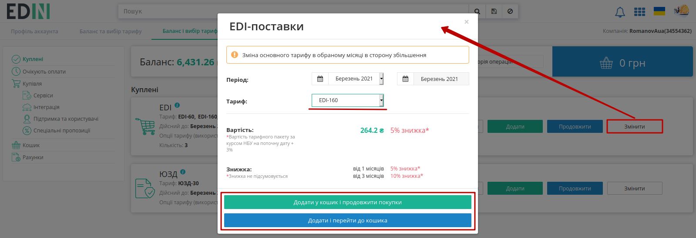

.. note::
   Під зміною тарифного пакету мається на увазі зміна опцій оплаченого сервісу(ів). При зміні вираховується сума, яку потрібно оплатити з урахуванням раніше оплаченого тарифного пакету. Для зміни тарифу на зменшення необхідно зв’язатись з відповідальним менеджером та/або надіслати листа на sales@edin.ua (детальніше в п.6.3 `Правил користування платформою <https://wiki.edin.ua/uk/latest/Legal_info/Rules.html>`__).

Зміна тарифного пакету сервісу здійснюється через **"Кошик"** (детальніше в розділі `Придбання сервісів <https://wiki.edin.ua/uk/latest/Personal_Cabinet/PCInstruction.html#service-purchase>`__):

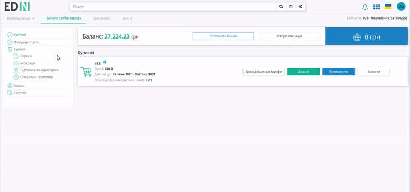

.. hint::
   При придбанні/зміні/докупці тарифу (за умови, що на балансі недостатньо коштів) активується безлімітний доступ на 2 :underline:`робочих` дні;

   Доступ блокується, якщо рахунок не оплачено на 3-ій :underline:`робочий` день (без оплати "останнього" рахунку доступ ще на 2 дні не надається);

   Блок знімається за умови, що коштів на балансі достатньо для покриття ДТ / тарифу (після цього можливо повторно отримати 2-денний доступ до сплати рахунку).

.. _balance:

**1.2.4 Поповнення балансу**
~~~~~~~~~~~~~~~~~~~~~~~~~~~~~~~~~~~~~~~~~~~~~~~~~~~~~~

Панель для роботи з балансом відображає поточний стан коштів на балансі для здійснення покупок тарифних пакетів чи послуг провайдера електронного документообігу:

.. image:: pics_New_balance_tariff/New_balance_tariff_03.png
   :align: center

Для **"Поповнення балансу"** потрібно вказати суму поповнення та натиснути кнопку **"Створити рахунок"**:

.. image:: pics_New_balance_tariff/New_balance_tariff_04.png
   :align: center

Після чого системою автоматино створюється рахунок-фактура (детальніше в описі розділу меню `"Рахунки" <https://wiki.edin.ua/uk/latest/Personal_Cabinet/New_balance_tariff.html#invoice>`__):

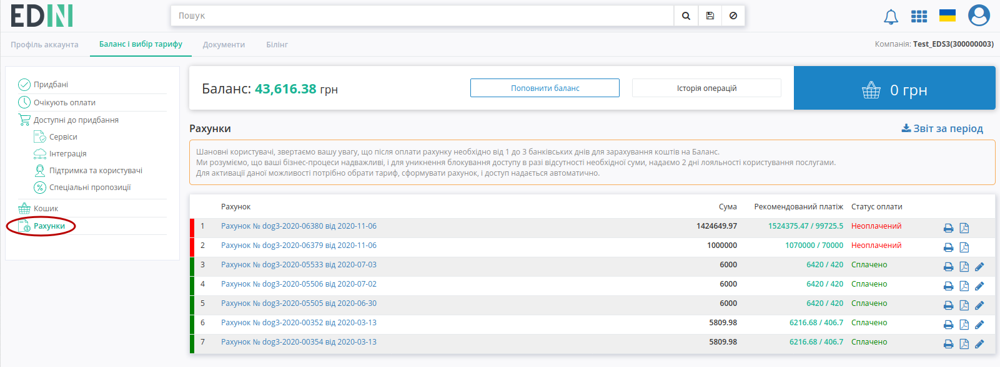

.. hint::
   При створенні рахунку він також автоматично відправляється на пошту.

По всім здійсненим операціям з балансом ведеться **"Історія операцій"** (має зручний пошук):

.. image:: pics_New_balance_tariff/New_balance_tariff_02.png
   :align: center

.. _invoice:

**1.2.5 Рахунки**
~~~~~~~~~~~~~~~~~~~~~~~~~~~~~~~~~~~~~~~~~~~~~~~~~~~~~~

WEB-платформа завжди нагадає, якщо у Вас є неоплачені рахунки і допомагає в один клік їх переглянути (текст для зручності є посиланням в підрозділ з рахунками):

.. image:: pics_New_balance_tariff/New_balance_tariff_24.png
   :align: center

.. attention::
   Вартість сервісів та послуг компанії-провайдера зафіксована в євро валюті і на момент формування суми рахунку відбувається конвертація вартості в гривневий еквівалент згідно курсу валют на поточний день. Формування рахунків:
   
   1) **Після оформлення замовлення** (кнопка **"Замовити"** в Кошику) сума рахунку фіксується на 7 робочих (не календарних) днів. На восьмий робочий день неоплачений рахунок вважається анульованим. При оплаті рахунку після на восьмий день і пізніше кошти поступають на Баланс. Для активації послуги потрібно заново обрати і **"Придбати"** послугу (буде здійснено перерахунок вартості тарифу згідно нового валютного курсу).
   
   2) **При формуванні рахунку за автопролонгацією** (1-го робочого дня місяця) по курсу на цей день рахунок зберігається до кінця місяця. Щоденно за 5 робочих днів до закінчення місяця виконується додаткова перевірка. У разі відсутності активованого тарифного пакету на наступний місяць та в разі відсутності обраних, але ще не активованих тарифних пакетів на наступний місяць на момент перевірки - формується рахунок за автопролонгацією терміном дії 7 робочих днів.

В розділі **"Рахунки"** документи позначаються різним кольором в залежності від статусу [3]_ (:red:`Неоплачений` / :green:`Сплачений` / :orange:`Часткова оплата`) з зазначеними сумою, сумою з рекомендованим платежем / рекомендованим платежем (7% від суми):

В журналі доступний функціонал друку (|друк|), скачування документа в форматі pdf (|pdf|) та можливість запросити оригінал (|карандаш|) для сплаченого рахунку.

Лівою кнопкою миші можливо обрати рахунок, щоб переглянути його вміст:

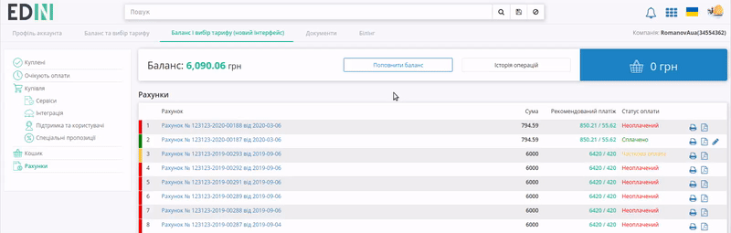

За допомогою кнопки **"Звіт за період"** можливо отримати Excel-звіт з деталізацією по тарифним пакетам, що включені в акт виконаних робіт від АТС за обраний період:

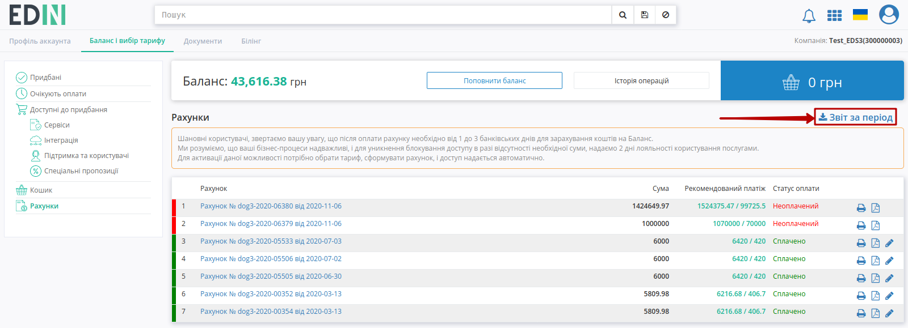

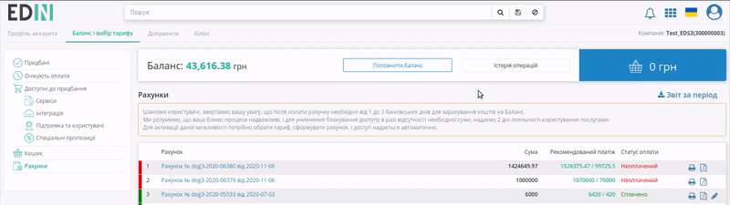

В звіті відображається Назва тарифу, Період дії тарифу, Вартість, Дати акту та оплати:

.. image:: pics_PCInstruction/PCInstruction_011.png
   :align: center

.. hint::
   Реалізована відправка Excel-звіту з деталізацією по актам виконаних робіт від "АТС" на 6-й рабочий день поточного місяця за минулий місяць на email для рахунків (`профіль акаунта <https://wiki.edin.ua/uk/latest/Personal_Cabinet/PCInstruction.html#account-profile>`__ -> контакти -> поле email для рахунків):

   .. image:: pics_PCInstruction/PCInstruction_131.png
      :align: center

----------------------------------

.. _docs:

**1.3 Документи АТС**
----------------------------------

WEB-платформа завжди нагадає, якщо у Вас є неоплачені рахунки і допомагає в один клік їх переглянути (текст для зручності є посиланням в підрозділ **"Документи"**):

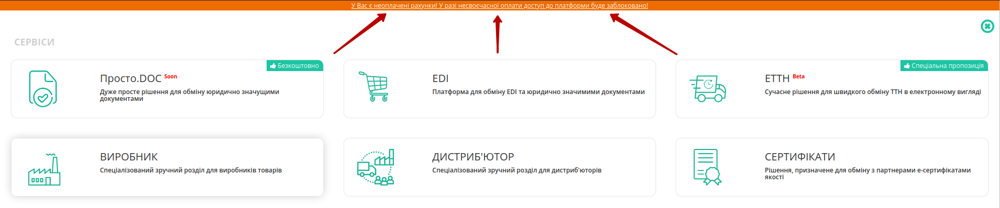

Функціонал вкладки **"Документи"** дозволяє обмінюватись документами (актами, рахунками) з компанією-провайдером АТС для отримання послуг електронного обміну документами і розділений на два основні блоки: каталоги (1) та журнал документів (2):

.. image:: pics_PCInstruction/PCInstruction_13.png
   :align: center

#. Папка "Вхідні" містить всі вхідні документи від компанії-провайдера для їх подальшого підписання ("Акти наданих послуг" (`COMDOC_013 <https://wiki.edin.ua/uk/latest/XML/XML-structure.html#comdoc-018>`__) та "Податкові накладні" (`DECLAR <https://wiki.edin.ua/uk/latest/XML/XML-structure.html#declar>`__)).
#. Папка "Надіслані" містить всі відправлені документи для компанії-провайдера.
#. Папка "Архів" містить всі архівні і оброблені документи, які перенесені в архів.
#. Папка "Рахунки" містить рахунки від компанії-провайдера для своєчасної оплати доступу.
#. Папка "Договори/ДУ з КЕП" містить файли договорів/додаткових угод з КЕП (кваліфікованим електронним підписом)
#. Окремо винесені фільтри документів по даті (**"Сьогодні"**, **"Вчора"**), а останній введений пошук зберігається платформою автоматично і при натисканні кнопки **"Останній фільтр"** він виконується повторно в тій папці ("Вхідні" / "Надіслані" / "Архів" / "Рахунки" / "Договори/ДУ з КЕП"), в якій він був виконаний останнього разу (Вас буде переадресовано)

.. _invoice:

**1.3.1 Рахунки**
~~~~~~~~~~~~~~~~~~~~~~~~~~~~~~~~~~~~~~~~~~~~~~~~~~~~~~

.. attention::
   Вартість сервісів та послуг компанії-провайдера зафіксована в євро валюті і на момент формування суми рахунку відбувається конвертація вартості в гривневий еквівалент згідно курсу валют на поточний день. Формування рахунків:
   
   1) **Після оформлення замовлення** (кнопка **"Замовити"** в Кошику) сума рахунку фіксується на 7 робочих (не календарних) днів. На восьмий робочий день неоплачений рахунок вважається анульованим. При оплаті рахунку після на восьмий день і пізніше кошти поступають на Баланс. Для активації послуги потрібно заново обрати і **"Придбати"** послугу (буде здійснено перерахунок вартості тарифу згідно нового валютного курсу).
   
   2) **При формуванні рахунку за автопролонгацією** (1-го робочого дня місяця) по курсу на цей день рахунок зберігається до кінця місяця. Щоденно за 5 робочих днів до закінчення місяця виконується додаткова перевірка. У разі відсутності активованого тарифного пакету на наступний місяць та в разі відсутності обраних, але ще не активованих тарифних пакетів на наступний місяць на момент перевірки - формується рахунок за автопролонгацією терміном дії 7 робочих днів.

В папці **"Рахунки"** документи позначаються різним кольором в залежності від статусу (:red:`Неоплачений` / :green:`Сплачений` / :orange:`Часткова оплата`) з зазначеними сумою, сумою з рекомендованим платежем / рекомендованим платежем (7% від суми):

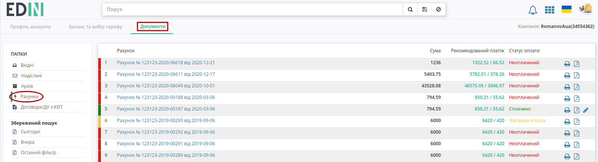

В журналі доступний функціонал друку (|друк|), скачування документа в форматі pdf (|pdf|) та можливысть запросити оригінал (|карандаш|) для сплаченого рахунку.

Лівою кнопкою миші можливо обрати рахунок, щоб переглянути його вміст:

.. image:: pics_PCInstruction/PCInstruction_86.gif
   :align: center

**1.3.2 Договори/ДУ з КЕП**
~~~~~~~~~~~~~~~~~~~~~~~~~~~~~~~~~~~~~~~~~~~~~~~~~~~~~~

В каталозі **"Договори/ДУ з КЕП"** відображаються Договори/ДУ, ініціатором (відправником) яких виступаєте Ви чи компанія АТС. В журналі документів відображається коротка інформація (напрям документа (вхідний/вихідний), тип документа, статус, дата документа, відмітка про підписання зі сторони АТС):

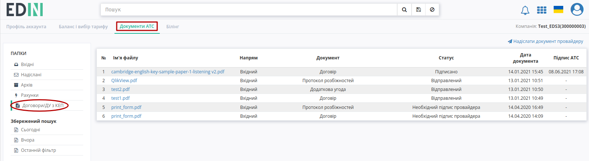

Можливі статуси документів:

* **Відправлений** - новий документ очікує узгодження зі сторони контрагента 
* **Необхідний підпис провайдера** - узгоджений Вами документ відправлено
* **Підписано** - документ підписаний обома сторонами
* **Відхилено** - документ відхилено

**1.3.2.1 Робота з вхідними документами від АТС**
""""""""""""""""""""""""""""""""""""""""""""""""""""""""""""""""""""""""

Для перегляду детальної інформації про документ потрібно натиснути на **"Ім'я файлу"**. Після чого відкривається форма з інформацією про документ. Так новий вхідний документ виглядатиме:

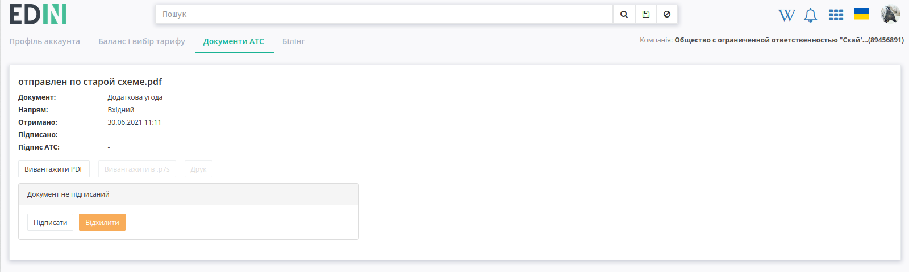

У відкритій формі нового вхідного документа можливо:

* **"Вивантажити PDF"** - вивантаження файлу для ознайомлення з його змістом;
* **"Підписати"** - підписати документ АТС;
* **"Відхилити"** - відхилити документ АТС.

Для підписання договору необхідно натиснути на кнопку **"Підписати"**.

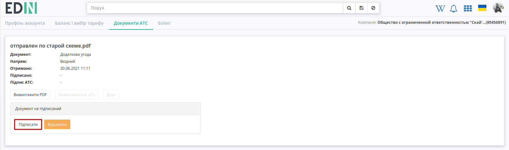

.. _sign:

**1.3.2.1.1 Підписання документа**
++++++++++++++++++++++++++++++++++++++++++++++++++++

.. загальне підписання на платформі

.. include:: /_constant/signing/signing.rst
   :start-after: .. початок блоку для Signing
   :end-before: .. кінець блоку для Signing

Після підписання документа його статус змінюється на **"Необхідний підпис провайдера"**, а при перегляді детальної інформації додатково відображається інформація щодо підписантів:

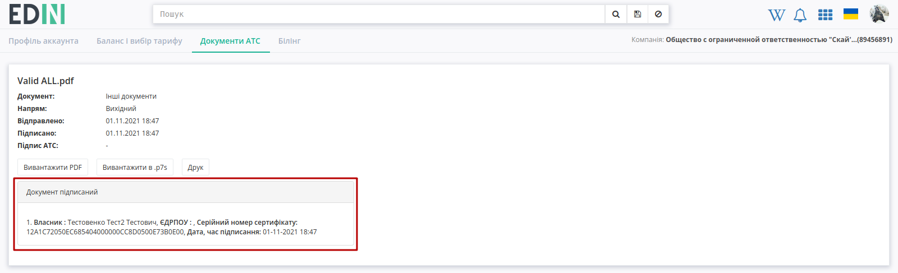

Після підписання з'являється можливість відправити документ на **"Друк"**. На друковану форму документа (pdf) додається водяний знак в верхньому лівому куті кожної сторінки файлу, а також додається сторінка листа підписання:

.. image:: pics_PCInstruction/PCInstruction_106.png
   :align: center

Водяний знак містить інформацію, про те що файл було підписано в EDI Network, GUID документа.

.. image:: pics_PCInstruction/PCInstruction_107.png
   :align: center

Лист підписання містить інформацію про документ та його підписантів.

Після того, як документ буде підписано зі сторони АТС документ змінює свій статус на **"Підписано"**, а при перегляді детальної інформації відображається інформація про всіх підписантів:

.. image:: pics_PCInstruction/PCInstruction_109.png
   :align: center

**1.3.2.1.2 Відхилення документа**
++++++++++++++++++++++++++++++++++++++++++++++++++++

Для відхилення договору необхідно натинути на кнопку **"Відхилити"**. Після чого в вікні "Коментар" обов'язково потрібно заповнити причину відміни документа і підтвердити **"Скасування"** :

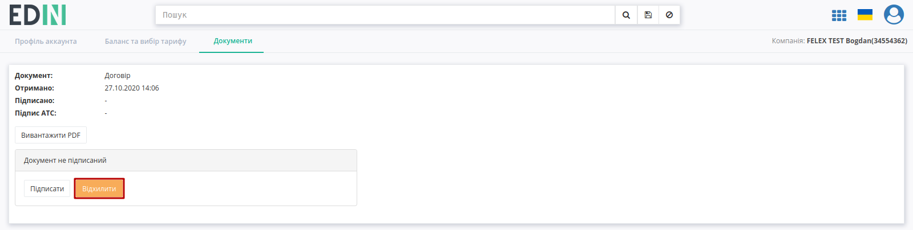

.. image:: pics_PCInstruction/PCInstruction_76.png
   :align: center

.. _send-doc-to-ats:

**1.3.2.2 Відправка документів провайдеру (в ТОВ "АТС")**
""""""""""""""""""""""""""""""""""""""""""""""""""""""""""""""""""""""""

Провайдеру електронного документообігу (в компанію ТОВ "АТС") можливо відправляти документи у вигляді pdf файлів (не більше 5Мб) за допомогою кнопки **"Надіслати документ провайдеру"**:

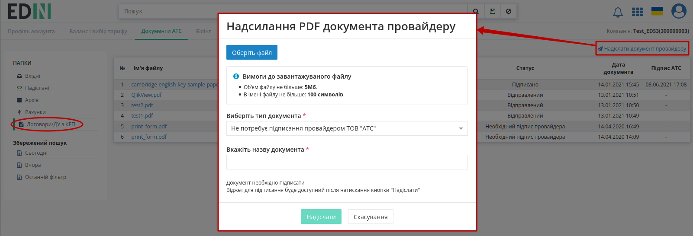

В модальному вікні перед тим, як **"Надіслати"** документ потрібно вибрати pdf файл (кнопка **"Оберіть файл"**), вказати тип документа (потребує / не потребує підписання зі сторони провайдера ТОВ "АТС") та назву документа (не більше 100 символів):

.. image:: pics_PCInstruction/PCInstruction_168.png
   :align: center

Відправка документа потребує його підписання (накладання підпису - стандартна операція на платформі, що `описана в розділі вище <https://wiki.edin.ua/uk/latest/Personal_Cabinet/PCInstruction.html#sign>`__. Після успішного підписання документа він автоматично відправляється в ТОВ "АТС" і відображається в журналі зі статусом **Відправлений** чи **Необхідний підпис провайдера**, якщо при відправці було обрано значення "Потребує підписання провайдером ТОВ АТС":

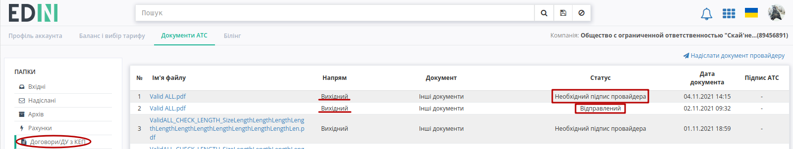

.. _billing:

**1.4 Білінг**
----------------------------------

Вкладка **"Білінг"** дозволяє відслідковувати і контролювати білінг (трафік документів):

.. image:: pics_PCInstruction/PCInstruction_113.png
   :align: center

Відображається дата/час запису в білінг, тип документа, відправник, отримувач, номер документа. За допомогою фільтрів можливо зробити вибірку за:

* часовим періодом (рік, місяць)
* статусом (вхідні/вихідні) документа
* типом документа
* підключеною мережею-контрагентом

Сформований фільтацією список можливо **"Завантажити"** на свій носій в xlsx форматі.

**2 Налаштування**
================================================

.. hint::
   В розділ також можливо перейти в два кліки з іконки користувача:

   .. image:: pics_PCInstruction/PCInstruction_016.png
      :align: center

Розділ дозволяє налаштовувати платформу, окремі сервіси, керувати компаніями, GLN-ами, користувачами та їх повноваженнями.

.. _users:

**2.1 Користувачі**
----------------------------------

В підрозділі відображається список всіх користувачів акаунту з їх ПІБ та відміткою про блокування користувача. Присутня можливість редагувати дані існуючих користувачів (клік мишкою на e-mail користувача, що за замовчуванням є і логіном для входу на платформу) та додати нового користувача (кнопка **"Створити"**):

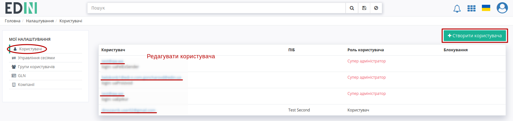

При **створенні** нового користувача відкриється вікно з полями для заповнення, обов'язковими (відмічені червоною зірочкою :red:`*`) серед яких є "Email користувача", "Прізвище", "Ім'я", "Номер телефону" та `"Роль користувача" <https://wiki.edin.ua/uk/latest/Personal_Cabinet/PCInstruction.html#user-roles>`__ :

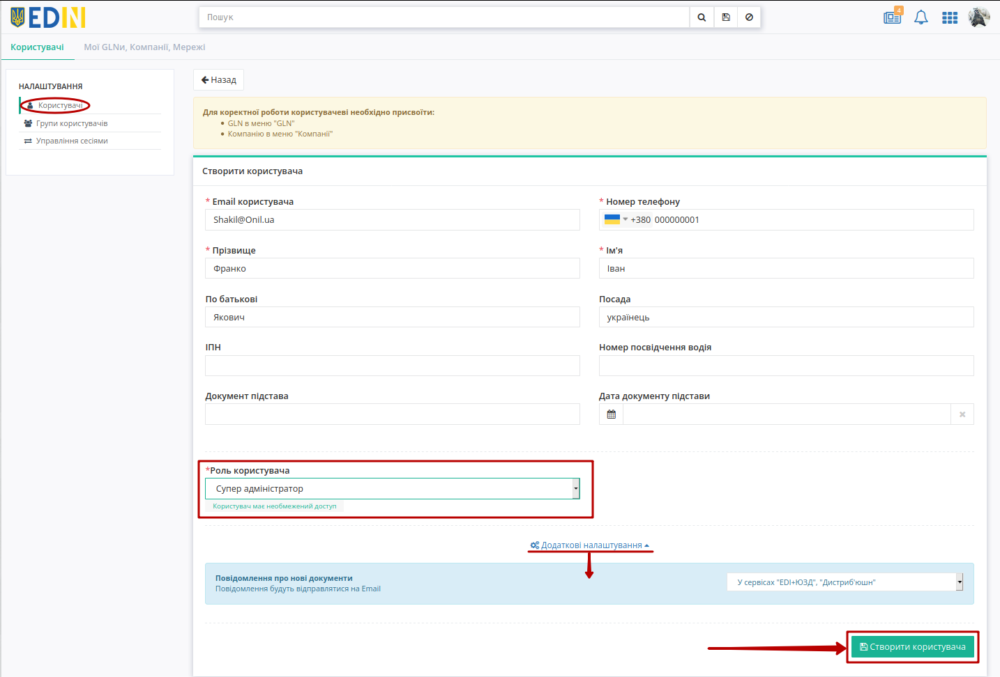

В "Додаткових налаштуваннях" (при створенні чи редагуванні користувача) є можливість увімкнути/вимкнути повідомлення від платформи EDIN чи налаштувати повідомлення для роботи з конкретним типом документів. 

.. hint::
   При **"Cтворенні"** нового користувача на вказану електронну пошту відправляється лист з запрошенням: 

   .. image:: pics_PCInstruction/PCInstruction_64.png
      :align: center

Після **створення** нового користувача автоматично відкривається **форма редагування**, що дозволяє змінити/доповнити інформацію, **"Заблокувати"** користувача, повторно **"Згенерувати пароль"** при його втраті чи налаштувати доступ до документів інших співробітників компанії:

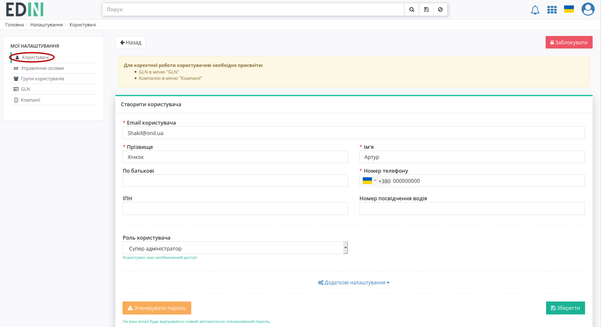

При зміні Email користувача на вказаний (новий) Email потрібно ввести пароль поточного користувача (підтвердження дії) - на новий email відправляється лист для підтвердження поштової адреси.

.. hint::
   При генеруванні нового паролю на вказану електронну пошту відправляється лист: 

   .. image:: pics_PCInstruction/PCInstruction_65.png
      :align: center

.. hint::
   Заблоковані користувачі помічаються в списку значком |bloсked|. Заблокованих користувачів можливо **"Розблокувати"** при редагуванні обраного користувача

.. _shard-entrance:

Для того аби налаштувати доступ до документів сервісу **"Вільний"** інших співробітників компанії потрібно в формі створеного співробітника у вкладці налаштувань **"Доступ до документів Вільного"** -> **"Відкрити доступ до документів співробітника"** (цьому співробітнику буде відкритий доступ до документів вказаних співробітників):

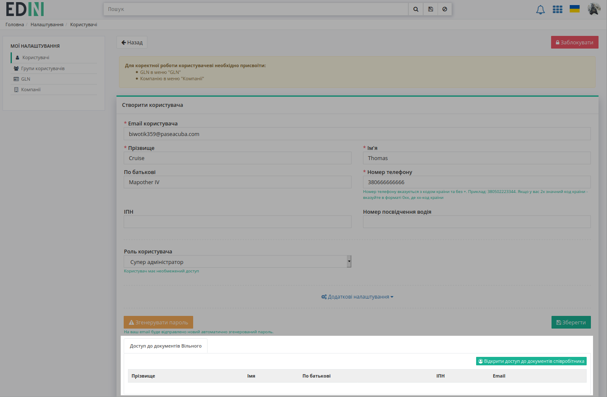

Після чого потрібно обрати зі списку співробітника та **"Додати"** в список співробітників, до документів яких буде відкритий доступ:

.. image:: pics_PCInstruction/PCInstruction_128.gif
   :align: center

Після проведених налаштувань даному співробітнику в сервісі **"Вільний"** стає можливим переглядати і виконувати дії з документами вказаних співробітників від їх імені. Для цього потрібно вибрати співробітника, до документів якого відкритий доступ:

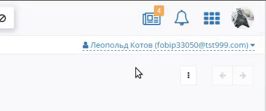

.. _alias:

Для сервісу "Вільний" також можливо налаштувати Аліаси (додаткові email адреси, на які можуть приходити документи в сервіс "Вільний"):

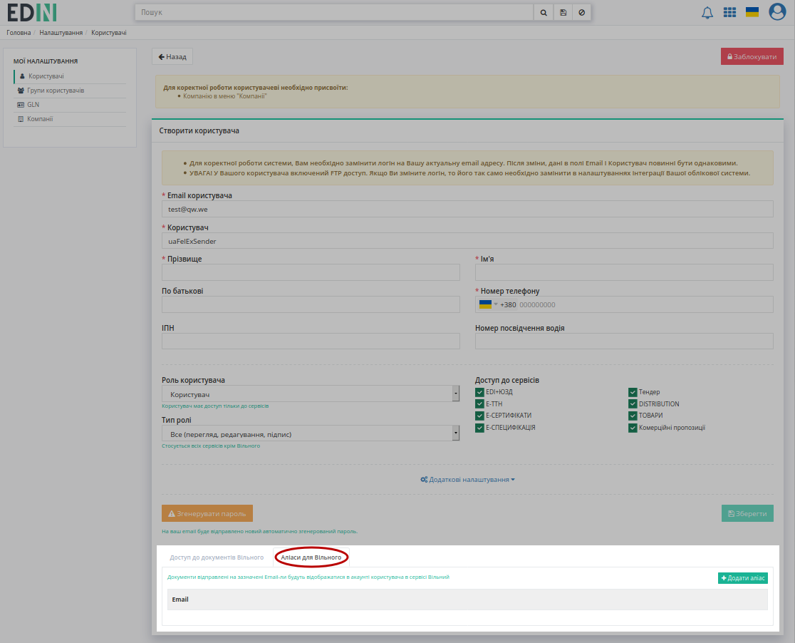

Додаткова пошта вказується за допомогою кнопки **"+Додати аліас"** (адреса повинна бути унікальною):

.. image:: pics_PCInstruction/PCInstruction_003.gif
   :align: center

Після збереження додаткової адреси на неї відправляється лист з посиланням (посилання дійсне 2 години):

.. image:: pics_PCInstruction/PCInstruction_004.png
   :align: center

При переході за посиланням відбувається підтвердження аліасу: 

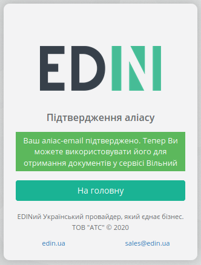

Після підтвердження email адреси вона відображається в списку аліасів для "Вільного":

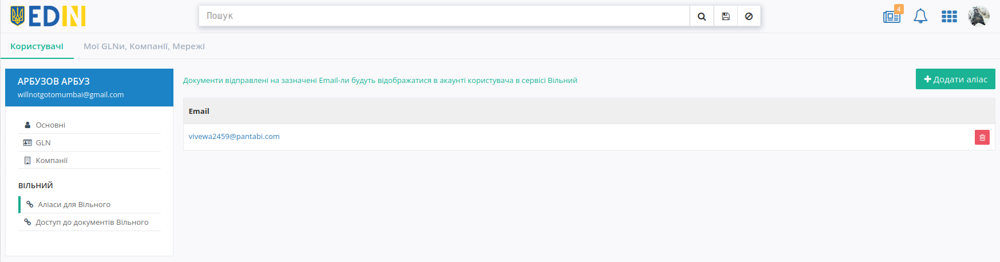

За потреби ці адреси можливо видалити (кнопка |red_trash|).

.. _user-roles:

**2.1.1 Ролі користувачів**
~~~~~~~~~~~~~~~~~~~~~~~~~~~~~~~~~~~~~~~~~~~~~~~~~~~~~~

**"Ролі"** визначають, які сервіси будуть доступні користувачу в меню сервісів (кнопка |пресуха|). Змінити роль можливо наступним чином:

.. image:: pics_PCInstruction/PCInstruction_63.gif
   :width: 800px
   :align: center

.. note::
   1) Зміна ролей іншим користувачам доступна для **Супер адміністратора** та **Адміністратора**.
   2) Роль користувача не може бути змінена від імені цього користувача.
   3) **Адміністратор** не може змінити роль **Супер адміністратору**.

   * **Супер адміністратор** - необмежений доступ до сервісів та налаштувань. Роль не може бути змінена від імені цього користувача.
   * **Адміністратор** - необмежений доступ до сервісів та налаштувань, окрім розділу `"Аккаунт" <https://wiki.edin.ua/uk/latest/Personal_Cabinet/PCInstruction.html#account>`__.
   * **Бухгалтер (Фінансист)** - доступ до розділу Аккаунт та налаштований тип доступу до обраних зі списку сервісів (невідмічені сервіси у користувача не відображаються).
   * **Користувач** - лише налаштований тип доступу до обраних зі списку сервісів (невідмічені сервіси у користувача не відображаються).
   
   Для ролей **Бухгалтер (Фінансист)** та **Користувач** передбачена можливість налаштування типу доступу (**Тип ролі**) до обраних сервісів (не стосується сервісу "Вільний"):

   .. image:: pics_PCInstruction/PCInstruction_001.png
      :align: center

   * **Все** (доступні всі опції платформи без обмежень);
   * **Перегляд** (без можливості створювати та підписувати документи);
   * **Редагування** (доступно все окрім підписання);
   * **Підпис** (не доступне створення документів).

   Наявність/відсутність відмітки в чекбоксі DISTRIBUTION одночасно впливає на доступ до блоків "Виробник" та "Дистриб'ютор".

.. _join-request-pc:

**2.1.2 Приєднання нового користувача до компанії**
~~~~~~~~~~~~~~~~~~~~~~~~~~~~~~~~~~~~~~~~~~~~~~~~~~~~~~

Користувач може самостійно `зареєстуватись <https://wiki.edin.ua/uk/latest/general_2_0/User_registration.html>`__ на платформі EDIN 2.0 і зформувати `запит на приєднання до компанії <https://wiki.edin.ua/uk/latest/general_2_0/User_registration.html#join-request>`__ (за ЄДРПОУ). При цьому Адміністраторам компанії (`ролі <https://wiki.edin.ua/uk/latest/Personal_Cabinet/PCInstruction.html#user-roles>`__ "Адміністратор" та "Супер адміністратор") відправляється лист на узгодження з посиланням:

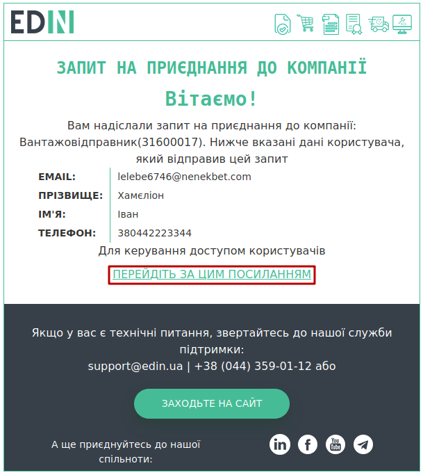

При переході за посиланням адміністратор потрапляє на форму додавання нового користувача з попередньо вказаними даними та налаштуваннями "за замовчуваннями" з можливістю **"Додати користувача"** до компанії чи **"Відхилити запит на приєднання"**: 

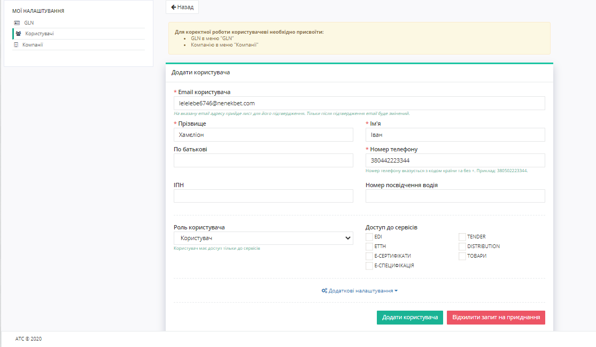

Зверніть увагу, що для доступу користувача до сервісів платформи потрібно провести налаштування його роль (за замовчуванням роль "Користувач" без доступу до сервісів (без проставлених галочок))!

.. important::
   Після створення/додавання користувача, для коректної роботи останнього, йому потрібно присвоїти GLN (меню **"GLN"** -> **"Додати користувача"**) та компанію (меню **"Компанії"** -> **"Додати співробітника"**).

Після **"Додавання"/"Відхилення"** користувачу, що реєструвався на пошту відправляється лист-повідомлення про рішення адміністратора компанії.

.. hint::
   В випадку, коли користувач `реєструється за допомогою КЕП <https://wiki.edin.ua/uk/latest/general_2_0/User_registration.html#kep>`__ та ЄДРПОУ зареєстрованої компанії співпадає з ЄДРПОУ з КЕП, то зв'язок такого користувача з акаунтом формується автоматично: користувачу призначається `роль <https://wiki.edin.ua/uk/latest/Personal_Cabinet/PCInstruction.html#user-roles>`__ "Користувач" з доступом до всіх сервісів. При цьому Адміністраторам компанії (`ролі <https://wiki.edin.ua/uk/latest/Personal_Cabinet/PCInstruction.html#user-roles>`__ "Адміністратор" та "Супер адміністратор") відправляється інформаційний лист про приєднання користувача:

   .. image:: pics_PCInstruction/PCInstruction_130.png
      :align: center

.. _session-management: 

**2.2 Управління сесіями**
----------------------------------

.. warning::
   При переході до деяких сервісів, коли авторизований користувач перевищує доступну кількість одночасних сесій (з різних пристроїв чи браузерів) платформа повідомляє про обмеження даного користувача:
   
   .. image:: pics_PCInstruction/PCInstruction_026.png
      :align: center

   Детальніше про `Правила користування Платформою «EDI Network» <https://wiki.edin.ua/uk/latest/Legal_info/Rules.html#id5>`__. В особистому кабінеті в розділі `Баланс та вибір тарифу <https://wiki.edin.ua/uk/latest/Personal_Cabinet/PCInstruction.html#id5>`__ можливо розшири можливості взаємодії с сервісами, докупивши "Додаткові сесії". В `Профілі користувача <https://wiki.edin.ua/uk/latest/general_2_0/rabota_s_platformoj_EDIN_2.0.html#pers-settings>`__ моливо переглянути сесії на рівні користувача. 

У розділі "Управління сесіями" відображаються сесії всіх користувачів компанії (вказується логін, IP, ОС, FingerPrint, розділ, дата входу в систему, дата останньої активності, час завершення сесії). Окрім цього відображається інфо про кількість відмов у доступі (через перевищення кількості сесій) за день та місяць. В розділі можливо налаштувати термін життя сесії на рівні акаунта (для всіх користувачів) - 10хв / 30хв / 1год / 3год / 6год / 24год:

.. image:: pics_PCInstruction/PCInstruction_025.png
   :align: center

Сесії інших користувачів можливо "Зупинити" одразу чи вказати час, через який вона буде зупинена:

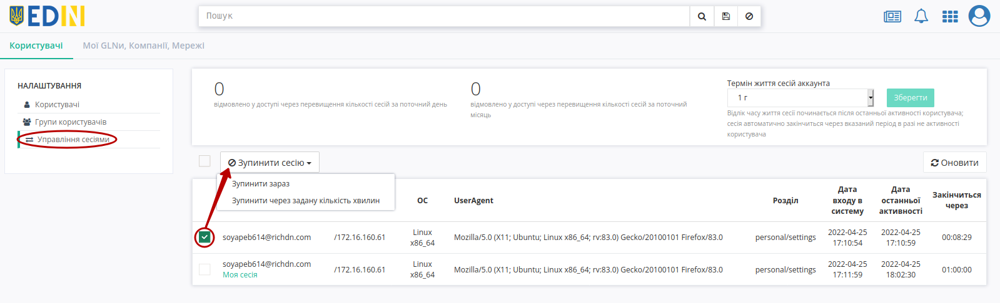

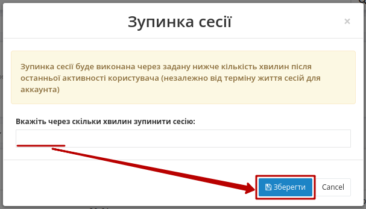

.. _user-groups: 

**2.3 Групи користувачів**
----------------------------------

Розділ дозволяє створювати / редагувати / видаляти групи користувачів:

.. image:: pics_PCInstruction/PCInstruction_027.png
   :align: center

В створену групу (а також при її редагуванні) можливо додавати користувачів даної компанії:

.. image:: pics_PCInstruction/PCInstruction_028.gif
   :align: center

.. _gln: 

**2.4 GLN**
----------------------------------

В налаштуваннях **"GLN"** відображаються дані (Номер, Назва, Місто, Вулиця) по всім доданим GLN-ам, присутня можливість редагувати існуючі GLN (клік мишкою на номер), **"Підтвердити КЕП"** та додати до платфоми нові GLN (кнопка **"+Створити GLN"**):

.. image:: pics_PCInstruction/PCInstruction_132.png
   :align: center

При :underline:`підтвердженні КЕП` ініціалізується процес подібний до підписання, що описаний в `розділі вище <https://wiki.edin.ua/uk/latest/Personal_Cabinet/PCInstruction.html#sign>`__. В GLN, що були підтверджені відсутня кнопка **"Підтвердити КЕП"** і вони помічаються іконкою |key|:

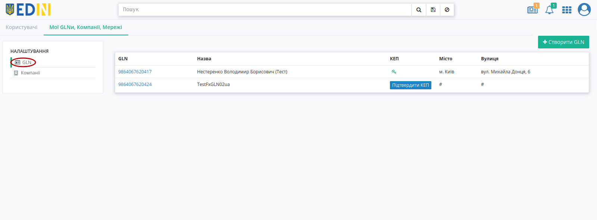

При :underline:`створенні нового GLN` одразу відкривається вікно для введення даних, що можливо надати 2-ма способами:

* **"Створити GLN"** заповнивши вікно з полями (обов'язковим серед яких є лише "Назва", що буде відображатись контрагентам (відмічене червоною зірочкою :red:`*`));
* **"Створити з КЕП"** - ініціалізується процес подібний до підписання, що описаний в `розділі вище <https://wiki.edin.ua/uk/latest/Personal_Cabinet/PCInstruction.html#sign>`__. В цьому випадку дані беруться з підпису і такий GLN одразу помічаються іконкою |key|:

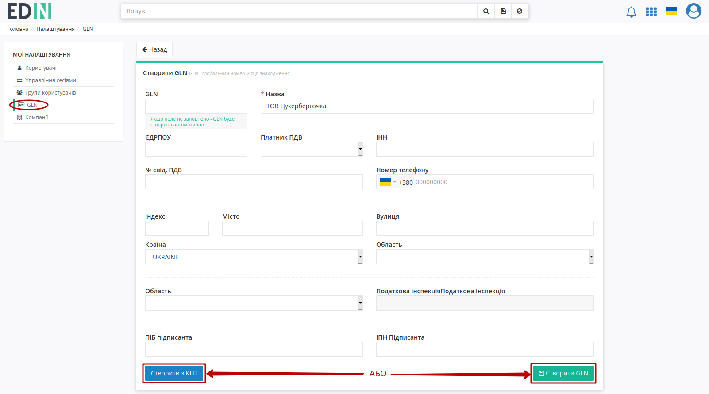

При :underline:`створенні з КЕП` поля "ЄДРПОУ" та "Назва" заповнюютсься автоматично без можливості редагування:

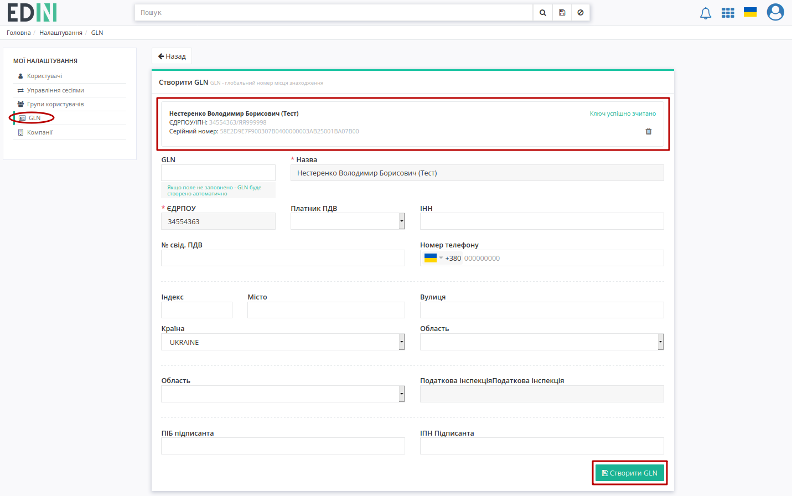

.. important::
   При **"Cтворенні GLN"** з незаповненим полем "GLN" його значення автоматично генерується платформою EDIN 2.0. Номер GLN на відміну від решти даних неможливо відредагувати (лише додати). Неможливо зберегти дані для уже зареєстрованого GLN.

Вибравши зі списку "Область", значення цього поля буде автоматично заповнюватись в полі "Область" в формах при створенні ЮЗД-документів.

.. attention::
   У компанії, що є платником НДС і працює з ЮЗД, згідно законодавства, поле "Код ознаки джерела податкового номера" повинно бути заповним (платформа підкаже про це модальним вікном з посиланням до налаштувань GLN, через який здійснюється обмін документами з АТС `"Документи" <https://wiki.edin.ua/uk/latest/Personal_Cabinet/PCInstruction.html#docs>`__). Під час реєстрації нового користувача на платформі, орієнтуючись на код ЕДРПОУ та ІПН компанії "Код ознаки джерела податкового номера" визначається автоматично.

Після створення нового GLN автоматично відкривається форма редагування, що дозволяє відредагувати/доповнити інформацію, **"Видалити"** GLN чи додати пов'язаних з ним раніше доданих користувачів.

При **"Додаванні користувача"** до GLN відкривається поле з випадаючим списком всіх користувачів в акаунті:

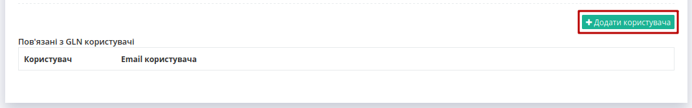

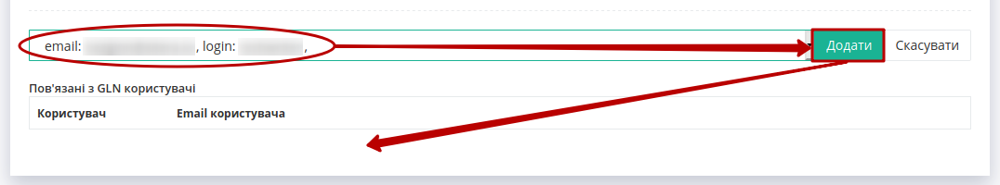

Пов'язані користувачі відображаються у списку. Розірвати зв'язок між користувачем та GLN можливо за допомогою червоної кнопки з іконкою відерця: 

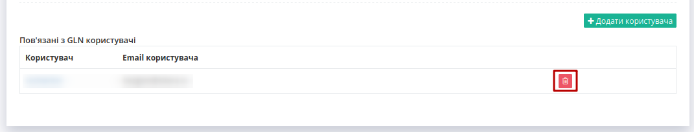

.. _company: 

**2.5 Компанії**
----------------------------------

В підрозділі відображається список всіх компаній з короткою інформацією (Назва, ЄДРПОУ, ІПН, Місто, Адреса). Присутня можливість редагувати дані існуючих компаній (клік мишкою на назву компанії), **"Підтвердити КЕП"** та додати нову компанію (кнопка **"+Створити компанію"**):

.. image:: pics_PCInstruction/PCInstruction_139.png
   :align: center

При :underline:`підтвердженні КЕП` ініціалізується процес подібний до підписання, що описаний в `розділі вище <https://wiki.edin.ua/uk/latest/Personal_Cabinet/PCInstruction.html#sign>`__. В компаніях, що були підтверджені відсутня кнопка **"Підтвердити КЕП"** і вони помічаються іконкою |key|.

При :underline:`створенні нової компанії` відкривається вікно для введення даних про компанію, яку можливо надати 2-ма способами:

* **"Зберегти"** дані, що повинні бути заповнені вручну (обов'язковим серед яких поля "Компанія" та "ЄДРПОУ/ІПН" (відмічені червоною зірочкою :red:`*`));
* **"Створити з КЕП"** - ініціалізується процес подібний до підписання, що описаний в `розділі вище <https://wiki.edin.ua/uk/latest/Personal_Cabinet/PCInstruction.html#sign>`__. В цьому випадку дані беруться з підпису і така компанія одразу помічаються іконкою |key|:

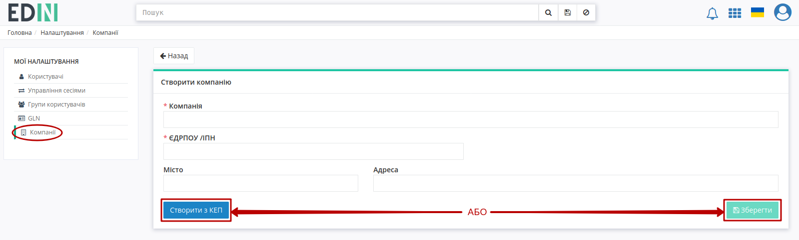

При :underline:`створенні з КЕП` поля "ЄДРПОУ/ІПН" та "Компанія" заповнюютсься автоматично без можливості редагування:

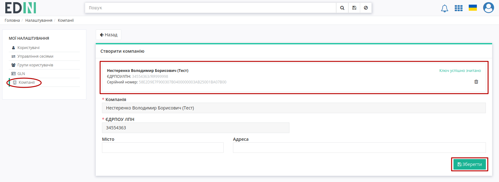

При :underline:`редагуванні` створеної компанії доступні вкладки **"Співробітники"**, **"Адреси"**, **"Тарифи"** та **"Ідентифікатори"**:

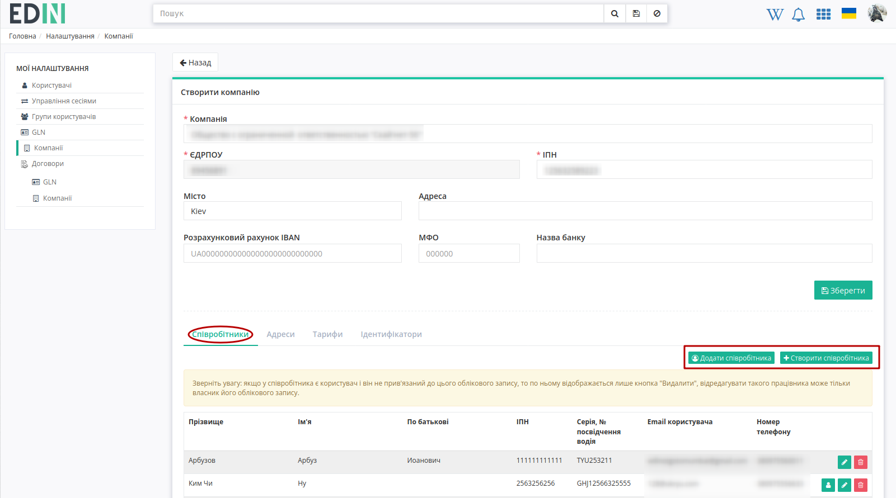

До цієї компанії можливо **"Додати співробітника"** зі списку користувачів або додати дані нового спіробітника (**"Створити співробітника"**):    

.. image:: pics_PCInstruction/PCInstruction_148.png
   :align: center

При створенні співробітника на його Email відправляється лист з автоматично згенерованим паролем (аналогічно до створення користуваа в розділі `Користувачі <https://wiki.edin.ua/uk/latest/Personal_Cabinet/PCInstruction.html#users>`__).

Можливо **"Додати"** адреси компанії. Поле "Код `КАТОТТГ <https://www.minregion.gov.ua/napryamki-diyalnosti/rozvytok-mistsevoho-samovryaduvannya/administratyvno/kodyfikator-administratyvno-terytorialnyh-odynycz-ta-terytorij-terytorialnyh-gromad/>`__" заповнюється автоматично - для цього потрібно почати вводити назву населеного пункту і обрати його із запропонованого списку:

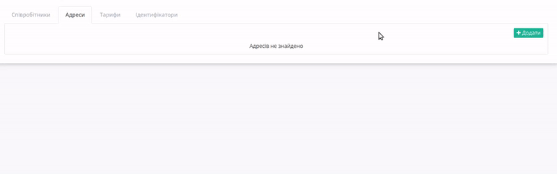

.. _ettn-tariffs: 

Також можливо створити `правила тарифікації <https://wiki.edin.ua/uk/latest/ETTN_2_0/Create_act_at_accepted_work.html#additional-functionality>`__ (для сервісу **"Е-ТТН"**) та ввести ідентифікатори:

.. image:: pics_PCInstruction/PCInstruction_36.png
   :align: center

.. _contracts: 

**2.6 Договори**
----------------------------------

Довідник договорів доступний для ролей **Супер адміністратора** та **Адміністратора**. Для створення договорів підрозділ має підпункти **"GLN"** та **"Компанії"**. Створені договори використовуються для автоматичного заповнення полів в EDI сервісі та ЕТТН сервісі відповідно.

**"+Створити договір"** можливо за допомогою відповідної кнопки:

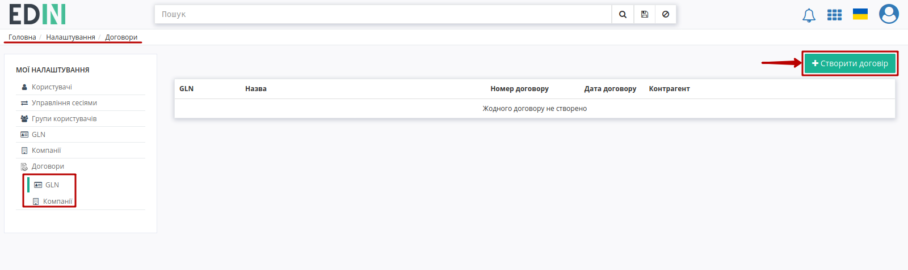

.. attention::
   Параметри договору повинні бути унікальними (неможливо створити договір ідентичний до вже існуючого договору)!

Для створення договору за GLN потрібно заповнити форму, обравши та вказавши наступні значення (поля обов'язкові до заповнення позначені червоною зірочкою :red:`*`):

* **GLN**
* **Номер договору**
* **Дата договору**
* **Тип договору** (Договір поставки / Договір маркетингу / Договір послуг)
* **Контрагент** (доступний пошук контрагента за назвою / GLN)

та натиснути кнопку **"Створити договір"**:

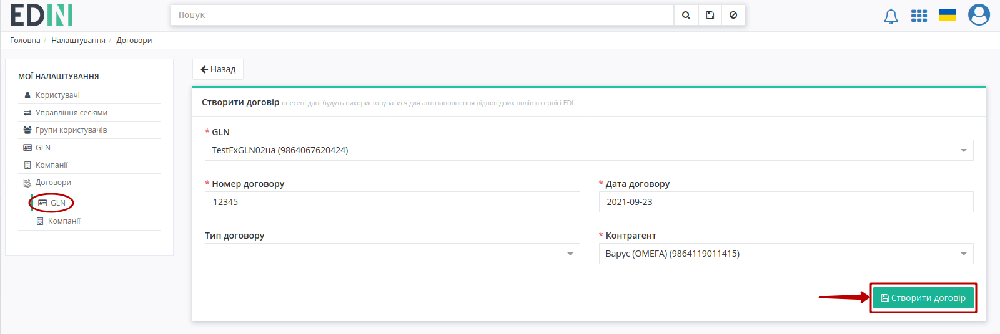

Створені договори можливо редагувати та видаляти:

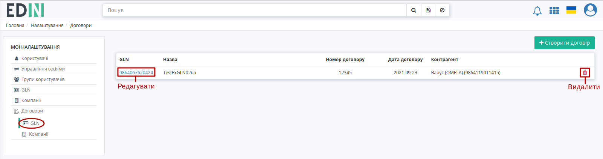

При редагуванні договору для оновлення даного договору потрібно **"Зберегти"** внесені зміни:

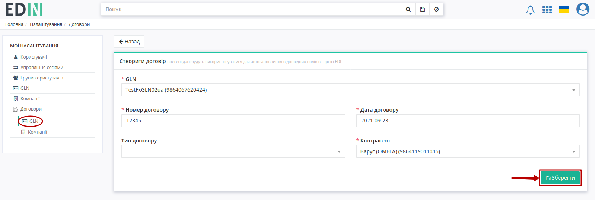

Для створення договору на компанію потрібно заповнити форму, обравши та вказавши наступні значення (поля обов'язкові до заповнення позначені червоною зірочкою :red:`*`):

* **Моя компанія**
* **Номер договору**
* **Дата договору**
* **Тип договору** (Договір перевезення)
* **Контрагент** (доступний пошук контрагента за назвою / ЄДРПОУ)

та натиснути кнопку **"Створити договір"**:

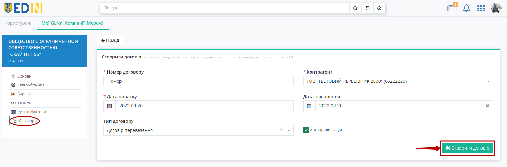

Створені договори можливо редагувати та видаляти:

.. image:: pics_PCInstruction/PCInstruction_147.png
   :align: center

При редагуванні договору для оновлення даного договору потрібно **"Зберегти"** внесені зміни:

.. image:: pics_PCInstruction/PCInstruction_146.png
   :align: center

.. _counterparties: 

**3 Контрагенти**
================================================

Розділ **Контрагентів** дозволяє користувачу налаштувати та покращити взаємодію з сервісами платформи та контрагентами.

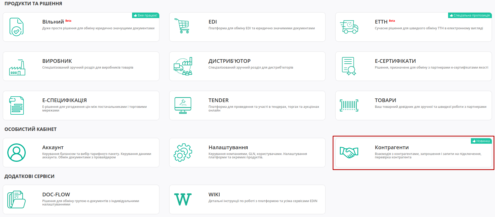

**3.1 EDI**
----------------------------------

Сервіс дозволяє налаштувати взаємодію з торговими мережами шляхом формування запитів на підключення.

**3.1.1 Постачальники (підрозділ для Мережі)**
~~~~~~~~~~~~~~~~~~~~~~~~~~~~~~~~~~~~~~~~~~~~~~~~~~~~~~

**Постачальники** - підрозділ зі списком підключених до Торгової Мережі Постачальників - вказується назва компанії, логотип, ЄДРПОУ/ІПН, за якими і можливо відсортувати список:

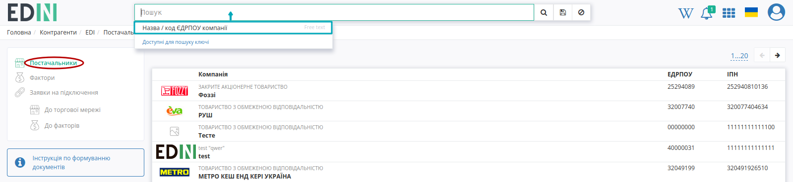

**3.1.2 Мережі (підрозділ для Постачальника)**
~~~~~~~~~~~~~~~~~~~~~~~~~~~~~~~~~~~~~~~~~~~~~~~~~~~~~~

**Мережі** - підрозділ зі списком мереж, що приймають запити на підключення. 

Список можливо відсортувати за статусом документообігу (:orange:`Документообіг не налаштований`, :green:`Документообіг налаштований`), виконати пошук за частиною назви:

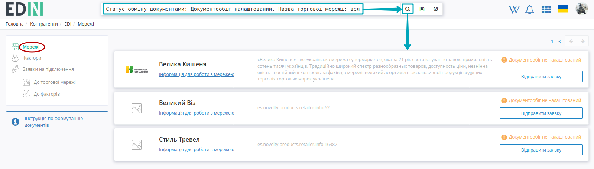

В списку відображається назва мережі, логотип, додаткова інформація, статус документообігу та кнопки **"Інформація для роботи з мережею"** та **"Відправити заявку"** (формування запиту на підключення):

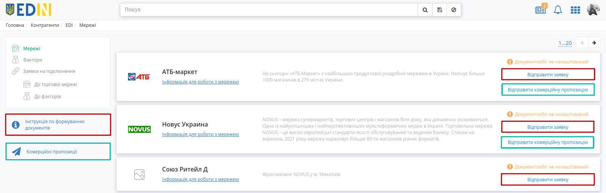

В картці мережі відображається контактна інформація, список підключених документів та сервісів:

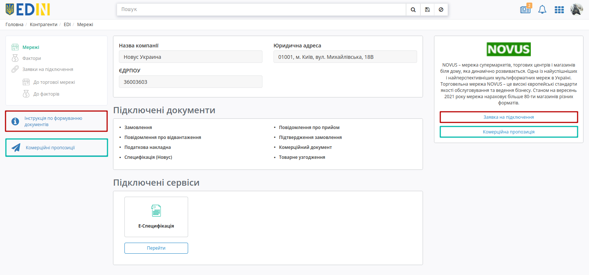

При перегляді даних по мережі також можливо подати **"Заявку на підключення"** за допомогою одноіменної кнопки. 

**3.1.2.1 Формування запиту на підключення до мережі**
""""""""""""""""""""""""""""""""""""""""""""""""""""""""""""""

При формуванні запиту на підключення відкривається форма заявки (поля обов'язкові до заповнення позначені червоною зірочкою :red:`*`). Після того, як обов'язкові поля заповнені можливо **"Сформувати запит"**:

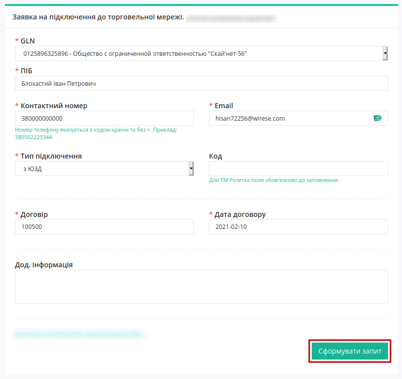

З міркувань безпеки та коректної ідентифікації Постачальника заявка відправляється тільки після накладення електронного цифрового підпису Відправника (ЄДРПОУ ключа повинен відповідати ЄДРПОУ вказаному в GLN).

.. hint::
   Процес підписання типовий для платформи та описаний в `розділі вище <https://wiki.edin.ua/uk/latest/Personal_Cabinet/PCInstruction.html#sign>`__. Якщо ЄДРПОУ ключа співпадає з ЄДРПОУ акаунта, то автоматично "підтверджується" й акаунт.

Однак підписання під час формування запиту не потрібне, якщо обрати GLN, що вже був `підтверджений за допомогою КЕП <https://wiki.edin.ua/uk/latest/Personal_Cabinet/PCInstruction.html#gln>`__:

.. image:: pics_PCInstruction/PCInstruction_151.png
   :align: center

Після чого до попереднього перегляду формується запит в мережу (в якості чернетки). Перед тим, як **"Відправити запит"** в мережу можливо **"Завантажити PDF заявки"** та додати додаткові файли без підпису (**"+Додати файли"**):

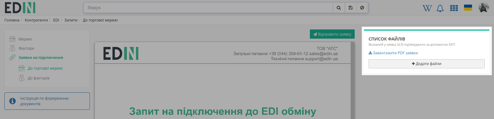

.. note::
   До запиту можливо додавати txt, .doc, .docx, .xls, .xlsx, .ppt, .pptx, image, .pdf, .rtf, .zip файли розміром не більше 5 МБ і загальним об'ємом не більше 10 МБ. Система вказує розмір долучених файлів і розраховує доступний розмір до завантаження, в якості підказки:

   .. image:: pics_PCInstruction/PCInstruction_124.png
      :align: center

В блоці "Список файлів" всі файли можливо завантажити, а додаткові видалити:

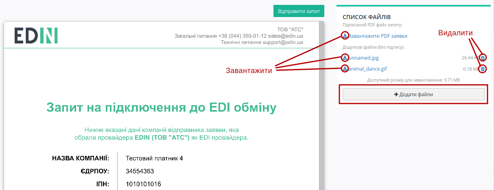

Після того, як дії з файлами будуть виконані потрібно **"Відправити запит"**:

.. image:: pics_PCInstruction/PCInstruction_126.png
   :align: center

Відправлений запит змінює свій статус на :orange:`На розгляді` і відображається в **"Заявках на підключення"**:

.. image:: pics_PCInstruction/PCInstruction_153.png
   :align: center

Після того, як Торгова Мережа *підтвердить* чи *відхилить* заявку Постачальнику буде надіслано повідомлення на Email та оновлено статус заявки.

**3.1.3 Заявки на підключення**
~~~~~~~~~~~~~~~~~~~~~~~~~~~~~~~~~~~~~~~~~~~~~~~~~~~~~~

.. important::
   Підрозділ для ролей Постачальника та Мережі функціонально відрізняється, оскільки Постачальник є відправником, а Мережа - отримувачем, що приймає рішення.

Статуси запитів/заявок:

* Чернетка (можливо видалити |мусорка|) - створений Постачальником, але не відправлений запит на підключення;
* :red:`Відхилено` - Мережа відхилила запит на підключення;
* :green:`Прийнято` - Мережа прийняла запит на підключення;
* :orange:`На розгляді` - відправлений запит, за яким Мережа ще не прийняла рішення.

Список можливо відсортувати за статусом:

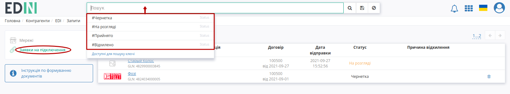

**3.1.3.1 Для Постачальника:**
""""""""""""""""""""""""""""""""""""""""""""""""""""""

**Запити** - підрозділ всіх відправлених запитів даного користувача. В списку відображається назва мережі, логотип, GLN, додаткова інформація, договір підключення, статус заявки.

Детальніше ознайомитись з запитом на підключення можливо клікнувши на назву мережі; кнопка **"Повторити"** доступна, коли запит було відхилено і повторно відправляє запит на підключення (формування нового запиту аналогічно до функціоналу **"Підключити"**).

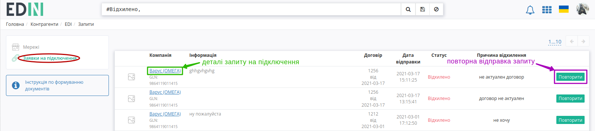

За детальнішого перегляду запиту на підключення відображається статус (для відхиленого запиту додатково вказується причина відхилення) форма з даними, що були відправлені при формуванні запиту:

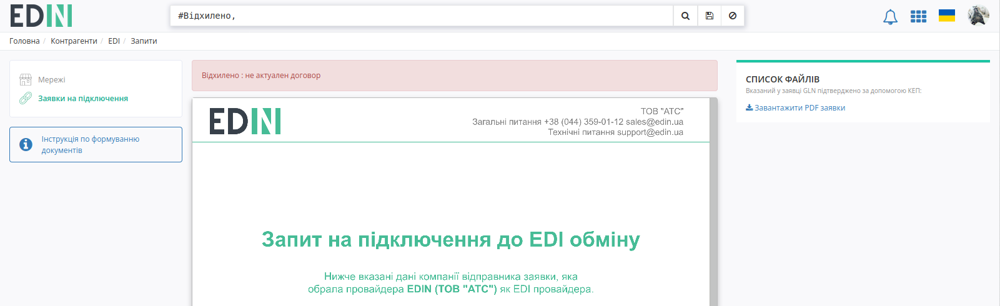

**3.1.3.2 Для Мережі:**
""""""""""""""""""""""""""""""""""""""""""""""""""""""

**Запити** - підрозділ всіх отриманих в мережу запитів. В списку відображається ім'я особи-підписанта, логотип, GLN, додаткова інформація, договір підключення, дата відправки, статус заявки, причина відхилення. Детальніше ознайомитись з запитом на підключення можливо клікнувши на ПІБ відправника запиту:

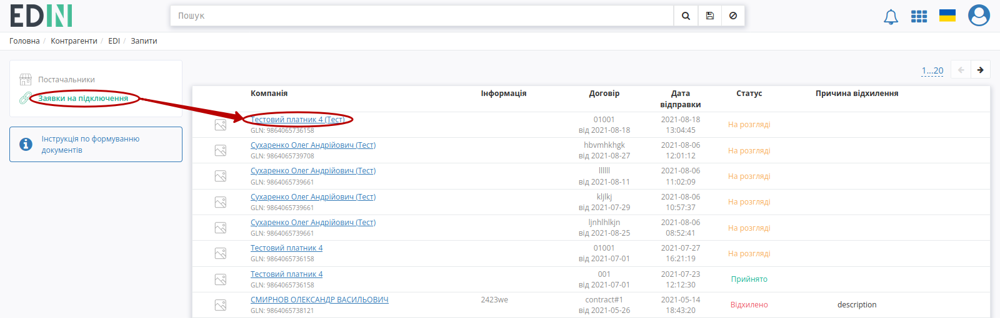

.. hint::
   Запити по яким вже було прийнято рішення (в статусах :green:`Прийнято` / :red:`Відхилено`) на стороні Постачальника та Мережі не відрізняються.

Якщо запит знаходиться в статусі :orange:`На розгляді`, то на стороні Мережі активні кнопки прийняття рішення по запиту: **"Підтвердити"** і **"Відхилити"** (при відхиленні вказується причина):

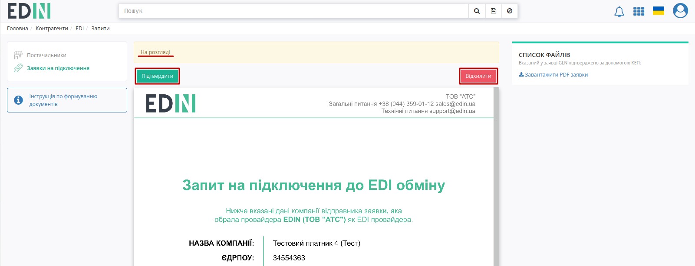

По всім заявкам :orange:`На розгляді` Мережа кожного понеділка о 10:00 буде отримувати лист-нагадування на контактний email:

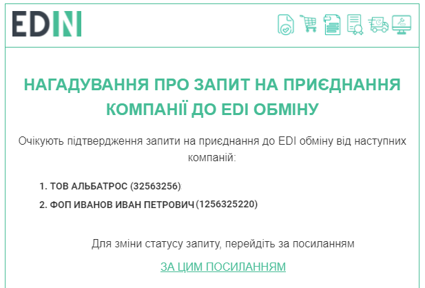

Після прийняття рішення запит змінює свій статус на :green:`Прийнято` / :red:`Відхилено`.

.. note::
   Додатково по всіх запитах Постачальника Торгова Мережа отримує листа з посиланням на форму прийняття рішення, що не потребує авторизації (лист також містить підписану заявку в pdf форматі):

   .. image:: pics_PCInstruction/PCInstruction_100.png
      :align: center

   .. image:: pics_PCInstruction/PCInstruction_101.png
      :align: center

   *При відхиленні обов'язково потрібно вказати причину відмови:

   .. image:: pics_PCInstruction/PCInstruction_102.png
      :align: center

-------------------------------------

.. [#] **Основний тариф** - тарифний пакет сервісу, що був вперше куплений на обраний період.
   
.. [#] **Річний тариф** - тарифний пакет, що продається одразу терміном на один рік, наприклад, Е-Сертифікати (EDIN-Certificate).

.. [#] Статус виставлених рахунків встановлюється зі сторони компанії-провайдера.  

-------------------------------------

.. include:: /_constant/kontakti.rst
