Інструкція
#############################################################

.. role:: red

.. role:: orange

.. role:: green

.. role:: underline

.. сюда закину немного картинок для текста

.. |пресуха| image:: pics_PCInstruction/PCInstruction_03.png

.. |детальніше| image:: pics_PCInstruction/PCInstruction_05.png

.. |мусорка| image:: pics_PCInstruction/PCInstruction_11.png

.. |друк| image:: pics_PCInstruction/PCInstruction_15.png

.. |pdf| image:: pics_PCInstruction/PCInstruction_16.png

.. |карандаш| image:: pics_PCInstruction/PCInstruction_17.png

.. |bloсked| image:: pics_PCInstruction/PCInstruction_31.png

.. |drop_pass| image:: signing/drop_pass.png

.. |del_key| image:: signing/del_key2.png

.. contents:: Зміст:
   :depth: 4

---------

Для початку роботи з "Особистим кабінетом" необіхдно здійснити вхід на платформу EDIN 2.0. Ви можете використовувати будь-який браузер (рекомендованим є **Google Chrome** останньої версії). Для входу до платформи необхідно перейти за посиланням https://edo-v2.edin.ua/auth .

При переході за вказаним посиланням відкриється вікно авторизації. Необхідно ввести Ваш логін і пароль користувача і натиснути **"Вхід"**, як це зазначено на зображенні нижче:

.. image:: pics_PCInstruction/PCInstruction_37.png
   :align: center

Після успішної авторизації відкриється основне меню, що містить розділи "Сервіси", "Додаткові сервіси" та "Особистий кабінет" для вибору сервісу платформи EDIN: **"EDI", "ETTN", "Виробник", "Дистриб'ютор", "Сертифікати", "Е-Специфікація", "Товари", "DOCflow", "Tender", "Wiki"**. 

"Особистий кабінет" складається з трьох розділів: **"Акаунт"**, **"Налаштування"** і **"Контрагенти"**: 

.. image:: pics_PCInstruction/PCInstruction_02.png
   :align: center

.. hint::
   Для повернення до меню сервісів можливо скористатись кнопкою |пресуха|

.. _account:

**1 Аккаунт**
================================================

.. hint::
   В розділ також можливо перейти в два кліки з іконки користувача:

   .. image:: pics_PCInstruction/PCInstruction_38.png
      :align: center

Розділ **"Аккаунт"** - це розділ Особистого кабінету клієнта, який призначений для взаємодії з провайдером, отримання та підписання документів від провайдера, керування Особовим рахунком (Балансом), вибору, зміни та налаштування тарифних пакетів. Підрозділ **"Аккаунт"** містить три основні вкладки: **"Компанія"**, **"Баланс"** та **"Документи"**. 

.. note::
   Розділ **"Аккаунт"** доступний лише для користувачів, котрі використовують Нову тарифну модель. Для підключення нової тарифної моделі Вам необхідно надіслати листа на електронну адресу sales@edin.ua .

**1.1 Профіль аккаунта**
----------------------------------

Вкладка відображає юридичні дані компанії для роботи з рахунками та договорами (ці дані частково заповнюються при `реєстрації на платформі <https://wiki.edin.ua/uk/latest/general_2_0/User_registration.html>`__):

.. image:: pics_PCInstruction/PCInstruction_40.png
   :align: center

На вкладці **"Профіль аккаунта"** можливо додати дані про **Директора** компанії, відредагувати раніше введені **Контакти** користувача та заповнити **Адреси**. Поля обов'язкові до заповнення позначені червоною зірочкою :red:`*`.

**1.2 Баланс та вибір тарифу**
----------------------------------

На вкладці представлені дані по балансу користувача, історія балансу, функціонал для його поповнення, активні/замовлені/доступні тарифні пакети.

.. note::
   **Конструктор тарифів** - це функціонал, що дозволяє в автоматичному чи напівавтоматичному режимі придбати доступ до сервісів провайдера електронного документообігу чи замовити послуги компанії-провайдера; керувати обраними сервісами та тарифними пакетами.

В **Конструктор тарифів** входять:

#. **Активні тарифні пакети** - активні сервіси користувача з оплаченим доступом згідно обраного тарифного пакету/кількості доступів.
#. **Доступні для придбання тарифні пакети** - сервіси для доступу до яких потрібно обрати і оплатити тарифний пакет (кнопка **"Придбати"**); послуги, що надає компанія-провайдер за індивідуальним замовленням (кнопка **"Замовити"**).
#. **Тарифні пакети, які очікують оплати** - замовлені тарифні пакети, по яким був створений рахунок у вкладці "Документи" -> `"Рахунки" <https://wiki.edin.ua/uk/latest/Personal_Cabinet/PCInstruction.html#invoice>`__ (очікують підтвердження оплати).

**1.2.1 Активні тарифні пакети**
~~~~~~~~~~~~~~~~~~~~~~~~~~~~~~~~~~~~~~~~~~~~~~~~~~~~~~

В **Активних тарифних пакетах** відображається інформація по терміну доступності до сервісу, обраному тарифу, залишок чи кільксть (опції). При детальному перегляді обраного сервісу (кнопка |детальніше|) відкривається функціонал для керування доступом до сервісу. Зеленим кольором відображаються оплачений період (2) з можливістю розширення опцій доступу чи **"Продовженням"** використання сервісу (3) згідно заздалегідь обраного тарифного плану.

В **Активних тарифних пакетах** можливо:

.. image:: pics_PCInstruction/PCInstruction_45.png
   :align: center

1) **"+Додати тариф"** - додавання лише в :underline:`поточний місяць` додаткового тарифу (необхідно обрати тариф):

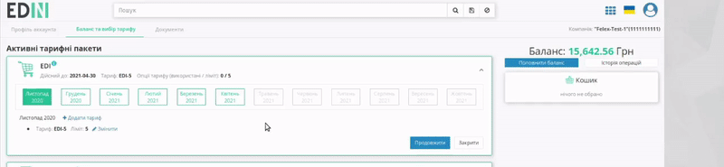

2) **"Змінити"** - зміна обраного тарифу :underline:`для будь-якого місяця оплаченого періоду` (необхідно обрати тариф):

.. image:: pics_PCInstruction/PCInstruction_79.gif
   :align: center

.. note::
   За допомогою особистого кабінету тариф можливо змінити тільки у більшу сторону. Під зміною тарифного пакету мається на увазі зміна опцій оплаченого сервісу(ів). При зміні вираховується сума, яку потрібно оплатити з урахуванням раніше оплаченого тарифного пакету. Для зміни тарифу на зменшення необхідно зв’язатись з відповідальним менеджером та/або надіслати листа на sales@edin.ua (детальніше в п.6.3 `Правил користування платформою <https://wiki.edin.ua/uk/latest/Legal_info/Rules.html>`__)

.. attention::
   При **"Зміні"** тарифу (розширенні) встроєним в web функціоналом відбувається автоматичне списання коштів з балансу (подробиці в "Історії операцій"), однак якщо суми для автоматичної **"Зміни"** не достатньо, то буде створено рахунок у вкладці `"Документи" <https://wiki.edin.ua/uk/latest/Personal_Cabinet/PCInstruction.html#docs>`__. Після оплати рахунку потрібно ще раз зайти на платформу та повторно натиснути **"Змінити"** для списання коштів з балансу.

3) **"Продовжити"** - придбання вказаного сервісу на подальші періоди (можливо обрати тариф/кількості доступів, вказати період для розрахунку вартості сервісу):

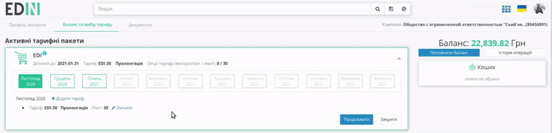

За допомогою кнопки **"Придбати"** здійснюється покупка сервісу з автоматичним списанням коштів з балансу.

.. image:: pics_PCInstruction/PCInstruction_49.png
   :align: center

.. hint::
   **"Рекомендований платіж" = Вартість обраного тарифу + 7%**
   
   Допомагає розрахувати суму поповнення балансу для роботи з обраними сервісами і не є обов'язковим.

Якщо вартість по сервісу перевищує наявні на балансу кошти, то система автоматично пропонує "Рекомендований платіж" для поповнення рахунку, а замість **"Придбати"** кнопка **"Замовити"** автоматично створює рахунок, що відображається у вкладці "Документи" -> `"Рахунки" <https://wiki.edin.ua/uk/latest/Personal_Cabinet/PCInstruction.html#invoice>`__, а замовлений сервіс відображається в **"Тарифних пакетах, які очікують оплати (діє 7 робочих днів)"** .

.. image:: pics_PCInstruction/PCInstruction_50.png
   :align: center

.. hint::
   За замовчуванням активована автоматична пролонгація сервісів при виборі тарифу. При активованій автоматичній пролонгації на початку місяця (1 числа) автоматично продовжується дія обраного тарифного пакету/кількості доступів по сервісу на аналогічний (обраний раніше) період дії на тих самих умовах. (Детальніше в п.6.6 `Правил користування платформою <https://wiki.edin.ua/uk/latest/Legal_info/Rules.html>`__) 

**1.2.2 Доступні для придбання тарифні пакети та сервіси**
~~~~~~~~~~~~~~~~~~~~~~~~~~~~~~~~~~~~~~~~~~~~~~~~~~~~~~

В **Доступних для покупки тарифних пакетах** можливо обрати **"Придбати"** сервіс чи **"Замовити"** послугу.

.. image:: pics_PCInstruction/PCInstruction_52.png
   :align: center

.. hint::
   За замовчуванням активована автоматична пролонгація сервісів при виборі тарифу. При активованій автоматичній пролонгації на початку місяця (1 числа) автоматично продовжується дія обраного тарифного пакету/кількості доступів по сервісу на аналогічний (обраний раніше) період дії на тих самих умовах. (Детальніше в п.6.6 `Правил користування платформою <https://wiki.edin.ua/uk/latest/Legal_info/Rules.html>`__) 

**"Придбати"** - придбання вказаного сервісу на подальші періоди (можливо обрати тариф/кількості доступів, вказати період для розрахунку вартості сервісу):

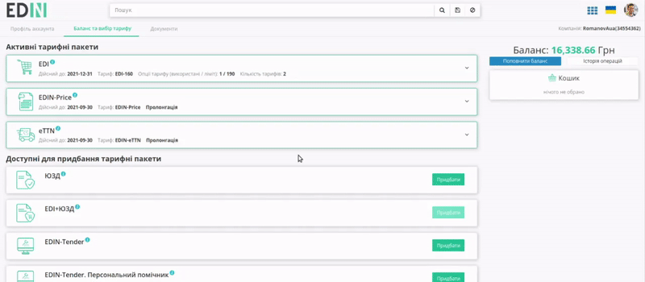

За допомогою кнопки **"Придбати"** здійснюється покупка сервісу з автоматичним списанням коштів з балансу.

.. image:: pics_PCInstruction/PCInstruction_49.png
   :align: center

.. hint::
   **"Рекомендований платіж" = Вартість обраного тарифу + 7%**
   
   Допомагає розрахувати суму поповнення балансу для роботи з обраними сервісами і не є обов'язковим.

Якщо вартість по сервісу перевищує наявні на балансу кошти, то система автоматично пропонує "Рекомендований платіж" для поповнення рахунку, а замість **"Придбати"** кнопка **"Замовити"** автоматично створює рахунок, що відображається у вкладці "Документи" -> `"Рахунки" <https://wiki.edin.ua/uk/latest/Personal_Cabinet/PCInstruction.html#invoice>`__, а замовлений сервіс відображається в **"Тарифних пакетах, які очікують оплати (діє 7 робочих днів)"** .

.. image:: pics_PCInstruction/PCInstruction_50.png
   :align: center

Кошик дозволяє перевірити вартість обраних сервісів і підтвердити їх покупку кнопкою **"Замовити"**. За потреби завжди можливо видалити обрані сервіси з кошика чи зі списку "Доступні для покупки тарифні пакети" (кнопка **"Видалити"**):

.. image:: pics_PCInstruction/PCInstruction_56.png
   :align: center

При **"Замовленні"** сервісу додатково можливо вказати інформацію по замовленню. Після відправки заявки на індивідуальну послугу в відділ по роботі з клієнтами відправляється лист в потребі встановлення зв'язку з користувачем та обговорення деталей в телефонному режимі:

.. image:: pics_PCInstruction/PCInstruction_55.png
   :align: center

.. _waiting-tariffs:

**1.2.3 Тарифні пакети, які очікують оплати**
~~~~~~~~~~~~~~~~~~~~~~~~~~~~~~~~~~~~~~~~~~~~~~~~~~~~~~

.. attention::
   Вартість сервісів та послуг компанії-провайдера зафіксована в євро валюті і на момент формування суми рахунку відбувається конвертація вартості в гривневий еквівалент згідно курсу валют на поточний день (`детальніше про термін дії неоплачених рахунків <https://wiki.edin.ua/uk/latest/Personal_Cabinet/PCInstruction.html#invoice>`__).

В **Тарифних пакетах, які очікують оплати** можливо перевірити дані замовлення (тариф/період сервісу) чи **"Видалити"** помилково замовлений сервіс:

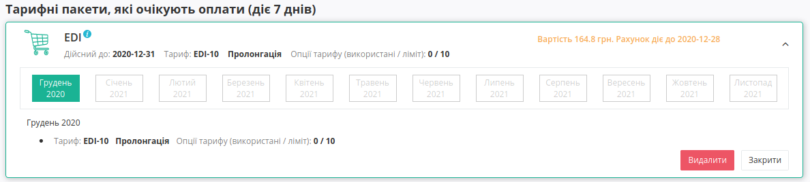

**1.2.4 Поповнення балансу**
~~~~~~~~~~~~~~~~~~~~~~~~~~~~~~~~~~~~~~~~~~~~~~~~~~~~~~

При **"Поповненні балансу"** потрібно вказати суму поповнення та натиснути кнопку **"Створити рахунок"**:

.. image:: pics_PCInstruction/PCInstruction_43.png
   :align: center

Після чого системою автоматино створюється рахунок-фактура (детальніше в описі вкладки `"Документи" <https://wiki.edin.ua/uk/latest/Personal_Cabinet/PCInstruction.html#docs>`__):

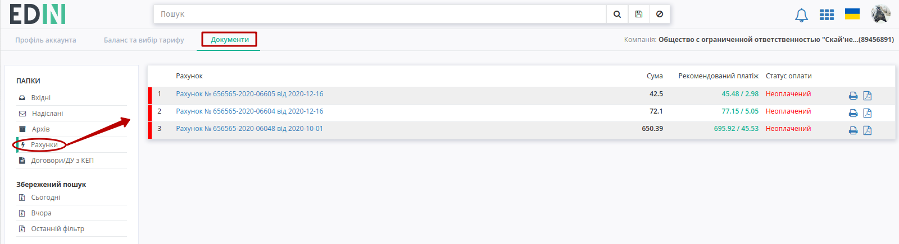

.. hint::
   При створенні рахунку він також автоматично відправляється на пошту.

Користувачу доступна **"Історія здійснених операцій"**:

.. image:: pics_PCInstruction/PCInstruction_42.png
   :align: center

----------------------------------

.. _docs:

**1.3 Документи**
----------------------------------

WEB-платформа завжди нагадає, якщо у Вас є неоплачені рахунки і допомагає в один клік їх переглянути (текст для зручності є посиланням в підрозділ **"Документи"**):

.. image:: pics_PCInstruction/PCInstruction_20.png
   :align: center

Функціонал вкладки **"Документи"** дозволяє обмінюватись документами (актами, рахунками) з компанією-провайдером АТС для отримання послуг електронного обміну документами і розділений на два основні блоки: каталоги (1) та журнал документів (2):

.. image:: pics_PCInstruction/PCInstruction_13.png
   :align: center

#. Папка "Вхідні" містить всі вхідні документи від компанії-провайдера для їх подальшого підписання ("Акти наданих послуг" (`COMDOC_013 <https://wiki.edin.ua/uk/latest/EDIN_Specs/XML/COMDOC_018_x.html>`__) та "Податкові накладні" (`DECLAR <https://wiki.edin.ua/uk/latest/EDIN_Specs/XML/DECLAR_x.html>`__)).
#. Папка "Надіслані" містить всі відправлені документи для компанії-провайдера.
#. Папка "Архів" містить всі архівні і оброблені документи, які перенесені в архів.
#. Папка "Рахунки" містить рахунки від компанії-провайдера для своєчасної оплати доступу.
#. Папка "Договори/ДУ з КЕП" містить файли договорів/додаткових угод з КЕП (кваліфікованим електронним підписом)
#. Окремо винесені фільтри документів по даті (**"Сьогодні"**, **"Вчора"**), а останній введений пошук зберігається платформою автоматично і при натисканні кнопки **"Останній фільтр"** він виконується повторно в тій папці ("Вхідні" / "Надіслані" / "Архів" / "Рахунки" / "Договори/ДУ з КЕП"), в якій він був виконаний останнього разу (Вас буде переадресовано)

.. _invoice:

**1.3.1 Рахунки**
~~~~~~~~~~~~~~~~~~~~~~~~~~~~~~~~~~~~~~~~~~~~~~~~~~~~~~

.. attention::
   Вартість сервісів та послуг компанії-провайдера зафіксована в євро валюті і на момент формування суми рахунку відбувається конвертація вартості в гривневий еквівалент згідно курсу валют на поточний день. Формування рахунків:
   
   1) **Після оформлення замовлення** (кнопка **"Замовити"** в Кошику) сума рахунку фіксується на 7 робочих (не календарних) днів. На восьмий робочий день неоплачений рахунок вважається анульованим. При оплаті рахунку після на восьмий день і пізніше кошти поступають на Баланс. Для активації послуги потрібно заново обрати і **"Придбати"** послугу (буде здійснено перерахунок вартості тарифу згідно нового валютного курсу).
   
   2) **При формуванні рахунку за автопролонгацією** (1-го робочого дня місяця) по курсу на цей день рахунок зберігається до кінця місяця. Щоденно за 5 робочих днів до закінчення місяця виконується додаткова перевірка. У разі відсутності активованого тарифного пакету на наступний місяць та в разі відсутності обраних, але ще не активованих тарифних пакетів на наступний місяць на момент перевірки - формується рахунок за автопролонгацією терміном дії 7 робочих днів.

В папці **"Рахунки"** документи позначаються різним кольором в залежності від статусу (:red:`Неоплачений` / :green:`Сплачений` / :orange:`Часткова оплата`) з зазначеними сумою, сумою з рекомендованим платежем / рекомендованим платежем (7% від суми):

.. image:: pics_PCInstruction/PCInstruction_85.png
   :align: center

В журналі доступний функціонал друку (|друк|), скачування документа в форматі pdf (|pdf|) та можливысть запросити оригінал (|карандаш|) для сплаченого рахунку.

Лівою кнопкою миші можливо обрати рахунок, щоб переглянути його вміст:

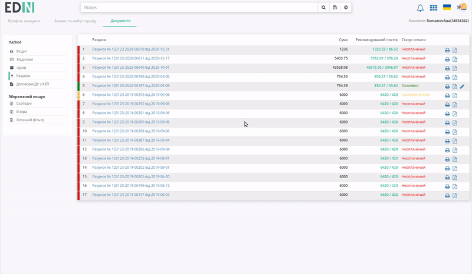

**1.3.2 Договори/ДУ з КЕП**
~~~~~~~~~~~~~~~~~~~~~~~~~~~~~~~~~~~~~~~~~~~~~~~~~~~~~~

В каталозі **"Договори/ДУ з КЕП"** відображаються Договори/ДУ, ініціатором (відправником) яких виступає компанія АТС. В журналі документів відображається коротка інформація (статус, дата/час отримання, відмітка про підписання зі сторони АТС):

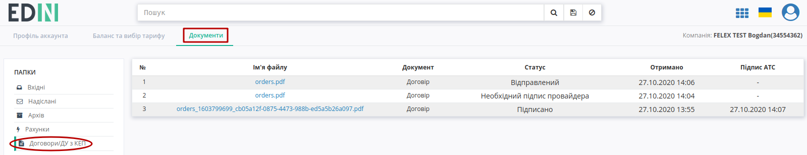

Можливі статуси договорів:

* Відправлений - новий документ очікує Вашого узгодження 
* Необхідний підпис провайдера - узгоджений Вами документ відправлено
* Підписано - документ підписаний обома сторонами
* Відхилено - документ відхилено

Для перегляду детальної інформації про документ потрібно натиснути на **"Ім'я файлу"**. 

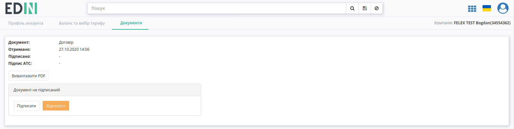

У відкритій формі нового документу можливо:

* **"Вивантажити PDF"** - вивантаження файлу для ознайомлення з його змістом
* **"Підписати"** - підписати документ АТС
* **"Відхилити"** - відхилити документ АТС

.. _sign:

**1.3.2.1 Підписання документа**
""""""""""""""""""""""""""""""""""""""""""""""""""""""

Для підписання договору необхідно натинути на кнопку **"Підписати"**.

.. image:: pics_PCInstruction/PCInstruction_72.png
   :align: center

Після ініціалізації бібліотеки підписання, система надасть можливість додати ключ для підписання. При :underline:`першому` підписанні у модальному вікні потрібно обрати файл чи токен (1), ввести пароль (2) та натиснути **"Зчитати"** (3) ключ для підписання:

.. image:: signing/file1n.png
   :align: center

.. image:: signing/file2n.png
   :align: center

При успішному додаванні ключа автоматично відобразиться особа, від імені якої буде здійснено підписання. У користувача може бути додано кілька ключів - для вибору потрібного для здійснення операції підписання потрібно проставити відмітку (4) лівою кнопкою миші і натиснути **"Підписати"** (5):

.. image:: signing/file3n.png
   :align: center

.. important::
   Якщо підписання цим ключем вже було здійснено або знайдена невідповідність даних ЄДРПОУ/ІПН (перевірка), то підписання блокується, а користувачу виводиться відповідне повідомлення:

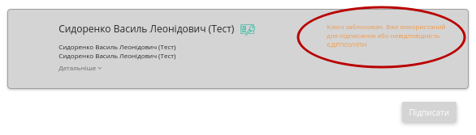

Додатково в вікні підписання можливо натиснути **"Детальніше"** для того, щоб переглянути інформацію про підписанта; можливо видалити помилкові ключі (|del_key|).

При подальшій роботі з раніше доданим ключем/-ами потрібно вводити лише пароль для обраного ключа:

.. image:: signing/file4n.png
   :align: center

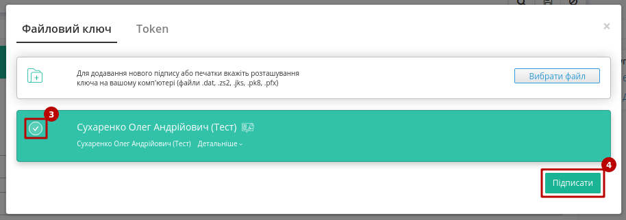

Після підписання документа його статус змінюється на **"Необхідний підпис провайдера"**, а при перегляді детальної інформації додатково відображається інформація щодо підписантів:

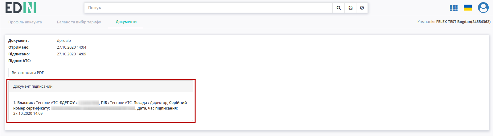

Після того, як документ буде підписано зі сторони АТС документ змінює свій статус на **"Підписано"**, а при перегляді детальної інформації відображається інформація про всіх підписантів:

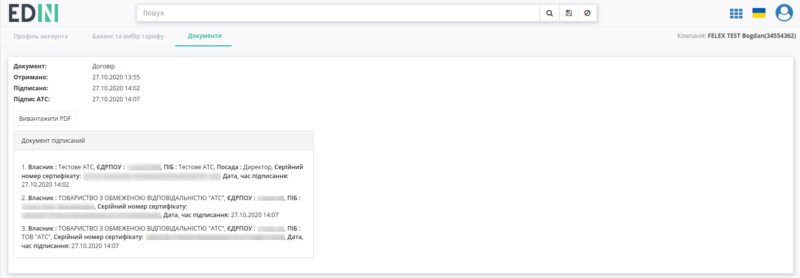

**1.3.2.2 Відхилення документа**
""""""""""""""""""""""""""""""""""""""""""""""""""""""

Для відхилення договору необхідно натинути на кнопку **"Відхилити"**. Після чого в вікні "Коментар" обов'язково потрібно заповнити причину відміни документа і підтвердити **"Скасування"** :

.. image:: pics_PCInstruction/PCInstruction_75.png
   :align: center

.. image:: pics_PCInstruction/PCInstruction_76.png
   :align: center

**2 Налаштування**
================================================

.. hint::
   В розділ також можливо перейти в два кліки з іконки користувача:

   .. image:: pics_PCInstruction/PCInstruction_39.png
      :align: center

Розділ дозволяє налаштовувати платформу, окремі сервіси, керувати компаніями, GLN-ами, користувачами та їх повноваженнями.

**2.1 GLN**
----------------------------------

В налаштуваннях **"GLN"** відображаються дані (Номер, Назва, Місто, Вулиця) по всім доданим GLN-ам, присутня можливість редагувати існуючі GLN (клік мишкою на номер) та додати до платфоми нові GLN:

.. image:: pics_PCInstruction/PCInstruction_22.png
   :align: center

При створенні нового GLN відкриється вікно з полями для заповнення, обов'язковим серед яких є лише "Назва", що буде відображатись контрагентам (відмічене червоною зірочкою :red:`*`):

.. image:: pics_PCInstruction/PCInstruction_82.png
   :align: center

.. important::
   При **"Cтворенні GLN"** з незаповненим полем "GLN" його значення автоматично генерується платформою EDIN 2.0. Номер GLN на відміну від решти даних неможливо відредагувати (лише додати). Неможливо зберегти дані для уже зареєстрованого GLN.

Після створення нового GLN автоматично відкривається форма редагування, що дозволяє відредагувати/доповнити інформацію, **"Видалити"** GLN чи додати пов'язаних з ним раніше доданих користувачів. При **"Додаванні користувача"** до GLN відкривається поле з випадаючим списком всіх користувачів в акаунті:

.. image:: pics_PCInstruction/PCInstruction_24n.png
   :align: center

.. image:: pics_PCInstruction/PCInstruction_25n.png
   :align: center

Пов'язані користувачі відображаються у списку. Розірвати зв'язок між користувачем та GLN можливо за допомогою червоної кнопки з іконкою відерця: 

.. image:: pics_PCInstruction/PCInstruction_26n.png
   :align: center

**2.2 Користувачі**
----------------------------------

В підрозділі відображається список всіх користувачів акаунту з їх ПІБ та відміткою про блокування користувача. Присутня можливість редагувати дані існуючих користувачів (клік мишкою на e-mail користувача, що за замовчуванням є і логіном для входу на платформу) та додати нового користувача (кнопка **"Створити"**):

.. image:: pics_PCInstruction/PCInstruction_62.png
   :align: center

При **створенні** нового користувача відкриється вікно з полями для заповнення, обов'язковими (відмічені червоною зірочкою :red:`*`) серед яких є "Email користувача", "Прізвище", "Ім'я", "Номер телефону" та `"Роль користувача" <https://wiki.edin.ua/uk/latest/Personal_Cabinet/PCInstruction.html#user-roles>`__ :

.. image:: pics_PCInstruction/PCInstruction_87.png
   :align: center

В "Додаткових налаштуваннях" (при створенні чи редагуванні користувача) є можливість увімкнути/вимкнути повідомлення від платформи EDIN чи налаштувати повідомлення для роботи з конкретним типом документів. 

.. hint::
   При **"Cтворенні"** нового користувача на вказану електронну пошту відправляється лист з запрошенням: 

   .. image:: pics_PCInstruction/PCInstruction_64.png
      :align: center

Після **створення** нового користувача автоматично відкривається **форма редагування**, що дозволяє змінити/доповнити інформацію, **"Заблокувати"** користувача, повторно **"Згенерувати пароль"** при його втраті:

.. image:: pics_PCInstruction/PCInstruction_61.png
   :align: center

При зміні Email користувача на вказаний (новий) Email теж відправляється лист для підтвердження поштової адреси.  

.. hint::
   При генеруванні нового паролю на вказану електронну пошту відправляється лист: 

   .. image:: pics_PCInstruction/PCInstruction_65.png
      :align: center

.. hint::
   Заблоковані користувачі помічаються в списку значком |bloсked|. Заблокованих користувачів можливо **"Розблокувати"** при редагуванні обраного користувача

.. _user-roles:

**2.2.1 Ролі користувачів**
~~~~~~~~~~~~~~~~~~~~~~~~~~~~~~~~~~~~~~~~~~~~~~~~~~~~~~

**"Ролі"** визначають, які сервіси будуть доступні користувачу в меню сервісів (кнопка |пресуха|). Змінити роль можливо наступним чином:

.. image:: pics_PCInstruction/PCInstruction_63.gif
   :width: 800px
   :align: center

.. note::
   1) Зміна ролей іншим користувачам доступна для **Супер адміністратора** та **Адміністратора**.
   2) Роль користувача не може бути змінена від імені цього користувача.
   3) **Адміністратор** не може змінити роль **Супер адміністратору**.

   * **Супер адміністратор** - необмежений доступ до сервісів та налаштувань. Роль не може бути змінена від імені цього користувача.
   * **Адміністратор** - необмежений доступ до сервісів та налаштувань, окрім розділу `"Аккаунт" <https://wiki.edin.ua/uk/latest/Personal_Cabinet/PCInstruction.html#account>`__.
   * **Бухгалтер (Фінансист)** - необмежений доступ до розділу Аккаунт та до обраних зі списку сервісів (невідмічені сервіси у користувача не відображаються).
   * **Користувач** - доступ лише до обраних зі списку сервісів (невідмічені сервіси у користувача не відображаються).

   .. image:: pics_PCInstruction/PCInstruction_60.png
      :align: center

   Наявність/відсутність відмітки в чекбоксах:
   
   * EDI - одночасно впливає на доступ до EDI і ЮЗД документів;
   * DISTRIBUTION - одночасно впливає на доступ до блоків "Виробник" та "Дистриб'ютор"

**2.3 Компанії**
----------------------------------

В підрозділі відображається список всіх компаній з короткою інформацією (Назва, ЄДРПОУ, ІПН, Місто, Адреса). Присутня можливість редагувати дані існуючих компаній (клік мишкою на назву компанії) та додати нову компанію (кнопка **"Створити компанію"**):

.. image:: pics_PCInstruction/PCInstruction_32.png
   :align: center

При створенні нової компанії відкриється вікно з полями для заповнення інформації про компанію:

.. image:: pics_PCInstruction/PCInstruction_33.png
   :align: center

А у вкладках **"Співробітники"**, **"Адреси"** і **"Тарифи"** одразу через кнопку **"Додати"** можливо створювати нових співробітників, додавати нові адреси та створювати `правила тарифікації <https://wiki.edin.ua/uk/latest/ETTN_2_0/Create_act_at_accepted_work.html#additional-functionality>`__ (для сервісу **"Е-ТТН"**) відповідно:   

.. image:: pics_PCInstruction/PCInstruction_34.png
   :align: center

.. image:: pics_PCInstruction/PCInstruction_88.png
   :align: center

.. image:: pics_PCInstruction/PCInstruction_36.png
   :align: center

-------------------------------------

.. include:: kontakti.rst
