Інструкція
#############################################################

.. role:: red

.. role:: orange

.. role:: green

.. role:: orange

.. role:: underline

.. сюда закину немного картинок для текста

.. |пресуха| image:: pics_PCInstruction/PCInstruction_03.png

.. |детальніше| image:: pics_PCInstruction/PCInstruction_05.png

.. |мусорка| image:: pics_PCInstruction/PCInstruction_11.png

.. |друк| image:: pics_PCInstruction/PCInstruction_15.png

.. |pdf| image:: pics_PCInstruction/PCInstruction_16.png

.. |карандаш| image:: pics_PCInstruction/PCInstruction_17.png

.. |bloсked| image:: pics_PCInstruction/PCInstruction_31.png

.. |key| image:: pics_PCInstruction/PCInstruction_134.png

.. |del_key| image:: signing/del_key2.png

.. |edit| image:: pics_PCInstruction/PCInstruction_174.png

.. |user| image:: pics_PCInstruction/PCInstruction_178.png

.. |delete| image:: pics_PCInstruction/PCInstruction_179.png

.. |delete2| image:: pics_PCInstruction/PCInstruction_233.png

.. |delete3| image:: pics_PCInstruction/PCInstruction_279.png

.. |approval| image:: /general_2_0/pics_rabota_s_platformoj_EDIN_2.0/rabota_s_platformoj_065.png

.. |red_trash| image:: /_constant/icons/red_trash.png

.. |edit_pencil| image:: /_constant/icons/edit_pencil.png

.. |delegation| image:: /_constant/icons/delegation.png

.. contents:: Зміст:
   :depth: 4

---------

Для початку роботи з "Особистим кабінетом" необхідно здійснити вхід на платформу EDIN 2.0. Ви можете використовувати будь-який браузер (рекомендованим є **Google Chrome** останньої версії). Для входу до платформи необхідно перейти за посиланням https://edo-v2.edin.ua/auth .

При переході за вказаним посиланням відкриється вікно авторизації. Необхідно ввести Ваш логін і пароль користувача і натиснути **"Вхід"**(`детальніше <https://wiki.edin.ua/uk/latest/general_2_0/User_registration.html#auth>`__).

Після успішної авторизації відкриється основне меню продуктів та рішень для вибору сервісу платформи EDIN: **"Вільний", "EDI Network", "Е-ТТН (версія 2)", "Маркет", "Е-Специфікація", "Комерційна пропозиція", "Tender", "Е-Сертифікати", "White Doc", "Інтеграція"**:

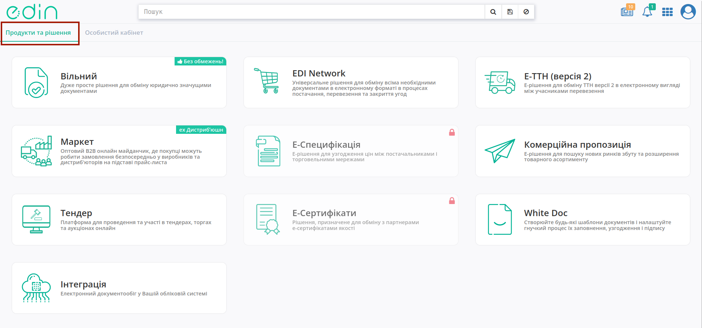

Розділ "Особистого кабінету" складається з розділів: **"Акаунт"** і **"Налаштування"**: 

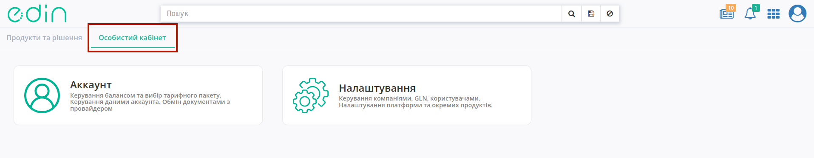

.. hint::
   Для повернення до меню сервісів можливо скористатись кнопкою |пресуха|

.. _account:

**1 Акаунт**
================================================

.. hint::
   В розділ також можливо перейти в два кліки з іконки користувача:

   .. image:: pics_PCInstruction/PCInstruction_342.png
      :align: center

Розділ **"Акаунт"** - це розділ Особистого кабінету клієнта, який призначений для взаємодії з провайдером, отримання та підписання документів від провайдера, керування Особовим рахунком (Балансом), вибору, зміни та налаштування тарифних пакетів. **"Акаунт"** в свою чергу містить підрозділи: **"Профіль акаунта"**, **"Баланс та вибір тарифу"**, **"Документи АТС"** та **"Білінг"**.

.. _account-profile:

**1.1 Профіль акаунта**
----------------------------------

Вкладка **"Профілю акаунта"** містить кілька розділів:

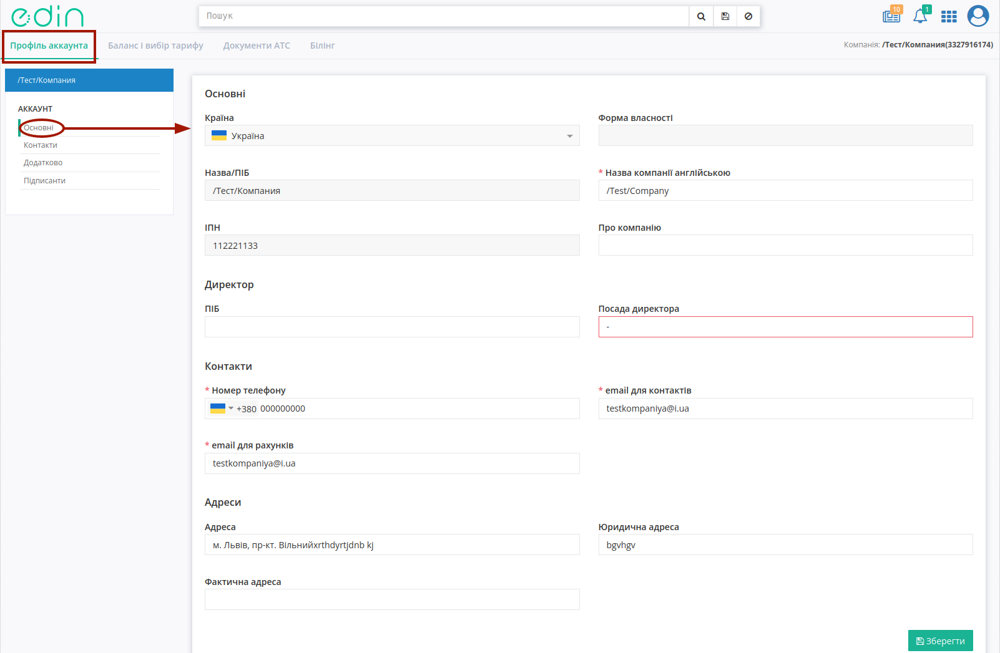

**Основні** юридичні дані компанії для роботи з рахунками та договорами (ці дані частково заповнюються при `реєстрації на платформі <https://wiki.edin.ua/uk/latest/general_2_0/User_registration.html>`__). В даному розділі можливо додати дані про **Директора** компанії, відредагувати раніше введені **Контакти** користувача та заповнити **Адреси**. 

.. hint::
   Поля обов'язкові до заповнення позначені червоною зірочкою :red:`*`.

**Контакти** для можливості звернення / врегулювання питань за сервісами, що надає компанія. В розділі **"Контакти"** можливо **"+Додати контакт"** за допомогою відповідної кнопки:

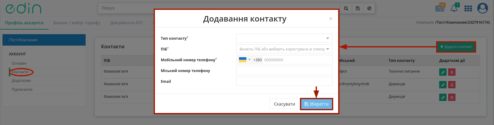

В виникаючому pop-up вікні потрібно обрати **Тип контакту** з випадаючого списку (фінансові питання / комерційні питання / технічні питання / дирекція / відповідальний за прайс-лист), вказати ПІБ контакту (ввести вручну та **"Застосувати введене значення"** чи обрати зі списку `користувачів <https://wiki.edin.ua/uk/latest/Personal_Cabinet/PCInstruction.html#users>`__ (працює пошук)), мобільний номер телефону та **"Зберегти"** контакт.

Додані контакти за потреби можливо **"Редагувати"** та **"Видалити"**:

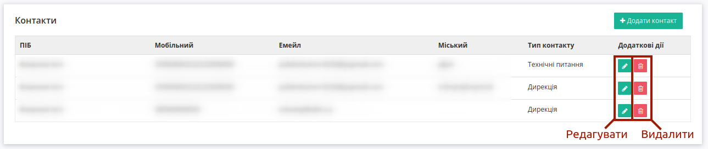

**Додатково** відображаються дані про договірні відносини, посилання на юридичні джерела (блок **"Додаткова інформація"**):

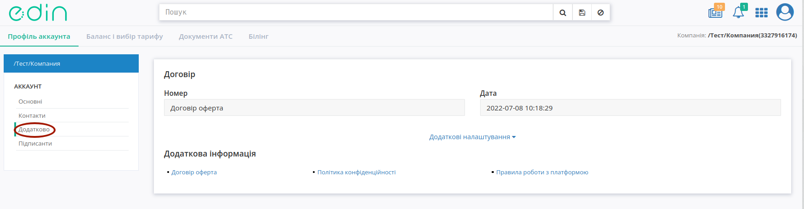

.. note::
   При натисканні на кнопку **"Додаткові налаштування"** можливо керувати автопролонгацією (автоматичне виставлення рахунків і списання грошових коштів для відкриття доступу на наступний період) - **"Активувати"** / **"Деактивувати"**:

   .. image:: pics_PCInstruction/PCInstruction_347.png
      :align: center

В розділі **"Підписанти"** користувачі можуть самостійно заповнювати/редагувати дані підписантів компанії:

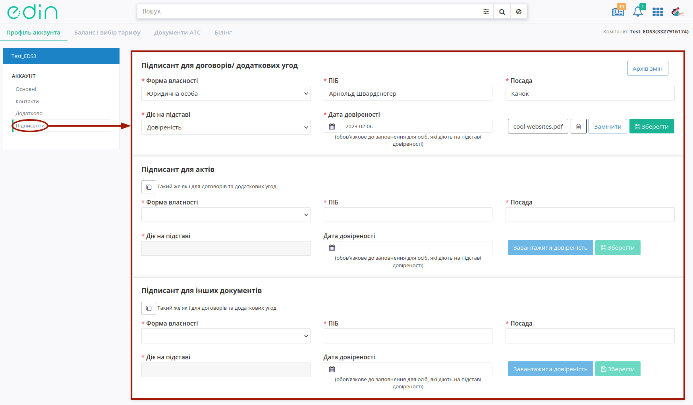

Дані підписантів зручно розділені за блоками:

* Підписантів для договорів / додаткових угод
* Підписантів для актів
* Підписантів для інших документів

.. include:: /Personal_Cabinet/because_PC_is_too_large.rst
   :start-after: .. початок блоку для pcSignatories
   :end-before: .. кінець блоку для pcSignatories

Розділ **"Дані водія"** відображається лише у тих компаній, що працюють в якості ФОП-Перевізника та відображає основні дані Водія (ПІБ, Номер телефону, Посвідчення водія).    

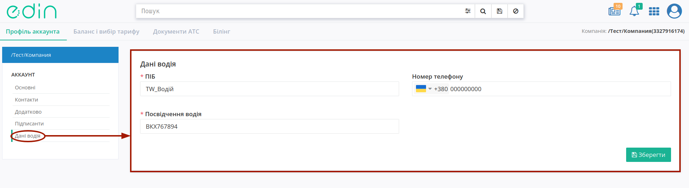

.. _balans-tariff:

**1.2 Баланс та вибір тарифу**
----------------------------------

.. raw:: html

   

       <iframe src="https://www.youtube.com/embed/_q4NzEhoGHw" frameborder="0" allowfullscreen style="position: absolute; top: 0; left: 0; width: 100%; height: 100%;"></iframe>
   

---------

.. note::
   Розділ **"Баланс та вибір тарифу"** доступний лише для користувачів, котрі використовують Нову тарифну модель. Для підключення нової тарифної моделі Вам необхідно надіслати листа на електронну адресу sales@edin.ua .

Функціонал вкладки **"Баланс та вибір тарифу"** дозволяє в автоматичному чи напівавтоматичному режимі придбати доступ до сервісів провайдера електронного документообігу чи замовити послуги компанії-провайдера; керувати обраними сервісами та тарифними пакетами.

Основними візуальними блоками конструктора тарифів є головне меню (1), панель для роботи з балансом (2) та журнал сервісів/рахунків (3), що змінює свій вигляд в залежності від розділу меню, в якому перебуває користувач:

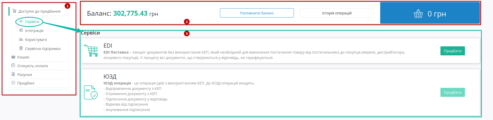

Головне меню **Конструктора тарифів** складається з:

* **Доступні до придбання** - доступні до придбання тарифні пакети сервісів/послуг, зручно згруповані по категоріям:
   * **Сервіси** - доступні сервіси компанії;
   * **Інтеграція** - рішення та послуги для інтегрованої роботи з платформою EDIN 2.0 з Вашої облікової системи;
   * **Користувачі** - підключення додаткових користувачів до платформи EDIN 2.0;
   * **Сервісна підтримка** - підключення підвищеного рівня підтримки до платформи EDIN 2.0;
   * **Спеціальні пропозиції** - спеціальні пропозиції компанії
* **Кошик** - обрані до покупки тарифні пакети;
* **Очікують оплати** - замовлені послуги, по яким був створений рахунок у розділі меню `"Рахунки" <https://wiki.edin.ua/uk/latest/Personal_Cabinet/PCInstruction.html#invoice>`__;
* **Рахунки** - рахунки, виставлені за послуги, що надаються ТОВ "АТС"; 
* **Придбані** - активні сервіси/послуги користувача з оплаченим доступом згідно обраного тарифного пакету/кількості доступів.

**1.2.1 Вибір тарифу**
~~~~~~~~~~~~~~~~~~~~~~~~~~~~~~~~~~~~~~~~~~~~~~~~~~~~~~

Зручніше всього ознайомитись з цінами на тарифні продукти компанії в розділі меню **Доступні до придбання**:

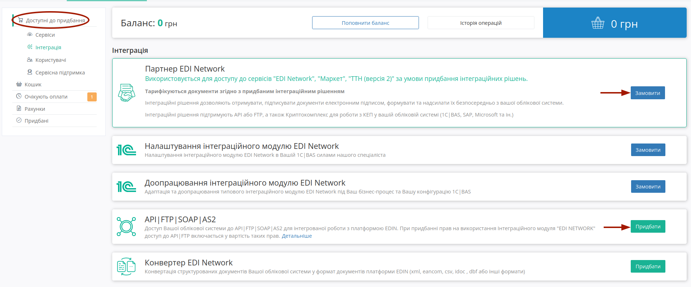

По кожному сервісу/послузі представлена коротка інфомація з перевагами його використання. Дізнатись вартість сервісу/послуги можливо за допомогою кнопок **"Придбати"** чи **"Замовити"**. 

**1.2.1.1 Придбання**
""""""""""""""""""""""""""""""""""""""""""""""""""""""

У відкритому pop-up вікні потрібно вибрати параметри (період, тарифний план, кількість доступів):

.. image:: pics_New_balance_tariff/New_balance_tariff_07.png
   :align: center

У вікні автоматично відобразиться вартість сервісу/послуги в залежності від обраних параметрів та діючих акційних знижок на момент придбання. Обраний сервіс/послугу можливо додати до кошика (кнопки **"Додати у кошик і продовжити покупки"** чи **"Додати і перейти до кошика"**):

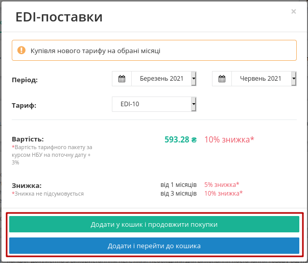

Після чого в розділі меню **"Кошик"** додається помітка з кількістю обраних сервісів/послуг, а в правому верхньому куті відображається загальна їх вартість. В розділі **"Доступні до придбання"** додані до **"Кошика"** сервіси мають відповідну помітку і їх можливо вилучити з корзини (кнопка **"Видалити"**):

.. image:: pics_New_balance_tariff/New_balance_tariff_09.png
   :align: center

**1.2.1.2 Замовлення**
""""""""""""""""""""""""""""""""""""""""""""""""""""""

При оформленні замовлення (кнопка **"Замовити"**), на відміну від придбання, додатково можливо вказати інформацію по замовленню (замовлення не потрапляють до **"Кошика"**). Після відправки заявки з Вами зв'яжеться співробітни компанії для обговорення деталей в телефонному режимі:

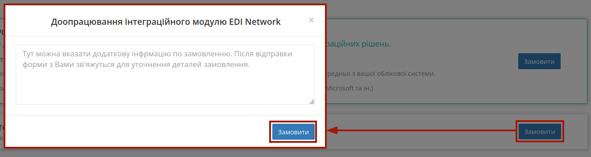

------------------------------------------------

.. hint::
   За замовчуванням активована автоматична пролонгація сервісів при виборі тарифу. При активованій автоматичній пролонгації на початку місяця (1 числа) автоматично продовжується дія обраного тарифного пакету/кількості доступів по сервісу на аналогічний (обраний раніше) період дії на тих самих умовах. (Детальніше в п.6.6 `Правил користування платформою <https://wiki.edin.ua/uk/latest/Legal_info/Rules.html>`__) 

.. _service-purchase:

**1.2.2 Придбання сервісу / ліцензії**
~~~~~~~~~~~~~~~~~~~~~~~~~~~~~~~~~~~~~~~~~~~~~~~~~~~~~~

В **"Кошику"** відображаються всі обрані до покупки сервіси. Перейти до **"Кошика"** можливо через меню чи кнопку з вартістю усіх обраних сервісів/послуг:

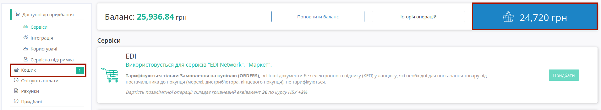

По кожному обраному до покупки сервісу вказується його ціна, знижка; вказується загальна вартість всіх обраних сервісів з урахуванням знижок і рекомендований платіж. За потреби завжди можливо відредагувати параметри обраних сервісів/послуг (кнопка **"Редагувати"**) чи **"Видалити"** з **"Кошика"**:

.. image:: pics_PCInstruction/PCInstruction_360.png
   :align: center

.. hint::
   **"Рекомендований платіж" = Вартість обраного тарифу + 7%**

   Допомагає розрахувати суму поповнення балансу для роботи з обраними сервісами і не є обов'язковим.

.. _serv-buy:

**1.2.2.1 Придбання сервісів**
""""""""""""""""""""""""""""""""""""""""""""""""""""""

Придбання обраних сервісів здійснюється:

1. При достатній кількості коштів на балансі ("сума на балансі" ⩾ "загальної суми до сплати") доступна кнопка **"Придбати"**:

.. image:: pics_PCInstruction/PCInstruction_361.png
   :align: center

За допомогою кнопки **"Придбати"** здійснюється покупка сервісу з автоматичним списанням коштів з балансу.

.. image:: pics_PCInstruction/PCInstruction_362.gif
   :align: center

2. Якщо коштів на балансі не достатньо ("сума на балансі" < "загальної суми до сплати"), то доступна кнопка **"Замовити"**:

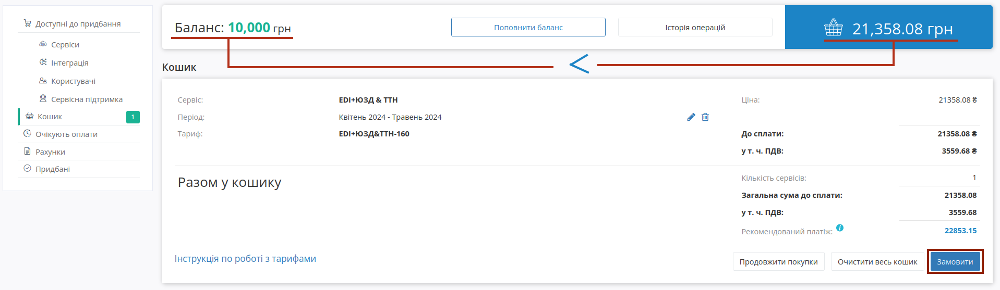

.. _waiting-tariffs:

За допомогою кнопки **"Замовити"** автоматично створюється рахунок, що відображається в розділі меню `"Рахунки" <https://wiki.edin.ua/uk/latest/Personal_Cabinet/PCInstruction.html#invoice>`__, а замовлені сервіси відображаються в розділі меню **"Очікують оплати"**: 

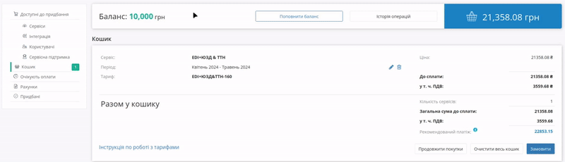

.. important::
   Рахунок на замовлені тарифні пакети, що **"Очікують оплати"** зберігається 7 :underline:`робочих` днів, після чого неоплачені тарифні пакети автоматично видаляються з цього розділу меню.

Здійснити покупку можливо оплативши рахунок (розділ `"Рахунки" <https://wiki.edin.ua/uk/latest/Personal_Cabinet/PCInstruction.html#invoice>`__) в зручний для Вас спосіб або поповнивши баланс (`детальніше <https://wiki.edin.ua/uk/latest/Personal_Cabinet/PCInstruction.html#balance>`__).

.. hint::
   При придбанні/зміні/докупці тарифу (за умови, що на балансі недостатньо коштів) активується безлімітний доступ на 2 :underline:`робочих` дні;

   Доступ блокується, якщо рахунок не оплачено на 3-ій :underline:`робочий` день (без оплати "останнього" рахунку доступ ще на 2 дні не надається);

   Блок знімається за умови, що коштів на балансі достатньо для покриття ДТ / тарифу (після цього можливо повторно отримати 2-денний доступ до сплати рахунку).

   2 дні лояльності (доступу) не активуються для рахунків, виставлених в рамках процедури автоматичної пролонгації.

.. warning::
   При поповненні балансу, якщо його сума перевищує вартість сервісів/послуг, що **"Очікують оплати"**, то ці кошти списуються автоматично!

В тому випадку, коли загальна вартість замовлених тарифних пакетів перевищує суму на балансі, однак вартість тарифного пакету сервісу менша суми на балансі, то в розділі **"Очікують оплати"** можливо обрати і **"Придбати"** такий тарифний пакет:

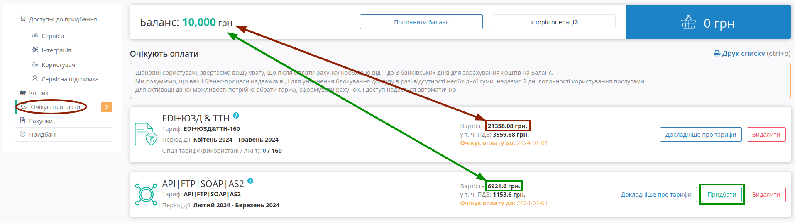

В розділі **"Очікують оплати"** можливо дізнатись **"Докладніше про тарифи"**, що будуть Придбані чи **"Видалити"** за потреби обрані тарифні пакети.

.. hint::
   За замовчуванням активована автоматична пролонгація сервісів при виборі тарифу. При активованій автоматичній пролонгації на початку місяця (1 числа) автоматично продовжується дія обраного тарифного пакету/кількості доступів по сервісу на аналогічний (обраний раніше) період дії на тих самих умовах. (Детальніше в п.6.6 `Правил користування платформою <https://wiki.edin.ua/uk/latest/Legal_info/Rules.html>`__).

Також список всіх тарифів, що очікують оплати для зручності можливо розрукувати чи завантажити в pdf форматі:

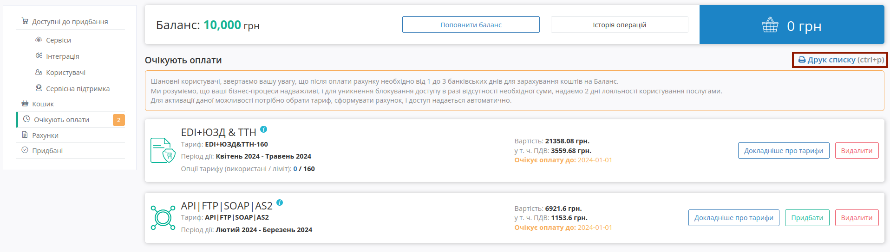

.. image:: pics_PCInstruction/PCInstruction_163.png
   :align: center

.. _lic-buy:

**1.2.2.2 Придбання ліцензій**
""""""""""""""""""""""""""""""""""""""""""""""""""""""

.. attention::
   Придбання ліцензій відрізняється від придбання інших продуктів і послуг компанії! Оформлення покупки можливо здійснити через "Особистий кабінет" (отримання рахунку-договору), однак оплата рахунку здійснються лише банківськими операціями зручним для Вас способом. Тобто: коштами на балансі в "Особистому кабінеті" оплата жодним способом не здійснюється (навіть за наявності потрібної суми). 

   Тарифи, що входять до спеціальних тарифів:

   * Інтеграційний модуль EDI Network (eTTN)
   * Інтеграційний модуль EDI Network (EDI+ЮЗД)
   * Інтеграційний модуль EDI Network ("Вільний”)

Для придбання ліцензій вище згаданих продуктів потрібно перейти в розділі **"Кошика"** натиснути **"Придбати"** чи **"Замовити"** (в даному випадку назва кнопки залежить від коштів на балансі і не впливає на функціонал) доступний спец тариф:

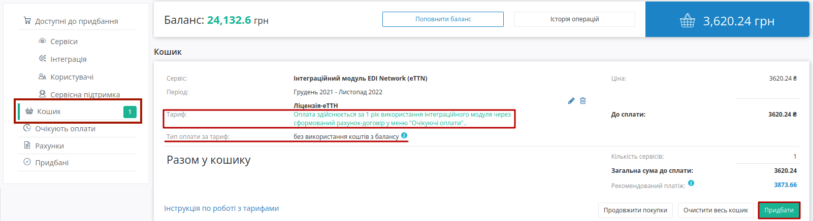

.. important::
   Оплата здійснюється за 1 рік використання інтеграційного модуля, через сформований рахунок-договір в меню **"Очікують оплати"** (без використання грошових коштів з балансу)

Після "Придбання"/"Замовлення" ліцензії вона з'являється в головному меню розділу **"Очікують оплати"**:

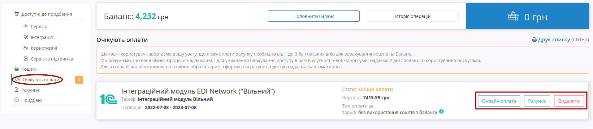

Розділ **"Очікують оплати"** в даному випадку містить неоплачені спеціальні послуги (ліцензії) і дозволяє:

* сплатити за виставлений рахунок онлайн за допомогою банківської картки чи іншим способом (кнопка **"Онлайн оплата"**);
* переглянути/скачати створений рахунок-договір (кнопка **"Рахунок"**) для подальшої оплати через банківські установи (створений рахунок-договір знаходиться в розділі меню `"Рахунки" <https://wiki.edin.ua/uk/latest/Personal_Cabinet/PCInstruction.html#invoice>`__);
* **"Видалити"** позицію з розділу **"Очікують оплати"**.

При **"Онлайн оплаті"** відбувається переадресація на сторінку для введення даних карти, використання Google Pay / Apple Pay / Приват24 чи в **"Інший спосіб"**, що доступний на цій сторінці:

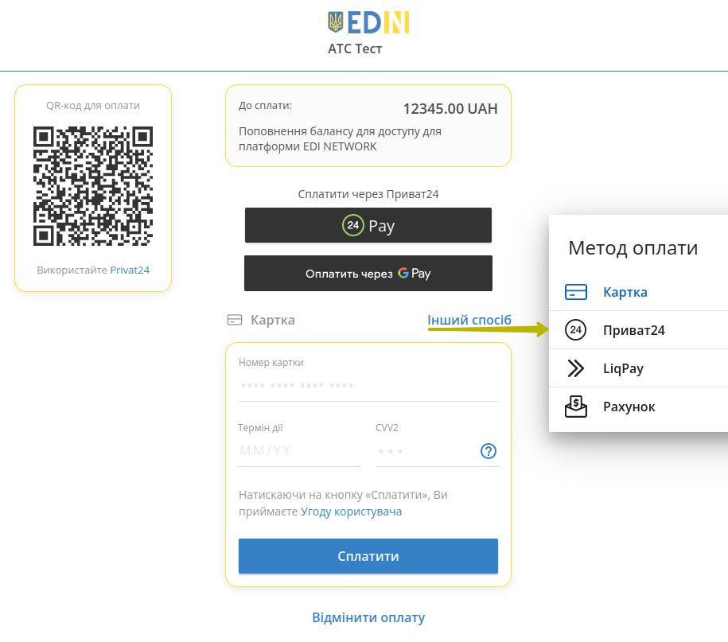

.. _support-buy:

**1.2.2.3 Придбання та продовження додаткової сервісної підтримки**
""""""""""""""""""""""""""""""""""""""""""""""""""""""""""""""""""""""""""""""""""""""""""""

В розділі **"Сервісна підтримка"** представлені можливості розширення базової сервісної підтримки:

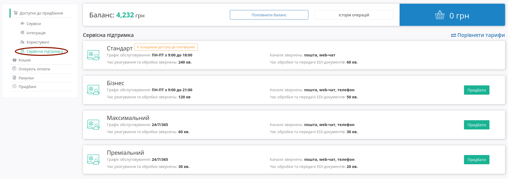

.. note::
   Сервісна підтримка **"Стандарт"** вже є складовою доступу до платформи.

В розділі **"Сервісна підтримка"** в тарифних пакетах розписані основні параметри, але для вибору сервісу можливо детальніше ознайомитись з можливостями за кнопкою **"Порівняти тарифи"**:

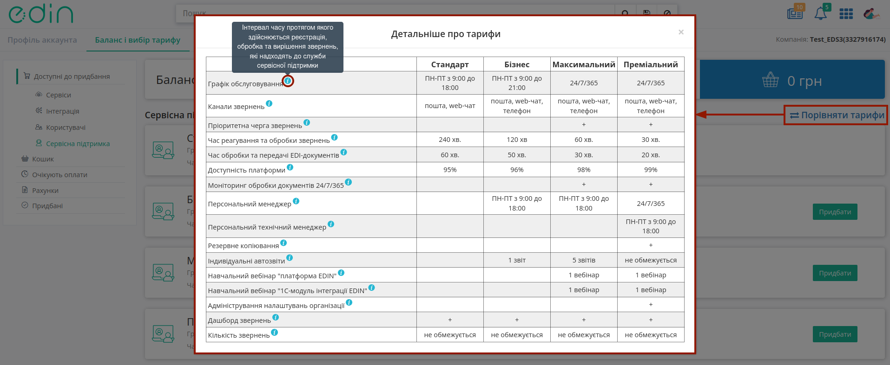

.. hint::
   При наведенні курсора на іконку |info| відображається опис параметра сервісної підтримки.

Покращити персональну сервісну підтримку можливо обравши доступний тариф і **"Придбати"** його:

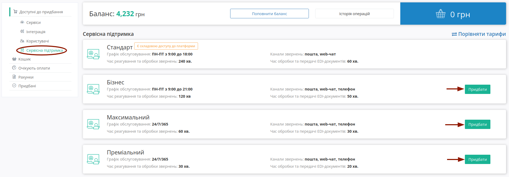

.. note::
   Кнопка **"Придбати"** сервісну підтримку не активна, якщо інший тариф сервісної підтримки знаходиться в розділі **"Очікують оплати"**! 

У відкритому pop-up вікні потрібно вибрати період і вартість обраного тарифного плану буде розрахована автоматично:

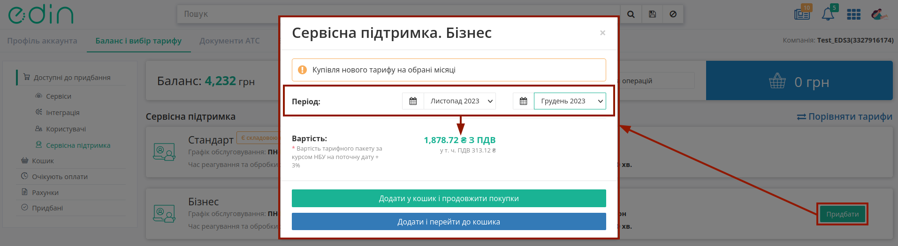

Обраний сервіс можливо додати до Кошика (кнопки **"Додати у кошик і продовжити покупки"** чи **"Додати і перейти до кошика"**):

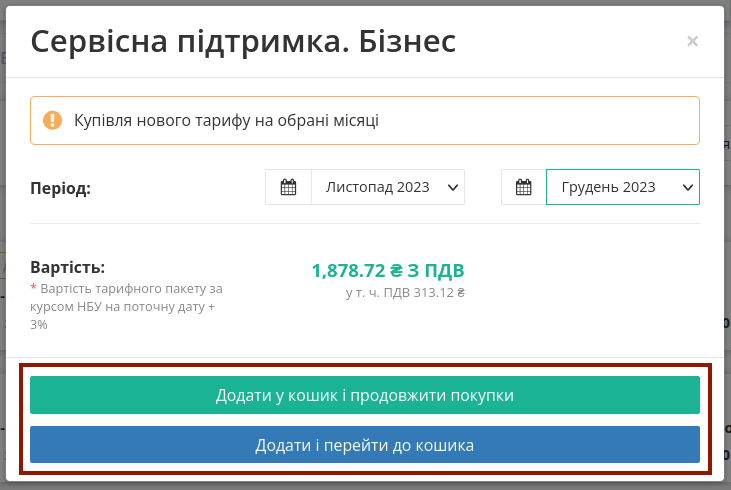

.. attention::
   Тарифні пакети сервісної підтримки при купівлі не використовують кошти з Балансу (навіть за наявності потрібної суми)!

   .. image:: pics_PCInstruction/PCInstruction_374.png
      :align: center

   Тому після натискання в розділі **"Кошик"** кнопки **"Придбати"** / **"Замовити"** "Сервісну підтримку" кошти з Балансу не списуються - формується рахунок (доступний в розділі `"Рахунки" <https://wiki.edin.ua/uk/latest/Personal_Cabinet/PCInstruction.html#invoice>`__), а сам сервіс відображається в розділі **"Очікують оплати"**:

   .. image:: pics_PCInstruction/PCInstruction_375.png
      :align: center

Розділ **"Очікують оплати"** в даному випадку містить неоплачені послуги додаткової сервісної підтримки і дозволяє:

* сплатити за виставлений рахунок онлайн за допомогою банківської картки чи іншим способом (кнопка **"Онлайн оплата"**);
* переглянути/скачати створений рахунок-договір (кнопка **"Рахунок"**) для подальшої оплати через банківські установи (створений рахунок-договір знаходиться в розділі меню `"Рахунки" <https://wiki.edin.ua/uk/latest/Personal_Cabinet/PCInstruction.html#invoice>`__);
* **"Видалити"** позицію з розділу **"Очікують оплати"**.

При **"Онлайн оплаті"** відбувається переадресація на сторінку для введення даних карти, використання Google Pay / Apple Pay / Приват24 чи в **"Інший спосіб"**, що доступний на цій сторінці:

--------------------------------------------------------------------------

.. note::
   Кнопка **"Продовжити"** сервісну підтримку не активна, якщо інший тариф сервісної підтримки знаходиться в розділі **"Очікують оплати"**!

Функціонал продовження тарифного пакету описаний в розділі `"Продовжити тарифний пакет" <https://wiki.edin.ua/uk/latest/Personal_Cabinet/PCInstruction.html#continue-tariff>`__.

**1.2.3 Докупити/продовжити/змінити тарифний пакет купленого сервісу**
~~~~~~~~~~~~~~~~~~~~~~~~~~~~~~~~~~~~~~~~~~~~~~~~~~~~~~~~~~~~~~~~~~~~~~~~~~~~~~~~~~~~~~~~~~~~~~~~~~~~~~~~~~~~

В розділі **"Придбані"** відображаються всі оплачені активні сервіси з інформацією по терміну їх доступності, обраному тарифу, залишок чи кількість (опції) на поточний та інші місяці (кнопка **"Докладніше про тарифи"**):

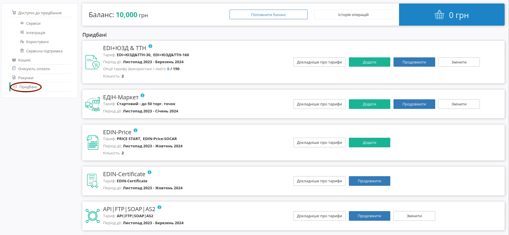

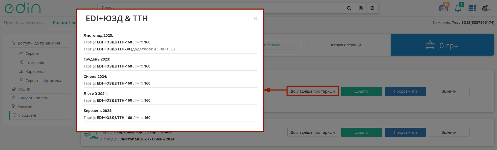

По кліку мишкою на використані транзакції здійснюється перехід до вкладки `"Білінг" <https://wiki.edin.ua/uk/latest/Personal_Cabinet/PCInstruction.html#billing>`__:

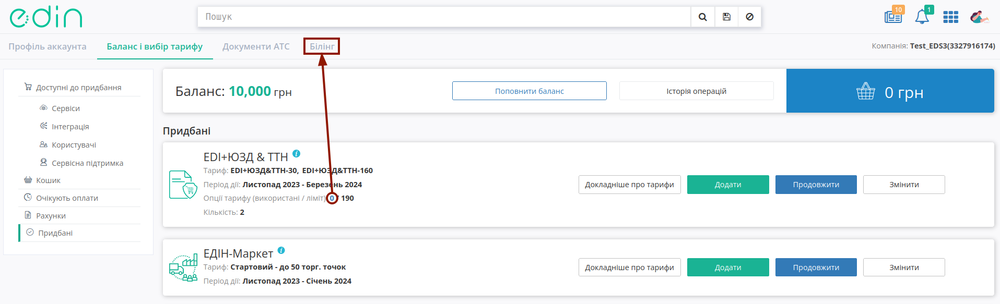

.. _purchase-tariff: 

**1.2.3.1 Докупити тарифний пакет**
""""""""""""""""""""""""""""""""""""""""""""""""""""""

За допомогою кнопки **"Додати"** можливо докупити (додати будь-який додатковий) тарифний пакет до :underline:`поточного місяця`:

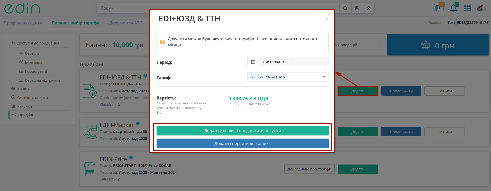

Покупка додаткового тарифного пакету здійснюється через **"Кошик"** (детальніше в розділі `Придбання сервісів <https://wiki.edin.ua/uk/latest/Personal_Cabinet/PCInstruction.html#service-purchase>`__).

.. hint::
   При придбанні/зміні/докупці тарифу (за умови, що на балансі недостатньо коштів) активується безлімітний доступ на 2 :underline:`робочих` дні;

   Доступ блокується, якщо рахунок не оплачено на 3-ій :underline:`робочий` день (без оплати "останнього" рахунку доступ ще на 2 дні не надається);

   Блок знімається за умови, що коштів на балансі достатньо для покриття ДТ / тарифу (після цього можливо повторно отримати 2-денний доступ до сплати рахунку).

   2 дні лояльності (доступу) не активуються для рахунків, виставлених в рамках процедури автоматичної пролонгації.

.. _continue-tariff:

**1.2.3.2 Продовжити тарифний пакет**
""""""""""""""""""""""""""""""""""""""""""""""""""""""

За допомогою кнопки **"Продовжити"** можливо здійснити пролонгацію :underline:`основного тарифу` [1]_ згідно тарифного пакету на поточний місяць (додати такий же тариф (без зміни кількості опцій) на новий період):

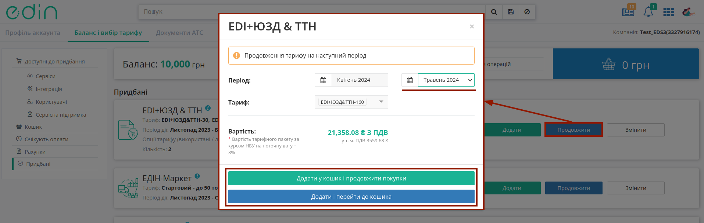

.. important::
   Функція **"Продовжити"** не доступна для :underline:`річних тарифів` [2]_, що вже оплачені більше ніж на 12 місяців.

Продовження тарифного пакету здійснюється через **"Кошик"** (детальніше в розділі `Придбання сервісів <https://wiki.edin.ua/uk/latest/Personal_Cabinet/PCInstruction.html#service-purchase>`__).

.. hint::
   При придбанні/зміні/докупці тарифу (за умови, що на балансі недостатньо коштів) активується безлімітний доступ на 2 :underline:`робочих` дні;

   Доступ блокується, якщо рахунок не оплачено на 3-ій :underline:`робочий` день (без оплати "останнього" рахунку доступ ще на 2 дні не надається);

   Блок знімається за умови, що коштів на балансі достатньо для покриття ДТ / тарифу (після цього можливо повторно отримати 2-денний доступ до сплати рахунку).

   2 дні лояльності (доступу) не активуються для рахунків, виставлених в рамках процедури автоматичної пролонгації.

**1.2.3.3 Змінити тарифний пакет**
""""""""""""""""""""""""""""""""""""""""""""""""""""""

За допомогою кнопки **"Змінити"** можливо здійснити зміну :underline:`основного тарифу` [1]_ в обраному періоді (лише в сторону збільшення тарифу):

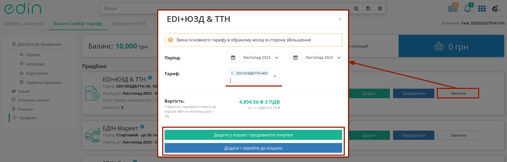

.. note::
   Під зміною тарифного пакету мається на увазі зміна опцій оплаченого сервісу(ів). При зміні вираховується сума, яку потрібно оплатити з урахуванням раніше оплаченого тарифного пакету. Для зміни тарифу на зменшення необхідно зв’язатись з відповідальним менеджером та/або надіслати листа на sales@edin.ua (детальніше в п.6.3 `Правил користування платформою <https://wiki.edin.ua/uk/latest/Legal_info/Rules.html>`__).

Зміна тарифного пакету сервісу здійснюється через **"Кошик"** (детальніше в розділі `Придбання сервісів <https://wiki.edin.ua/uk/latest/Personal_Cabinet/PCInstruction.html#service-purchase>`__).

.. hint::
   При придбанні/зміні/докупці тарифу (за умови, що на балансі недостатньо коштів) активується безлімітний доступ на 2 :underline:`робочих` дні;

   Доступ блокується, якщо рахунок не оплачено на 3-ій :underline:`робочий` день (без оплати "останнього" рахунку доступ ще на 2 дні не надається);

   Блок знімається за умови, що коштів на балансі достатньо для покриття ДТ / тарифу (після цього можливо повторно отримати 2-денний доступ до сплати рахунку).

   2 дні лояльності (доступу) не активуються для рахунків, виставлених в рамках процедури автоматичної пролонгації.

.. _balance:

**1.2.4 Поповнення балансу**
~~~~~~~~~~~~~~~~~~~~~~~~~~~~~~~~~~~~~~~~~~~~~~~~~~~~~~

Панель для роботи з балансом відображає поточний стан коштів на балансі для здійснення покупок тарифних пакетів чи послуг провайдера електронного документообігу:

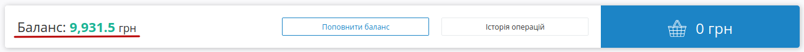

Для **"Поповнення балансу"** потрібно вказати суму (грн) і обрати спосіб поповнення: **"Онлайн оплата"** (LiqPay) або **"Створити рахунок"**.

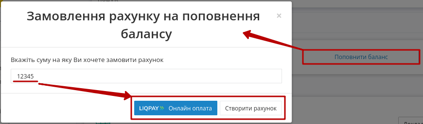

.. tabs::

   .. tab:: Онлайн оплата

      При **"Онлайн оплаті"** відбувається переадресація на сторінку для введення даних карти, використання Google Pay / Apple Pay / Приват24 чи в **"Інший спосіб"**, що доступний на цій сторінці:

      .. image:: pics_PCInstruction/PCInstruction_258.png
         :align: center

   .. tab:: Створити рахунок

      Після натискання на кнопку **"Створити рахунок"** системою автоматино створюється рахунок-фактура (детальніше в описі розділу меню `"Рахунки" <https://wiki.edin.ua/uk/latest/Personal_Cabinet/PCInstruction.html#invoice>`__):

      .. image:: pics_PCInstruction/PCInstruction_327.png
         :align: center

      .. hint::
         При створенні рахунку він також автоматично відправляється на пошту.

По всім здійсненим операціям з балансом ведеться **"Історія операцій"** (має зручний пошук):

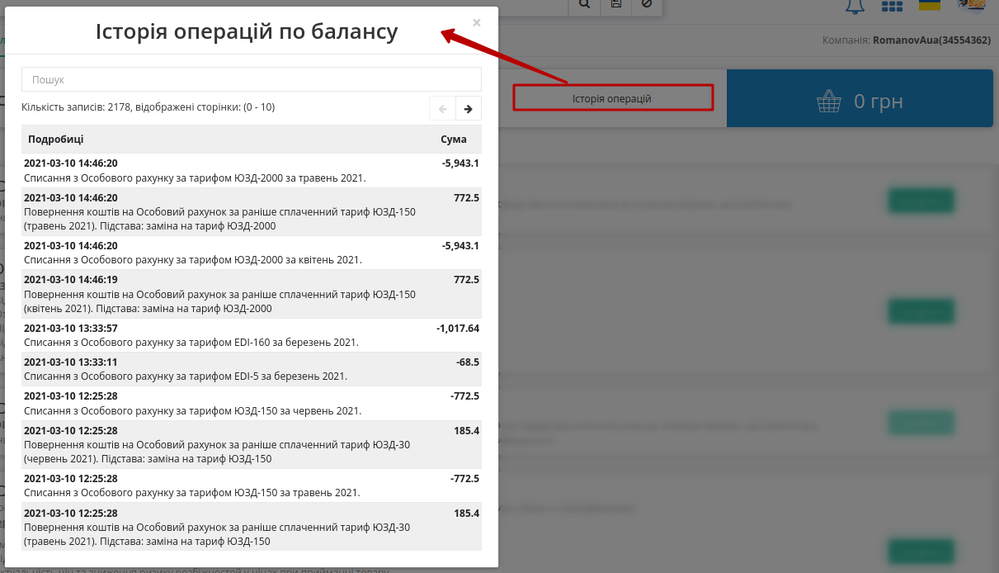

.. _invoice:

**1.2.5 Рахунки**
~~~~~~~~~~~~~~~~~~~~~~~~~~~~~~~~~~~~~~~~~~~~~~~~~~~~~~

WEB-платформа завжди нагадає, якщо у Вас є неоплачені рахунки і допомагає в один клік їх переглянути (текст для зручності є посиланням в підрозділ з рахунками):

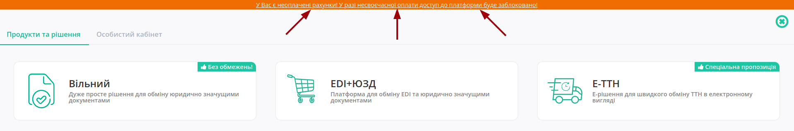

.. attention::
   Вартість сервісів та послуг компанії-провайдера зафіксована в євро валюті і на момент формування суми рахунку відбувається конвертація вартості в гривневий еквівалент згідно курсу валют на поточний день. Формування рахунків:
   
   1) **Після оформлення замовлення** (кнопка **"Замовити"** в Кошику) сума рахунку фіксується на 7 робочих (не календарних) днів. На восьмий робочий день неоплачений рахунок вважається анульованим. При оплаті рахунку після на восьмий день і пізніше кошти поступають на Баланс. Для активації послуги потрібно заново обрати і **"Придбати"** послугу (буде здійснено перерахунок вартості тарифу згідно нового валютного курсу).
   
   2) **При формуванні рахунку за автопролонгацією** (1-го робочого дня місяця) по курсу на цей день рахунок зберігається до кінця місяця. Щоденно за 5 робочих днів до закінчення місяця виконується додаткова перевірка. У разі відсутності активованого тарифного пакету на наступний місяць та в разі відсутності обраних, але ще не активованих тарифних пакетів на наступний місяць на момент перевірки - формується рахунок за автопролонгацією терміном дії 7 робочих днів.

В розділі **"Рахунки"** документи позначаються різним кольором в залежності від статусу [3]_ (:red:`Неоплачений` / :green:`Сплачений` / :orange:`Часткова оплата`) з зазначеними сумою, ПДВ, сумою з рекомендованим платежем / рекомендованим платежем (7% від суми):

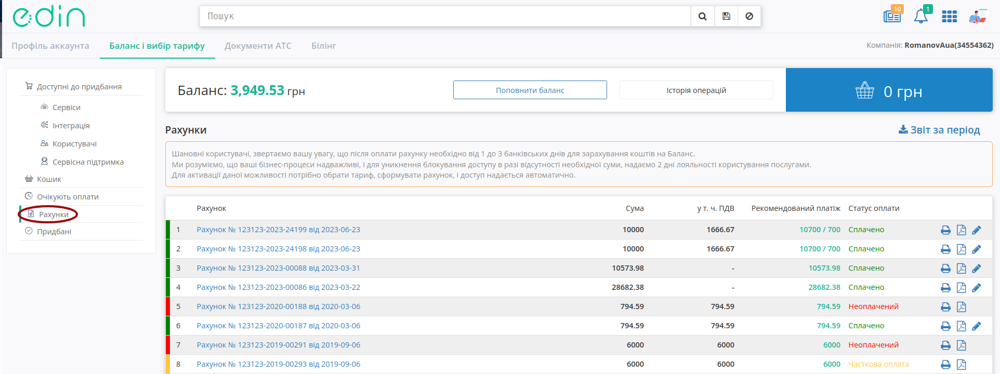

В журналі доступний функціонал друку (|друк|), скачування документа в форматі pdf (|pdf|) та можливість запросити оригінал (|карандаш|) для сплаченого рахунку.

Клікнувши лівою кнопкою миші на назву рахунку, можливо переглянути pdf-форму, ознайомитись з основною інформацією по рахунку (винесена в окремий блок):

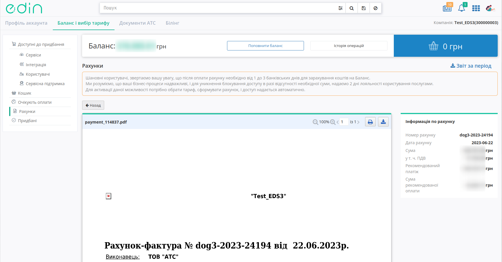

За допомогою кнопки **"Звіт за період"** можливо отримати Excel-звіт з деталізацією по тарифним пакетам, що включені в акт виконаних робіт від АТС за обраний період:

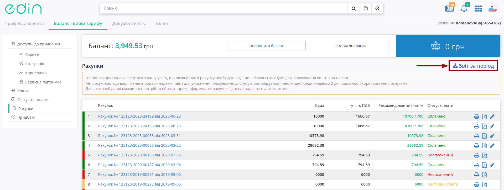

.. image:: pics_PCInstruction/PCInstruction_010.gif
   :align: center

В звіті відображається детальна інформація за сумами та датами, розбита на блоки "Поповнення в обраному періоді", "Списання в обраному періоді", "Використано з урахуванням періоду":

.. image:: pics_PCInstruction/PCInstruction_011.png
   :align: center

.. hint::
   Реалізована відправка Excel-звіту з деталізацією по актам виконаних робіт від "АТС" на 6-й рабочий день поточного місяця за минулий місяць на email для рахунків (`профіль акаунта <https://wiki.edin.ua/uk/latest/Personal_Cabinet/PCInstruction.html#account-profile>`__ -> контакти -> поле email для рахунків):

   .. image:: pics_PCInstruction/PCInstruction_131.png
      :align: center

----------------------------------

.. _docs:

**1.3 Документи АТС**
----------------------------------

WEB-платформа завжди нагадає, якщо у Вас є неоплачені рахунки і допомагає в один клік їх переглянути (текст для зручності є посиланням в підрозділ **"Документи АТС"**):

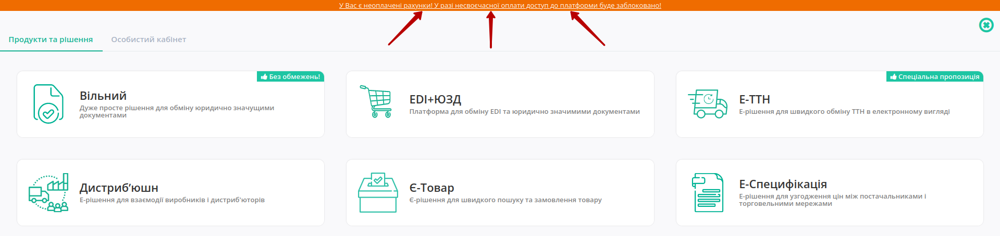

----------------------------------

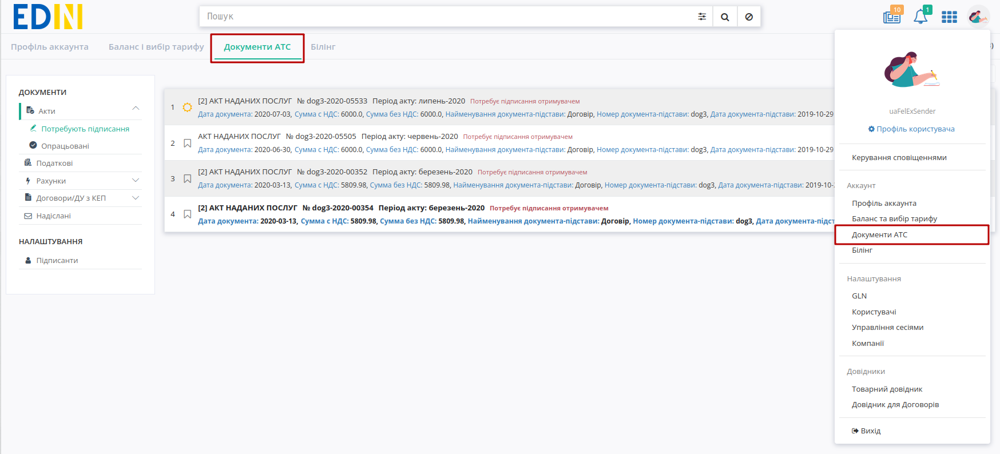

Функціонал вкладки **"Документи АТС"** дозволяє обмінюватись документами (актами, рахунками) з компанією-провайдером АТС для отримання послуг електронного обміну документами і розділений на два основні блоки: меню документів (1) та журнал документів (2):

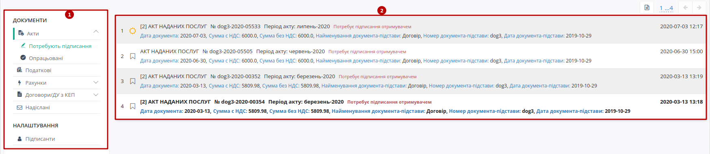

Також в блоці "Налаштувань" відображаються дані про Ваших підписантів.

.. _acts:

**1.3.1 Акти**
~~~~~~~~~~~~~~~~~~~~~~~~~~~~~~~~~~~~~~~~~~~~~~~~~~~~~~

**"Акти"** містить 2 підтеки, в яких документи "Акти наданих послуг" (`COMDOC_018 <https://wiki.edin.ua/uk/latest/EDIN_Specs/XML/COMDOC_018_x.html>`__) та "Акти коригування" (`COMDOC_036 <https://wiki.edin.ua/uk/latest/EDIN_Specs/XML/COMDOC_036_x.html>`__) згруповані по статусу:

   * "Потребують підписання" - документи, що мають статус "Потребує підписання отримувачем";
   * "Опрацьовані" - документи, що мають статус "Підтверджено з обох сторін".

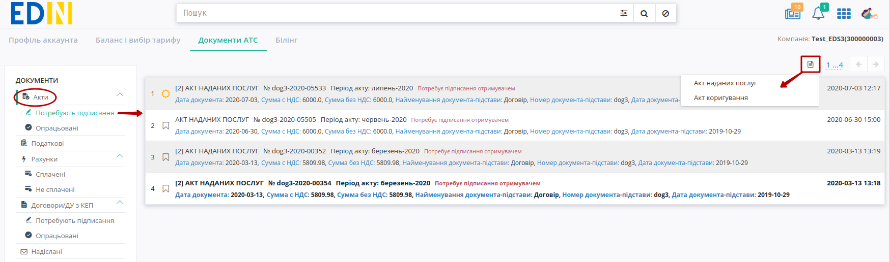

В журналі документи можливо зручно відфільтрувати за типом.

.. _doc-approval:

**1.3.2 Погодження**
~~~~~~~~~~~~~~~~~~~~~~~~~~~~~~~~~~~~~~~~~~~~~~~~~~~~~~

.. include:: /general_2_0/rabota_s_platformoj_EDIN_2.0.rst
   :start-after: .. початок блоку для Block_to_ATS_001
   :end-before: .. кінець блоку для Block_to_ATS_001

.. _approval-start:

**1.3.2.1 Запуск документа на погодження**
""""""""""""""""""""""""""""""""""""""""""""""""""""""""""""""""""""""""

.. include:: /general_2_0/rabota_s_platformoj_EDIN_2.0.rst
   :start-after: .. початок блоку для Block_to_ATS_002
   :end-before: .. кінець блоку для Block_to_ATS_002

.. _approval-ok:

**1.3.2.2 Погодити документ**
""""""""""""""""""""""""""""""""""""""""""""""""""""""""""""""""""""""""

.. include:: /general_2_0/rabota_s_platformoj_EDIN_2.0.rst
   :start-after: .. початок блоку для Block_to_ATS_003
   :end-before: .. кінець блоку для Block_to_ATS_003
.. _approval-no:

**1.3.2.3 Відхилити документ**
""""""""""""""""""""""""""""""""""""""""""""""""""""""""""""""""""""""""

.. include:: /general_2_0/rabota_s_platformoj_EDIN_2.0.rst
   :start-after: .. початок блоку для Block_to_ATS_004
   :end-before: .. кінець блоку для Block_to_ATS_004

.. _taxDocuments:

**1.3.3 Податкові**
~~~~~~~~~~~~~~~~~~~~~~~~~~~~~~~~~~~~~~~~~~~~~~~~~~~~~~

**"Податкові"** містить документи "Податкові накладні" (`DECLAR <https://wiki.edin.ua/uk/latest/EDIN_Specs/XML/DECLAR_x.html>`__) та "Коригування до податкових накладних (`DECLARj12 <https://wiki.edin.ua/uk/latest/EDIN_Specs/XML/DECLAR_x.htmlj12>`__).

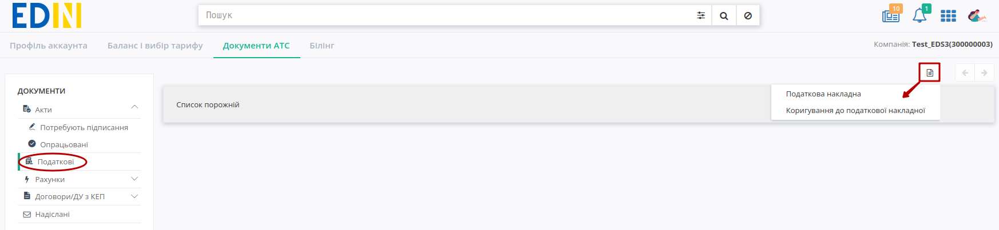

В журналі документи можливо зручно відфільтрувати за типом.

.. _invoice:

**1.3.4 Рахунки**
~~~~~~~~~~~~~~~~~~~~~~~~~~~~~~~~~~~~~~~~~~~~~~~~~~~~~~

**"Рахунки"** - містить 2 підтеки, в яких рахунки згруповані по статусу:

   * "Сплачені" - рахунки, що мають статус :green:`Сплачено`;
   * "Не сплачені" - рахунки, що мають статус :red:`Неоплачений` / :orange:`Часткова оплата`.

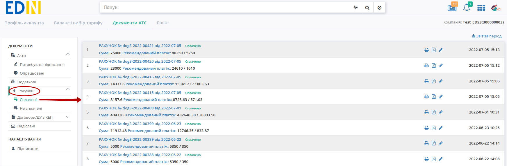

По кожному рахунку зазначена сума, сума з рекомендованим платежем / рекомендований платіж окремо (7% від суми).

.. attention::
   Вартість сервісів та послуг компанії-провайдера зафіксована в євро валюті і на момент формування суми рахунку відбувається конвертація вартості в гривневий еквівалент згідно курсу валют на поточний день. Формування рахунків:
   
   1) **Після оформлення замовлення** (кнопка **"Замовити"** в Кошику) сума рахунку фіксується на 7 робочих (не календарних) днів. На восьмий робочий день неоплачений рахунок вважається анульованим. При оплаті рахунку після на восьмий день і пізніше кошти поступають на Баланс. Для активації послуги потрібно заново обрати і **"Придбати"** послугу (буде здійснено перерахунок вартості тарифу згідно нового валютного курсу).
   
   2) **При формуванні рахунку за автопролонгацією** (1-го робочого дня місяця) по курсу на цей день рахунок зберігається до кінця місяця. Щоденно за 5 робочих днів до закінчення місяця виконується додаткова перевірка. У разі відсутності активованого тарифного пакету на наступний місяць та в разі відсутності обраних, але ще не активованих тарифних пакетів на наступний місяць на момент перевірки - формується рахунок за автопролонгацією терміном дії 7 робочих днів.

В журналі доступний функціонал друку (|друк|), скачування документа в форматі pdf (|pdf|) та можливысть запросити оригінал (|карандаш|) для сплаченого рахунку.

Клікнувши лівою кнопкою миші на назву рахунку, можливо переглянути pdf-форму, ознайомитись з основною інформацією по рахунку (винесена в окремий блок):

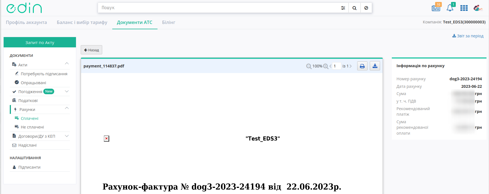

Для зручності можливо вивантажити Excel-звіт з деталізацією за тарифними пакетами за допомогою кнопки **"Звіт за період"**:

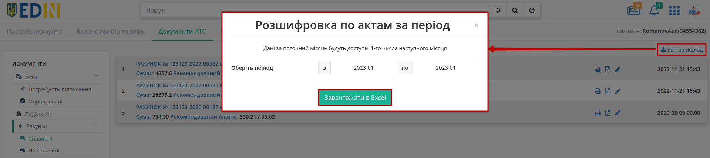

В модальному вікні потрібно обрати інтервал, після чого звіт можливо **"Завантажити в Excel"**. Звіт можливо формувати з кроком в місяць, загальним інтервалом не більше 1 року.

.. _contracts-kep:

**1.3.5 Договори/ДУ з КЕП**
~~~~~~~~~~~~~~~~~~~~~~~~~~~~~~~~~~~~~~~~~~~~~~~~~~~~~~

**"Договори/ДУ з КЕП"** містить 2 підтеки, в яких документи згруповані по статусу:

   * "Потребують підписання" - вхідні / вихідні документи, що мають статус :green:`Відправлений` / :red:`Необхідний підпис провайдера`;
   * "Опрацьовані" - містить вхідні / вихідні документи, що мають статус :green:`Підписано`/ :red:`Відхилено` / :green:`Відправлений` (не потребує опрацювання отримувачем).

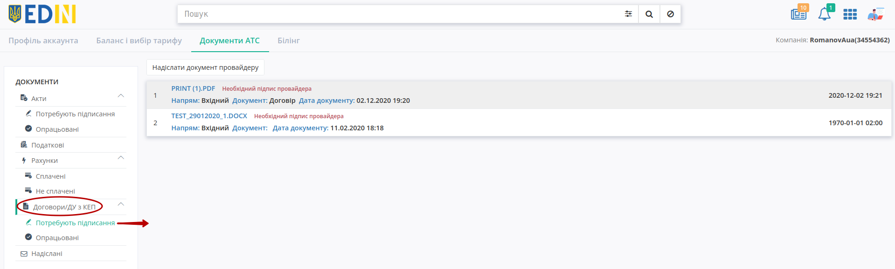

В каталозі **"Договори/ДУ з КЕП"** відображаються Договори/ДУ, ініціатором (відправником) яких виступаєте Ви чи компанія АТС. В журналі документів відображається коротка інформація (напрям документа (вхідний/вихідний), тип документа, статус, дата документа, відмітка про підписання зі сторони АТС):

.. image:: pics_PCInstruction/PCInstruction_165.png
   :align: center

Можливі статуси документів:

* :green:`Відправлений` - новий документ очікує узгодження зі сторони контрагента 
* :red:`Необхідний підпис провайдера` - узгоджений Вами документ відправлено
* :green:`Підписано` - документ підписаний обома сторонами
* :red:`Відхилено` - документ відхилено

**1.3.5.1 Робота з вхідними документами від АТС**
""""""""""""""""""""""""""""""""""""""""""""""""""""""""""""""""""""""""

Для перегляду детальної інформації про документ потрібно натиснути на **"Ім'я файлу"**. Після чого відкривається форма з інформацією про документ. Так новий вхідний документ виглядатиме:

.. image:: pics_PCInstruction/PCInstruction_166.png
   :align: center

У відкритій формі нового вхідного документа можливо:

* **"Вивантажити PDF"** - вивантаження файлу для ознайомлення з його змістом;
* **"Підписати"** - підписати документ АТС;
* **"Відхилити"** - відхилити документ АТС.

Для підписання договору необхідно натиснути на кнопку **"Підписати"**.

.. image:: pics_PCInstruction/PCInstruction_72.png
   :align: center

.. _sign:

**1.3.5.1.1 Підписання документа**
++++++++++++++++++++++++++++++++++++++++++++++++++++

.. загальне підписання на платформі

.. tabs::

   .. tab:: Файловий ключ

      .. include:: /_constant/signing/signing.rst
         :start-after: .. початок блоку для Signing
         :end-before: .. кінець блоку для Signing

   .. tab:: Token

      .. include:: /_constant/token_signing/token_signing.rst
         :start-after: .. початок блоку для TokenSign
         :end-before: .. кінець блоку для TokenSign

   .. tab:: Гряда

      .. include:: /_constant/gryada_signing/gryada_signing.rst
         :start-after: .. початок блоку для GryadaSign
         :end-before: .. кінець блоку для GryadaSign

   .. tab:: Cloud

      .. include:: /_constant/cloud_signing/cloud_signing.rst
         :start-after: .. початок блоку для CloudSign
         :end-before: .. кінець блоку для CloudSign

Після підписання документа його статус змінюється на **"Необхідний підпис провайдера"**, а при перегляді детальної інформації додатково відображається інформація щодо підписантів:

.. image:: pics_PCInstruction/PCInstruction_108.png
   :align: center

Після підписання з'являється можливість відправити документ на **"Друк"** та **"Вивантажити в .p7s"**. На друковану форму документа (pdf) додається водяний знак в верхньому лівому куті кожної сторінки файлу, а також додається сторінка листа підписання:

Водяний знак містить інформацію, про те що файл було підписано в EDI Network, GUID документа.

.. image:: pics_PCInstruction/PCInstruction_107.png
   :align: center

Лист підписання містить інформацію про документ та його підписантів.

Після того, як документ буде підписано зі сторони АТС документ змінює свій статус на **"Підписано"**, а при перегляді детальної інформації відображається інформація про всіх підписантів:

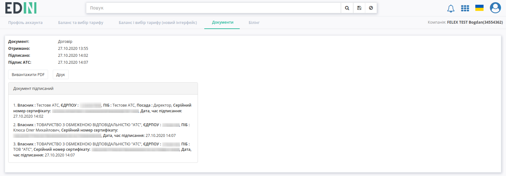

**1.3.5.1.2 Відхилення документа**
++++++++++++++++++++++++++++++++++++++++++++++++++++

Для відхилення договору необхідно натинути на кнопку **"Відхилити"**. Після чого в вікні "Коментар" обов'язково потрібно заповнити причину відміни документа і підтвердити **"Скасування"** :

.. image:: pics_PCInstruction/PCInstruction_75.png
   :align: center

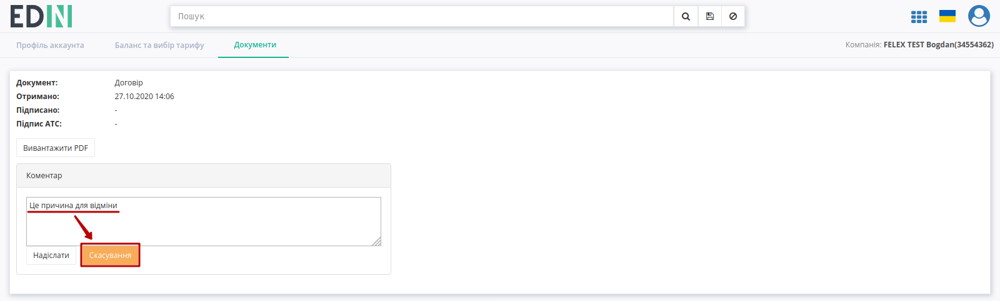

.. _send-doc-to-ats:

**1.3.5.2 Відправка документів провайдеру (в ТОВ "АТС")**
""""""""""""""""""""""""""""""""""""""""""""""""""""""""""""""""""""""""

Провайдеру електронного документообігу (в компанію ТОВ "АТС") можливо відправляти документи у вигляді pdf файлів (не більше 5Мб) за допомогою кнопки **"Надіслати документ провайдеру"**:

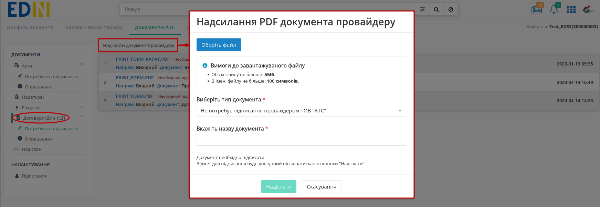

В модальному вікні перед тим, як **"Надіслати"** документ потрібно вибрати pdf файл (кнопка **"Оберіть файл"**), вказати тип документа (потребує / не потребує підписання зі сторони провайдера ТОВ "АТС") та назву документа (не більше 100 символів):

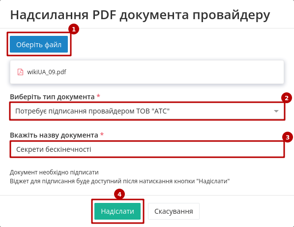

Відправка документа потребує його підписання (накладання підпису - стандартна операція на платформі, що `описана в розділі вище <https://wiki.edin.ua/uk/latest/Personal_Cabinet/PCInstruction.html#sign>`__. Після успішного підписання документа він автоматично відправляється в ТОВ "АТС" і відображається в журналі зі статусом :green:`Відправлений` чи :red:`Необхідний підпис провайдера`, якщо при відправці було обрано значення "Потребує підписання провайдером ТОВ АТС".

.. _act-request:

**1.3.6 Запит по Акту**
~~~~~~~~~~~~~~~~~~~~~~~~~~~~~~~~~~~~~~~~~~~~~~~~~~~~~~

Функціонал доступний в папці **Вхідні** і дозволяє зробити **"Запит по Акту"** в компанію ТОВ "АТС" прямо з платформи:

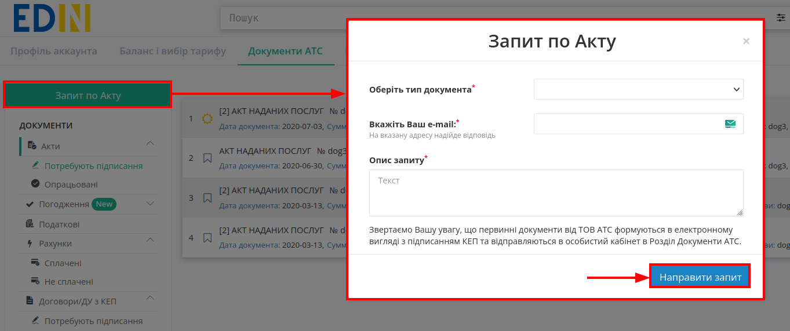

Після натискання на кнопку **"Запит по Акту"** відкривається модальне вікно з полями, що є обов'язковими до заповнення: "Тип документа" (Акт / Акт звірки), "Ваш e-mail", "Опис запиту". Після того, як Ви введете дані по запиту можливо **"Направити запит"** в компанію ТОВ "АТС". Про успішну відправку запиту Ви будете проінформовані сповіщенням на платформі:

Первинні документи від ТОВ "АТС" формуються в електронному вигляді з підписанням КЕП - Ви отримаєте їх у розділі **Документи АТС**. Додатково (за потреби) на вказаний e-mail може бути надіслано роз'яснення та копія документа.

.. _contracts-kep:

**1.3.7 Надіслані**
~~~~~~~~~~~~~~~~~~~~~~~~~~~~~~~~~~~~~~~~~~~~~~~~~~~~~~

**"Надіслані"** містить всі вихідні документи для компанії-провайдера (відправлені в ТОВ "АТС").

.. image:: pics_PCInstruction/PCInstruction_302.png
   :align: center

.. _signatories:

**1.3.8 Підписанти**
~~~~~~~~~~~~~~~~~~~~~~~~~~~~~~~~~~~~~~~~~~~~~~~~~~~~~~

В розділі **"Підписанти"** користувачі можуть самостійно заповнювати/редагувати дані підписантів компанії:

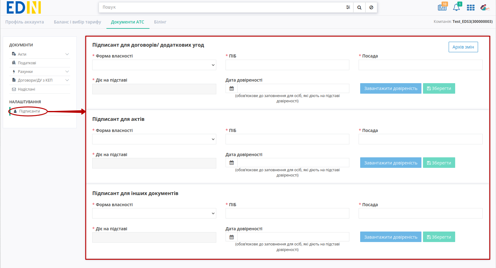

Дані підписантів зручно розділені за блоками:

* Підписантів для договорів / додаткових угод
* Підписантів для актів
* Підписантів для інших документів

.. include:: /Personal_Cabinet/because_PC_is_too_large.rst
   :start-after: .. початок блоку для pcSignatories
   :end-before: .. кінець блоку для pcSignatories

.. _billing:

**1.4 Білінг**
----------------------------------

Вкладка **"Білінг"** дозволяє відслідковувати і контролювати білінг (трафік документів):

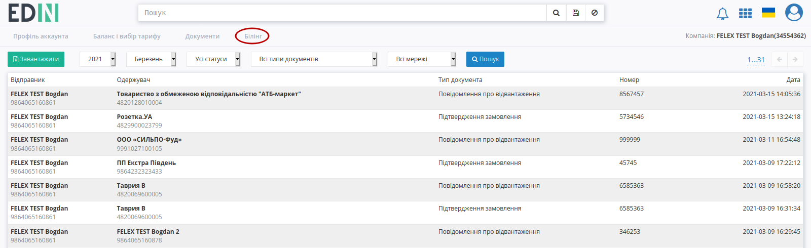

Відображається дата/час запису в білінг, тип документа, відправник, отримувач, номер документа. За допомогою фільтрів можливо зробити вибірку за:

* часовим періодом (рік, місяць)
* статусом (вхідні/вихідні) документа
* типом документа
* підключеною мережею-контрагентом

Сформований фільтацією список можливо **"Завантажити"** на свій носій в xlsx форматі.

.. _settings:

**2 Налаштування**
================================================

.. hint::
   В розділ також можливо перейти в два кліки з іконки користувача:

   .. image:: pics_PCInstruction/PCInstruction_016.png
      :align: center

Розділ дозволяє налаштовувати платформу, окремі сервіси, керувати компаніями, GLN-ами, користувачами та їх повноваженнями.

Підрозділи **"Налаштувань"** для зручності згуртовані у вкладки:

* **Користувачі**
* **Мої GLNи, Компанії, Мережі**

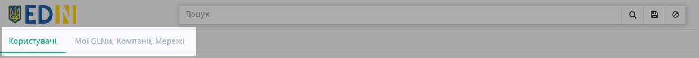

.. _users:

**2.1 Користувачі**
----------------------------------

.. _join-request-pc:

.. admonition::
   **Приєднання нового користувача до компанії**:

   Користувач може самостійно `зареєстуватись <https://wiki.edin.ua/uk/latest/general_2_0/User_registration.html#register>`__ на платформі EDIN 2.0 і створити запит на приєднання до компанії (за ЄДРПОУ). При цьому Адміністраторам компанії (`ролі <https://wiki.edin.ua/uk/latest/Personal_Cabinet/PCInstruction.html#user-roles>`__ "Адміністратор" та "Супер адміністратор") відправляється лист на узгодження з посиланням:

   .. image:: pics_PCInstruction/PCInstruction_119.png
      :align: center  

   При цьому в розділі також відображається повідомлення з посиланням:

   .. image:: pics_PCInstruction/PCInstruction_242.png
      :align: center  

   При переході за посиланням з розділу **"Користувачі"** чи з пошти адміністратор потрапляє на `Форму редагування користувача <https://wiki.edin.ua/uk/latest/Personal_Cabinet/PCInstruction.html#user-form>`__ з попередньо вказаними даними та налаштуваннями "за замовчуваннями" з можливістю **"Додати користувача"** до компанії чи **"Відхилити запит на приєднання"**: 

   .. image:: pics_PCInstruction/PCInstruction_120.png
      :align: center

   Зверніть увагу, що для доступу користувача до сервісів платформи потрібно провести налаштування його ролі (за замовчуванням роль "Користувач" без доступу до сервісів (без проставлених галочок))!

   .. important::
      Після створення/додавання користувача, для коректної роботи останнього, йому потрібно присвоїти GLN (меню `GLN користувача <https://wiki.edin.ua/uk/latest/Personal_Cabinet/PCInstruction.html#user-gln>`__ -> **"Додати зв'язок з GLN"**) та компанію (меню `Компанії користувача <https://wiki.edin.ua/uk/latest/Personal_Cabinet/PCInstruction.html#user-company>`__ -> **"Додати зв'язок із компанією"**).

   Після **"Додавання"/"Відхилення"** користувачу, що реєструвався на пошту відправляється лист-повідомлення про рішення адміністратора компанії.

   .. hint::
      В випадку, коли користувач `реєструється <https://wiki.edin.ua/uk/latest/general_2_0/User_registration.html#register>`__ за допомогою КЕП та ЄДРПОУ зареєстрованої компанії співпадає з ЄДРПОУ з КЕП, то зв'язок такого користувача з акаунтом формується автоматично: користувачу призначається `роль <https://wiki.edin.ua/uk/latest/Personal_Cabinet/PCInstruction.html#user-roles>`__ "Користувач" з доступом до всіх сервісів. При цьому Адміністраторам компанії (`ролі <https://wiki.edin.ua/uk/latest/Personal_Cabinet/PCInstruction.html#user-roles>`__ "Адміністратор" та "Супер адміністратор") відправляється інформаційний лист про приєднання користувача:

      .. image:: pics_PCInstruction/PCInstruction_130.png
         :align: center

В підрозділі відображається список всіх користувачів акаунта з їх ПІБ та відміткою про блокування користувача (|bloсked|).

Присутня можливість редагувати дані існуючих користувачів (клік мишкою на e-mail користувача, що за замовчуванням є і логіном для входу на платформу) та додати нового користувача:

* масово **"Завантажити з Excel"** (XLSX, XLS файли), згідно вказаного **"Шаблону"**;
* через кнопку **"+Створити користувача"**.

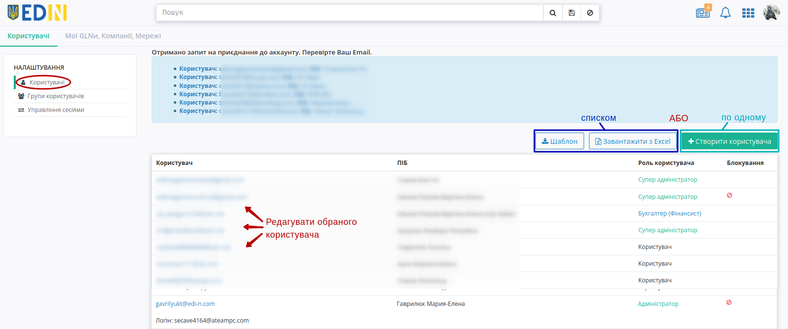

При **масовому завантаженні даних користувачів** потрібно спочатку скачати **"Шаблон"** (1), у відповідності до якого й **"Завантажити з Excel"** (2) Ваш список користувачів:

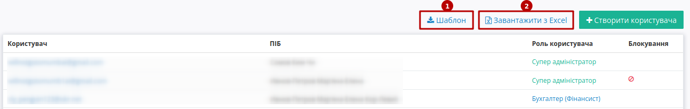

.. attention::
   При завантаженні XLSX / XLS файлу потрібно заповнити всі обов'язкові поля (відмічені червоною зірочкою :red:`*`) згідно допустимого формату (в шаблоні є підказки). Також не допускається повтор Email на рівні компанії. В іншому випадку дані користувачів можуть не завантажитись чи завантажитись часково (рядки з помилками виділені жовтим кольором, червоні комірки яких потрібно виправити в файлі чи відредагувати |edit| на формі):

   .. image:: pics_PCInstruction/PCInstruction_182.png
      :align: center

   ⠀⠀⠀⠀⠀⠀⠀⠀⠀

   .. image:: pics_PCInstruction/PCInstruction_231.png
      :align: center

При **створенні** нового користувача через кнопку **"+Створити користувача"** відкриється вікно з полями для заповнення, обов'язковими (відмічені червоною зірочкою :red:`*`) серед яких є "Email користувача", "Номер телефону", "Прізвище", "Ім'я" та `"Роль користувача" <https://wiki.edin.ua/uk/latest/Personal_Cabinet/PCInstruction.html#user-roles>`__ :

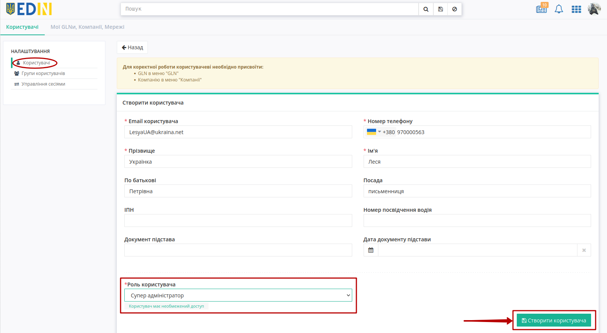

.. _user-roles:

.. admonition::
   **Ролі користувачів**:

   **"Ролі"** визначають, які сервіси будуть доступні користувачу в меню сервісів (кнопка |пресуха|). Роль назначається при створенні користуча (далі її можливо змінити в **Формі редагуванні користувача**):

   .. image:: pics_PCInstruction/PCInstruction_241.png
      :align: center

   .. hint::
      1) Зміна ролей іншим користувачам доступна для **Супер адміністратора** та **Адміністратора**.
      2) Роль користувача не може бути змінена від імені цього користувача.
      3) **Адміністратор** не може змінити роль **Супер адміністратору**.

   * **Супер адміністратор** - необмежений доступ до сервісів та налаштувань. Роль не може бути змінена від імені цього користувача.
   * **Адміністратор** - необмежений доступ до сервісів та налаштувань, окрім розділу `"Акаунт" <https://wiki.edin.ua/uk/latest/Personal_Cabinet/PCInstruction.html#account>`__.
   * **Бухгалтер (Фінансист)** - доступ до розділу Акаунт та налаштований тип доступу до обраних зі списку сервісів (невідмічені сервіси у користувача не відображаються).
   * **Користувач** - лише налаштований тип доступу до обраних зі списку сервісів (невідмічені сервіси у користувача не відображаються). Зверніть увагу: якщо сервіс "Довідники" вимкнений (невідмічений), то й вкладка "Особистий кабінет" не буде відображатись.
   
   Для ролей **Бухгалтер (Фінансист)** та **Користувач** передбачена можливість налаштування типу доступу (**Тип ролі**) до обраних сервісів (не стосується сервісу "Вільний"):

   .. image:: pics_PCInstruction/PCInstruction_001.png
      :align: center

   * **Все** (доступні всі опції платформи без обмежень);
   * **Перегляд** (без можливості створювати та підписувати документи);
   * **Редагування** (доступно все окрім підписання);
   * **Підпис** (не доступне створення документів).

.. hint::
   При **"Cтворенні"** нового користувача на вказану електронну пошту відправляється лист з запрошенням: 

   .. image:: pics_PCInstruction/PCInstruction_64.png
      :align: center

.. _user-form:

**2.1.1 Форма редагування користувача**
~~~~~~~~~~~~~~~~~~~~~~~~~~~~~~~~~~~~~~~~~~~~~~~~~~~~~~

.. hint::
   З форми редагування користувача можливо перейти в розділ `Керування сповіщеннями <https://wiki.edin.ua/uk/latest/Personal_Cabinet/PCInstruction.html#user-notifications>`__.

Після **створення** нового користувача автоматично відкривається **Форма редагування користувача**, в якій можливо змінити/доповнити інформацію, **"Заблокувати"** користувача, повторно **"Згенерувати пароль"** при його втраті чи налаштувати доступ до документів інших співробітників компанії:

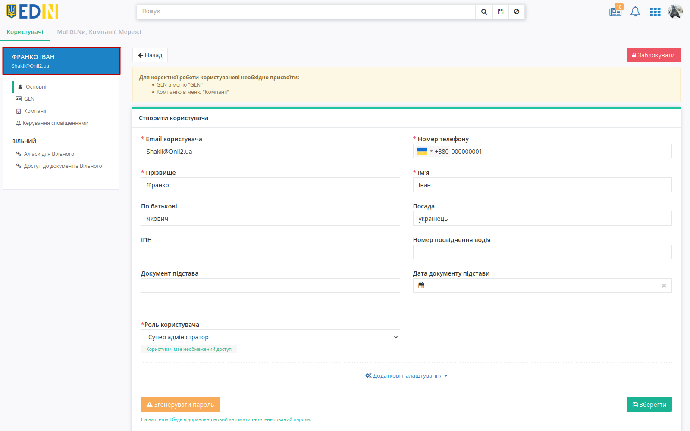

.. hint::
   Для коректної роботи системи логін для входу на платформу повинен збігатись з Вашим актуальним email. Для користувачів, у яких логін відмінний передбачений функціонал для заміни:

   .. image:: pics_PCInstruction/PCInstruction_175.png
      :align: center

   ⠀⠀⠀⠀⠀⠀⠀⠀⠀

   .. image:: pics_PCInstruction/PCInstruction_176.png
      :align: center

При зміні Email користувача на вказаний (новий) Email потрібно ввести пароль поточного користувача (підтвердження дії) - на новий email відправляється лист для підтвердження поштової адреси.

.. image:: pics_PCInstruction/PCInstruction_177.png
   :align: center

.. hint::
   При генеруванні нового паролю на вказану електронну пошту відправляється лист: 

   .. image:: pics_PCInstruction/PCInstruction_65.png
      :align: center

.. hint::
   Заблоковані користувачі помічаються в списку значком |bloсked|. Заблокованих користувачів можливо **"Розблокувати"** при редагуванні обраного користувача.

.. _user-gln: 

**2.1.1.1 GLN користувача**
""""""""""""""""""""""""""""""""""""""""""""""""""""""""""""""

При перегляді користувача можливо переглянути всі GLN, до яких даний користувач має відношення:

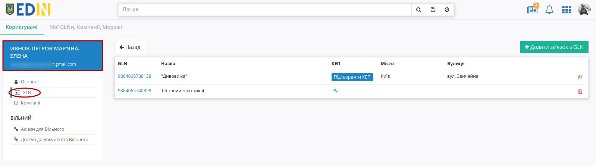

В підрозділі меню **"GLN"** окрім самого номера відображаються основні дані (Номер, Назва, Місто, Вулиця), присутня можливість редагувати існуючі GLN (клік мишкою на номер), **"Підтвердити КЕП"** та додати/видалити зв'язок переглядаємого користувача з іншими уже доданими GLN-ами (кнопки **"+Додати зв'язок з GLN"** / |delete2|):

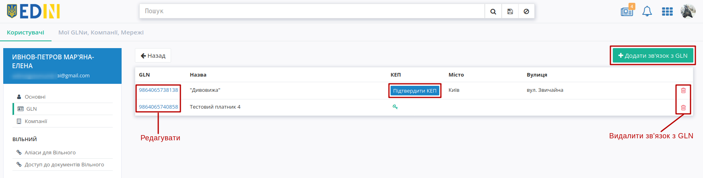

При :underline:`підтвердженні КЕП` ініціалізується процес подібний до підписання, що описаний в `розділі вище <https://wiki.edin.ua/uk/latest/Personal_Cabinet/PCInstruction.html#sign>`__. В GLN, що були підтверджені відсутня кнопка **"Підтвердити КЕП"** і вони помічаються іконкою |key|:

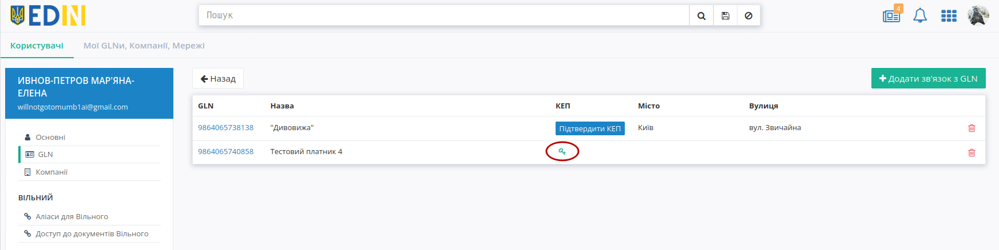

При :underline:`редагуванні GLN` відбувається перехід в `Форму редагування GLN <https://wiki.edin.ua/uk/latest/Personal_Cabinet/PCInstruction.html#gln-form>`__.

При :underline:`додаванні зв'язку користувача з GLN` потрібно вибрати один з раніше доданих `GLN <https://wiki.edin.ua/uk/latest/Personal_Cabinet/PCInstruction.html#gln-main>`__:

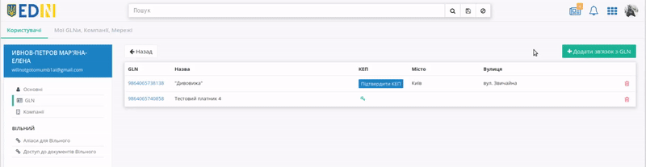

.. _user-company: 

**2.1.1.2 Компанії користувача**
""""""""""""""""""""""""""""""""""""""""""""""""""""""""""""""

При перегляді користувача можливо переглянути всі компанії, до яких даний користувач має відношення:

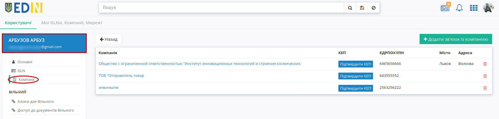

В підрозділі відображається список всіх компаній з короткою інформацією (Назва, ЄДРПОУ/ІПН, Місто, Адреса). Присутня можливість редагувати дані існуючих компаній (клік мишкою на назву компанії), **"Підтвердити КЕП"** та додати/видалити зв'язок переглядаємого користувача з іншими уже доданими компаніями (кнопки **"+Додати зв'язок із компанією"** / |delete2|):

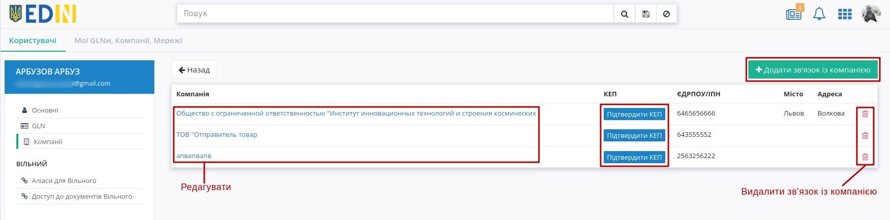

При :underline:`підтвердженні КЕП` ініціалізується процес подібний до підписання, що описаний в `розділі вище <https://wiki.edin.ua/uk/latest/Personal_Cabinet/PCInstruction.html#sign>`__. В компаніях, що були підтверджені відсутня кнопка **"Підтвердити КЕП"** і вони помічаються іконкою |key|:

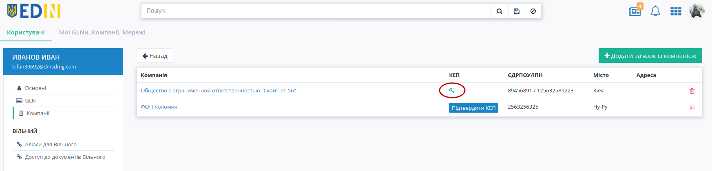

При :underline:`редагуванні компанії` відбувається перехід в `Форму редагування компанії <https://wiki.edin.ua/uk/latest/Personal_Cabinet/PCInstruction.html#company-form>`__.

При :underline:`додаванні зв'язку користувача із компанією` потрібно вибрати одну з раніше доданих `Компаній <https://wiki.edin.ua/uk/latest/Personal_Cabinet/PCInstruction.html#company>`__:

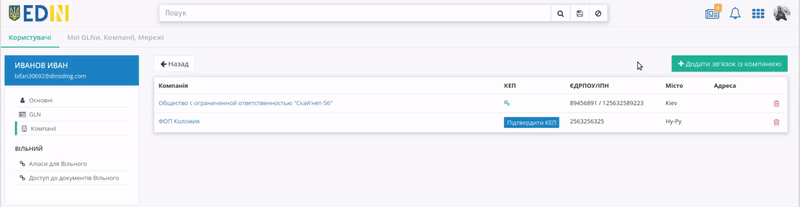

.. _shard-entrance:

**2.1.1.3 "Вільний" для користувача**
""""""""""""""""""""""""""""""""""""""""""""""""""""""""""""""

Для того аби налаштувати доступ до документів сервісу **"Вільний"** інших співробітників компанії потрібно в формі створеного співробітника у вкладці налаштувань **"Доступ до документів Вільного"** -> **"Відкрити доступ до документів співробітника"** (цьому співробітнику буде відкритий доступ до документів вказаних співробітників):

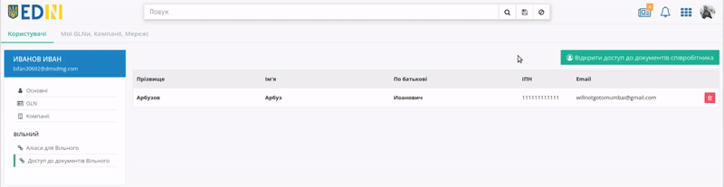

Після проведених налаштувань даному співробітнику в сервісі **"Вільний"** стає можливим переглядати і виконувати дії з документами вказаних співробітників від їх імені. Для цього потрібно вибрати співробітника, до документів якого відкритий доступ:

.. image:: pics_PCInstruction/PCInstruction_127.gif
   :align: center

За потреби доступ до документів цих співробітників можливо видалити (кнопка |red_trash2|).

.. _alias:

Для сервісу "Вільний" можливо налаштувати Аліаси (додаткові email адреси, на які можуть приходити документи в сервіс "Вільний"). Додаткова пошта вказується за допомогою кнопки **"+Додати аліас"** (адреса повинна бути унікальною):

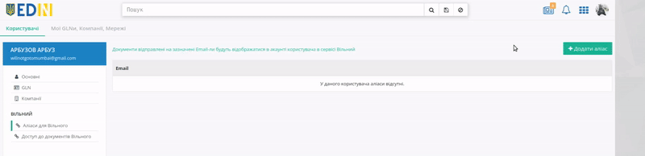

Після збереження додаткової адреси на неї відправляється лист з посиланням (посилання дійсне 2 години):

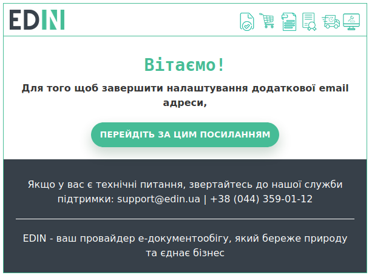

При переході за посиланням відбувається підтвердження аліасу: 

.. image:: pics_PCInstruction/PCInstruction_005.png
   :align: center

Після підтвердження email адреси вона відображається в списку аліасів для "Вільного":

.. image:: pics_PCInstruction/PCInstruction_007.png
   :align: center

За потреби ці адреси можливо видалити (кнопка |red_trash2|).

.. _user-groups: 

**2.2 Групи користувачів**
----------------------------------

Розділ дозволяє **Створювати** / **Редагувати** / **Видаляти** групи користувачів:

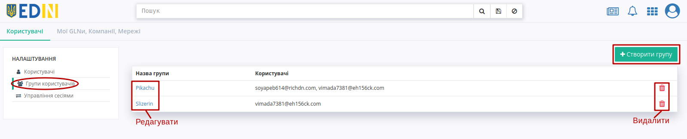

Користувачів до групи можливо додавати при створенні групи чи при її редагуванні:

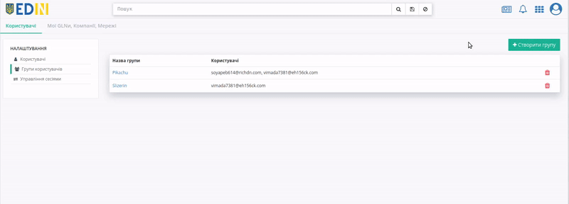

.. _session-management: 

**2.3 Управління сесіями**
----------------------------------

.. warning::
   При переході до деяких сервісів, коли авторизований користувач перевищує доступну кількість одночасних сесій (з різних пристроїв чи браузерів) платформа повідомляє про обмеження даного користувача:
   
   .. image:: pics_PCInstruction/PCInstruction_026.png
      :align: center

   Детальніше про `Правила користування Платформою «EDI Network» <https://wiki.edin.ua/uk/latest/Legal_info/Rules.html#id5>`__. В особистому кабінеті в розділі `Баланс та вибір тарифу <https://wiki.edin.ua/uk/latest/Personal_Cabinet/PCInstruction.html#id5>`__ можливо розшири можливості взаємодії с сервісами, докупивши "Додаткові сесії". В `Профілі користувача <https://wiki.edin.ua/uk/latest/general_2_0/rabota_s_platformoj_EDIN_2.0.html#pers-settings>`__ моливо переглянути сесії на рівні користувача. 

У розділі "Управління сесіями" відображаються сесії всіх користувачів компанії (вказується логін, IP, ОС, FingerPrint, розділ, дата входу в систему, дата останньої активності, час завершення сесії). Окрім цього відображається інфо про кількість відмов у доступі (через перевищення кількості сесій) за день та місяць. В розділі можливо налаштувати термін життя сесії на рівні акаунта (для всіх користувачів) - 10хв / 30хв / 1год / 3год / 6год / 24год:

.. image:: pics_PCInstruction/PCInstruction_025.png
   :align: center

Сесії інших користувачів можливо "Зупинити" одразу чи вказати час, через який вона буде зупинена:

.. image:: pics_PCInstruction/PCInstruction_029.png
   :align: center

.. image:: pics_PCInstruction/PCInstruction_030.png
   :align: center

.. _gln-main: 

**2.4 GLN**
----------------------------------

В налаштуваннях **"GLN"** відображаються дані (Номер, Назва, Місто, Вулиця) по всім доданим GLN-ам. Назви основних GLN виділені жирним, а сам номер має блакитну заливку. Для зручності присутній фільтр, щоб виводити в журналі "Всі" / "Основні" / "Додаткові" Ваші GLN:

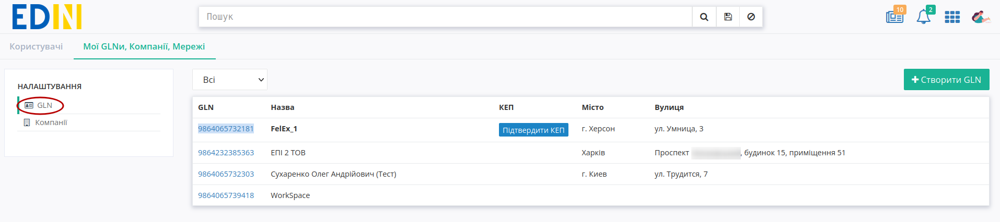

.. початок блоку для main-additional-gln

.. note::
   **Основний GLN** має унікальний ЄДРПОУ на рівні платформи. Використовується для документів, що потребують дані юридичної особи та подальшого підписання КЕП. Створюється автоматично при реєстрації на платформі EDI Network.

   **Додатковий GLN** підв'язується до "Основного GLN". Використовується для указання точок доставки, дрібних магазинів...

.. кінець блоку для main-additional-gln

присутня можливість редагувати існуючі GLN (клік мишкою на номер), **"Підтвердити КЕП"** та додати до платфоми нові GLN (кнопка **"+Створити GLN"**):

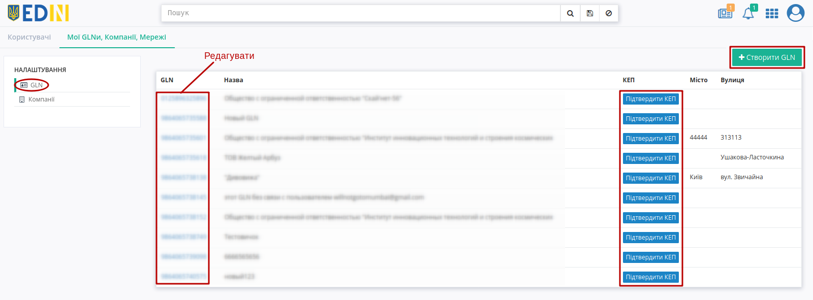

При :underline:`підтвердженні КЕП` ініціалізується процес подібний до підписання, що описаний в `розділі вище <https://wiki.edin.ua/uk/latest/Personal_Cabinet/PCInstruction.html#sign>`__. В GLN, що були підтверджені відсутня кнопка **"Підтвердити КЕП"** і вони помічаються іконкою |key|:

.. image:: pics_PCInstruction/PCInstruction_133.png
   :align: center

При :underline:`створенні нового GLN` одразу відкривається вікно для введення даних, які можливо надати 2-ма способами:

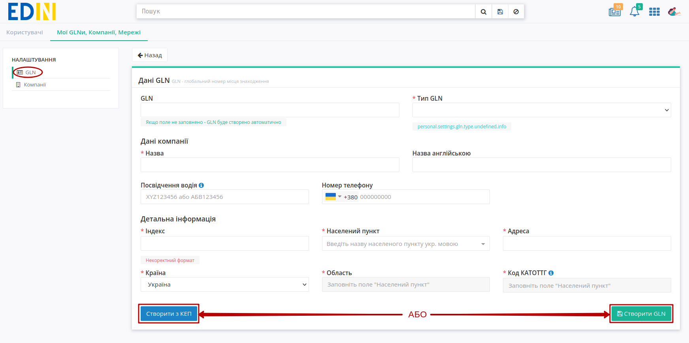

--------------------------------------------

1. **"Створити GLN"** заповнивши вікно з обов'язковими полями (обов'язкові поля відмічені червоною зірочкою :red:`*`);

Для заповнення поля "Населений пункт" потрібно почати вводити назву села/міста (мін. 3 символи) та обрати значення з випадаючого списку. Після чого значення "Область", "Код `КАТОТТГ <https://www.minregion.gov.ua/napryamki-diyalnosti/rozvytok-mistsevoho-samovryaduvannya/administratyvno/kodyfikator-administratyvno-terytorialnyh-odynycz-ta-terytorij-terytorialnyh-gromad/>`__", район визначаються автоматично:

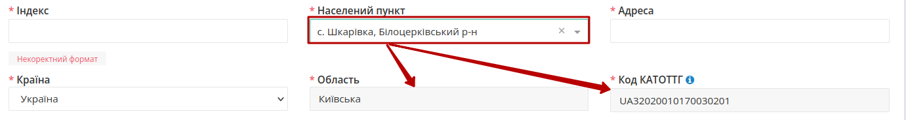

.. important::
   Введені дані Населений пункт, Індекс, Адреса в подальшому автоматично вказуються при створенні комерційних документів на https://edo-v2.edin.ua і повинні співпадати з даними в Єдиному реєстрі! Код `КАТОТТГ <https://www.minregion.gov.ua/napryamki-diyalnosti/rozvytok-mistsevoho-samovryaduvannya/administratyvno/kodyfikator-administratyvno-terytorialnyh-odynycz-ta-terytorij-terytorialnyh-gromad/>`__ автоматично вказується в Е-ТТН.

--------------------------------------------

2. **"Створити з КЕП"** - ініціалізується процес подібний до підписання, що описаний в `розділі вище <https://wiki.edin.ua/uk/latest/Personal_Cabinet/PCInstruction.html#sign>`__. В цьому випадку дані беруться з підпису і такий GLN одразу помічаються іконкою |key|. При :underline:`створенні з КЕП` поля "ЄДРПОУ" та "Назва" заповнюютсься автоматично без можливості редагування:

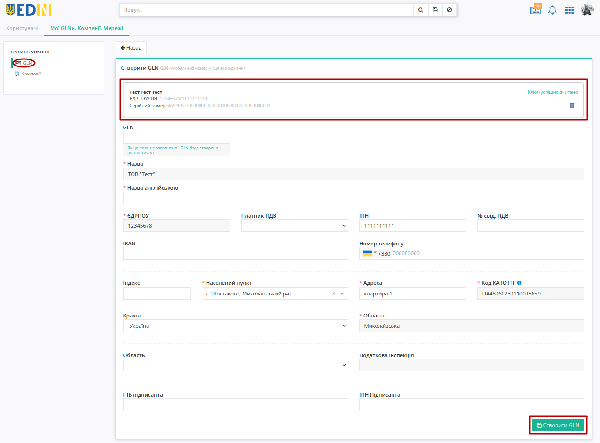

.. hint::
   Набір полів на формі для **Основного GLN** та **Додаткового GLN** відрізняється: для **Основного GLN** додатково потрібно заповнити дані "Платника ПДВ", "ІПН", "IBAN".

.. important::
   При **"Cтворенні GLN"** з незаповненим полем "GLN" його значення автоматично генерується платформою EDIN 2.0. Номер GLN на відміну від решти даних неможливо відредагувати (лише додати). Неможливо зберегти дані для уже зареєстрованого GLN.

Значення поля "Область" буде автоматично заповнюватись в полі "Область" в формах при створенні ЮЗД-документів.

.. _gln-form:

**2.4.1 Форма редагування GLN**
~~~~~~~~~~~~~~~~~~~~~~~~~~~~~~~~~~~~~~~~~~~~~~~~~~~~~~

Після **створення** нового користувача автоматично відкривається **Форма редагування GLN**, в якій можливо змінити/доповнити **основну** інформацію:

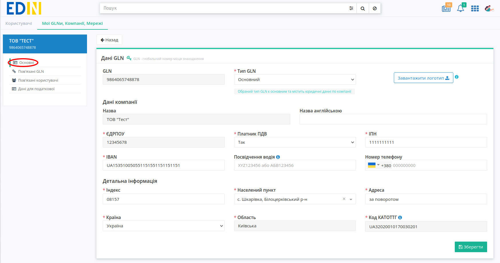

.. hint::
   Якщо в поле "ЄДРПОУ" введено 8 цифр, то платформа автоматично розуміє, що створюється Юр. Особа і в такому випадку, поле "Платник ПДВ" доступне до коригування.

   * Якщо в "Платник ПДВ" обрано "ТАК", то доступне до редагування поле "ІПН", яке є обовʼязковим для заповнення.
   * Якщо в "Платник ПДВ" обрано "НІ", то поле ІПН не заповнюється.

   Якщо в поле "ЄДРПОУ" введено 10 цифр, тто платформа автоматично розуміє, що створюється ФОП і в такому разі поля "Платник ПДВ" та "ІПН" недоступні до редагування (в документах в поле "ІПН" записується інформація з "ЄДРПОУ").

При **створенні** чи **редагуванні** **Основного GLN** можливо **"Завантажити логотип"** (за допомогою відповідної кнопки), що буде відображатись контрагентам:

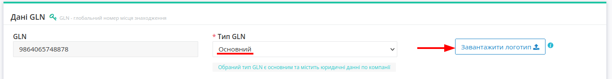

.. attention::
   Для завантаження дозволені jpeg файли розміром не більше 1Мб зі співвідношенням сторін 3 до 1 (ширина / висота). Завантажений логотип буде відображатись у всіх `пов'язаних <https://wiki.edin.ua/uk/latest/Personal_Cabinet/PCInstruction.html#gln-main-additional>`__ **Додаткових GLN**.

Після редагування форми GLN зміни потрібно **"Зберегти"**!

.. _gln-main-additional: 

**2.4.1.1 Пов'язані GLN**
""""""""""""""""""""""""""""""""""""""""""""""""""""""""""""""

В підрозділі **"Пов'язані GLN"** відображаються всі GLN, що мають зв'язок з даним GLN:

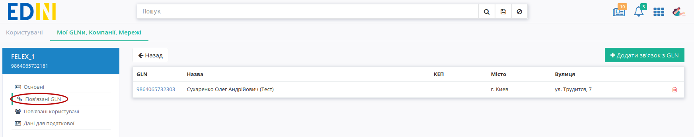

Зв'язок формується між раніше доданими **Основними** та **Додатковими** GLN (тип GLN визначається при його створенні).

.. include:: /Personal_Cabinet/PCInstruction.rst
   :start-after: .. початок блоку для main-additional-gln
   :end-before: .. кінець блоку для main-additional-gln

Можливо **"+Додати зв'язок з GLN"** за допомогою відповідної кнопки. В залежності від типу (**Основний** чи **Додатковий**) GLN, який Ви переглядаєте у випадаючому списку будуть відображатись Ваші GLN, що доступні до формування відповідного зв'язку:

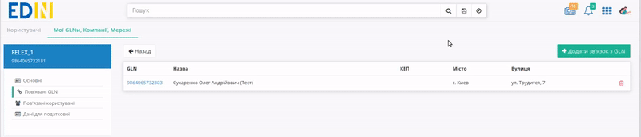

.. note::
   До **Основного** GLN можливо додати безліч **Додаткових**. У **Додаткового** GLN може бути лише один **Основний**.  

За допомогою кнопки з іконкою відерця (|delete2|) можливо видалити створені зв'язки.

.. _gln-user: 

**2.4.1.2 Пов'язані користувачі**
""""""""""""""""""""""""""""""""""""""""""""""""""""""""""""""

В підрозділі **"Пов'язані користувачі"** відображаються всі користувачі, що мають зв'язок з даним GLN:

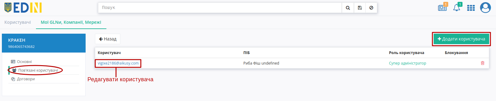

Можливо перейти в `Форму редагування користувача <https://wiki.edin.ua/uk/latest/Personal_Cabinet/PCInstruction.html#user-form>`__ (клік на назву корисутвача), **"+Додати користувача"** (аналогічно до функціоналу **"+Додати зв'язок з GLN"**) чи розірвати зв'язок між користувачем та GLN за допомогою кнопки з іконкою відерця (|delete2|):

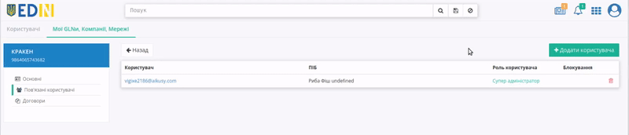

.. _gln-tax: 

**2.4.1.3 Дані для податкової**
""""""""""""""""""""""""""""""""""""""""""""""""""""""""""""""

Підрозділ відображається лише для **Основного GLN** (тип GLN визначається при його створенні).

.. include:: /Personal_Cabinet/PCInstruction.rst
   :start-after: .. початок блоку для main-additional-gln
   :end-before: .. кінець блоку для main-additional-gln

Для пришвидшення роботи з "Податковими накладними" є можливість вказати дані, що будуть автоматично заповнюватись на формі створення "Податкової накладної (DECLAR)" чи "Коригування до податкової накладної (DECLARj12)":

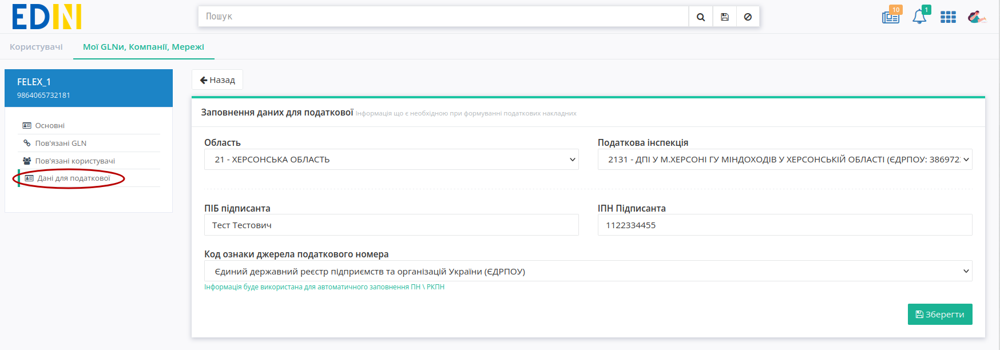

.. attention::
   У компанії, що є платником ПДВ і працює з ЮЗД (перший основний GLN акаунта), згідно законодавства, поле "Код ознаки джерела податкового номера" повинно бути заповним (платформа підкаже про це модальним вікном з посиланням до налаштувань GLN, через який здійснюється обмін документами з АТС - детальніше про рощділ `"Документи АТС" <https://wiki.edin.ua/uk/latest/Personal_Cabinet/PCInstruction.html#docs>`__). Під час реєстрації нового користувача на платформі, орієнтуючись на код ЕДРПОУ та ІПН компанії "Код ознаки джерела податкового номера" визначається автоматично.

.. _doc-approval-set:

**2.4.1.4 Сценарії погодження**
""""""""""""""""""""""""""""""""""""""""""""""""""""""""""""""

В підрозділі можливо керувати (створювати, редагувати, видаляти) сценаріями погодження вхідних документів. Сценарії використовуються для налаштування послідовного погодження вхідних документів перед їх підписанням в сервісі **"EDI Network"** та в **"Особистому кабінеті" ("Документи АТС")** (`детальніше <https://wiki.edin.ua/uk/latest/general_2_0/rabota_s_platformoj_EDIN_2.0.html#doc-approval>`__).

В журналі списком відображаються всі сценарії погодження обраного GLN, коротко представлена інформація (Найменування, Кількість кроків, Статус автозапуску):

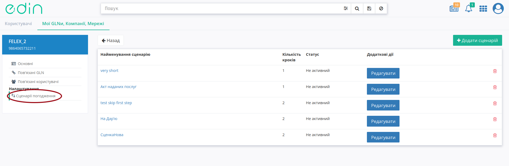

Для того, щоб відредагувати сценарій потрібно натиснути на назву сценарію чи на кнопку **"Редагувати"**; видалити сценарій можливо за допомогою кнопки |red_trash| (документи, що вже були запущені за цим сценарієм навіть після його видалення все ще будуть потребувати опрацювання).

Для створення нового сценарію потрібно натиснути на кнопку **"+Додати сценарій"**:

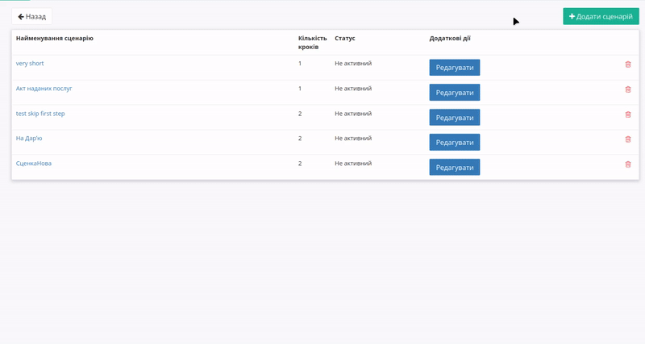

Необхідно задати зрозуміле найменування (за ним в подальшому і будуть обиратись сценарії для запуску), обрати зі списку відповідальних за крок погодження користувачів (`Пов'язані користувачі <https://wiki.edin.ua/uk/latest/Personal_Cabinet/PCInstruction.html#gln-user>`__ з GLN), обрати роль (**Погодити** крок погодження без підписання документа чи **Підписати** документ для продовження/завершення погодження):

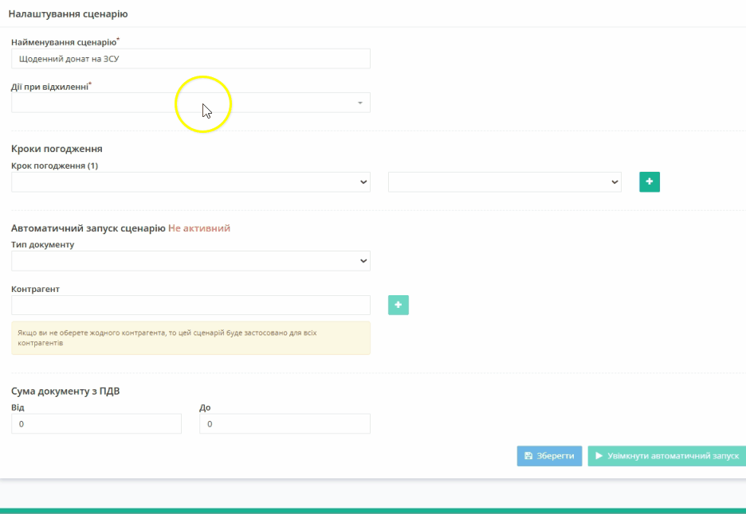

.. hint::
   Додатково можливо налаштувати автоматичний запуск сценарію для одного з доступних документів. Для цього потрібно обрати тип вхідного документа та **"Увімкнути автоматичний запуск"**:

   .. image:: pics_PCInstruction/PCInstruction_315.png
      :align: center

   .. attention::
      Автоматичний запуск сценаріїв буде застосовуватись для всіх контрагентів! Для того, щоб **обмежити** таку "автоматизацію" до визначеного списку потрібно зазначити Контагентів (пошук в рядках здійснюється за GLN / Назвою / ІПН / КПП):

      .. image:: pics_PCInstruction/PCInstruction_316.gif
         :align: center

      Обраних Контаргентів можливо видалити (**-**) чи переобрати за допомогою лупи.

      Можливо вказати ще один (додатковий) обмежуючий критерій до автоматичного запуску сценарію: діапазон для "Суми документа з ПДВ" (сценарій за межами вказаного діапазона автоматично не запускається):

      .. image:: pics_PCInstruction/PCInstruction_317.png
         :align: center
   
   Для того, щоб вимкнути налаштування автозапуску сценарію потрібно натиснути на кнопку **"Зупинити запуск"** (налаштування при цьому зберігаються). Статус автозапуску (:red:`Не активний` / :green:`Активний`) також відображається і в журналі сценаріїв.

Після внесення всіх змін в налаштування потрібно **"Зберегти"** сценарій.

.. _company: 

**2.5 Компанії**
----------------------------------

В підрозділі відображається список всіх компаній з короткою інформацією (Назва, ЄДРПОУ, ІПН, Місто, Адреса). Присутня можливість редагувати дані існуючих компаній (клік мишкою на назву компанії), **"Підтвердити КЕП"** та додати нову компанію (кнопка **"+Створити компанію"**):

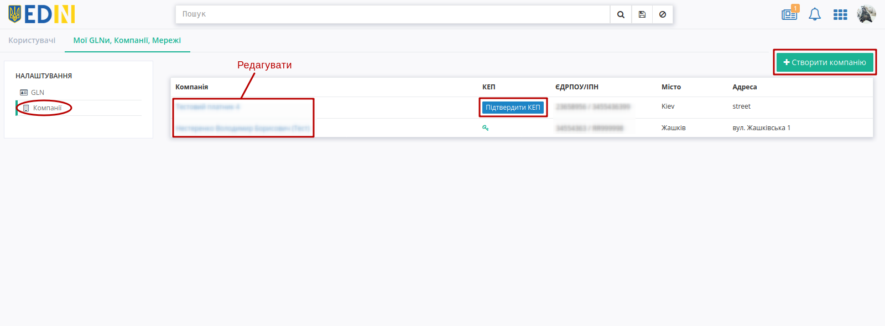

При :underline:`підтвердженні КЕП` ініціалізується процес подібний до підписання, що описаний в `розділі вище <https://wiki.edin.ua/uk/latest/Personal_Cabinet/PCInstruction.html#sign>`__. В компаніях, що були підтверджені відсутня кнопка **"Підтвердити КЕП"** і вони помічаються іконкою |key|.

При :underline:`створенні нової компанії` відкривається вікно для введення даних про компанію, яку можливо надати 2-ма способами:

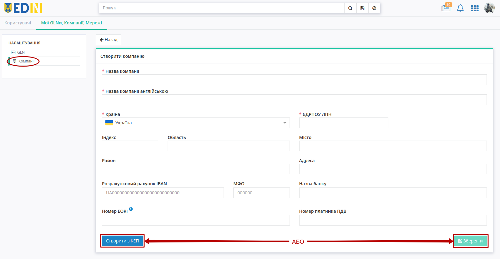

* **"Зберегти"** дані, що повинні бути заповнені вручну (обов'язковим серед яких поля "Компанія" та "ЄДРПОУ/ІПН" чи "Реєстраційний номер компанії або ІПН" (відмічені червоною зірочкою :red:`*`));

.. important::
   Введені дані Адреси та Міста (населеного пункту) в подальшому автоматично вказуються при створенні е-ТТН на https://edo-v2.edin.ua і повинні співпадати з даними в Єдиному реєстрі!

* **"Створити з КЕП"** - ініціалізується процес подібний до підписання, що описаний в `розділі вище <https://wiki.edin.ua/uk/latest/Personal_Cabinet/PCInstruction.html#sign>`__. В цьому випадку дані беруться з підпису і така компанія одразу помічаються іконкою |key|. При :underline:`створенні з КЕП` поля "ЄДРПОУ/ІПН" та "Компанія" заповнюютсься автоматично без можливості редагування:

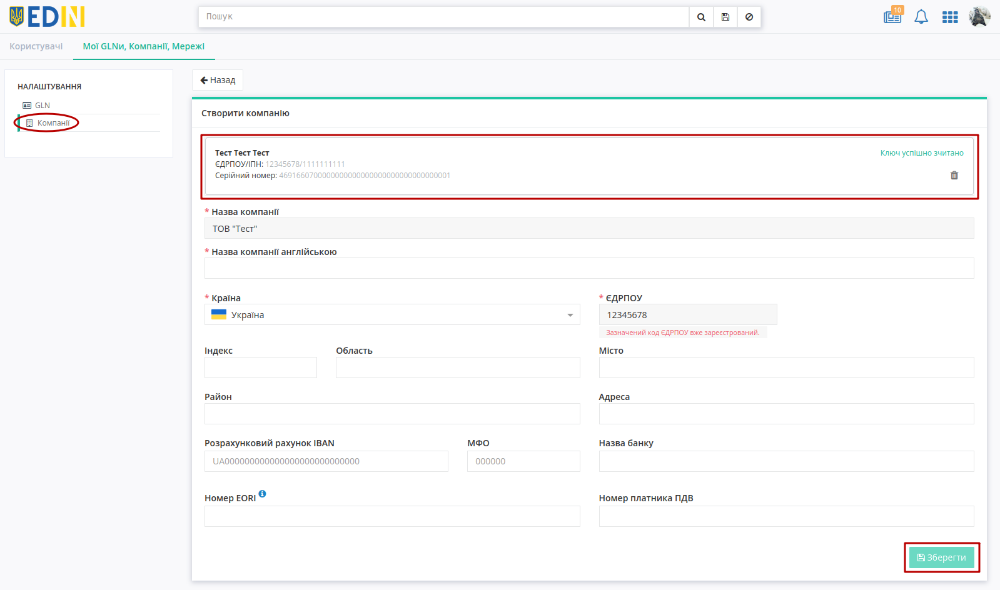

.. _company-form:

**2.5.1 Форма редагування Компанії**
~~~~~~~~~~~~~~~~~~~~~~~~~~~~~~~~~~~~~~~~~~~~~~~~~~~~~~

Після **створення** нової компанії автоматично відкривається **Форма редагування Компанії**, в якій можливо змінити/доповнити інформацію:

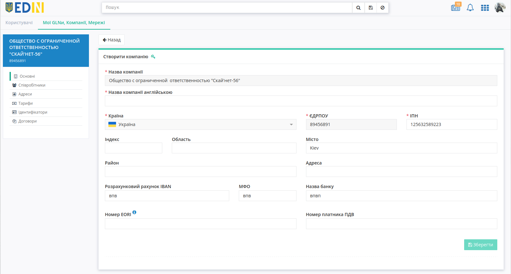

.. _company-employees: 

**2.5.1.1 Співробітники Компанії**
""""""""""""""""""""""""""""""""""""""""""""""""""""""""""""""

У підрозділі **"Співробітники"** до цієї компанії можливо **"Додати співробітника"** зі списку користувачів або додати дані нового спіробітника (**"Створити співробітника"**):    

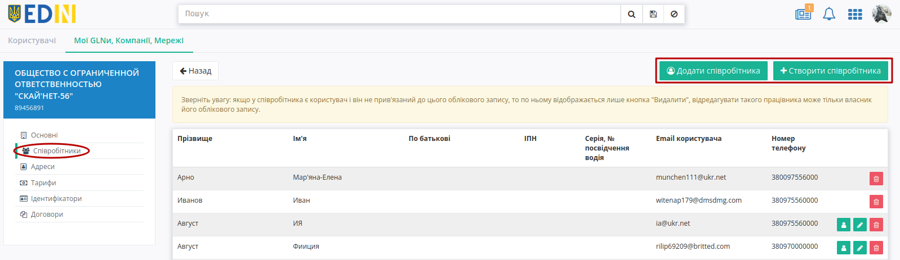

**"Додати співробітника":**

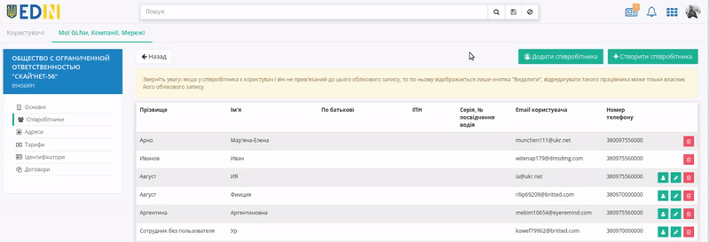

**"Створити співробітника":**

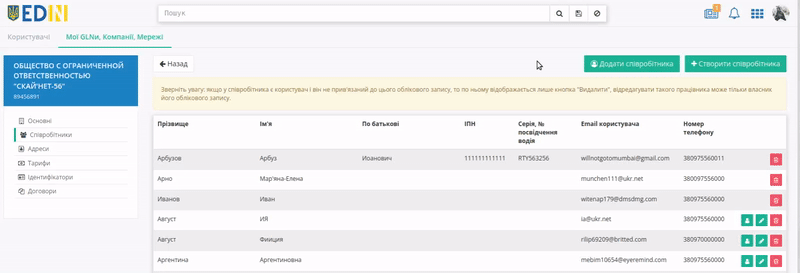

Для того аби цей співробітник міг зайти на платформу потрібно **"Створити користувача"** за допомогою кнопки |user|: на його Email відправляється лист з автоматично згенерованим паролем (аналогічно до створення користувача в розділі `Користувачі <https://wiki.edin.ua/uk/latest/Personal_Cabinet/PCInstruction.html#users>`__). Дані співробітників можливо редагувати |edit| чи видаляти |delete|.

.. note::
   Якщо у Співробітника вже створено Користувача, то при редагуванні (|edit|) автоматично відкривається сторінка редагування цього Користувача. Якщо Співробітник вже прив'язаний до Користувача іншого акаунта, то доступна лише кнопка видалення зв'язку між Співробітником і компанією.

.. _company-addresses:

**2.5.1.2 Адреси Компанії**
""""""""""""""""""""""""""""""""""""""""""""""""""""""""""""""

У підрозділі **"Адреси"** можливо доповнити список адрес компанії:

* масово **"Завантажити з Excel"** (XLSX, XLS файли), згідно вказаного **"Шаблону"**;
* через введення даних в модальне вікно (кнопка **"+Додати"**).

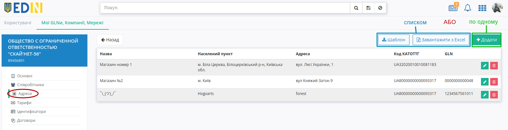

При внесенні даних через модальне вікно поле "Код `КАТОТТГ <https://www.minregion.gov.ua/napryamki-diyalnosti/rozvytok-mistsevoho-samovryaduvannya/administratyvno/kodyfikator-administratyvno-terytorialnyh-odynycz-ta-terytorij-terytorialnyh-gromad/>`__" заповнюється автоматично - для цього потрібно почати вводити назву населеного пункту і обрати його із запропонованого списку:

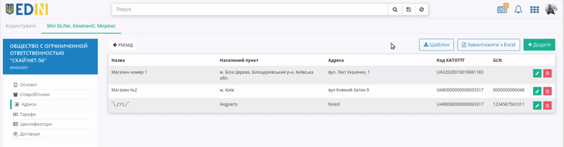

Поле GLN можливо обрати з випадаючого списку всіх GLN акаунта (працює пошук при введенні назви чи номеру) чи додати новий номер за допомогою кнопки **"Застосувати введене значення"**.

При масовому завантаженні адрес потрібно спочатку скачати **"Шаблон"** (1), у відповідності до якого й **"Завантажити з Excel"** (2) Ваш список адрес:

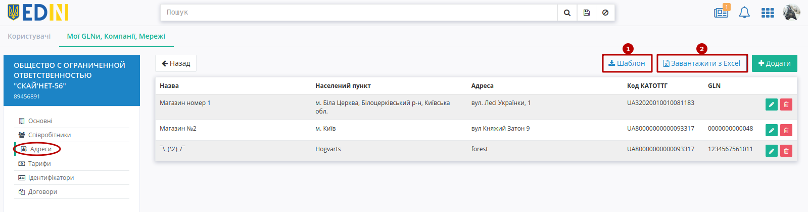

.. attention::
   При заповненні XLSX / XLS файлу потрібно притримуватись державного кодифікатора `КАТОТТГ <https://www.minregion.gov.ua/napryamki-diyalnosti/rozvytok-mistsevoho-samovryaduvannya/administratyvno/kodyfikator-administratyvno-terytorialnyh-odynycz-ta-terytorij-terytorialnyh-gromad/>`__. Також не допускається повтор GLN на рівні компанії. В іншому випадку адреси можуть не завантажитись чи завантажитись часково (рядки з помилками виділені жовтим кольором, червоні комірки яких потрібно виправити в файлі чи відредагувати |edit| на формі):

   .. image:: pics_PCInstruction/PCInstruction_173.png
      :align: center

.. _ettn-tariffs: 

**2.5.1.3 Тарифи Компанії**
""""""""""""""""""""""""""""""""""""""""""""""""""""""""""""""

До компанії можливо додати `правила тарифікації <https://wiki.edin.ua/uk/latest/ETTN_2_0/Create_act_at_accepted_work.html#additional-functionality>`__ (для сервісу **"Е-ТТН"**) для обраного контрагента для автоматичної тарифікації при перевезенні за 1км та/або 1кг:

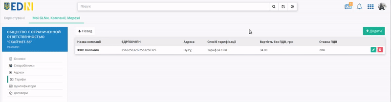

Створені правила тарифікації на формі можливо відредагувати |edit| чи видалити |delete|.

.. _company-identifier:

**2.5.1.4 Ідентифікатори Компанії**
""""""""""""""""""""""""""""""""""""""""""""""""""""""""""""""

До компанії можливо додати ідентифікатори:

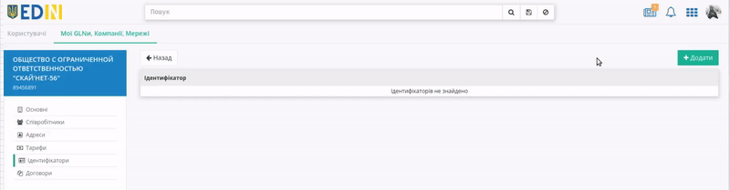

Створені правила тарифікації на формі можливо відредагувати |edit| чи видалити |delete|.

.. _company-contracts: 

**2.5.1.5 Договори (Компанія)**
""""""""""""""""""""""""""""""""""""""""""""""""""""""""""""""

Довідник договорів доступний для ролей **Супер адміністратора** / **Адміністратора** при наявності трафіку документообігу з мережами. Створені договори використовуються для автоматичного заповнення полів в ЕТТН сервісі. **"+Створити договір"** можливо за допомогою відповідної кнопки:

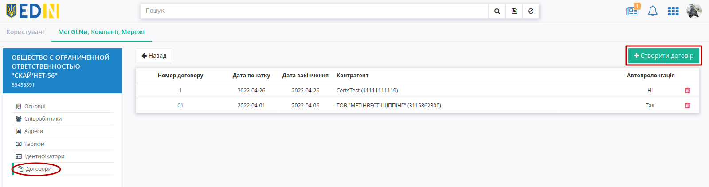

.. attention::
   Параметри договору повинні бути унікальними (неможливо створити договір ідентичний до вже існуючого договору)!

Для створення договору на компанію потрібно заповнити форму, обравши та вказавши наступні значення (поля обов'язкові до заповнення позначені червоною зірочкою :red:`*`):

* **Номер договору**
* **Контрагент** (доступний пошук контрагента за назвою / ЄДРПОУ)
* **Дата початку**

Опціонально можливо обрати зі списку **Тип договору** (Договір перевезення), вказати дату закінчення договору, встановити автопролонгацію та натиснути кнопку **"Створити договір"**:

.. image:: pics_PCInstruction/PCInstruction_145.png
   :align: center

Створені договори можливо редагувати та видаляти:

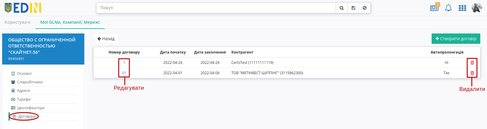

При редагуванні договору для оновлення даного договору потрібно **"Зберегти"** внесені зміни:

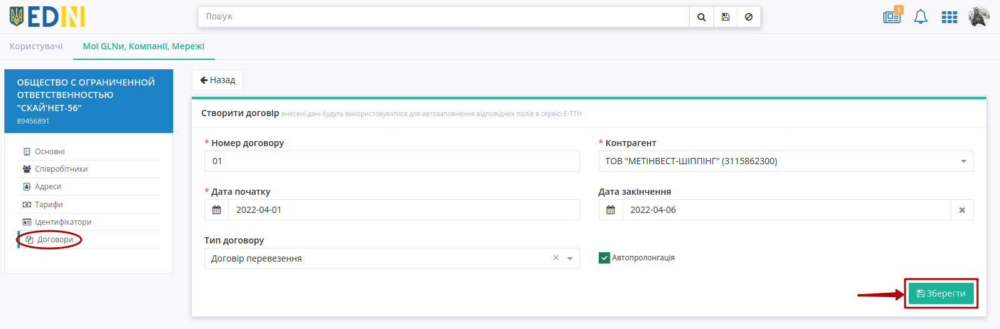

.. _retailers: 

**2.6 Мережі**
----------------------------------

Підрозділ відображається лише для Торгової мережі і містить перелік зареєстрованих мереж в акаунті:

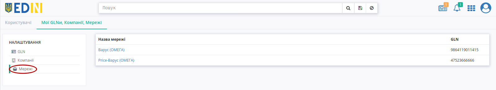

.. _retailers-form:

**2.6.1 Налаштування мережі**
~~~~~~~~~~~~~~~~~~~~~~~~~~~~~~~~~~~~~~~~~~~~~~~~~~~~~~

Після натискання на назву мережі відкриваються налаштування мережі, відображаються основні дані мережі:

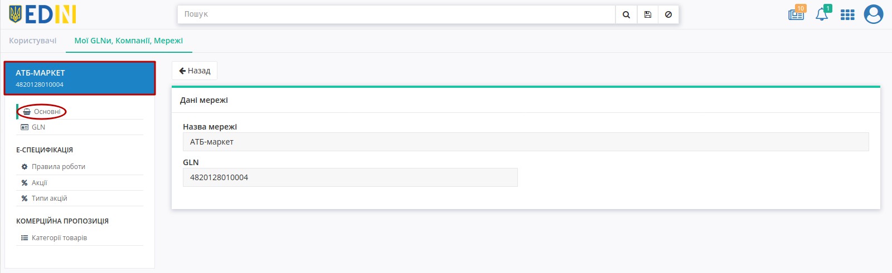

.. _retailers-gln: 

**2.6.1.1 GLN мережі**
""""""""""""""""""""""""""""""""""""""""""""""""""""""""""""""

У підрозділі **"GLN"** відображаються усі GLN обраної мережі:

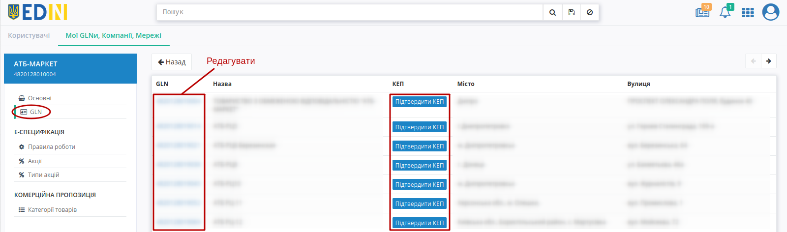

В підрозділі меню **"GLN"** окрім самого номера відображаються основні дані (Номер, Назва, Місто, Вулиця), присутня можливість редагувати існуючі GLN (клік мишкою на номер) та підтвердити номер за допомогою КЕП (кнопка **"Підтвердити КЕП"**).

При :underline:`підтвердженні КЕП` ініціалізується процес подібний до підписання, що описаний в `розділі вище <https://wiki.edin.ua/uk/latest/Personal_Cabinet/PCInstruction.html#sign>`__. В GLN, що були підтверджені відсутня кнопка **"Підтвердити КЕП"** і вони помічаються іконкою |key|:

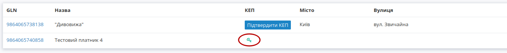

При :underline:`редагуванні GLN` відбувається перехід в `Форму редагування GLN <https://wiki.edin.ua/uk/latest/Personal_Cabinet/PCInstruction.html#gln-form>`__.
 
.. _retailers-e-spec:

**2.6.1.2 "Е-Специфікація" і мережа**
""""""""""""""""""""""""""""""""""""""""""""""""""""""""""""""

Блок містить розписані **"Правила роботи"** з налаштуваннями в сервісі **"Е-Специфікація"**, а також підрозділи для роботи з акціями сервісу: **"Акції"** та **"Типи акцій"**:

.. тут теба буде додати скрін, коли буде шаблон правил

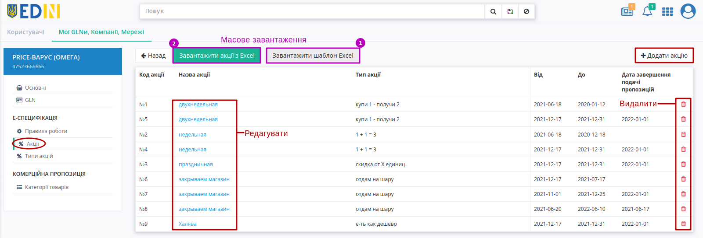

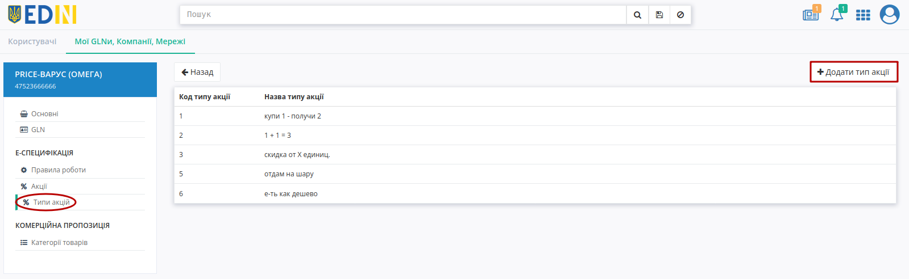

Представник мережі може редагувати (додавати/змінювати/видаляти позиції) основну таблицю розділу. Список акцій можливо редагувати вручну чи шляхом вивантаження xls-файлу (кнопка **"Завантажити акції з Excel"** (2)) - для цього попередньо потрібно **"Завантажити шаблон Excel"** (1).

.. _drivers: 

**2.7 Водії**
----------------------------------

Розділ **"Водії"** слугує для зручного підключення та залучення до електронного документообігу **Водіїв** - користувачів, дані яких можуть зручно підтягуватись в відповідні поля транспортних документів при їх заповненні. В розділі відображається список доданих **Водіїв**, їх дані (за наявності) та статус підключення (:orange:`Запрошений` / :green:`Активний` / :red:`Заблокований`) до даного Перевізника:

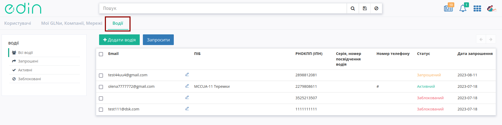

.. hint::
   Email будь-якого **Водія** зі списку можливо відредагувати за допомогою кнопки |edit_pencil| (новий email потребує підтвердження):

   .. image:: pics_PCInstruction/PCInstruction_339.png
      :align: center

В підрозділах **Запрошені** / **Активні** / **Заблоковані** відображаються відібрані за статусом **Водії**:

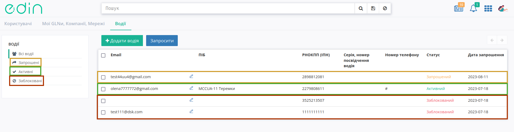

**"+Додати водія"** можливо в бідь-якому підрозділі одним із запропонованих способів: 

1) **"Додати вручну"** - потрібно ввести дані РКНОПП водія, email користувача та **"Надіслати листа"** (незареєстрованим Водіям на email прийде `запрошення <https://wiki.edin.ua/uk/latest/general_2_0/Driver_registration.html#register-through-carrier>`__):

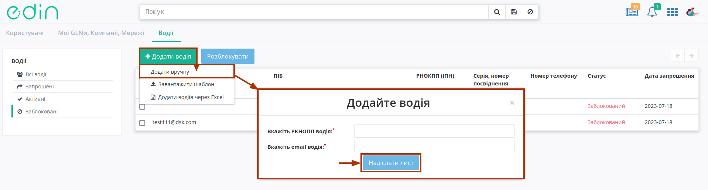

2) Також можливо **"Додати водіїв через Excel"** (для початку потібно **"Завантажити шаблон"**):

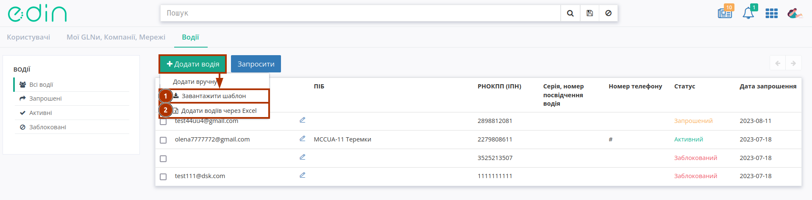

При підвантаженні xlsx-файлу система повідомить про успішне додавання водіїв чи виникнення помилок:

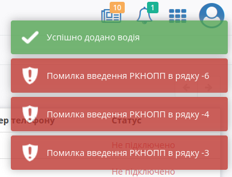

Вже :orange:`Запрошених` до платформи **Водіїв** з вашого списку можливо повторно **"Запросити"** (відправляється лист-запрошення на вказану пошту), попередньо обравши потрібних користувачів зі списку: 

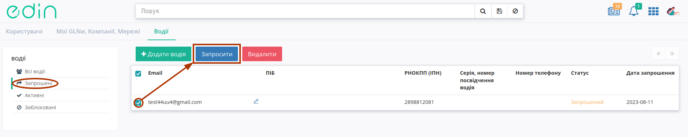

Також **Водіїв**, що були додані помилково чи не хочуть співпрацювати і залишаються в статусі :orange:`Запрошений` можливо **"Видалити"** (потрібно додатково підтвердити дію):

.. image:: pics_PCInstruction/PCInstruction_333.png
   :align: center

.. important::
   При розриванні договірних відносин з водієм / звільненні штатного водія ми рекомендуємо Перевізникам **"Блокувати"** доданих :green:`Активних` **Водіїв**!

Для того, щоб обмежити доступ :green:`Активного` **Водія** до своїх документів у підрозділі **"Активні"** потрібно відмітити такого користувача, натиснути кнопку **"Заблокувати"** та ввести причину блокування: 

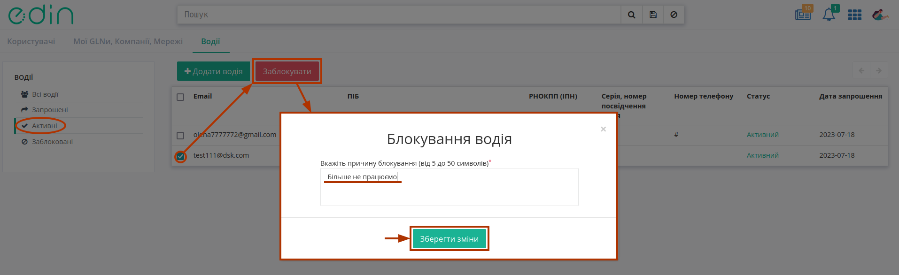

Після чого, обраний **Водій** змінює свій статус на :red:`Заблокований`. Для перегляду всіх :red:`Заблокованих` **Водіїв** потрібно перейти до підрозділу **"Заблоковані"**, де можливо обрати та **"Розблокувати"** **Водія**:

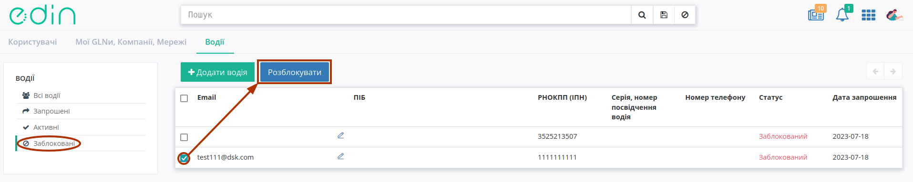

.. _catalogues: 

**3 Довідники**
================================================

Розділ **Довідників** дозволяє користувачу налаштувати власні довідники товарів та договорів з контрагентами для зручного та швидкого використання цієї інформації при формуванні документів чи взаємодії з контрагентами.

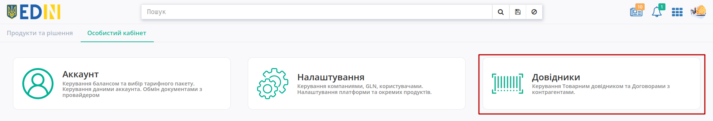

.. _product-catalogue: 

**3.1 Товарний довідник**
----------------------------------

.. include:: /retail_2.0/formirovanie_Tovarnogo_dovidnyka.rst
   :start-after: .. початок блоку для PCinstruction
   :end-before: .. кінець блоку для PCinstruction

.. _gln-contracts: 

**3.2 Довідник для Договорів**
----------------------------------

**"Довідник для Договорів"** доступний для ролей **Супер адміністратора** / **Адміністратора** при наявності трафіку документообігу з мережами. Створені договори використовуються для автоматичного заповнення полів в EDI сервісі при обміні документами з Вашими контрагентами:

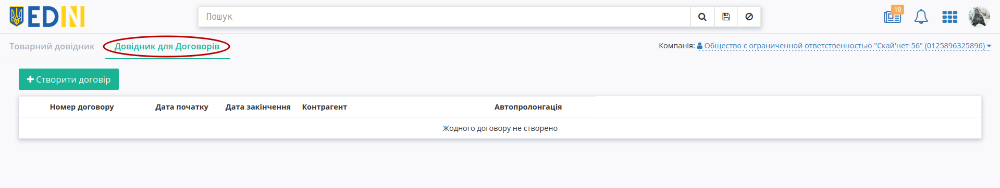

.. note::
   Якщо у Вас декілька компаній під одним акаунтом, перевірте чи вибрано бажана компанія! У різних компаній відображаються різні договори.

Для додавання нового договору потрібно натиснути на кнопку **"+Створити договір"** (формування договорів потребує активного документообігу з партнерами):

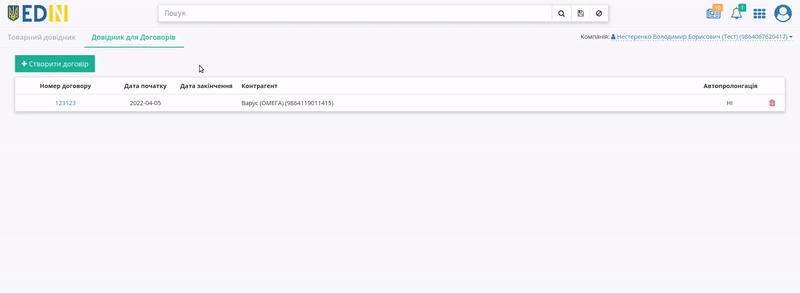

Для створення договору потрібно заповнити форму, обравши та вказавши наступні значення (поля обов'язкові до заповнення позначені червоною зірочкою :red:`*`):

* **Номер договору**
* **Дата договору**
* **Тип договору** (Договір поставки / Договір перевезень / Договір послуг / Договір факторингу)
* **Контрагент** (доступний пошук контрагента за назвою / GLN)

Опціонально можливо обрати зі списку , вказати дату закінчення договору, встановити автопролонгацію.

**"Створити договір"** можливо за допомогою відповідної кнопки.

.. attention::
   Параметри договору повинні бути унікальними (неможливо створити договір ідентичний до вже існуючого договору)!

Відредагувати створений договір можливо натиснувши на Номер договору, а видалити за допомогою кнопки  |delete3| :

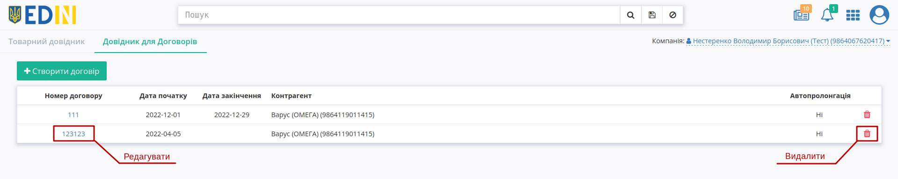

При редагуванні договору для оновлення даного договору потрібно **"Зберегти"** внесені зміни:

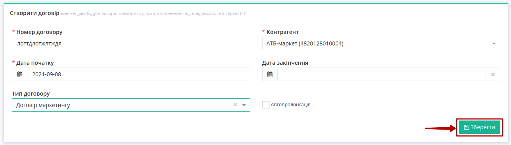

.. _counterparties: 

**4 Підключення до мережі (Контрагенти)**
================================================

Розділ дозволяє користувачу налаштувати та покращити взаємодію з контрагентами платформи.

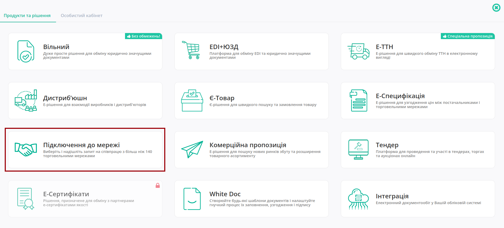

**4.1 EDI**
----------------------------------

Сервіс дозволяє налаштувати взаємодію з торговими мережами шляхом формування запитів на підключення.

**4.1.1 Постачальники (підрозділ для Мережі)**
~~~~~~~~~~~~~~~~~~~~~~~~~~~~~~~~~~~~~~~~~~~~~~~~~~~~~~

**Постачальники** - підрозділ зі списком підключених до Торгової Мережі Постачальників - вказується назва компанії, логотип, ЄДРПОУ/ІПН, за якими і можливо відсортувати список:

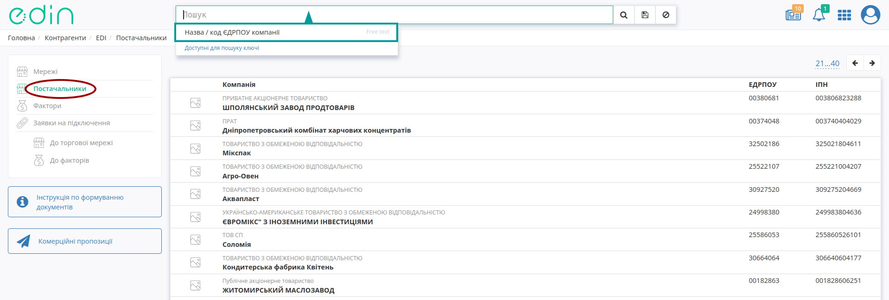

**4.1.2 Мережі**
~~~~~~~~~~~~~~~~~~~~~~~~~~~~~~~~~~~~~~~~~~~~~~~~~~~~~~~~~~~~~~~~~~~~~~~~~~

**Мережі** - підрозділ зі списком мереж, що приймають запити на підключення. 

Список можливо відсортувати за статусом документообігу (:orange:`Документообіг не налаштований`, :green:`Документообіг налаштований`), виконати пошук за частиною назви:

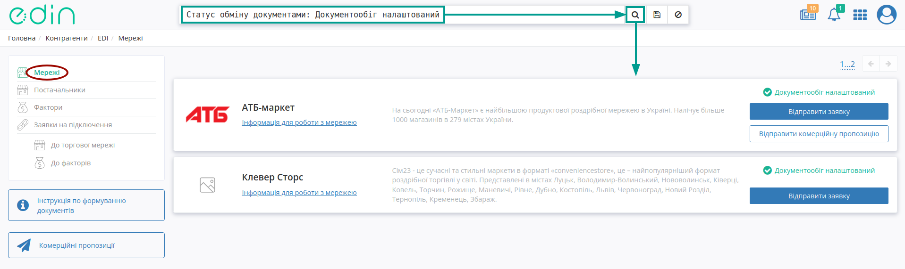

В списку відображається назва мережі, логотип, додаткова інформація, статус документообігу та:

* функціонал формування запиту на підключення - **"Відправити заявку"** (додатково є **"Інструкції по формуванню документів"**);
* функціонал відправки комерційних пропозицій - **"Відправити комерційну пропозицію"** (до сервісу можливо перейти за допомогою одноїменної з сервісом кнопки **"Комерційні пропозиції"**);

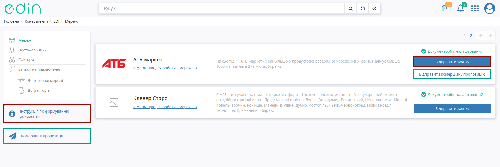

.. note::
   Функціонал створення комерційної пропозиції доступний лише при ввімкненому `доступу <https://wiki.edin.ua/uk/latest/Personal_Cabinet/PCInstruction.html#user-roles>`__ до сервісу **"Комерційна пропозиція"**!

Ці ж дії можливо виконати і в картці мережі. В картці мережі відображається контактна інформація, список підключених документів та сервісів:

.. image:: pics_PCInstruction/PCInstruction_160.png
   :align: center

**4.1.2.1 Формування запиту на підключення до мережі**
""""""""""""""""""""""""""""""""""""""""""""""""""""""""""""""

При формуванні запиту на підключення відкривається форма заявки (поля обов'язкові до заповнення позначені червоною зірочкою :red:`*`). Після того, як обов'язкові поля заповнені можливо **"Сформувати запит"**:

.. image:: pics_PCInstruction/PCInstruction_92.png
   :align: center

З міркувань безпеки та коректної ідентифікації Постачальника заявка відправляється тільки після накладання електронного цифрового підпису Відправника (ЄДРПОУ ключа повинен відповідати ЄДРПОУ вказаному в GLN).

.. hint::
   Процес підписання типовий для платформи та описаний в `розділі вище <https://wiki.edin.ua/uk/latest/Personal_Cabinet/PCInstruction.html#sign>`__. Якщо ЄДРПОУ ключа співпадає з ЄДРПОУ акаунта, то автоматично "підтверджується" й акаунт.

Однак підписання під час формування запиту не потрібне, якщо обрати GLN, що вже був `підтверджений за допомогою КЕП <https://wiki.edin.ua/uk/latest/Personal_Cabinet/PCInstruction.html#gln-main>`__:

.. image:: pics_PCInstruction/PCInstruction_151.png
   :align: center

Після чого до попереднього перегляду формується запит в мережу (в якості чернетки). Перед тим, як **"Відправити запит"** в мережу можливо **"Завантажити PDF заявки"** та додати додаткові файли без підпису (**"+Додати файли"**):

.. image:: pics_PCInstruction/PCInstruction_152.png
   :align: center

.. note::
   До запиту можливо додавати txt, .doc, .docx, .xls, .xlsx, .ppt, .pptx, image, .pdf, .rtf, .zip файли розміром не більше 5 МБ і загальним об'ємом не більше 10 МБ. Система вказує розмір долучених файлів і розраховує доступний розмір до завантаження, в якості підказки:

   .. image:: pics_PCInstruction/PCInstruction_124.png
      :align: center

В блоці "Список файлів" всі файли можливо завантажити, а додаткові видалити:

.. image:: pics_PCInstruction/PCInstruction_123.png
   :align: center

Після того, як дії з файлами будуть виконані потрібно **"Відправити запит"**:

.. image:: pics_PCInstruction/PCInstruction_126.png
   :align: center

Відправлений запит змінює свій статус на :orange:`На розгляді` і відображається в **"Заявках на підключення"** до торгової мережі:

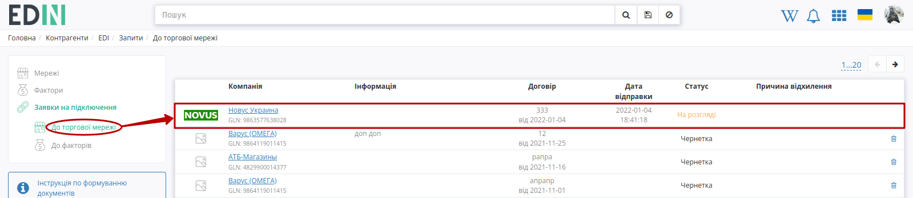

Після того, як Торгова Мережа *підтвердить* чи *відхилить* заявку Постачальнику буде надіслано повідомлення на Email та оновлено статус заявки (детальніше в розділі `Заявки на підключення <https://wiki.edin.ua/uk/latest/Personal_Cabinet/PCInstruction.html#request>`__).

.. _factor: 

**4.1.3 Фактори (підрозділ для Постачальника/Мережі)**
~~~~~~~~~~~~~~~~~~~~~~~~~~~~~~~~~~~~~~~~~~~~~~~~~~~~~~

Підрозділ дозволяє організувати роботу між контрагентами через факторинг. Для початку роботи потрібно обрати фактора (для зручності можливо скористатись `пошуком <https://wiki.edin.ua/uk/latest/general_2_0/rabota_s_platformoj_EDIN_2.0.html#doc-search>`__) та створити **"Заявку на факторинг"**, натиснувши на відповідну кнопку:

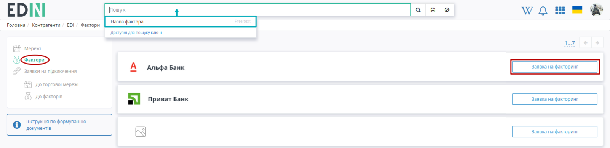

Після чого потрібно заповнити **Заявку на факторинг** (поля обов'язкові до заповнення позначені червоною зірочкою :red:`*`):

.. image:: pics_PCInstruction/PCInstruction_284.png
   :align: center

При введені даних дебітора потрібно почати вводити його назву або GLN (від трьох символів) і система сама запропонує обрати значення зі списку:

.. image:: pics_PCInstruction/PCInstruction_209.gif
   :align: center

Є можливість додати необмежену кількість дебіторів (мінімум один) за допомогою кнопки **"+Додати дебітора"**, а також за потреби **"Видалити"** доданих дебіторів:

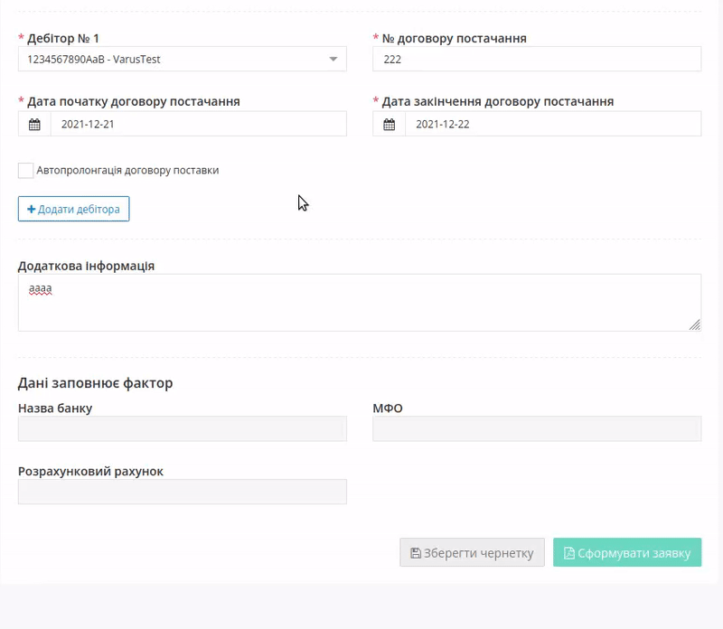

В блоці **Додаткова інформація** можливо додати текстову примітку.  

.. note:: Блок **Дані заповнює фактор** заповнюється лише зі сторони компанії-фактора!

Після того, як всі обов'язкові поля будуть заповнені можливо за допомогою кнопки **"Сформувати заявку"** чи **"Зберегти чернетку"** для подальшого редагування:

.. image:: pics_PCInstruction/PCInstruction_194.png
   :align: center

З міркувань безпеки та коректної ідентифікації Постачальника/Мережі заявка відправляється тільки після `підтвердження GLN <https://wiki.edin.ua/uk/latest/Personal_Cabinet/PCInstruction.html#gln-main>`__ Відправника (ЄДРПОУ в КЕП повинен відповідати ЄДРПОУ вказаному в GLN).

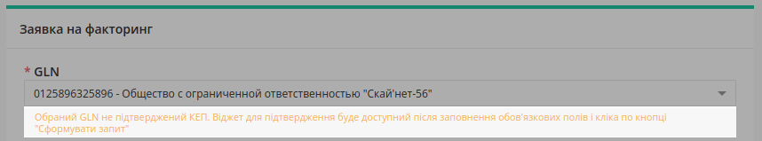

.. hint::
   Процес підтвердження подібний до типового підписання на платформі та описаний в `розділі вище <https://wiki.edin.ua/uk/latest/Personal_Cabinet/PCInstruction.html#sign>`__. Якщо ЄДРПОУ ключа співпадає з ЄДРПОУ акаунта, то автоматично "підтверджується" й акаунт.

Однак підписання під час формування запиту не потрібне, якщо обрати GLN, що вже був `підтверджений за допомогою КЕП <https://wiki.edin.ua/uk/latest/Personal_Cabinet/PCInstruction.html#gln-main>`__:

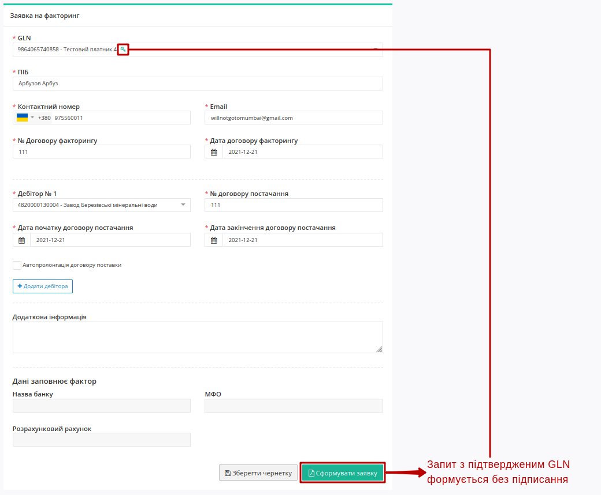

Перед тим як **"Відправити заявку"** фактору можливо **"Завантажити PDF заявки"** та додати додаткові файли без підпису (**"+Додати файли"**):

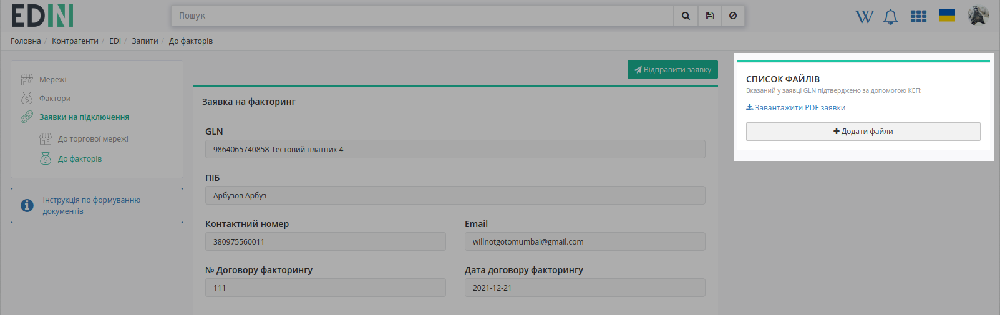

.. note::
   До заявки можливо додавати txt, .doc, .docx, .xls, .xlsx, .ppt, .pptx, image, .pdf, .rtf, .zip файли розміром не більше 5 МБ і загальним об'ємом не більше 10 МБ. Система вказує розмір долучених файлів і розраховує доступний розмір до завантаження, в якості підказки:

   .. image:: pics_PCInstruction/PCInstruction_124.png
      :align: center

В блоці "Список файлів" всі файли можливо завантажити, а додаткові видалити:

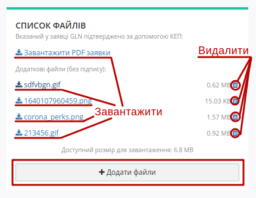

Після того, як дії з файлами будуть виконані потрібно **"Відправити заявку"**:

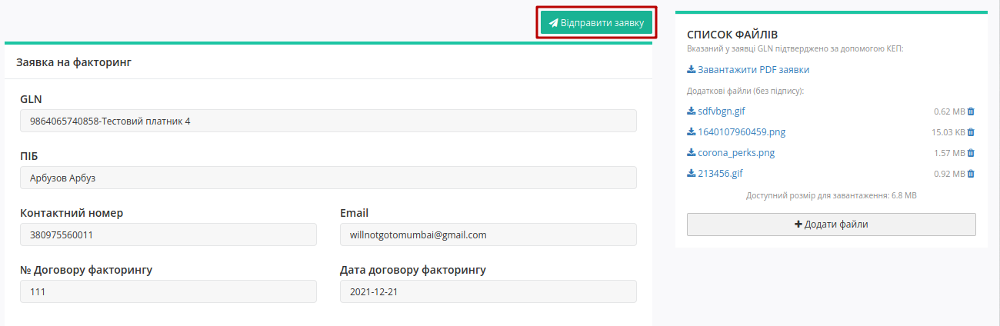

Відправлений запит змінює свій статус на :orange:`На розгляді` і відображається в **"Заявках на підключення"** до факторів:

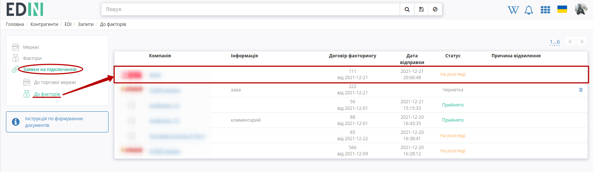

Після того, як фактор *підтвердить* чи *відхилить* заявку Постачальнику/Мережі буде надіслано повідомлення на Email та оновлено статус заявки (детальніше в розділі `Заявки на підключення <https://wiki.edin.ua/uk/latest/Personal_Cabinet/PCInstruction.html#request>`__).

.. _request: 

**4.1.4 Заявки на підключення**
~~~~~~~~~~~~~~~~~~~~~~~~~~~~~~~~~~~~~~~~~~~~~~~~~~~~~~

Розділ **Заявки на підключення** поділяється на **Заявки до торгової мережі** та **Заявки до факторів**:

.. important::
   * Підрозділ **Заявок до торгової мережі** для ролей Постачальника/Фактора та Мережі функціонально відрізняється, оскільки Постачальник є відправником, а Мережа - отримувачем, що приймає рішення.
   * Підрозділ **Заявок до факторів** для ролей Постачальника/Мережі та Фактора функціонально відрізняється, оскільки Постачальник/Мережа є відправником, а Фактор - отримувачем, що приймає рішення.

Статуси запитів/заявок:

* Чернетка (можливо видалити |мусорка|) - створений Постачальником, але не відправлений запит на підключення;
* :red:`Відхилено` - Мережа відхилила запит на підключення;
* :green:`Прийнято` - Мережа прийняла запит на підключення;
* :orange:`На розгляді` - відправлений запит, за яким Мережа ще не прийняла рішення.

Список можливо відсортувати за статусом:

.. image:: pics_PCInstruction/PCInstruction_197.png
   :align: center

**4.1.4.1 Заявки на підключення до торгової мережі (для Постачальника/Фактора)**
""""""""""""""""""""""""""""""""""""""""""""""""""""""""""""""""""""""""""""""""""""""""

Заявки на підключення **До торгової мережі** - підрозділ всіх відправлених запитів даного користувача. В списку відображається назва мережі, логотип, GLN, додаткова інформація, договір підключення, статус заявки.

Детальніше ознайомитись з запитом на підключення можливо клікнувши на назву мережі; кнопка **"Повторити"** доступна, коли запит було відхилено і повторно відправляє запит на підключення (формування нового запиту аналогічно до функціоналу **"Відправити заявку"**).

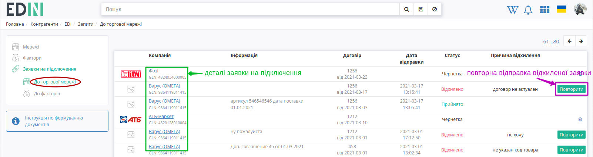

За детальнішого перегляду запиту на підключення відображається статус (для відхиленого запиту додатково вказується причина відхилення) форма з даними, що були відправлені при формуванні запиту:

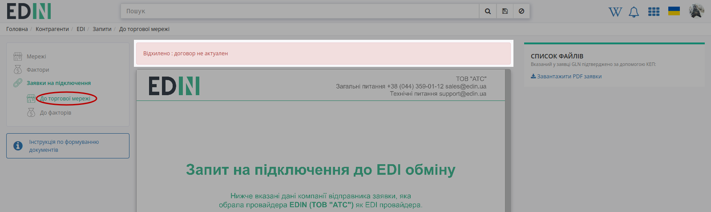

**4.1.4.2 Заявки на підключення до торгової мережі (для Мережі)**
""""""""""""""""""""""""""""""""""""""""""""""""""""""""""""""""""""""""""""""""""""""""""

Заявки на підключення **До торгової мережі** - підрозділ всіх отриманих в мережу запитів. В списку відображається ім'я особи-підписанта, логотип, GLN, додаткова інформація, договір підключення, дата відправки, статус заявки, причина відхилення. Детальніше ознайомитись з запитом на підключення можливо клікнувши на ПІБ відправника запиту:

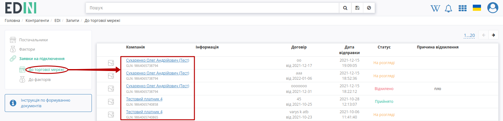

.. hint::
   Запити, по яким вже було прийнято рішення (в статусах :green:`Прийнято` / :red:`Відхилено`) на стороні Постачальника/Фактора та Мережі не відрізняються.

Якщо запит знаходиться в статусі :orange:`На розгляді`, то на стороні Мережі активні кнопки прийняття рішення по запиту: **"Підтвердити"** і **"Відхилити"** (при відхиленні вказується причина):

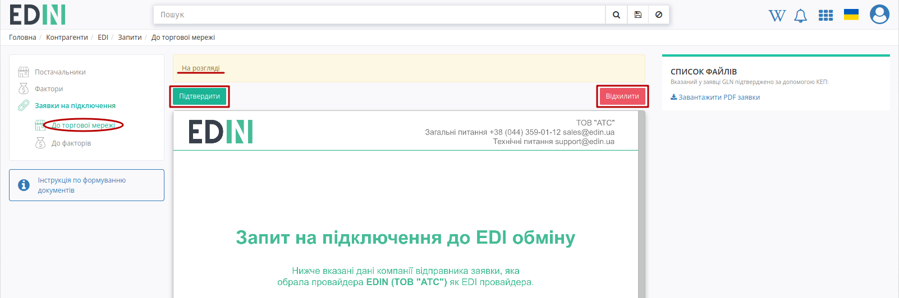

По всім заявкам :orange:`На розгляді` Мережа кожного понеділка о 10:00 буде отримувати лист-нагадування на контактний email:

.. image:: pics_PCInstruction/PCInstruction_164.png
   :align: center

Після прийняття рішення запит змінює свій статус на :green:`Прийнято` / :red:`Відхилено`.

.. note::
   Додатково по всіх запитах Постачальника Торгова Мережа отримує листа з посиланням на форму прийняття рішення, що не потребує авторизації (лист також містить підписану заявку в pdf форматі):

   .. image:: pics_PCInstruction/PCInstruction_100.png
      :align: center

   .. image:: pics_PCInstruction/PCInstruction_101.png
      :align: center

   *При відхиленні обов'язково потрібно вказати причину відмови:

   .. image:: pics_PCInstruction/PCInstruction_102.png
      :align: center

**4.1.4.3 Заявки на підключення до факторів (для Постачальника/Мережі)**
""""""""""""""""""""""""""""""""""""""""""""""""""""""""""""""""""""""""""
Заявки на підключення **До факторів** - підрозділ всіх відправлених запитів даного користувача. В списку відображається назва компанії-фактора, логотип, GLN, додаткова інформація, договір факторингу, дата відправки, статус заявки, причина відхилення. Детальніше ознайомитись з заявкою на факторинг можливо клікнувши на назву компанії-фактора; кнопка **"Повторити"** доступна, коли запит було відхилено і повторно відправляє запит на підключення (автоматичне формування нового запиту).

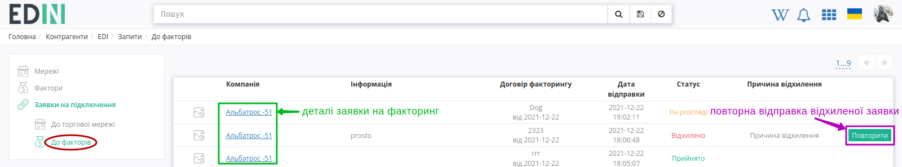

За детальнішого перегляду запиту на підключення відображається статус (для відхиленого запиту додатково вказується причина відхилення) форма з даними, що були відправлені при формуванні запиту:

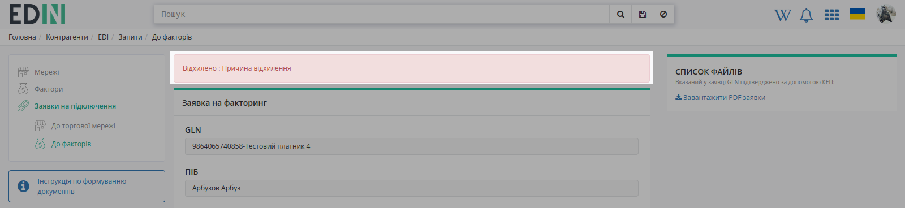

**4.1.4.4 Заявки на підключення до факторів (для Фактора)**
""""""""""""""""""""""""""""""""""""""""""""""""""""""""""""""""""""""""""

На Email Фактора приходить лист з посиланням на заявку, заявкою у вигляді PDF та оригіналами вкладених файлів (за їх наявності):

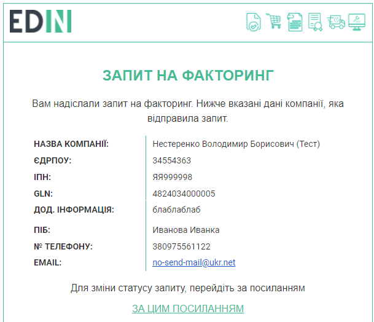

Заявки на підключення **До факторів** - підрозділ всіх отриманих Фактором запитів. В списку відображається ім'я особи-підписанта, логотип, GLN, додаткова інформація, договір факторингу, дата відправки, статус заявки, причина відхилення. Детальніше ознайомитись з запитом на факторинг можливо клікнувши на ПІБ відправника запиту:

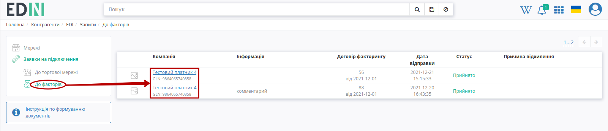

.. hint::
   Запити, по яким вже було прийнято рішення (в статусах :green:`Прийнято` / :red:`Відхилено`) на стороні Постачальника/Мережі та Фактора не відрізняються.

Якщо запит знаходиться в статусі :orange:`На розгляді`, то на стороні Фактора при перегляді заявки активні кнопки прийняття рішення: **"Підтвердити"** чи **"Відхилити"**:

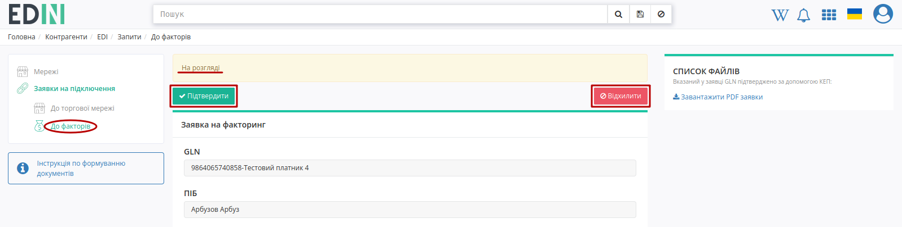

Перед тим, як **"Підтвердити"** заявку є можливість вказати банківські реквізити (назва банку, розрахунковий рахунок, МФО), що будуть відображатись Постачальнику/Мережі:

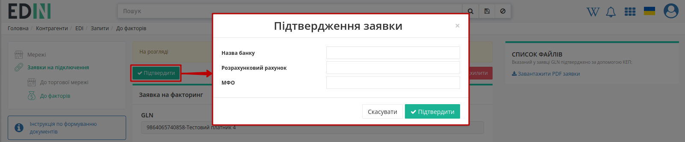

При відхиленні обов'язково вказується причина (в текстовій формі):

.. image:: pics_PCInstruction/PCInstruction_208.gif
   :align: center

На Email Постачальника/Мережі приходить лист з повідомленням про зміну статуса заявки і посиланням на неї:

.. image:: pics_PCInstruction/PCInstruction_203.png
   :align: center

.. _user-notifications: 

**5 Керування сповіщеннями**
================================================

Перейти в розділ можливо з меню особистого кабінету (для користувача, під яким Ви авторизувались) чи при редагуванні користувача компанії (для адміністраторів акаунта (`"Ролі користувачів" <https://wiki.edin.ua/uk/latest/Personal_Cabinet/PCInstruction.html#user-roles>`__)):

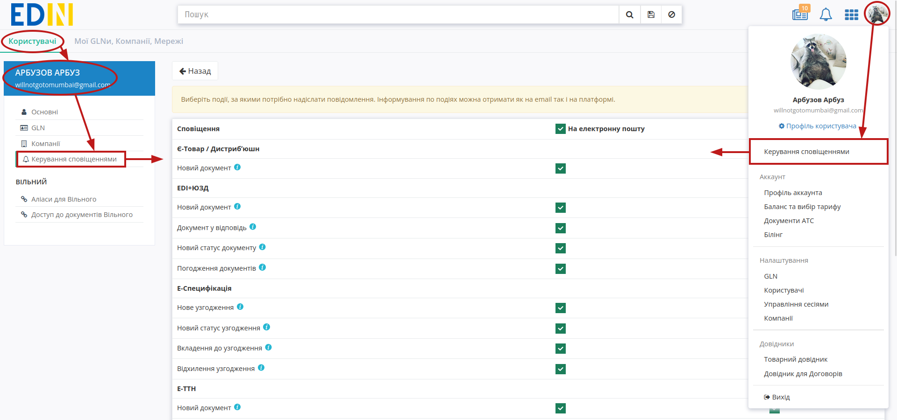

За замовчуванням (якщо нічого не вибрано) сповіщення відправляються за всіма доступними користувачу сервісами. Підрозділ дозволяє налаштувати сповіщення на e-mail та в `"Центр повідомлень" <https://wiki.edin.ua/uk/latest/general_2_0/rabota_s_platformoj_EDIN_2.0.html#messages>`__ (в системі платформи EDI Network) за допомогою відповідних відміток. При наведенні курсора на іконку |info| можливо переглянути підказку з детальнішою інформацією по налаштуванню. Налаштування сповіщень відображаються лише за доступними користувачу сервісами - блоки налаштувань за сервісами додаються/зникають автоматично при відповідних змінах в налаштуваннях доступу обраного користувача (`"Ролі користувачів" <https://wiki.edin.ua/uk/latest/Personal_Cabinet/PCInstruction.html#user-roles>`__).  

.. note::
   Повідомлення в системі (`"Центрі повідомлень" <https://wiki.edin.ua/uk/latest/general_2_0/rabota_s_platformoj_EDIN_2.0.html#messages>`__) відображаються лише під час `сесії користувача <https://wiki.edin.ua/uk/latest/Personal_Cabinet/PCInstruction.html#session-management>`__, тобто для того, щоб їх отримувати потібно бути "онлайн".

-------------------------------------

.. [#] **Основний тариф** - тарифний пакет сервісу, що був вперше куплений на обраний період.
   
.. [#] **Річний тариф** - тарифний пакет, що продається одразу терміном на один рік, наприклад, Е-Сертифікати (EDIN-Certificate).

.. [#] Статус виставлених рахунків встановлюється зі сторони компанії-провайдера.  

-------------------------------------

.. include:: /_constant/kontakti.rst
