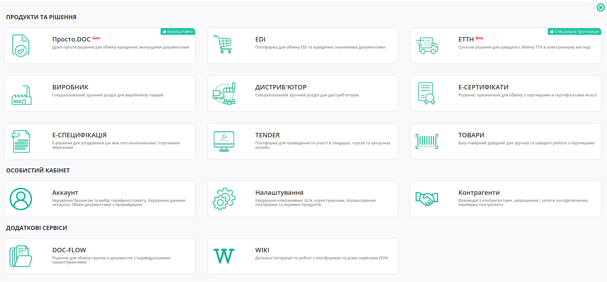
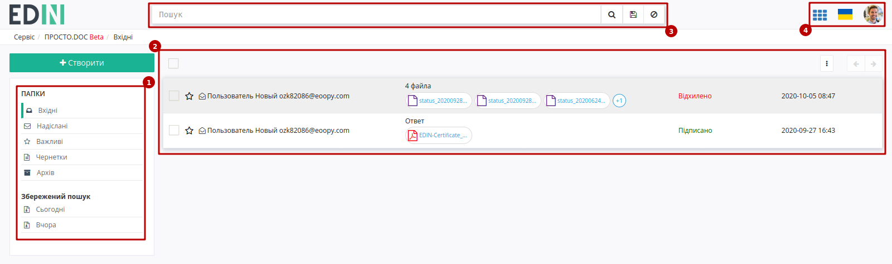
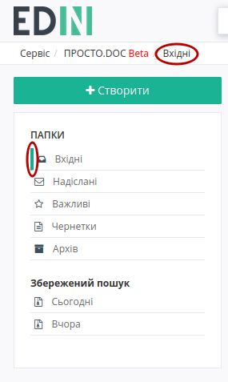
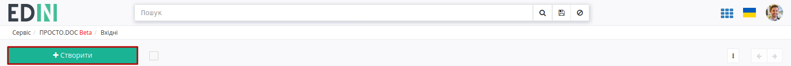
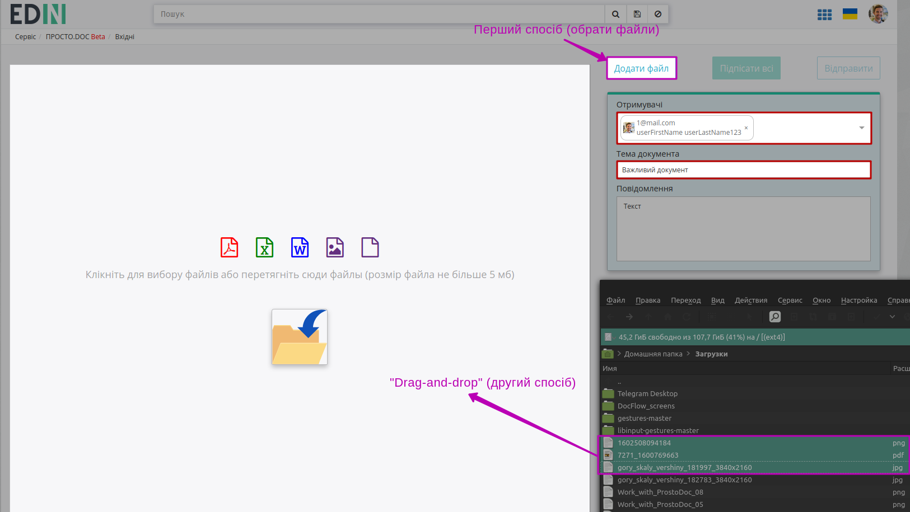
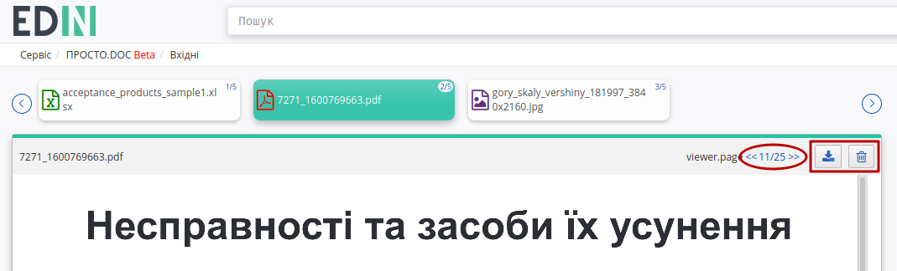
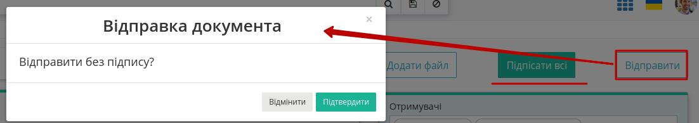
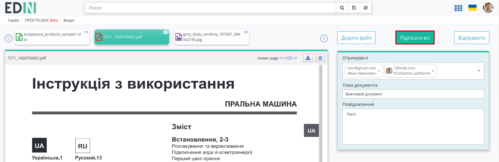
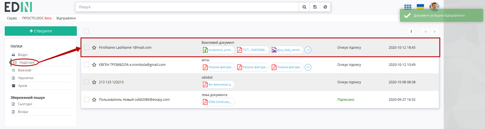
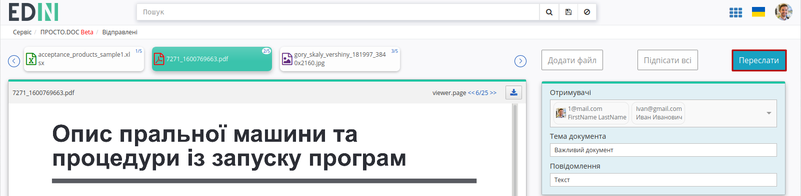

Робота з сервісом Просто.DOC
#############################################################

.. role:: red

.. role:: underline

.. сюда закину немного картинок для текста

.. |пресуха| image:: pics_Work_with_ProstoDoc/Work_with_ProstoDoc_03.png

.. |звезда| image:: pics_Work_with_ProstoDoc/Work_with_ProstoDoc_06.png

.. |звезда2| image:: pics_Work_with_ProstoDoc/Work_with_ProstoDoc_07.png

.. |прокрутка1| image:: pics_Work_with_ProstoDoc/Work_with_ProstoDoc_12.png

.. |прокрутка2| image:: pics_Work_with_ProstoDoc/Work_with_ProstoDoc_11.png

.. |trash| image:: pics_Work_with_ProstoDoc/Work_with_ProstoDoc_18.png

.. |non| image:: pics_Work_with_ProstoDoc/Work_with_ProstoDoc_21.png

.. |del_key| image:: signing/del_key2.png

.. contents:: Зміст:
   :depth: 6

---------

**Вхід на платформу**
================================================

Для роботи з WEB сервісом Ви можете використовувати будь-який браузер (рекомендованим є **Google Chrome** останньої версії). Для входу до сервісу платформи необхідно перейти за посиланням https://edo-v2.edin.ua/auth .

При переході за вказаним посиланням відкриється вікно авторизації. Необхідно ввести Ваш логін і пароль користувача і натиснути «**Вхід**»:

.. image:: pics_Work_with_ProstoDoc/Work_with_ProstoDoc_01.png
   :align: center

.. hint::
   Нові користувачі можуть самостійно пройти "Реєстрацію" на платформі (детальніше в `інструкції <https://wiki.edin.ua/uk/latest/general_2_0/User_registration.html>`__)

Після успішної авторизації відкриється головне меню з сервісами платформи EDIN:

Лівою кнопкою миші потрібно вибрати **"Просто.DOC"**.

.. hint::
   Для повернення до меню сервісів, товарного довідника потрібно натиснути кнопку |пресуха| або натиснувши на логотип EDIN

**Загальний вигляд сервісу**
================================================

Зовнішній вигляд сервісу **"Просто.DOC"** складається з кількох наступних основних частин: функціонал переходу по каталогами папок (1), журналу документів (2), пошуку документів (3), кнопки переходу в меню сервісів, вибору мови, `налаштувань користувача <https://wiki.edin.ua/uk/latest/general_2_0/rabota_s_platformoj_EDIN_2.0.html#pers-settings>`__ та виходу з платформи (4). Детальніше про`"Особистий кабінет" <https://wiki.edin.ua/uk/latest/Personal_Cabinet/PCInstruction.html>`__.

**Перегляд каталогів платформи**
================================================

В путівнику, а також зеленим маркером відмічене поточне місце перебування користувача в сервісі (при первинному вході - в каталозі "**Вхідних**" документів).

Для переходу в потрібний Вам каталог необхідно його вибрати:

#. **"Вхідні"** - каталог вхідних документів організації (від контрагентів).
#. **"Надіслані"** - каталог відправлених документів організації (до контрагентів).
#. **"Важливі"** - каталог всіх документів, що були відзначені, як "важливі" символом зірочки ("важливі" |звезда| / |звезда2| "звичайні").
#. **"Чернетки"** - каталог для документів, що були створені, але не були відправлені. 
#. **"Архів"** - каталог для документів, що були перенесені в архів.
#. **"Збережений пошук"** - стандартні та створені користувачем комбінації критеріїв пошуку документів для зручної фільтрації документів у вище перерахованих каталогах (детальніше за `посиланням <https://wiki.edin.ua/uk/latest/ProstoDoc/Work_with_ProstoDoc.html#search>`__).

**1 Створення документа**
================================================

Для створення документа на платформі необхідно натиснути кнопку - "**Створити**"

Після цього на формі створення документа обов'язково потрібно вказати "Отримувача", "Тему документа" та додати файли-вкладення.

Для вибору потрібних **Отримувачів** (може бути декілька) потрібно в полі почати вводити прізвище, пошту чи GLN контрагента (min 3 символи) і обрати зі списку зареєстрованих на платформі користувачів:

.. image:: pics_Work_with_ProstoDoc/Work_with_ProstoDoc_13.gif
   :align: center

Файли можливо додати з локального носія через кнопку "Додати файл" чи "Drag-and-drop" способом:

.. note::
   Один документ може містити не більше 10 файлів в pdf/jpeg/png/doc/docx/xls/xlsx форматі з розміром файлу не більше 5 Мб.

При додаванні більше 3 файлів частина файлів прихована за стрілками прокручування (|прокрутка1| |прокрутка2|). Для доданих файлів доступний попередній перегляд їх вмісту (попередній перегляд працює лише для файлів в pdf/jpeg/png форматах):

.. image:: pics_Work_with_ProstoDoc/Work_with_ProstoDoc_10.gif
   :align: center

Додані файли можливо скачати (|download|) чи видалити (|trash|).

Після додавання файлу/-ів та заповнення всіх обов'язковий полей можливо масово "Підписати всі" документи та "Відправити" чи "Відправити без підписання". При відправці непідписанного документа з'являється підказка, що потребує підтвердження дії:

**2 Підписання та відправка документа**
================================================

Для підписання необхідно натинути на кнопку "Підписати всі":

Після ініціалізації бібліотеки підписання, система надасть можливість додати ключ для підписання. При :underline:`першому` підписанні у модальному вікні потрібно обрати файл чи токен (1), ввести пароль (2) та натиснути **"Зчитати"** (3) ключ для підписання:

.. image:: signing/file1n.png
   :align: center

.. image:: signing/file2n.png
   :align: center

При успішному додаванні ключа автоматично відобразиться особа, від імені якої буде здійснено підписання. У користувача може бути додано кілька ключів - для вибору потрібного для здійснення операції підписання потрібно проставити відмітку (4) лівою кнопкою миші і натиснути **"Підписати"** (5):

.. image:: signing/file3n.png
   :align: center

.. important::
   Якщо підписання цим ключем вже було здійснено або знайдена невідповідність даних ЄДРПОУ/ІПН (перевірка), то підписання блокується, а користувачу виводиться відповідне повідомлення:

.. image:: signing/wrong_key.png
   :align: center

Додатково в вікні підписання можливо натиснути **"Детальніше"** для того, щоб переглянути інформацію про підписанта; можливо видалити помилкові ключі (|del_key|).

При подальшій роботі з раніше доданим ключем/-ами потрібно вводити лише пароль для обраного ключа:

.. image:: signing/file4n.png
   :align: center

.. image:: signing/file5n.png
   :align: center

Після підписання документів під документами відображається інформація щодо підписантів. Для відправки документів потрібно натиснути на кнопку **"Відправити"**.

.. image:: pics_Work_with_ProstoDoc/Work_with_ProstoDoc_22.png
   :align: center

Після відправки документа контрагентам він відображається в журналі надісланих документів:

Відправлений документ можливо лише **"Переслати"** (кнопки додавання файлів та підписання не активні):

.. _search:

**3 Пошук документів**
================================================

Для того щоб виконати пошук документів на платформі необхідно перейти в підменю каталогів під назвою **"Пошук"**.

.. image:: pics_Work_with_ProstoDoc/Work_with_ProstoDoc_23.png
   :align: center

Потім потрібно ввести назву та вибрати параметри. За потребою можна користуватись випадаючим списком. Після цього натисніть - **"Пошук"** (1).
Усі елементи пошуку повині бути розділені комами, також є елементи із конкретним значенням та без: "Номер: 123, #Відправлені," (2).

.. image:: pics_Work_with_ProstoDoc/Work_with_ProstoDoc_24.png
   :align: center

Окремо винесені фільтри документів по даті (**"Сьогодні"**, **"Вчора"**), а останній введений пошук зберігається платформою автоматично і при натисканні кнопки **"Останній фільтр"** він виконується повторно в тій папці ("Вхідні" / "Надіслані" / "Важливі" / "Чернетки" / "Архів"), в якій він був виконаний останнього разу (Вас буде переадресовано):

.. image:: pics_Work_with_ProstoDoc/Work_with_ProstoDoc_25.png
   :align: center

Також можливо перманентно **Зберегти** данні власного рядку пошуку, натиснувши на іконку дискети (1). Переглянути збережений пошук можна в блоці "**Збережений пошук**" (2). Збережений пошук відноситься тільки до певного статусу документа: "Вхідні", "Вихідні".
У блоці "Збережений пошук" за замовчуванням доступні фільтри по документам за сьогодні та вчора (3).
Вилучити збережений пошук можна за допомогою хрестика (4).

.. image:: pics_Work_with_ProstoDoc/Work_with_ProstoDoc_26.png
   :align: center

Очистити рядок "Пошук" можна за допомогою кнопки **"Скинути фільтри"** |non| . При переході між папками "Вхідні", "Вихідні" пошуковий рядок очищається.
Якщо користувач відфільтрував список документів, після чого перейшов до перегляду цього документа та повернувся назад, — пошук зберігається.

.. image:: pics_Work_with_ProstoDoc/Work_with_ProstoDoc_27.png
   :align: center

----------------------------
   
.. include:: kontakti.rst
