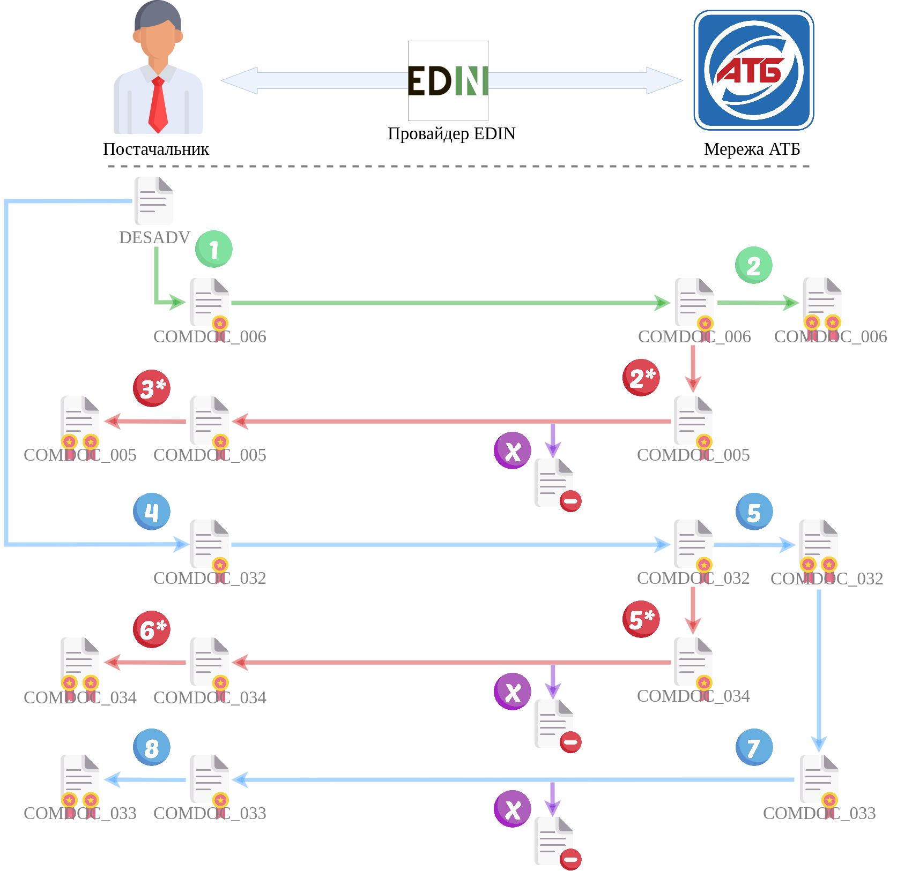

Робота з АТБ через API
#############################################################

.. role:: red

.. role:: underline

.. role:: green

.. role:: purple

----------------------------------------------------

----------------------------------------------------

.. attention:: Мережа АТБ може відкликати власне підписання, поки з документом не були виконані інші дії:

`Створення квитанції №14 (відкликати підписання документа COMDOC) <https://wiki.edin.ua/uk/latest/integration_2_0/APIv2/Methods/ComdocRevoke.html>`__

----------------------------------------------------

.. image:: pics_API_schema/Green1.png
   :height: 31px
   :width: 31px

1.1 `Авторизація Постачальника <https://wiki.edin.ua/uk/latest/integration_2_0/APIv2/Methods/Authorization.html>`__

1.2 `Створення, підписання і відправка документа COMDOC_006 <https://wiki.edin.ua/uk/latest/integration_2_0/APIv2/Methods/SendDocumentWithoutDraft.html>`__

-----------------------------------------------

2.1 `Авторизація Мережі АТБ <https://wiki.edin.ua/uk/latest/integration_2_0/APIv2/Methods/Authorization.html>`__

2.2 `Пошук "Видаткових накладних" (COMDOC_006) в статусі "Потребує підписання отримувачем" <https://wiki.edin.ua/uk/latest/integration_2_0/APIv2/Methods/DocsSearch.html>`__

2.3 `Отримати/завантажити тіло документа <https://wiki.edin.ua/uk/latest/integration_2_0/APIv2/Methods/DownloadDocument.html>`__

2.4 `Відправка статусу документа <https://wiki.edin.ua/uk/latest/integration_2_0/APIv2/Methods/PostDocStatuses.html>`__

2.5 `Створення квитанції №2 (прийняття документа COMDOC) <https://wiki.edin.ua/uk/latest/integration_2_0/APIv2/Methods/ComdocAccept.html>`__

2.4* `Створення, підписання і відправка документа COMDOC_005 <https://wiki.edin.ua/uk/latest/integration_2_0/APIv2/Methods/SendDocumentWithoutDraft.html>`__

-----------------------------------------------

.. image:: pics_API_schema/Red3.png
   :height: 31px
   :width: 31px

3.1* `Авторизація Постачальника <https://wiki.edin.ua/uk/latest/integration_2_0/APIv2/Methods/Authorization.html>`__

3.2* `Отримання вхідних документів" <https://wiki.edin.ua/uk/latest/integration_2_0/APIv2/Methods/DocsSearch.html>`__

3.3* `Створення квитанції №2 (прийняття документа COMDOC) <https://wiki.edin.ua/uk/latest/integration_2_0/APIv2/Methods/ComdocAccept.html>`__

-----------------------------------------------

4.1 `Авторизація Постачальника <https://wiki.edin.ua/uk/latest/integration_2_0/APIv2/Methods/Authorization.html>`__

4.2 `Створення, підписання і відправка документа COMDOC_032 <https://wiki.edin.ua/uk/latest/integration_2_0/APIv2/Methods/SendDocumentWithoutDraft.html>`__

-----------------------------------------------

5.1 `Авторизація Мережі АТБ <https://wiki.edin.ua/uk/latest/integration_2_0/APIv2/Methods/Authorization.html>`__

5.2 `Пошук "Актів приймання товару (складська логістика)" (COMDOC_032) в статусі "Потребує підписання отримувачем" <https://wiki.edin.ua/uk/latest/integration_2_0/APIv2/Methods/DocsSearch.html>`__

5.3 `Отримати/завантажити тіло документа <https://wiki.edin.ua/uk/latest/integration_2_0/APIv2/Methods/DownloadDocument.html>`__

5.4 `Відправка статусу документа <https://wiki.edin.ua/uk/latest/integration_2_0/APIv2/Methods/PostDocStatuses.html>`__

5.5 `Створення квитанції №2 (прийняття документа COMDOC) <https://wiki.edin.ua/uk/latest/integration_2_0/APIv2/Methods/ComdocAccept.html>`__

5.4* `Створення, підписання і відправка документа COMDOC_034 <https://wiki.edin.ua/uk/latest/integration_2_0/APIv2/Methods/SendDocumentWithoutDraft.html>`__

-----------------------------------------------

6.1* `Авторизація Постачальника <https://wiki.edin.ua/uk/latest/integration_2_0/APIv2/Methods/Authorization.html>`__

6.2* `Отримання вхідних документів" <https://wiki.edin.ua/uk/latest/integration_2_0/APIv2/Methods/DocsSearch.html>`__

6.3* `Створення квитанції №2 (прийняття документа COMDOC) <https://wiki.edin.ua/uk/latest/integration_2_0/APIv2/Methods/ComdocAccept.html>`__

-----------------------------------------------

7.1 `Авторизація Мережі АТБ <https://wiki.edin.ua/uk/latest/integration_2_0/APIv2/Methods/Authorization.html>`__

7.2 `Пошук "Актів приймання товару (складська логістика)" (COMDOC_032) в статусі "Підтверджено з двох сторін" <https://wiki.edin.ua/uk/latest/integration_2_0/APIv2/Methods/DocsSearch.html>`__

7.3 `Отримати/завантажити тіло документа <https://wiki.edin.ua/uk/latest/integration_2_0/APIv2/Methods/DownloadDocument.html>`__

7.4 `Створення, підписання і відправка документа COMDOC_033 <https://wiki.edin.ua/uk/latest/integration_2_0/APIv2/Methods/SendDocumentWithoutDraft.html>`__ 

-----------------------------------------------

8.1 `Авторизація Постачальника <https://wiki.edin.ua/uk/latest/integration_2_0/APIv2/Methods/Authorization.html>`__

8.2 `Отримання вхідних документів" <https://wiki.edin.ua/uk/latest/integration_2_0/APIv2/Methods/DocsSearch.html>`__

8.3 `Створення квитанції №2 (прийняття документа COMDOC) <https://wiki.edin.ua/uk/latest/integration_2_0/APIv2/Methods/ComdocAccept.html>`__

-----------------------------------------------

**Додаткові методи API**
=============================

Додатково мережа АТБ зі своєї сторони може `відкликати підписання документа COMDOC <https://wiki.edin.ua/uk/latest/integration_2_0/APIv2/Methods/ComdocRevoke.html>`__, `відхилити документ COMDOC <https://wiki.edin.ua/uk/latest/integration_2_0/APIv2/Methods/ComdocReject.html>`__ від Постачальника чи почати процес анулювання:

* зі сторони АТБ виконується `запит на анулювання COMDOC <https://wiki.edin.ua/uk/latest/integration_2_0/APIv2/Methods/RepealRequest.html>`__
* у відповідь зі сторони Постачальника виконується `прийняття запиту на анулювання COMDOC <https://wiki.edin.ua/uk/latest/integration_2_0/APIv2/Methods/RepealAccept.html>`__ або `відмова від анулювання COMDOC) <https://wiki.edin.ua/uk/latest/integration_2_0/APIv2/Methods/RepealReject.html>`__

* `Отримання всіх квитанцій вказаного документа <https://wiki.edin.ua/uk/latest/integration_2_0/APIv2/Methods/GetTickets.html>`__                                                             |

-------------------------------

Список додаткового API по роботі з квитанціями COMDOC `за посиланням <https://wiki.edin.ua/uk/latest/integration_2_0/APIv2/APIv2_list.html#id4>`__.
