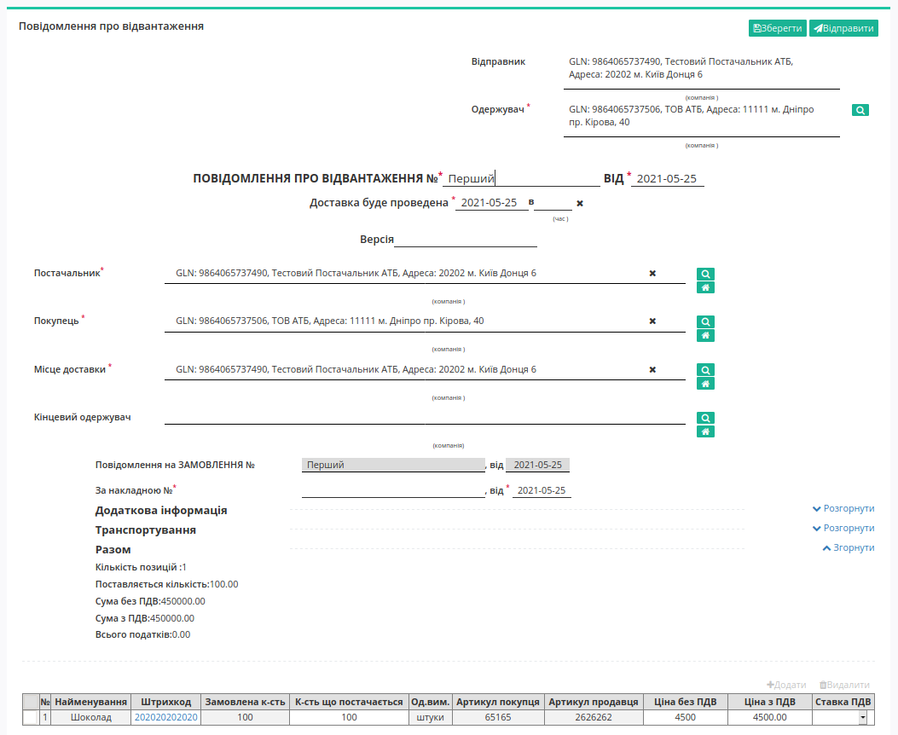
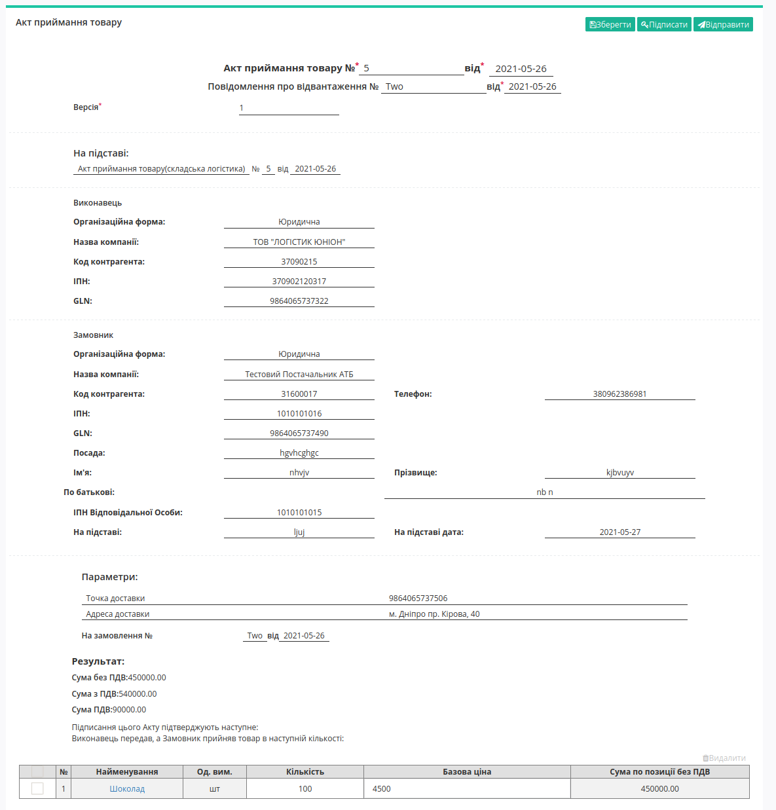
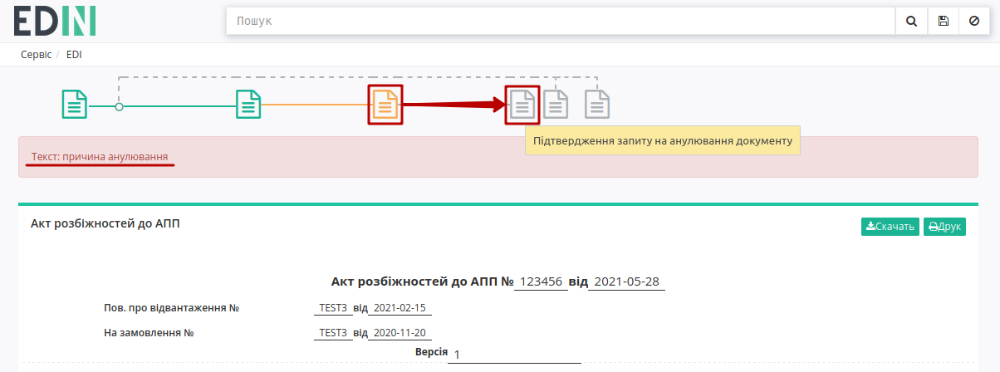

########################################################################################################################
Документообіг з мережею "АТБ" на платформі EDI Network 2.0: "Міжнародні перевезення"
########################################################################################################################

.. сюда закину немного картинок для текста

.. |лупа| image:: pics_ATB_external_EDI_instruction/ATB_external_EDI_instruction_003.png

.. |будинок| image:: pics_ATB_external_EDI_instruction/ATB_external_EDI_instruction_004.png

.. |мусорка| image:: pics_ATB_external_EDI_instruction/ATB_external_EDI_instruction_030.png

.. |info| image:: pics_ATB_external_EDI_instruction/ATB_external_EDI_instruction_064.png

.. role:: red

.. contents:: Зміст:
   :depth: 2

---------

Вступ
====================================

Дана інструкція описує порядок документообігу з мережею "АТБ" на платформі EDI Network 2.0. В документообігу приймають участь наступні документи:

- `Замовлення <https://wiki.edin.ua/uk/latest/XML/XML-structure.html#order>`__
- `Повідомлення про відвантаження (DESADV) <https://wiki.edin.ua/uk/latest/RetailersLists/ATB/ATB_XML-structure.html#desadv>`__
- `Видаткова накладна (COMDOC_006) <https://wiki.edin.ua/uk/latest/RetailersLists/ATB/ATB_XML-structure.html#comdoc-006>`__
- `Акт приймання товару (складська логістика) (COMDOC_032) <https://wiki.edin.ua/uk/latest/RetailersLists/ATB/ATB_XML-structure.html#comdoc-032>`__
- `Акт приймання товару (COMDOC_033) <https://wiki.edin.ua/uk/latest/RetailersLists/ATB/ATB_XML-structure.html#comdoc-033>`__
- `Акт розбіжностей до АПП (COMDOC_034) <https://wiki.edin.ua/uk/latest/RetailersLists/ATB/ATB_XML-structure.html#comdoc-034>`__

1 Формування "Замовлення" (ORDER) на стороні мережі "АТБ"
==================================================================

Для формування "Замовлення" (ORDER) користувачу мережі "АТБ" в меню сервісу потрібно натиснути кнопку **"Створити"** та обрати документ "Замовлення" (для зручності можливо скористатись пошуком за назвою документа):

.. image:: pics_ATB_external_EDI_instruction/ATB_external_EDI_instruction_001.png
   :align: center

У відкритій формі документа всі обов'язкові до заповнення поля позначені червоною зірочкою :red:`*`.

.. image:: pics_ATB_external_EDI_instruction/ATB_external_EDI_instruction_002.png
   :align: center

#. **Відправник** - дані відправника документу (мережі) - заповнюються автоматично; не підлягають редагуванню;
#. **Одержувач** - дані одержувача (постачальника), для зручного пошуку контрагента натисніть на кнопку з іконкою лупи |лупа| ;
#. **Тип документа** - поле для вибору типу: *Оригінал замовлення*, *Заміна*, *Видалення*, *Фіктивність замовлення*, *Передзамовлення*, *Замовлення на послугу/маркетинг*;
#. **№** - номер замовлення;
#. **від** - дата підтвердження, за замовчуванням вказана поточна дата;
#. **Постачальник** - заповнюється за допомогою кнопки "Пошук контрагента" (|лупа|), або за допомогою кнопки "Вказати себе" (|будинок|);
#. **Покупець** - заповнюється за допомогою кнопки "Пошук контрагента" (|лупа|), або за допомогою кнопки "Вказати себе" (|будинок|);
#. **Місце доставки** - заповнюється за допомогою кнопки "Пошук контрагента" (|лупа|), або за допомогою кнопки "Вказати себе" (|будинок|);
#. **Поставка відбудеться** - дата та час доставки;
#. **За договором на поставку №** - номер договору на поставку.

.. hint::
   За допомогою кнопки **"Пошук контрагента"** (|лупа|) або ж за допомогою кнопки **"Вказати себе"** (|будинок|) можливо вказати чи змінити дані Покупця або Постачальника. Для пошуку введіть назву компанії, GLN або ІПН:

   .. image:: pics_ATB_external_EDI_instruction/ATB_external_EDI_instruction_005.png
      :align: center

.. вирішили прибрати, але для інших інструкцій ок - Блоки **Додаткова інформація** та **Транспортування** необов'язкові для заповнення і "згорнуті" за замовчуванням. Блок **Разом** розраховується автоматично після заповнення позицій.

   .. image:: pics_ATB_external_EDI_instruction/ATB_external_EDI_instruction_006.png
      :align: center

В табличній частині відображається основна інформація по замовлених **товарних позиціях**. Позиції можна заповнити вручну (кнопка **"+Додати"**) або **"Завантажити позиції з Excel"** файлу.

.. image:: pics_ATB_external_EDI_instruction/ATB_external_EDI_instruction_007.png
   :align: center

При ручному введенні через форму через кнопку **"+Додати"** товарні позиції заповнюються з товарного довідника (обов'язкові до заповнення поля позначені червоною зірочкою :red:`*`):

Завантажити позиції списком можливо за допомогою .XLS файлу Excel. Для коректного заповнення таблиці можливо скористатись шаблоном (кнопка **"Зберегти шаблон Excel"** для скачування шаблону у форматі .xls). Відкрийте та заповніть файл Excel. Колонки виділенні зеленим кольором - **обов'язкові для заповнення**! Деякі стовпці мають підказки до заповнення - наведіть курсор у верхній куток назви стовпця для відображення підказки: 

.. image:: pics_ATB_external_EDI_instruction/ATB_external_EDI_instruction_009.png
   :align: center

Для завантаження заповненого файлу на платформу натисніть на кнопку **"Завантажити позиції з Excel"** та виберіть у новому вікні збережений файл.

При необхідності змінити чи доповнити дані по позиціям, змініть данні у файлі .XLS та завантажке на платформу повторно. Позиції оновляться відповідно до файлу.

.. important:: У разі неправильного заповнення .XLS файлу Excel, при завантаженні з'явиться повідомлення про помилку з указанням рядка, який необхідно відкоригувати. При додаванні позиції, яка вже була додана, також зявиться попередження з указанням штрихкоду позиції.

Після внесення всіх даних потрібно **"Зберегти"** (1) документ, після чого його можливо **"Відправити"** (2):

.. image:: pics_ATB_external_EDI_instruction/ATB_external_EDI_instruction_010.png
   :align: center

Після збереження документ потрапляє в папку **"Чернетки"**:

.. image:: pics_ATB_external_EDI_instruction/ATB_external_EDI_instruction_011.png
   :align: center

Відправлений документ автоматично потрапляє в папку **"Надіслані"**:

.. image:: pics_ATB_external_EDI_instruction/ATB_external_EDI_instruction_012.png
   :align: center

На формі відправленого "Замовлення" Ви можете замінити дане "Замовлення" *Новим*, можливо залишити комментар, який відобразиться контрагенту в формі "Замовленням", завантажити чи роздрукувати "Замовлення":

2 Формування "Повідомлення про відвантаження" (DESADV). Сторона Постачальника
=========================================================================================================================

Для формування "Повідомлення про відвантаження" (DESADV) потрібно у папці **"Надіслані"** обрати "Замовлення" (ORDER), за яким потрібно зробити відвантаження. Для пошуку достатньо ввести коректний номер документа в полі «Пошук». Документи також можливо шукати за **Відправником**, **Датою документа** і **Одержувачем**.

Для формування "Повідомлення про відвантаження" (DESADV) виберіть відповідний документ на формі-підказці - документ створиться автоматично.

.. hint::
    Документ "Повідомлення про відвантаження" (DESADV) підтримує версіонність (на рівні одного ланцюжка документів). **"Версія"** документа використовується при заміні документа (номер документа зберігається): потрібно збільшувати значення на одиницю (n+1).

У відкритій формі "Повідомлення про відвантаження" (DESADV) деякі поля заповнюються автоматично з пов'язаного документа-підстави (обов'язкові до заповнення поля позначені червоною зірочкою :red:`*`):

#. **Одержувач** - дані одержувача (мережі), компанія;
#. **Повідомлення про відвантаження №** - номер "Повідомлення про відвантаження";
#. **від** - дата "Повідомлення про відвантаження", за замовчуванням вказана поточна дата;
#. **Доставка буде проведена** - дата і час доставки;
#. **Постачальник** - заповнюється автоматично або за допомогою кнопки "Пошук контрагента" (|лупа|), або за допомогою кнопки "Вказати себе" (|будинок|);
#. **Покупець** - заповнюється автоматично або за допомогою кнопки "Пошук контрагента" (|лупа|), або за допомогою кнопки "Вказати себе" (|будинок|);
#. **Місце доставки** - заповнюється автоматично або за допомогою кнопки "Пошук контрагента" (|лупа|), або за допомогою кнопки "Вказати себе" (|будинок|);
#. **За накладною №** - номер накладної;
#. **від** - дата накладної.

.. hint::
   За допомогою кнопки **"Пошук контрагента"** (|лупа|) або ж за допомогою кнопки **"Вказати себе"** (|будинок|) можливо вказати чи змінити дані Покупця або Постачальника. Для пошуку введіть назву компанії, GLN або ІПН:

   .. image:: pics_ATB_external_EDI_instruction/ATB_external_EDI_instruction_005.png
      :align: center

.. вирішили прибрати, але для інших інструкцій ок - Блоки **Додаткова інформація** та **Транспортування** необов'язкові для заповнення і "згорнуті" за замовчуванням. Блок **Разом** розраховується автоматично після заповнення позицій.

   .. image:: pics_ATB_external_EDI_instruction/ATB_external_EDI_instruction_026.png
      :align: center

.. important::
   **Увага!** Номер вказаної накладної повинен повністю збігатися з номером оригіналу паперової накладної.

Також повинні збігатись перелік товарних позицій (які були замовлені), їх кількість, що постачається. Система автоматично заповнює значення за позиціями з раніше відправленого документа "Замовлення", на основі якого був створений документ "Повідомлення про відвантаження" (DESADV). Можливо вносити зміни в кількість і ціну позицій.

:red:`Всі зміни за позиціями тільки після узгодження з мережею!`

.. image:: pics_ATB_external_EDI_instruction/ATB_external_EDI_instruction_018.png
   :align: center

.. attention::
   Кількість товарних позицій, що постачається не може перевищувати кількість зазначену в "Замовленні"!

Якщо по якійсь з позицій не буде поставки її необхідно відзначити галочкою і **"Видалити"**.

.. вирішили прибрати, але для інших інструкцій ок - Можливо також додати іншу позицію з Товарного довідника, заповнивши форму **Додати позицію** через кнопку **"+Додати"** (обов'язкові до заповнення поля позначені червоною зірочкою :red:`*`).

Після внесення всіх даних в документ, натисніть кнопку **"Зберегти"** (1), потім **"Відправити"** (2).

.. image:: pics_ATB_external_EDI_instruction/ATB_external_EDI_instruction_019.png
   :align: center
   
Відправлений документ автоматично потрапляє в папку **"Надіслані"** і буде знаходитись в ланцюжку документів разом із "Замовленням" і "Підтвердженням замовлення".

3 Формування "Видаткової накладної" (COMDOC_006). Сторона Постачальника
=========================================================================================================================

Перед початком роботи з **"Видатковою накладною"** необхідно заповнити всі реквізити, які будуть відображатися в документі з боку постачальника.

.. important::
   **Увага!** Зверніть увагу, що реквізити заповнюються українською мовою і повинні відповідати інформації в реєстраційних документах компанії.

Для формування "Видаткової накладної" (COMDOC_006) потрібно у папці **"Надіслані"** обрати "Повідомлення про відвантаження" (DESADV). Для пошуку достатньо ввести коректний номер документа в полі «Пошук». Документи також можливо шукати за **Відправником**, **Датою документа** і **Одержувачем**.

Для формування "Видаткової накладної" (COMDOC_006) виберіть відповідний документ на формі-підказці - документ створиться автоматично.

У відкритій формі "Видаткової накладної" (COMDOC_006) деякі поля заповнюються автоматично з пов'язаного документа-підстави (обов'язкові до заповнення поля позначені червоною зірочкою :red:`*`):

#. **Видаткова накладна №** - номер "Видаткової накладної";
#. **від** - дата "Видаткової накладної", за замовчуванням вказана поточна дата;
#. **"Повідомлення про відвантаження №"** - номер "Повідомлення про відвантаження";
#. **від** - дата "Повідомлення про відвантаження";
#. **На замовлення №** - номер "Замовлення";
#. **від** - дата "Замовлення";
#. **Версія** - версія "Видаткової накладної";
#. **На підставі** - поле для вибору типу документа-підстави;
#. **№** - номер документа-підстави;
#. **від** - дата документа-підстави.

.. hint::
   Блоки даних контрагентів (Відправника і Замовника) заповнюються автоматично. За допомогою кнопки **"Редагувати"** ці дані можливо замінити вручну (обов'язкові до заповнення поля позначені червоною зірочкою :red:`*`):

   .. image:: pics_ATB_external_EDI_instruction/ATB_external_EDI_instruction_025.png
      :align: center

   Блоки згортаються за допомогою кнопки **"Сховати"**:

   .. image:: pics_ATB_external_EDI_instruction/ATB_external_EDI_instruction_026.png
      :align: center

Змінити дані Замовника можливо також за допомогою **"Пошуку"**, вказавши назву компанії, GLN або ІПН:

Також можливо **Додати нового контрагента**, наприклад, Платника або Перевізника. При додаванні контрагента потрібно обрати роль контрагента із випадаючого списку (1) і натиснути на зелену кнопку **"+"** (2). Новий блок дозволяє здійснити пошук контрагента (3) за назвою компанії, GLN, ІПН:

.. image:: pics_ATB_external_EDI_instruction/ATB_external_EDI_instruction_028.png
   :align: center

В блок **Параметрів** можливо "Додати" (|плюс|) чи "Видалити" (|мусорка|) власні значення. З документа-підстави автоматично заповнюються обов'язкові **Параметри** доставки - "Точка доставки" та "Адреса доставки":

Блок **Результат** вираховується з табличної частини і містить загальну інформацію за товарними позиціями:

Блок табличної частини з переліком позицій заповнюються автоматично з документа-основи DESADV (поля **№**, **Найменування**, **Штрихкод**, **Базова ціна**, **ПДВ за од. продукції**, **Ціна**, **Кількість**, **Артикул покупця**, **Сумма без ПДВ**, **Сумма з ПДВ**) та з товарного довідника (поля **Од. Вим.**, **Артикул продавця**, **Код УКТЗЕД**). 

Можливо вносити зміни в кількість, ціну позицій та відсоток ставки ПДВ.

:red:`Всі зміни за позиціями тільки після узгодження з мережею!`

.. attention::
   Кількість товарних позицій, що постачається не може перевищувати кількість зазначену в "Замовленні"!

Після внесення всіх даних в документ, натисніть кнопку **"Зберегти"** (1) та **"Підписати"** (2):

Після збереження документ потрапляє в папку **"Чернетки"**:

.. image:: pics_ATB_external_EDI_instruction/ATB_external_EDI_instruction_035.png
   :align: center

.. hint::
   Процес підписання на платформі описаний в окремому розділі за `посиланням <https://wiki.edin.ua/uk/latest/RetailersLists/ATB/ATB_Instructions/ATB_external_EDI_instruction.html#sign>`__ .

Підписаний документ можливо **"Відправити"**:

.. image:: pics_ATB_external_EDI_instruction/ATB_external_EDI_instruction_036.png
   :align: center

Відправлений документ автоматично потрапляє в папку **"Надіслані"** зі статусом "Потребує підписання отримувачем":

.. image:: pics_ATB_external_EDI_instruction/ATB_external_EDI_instruction_037.png
   :align: center

Доступне **Відкликання підпису** - COMDOC_021 квитанція №14 (`детальніше <https://wiki.edin.ua/uk/latest/RetailersLists/ATB/ATB_Instructions/ATB_external_EDI_instruction.html#revoke>`__).

4 Формування "Акта приймання товару (складська логістика)" (COMDOC_032). Сторона Постачальника
=========================================================================================================================

Для формування "Акта приймання товару (складська логістика)" (COMDOC_032) потрібно у папці **"Надіслані"** обрати "Повідомлення про відвантаження" (DESADV). Для пошуку достатньо ввести коректний номер документа в полі «Пошук». Документи також можливо шукати за **Відправником**, **Датою документа** і **Одержувачем**.

.. image:: pics_ATB_external_EDI_instruction/ATB_external_EDI_instruction_042.png
   :align: center

Для формування "Акта приймання товару (складська логістика)" (COMDOC_032) виберіть відповідний документ на формі-підказці - документ створиться автоматично.

У відкритій формі "Акта приймання товару (складська логістика)" (COMDOC_032) деякі поля заповнюються автоматично з пов'язаного документа-підстави (обов'язкові до заповнення поля позначені червоною зірочкою :red:`*`):

#. **Акт приймання товару(складська логістика) №** - номер "Акта приймання товару (складська логістика)";
#. **від** - дата "Акта приймання товару (складська логістика)", за замовчуванням вказана поточна дата;
#. **"Повідомлення про відвантаження №"** - номер "Повідомлення про відвантаження";
#. **від** - дата "Повідомлення про відвантаження";
#. **На замовлення №** - номер "Замовлення";
#. **від** - дата "Замовлення";
#. **Версія** - версія "Акта приймання товару (складська логістика)";
#. **На підставі** - поле для вибору типу документа-підстави;
#. **№** - номер документа-підстави;
#. **від** - дата документа-підстави.

Блоки даних контрагентів (Замовника і Виконавця) частково заповнюються автоматично. Блок Замовника (відправника) містить додаткові обов'язкові до заповнення поля (позначені червоною зірочкою :red:`*`):

Після того, як всі обов'язкові дані будуть заповнені блоки можливо згорнути за допомогою кнопки **"Сховати"**:

.. attention::
   В якості Виконавця за допомогою **"Пошуку"** чи вручну (ввести дані через кнопку **"Редагувати"**) потрібно зазначити компанію "Логістик Юніон":

   .. image:: pics_ATB_external_EDI_instruction/ATB_external_EDI_instruction_044.png
      :align: center

Також можливо **Додати нового контрагента**, наприклад, Платника або Перевізника. При додаванні контрагента потрібно обрати роль контрагента із випадаючого списку (1) і натиснути на зелену кнопку **"+"** (2). Новий блок дозволяє здійснити пошук контрагента (3) за назвою компанії, GLN, ІПН:

.. image:: pics_ATB_external_EDI_instruction/ATB_external_EDI_instruction_045.png
   :align: center

В блок **Параметрів** можливо "Додати" (|плюс|) чи "Видалити" (|мусорка|) власні значення. З документа-підстави автоматично заповнюються обов'язкові **Параметри** доставки - "Точка доставки" та "Адреса доставки":

Блок **Результат** вираховується з табличної частини і містить загальну інформацію за товарними позиціями. Блок табличної частини з переліком позицій заповнюються автоматично з документа-основи DESADV. Можливо вносити зміни в дані позиції (кількість, базову ціну позицій та відсоток ставки ПДВ).

:red:`Всі зміни за позиціями тільки після узгодження з мережею!`

.. attention::
   Кількість товарних позицій, що постачається не може перевищувати кількість зазначену в "Замовленні"!

Після внесення всіх даних в документ, натисніть кнопку **"Зберегти"** (1) та **"Підписати"** (2):

.. image:: pics_ATB_external_EDI_instruction/ATB_external_EDI_instruction_047.png
   :align: center

Після збереження документ потрапляє в папку **"Чернетки"**.

.. hint::
   Процес підписання на платформі описаний в окремому розділі за `посиланням <https://wiki.edin.ua/uk/latest/RetailersLists/ATB/ATB_Instructions/ATB_external_EDI_instruction.html#sign>`__ .

Підписаний документ можливо **"Відправити"**:

Відправлений документ автоматично потрапляє в папку **"Надіслані"** зі статусом "Потребує підписання отримувачем":

.. image:: pics_ATB_external_EDI_instruction/ATB_external_EDI_instruction_049.png
   :align: center

Доступне **Відкликання підпису** - COMDOC_021 квитанція №14 (`детальніше <https://wiki.edin.ua/uk/latest/RetailersLists/ATB/ATB_Instructions/ATB_external_EDI_instruction.html#revoke>`__).

5 Отримання "Акта приймання товару (складська логістика)" (COMDOC_032). Сторона "Логістик Юніон"
=========================================================================================================================

У від відповідь на вхідний (папка **"Вхідні"**) "Акт приймання товару (складська логістика)" (COMDOC_032) формується "Акт приймання товару" (COMDOC_033) чи "Акт розбіжностей до АПП" (COMDOC_034). Для пошуку потрібного документа достатньо ввести коректний номер документа в полі «Пошук». Документи також можливо шукати за **Відправником**, **Датою документа** і **Одержувачем**.

.. image:: pics_ATB_external_EDI_instruction/ATB_external_EDI_instruction_052.png
   :align: center

.. image:: pics_ATB_external_EDI_instruction/ATB_external_EDI_instruction_051.png
   :align: center

.. important::
   Компанія "Логістик Юніон" переглядає "Акт приймання товару (складська логістика)" (COMDOC_032) і:

   1. якщо всі дані в документі коректні, то підписує цей документ і формує у відповідь "Акт приймання товару" (COMDOC_033);
   2. якщо кількісно-цінові значення в позиціях в документі розходяться з фактичними, то формує у відповідь "Акт розбіжностей до АПП" (COMDOC_034); при підписанні документа з обох сторін вхідний акт переглядається і виконуються дії згідно п.1; 
   3. якщо невірно вказані дані в полях документа, то формує "Відмову від підписання" (COMDOC_021 квитанція №13).

.. _to033:

5.1 Підписання та формування "Акта приймання товару" (COMDOC_033) у відповідь. Сторона "Логістик Юніон"
----------------------------------------------------------------------------------------------------------------------------

Перед тим, як сформувати "Акт приймання товару" (COMDOC_033) компанія "Логістик Юніон" підписує вхідний акт. Для підписання потрібно натиснути на кнопку **"Підписати і відправити у відповідь"**:

.. image:: pics_ATB_external_EDI_instruction/ATB_external_EDI_instruction_054.png
   :align: center

.. hint::
   Процес підписання на платформі описаний в окремому розділі за `посиланням <https://wiki.edin.ua/uk/latest/RetailersLists/ATB/ATB_Instructions/ATB_external_EDI_instruction.html#sign>`__ .

Після того, як документ підписано можливо сформувати **"Акт приймання товару"** чи **"Запит на анулювання"** вже підписаного документа:

.. image:: pics_ATB_external_EDI_instruction/ATB_external_EDI_instruction_055.png
   :align: center

5.1.1 Формування "Акта приймання товару" (COMDOC_033). Сторона "Логістик Юніон"
~~~~~~~~~~~~~~~~~~~~~~~~~~~~~~~~~~~~~~~~~~~~~~~~~~~~~~~~~~~~~~~~~~~~~~~~~~~~~~~~~~~~

Для формування "Акта приймання товару" (COMDOC_033) виберіть відповідний документ на формі-підказці - документ створиться автоматично.

У відкритій формі "Акта приймання товару" (COMDOC_033) всі поля заповнюються автоматично з пов'язаного документа-підстави. Блок табличної частини з переліком позицій також заповнюються автоматично з документа-основи. Можливо вносити зміни в дані позиції (кількість, базову ціну позицій) чи "Видалити" обрані позиції:

:red:`Всі зміни за позиціями тільки після узгодження з мережею!`

.. attention::
   Кількість товарних позицій, що постачається не може перевищувати кількість зазначену в "Замовленні"!

Після внесення змін в документ, натисніть кнопку **"Зберегти"** (1), **"Підписати"** (2) та **"Відправити"** (3):

.. image:: pics_ATB_external_EDI_instruction/ATB_external_EDI_instruction_059.png
   :align: center

.. hint::
   Процес підписання на платформі описаний в окремому розділі за `посиланням <https://wiki.edin.ua/uk/latest/RetailersLists/ATB/ATB_Instructions/ATB_external_EDI_instruction.html#sign>`__ .

Відправлений документ автоматично потрапляє в папку **"Надіслані"** зі статусом "Потребує підписання отримувачем":

.. image:: pics_ATB_external_EDI_instruction/ATB_external_EDI_instruction_060.png
   :align: center

Доступне **Відкликання підпису** - COMDOC_021 квитанція №14 (`детальніше <https://wiki.edin.ua/uk/latest/RetailersLists/ATB/ATB_Instructions/ATB_external_EDI_instruction.html#revoke>`__).

.. _annul:

5.1.2 Формування "Запиту на анулювання" вже підписаного "Акта приймання товару (складська логістика)" (COMDOC_032). Сторона "Логістик Юніон"
~~~~~~~~~~~~~~~~~~~~~~~~~~~~~~~~~~~~~~~~~~~~~~~~~~~~~~~~~~~~~~~~~~~~~~~~~~~~~~~~~~~~~~~~~~~~~~~~~~~~~~~~~~~~~~~~~~~~~~~~~~~~~~~~~~~~~~~~~~~~~~~~~~

Для анулювання вже підписаного "Акта приймання товару (складська логістика)" (COMDOC_032) потрібно в формі документа натиснути на кнопку **"Запит на анулювання"**:

Запит на анулювання підписується ЕЦП. В формі для `підписання <https://wiki.edin.ua/uk/latest/RetailersLists/ATB/ATB_Instructions/ATB_external_EDI_instruction.html#sign>`__ додатково потрібно ввести текст причини анулювання:

Після підписання жовтою іконкою відмічено початок процесу анулювання, вказується текст анулювання, для завершення документообігу документ потребує підтвердження запиту на анулювання отримувачем":

5.1.2.1 Підтвердження "Запиту на анулювання" вже підписаного "Акта приймання товару (складська логістика)" (COMDOC_032). Сторона Постачальника
""""""""""""""""""""""""""""""""""""""""""""""""""""""""""""""""""""""""""""""""""""""""""""""""""""""""""""""""""""""""""""""""""""""""""""""""""""""""""""""""""

Після того, як компанія "Логістик Юніон" сформувала запит на анулювання "Акта приймання товару (складська логістика)" (COMDOC_032), його потрібно підтвердити. Для цього у папці **"Надіслані"** потрібно знайти і відкрити акт, що потребує підписання (документ в статусі "Запит на анулювання" з іконкою |info|):

В відкритій формі документа можливо ознайомитись з причиною анулювання і потрібно натиснути на кнопку **"Підтвердження запиту на анулювання"**:

Підтвердження потребує `підписання <https://wiki.edin.ua/uk/latest/RetailersLists/ATB/ATB_Instructions/ATB_external_EDI_instruction.html#sign>`__ (процес підписання описаний в розділі вище). Підписана заявка на анулювання має наступний вигляд і символізує завершення документообігу:

5.2 Формування у відповідь "Акта розбіжностей до АПП" (COMDOC_034). Сторона "Логістик Юніон"
----------------------------------------------------------------------------------------------------------------------------

Для формування "Акта розбіжностей до АПП" (COMDOC_034) виберіть відповідний документ на формі-підказці - документ створиться автоматично.

У відкритій формі "Акта розбіжностей до АПП" (COMDOC_034) всі поля заповнюються автоматично з пов'язаного документа-підстави. Блок табличної частини з переліком позицій також заповнюються автоматично з документа-основи. Документ засвідчує невідповідність кількості товарних позицій:

.. image:: pics_ATB_external_EDI_instruction/ATB_external_EDI_instruction_082.png
   :align: center

.. attention::
   Кількість товарних позицій, що постачається не може перевищувати кількість зазначену в "Замовленні"!

Після внесення змін в документ, натисніть кнопку **"Зберегти"** (1), **"Підписати"** (2) та **"Відправити"** (3):

.. image:: pics_ATB_external_EDI_instruction/ATB_external_EDI_instruction_083.png
   :align: center

.. hint::
   Процес підписання на платформі описаний в окремому розділі за `посиланням <https://wiki.edin.ua/uk/latest/RetailersLists/ATB/ATB_Instructions/ATB_external_EDI_instruction.html#sign>`__ .

Відправлений документ автоматично потрапляє в папку **"Надіслані"** зі статусом "Потребує підписання отримувачем":

Доступне **Відкликання підпису** - COMDOC_021 квитанція №14 (`детальніше <https://wiki.edin.ua/uk/latest/RetailersLists/ATB/ATB_Instructions/ATB_external_EDI_instruction.html#revoke>`__).

5.2.1 Отримання і підписання "Акта розбіжностей до АПП" (COMDOC_034). Сторона Постачальника
~~~~~~~~~~~~~~~~~~~~~~~~~~~~~~~~~~~~~~~~~~~~~~~~~~~~~~~~~~~~~~~~~~~~~~~~~~~~~~~~~~~~~~~~~~~~~~~~~~~~~~~~~~~~~~~~~~~~~~~~~~~~~~~~~~~~~~~~~~~~~~~~~~

Після того, як компанія "Логістик Юніон" сформувала "Акта розбіжностей до АПП" (COMDOC_034), його потрібно затвердити підписанням. Для цього у папці **"Вхідні"** потрібно знайти і відкрити акт, що потребує підписання (документ в статусі "Поребує підписання отримувачем":

В відкритій формі документа можливо ознайомитись з відхиленнями в табличній частині:

.. attention::
   Для того аби компанія "Логістик Юніон" підписала "Акт приймання товару (складська логістика)" (COMDOC_032) потрібно узгодити (підписати) "Акт розбіжностей до АПП" (COMDOC_034)!

"Акта розбіжностей до АПП" (COMDOC_034) можливо **"Підписати і відправити у відповідь"** або виконати **"Відмову від підписання"**:

Після того, як обидві сторони підписали "Акт розбіжностей до АПП" (COMDOC_034) компанія "Логістик Юніон" може підписати "Акт приймання товару (складська логістика)" (COMDOC_032), як це описано в пункті `5.1 <https://wiki.edin.ua/uk/latest/RetailersLists/ATB/ATB_Instructions/ATB_external_EDI_instruction.html#to033>`__.

5.2.1.1 Підписання "Акта розбіжностей до АПП" (COMDOC_034). Сторона Постачальника
""""""""""""""""""""""""""""""""""""""""""""""""""""""""""""""""""""""""""""""""""""""""""""""""""""""""""""""""""""""""""""""

Для підписання потрібно натиснути на кнопку **"Підписати і відправити у відповідь"**:

.. hint::
   Процес підписання на платформі описаний в окремому розділі за `посиланням <https://wiki.edin.ua/uk/latest/RetailersLists/ATB/ATB_Instructions/ATB_external_EDI_instruction.html#sign>`__ .

Після того, як документ підписано можливо сформувати **"Запит на анулювання"** вже підписаного документа (детальніше в наступному підрозділі).

5.2.1.1.1 Формування "Запиту на анулювання" вже підписаного "Акта розбіжностей до АПП" (COMDOC_034). Сторона Постачальника
+++++++++++++++++++++++++++++++++++++++++++++++++++++++++++++++++++++++++++++++++++++++++++++++++++++++++++++++++++++++++++++++++++++++++++++++

Для анулювання вже підписаного "Акта розбіжностей до АПП" (COMDOC_034) потрібно в формі документа натиснути на кнопку **"Запит на анулювання"**:

Запит на анулювання підписується ЕЦП. В формі для `підписання <https://wiki.edin.ua/uk/latest/RetailersLists/ATB/ATB_Instructions/ATB_external_EDI_instruction.html#sign>`__ додатково потрібно ввести текст причини анулювання:

Після підписання жовтою іконкою відмічено початок процесу анулювання, вказується текст анулювання, для завершення документообігу документ потребує підтвердження запиту на анулювання отримувачем:

5.2.1.1.1.1 Підтвердження "Запиту на анулювання" вже підписаного "Акта розбіжностей до АПП" (COMDOC_034). Сторона "Логістик Юніон"
^^^^^^^^^^^^^^^^^^^^^^^^^^^^^^^^^^^^^^^^^^^^^^^^^^^^^^^^^^^^^^^^^^^^^^^^^^^^^^^^^^^^^^^^^^^^^^^^^^^^^^^^^^^^^^^^^^^^^^^^^^^^^^^^^^^^^^^^^^^^^^^

Після того, як компанія Постачальника сформувала запит на анулювання "Акта розбіжностей до АПП" (COMDOC_034), його потрібно підтвердити. Для цього у папці **"Надіслані"** потрібно знайти і відкрити акт, що потребує підписання (документ в статусі "Запит на анулювання" з іконкою |info|):

В відкритій формі документа можливо ознайомитись з причиною анулювання і потрібно натиснути на кнопку **"Підтвердження запиту на анулювання"**:

.. image:: pics_ATB_external_EDI_instruction/ATB_external_EDI_instruction_095.png
   :align: center

Підтвердження потребує `підписання <https://wiki.edin.ua/uk/latest/RetailersLists/ATB/ATB_Instructions/ATB_external_EDI_instruction.html#sign>`__ (процес підписання описаний в розділі вище). Підписана заявка на анулювання має наступний вигляд і символізує завершення документообігу:

.. image:: pics_ATB_external_EDI_instruction/ATB_external_EDI_instruction_096.png
   :align: center

5.2.1.2 Відмова від підписання "Акта розбіжностей до АПП" (COMDOC_034). Сторона Постачальника
""""""""""""""""""""""""""""""""""""""""""""""""""""""""""""""""""""""""""""""""""""""""""""""""

Для відмови від підписання потрібно натиснути на кнопку **"Відмова від підписання"**:

Відмова від підписання підтверджується за допомогою ЕЦП. В формі для `підписання <https://wiki.edin.ua/uk/latest/RetailersLists/ATB/ATB_Instructions/ATB_external_EDI_instruction.html#sign>`__ додатково потрібно ввести текст причини відмови:

Після підписання червоною іконкою відмічено процес відмови від підписання, вказується текст відмови, документообіг завершено:

5.3 Відмова від підписання "Акта приймання товару (складська логістика)" (COMDOC_032). Сторона "Логістик Юніон"
----------------------------------------------------------------------------------------------------------------------------

Для відмови від підписання потрібно натиснути на кнопку **"Відмова від підписання"**:

Відмова від підписання підтверджується за допомогою ЕЦП. В формі для `підписання <https://wiki.edin.ua/uk/latest/RetailersLists/ATB/ATB_Instructions/ATB_external_EDI_instruction.html#sign>`__ додатково потрібно ввести текст причини відмови:

Після підписання червоною іконкою відмічено процес відмови від підписання, вказується текст відмови, документообіг завершено:

6 Отримання "Акта приймання товару" (COMDOC_033). Сторона Постачальника
=========================================================================================================================

"Акт приймання товару" (COMDOC_033) від компанії "Логістик Юніон" знаходиться в папці **"Вхідні"**. Для пошуку достатньо ввести коректний номер документа в полі «Пошук». Документи також можливо шукати за **Відправником**, **Датою документа** і **Одержувачем**.

Відкритий "Акт приймання товару" (COMDOC_033) можливо **"Підписати і відправити у відповідь"** або виконати **"Відмову від підписання"**:

.. image:: pics_ATB_external_EDI_instruction/ATB_external_EDI_instruction_071.png
   :align: center

6.1 Підписання "Акта приймання товару" (COMDOC_033). Сторона Постачальника
----------------------------------------------------------------------------------------------------------------------------

Для підписання потрібно натиснути на кнопку **"Підписати і відправити у відповідь"**:

.. hint::
   Процес підписання на платформі описаний в окремому розділі за `посиланням <https://wiki.edin.ua/uk/latest/RetailersLists/ATB/ATB_Instructions/ATB_external_EDI_instruction.html#sign>`__ .

Документообіг завершено. Після того, як документ підписано можливо сформувати **"Запит на анулювання"** вже підписаного документа (детальніше в наступному підрозділі).

6.1.1 Формування "Запиту на анулювання" вже підписаного "Акта приймання товару" (COMDOC_033). Сторона Постачальника
~~~~~~~~~~~~~~~~~~~~~~~~~~~~~~~~~~~~~~~~~~~~~~~~~~~~~~~~~~~~~~~~~~~~~~~~~~~~~~~~~~~~~~~~~~~~~~~~~~~~~~~~~~~~~~~~~~~~~~~~~~~~~~~~~~~~

Для анулювання вже підписаного "Акта приймання товару" (COMDOC_033) потрібно в формі документа натиснути на кнопку **"Запит на анулювання"**:

Запит на анулювання підписується ЕЦП. В формі для `підписання <https://wiki.edin.ua/uk/latest/RetailersLists/ATB/ATB_Instructions/ATB_external_EDI_instruction.html#sign>`__ додатково потрібно ввести текст причини анулювання:

Після підписання жовтою іконкою відмічено початок процесу анулювання, вказується текст анулювання, для завершення документообігу документ потребує підтвердження запиту на анулювання отримувачем:

.. image:: pics_ATB_external_EDI_instruction/ATB_external_EDI_instruction_074.png
   :align: center

6.1.1.1 Підтвердження "Запиту на анулювання" вже підписаного "Акта приймання товару" (COMDOC_033). Сторона "Логістик Юніон"
""""""""""""""""""""""""""""""""""""""""""""""""""""""""""""""""""""""""""""""""""""""""""""""""""""""""""""""""""""""""""""""""""""""""""""""""""""""""""""""""""

Після того, як компанія Постачальника сформувала запит на анулювання "Акта приймання товару" (COMDOC_033), його потрібно підтвердити. Для цього у папці **"Надіслані"** потрібно знайти і відкрити акт, що потребує підписання (документ в статусі "Запит на анулювання" з іконкою |info|):

В відкритій формі документа можливо ознайомитись з причиною анулювання і потрібно натиснути на кнопку **"Підтвердження запиту на анулювання"**:

Підтвердження потребує `підписання <https://wiki.edin.ua/uk/latest/RetailersLists/ATB/ATB_Instructions/ATB_external_EDI_instruction.html#sign>`__ (процес підписання описаний в розділі вище). Підписана заявка на анулювання має наступний вигляд і символізує завершення документообігу:

6.2 Відмова від підписання "Акта приймання товару" (COMDOC_033). Сторона Постачальника
----------------------------------------------------------------------------------------------------------------------------

Для відмови від підписання потрібно натиснути на кнопку **"Відмова від підписання"**:

Відмова від підписання підтверджується за допомогою ЕЦП. В формі для `підписання <https://wiki.edin.ua/uk/latest/RetailersLists/ATB/ATB_Instructions/ATB_external_EDI_instruction.html#sign>`__ додатково потрібно ввести текст причини відмови:

Після підписання червоною іконкою відмічено процес відмови від підписання, вказується текст відмови, документообіг завершено:

.. _sign:

Підписання на платформі EDIN 2.0
=========================================================================================================================

.. include:: /_constant/signing/signing.rst
   :start-after: .. початок блоку для Signing
   :end-before: .. кінець блоку для Signing

.. _revoke:

Відкликання підпису
=========================================================================================================================

.. include:: /_constant/comdoc_revoke/comdoc_revoke.rst
   :start-after: .. початок блоку для Comdoc_Revoke
   :end-before: .. кінець блоку для Comdoc_Revoke

------------------------------------------------

.. include:: /_constant/kontakti.rst
