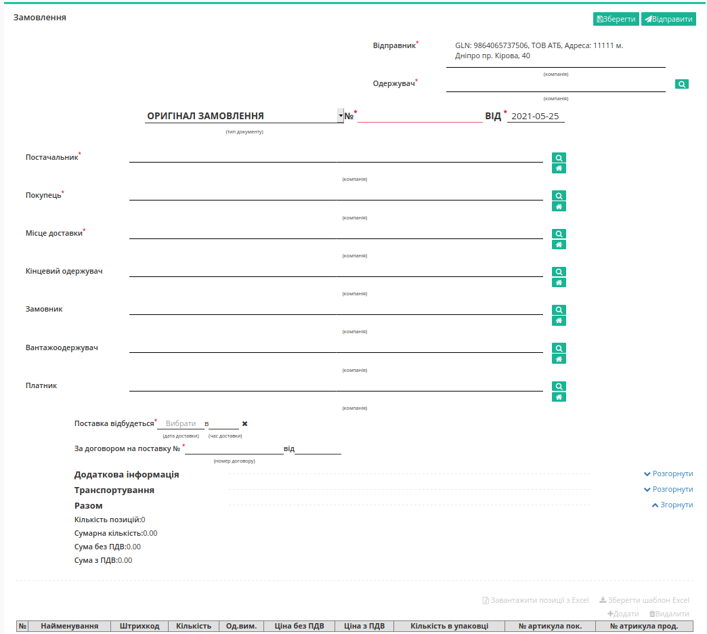
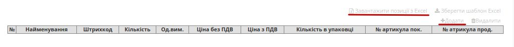
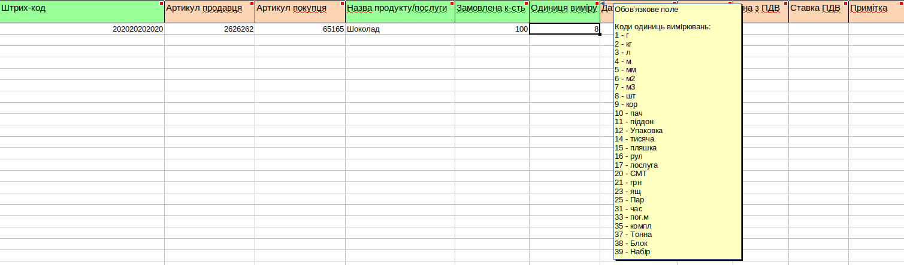
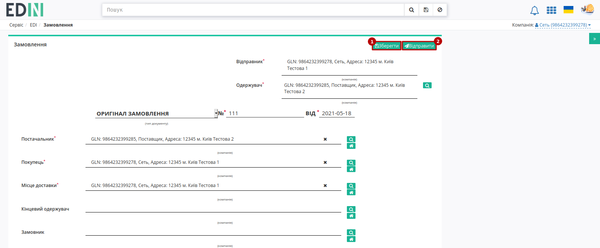

########################################################################################################################
Документообіг з мережею "АТБ" на платформі EDI Network 2.0. Інструкція для мережі АТБ
########################################################################################################################

.. сюда закину немного картинок для текста

.. |лупа| image:: pics_ATB_external_EDI_instruction/ATB_external_EDI_instruction_003.png

.. |будинок| image:: pics_ATB_external_EDI_instruction/ATB_external_EDI_instruction_004.png

.. |плюс| image:: pics_ATB_external_EDI_instruction/ATB_external_EDI_instruction_029.png

.. |info| image:: pics_ATB_external_EDI_instruction/ATB_external_EDI_instruction_064.png

.. role:: red

.. contents:: Зміст:
   :depth: 5

---------

Вступ
====================================

Дана інструкція описує порядок документообігу з мережею "АТБ" на платформі EDI Network 2.0. В документообігу приймають участь наступні документи:

- `Замовлення (ORDER) <https://wiki.edin.ua/uk/latest/XML/XML-structure.html#order>`__
- `Повідомлення про відвантаження (DESADV) <https://wiki.edin.ua/uk/latest/RetailersLists/ATB/ATB_XML-structure.html#desadv>`__
- `Видаткова накладна (COMDOC_006) <https://wiki.edin.ua/uk/latest/RetailersLists/ATB/ATB_XML-structure.html#comdoc-006>`__
- `Акт про виявлені недоліки (COMDOC_005) <https://wiki.edin.ua/uk/latest/RetailersLists/ATB/ATB_XML-structure.html#comdoc-005>`__
- `Акт приймання товару (складська логістика) (COMDOC_032) <https://wiki.edin.ua/uk/latest/RetailersLists/ATB/ATB_XML-structure.html#comdoc-032>`__
- `Акт приймання товару (COMDOC_033) <https://wiki.edin.ua/uk/latest/RetailersLists/ATB/ATB_XML-structure.html#comdoc-033>`__
- `Акт розбіжностей до АПП (COMDOC_034) <https://wiki.edin.ua/uk/latest/RetailersLists/ATB/ATB_XML-structure.html#comdoc-034>`__

1 Формування "Замовлення" (ORDER) на стороні мережі "АТБ"
==================================================================

Для формування "Замовлення" (ORDER) користувачу мережі "АТБ" в меню сервісу потрібно натиснути кнопку **"Створити"** та обрати документ "Замовлення" (для зручності можливо скористатись пошуком за назвою документа):

.. image:: pics_ATB_external_EDI_instruction/ATB_external_EDI_instruction_001.png
   :align: center

У відкритій формі документа всі обов'язкові до заповнення поля позначені червоною зірочкою :red:`*`.

#. **Відправник** - дані відправника документу (мережі) - заповнюються автоматично; не підлягають редагуванню;
#. **Одержувач** - дані одержувача (постачальника), для зручного пошуку контрагента натисніть на кнопку з іконкою лупи |лупа| ;
#. **Тип документа** - поле для вибору типу: *Оригінал замовлення*, *Заміна*, *Видалення*, *Фіктивність замовлення*, *Передзамовлення*, *Замовлення на послугу/маркетинг*;
#. **№** - номер замовлення;
#. **від** - дата підтвердження, за замовчуванням вказана поточна дата;
#. **Постачальник** - заповнюється за допомогою кнопки "Пошук контрагента" (|лупа|), або за допомогою кнопки "Вказати себе" (|будинок|);
#. **Покупець** - заповнюється за допомогою кнопки "Пошук контрагента" (|лупа|), або за допомогою кнопки "Вказати себе" (|будинок|);
#. **Місце доставки** - заповнюється за допомогою кнопки "Пошук контрагента" (|лупа|), або за допомогою кнопки "Вказати себе" (|будинок|);
#. **Поставка відбудеться** - дата та час доставки;
#. **За договором на поставку №** - номер договору на поставку.

.. hint::
   За допомогою кнопки **"Пошук контрагента"** (|лупа|) або ж за допомогою кнопки **"Вказати себе"** (|будинок|) можливо вказати чи змінити дані Покупця або Постачальника. Для пошуку введіть назву компанії, GLN або ІПН:

   .. image:: pics_ATB_external_EDI_instruction/ATB_external_EDI_instruction_005.png
      :align: center

.. вирішили прибрати, але для інших інструкцій ок - Блоки **Додаткова інформація** та **Транспортування** необов'язкові для заповнення і "згорнуті" за замовчуванням. Блок **Разом** розраховується автоматично після заповнення позицій.

   .. image:: pics_ATB_external_EDI_instruction/ATB_external_EDI_instruction_006.png
      :align: center

В табличній частині відображається основна інформація по замовлених **товарних позиціях**. Позиції можна заповнити вручну (кнопка **"+Додати"**) або **"Завантажити позиції з Excel"** файлу.

При ручному введенні через форму через кнопку **"+Додати"** товарні позиції заповнюються з товарного довідника (обов'язкові до заповнення поля позначені червоною зірочкою :red:`*`):

.. image:: pics_ATB_external_EDI_instruction/ATB_external_EDI_instruction_008.png
   :align: center

Завантажити позиції списком можливо за допомогою .XLS файлу Excel. Для коректного заповнення таблиці можливо скористатись шаблоном (кнопка **"Зберегти шаблон Excel"** для скачування шаблону у форматі .xls). Відкрийте та заповніть файл Excel. Колонки виділенні зеленим кольором - **обов'язкові для заповнення**! Деякі стовпці мають підказки до заповнення - наведіть курсор у верхній куток назви стовпця для відображення підказки: 

Для завантаження заповненого файлу на платформу натисніть на кнопку **"Завантажити позиції з Excel"** та виберіть у новому вікні збережений файл.

При необхідності змінити чи доповнити дані по позиціям, змініть данні у файлі .XLS та завантажке на платформу повторно. Позиції оновляться відповідно до файлу.

.. important:: У разі неправильного заповнення .XLS файлу Excel, при завантаженні з'явиться повідомлення про помилку з указанням рядка, який необхідно відкоригувати. При додаванні позиції, яка вже була додана, також зявиться попередження з указанням штрихкоду позиції.

Після внесення всіх даних потрібно **"Зберегти"** (1) документ, після чого його можливо **"Відправити"** (2):

Після збереження документ потрапляє в папку **"Чернетки"**:

.. image:: pics_ATB_external_EDI_instruction/ATB_external_EDI_instruction_011.png
   :align: center

Відправлений документ автоматично потрапляє в папку **"Надіслані"**:

.. image:: pics_ATB_external_EDI_instruction/ATB_external_EDI_instruction_012.png
   :align: center

На формі відправленого "Замовлення" Ви можете замінити дане "Замовлення" *Новим*, можливо залишити комментар, який відобразиться контрагенту в формі "Замовленням", завантажити чи роздрукувати "Замовлення":

.. image:: pics_ATB_external_EDI_instruction/ATB_external_EDI_instruction_013.png
   :align: center

