##################################################################################################################################################################################
Формування та відправка "Цінової накладної" мережі Фоззі за схемою "Match Invoice". Інструкція для Постачальника.
##################################################################################################################################################################################

.. сюда закину немного картинок для текста

.. role:: red

.. contents:: Зміст:
   :depth: 2

---------

"Цінова накладна" (DOCUMENTINVOICE.DocumentFunctionCode = PRN) є юридично значущим документом (ЮЗД) і може використовуватись при роботі з мережею Фоззі в схемі документообігу "Match Invoice".

Загальна схема документообігу:

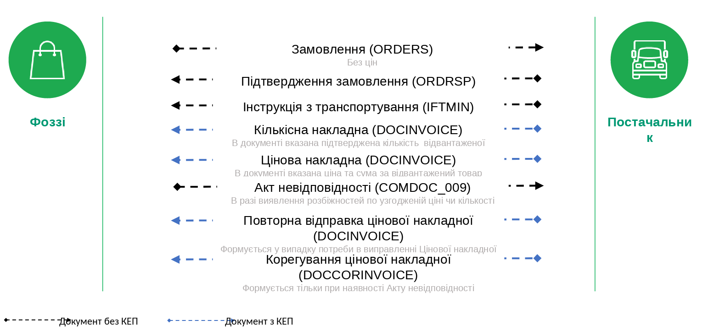

"Цінова накладна" може бути створена Постачальником:

* на підставі вхідного "Замовлення" (ORDER);

.. image:: pictures/Fozzy_DOCUMENTINVOICE_PRN_instruction_001.png
   :align: center

* на підставі відправленої "Накладно ї за кількістю" (DOCUMENTINVOICE.DocumentFunctionCode = TN).

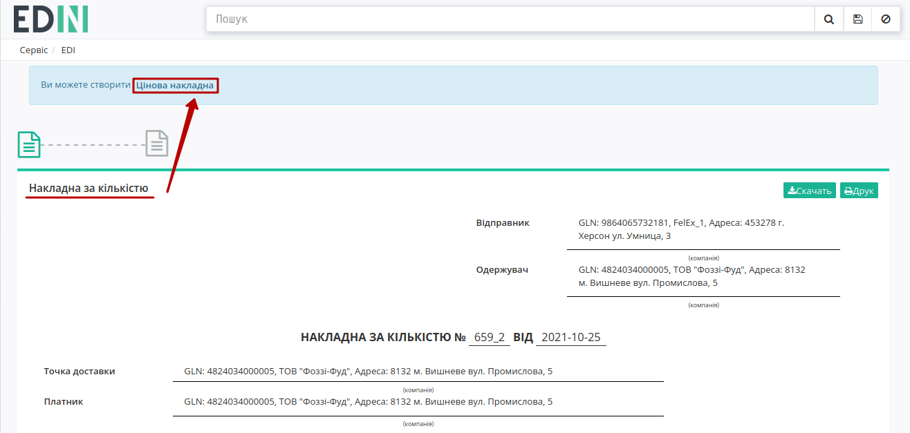

При цьому: якщо в ланцюжку документів вже відправлена "Накладна за кількістю", то "Цінову накладну" можливо створити лише на підставі "Накладної за кількістю".

.. `XML Специфікації для роботи з Фоззі (за схемою «Match Invoice») <https://wiki.edin.ua/uk/latest/XML/Fozzy_XML-structure.html>`__

.. note::
   Формування "Цінової накладної" на підставі вхідного "Замовлення" (ORDER) чи відправленої "Накладної за кількістю" не має жодних відмінностей, якщо не враховувати вибір документа-підстави.

1 Формування "Цінової накладної" на підставі вхідного "Замовлення" (ORDER)
====================================================================================================================================

Для формування "Цінової накладної" (DOCUMENTINVOICE.DocumentFunctionCode = PRN) на підставі "Замовлення" (ORDER) потрібно перейти в розділ "Вхідні" та обрати потрібний документ. Для зручності можливо скористатись пошуком (за типом документа (приклад в зображенні), номером документа чи GLN):

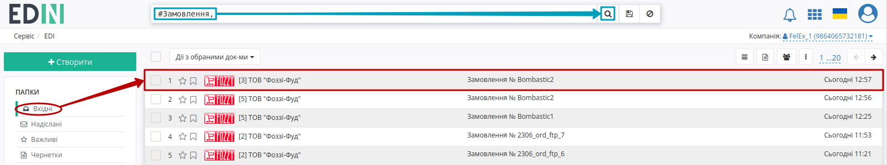

У відкритому документі на формі-підказці виберіть зі списку **"Цінова накладна"**:

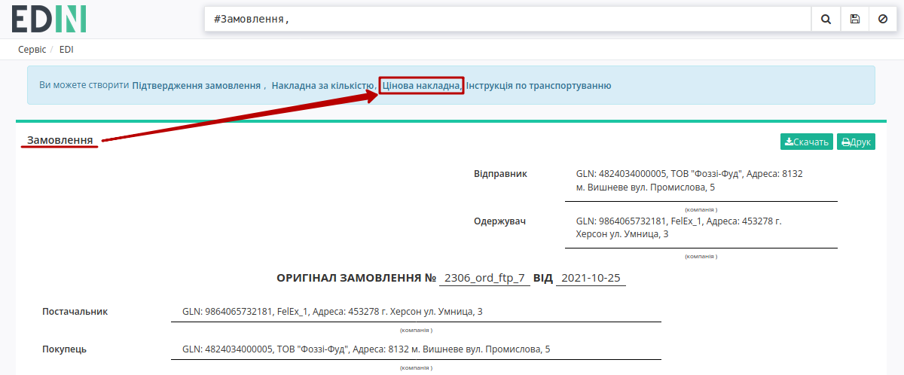

Після чого на підставі "Замовлення" (ORDER) автоматично створюється "Цінова накладна" (DOCUMENTINVOICE.DocumentFunctionCode = PRN). На формі створюваного документа значення більшості полів заповняться (пененесутся) з документа-підстави. Всі поля, позначені червоною зірочкою :red:`*` - **обов'язкові до заповнення**:

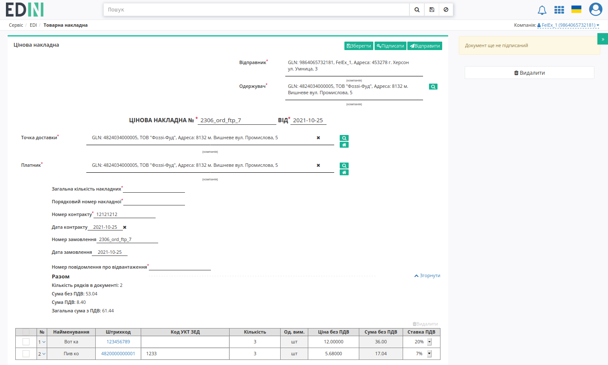

В табличній частині створеного документа знаходяться всі товарні позиції (перенесені з документа-підстави "Замовлення" (ORDER)). Детальну інформацію по позиції можливо переглянути натиснувши на кнопку біля номера позиції:

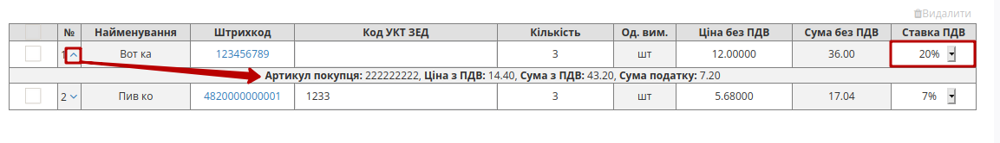

"Ставку ПДВ" можливо замінити при перегляді таблиці, а інші дані позицій можливо відредагувати та **"Змінити"** через pop-up вікно, що відкривається по кліку на штрихкод товару:

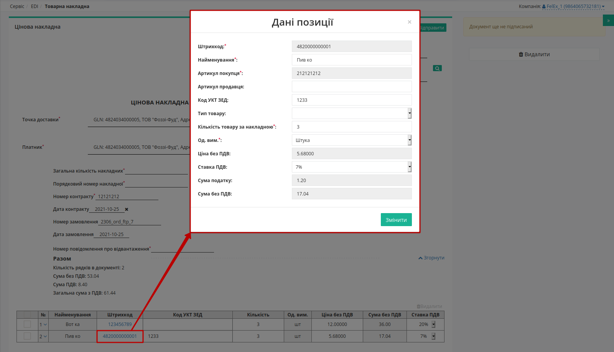

Також можливо **"Видалити"** товарні позиції з табличної частини документа:

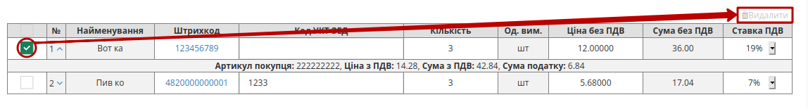

До табличної частини "Цінової накладної" (DOCUMENTINVOICE.DocumentFunctionCode = PRN) можливо додавати лише ті позиції, що були вказані в "Замовленні" (вибрати зі списку). Якщо всі позиції співпадають з позиціями в "Замовленні" (ORDER), то в табличній частині кнопка **"+Додати"** не відображається:

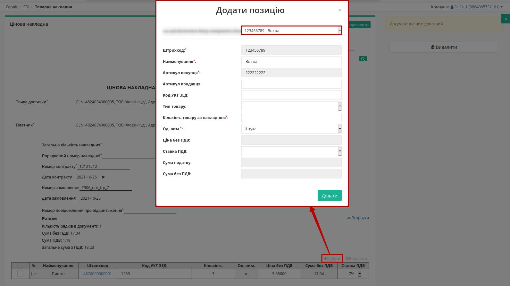

Після внесення всіх необхідних змін в документ потрібно натиснути кнопку **"Зберегти"** (1), після чого можливо **"Підписати"** (2):

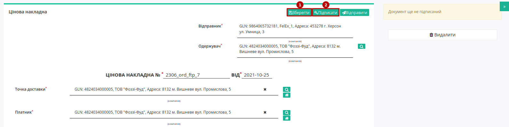

.. _sign:

1.1 Підписання та відправка "Цінової накладної"
--------------------------------------------------------------------------------------------------

.. include:: /_constant/signing/signing.rst
   :start-after: .. початок блоку для Signing
   :end-before: .. кінець блоку для Signing

Після підписання "Цінової накладної" (DOCUMENTINVOICE.DocumentFunctionCode = PRN) документ потрібно **"Відправити"**:

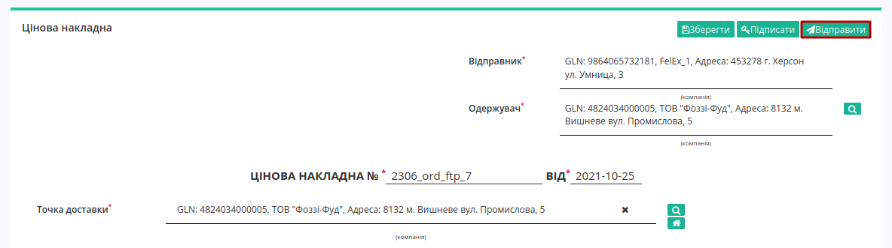

Відправлений документ автоматично потрапляє в папку **"Надіслані"** і буде знаходитись в ланцюжку документів разом із пов'язаними документами. Мережа Фоззі зі своєї сторони переглядає та підписує документ.

2 Обробка вхідного документа "Акт невідповідності" (COMDOC_009)
====================================================================================================================================

У випадку розходження між відправленною і фактично прийнятою кількістю товару чи виникненням цінової розбіжності – мережа надсилає Вам "Акт невідповідності" (COMDOC_009):

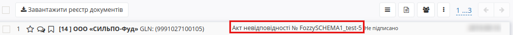

У вхідному документі будуть зазначені кількісні чи цінові розбіжності по кожному товару та причина невідповідності.

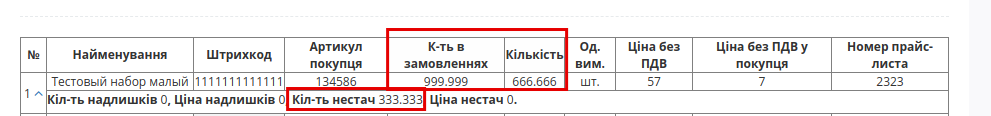

Після ознайомлення з документом необхідно відправити "Коригування до товарної накладної" (DOCCORINVOICE) з правками кількості/ціни згідно розбіжностей вказаних в "Акті невідповідності" (COMDOC 009) мережі Фоззі.

------------------------------------------------

.. include:: /_constant/kontakti.rst
