Робота з сервісом EDIN-Tender 2.0
#############################################################

.. role:: red

.. role:: underline

.. сюда закину немного картинок для текста

.. |хрестик| image:: pics_Work_with_Tender/Work_with_Tender_07.png

.. |звезда| image:: pics_Work_with_Tender/Work_with_Tender_22.png

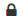

.. |звезда2| image:: pics_Work_with_Tender/Work_with_Tender_24.png

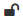

.. |рупор| image:: pics_Work_with_Tender/Work_with_Tender_26.png

.. |судья| image:: pics_Work_with_Tender/Work_with_Tender_27.png

.. |magic| image:: pics_Work_with_Tender/Work_with_Tender_28.png

.. |редагувати| image:: pics_Work_with_Tender/Work_with_Tender_29.png

.. |видалити| image:: pics_Work_with_Tender/Work_with_Tender_30.png

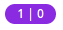

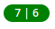

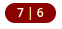

.. contents:: Зміст:
   :depth: 6

---------

**Вхід**
================================================

Для роботи з WEB сервісом Ви можете використовувати будь-який браузер (рекомендованим є **Google Chrome** останньої версії). Для входу до сервісу платформи необхідно перейти за посиланням ВЖЕ ВІДОМА ПРОД АДРЕСА?????? https://dev-tender.edi-n.com .

При переході за вказаним посиланням відкриється вікно авторизації. Необхідно ввести Ваш логін і пароль користувача і натиснути «**Вхід**», як це зазначено на зображенні нижче:

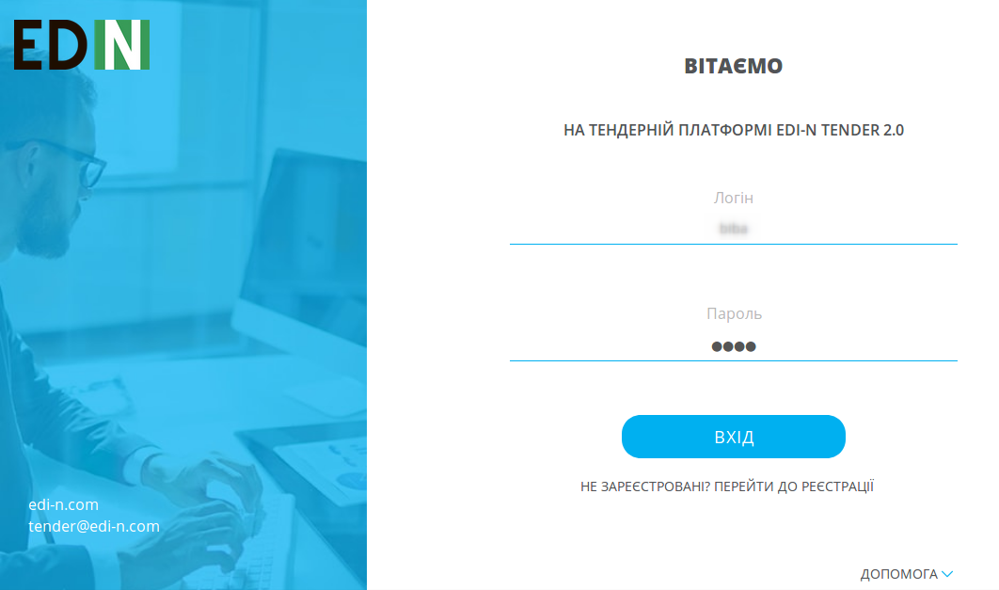

**Загальний вигляд платформи**
================================================

Після успішної авторизації відкриється основне вікно сервісу **EDIN Tender**. 

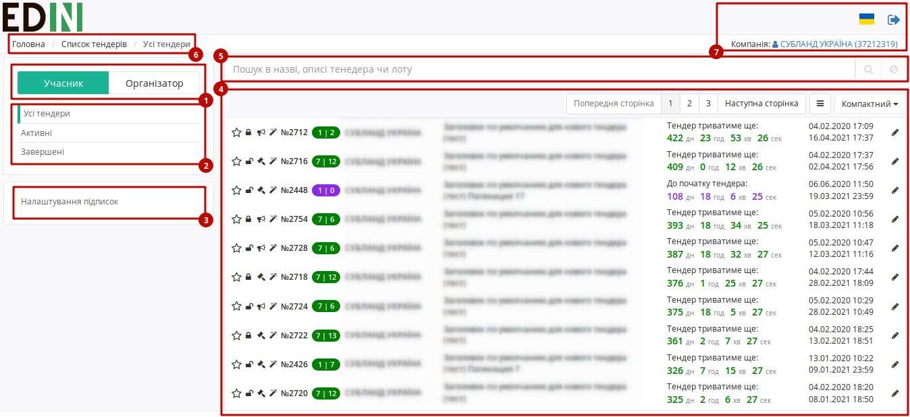

Основне вікно сервісу **EDIN Tender**:

#. Меню ролей - дозволяє вибрати роль, відносно якої будуть виконуватись дії користувача
#. Меню вибору тендерів - дозволяє вибрати тендери, що будуть відображатись в журналі ("Усі", "Активні", "Завершені" та :underline:`"Чернетки" для ролі "Організатор"`) 
    * "Усі тендери" - всі тендери, які проводяться або проводилися на платформі;
    * "Активні" - список поточних або майбутніх тендерів;
    * "Чернетки" - список створених Вами тендерів, які ще не були опубліковані;
    * "Завершені" - список створених Вами завершених тендерів;
#. Налаштування підписок
#. Журнал тендерів та налаштування їх відображення
#. Рядок пошуку тенедра/лоту по назві чи опису
#. Навігація на платформі
#. Дані про компанію, вибір мови, вихід з платформи

**Журнал тендерів**
----------------------------------

В журналі доступний пошук по заголовкам і описами, як тендерів так і лотів, можливість вибору формату відображення - "Компактний", "Докладний" (включає відображення статусу тендера і його короткий опис) і "З лотами" (включає відображення лотів всіх тендерів).

В лівій частині по кожному тендеру символами відображаються:

* |звезда| / |звезда2| - регульована відмітка користувача, "важливий"/"звичайний" тендер
* |відкрито| / |закрито| - тип тендера, Відкритий / Закритий
* |рупор| / |судья| - етап, Торги / Збір пропозицій
* |magic| - відмітка про те, що увімкнена функція автопродовження
* Кольорами відображається статус тендера, а цифрами "кількість лотів"/"загальна кількість ставок" 
    * |фіолетовий| - тендер, у якого 1 лот ще не розпочався
    * |зелений| - тендер з 7 лотами триває (розпочався), по лоту/-ам якого вже зроблено 6 ставок
    * |червоний| - тендер з 7 лотами вже завершився, по лоту/-ам якого було зроблено 6 ставок

Також для Організатора по кожному тендеру в правій частині журналу доступні кнопки |редагувати| |видалити| для редагування та видалення тендера. 

**Інше**
----------------------------------

На платформі існує можливість зміни мови інтерфейсу. Для вибору мови Вам необхідно натиснути на знак прапора, у верхній правій частині сторінки. Доступні мови: українська, російська, англійська.

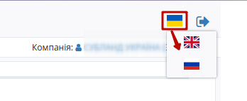

**Робота з тендерами**
================================================

.. important::
    Сервіс **EDIN Tender** дозволяє користувачу вести роботу з тендерами в якості "Учасника" та "Організатора". Ці ролі суттєво відрізнються, логіка формування та налаштування тендера від імені "Організатора" описана в розділі "Створення тендера", а робота з тендером в якості "Учасника" - в розділі "Участь в тендері". 

**Створення тендера**
------------------------------------------------

Для створення тендера Вам необхідно:

* Натиснути на кнопку **"Організатор"**, вибравши відповідну роль на платформі
* Натиснути на кнопку **"Додати тендер"**

.. image:: pics_Work_with_Tender/Work_with_Tender_03.png
   :align: center

Після цього відкриється форма створення тендера:

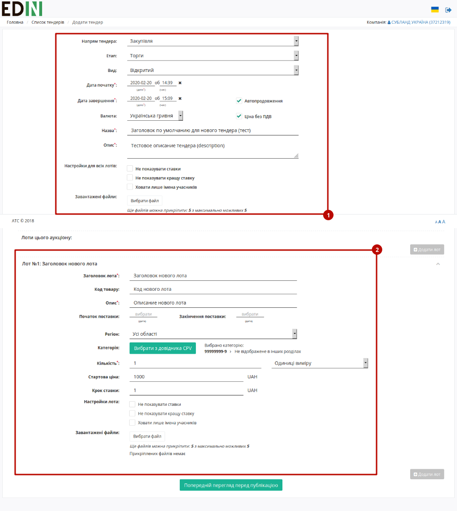

Форма створення тендера складається з "загальних налаштувань тендера" (1) та "налаштувань лотів тендера" (2). 

В налаштуваннях тендера Вам доступні наступні параметри (поля позначені червоною зірочкою :red:`* - обов'язкові до заповнення`):

* **Напрям тендера:** "Закупівля" чи "Продаж"; 
* **Етап:** "Торги" чи "Збір пропозицій"; 
* **Вид:** "Відкритий" чи "Закритий"; 
    * "Відкритий" тендер дозволяє всім користувачам сервісу переглядати информацію про тендер та його лоти; зробити ставку в "відкритому" тендері може будь-який користувач системи.
    * "Закритий" тендер НЕ відображається користувачам сервісу до початку тендера, а після його початку не запрошені користувачі можуть лише переглядати інформацію тендера. Приймати участь в тендері можливо по запрошенню Організатора або через "Подачу заявки" (детальніше в `розділі "закритого" тендера <https://wiki.edi-n.com/uk/latest/Tender_2_0/Work_with_Tender.html#closed_tender>`__ ).
* **Дату та час початку/завершення** аукціону. Час і дата початку аукціону повинні бути налаштовані не менш ніж **+1 година** від часу заповнення поля. Час і дата завершення повинні бути налаштовані не менш ніж **+30 хвилин** від часу і дати початку аукціону;
* **Автопродовження** - відмітка, що активує функцію, котра спрацьовує в випадку коли один із участників робить ставку в останні 5 хвилин аукціону (до його завершення). Тендер автоматично продовжується на 5 хвилин;
* **Валюта:** вибір валюти зі списку;
* **Ціна без ПДВ** - відмітка, про те що ціни лотів будуть вказані без ПДВ;
* **Назва:** короткий опис, інформація про тендер. Наприклад: Збір пропозицій, вівсяні пластівці;
* **Опис:** повний опис тендера - інформація, що дасть учасникам максимально повне уявлення про майбутній тендер;
* **Налаштування для всіх лотів:** 
    * **Не показувати ставки** - активована функція приховує список всіх ставок для учасників;
    * **Не показувати кращу ставку** - активована функція приховує тільки кращу ставку;
    * **Ховати лише імена учасників** - за активованої функції імена участників будуть відображатись в вигляді номера, котрий буде змінюватись з кожною ставкою. При цьому кращаставка та список будуть доступні для перегляду

.. important:: 
    Кожне налаштування виконує тільки одну дію! Всі налаштування можливо комбінувати між собою. Якщо Ви не визначили налаштування видимості, то інформація буде доступна всім користувачам EDIN-Tender. При створенні декількох лотів в одному аукціоні, є можливість використовувати налаштування, як для кожного лота індивідуально, так і для всіх відразу.

* **Завантажені файли:** доступна можливість прикріплення файлів до опису тендера (не більше 5 файлів в одному тендері з обмеженням розміру файлу до 5 МБ) 

Після налаштувань загальних параметрів тендера необхідно виконати налаштування лотів.

.. image:: pics_Work_with_Tender/Work_with_Tender_05.png
   :align: center

* Кнопка **"Додати лот"** створює додатковий лот (в одному аукціоні може бути до 10 лотів);
* **Заголовок лота:** поле для опису назви товару;
* **Код товару:** необов'язкове поле, що використовується для введення артикулу або коду товару згідно з Вашою обліковою системою;
* **Опис:** поле для більш детального опису товару;
* **Початок / Закінчення поставки:** не є обов'язковими для заповнення, однак не повинні бути встановлені на дату раніше, ніж дата завершення аукціону;
* **Регіон:** перелік регіонів України (за замовчуванням встановлено значення "Всі області");
* **Категорія:** до якої категорії відноситься лот (не є обов'язковими для заповнення). При натисканні на кнопку **"Вибрати з довідника CPV"**, відкривається єдиний державний довідник товарних категорій, з'являється можливість вибрати категорію, до якої відноситься Ваш лот:

.. image:: pics_Work_with_Tender/Work_with_Tender_06.png
   :align: center

Можливо скористатись ієрархічним переходом до потрібної категорії чи пошуком: ввести назву категорії (1), натиснути **"Знайти"** (2), вибрати необхідну категорію (3) та натиснути на кнопку **"Зберегти та вийти"** (4);

.. attention::
    Для того, щоб скинути пошук в категорії необхідно натиснути |хрестик| біля кнопки **"Знайти"**

* **Кількість та одиниці виміру:** кількість товару, який вказаний в лоті та одиницю його виміру зі списку;
* **Стартова ціна:** початкова вартість за одиницю товару, яку Ви встановлюєте, як організатор. При формуванні стартової ціни необхідно враховувати, що перша ставка в торгах на зниження - це стартова ціна з відрахуванням кроку ставки. Тобто постачальник не може запропонувати ставку в розмірі стартової ціни.
* **Крок ставки:** мінімальна сума для зниження/підвищення ціни. Крок ставки вказується тільки при наявності стартової ціни.
* **Налаштування лота:** в разі якщо Ви не налаштували відповідні налаштування в загальних налаштуваннях тендера, у Вас є можливість **приховувати всі ставки, приховувати кращу ставку і приховувати імена учасників** для конкретного лота.  
* **Завантажені файли:** доступна можливість прикріплення файлів до опису лота (не більше 5 файлів в одному лоті з обмеженням розміру файлу до 5 МБ) 

Після установки всіх необхідних налаштувань, натисніть на кнопку **"Попередній перегляд перед публікацією"**, для збереження Вашого тендера в **"Чернетки"**.

.. image:: pics_Work_with_Tender/Work_with_Tender_08.png
   :align: center

.. note::
    В разі, якщо при налаштуваннях тендера/лота були допущені явні помилки або незаповнені обов'язкові поля, то платформа повідомить про це:   

.. image:: pics_Work_with_Tender/Work_with_Tender_09.png
   :align: center

У каталозі **"Черновик"**, у вас є можливість **Редагувати** всі дані і налаштування Вашого тендера, після чого Ви можете **Опублікувати** тендер.

.. note::
    **Завершити** достроково можливо лише активний (опублікований) тендер.

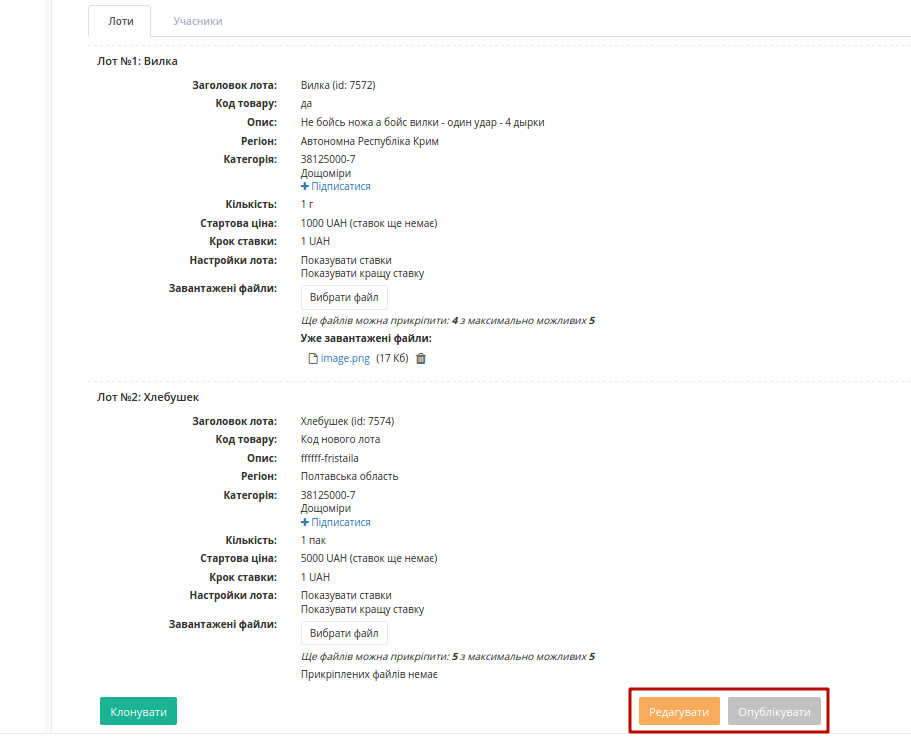

.. attention::
    Після публікації тендера, у Вас не буде можливості редагувати його дані і налаштування.

В каталозі **"Чернетки"** або **"Завершені"** у Вас є можливість при натисканні на кнопку **"Клонувати"**, копіювати інформацію та налаштування обраного тендера для його подальшого редагування і подальшої публікації.

.. image:: pics_Work_with_Tender/Work_with_Tender_11.png
   :align: center

Після натискання на кнопку **"Опублікувати"**, Ваш тендер автоматично стає **"Активним"** а також з'являється в загальному списку **"Усі тендери"**.

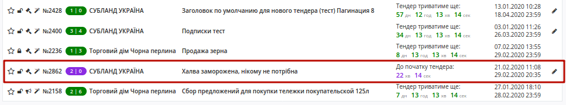

.. attention::
    Якщо в налаштуваннях тендера було обрано "Закритий" **Вид**, то бажаних учасників тендера можливо запросити: 

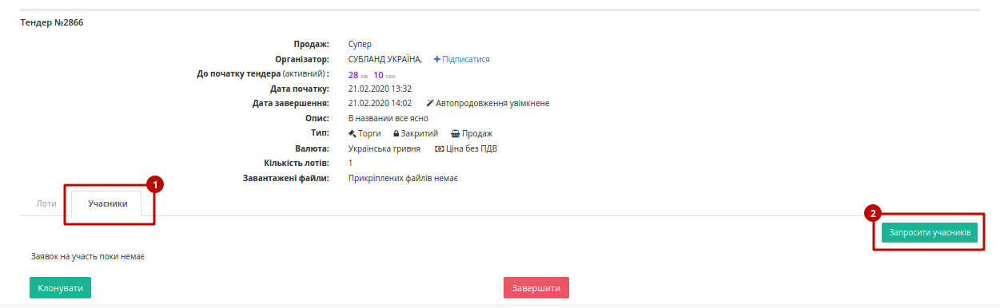

.. image:: pics_Work_with_Tender/Work_with_Tender_16.png
   :align: center

Запрошений "Учасник" може переглянути нформацію по тендеру і його лотам, а у Організатора в цьому тендері відобразиться список запрошених учасників:

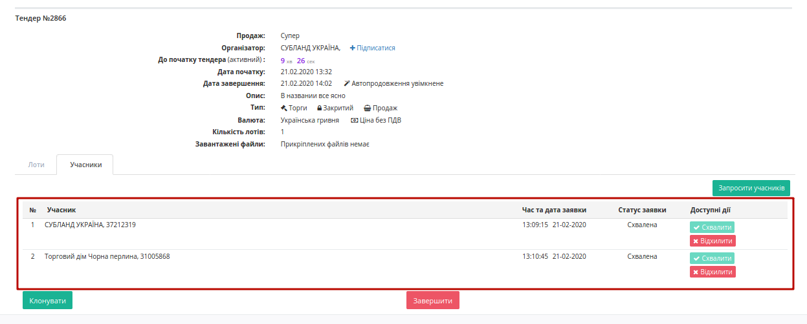

.. attention::
    Кнопки **Схвалити/Відхилити** Учасника доступні Організатору лише до початку тендера.   

**Участь в тендері**
-------------------------------------

Тендер (в залежності від налаштувань Організатора) може бути "відкритим" або "закритим".

**Участь у "відкритому" тендері**
---------------------------------------

Для того аби прийняти участь у "відкритому" тендері Вам необхідно:

* Натиснути на кнопку **"Учасник"**, вибравши відповідну роль на платформі
* Перейти в каталог **"Усі тендери"**

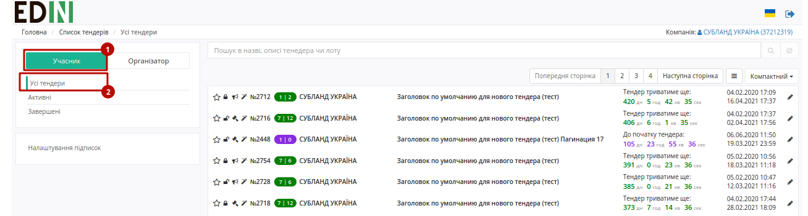

* Вибрати і натиснути на тендер в журналі, що Вас цікавить
* У відкритому тендері зробити ставку по лоту (на кожен лот окрема ставка)

.. hint::
    Зробити ставку можна тільки на лот активного аукціону, який розпочався 

.. image:: pics_Work_with_Tender/Work_with_Tender_14.png
   :align: center

.. container:: closed_tender

**Участь у "закритому" тендері**
---------------------------------------

В даних тендерах беруть участь тільки ті учасники, участь яких була раніше підтверджена Організатором. Для цього необхідно подати заявку на участь або бути запрошеним організатором (в останньому випадку Учасник отримує повідомлення на e-mail про те, що він запрошений до участі в закритому тендері).

Для того, щоб подати заявку, необхідно зайти в Вас тендер, і натиснути на кнопку "Подати заявку".

.. image:: pics_Work_with_Tender/Work_with_Tender_18.png
   :align: center

Після натискання на кнопку "Подати заявку", на екрані з'явиться повідомлення про те, що Ваша заявка була успішно відправлена Організатору, кнопка "Подати заявку" після цього перестає бути активною ("Заявка уже подана"). У Організатора в тендері, на який була подана заявка у вкладці Учасників відображається кількість запитів, що очікують відповіді.

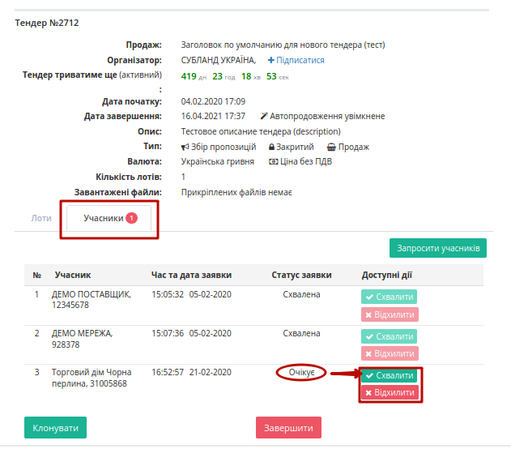

Коли Організатор ухвалить рішення за Вашою заявою, ви отримаєте повідомлення на e-mail, по цьому тендеру відобразиться інформація по лотам, з'явиться можливість зробити ставку.

.. note::
    Якщо Організатор відхилить заявку повторно відправити її не буде можливо 

.. include:: kontakti.rst
