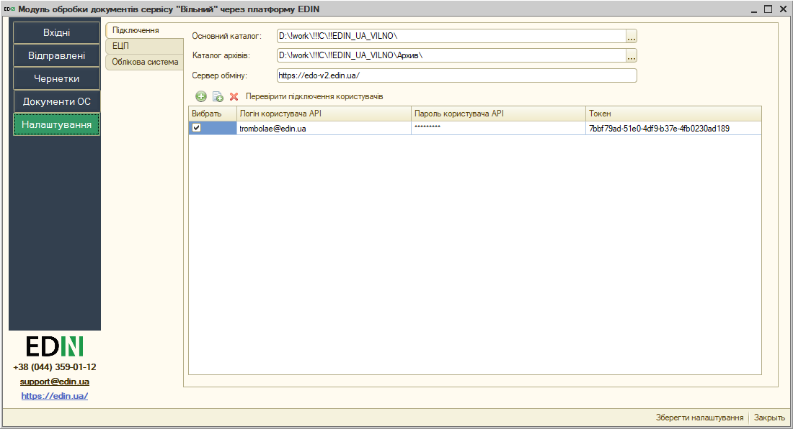
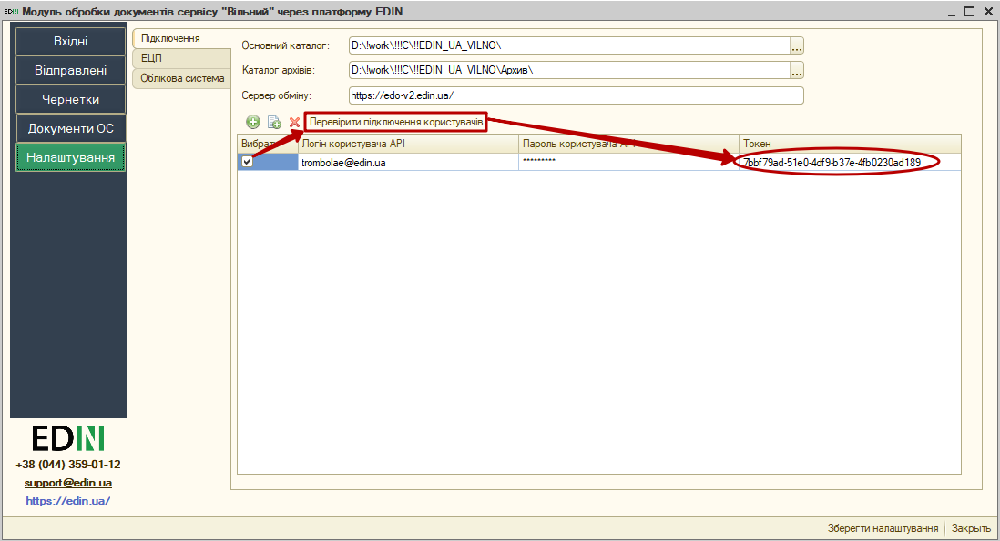
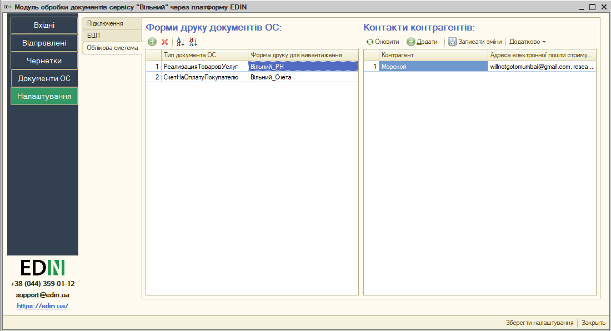
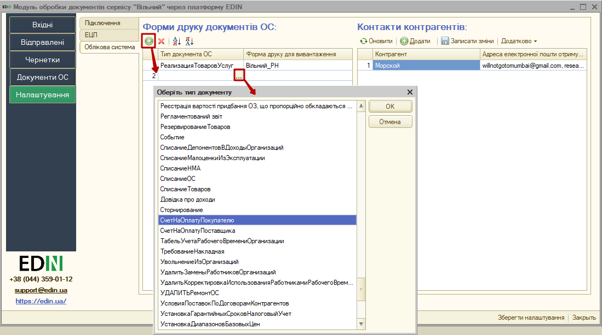
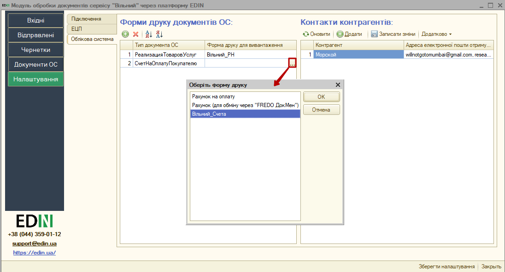
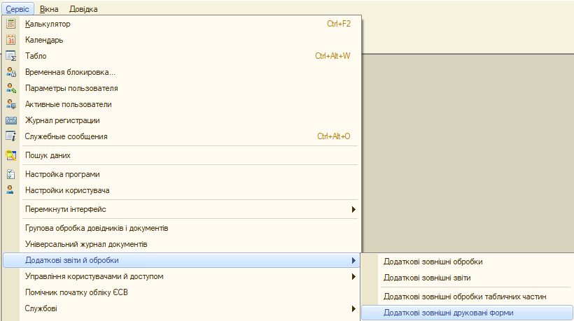
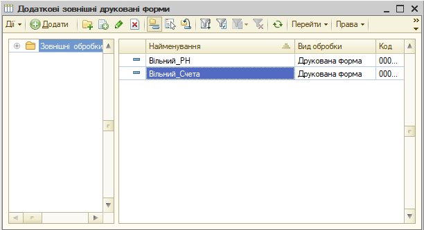
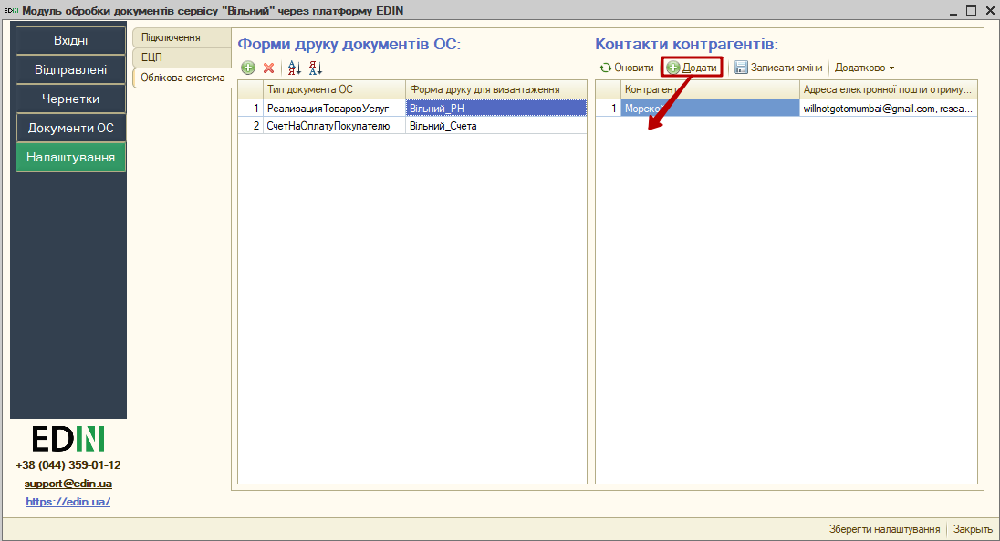

###############################################################################################################
Короткий посібник з інтеграції сервісу EDIN "Вільний" з обліковими системи 1C | BAS
###############################################################################################################

.. role:: underline

.. role:: red

.. contents:: Зміст:
   :depth: 6

---------

Скорочення:

ОС - облікова система

ЕЦП - електронно-цифровий підпис/печатка

НКІ - носій конфіденційної інформації

---------

*********************************************************
**1 Перший запуск і налаштування модуля**
*********************************************************

Розроблений компанією EDIN інтеграційний модуль сервісу EDIN "Вільний" (в подальшому просто модуль) на базі операційної системи Windows дозволяє працювати з обліковими системами 1С | BAS на стандартних конфігураціях:

* Управління торговим підприємством для України;
* Управління виробничим підприємством для України;
* Бухгатерія для України.

Для роботи з модулем у користувача повинна бути підключена послуга для роботи з API. Для роботи з модулем користувачеві надаються логін та пароль:

- email - логін користувача;
- password - пароль користувача на платформі EDIN 2.0

Для запуску модуля необхідно в обліковій системі 1С | BAS відкрити файл запуску модуля (передається користувачеві співробітниками EDIN):

.. image:: pics_integration_Vilnyi_guide/integration_Vilnyi_guide_01.png
   :align: center

.. important:: У користувача повинні бути повні права на каталог, в якому знаходиться файл модуля

При першому запуску (відсутній **config.txt**) автоматично відкривається розділ **"Налаштування"** для введення всіх необхідних даних (надалі при запуску буде відкриватись розділ **"Вхідні"**). 

.. У каталозі, в якому розташований файл модуля, автоматично створюються файл основних налаштувань **Config.txt**.

*************************************
**2 Налаштування**
*************************************

При першому запуску інтеграційного модуля сервісу EDIN "Вільний" автоматично відкривається розділ **"Налаштування"**:

Розділ містить 3 вкладки:

- **Підключення**
- **ЕЦП**
- **Облікова система**

**2.1 Підключення**
================================================================

**Основний каталог** - шлях до місця розташування файлу модуля.

**Каталог архівів** - шлях до місця розташування, виділеного під архіви, що можуть бути сформовані користувачем під час роботи з модулем.

**Сервер обміну** - адреса платформи електронного документообігу (на цю адресу надсилаються запити модуля).

За допомогою зеленої круглої кнопки **"+"** потрібно додати користувача - при цьому вказуються **Логін користувача API (email)** та **Пароль користувача API** (Токен  сесії генерується при успішній авторизації автоматично).

.. У цій вкладці також здійснюється вибір користувачів, від імені яких будуть здійснюватися подальші дії, наприклад, запити на відображення Вхідних / Вихідних документів.  

.. note::
   Налаштування підключення зберігаються в файлі **config.txt**, який розміщується в основному каталозі модуля.

Після того, як дані користувача були введені можливо здійснити перевірку введених даних кнопкою **"Перевірити підключення користувачів"**, попередньо встановивши відмітку в колонці "Вибрати". В результаті перевірки отриманий **Токен** свідчить про коректно заповнені дані, пройдену авторизацію на платформі електронного документообігу. Також модуль відображає статусні повідомлення про успішність чи помилки, що можуть виникнути у користувача при роботі з модулем.

**Об'єкти ОС**
=====================================================================

Для подальшої роботи з електронним документообігом необхідно провести синхронізацію модуля і ОС.

.. image:: pics_integration_Vilnyi_guide/integration_Vilnyi_guide_05.png
   :align: center

Спочатку потрібно додати та обрати електронні документи сервісу EDIN "ETTN", якими буде здійснюватись в подальшому електронний документообіг (колонка "Документ"):

Далі потрібно для кожного електроного документу обрати документ облікової системи (на підставі цього документу можливо буде створювати електронний документообіг) - колонка "Документ ОС":

В колонках **ID ТТН** та **ID заявки на транспортування** вказуються налаштування місцерозташування **uuid платформи** цих двох основних документів сервісу (електронної "ТТН" та "Заявки на транспортування" відповідно). А в колонці "Сторона документообігу" обирається роль `учасника документообігу <https://wiki.edin.ua/uk/latest/ETTN_2_0/Work_with_ETTN.html#scenario>`__ , що дозволяє для кожної ролі вказувати різні налаштування для документів. 

В колонці "EDIN Налаштування документу" вказуються загальні налаштування документів (маппінг для формування електронного документу з даних документів ОС). Для того аби відкрити форму налаштувань потрібно натиснути на кнопку **"..."**:

Відкрита форма налаштувань відповідності даних документа містить специфікацію тіла обраного електронного документа а також його табличної частини:

Для кожного із представлених тегів (полей) специфікації документу можливо обрати реквізити для заповнення: для цього потрібно обрати потрібний тег та в колонці "Опис налаштування" натиснути на кнопку **"..."**:

Після чого відкриється форма налаштувань відповідності даних електронного документу, в якій можливо обрати реквізит документа ОС для заповнення обраного тега електронного документу (кнопка **"..."**):

На формі в обраному реквізиті (умовно "1") можливо обрати підлеглий до нього інший реквізит (умовно "1.1"). Цю операцію вибору підлеглого реквізиту, що відноситься до вже обраного можливо продовжити ("1.1"->"1.1.1"->"1.1.1.6"->"1.1.1.6.4"->"1.1.1.6.4.2" ...) за допомогою кнопки:

.. image:: pics_integration_Vilnyi_guide/integration_Vilnyi_guide_12.png
   :align: center

Після вибору реквізиту стане доступним для редагування "Спосіб пошуку значень":

.. image:: pics_integration_Vilnyi_guide/integration_Vilnyi_guide_13.png
   :align: center

"Спосіб пошуку значень"="По значенню" свідчить, що для заповнення тегу електронного документу буде обрано значення реквізиту документу ОС. І для даного значення реквізиту, що наведений на зображенні вище не доступні "Додаткові властивості ОС". "Спосіб пошуку значень"="Додаткові властивості ОС", які використовуються, коли потрібно обрати значення, що не зберігаються безпосередньо в об'єкті 1С | BAS:

.. image:: pics_integration_Vilnyi_guide/integration_Vilnyi_guide_14.png
   :align: center

Після чого можливо обрати назву додаткової відомості:

.. image:: pics_integration_Vilnyi_guide/integration_Vilnyi_guide_15.png
   :align: center

Для елементу довідника "Організація" доступно додатково обрати "Спосіб пошуку значень"="Регістр відомостей" / "Контактна інформація: Юридична адреса" / "Контактна інформація: Фактична адреса", які використовуються, коли потрібно обрати значення, що не зберігаються безпосередньо в об'єкті 1С | BAS, дані яких потрібно взяти, для прикладу, з підлеглого регістра відомостей:

.. image:: pics_integration_Vilnyi_guide/integration_Vilnyi_guide_16.png
   :align: center

.. image:: pics_integration_Vilnyi_guide/integration_Vilnyi_guide_17.png
   :align: center

.. image:: pics_integration_Vilnyi_guide/integration_Vilnyi_guide_18.png
   :align: center

Також для елементу довідника "Контрагент" доступно обрати "Спосіб пошуку значень"="По значенню" / "Додаткові властивості ОС" / "Контактна інформація: Юридична адреса" / "Контактна інформація: Фактична адреса":

.. image:: pics_integration_Vilnyi_guide/integration_Vilnyi_guide_19.png
   :align: center

В формі налаштувань відповідності даних документа в специфікації тіла обраного електронного документа окрім типових тегів містяться й нетипові (додаткові), які відрізняються тим, що дозволяють налаштувати, наприклад, математичні операції та їх використання для автоматичного заповнення тегів електронного документу:

.. image:: pics_integration_Vilnyi_guide/integration_Vilnyi_guide_20.png
   :align: center

Таблиця 1 - Опис нетипових тегів для документу ТТН

.. csv-table:: 
  :file: for_csv/TTN_not_type_tags.csv
  :widths:  1, 7, 12, 41
  :header-rows: 1
  :stub-columns: 0

**ЕЦП**
=====================

Розділ налаштувань електронно-цифрового підпису і печатки (ЕЦП), в якому зазначаються сертифікати ДФС (знаходяться у вільному доступі) і EDIN (надається співробітником компанії).

.. image:: pics_integration_Vilnyi_guide/integration_Vilnyi_guide_21.png
   :align: center

У таблицю через кнопку **"+"** можливо додати або шляхи до ключів підписанта, якими будуть підписуватись юридично значимі документи або вказати токен (НКІ). Якщо вказано шлях до файлу (ключа) і токену, то пріоритет надається файлу. Налаштування для токену ("Тип пристрою" та "Пристрій" (серійний номер часто вказується на фізичному носії)) можливо вибрати зі списку або скористатись автоматичним підбором налаштувань.

При вивантаженні юридично значимих документів паролі можна вносити або до таблиці, або обробка відобразить вікно для їх внесення перед початком підписання. Кнопка **"Перевірити ЕЦП"** дозволяє перевірити коректність введених даних ключів і паролів перед початком підписання. 

Модуль дозволяє зберігати будь-яку кількість наборів ключів, але на момент підписання по одній організації і типу документу необхідно вибрати (встановити прапорець в колонці "Вибрати") тільки одну пару ключів.

При виявленні помилки при перевірці модуль попросить повторно ввести пароль:

.. image:: pics_integration_Vilnyi_guide/integration_Vilnyi_guide_22.png
   :align: center

При кожній перевірці ключа у вікні повідомлень відображається опис результату виконаної перевірки.

********************
**Додатково**
********************

`Опис конфігураційного файлу Config.txt модуля для інтеграції з сервісом EDIN "ETTN" <https://wiki.edin.ua/uk/latest/поки_відсутній.html>`__ .

.. include:: kontakti.rst
