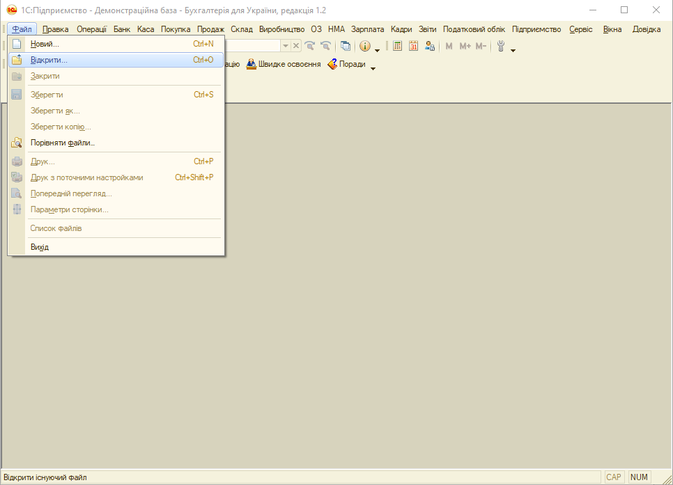
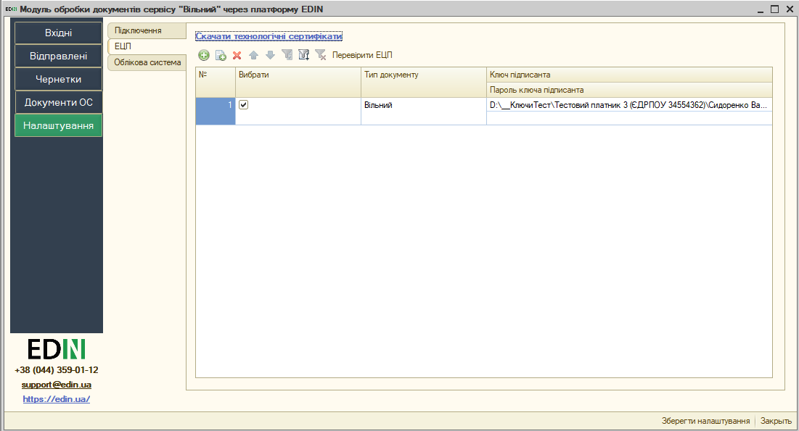

###############################################################################################################
Короткий посібник з інтеграції сервісу EDIN "Вільний" з обліковими системи 1C | BAS
###############################################################################################################

.. role:: underline

.. role:: red

.. contents:: Зміст:
   :depth: 4

---------

Скорочення:

ОС - облікова система

ЕЦП - електронно-цифровий підпис/печатка

API (application programming interface) - набір визначених методів для взаємодії прогамного модуля з платформою EDIN 

---------

*********************************************************
**1 Перший запуск і налаштування модуля**
*********************************************************

Розроблений компанією EDIN інтеграційний модуль сервісу EDIN "Вільний" (в подальшому просто модуль) дозволяє працювати з обліковими системами 1С | BAS: Підприємство 8.Х на звичайних формах, платформа 8.3.11 та вище (надалі 1С | BAS) на базі операційної системи Windows.

Для роботи з модулем у користувача повинна бути підключена послуга для роботи з API. Для роботи з модулем користувачеві надаються логін та пароль:

- email - логін користувача;
- password - пароль користувача на платформі EDIN 2.0

Для запуску модуля необхідно в обліковій системі 1С | BAS відкрити файл запуску модуля (передається користувачеві співробітниками EDIN):

.. important:: У користувача повинні бути повні права на каталог, в якому знаходиться файл модуля

При першому запуску (відсутній **config.txt**) автоматично відкривається розділ **"Налаштування"** для введення всіх необхідних даних (надалі при запуску буде відкриватись розділ **"Вхідні"**). 

.. У каталозі, в якому розташований файл модуля, автоматично створюються файл основних налаштувань **Config.txt**.

*************************************
**2 Налаштування**
*************************************

При першому запуску інтеграційного модуля сервісу EDIN "Вільний" автоматично відкривається розділ **"Налаштування"**:

Розділ містить 3 вкладки:

- **Підключення**
- **ЕЦП**
- **Облікова система**

**2.1 Підключення**
================================================================

**Основний каталог** - шлях до місця розташування файлу модуля та його конфігурації.

**Каталог архівів** - шлях до місця розташування, виділеного під архіви, що можуть бути сформовані користувачем під час роботи з модулем.

**Сервер обміну** - адреса платформи електронного документообігу (на цю адресу надсилаються запити модуля).

За допомогою зеленої круглої кнопки **"+"** потрібно додати користувача - при цьому вказуються **Логін користувача API (email)** та **Пароль користувача API** (Токен  сесії генерується при успішній авторизації автоматично).

.. У цій вкладці також здійснюється вибір користувачів, від імені яких будуть здійснюватися подальші дії, наприклад, запити на відображення Вхідних / Вихідних документів.

.. note::
   Налаштування підключення зберігаються в файлі **config.txt**, який розміщується в основному каталозі модуля.

Після того, як дані користувача були введені можливо здійснити перевірку введених даних кнопкою **"Перевірити підключення користувачів"**, попередньо встановивши відмітку в колонці "Вибрати". 

В результаті перевірки отриманий **Токен** свідчить про коректно заповнені дані, пройдену авторизацію на платформі електронного документообігу. Також модуль відображає статусні повідомлення про успішність чи помилки, що можуть виникнути у користувача при роботі з модулем.

.. important::
   Після внесення всіх змін потрібно обов'язково **"Зберегти налаштування"** (кнопка в правій нижній частині вікна).

**2.2 ЕЦП**
=====================

Розділ налаштувань електронно-цифрового підпису і печатки (ЕЦП). Кнопка **"Скачати технологічні сертифікати"** дозволяє завантажити сертифікати ДФС (налаштування криптографії). За допомогою зеленої круглої кнопки **"+"** потрібно вказати шлях до "Ключа підписанта", що буде використовуватись для підписання документів.

При вивантаженні юридично значимих документів паролі можна вносити або до таблиці, або обробка відобразить вікно для їх внесення перед початком підписання. Кнопка **"Перевірити ЕЦП"** дозволяє перевірити коректність введених даних ключів і паролів перед початком підписання. 

.. Модуль дозволяє зберігати будь-яку кількість наборів ключів, але на момент підписання по одній організації і типу документу необхідно вибрати (встановити прапорець в колонці "Вибрати") тільки одну пару ключів.

.. hint::
   Пароль вказується один раз за сесію, наприклад, при підписанні першого документа (підписання інших документів на протязі поточної сесії не потребує введення пароля).

При виявленні помилки при перевірці модуль попросить повторно ввести пароль:

.. image:: pics_integration_Vilnyi_guide/integration_Vilnyi_guide_05.png
   :align: center

При кожній перевірці ключа у вікні повідомлень відображається опис результату виконаної перевірки.

.. important::
   Після внесення всіх змін потрібно обов'язково **"Зберегти налаштування"** (кнопка в правій нижній частині вікна).

**2.3 Облікова система**
=====================================================================

Для подальшої роботи з електронним документообігом необхідно провести синхронізацію модуля і облікової системи (ОС).

Вікно вкладки налаштувань **"Облікової системи"** складається з наступних блоків:

* **Форми друку документів ОС**
* **Контакти контрагентів**

**2.3.1 Форми друку документів ОС**
---------------------------------------------------------------------

Потрібно додати та обрати типи документів з Вашої облікової системи, які будуть підтягуватись для подальшого електронного документообігу (колонка "Тип документа ОС"):

.. image:: pics_integration_Vilnyi_guide/integration_Vilnyi_guide_07.png
   :align: center

Далі потрібно для кожного обраного типу документа ОС обрати "Форму друку для вивантаження", що буде використовуватись для формування документа сервісу EDIN "Вільний":

.. important::
   В якості форм друку для вивантаження модуля EDIN "Вільний" використовуються зовнішні друковані форми, для вибору яких потрібно попередньо їх долучити до Вашої системи 1С | BAS (рекомендоване залучення спецаліста 1С):

   .. image:: pics_integration_Vilnyi_guide/integration_Vilnyi_guide_09.png
      :align: center

   .. image:: pics_integration_Vilnyi_guide/integration_Vilnyi_guide_10.png
      :align: center

.. important::
   Після внесення всіх змін потрібно обов'язково **"Зберегти налаштування"** (кнопка в правій нижній частині вікна).

**2.3.2 Контакти контрагентів**
---------------------------------------------------------------------

В сервісі EDIN "Вільний" сновним ідентифікатором контрагента в системі є адреса електронної пошти. В блоці "Контактів контрагентів" через кнопку **"+Додати"** можливо вказати кілька електронних адрес (через "," чи ";" в якості розділових знаків):

.. image:: pics_integration_Vilnyi_guide/integration_Vilnyi_guide_11.png
   :align: center

.. important::
   Після внесення всіх змін потрібно обов'язково **"Зберегти налаштування"** (кнопка в правій нижній частині вікна).

-------------------------------------

.. include:: /_constant/kontakti.rst

